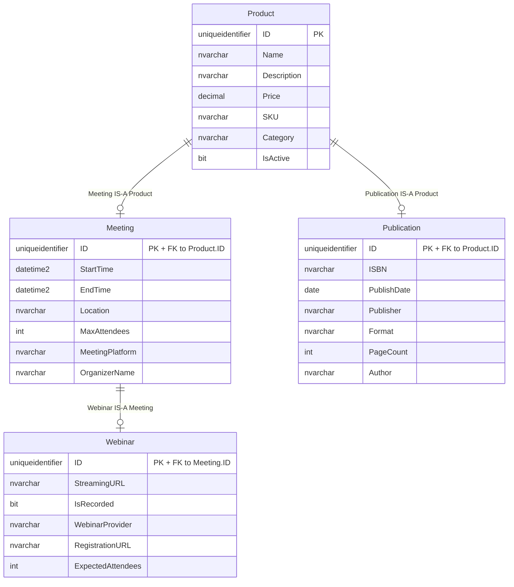
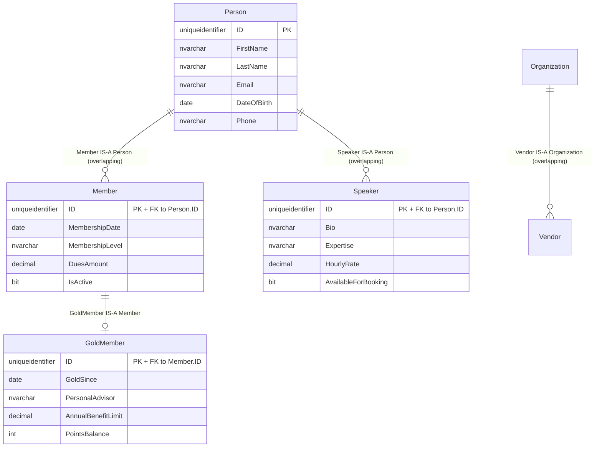
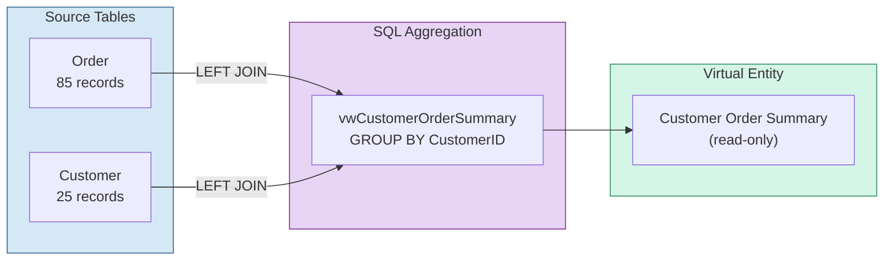

# AdvancedEntities Demo

A comprehensive demonstration of three key MemberJunction features: **Disjoint IS-A Type Relationships**, **Overlapping IS-A Subtypes**, and **Virtual Entities** (read-only aggregation views).

## What This Demo Includes

| Feature | Tables | Description |
|---------|--------|-------------|
| IS-A (Disjoint) | Product, Meeting, Webinar, Publication | 3-level type hierarchy; a Product is one child type only |
| IS-A (Overlapping) | Person, Member, GoldMember, Speaker | Overlapping subtypes; a Person can be Member AND Speaker |
| IS-A (Overlapping) | Organization, Vendor | Extensible overlapping parent with one child type |
| Virtual Entity | Customer, Order, 4 aggregation views | Read-only entities backed by SQL views |

**Sample Data**: 20 products, 7 meetings, 4 webinars, 5 publications, 100 persons, 60 members, 20 gold members, 50 speakers, 50 organizations, 30 vendors, 25 customers, 85 orders

## IS-A Type Relationships

### Concept

IS-A (Table-Per-Type) is an inheritance pattern where a child entity **is a** specialized version of its parent. In the database, the child table's primary key is also a foreign key to the parent's primary key — they share the **exact same UUID**.



### Shared Primary Key Pattern

The core mechanism is that child tables do **not** generate their own IDs. The UUID is created once at the root (`Product`) and flows down the chain:

```
Product.ID = 'A2000001-0002-4000-8000-000000000002'   (root — generates the UUID)
    |
    +-- Meeting.ID = 'A2000001-0002-4000-8000-000000000002'   (same UUID, FK to Product)
            |
            +-- Webinar.ID = 'A2000001-0002-4000-8000-000000000002'   (same UUID, FK to Meeting)
```

Three table rows, one UUID. A `SELECT` joining all three on `ID` returns exactly one combined row.

### Disjoint Subtypes

A single Product ID can appear in **either** Meeting **or** Publication, but never both. This is enforced at the application level by MemberJunction. In the sample data:

- Product IDs `M01`-`M07` are Meetings (some are also Webinars)
- Product IDs `B01`-`B05` are Publications
- Product IDs `P01`-`P08` are plain Products (neither Meeting nor Publication)
- No overlap between Meeting IDs and Publication IDs

### What CodeGen Generates for IS-A

After registering these as MJ entities and setting `ParentID`:

| Generated Artifact | Description |
|-------------------|-------------|
| **SQL Views** | `vwMeetings` JOINs Meeting + Product fields; `vwWebinars` JOINs Webinar + Meeting + Product |
| **Stored Procedures** | `spCreateMeeting` only inserts Meeting-specific fields; Product fields saved via parent chain |
| **TypeScript Classes** | `MeetingEntity` has getters/setters for both Meeting and Product fields |
| **GraphQL Mutations** | `CreateMeeting` input includes all inherited Product fields |
| **Field Metadata** | Inherited fields marked `IsVirtual=true` with source tracking |

## Overlapping IS-A Subtypes

### Concept

While the Product hierarchy uses **disjoint** subtypes (a product is either a Meeting or a Publication, never both), real-world modeling often requires **overlapping** subtypes. A Person can simultaneously be a Member, a Speaker, or both.

MemberJunction supports this via the `AllowMultipleSubtypes` flag on the parent entity. When enabled, the disjoint enforcement is skipped, and multiple child type records can coexist for the same parent PK.



### Disjoint vs Overlapping — Side by Side

| Aspect | Disjoint (Product) | Overlapping (Person) |
|--------|-------------------|---------------------|
| `AllowMultipleSubtypes` | `false` (default) | `true` |
| Same PK in multiple children | Blocked at save time | Allowed |
| `ISAChild` accessor | Returns the single child | Returns `null` (use `ISAChildren`) |
| `LeafEntity` from parent | Walks to deepest child | Returns `this` (parent is its own leaf) |
| Save from parent | Delegates to leaf | Saves parent only |
| Delete child | Cascades delete to parent | Checks for remaining siblings first |
| Record Changes | Standard chain | Propagated to sibling branches |

### Sample Data Distribution

The 100 Person records demonstrate all possible subtype combinations:

| Category | Person IDs | Count | Description |
|----------|------------|-------|-------------|
| Member ONLY | PE001-PE030 | 30 | Members who are not speakers |
| Both Member AND Speaker | PE031-PE060 | 30 | Overlapping! Same person in both tables |
| Speaker ONLY | PE061-PE080 | 20 | Speakers who are not members |
| Standalone Person | PE081-PE100 | 20 | No child type records |
| GoldMember | PE001-PE020 | 20 | Subset of members with gold tier |

### Overlapping Queries

```sql
-- Find all persons who are BOTH Member and Speaker
SELECT p.FirstName, p.LastName, m.MembershipLevel, s.Expertise, s.HourlyRate
FROM [AdvancedEntities].[Person] p
JOIN [AdvancedEntities].[Member] m ON p.ID = m.ID
JOIN [AdvancedEntities].[Speaker] s ON p.ID = s.ID
ORDER BY p.LastName;

-- Show the subtype distribution
SELECT
    CASE
        WHEN m.ID IS NOT NULL AND s.ID IS NOT NULL THEN 'Both Member AND Speaker'
        WHEN m.ID IS NOT NULL THEN 'Member ONLY'
        WHEN s.ID IS NOT NULL THEN 'Speaker ONLY'
        ELSE 'Standalone Person'
    END AS SubtypeCategory,
    COUNT(*) AS PersonCount
FROM [AdvancedEntities].[Person] p
LEFT JOIN [AdvancedEntities].[Member] m ON p.ID = m.ID
LEFT JOIN [AdvancedEntities].[Speaker] s ON p.ID = s.ID
GROUP BY
    CASE
        WHEN m.ID IS NOT NULL AND s.ID IS NOT NULL THEN 'Both Member AND Speaker'
        WHEN m.ID IS NOT NULL THEN 'Member ONLY'
        WHEN s.ID IS NOT NULL THEN 'Speaker ONLY'
        ELSE 'Standalone Person'
    END;

-- 3-level chain: GoldMember with all inherited fields
SELECT p.FirstName, p.LastName, p.Email,
       m.MembershipLevel, m.DuesAmount,
       g.GoldSince, g.PersonalAdvisor, g.PointsBalance
FROM [AdvancedEntities].[GoldMember] g
JOIN [AdvancedEntities].[Member] m ON g.ID = m.ID
JOIN [AdvancedEntities].[Person] p ON m.ID = p.ID;
```

### CodeGen Configuration for Overlapping Subtypes

The `database-metadata-config.json` uses two sections to configure overlapping subtypes. The `ISARelationships` section declares parent-child relationships (same as disjoint), and the `Entities` section sets `AllowMultipleSubtypes` on the parent entities:

```json
{
  "ISARelationships": [
    { "ChildEntity": "Member",     "ParentEntity": "Person", "SchemaName": "AdvancedEntities" },
    { "ChildEntity": "GoldMember", "ParentEntity": "Member", "SchemaName": "AdvancedEntities" },
    { "ChildEntity": "Speaker",    "ParentEntity": "Person", "SchemaName": "AdvancedEntities" }
  ],
  "Entities": [
    { "BaseTable": "Person", "SchemaName": "AdvancedEntities", "AllowMultipleSubtypes": true }
  ]
}
```

The `Entities` section is a general-purpose mechanism for setting any Entity-table attribute by `BaseTable` + `SchemaName`. Here it sets `AllowMultipleSubtypes = 1` on the Person entity. The GoldMember → Member relationship uses standard disjoint IS-A behavior since Member is not listed in `Entities`.

## Virtual Entities

### Concept

A Virtual Entity is a read-only MJ entity backed by a SQL view instead of a physical table. It's ideal for aggregations, cross-table joins, and computed datasets that shouldn't be directly editable.



### The Aggregation View

`vwCustomerOrderSummary` produces one row per customer with:

| Column | Source | Description |
|--------|--------|-------------|
| CustomerID | Customer.ID | Primary key (soft PK), also foreign key to Customer |
| FirstName, LastName, Email | Customer | Passed through from Customer table |
| Company, City, State, Country | Customer | Customer profile data |
| Tier | Customer | Loyalty tier (Bronze/Silver/Gold/Platinum) |
| CustomerSince | Customer | Account creation date |
| TotalOrders | COUNT(Order.ID) | Number of orders placed |
| LifetimeSpend | SUM(TotalAmount) | Total money spent |
| AvgOrderValue | AVG(TotalAmount) | Average order value |
| SmallestOrder | MIN(TotalAmount) | Smallest single order |
| LargestOrder | MAX(TotalAmount) | Largest single order |
| FirstOrderDate | MIN(OrderDate) | Date of first order |
| LastOrderDate | MAX(OrderDate) | Date of most recent order |
| TotalItemsPurchased | SUM(ItemCount) | Total items across all orders |
| CancelledOrders | COUNT where Cancelled | Number of cancelled orders |
| DeliveredOrders | COUNT where Delivered | Number of delivered orders |
| DaysSinceLastOrder | DATEDIFF | Days since most recent order |

The `LEFT JOIN` ensures customers with zero orders still appear (with `TotalOrders=0`, `LifetimeSpend=0`, and `NULL` date fields). Two test customers (`C24`, `C25`) have no orders specifically to verify this behavior.

### Read-Only Enforcement

MemberJunction enforces read-only access on virtual entities at three levels:

1. **Runtime guard** — `BaseEntity.CheckPermissions()` throws on Create/Update/Delete attempts
2. **API flags** — `AllowCreateAPI`, `AllowUpdateAPI`, `AllowDeleteAPI` all set to `false`
3. **No stored procedures** — CodeGen skips SP generation for virtual entities

## Setup Instructions

### Step 1: Run the SQL Script

Execute `create-schema.sql` against your SQL Server database:

```sql
-- In SSMS, Azure Data Studio, or sqlcmd:
-- Open and execute create-schema.sql
```

The script is **idempotent** — it drops and recreates all objects if they already exist.

### Step 2: Verify

The script includes verification queries at the end. Check:
- Row counts: 20 products, 7 meetings, 4 webinars, 5 publications, 25 customers, 85 orders, 100 persons, 60 members, 20 gold members, 50 speakers, 50 organizations, 30 vendors
- IS-A PK sharing: every Meeting ID exists in Product; every Member/Speaker ID exists in Person
- Disjoint subtypes: 0 violations (no ID in both Meeting and Publication)
- Overlapping subtypes: 30 persons appear in BOTH Member and Speaker tables
- Distribution breakdown: 30 member-only, 30 both, 20 speaker-only, 20 standalone
- Virtual view: 25 rows, 2 with zero orders

### Step 3: Configure Metadata

This demo includes a `database-metadata-config.json` file that declares both the virtual entity and IS-A relationships. Merge its contents into your main config file:

```bash
# Copy/merge Demos/AdvancedEntities/database-metadata-config.json
# into config/database-metadata-config.json
```

The config file declares:

**Virtual Entity** — CodeGen auto-creates the entity with `VirtualEntity=1`, sets the soft PK on `CustomerID`, and configures the soft FK back to the Customer table:
```json
{
  "VirtualEntities": [{
    "ViewName": "vwCustomerOrderSummary",
    "SchemaName": "AdvancedEntities",
    "EntityName": "Customer Order Summaries",
    "PrimaryKey": ["CustomerID"],
    "ForeignKeys": [{ "FieldName": "CustomerID", "RelatedTable": "Customer", ... }]
  }]
}
```

**IS-A Relationships (Disjoint)** — CodeGen auto-sets `ParentID` on the child entities after they're discovered from the schema:
```json
{
  "ISARelationships": [
    { "ChildEntity": "Meetings",      "ParentEntity": "Products",  "SchemaName": "AdvancedEntities" },
    { "ChildEntity": "Webinars",      "ParentEntity": "Meetings",  "SchemaName": "AdvancedEntities" },
    { "ChildEntity": "Publications",  "ParentEntity": "Products",  "SchemaName": "AdvancedEntities" }
  ]
}
```

**IS-A Relationships (Overlapping)** — Same `ISARelationships` format (no special flags), plus an `Entities` section to enable overlapping on the parent:
```json
{
  "ISARelationships": [
    { "ChildEntity": "Member",     "ParentEntity": "Person",       "SchemaName": "AdvancedEntities" },
    { "ChildEntity": "GoldMember", "ParentEntity": "Member",       "SchemaName": "AdvancedEntities" },
    { "ChildEntity": "Speaker",    "ParentEntity": "Person",       "SchemaName": "AdvancedEntities" },
    { "ChildEntity": "Vendor",     "ParentEntity": "Organization", "SchemaName": "AdvancedEntities" }
  ],
  "Entities": [
    { "BaseTable": "Person",       "SchemaName": "AdvancedEntities", "AllowMultipleSubtypes": true },
    { "BaseTable": "Organization", "SchemaName": "AdvancedEntities", "AllowMultipleSubtypes": true }
  ]
}
```

### Step 4: Run CodeGen

```bash
npm run mj:codegen
```

CodeGen will automatically:
1. **Discover** the AdvancedEntities tables and create Entity metadata records
2. **Create the virtual entity** from the `VirtualEntities` config (with soft PK/FK)
3. **Set ParentID** on child entities from the `ISARelationships` config
4. **Apply Entity attributes** from the `Entities` config (e.g., AllowMultipleSubtypes on Person, Organization)
5. **Generate views** for IS-A entities (JOINing parent fields via shared PK)
6. **Generate stored procedures** (single-table inserts for IS-A entities)
7. **Sync entity field metadata** from `sys.columns`
8. **Generate TypeScript classes** with inherited field accessors
9. **Skip SP generation** for the virtual entity (read-only)

### Step 5: Run RefreshMetadata

```bash
# Or run via Flyway
R__RefreshMetadata.sql
```

This recompiles views and syncs field metadata.

## Exploring the Data

### IS-A Queries

```sql
-- See a Webinar with all inherited fields (Product + Meeting + Webinar)
SELECT p.Name, p.Price, p.SKU,
       m.StartTime, m.EndTime, m.MeetingPlatform, m.OrganizerName,
       w.WebinarProvider, w.StreamingURL, w.IsRecorded
FROM [AdvancedEntities].[Webinar] w
JOIN [AdvancedEntities].[Meeting] m ON w.ID = m.ID
JOIN [AdvancedEntities].[Product] p ON m.ID = p.ID;

-- Show the full hierarchy — which products are specialized
SELECT p.Name, p.SKU, p.Category,
       CASE
           WHEN w.ID IS NOT NULL THEN 'Webinar (IS-A Meeting IS-A Product)'
           WHEN m.ID IS NOT NULL THEN 'Meeting (IS-A Product)'
           WHEN pub.ID IS NOT NULL THEN 'Publication (IS-A Product)'
           ELSE 'Product (base only)'
       END AS [EntityType]
FROM [AdvancedEntities].[Product] p
LEFT JOIN [AdvancedEntities].[Meeting] m ON p.ID = m.ID
LEFT JOIN [AdvancedEntities].[Webinar] w ON m.ID = w.ID
LEFT JOIN [AdvancedEntities].[Publication] pub ON p.ID = pub.ID
ORDER BY [EntityType], p.Name;
```

### Virtual Entity Queries

```sql
-- Top customers by lifetime spend
SELECT CustomerID, FirstName + ' ' + LastName AS Name, Tier,
       TotalOrders, LifetimeSpend, AvgOrderValue, DaysSinceLastOrder
FROM [AdvancedEntities].[vwCustomerOrderSummary]
ORDER BY LifetimeSpend DESC;

-- Customers at risk (high tier but no recent orders)
SELECT FirstName + ' ' + LastName AS Name, Tier, LifetimeSpend,
       DaysSinceLastOrder, LastOrderDate
FROM [AdvancedEntities].[vwCustomerOrderSummary]
WHERE Tier IN ('Gold', 'Platinum')
  AND DaysSinceLastOrder > 180;

-- Zero-order customers (tests LEFT JOIN)
SELECT FirstName + ' ' + LastName AS Name, CustomerSince, Tier
FROM [AdvancedEntities].[vwCustomerOrderSummary]
WHERE TotalOrders = 0;
```

## Schema Reference

### AdvancedEntities.Product

| Column | Type | Nullable | Default | Description |
|--------|------|----------|---------|-------------|
| ID | UNIQUEIDENTIFIER | No | NEWSEQUENTIALID() | Root PK for IS-A chain |
| Name | NVARCHAR(200) | No | | Product display name |
| Description | NVARCHAR(MAX) | Yes | | Detailed description |
| Price | DECIMAL(18,2) | No | | Price in USD |
| SKU | NVARCHAR(50) | No | | Unique stock keeping unit |
| Category | NVARCHAR(100) | Yes | | Product category |
| IsActive | BIT | No | 1 | Active/inactive flag |

### AdvancedEntities.Meeting

| Column | Type | Nullable | Default | Description |
|--------|------|----------|---------|-------------|
| ID | UNIQUEIDENTIFIER | No | *(shared PK)* | Same UUID as Product.ID |
| StartTime | DATETIME2 | No | | Meeting start time |
| EndTime | DATETIME2 | No | | Meeting end time |
| Location | NVARCHAR(500) | Yes | | Physical or virtual location |
| MaxAttendees | INT | Yes | | Capacity limit |
| MeetingPlatform | NVARCHAR(100) | Yes | | Zoom, Teams, etc. |
| OrganizerName | NVARCHAR(200) | No | | Organizer name |

### AdvancedEntities.Webinar

| Column | Type | Nullable | Default | Description |
|--------|------|----------|---------|-------------|
| ID | UNIQUEIDENTIFIER | No | *(shared PK)* | Same UUID as Meeting.ID and Product.ID |
| StreamingURL | NVARCHAR(1000) | Yes | | Live stream URL |
| IsRecorded | BIT | No | 0 | Will be recorded |
| WebinarProvider | NVARCHAR(100) | No | | Hosting platform |
| RegistrationURL | NVARCHAR(1000) | Yes | | Sign-up link |
| ExpectedAttendees | INT | Yes | | Expected attendance |

### AdvancedEntities.Publication

| Column | Type | Nullable | Default | Description |
|--------|------|----------|---------|-------------|
| ID | UNIQUEIDENTIFIER | No | *(shared PK)* | Same UUID as Product.ID |
| ISBN | NVARCHAR(20) | Yes | | ISBN for books |
| PublishDate | DATE | No | | Release date |
| Publisher | NVARCHAR(200) | No | | Publisher name |
| Format | NVARCHAR(50) | No | | eBook, Print, AudioBook, or PDF |
| PageCount | INT | Yes | | Page count |
| Author | NVARCHAR(200) | No | | Author name |

### AdvancedEntities.Customer

| Column | Type | Nullable | Default | Description |
|--------|------|----------|---------|-------------|
| ID | UNIQUEIDENTIFIER | No | NEWSEQUENTIALID() | Customer PK |
| FirstName | NVARCHAR(100) | No | | First name |
| LastName | NVARCHAR(100) | No | | Last name |
| Email | NVARCHAR(255) | No | | Unique email |
| Phone | NVARCHAR(50) | Yes | | Phone number |
| Company | NVARCHAR(200) | Yes | | Company name |
| City | NVARCHAR(100) | Yes | | City |
| State | NVARCHAR(50) | Yes | | State/province |
| Country | NVARCHAR(100) | No | USA | Country |
| CustomerSince | DATE | No | | Account creation date |
| Tier | NVARCHAR(20) | No | | Bronze, Silver, Gold, or Platinum |

### AdvancedEntities.Order

| Column | Type | Nullable | Default | Description |
|--------|------|----------|---------|-------------|
| ID | UNIQUEIDENTIFIER | No | NEWSEQUENTIALID() | Order PK |
| CustomerID | UNIQUEIDENTIFIER | No | | FK to Customer.ID |
| OrderDate | DATETIME2 | No | | Order timestamp |
| TotalAmount | DECIMAL(18,2) | No | | Order total in USD |
| Status | NVARCHAR(20) | No | | Pending, Processing, Shipped, Delivered, Cancelled |
| ItemCount | INT | No | 1 | Number of items |
| ShippingAddress | NVARCHAR(500) | Yes | | Delivery address |
| Notes | NVARCHAR(MAX) | Yes | | Special instructions |

### AdvancedEntities.Person

| Column | Type | Nullable | Default | Description |
|--------|------|----------|---------|-------------|
| ID | UNIQUEIDENTIFIER | No | NEWSEQUENTIALID() | Root PK for overlapping IS-A chain |
| FirstName | NVARCHAR(100) | No | | First name |
| LastName | NVARCHAR(100) | No | | Last name |
| Email | NVARCHAR(255) | No | | Unique email address |
| DateOfBirth | DATE | Yes | | Date of birth |
| Phone | NVARCHAR(50) | Yes | | Phone number |

### AdvancedEntities.Member

| Column | Type | Nullable | Default | Description |
|--------|------|----------|---------|-------------|
| ID | UNIQUEIDENTIFIER | No | *(shared PK)* | Same UUID as Person.ID |
| MembershipDate | DATE | No | | Date membership started |
| MembershipLevel | NVARCHAR(50) | No | | Basic, Standard, Premium, or Elite |
| DuesAmount | DECIMAL(18,2) | No | | Annual dues in USD |
| IsActive | BIT | No | 1 | Active/inactive flag |

### AdvancedEntities.GoldMember

| Column | Type | Nullable | Default | Description |
|--------|------|----------|---------|-------------|
| ID | UNIQUEIDENTIFIER | No | *(shared PK)* | Same UUID as Member.ID and Person.ID |
| GoldSince | DATE | No | | Date gold status was granted |
| PersonalAdvisor | NVARCHAR(200) | Yes | | Assigned advisor name |
| AnnualBenefitLimit | DECIMAL(18,2) | No | 50000.00 | Maximum annual benefit amount |
| PointsBalance | INT | No | 0 | Current rewards points balance |

### AdvancedEntities.Speaker

| Column | Type | Nullable | Default | Description |
|--------|------|----------|---------|-------------|
| ID | UNIQUEIDENTIFIER | No | *(shared PK)* | Same UUID as Person.ID |
| Bio | NVARCHAR(MAX) | Yes | | Speaker biography |
| Expertise | NVARCHAR(200) | No | | Area of expertise |
| HourlyRate | DECIMAL(18,2) | No | | Speaking fee per hour |
| AvailableForBooking | BIT | No | 1 | Available for new engagements |

### AdvancedEntities.Organization

| Column | Type | Nullable | Default | Description |
|--------|------|----------|---------|-------------|
| ID | UNIQUEIDENTIFIER | No | NEWSEQUENTIALID() | Root PK for organization IS-A chain |
| Name | NVARCHAR(200) | No | | Organization name |
| Website | NVARCHAR(500) | Yes | | Organization website URL |
| Industry | NVARCHAR(100) | Yes | | Industry sector |
| FoundedYear | INT | Yes | | Year the organization was founded |
| EmployeeCount | INT | Yes | | Number of employees |

### AdvancedEntities.Vendor

| Column | Type | Nullable | Default | Description |
|--------|------|----------|---------|-------------|
| ID | UNIQUEIDENTIFIER | No | *(shared PK)* | Same UUID as Organization.ID |
| VendorCode | NVARCHAR(20) | No | | Unique vendor code |
| PaymentTerms | NVARCHAR(50) | No | | Net-15, Net-30, Net-45, Net-60, or Prepaid |
| TaxID | NVARCHAR(50) | Yes | | Tax identification number |
| PreferredCurrency | NVARCHAR(10) | No | USD | Payment currency |
| Rating | DECIMAL(3,1) | Yes | | Vendor rating (0.0–5.0) |

## Related Documentation

- [IS-A Relationships Guide](../../packages/MJCore/docs/isa-relationships.md) - Deep-dive on MJ's IS-A implementation
- [Virtual Entities Guide](../../packages/MJCore/docs/virtual-entities.md) - Deep-dive on virtual entity patterns
- [MJCore README](../../packages/MJCore/README.md) - Core framework overview
- [CodeGenLib README](../../packages/CodeGenLib/README.md) - Code generation system
