# Association Sample Database - Complete Schema Overview

Comprehensive documentation of all 58 tables across the Cheese Industry Association database.

## 🏗️ Database Architecture

### Overview

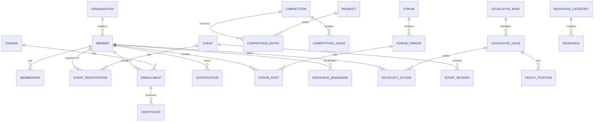

### Schema Organization

All 58 tables reside in the **`AssociationDemo`** schema, organized into 13 logical domains:

| Domain | Tables | Purpose |
|--------|--------|---------|
| **Core Membership** | 4 | Member profiles, organizations, membership types and records |
| **Events** | 3 | Conferences, workshops, sessions, registrations |
| **Learning** | 3 | Courses, enrollments, certificates |
| **Finance** | 3 | Invoices, line items, payments |
| **Marketing** | 3 | Campaigns, segments, targeting |
| **Email** | 3 | Templates, sends, click tracking |
| **Chapters** | 3 | Geographic/interest groups, membership, leadership |
| **Governance** | 4 | Committees, board positions, assignments |
| **Forums** | 8 | Discussion forums, threads, posts, moderation |
| **Resources** | 6 | Knowledge base, categories, downloads, bookmarks |
| **Certifications** | 6 | Professional credentials, CE credits, renewals |
| **Products & Awards** | 6 | Product catalog, competitions, judging, awards |
| **Legislative** | 6 | Legislative tracking, advocacy, policy positions |

---

## 📋 Phase 0: Core Domains (26 Tables)

### Core Membership Domain (4 tables)

Foundation for all other domains.

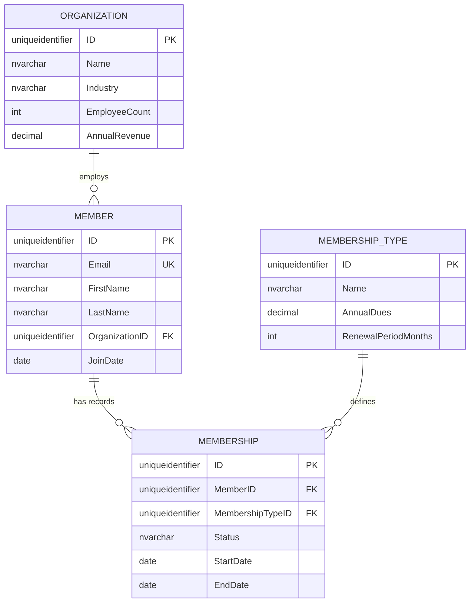

**Key Tables:**
- **Organization**: 40 cheese producers, retailers, suppliers
- **Member**: 2,000 industry professionals
- **MembershipType**: 8 types (Individual, Corporate, Student, etc.)
- **Membership**: 2,500+ records including renewal history

### Events Domain (3 tables)

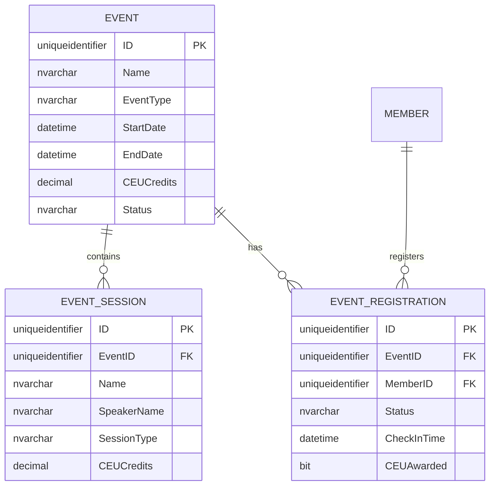

**Data**: 21 events, 85 sessions, 1,400+ registrations

### Learning Domain (3 tables)

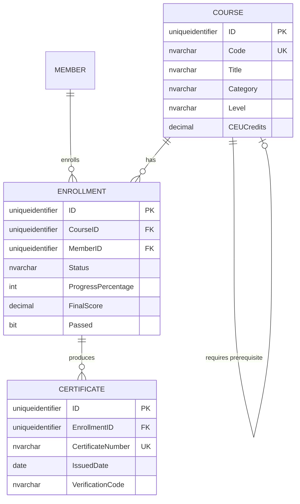

**Data**: 60 courses, 900 enrollments, 650+ certificates

### Finance, Marketing, Email Domains (9 tables)

**Finance**: Invoice generation, line items, payment processing
**Marketing**: Campaign management, segmentation, targeting
**Email**: Template library, sends, engagement tracking

---

## 📋 Phase 1: Community Forums (8 Tables)

Knowledge sharing and member engagement.

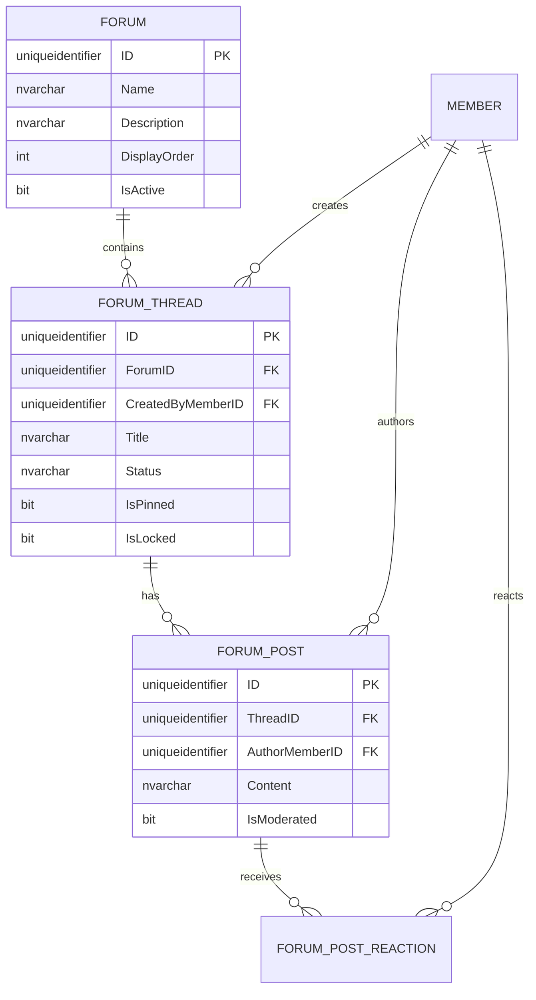

**Features:**
- 5 specialized forums (Cheese Making, Raw Milk, Business, Equipment, Events)
- Thread management (pinned, locked, closed)
- Post moderation and reactions (like, helpful, expert)
- Member reputation tracking
- 50 threads, 200+ posts

---

## 📋 Phase 2: Resource Library (6 Tables)

Centralized knowledge base and document repository.

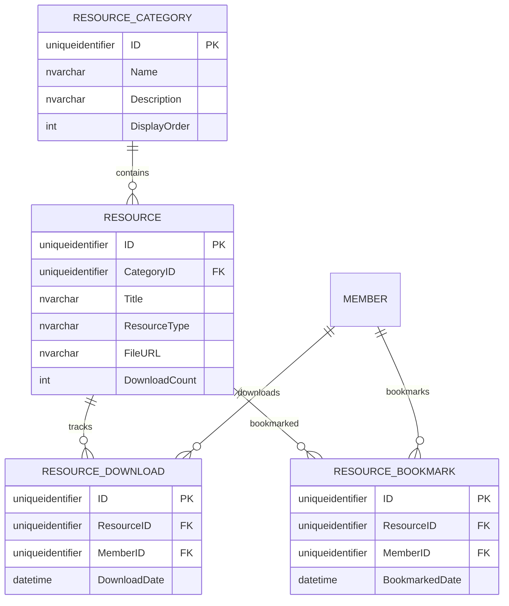

**Content Types:**
- Best Practice Guides
- Research Papers
- Regulatory Templates
- Industry Reports
- Video Tutorials
- Webinar Recordings

**Data**: 100 resources across 10 categories

---

## 📋 Phase 3: Certifications (6 Tables)

Professional credential management and continuing education.

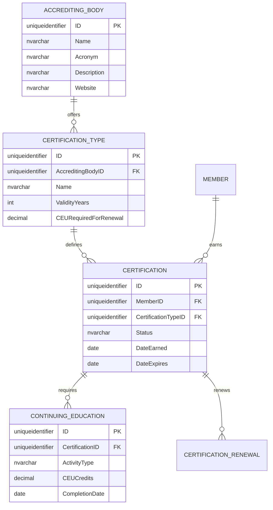

**Certifications:**
- American Cheese Society (ACS)
- Wisconsin Master Cheesemaker
- American Dairy Science Association (ADSA)
- Food Safety Modernization Act (FSMA)

**Data**: 413 certifications, 85 CE records, 19 renewals

---

## 📋 Phase 4: Products & Awards (6 Tables)

Product showcase and competition management.

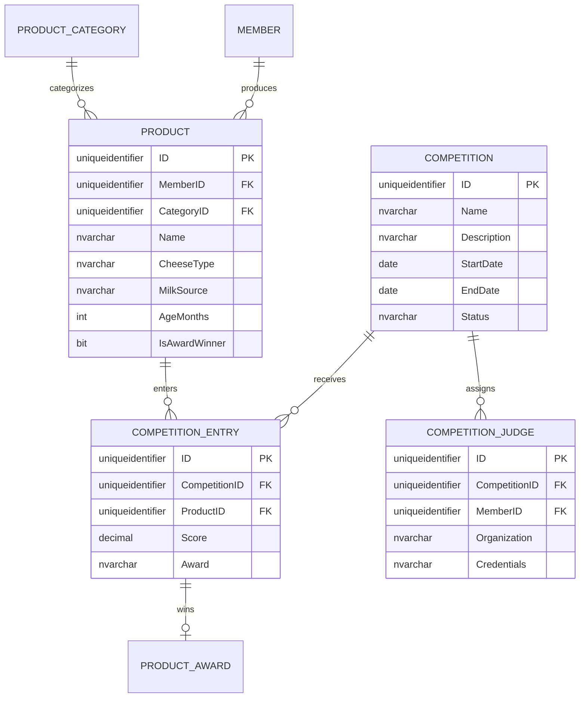

**Competitions:**
- American Cheese Society Competition
- World Championship Cheese Contest
- International Cheese & Dairy Awards
- Good Food Awards
- US Championship Cheese Contest

**Data**: 110 products, 110 entries, 29 judges (11 organizations), 43 awards

---

## 📋 Phase 5: Legislative Tracking (6 Tables)

Government relations and advocacy management.

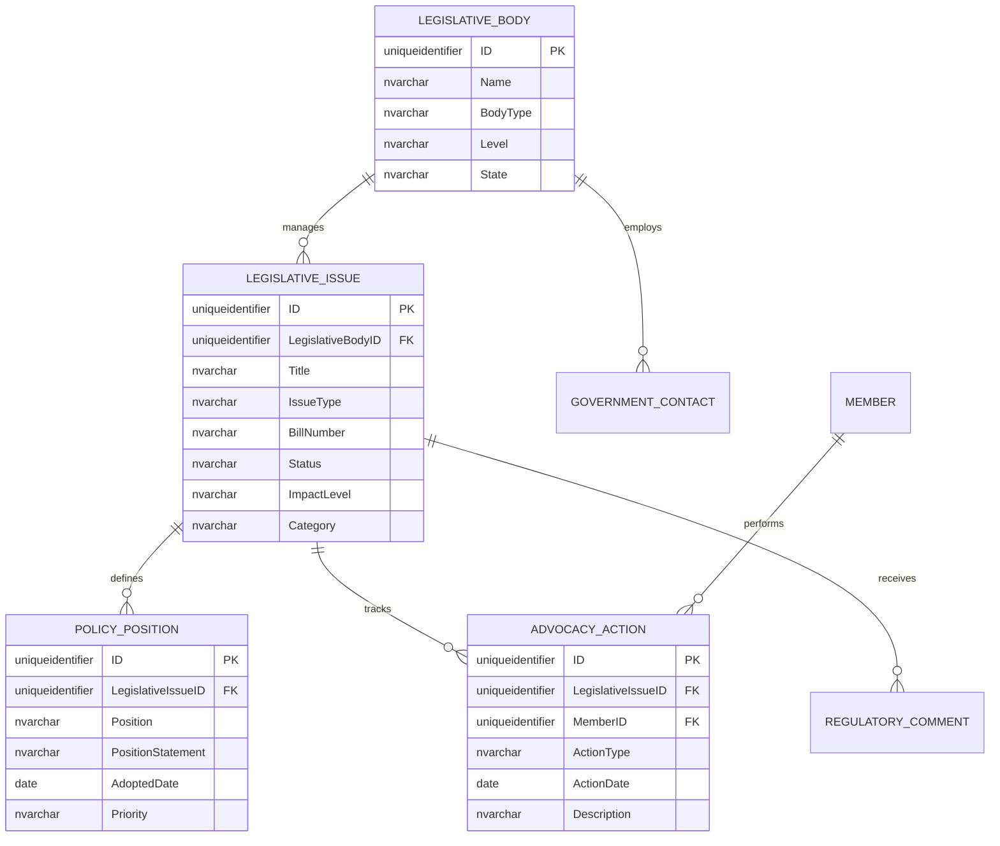

**Legislative Bodies:**
- Federal: US Senate, House, FDA, USDA
- State: Wisconsin, California, Vermont

**Key Issues:**
- Raw milk cheese aging requirements (FDA)
- Food labeling modernization
- Dairy pricing reform
- Import/export tariffs
- Environmental regulations
- Animal welfare standards

**Data**: 10 bodies, 12 issues, 7 positions, 10 contacts, 150 actions, 1 comment

---

## 🔗 Cross-Domain Relationships

### Member-Centric View

Every domain connects to the Member table:

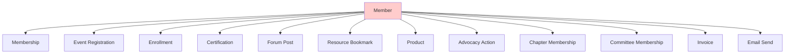

### Financial Flow

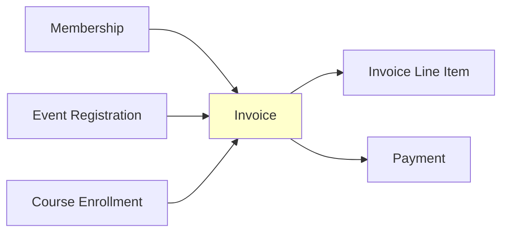

---

## 📐 Design Patterns

### 1. Evergreen Dates
All dates calculated relative to `GETDATE()` using `DATEADD()`:
```sql
JoinDate = DATEADD(YEAR, -2, @EndDate)  -- 2 years ago
```

### 2. Status Enumerations
CHECK constraints define allowed values:
```sql
Status NVARCHAR(20) CHECK (Status IN ('Active', 'Lapsed', 'Cancelled'))
```

### 3. Soft Deletes
`IsActive` flags instead of hard deletes:
```sql
IsActive BIT DEFAULT 1
```

### 4. Audit Trails
Renewal history via multiple membership records per member

### 5. Polymorphic Relationships
`RelatedEntityType` + `RelatedEntityID` in InvoiceLineItem

---

## 🎯 Key Indexing Strategy

**Primary Keys**: All tables use `UNIQUEIDENTIFIER` with `NEWSEQUENTIALID()`

**Foreign Keys**: Automatically indexed by MemberJunction CodeGen

**Unique Constraints**:
- InvoiceNumber
- CertificateNumber
- CourseCode
- Email (Member)

**Common Filters**: Status fields, date ranges, type fields

---

## 📊 Table Summary

| Phase | Tables | Purpose | Records |
|-------|--------|---------|---------|
| **Core** | 26 | Base association management | 5,000+ |
| **Phase 1** | 8 | Community forums | 250+ |
| **Phase 2** | 6 | Resource library | 300+ |
| **Phase 3** | 6 | Certifications | 500+ |
| **Phase 4** | 6 | Products & awards | 300+ |
| **Phase 5** | 6 | Legislative tracking | 200+ |
| **TOTAL** | **58** | Complete association system | **10,000+** |

---

For sample queries, see [SAMPLE_QUERIES.md](SAMPLE_QUERIES.md)

For business scenarios, see [BUSINESS_SCENARIOS.md](BUSINESS_SCENARIOS.md)
