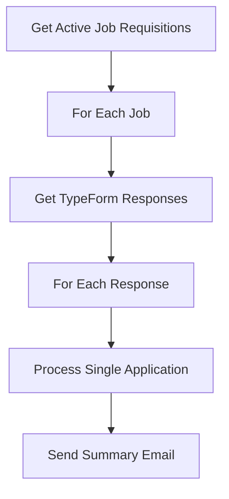
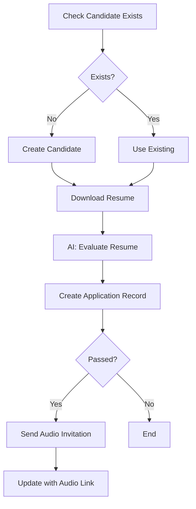
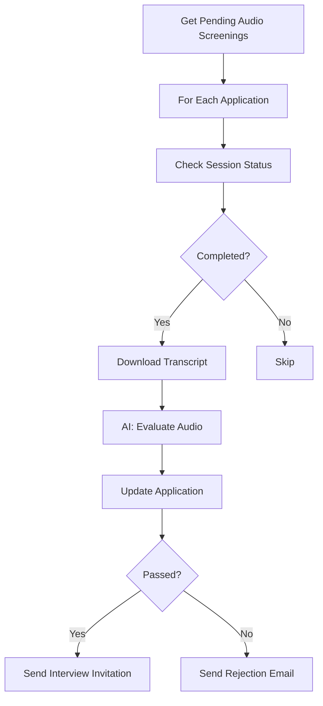

# Recruiting Pipeline Demo

A comprehensive recruiting and hiring management system built on MemberJunction, demonstrating automated candidate screening, AI-powered evaluations, and multi-stage interview workflows.

## Overview

This demo showcases a complete recruiting pipeline that automates the hiring process from application submission through final offer. It integrates with TypeForm for application collection, uses AI for resume and audio screening evaluation, and provides comprehensive tracking and analytics throughout the candidate journey.

## Architecture

**Agent Type:** Flow Agents (Deterministic workflows)
**Integrations:**
- TypeForm for application submission
- AI Models (GPT-4o, Gemini) for candidate evaluation
- Email service for candidate communication
- Audio agent service for technical prescreening

## Key Features

### 1. Application Processing
- Automated TypeForm monitoring for new applications
- Resume download and text extraction
- AI-powered resume evaluation with multi-dimensional scoring
- Automatic candidate deduplication by email
- Pass/fail screening with detailed reasoning

### 2. Audio Prescreening
- Integration with audio agent service for tech screening
- AI evaluation of conversation quality (communication, technical knowledge, problem-solving)
- Automatic progression to interview stage for qualified candidates
- Audio recording and transcript storage

### 3. Interview Management
- Multiple interview types (Phone, Technical, Behavioral, Panel, Final)
- Interviewer feedback collection
- AI-powered synthesis of multi-interviewer feedback
- Automated next-step recommendations

### 4. Analytics & Dashboards
- Real-time recruiting metrics (open positions, applications, scores)
- Candidate pipeline funnel visualization
- Stage-by-stage conversion tracking
- Top candidate identification

## Project Structure

```
/Demos/RecruitingPipeline/
├── sql/
│   ├── HR Schema.sql                    # Database schema (5 tables)
│   └── HR Schema - Drop.sql             # Cleanup script
├── metadata/
│   ├── agents/                          # 5 flow agents
│   │   ├── application-processing-flow.json
│   │   ├── process-single-application.json
│   │   ├── audio-screening-monitor.json
│   │   ├── process-audio-screening.json
│   │   └── interview-feedback-processor.json
│   ├── prompts/                         # 3 AI prompts
│   │   ├── evaluate-resume.json
│   │   ├── evaluate-audio-screening.json
│   │   ├── synthesize-interview-feedback.json
│   │   └── templates/
│   │       ├── evaluate-resume.md
│   │       ├── evaluate-audio-screening.md
│   │       └── synthesize-interview-feedback.md
│   ├── dashboards/                      # 2 dashboards
│   │   ├── recruiting-dashboard.json
│   │   └── job-pipeline-dashboard.json
│   └── .mj-sync.json                    # Metadata sync config
├── code/UI/
│   └── src/
│       ├── forms/                       # 4 form components
│       ├── dashboards/                  # 2 dashboard components
│       ├── services/                    # Data access service
│       └── shared/                      # Shared styles
└── README.md
```

## Database Schema

### Core Tables

#### HR.JobRequisition
Master table for job openings. Includes TypeForm integration, evaluation criteria, and hiring manager info.

#### HR.Candidate
Individual candidate profiles with contact info, experience, and skills.

#### HR.Application
Links candidates to job requisitions. Stores evaluation scores, audio session info, and interview scheduling details.

#### HR.Interview
Individual interview sessions with feedback, scores, and recommendations.

#### HR.ApplicationNote
Activity log for applications with system-generated and manual notes.

## Setup Instructions

### 1. Install Database Schema

```bash
cd /home/user/MJ/Demos/RecruitingPipeline/sql
sqlcmd -S your-server -d your-database -i "HR Schema.sql"
```

### 2. Run CodeGen

After schema installation, run MemberJunction CodeGen to generate entity classes:

```bash
cd /home/user/MJ
npm run codegen
```

This creates strongly-typed entity classes in `packages/MJCoreEntities/src/generated/entity_subclasses.ts`.

### 3. Sync Metadata

Push agents, prompts, and dashboards to the database:

```bash
cd /home/user/MJ/Demos/RecruitingPipeline/metadata
npx mj-sync push
```

### 4. Configure Integrations

Set environment variables for external services:

```bash
# TypeForm Integration
export BIZAPPS_TYPEFORM_API_TOKEN=your_typeform_token

# Audio Agent Service
export AUDIO_SERVICE_API_KEY=your_audio_service_key

# Email Service
export EMAIL_SERVICE_API_KEY=your_email_service_key
```

### 5. Build UI Components (Optional)

```bash
cd /home/user/MJ/Demos/RecruitingPipeline/code/UI
npm install
npm run build
```

## Testing the Demo

### Method 1: Via MJ Explorer (Recommended)

1. Open MJ Explorer web interface
2. Navigate to **AI Agents**
3. Find "Application Processing Flow" agent
4. Click **Run Agent**
5. Provide test payload (see below)
6. Monitor execution in **AI Agent Runs**

### Method 2: Via TypeScript

```typescript
import { Metadata } from '@memberjunction/core';
import { RunView } from '@memberjunction/core';

// Create a job requisition
const md = new Metadata();
const job = await md.GetEntityObject('Job Requisitions', contextUser);
job.Set('Title', 'Senior Software Engineer');
job.Set('Description', 'Looking for experienced full-stack developer...');
job.Set('RequiredSkills', '["TypeScript", "Angular", "Node.js", "SQL"]');
job.Set('Status', 'Open');
job.Set('TypeformID', 'your-typeform-id');
job.Set('TypeformMonitorEnabled', true);
await job.Save();

// Manually trigger application processing
// (Normally runs on schedule every 15 minutes)
const agent = await md.GetEntityObject('AI Agents', contextUser);
// ... execute agent
```

### Method 3: Via GraphQL API

```graphql
mutation RunAgent {
  RunAIAgent(input: {
    AgentName: "Application Processing Flow"
    PayloadJSON: "{}"
  }) {
    Success
    Status
    RunID
  }
}
```

### Test Payload Structure

```json
{
  "jobRequisitionID": "guid-here",
  "jobTitle": "Senior Software Engineer",
  "requiredSkills": "[\"TypeScript\", \"Angular\", \"Node.js\"]",
  "baselinePassingScore": 70.0
}
```

## Agent Workflows

### Application Processing Flow



### Process Single Application



### Audio Screening Monitor



## AI Prompt Examples

### Resume Evaluation Output

```json
{
  "resumeEvaluationScore": 82.5,
  "resumeEvaluationDimensions": {
    "skillsMatch": 85,
    "experienceLevel": 80,
    "educationFit": 75,
    "careerProgression": 90,
    "relevantAchievements": 83
  },
  "passedResumeScreening": true,
  "failureReasons": [],
  "reasoning": "Strong technical background with 8 years of full-stack experience. Excellent skills alignment with TypeScript, Angular, and Node.js. Demonstrated career growth from junior to senior roles. Minor gap in distributed systems experience."
}
```

### Audio Screening Output

```json
{
  "audioEvaluationScore": 88.0,
  "audioEvaluationDimensions": {
    "communicationSkills": 90,
    "technicalKnowledge": 85,
    "problemSolving": 88,
    "enthusiasm": 92,
    "cultureFit": 87
  },
  "passedAudioScreening": true,
  "reasoning": "Excellent communication with clear technical explanations. Strong problem-solving approach with good clarifying questions. High enthusiasm for the role and company mission.",
  "keyStrengths": [
    "Clear and articulate communication",
    "Strong algorithmic thinking",
    "Genuine enthusiasm for the technology stack"
  ],
  "areasOfConcern": [
    "Limited experience with Kubernetes"
  ]
}
```

## Dashboard Features

### Recruiting Pipeline Dashboard
- Open positions count
- Total applications and monthly trends
- Average resume and audio scores
- Applications by stage (funnel visualization)
- Applications by status (pie chart)
- Top candidates by score
- Recent applications table

### Job Pipeline Dashboard
- Job selector dropdown
- Candidate funnel visualization
- Stage-by-stage breakdown
- Expandable candidate cards per stage
- Score indicators and status badges
- Submission date tracking

## Key Design Decisions

### 1. Flow Agent Architecture
Uses deterministic Flow Agents (not conversational AI Agents) for reliable, predictable execution. No LLM decision-making between steps ensures consistent workflow behavior.

### 2. Sub-Agent Pattern
Main flow agents delegate to specialized sub-agents for better modularity and reusability. The "Process Single Application" sub-agent can be called from multiple contexts.

### 3. Parallel Processing
ForEach loops use `parallelizable: true` to process multiple applications simultaneously, significantly improving throughput.

### 4. Deduplication
TypeForm responses are deduplicated by `TypeformResponseID` to prevent duplicate application processing.

### 5. Multi-Dimensional Scoring
AI evaluations return detailed dimension scores (skills, experience, etc.) rather than just a single number, providing actionable insights for hiring decisions.

### 6. Conditional Email Logic
Emails are only sent to candidates who pass screening thresholds, reducing noise and improving candidate experience.

### 7. System-Generated Notes
All AI evaluations and status changes create ApplicationNote records with `IsSystemGenerated=true` for complete audit trails.

## Future Enhancements

### Phase 2: Advanced Analytics
- Time-to-hire metrics by role/department
- Candidate source tracking (LinkedIn, referral, etc.)
- Conversion rate analysis per stage
- Interviewer effectiveness scoring

### Phase 3: Enhanced Automation
- Automatic interview scheduling via Calendly/Cal.com integration
- Background check integration
- Reference check automation
- Offer letter generation

### Phase 4: Candidate Portal
- Self-service application status checking
- Document upload portal
- Interview preparation resources
- Offer acceptance workflow

### Phase 5: Reporting & Compliance
- EEO/OFCCP compliance reporting
- Diversity analytics
- Hiring manager performance reports
- Budget tracking and forecasting

## Learn More

- [MemberJunction Documentation](https://docs.memberjunction.org)
- [AI Agents Guide](https://docs.memberjunction.org/ai-agents)
- [Flow Agent Syntax](https://docs.memberjunction.org/flow-agents/syntax)
- [Metadata Sync Tool](https://docs.memberjunction.org/tools/metadata-sync)

## Support

For issues or questions:
- Open an issue on [GitHub](https://github.com/MemberJunction/MJ/issues)
- Join our [Discord community](https://discord.gg/memberjunction)
- Email: support@memberjunction.com
