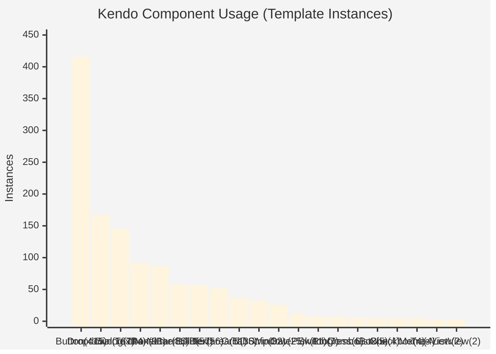
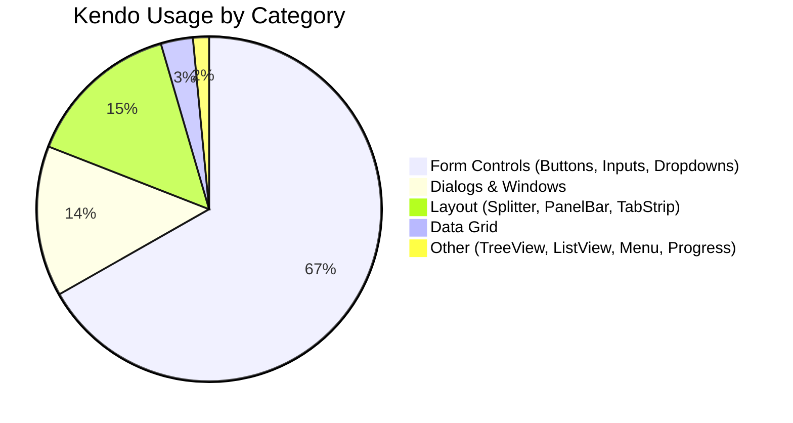
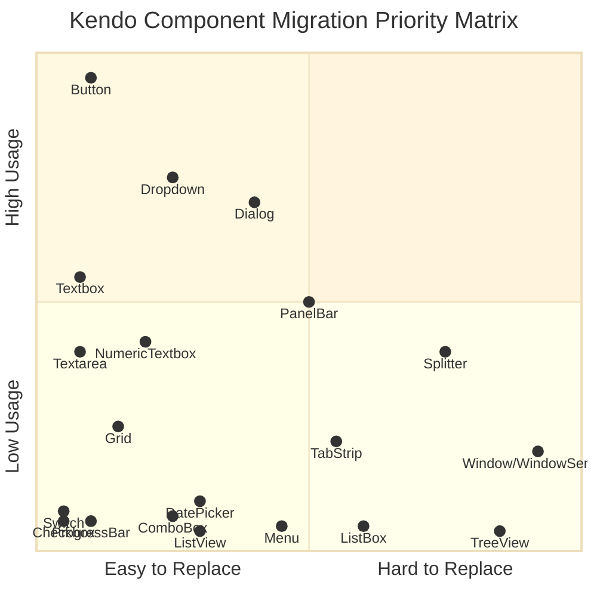
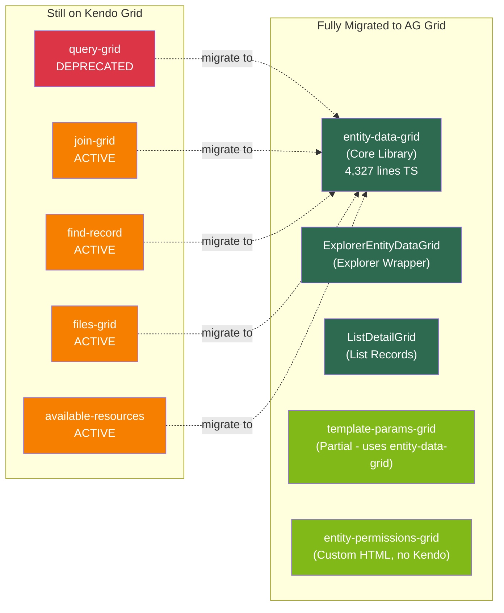
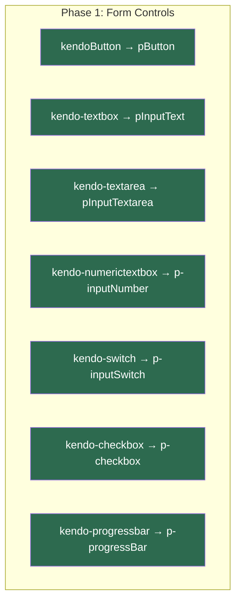
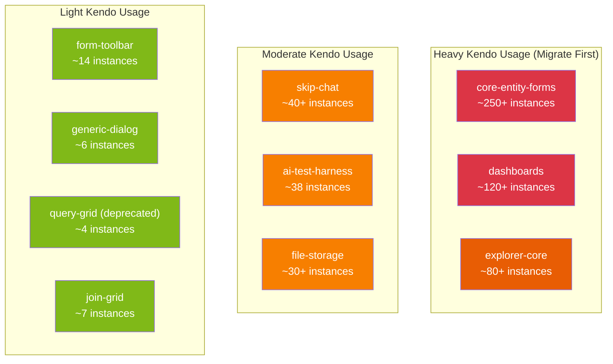

# Kendo UI Usage Audit Report

**Date:** February 7, 2026
**Scope:** Full MemberJunction monorepo (`/packages/`)
**Purpose:** Catalog all Kendo UI usage to plan migration to AG Grid + PrimeNG/Material

---

## Executive Summary

The MemberJunction codebase has **~1,100+ Kendo component instances** spread across **87+ HTML template files** and **112+ TypeScript files**, importing from **20 distinct `@progress/kendo-angular-*` packages** (all at v22.0.1). The largest exposure is in **form controls** (buttons, inputs, dropdowns) which account for ~70% of all usage and are the easiest to replace. The most complex integrations involve **WindowService**, **Splitter layouts**, and **TreeView with drag-drop** --- these represent the highest migration risk.

AG Grid migration is **already mature** via the `entity-data-grid` package, which is production-ready and covers all Kendo Grid features with enhancements.

---

## Table of Contents

1. [Component Usage Frequency](#1-component-usage-frequency)
2. [Frequency Chart (Most to Least Used)](#2-frequency-chart)
3. [Replacement Complexity Chart (Hardest to Easiest)](#3-replacement-complexity-chart)
4. [Detailed Component Analysis](#4-detailed-component-analysis)
5. [Package Dependency Map](#5-package-dependency-map)
6. [Kendo Theme & CSS Coupling](#6-kendo-theme--css-coupling)
7. [AG Grid Migration Status](#7-ag-grid-migration-status)
8. [Migration Strategy & Recommendations](#8-migration-strategy--recommendations)
9. [File Hotspot Analysis](#9-file-hotspot-analysis)

---

## 1. Component Usage Frequency

| Rank | Component | Template Instances | Files Used In | Kendo Package |
|:----:|-----------|:------------------:|:-------------:|---------------|
| 1 | `kendoButton` / `<button kendoButton>` | **415** | 87 | `kendo-angular-buttons` |
| 2 | `<kendo-dropdownlist>` | **167** | 31 | `kendo-angular-dropdowns` |
| 3 | `<kendo-dialog>` + `<kendo-dialog-titlebar>` + `<kendo-dialog-actions>` | **144** | 27 | `kendo-angular-dialog` |
| 4 | `<kendo-textbox>` | **91** | 36 | `kendo-angular-inputs` |
| 5 | `<kendo-panelbar>` + `<kendo-panelbar-item>` | **86** | 5 | `kendo-angular-layout` |
| 6 | `<kendo-numerictextbox>` | **57** | 13 | `kendo-angular-inputs` |
| 7 | `<kendo-splitter>` + `<kendo-splitter-pane>` | **56** | 9 | `kendo-angular-layout` |
| 8 | `<kendo-textarea>` | **51** | 16 | `kendo-angular-inputs` |
| 9 | `<kendo-grid>` + column templates | **36** | 5 | `kendo-angular-grid` |
| 10 | `<kendo-tabstrip>` + `<kendo-tabstrip-tab>` | **32** | 1 | `kendo-angular-layout` |
| 11 | `<kendo-window>` | **25** | 8 | `kendo-angular-dialog` |
| 12 | `<kendo-datepicker>` | **11** | 4 | `kendo-angular-dateinputs` |
| 13 | `<kendo-switch>` | **7** | 5 | `kendo-angular-inputs` |
| 14 | `<kendo-progressbar>` | **6** | 1 | `kendo-angular-progressbar` |
| 15 | `<kendo-combobox>` | **5** | 3 | `kendo-angular-dropdowns` |
| 16 | `<kendo-listbox>` | **4** | 1 | `kendo-angular-listbox` |
| 17 | `<kendo-checkbox>` | **4** | 2 | `kendo-angular-inputs` |
| 18 | `<kendo-contextmenu>` / `<kendo-menu>` | **4** | 1 | `kendo-angular-menu` |
| 19 | `<kendo-treeview>` | **2** | 1 | `kendo-angular-treeview` |
| 20 | `<kendo-listview>` | **2** | 1 | `kendo-angular-listview` |

**Service-Level Usage (TypeScript only):**

| Service | TS Occurrences | Files |
|---------|:--------------:|:-----:|
| `DialogService` / `DialogRef` | 132 | 52 |
| `NotificationService` | 399 | 59 |
| `WindowService` / `WindowRef` | 50 | 13 |

> **Note:** `NotificationService` count is high because MJ wraps it in a custom `NotificationsService` at `packages/Angular/Generic/notifications/src/lib/notifications.service.ts` which is then consumed everywhere. The actual Kendo coupling is in that single wrapper.

---

## 2. Frequency Chart



### Usage Distribution Breakdown



> **Key Insight:** ~67% of all Kendo usage is form controls (buttons, text inputs, dropdowns, numeric inputs). These are the simplest to replace with PrimeNG/Material equivalents.

---

## 3. Replacement Complexity Chart



### Complexity Ranking Table

| Rank | Component | Complexity | Score (1-10) | Rationale |
|:----:|-----------|:----------:|:------------:|-----------|
| 1 | **WindowService** | EXTREME | **10** | Programmatic window creation via `ViewContainerRef`, lifecycle management with `appRef.attachView()`/`detachView()`, minimize/dock functionality, custom positioning. 13 files deeply coupled. |
| 2 | **TreeView + Drag-Drop** | VERY HIGH | **9** | 4 Kendo directives (`kendoTreeViewExpandable`, `kendoTreeViewFlatDataBinding`, `kendoTreeViewDragAndDrop`, `kendoTreeViewSelectable`), flat-to-tree data conversion, context menu integration. |
| 3 | **Splitter** | VERY HIGH | **8** | Resizable panes with min/max constraints (%, px), nested splitters in AI dashboards, no equivalent in PrimeNG without custom resize handles. 9 files with complex layouts. |
| 4 | **PanelBar** | HIGH | **7** | Dynamic nested panels with complex content projection. 5 files but extremely dense usage (86 instances). AI Agent form alone has 22 instances. Collapsible sections with state management. |
| 5 | **TabStrip** | HIGH | **7** | Dynamic tab creation/removal in `dynamic-ui-component.html` (32 instances in one file). Used for dynamic report rendering where tabs are generated at runtime. |
| 6 | **Dialog + DialogService** | MEDIUM-HIGH | **6** | 27 template files + 52 TS files using `DialogService`/`DialogRef`. Programmatic dialog opening, custom title bars, action buttons. Replaceable but massive surface area. |
| 7 | **ListBox** | MEDIUM | **6** | Dual-list transfer pattern with 6 toolbar actions in record-selector. DOM traversal using `.k-list-item` CSS class. Limited scope (1 file) but complex interaction. |
| 8 | **Grid** | LOW | **3** | Already replaced by AG Grid in `entity-data-grid`. Only 5 legacy files remain: `query-grid` (deprecated), `join-grid`, `find-record`, `files-grid`, `template-params-grid`. |
| 9 | **DropdownList** | LOW | **3** | 167 instances but simple API. PrimeNG `p-dropdown` or Material `mat-select` are near-direct replacements. Main concern is `valueField`/`textField` binding pattern. |
| 10 | **Notification** | LOW | **2** | Isolated behind MJ's own `NotificationsService` wrapper. Only 1 file touches Kendo directly. Replace the wrapper internals only. |
| 11 | **ComboBox** | LOW | **2** | 5 instances in 3 files. PrimeNG `p-autoComplete` or Material `mat-autocomplete` are direct replacements. |
| 12 | **DatePicker** | LOW | **2** | 11 instances in 4 files. PrimeNG `p-calendar` or Material `mat-datepicker` are direct replacements. |
| 13 | **NumericTextbox** | LOW | **2** | 57 instances but trivial API (min, max, step, format). PrimeNG `p-inputNumber` is a direct replacement. |
| 14 | **Textbox / Textarea** | TRIVIAL | **1** | 142 combined instances. Native `<input>` and `<textarea>` with CSS classes, or PrimeNG `pInputText`/`pInputTextarea`. |
| 15 | **Button** | TRIVIAL | **1** | 415 instances but simplest replacement. Native `<button>` with PrimeNG `pButton` directive or Material `mat-button`. Bulk find-and-replace. |
| 16 | **Switch** | TRIVIAL | **1** | 7 instances. PrimeNG `p-inputSwitch` or Material `mat-slide-toggle`. |
| 17 | **Checkbox** | TRIVIAL | **1** | 4 instances. PrimeNG `p-checkbox` or Material `mat-checkbox`. |
| 18 | **ProgressBar** | TRIVIAL | **1** | 6 instances in 1 file. PrimeNG `p-progressBar` or Material `mat-progress-bar`. |
| 19 | **Menu/ContextMenu** | LOW | **2** | 4 instances in 1 file (file-storage). PrimeNG `p-contextMenu` is a direct replacement. |
| 20 | **ListView** | LOW | **2** | 2 instances in 1 file. Can be replaced with `*ngFor` + custom styling. |

### Complexity Visualization (Hardest to Easiest)

```mermaid
graph LR
    subgraph "EXTREME (Score: 10)"
        A["WindowService<br/>13 files | 50 TS refs"]
    end
    subgraph "VERY HIGH (Score: 8-9)"
        B["TreeView + DnD<br/>1 file | 4 directives"]
        C["Splitter<br/>9 files | 56 instances"]
    end
    subgraph "HIGH (Score: 7)"
        D["PanelBar<br/>5 files | 86 instances"]
        E["TabStrip<br/>1 file | 32 instances"]
    end
    subgraph "MEDIUM (Score: 5-6)"
        F["Dialog/DialogService<br/>27+52 files | 144+132 refs"]
        G["ListBox<br/>1 file | 4 instances"]
    end
    subgraph "LOW (Score: 2-3)"
        H["Grid (mostly migrated)<br/>5 legacy files"]
        I["Dropdown<br/>31 files | 167 instances"]
        J["DatePicker | ComboBox<br/>Menu | ListView"]
    end
    subgraph "TRIVIAL (Score: 1)"
        K["Button: 415 | Textbox: 91<br/>Textarea: 51 | NumericTB: 57<br/>Switch: 7 | Checkbox: 4<br/>ProgressBar: 6"]
    end

    A --> B --> C --> D --> E --> F --> G --> H --> I --> J --> K

    style A fill:#dc3545,color:#fff
    style B fill:#e85d04,color:#fff
    style C fill:#e85d04,color:#fff
    style D fill:#f77f00,color:#fff
    style E fill:#f77f00,color:#fff
    style F fill:#fcbf49,color:#000
    style G fill:#fcbf49,color:#000
    style H fill:#80b918,color:#fff
    style I fill:#80b918,color:#fff
    style J fill:#80b918,color:#fff
    style K fill:#2d6a4f,color:#fff
```



---

## 4. Detailed Component Analysis

### 4.1 Buttons (`kendoButton`) --- 415 instances, 87 files

**Current Usage Pattern:**
```html
<button kendoButton themeColor="primary" (click)="onSave()">
    <i class="fa-solid fa-save"></i> Save
</button>
```

**Kendo-Specific APIs Used:**
- `themeColor` binding (`"primary"`, `"error"`, `"warning"`, `"info"`)
- `look` attribute (`"flat"`, `"outline"`)
- `fillMode` attribute
- `toggleable` attribute (toggle buttons in button groups)
- `<kendo-buttongroup>` wrapper for grouped actions
- `<kendo-splitbutton>` for split actions (rare)

**Replacement Strategy:** PrimeNG `pButton` directive or `<p-button>`. Near 1:1 mapping. `themeColor` maps to PrimeNG `severity`. Can be automated with regex find-replace.

**Top Files:**
| File | Instances |
|------|:---------:|
| `ai-agent-form.component.html` | 27 |
| `ai-prompt-form.component.html` | 19 |
| `mcp-dashboard.component.html` | 18 |
| `form-toolbar.html` | 14 |
| `agent-advanced-settings-dialog.component.html` | 13 |

---

### 4.2 Dropdowns (`kendo-dropdownlist`) --- 167 instances, 31 files

**Current Usage Pattern:**
```html
<kendo-dropdownlist
    [data]="modelOptions"
    [textField]="'Name'"
    [valueField]="'ID'"
    [(ngModel)]="selectedModelId"
    [valuePrimitive]="true"
    [filterable]="true"
    (filterChange)="onFilter($event)">
</kendo-dropdownlist>
```

**Kendo-Specific APIs Used:**
- `textField` / `valueField` binding (object-to-value mapping)
- `valuePrimitive` (emit value vs. full object)
- `filterable` with `filterChange` event
- `[defaultItem]` for placeholder
- `[popupSettings]` for dropdown positioning
- Item templates (`<ng-template kendoDropDownListItemTemplate>`)

**Replacement Strategy:** PrimeNG `p-dropdown` has equivalent `optionLabel`/`optionValue` properties. Item templates translate to `<ng-template pTemplate="item">`. Filterable maps to `[filter]="true"`. Moderate effort due to property name differences across 31 files.

---

### 4.3 Dialog / DialogService --- 144 template instances, 27 files + 52 TS files

**Current Usage Pattern (Template):**
```html
<kendo-dialog *ngIf="showDialog" title="Confirm Delete" (close)="onClose()">
    <p>Are you sure?</p>
    <kendo-dialog-actions>
        <button kendoButton (click)="onConfirm()">Delete</button>
        <button kendoButton (click)="onClose()">Cancel</button>
    </kendo-dialog-actions>
</kendo-dialog>
```

**Current Usage Pattern (Programmatic):**
```typescript
const dialogRef = this.dialogService.open({
    content: MyDialogComponent,
    title: 'Select Entity',
    width: 600,
    height: 400
});
dialogRef.result.subscribe((result) => { ... });
```

**Kendo-Specific APIs Used:**
- Template-based dialogs with `*ngIf` toggle
- Programmatic opening via `DialogService.open()`
- `DialogRef.result` observable for return values
- `<kendo-dialog-titlebar>` custom title bars
- `<kendo-dialog-actions>` action buttons
- `width`, `height`, `minWidth`, `minHeight` sizing
- `autoFocusedElement` for accessibility

**Replacement Strategy:** PrimeNG `p-dialog` for template-based, `DialogService` for programmatic. PrimeNG has its own `DynamicDialog` service that is functionally equivalent. The `DialogRef.result` observable pattern needs adaptation to PrimeNG's `DynamicDialogRef.onClose`. This is the **largest surface area** migration item. Suggest creating a thin adapter service first.

---

### 4.4 Window / WindowService --- 25 template + 50 TS instances, 8+13 files

**Current Usage Pattern (Programmatic - most complex):**
```typescript
// From ai-agent-management.service.ts
const windowRef: WindowRef = this.windowService.open({
    content: SomeComponent,
    title: 'Window Title',
    width: 800,
    height: 600,
    top: 100,
    left: 200
});
windowRef.window.instance.close.subscribe(() => { ... });
```

**From ai-test-harness (custom lifecycle management):**
```typescript
// Manual ViewContainerRef + ApplicationRef management
const componentRef = this.viewContainerRef.createComponent(TestHarnessComponent);
this.appRef.attachView(componentRef.hostView);
// ... later
this.appRef.detachView(componentRef.hostView);
componentRef.destroy();
```

**Kendo-Specific APIs Used:**
- `WindowService.open()` with `ViewContainerRef`
- `WindowRef.window.instance` for accessing internal component
- `WindowRef.close` event subscription
- `kendoWindowContainer` directive for positioning context
- Window dragging, resizing, minimizing
- Custom minimize/dock functionality in communication window
- `[resizable]`, `[draggable]`, `[state]` attributes

**Why EXTREME Complexity:**
1. **No PrimeNG equivalent** --- PrimeNG has `Dialog` but not a floating `Window` with drag/resize/minimize
2. Deep `ViewContainerRef` coupling for programmatic creation
3. Custom lifecycle management (`appRef.attachView/detachView`)
4. Minimize-to-dock functionality would need custom implementation
5. Window positioning relative to `kendoWindowContainer`

**Replacement Strategy:** Build a custom `MJWindowService` wrapper around either CDK Overlay or a headless floating panel. Alternatively, convert Window usage to Dialog where minimize isn't needed, and build a custom draggable/resizable overlay for the 2-3 places that truly need Window behavior.

---

### 4.5 Splitter --- 56 instances, 9 files

**Current Usage Pattern:**
```html
<kendo-splitter orientation="horizontal" style="height: 100%">
    <kendo-splitter-pane [size]="'30%'" [min]="'200px'" [collapsible]="true">
        <!-- Left panel -->
    </kendo-splitter-pane>
    <kendo-splitter-pane>
        <!-- Right panel (fills remaining) -->
    </kendo-splitter-pane>
</kendo-splitter>
```

**Kendo-Specific APIs Used:**
- `orientation` (`"horizontal"` / `"vertical"`)
- `[size]` with percentage and pixel values
- `[min]` / `[max]` constraints
- `[collapsible]` panes
- Nested splitters (horizontal inside vertical)
- `SplitterPaneComponent` direct references in TS

**Files Using Splitter:**
| File | Instances | Pattern |
|------|:---------:|---------|
| `erd-composite.component.html` | 8 | Nested horizontal+vertical |
| `skip-split-panel.component.html` | 6 | Chat + content split |
| `ai-agent-run.component.html` | 6 | Details + visualization |
| `ai-agent-run-visualization.component.html` | 6 | Graph + timeline |
| `system-configuration.component.html` | 6 | Config panels |
| `prompt-management.component.html` | 6 | List + detail |
| `ai-test-harness.component.html` | 6 | Multi-pane test layout |
| `model-management.component.html` | 6 | Model list + config |
| `agent-configuration.component.html` | 6 | Agent list + config |

**Replacement Strategy:** PrimeNG `p-splitter` with `p-splitterPanel` is a close equivalent. It supports orientation, sizing, min sizes, and nesting. Main gap: PrimeNG splitter doesn't support `collapsible` out of the box --- would need a custom toggle button. Alternatively, use CSS Grid with `resize` handles.

---

### 4.6 PanelBar --- 86 instances, 5 files

**Current Usage Pattern:**
```html
<kendo-panelbar>
    <kendo-panelbar-item title="Agent Prompts" [expanded]="true">
        <ng-template kendoPanelBarContent>
            <!-- Complex nested content -->
        </ng-template>
    </kendo-panelbar-item>
    <kendo-panelbar-item title="Sub-Agents">
        <ng-template kendoPanelBarContent>
            <!-- More content -->
        </ng-template>
    </kendo-panelbar-item>
</kendo-panelbar>
```

**Top Files:**
| File | Instances |
|------|:---------:|
| `ai-agent-form.component.html` | 22 |
| `ai-agent-run.component.html` | 20 |
| `ai-prompt-run-form.component.html` | 18 |
| `action-execution-log-form.component.html` | 14 |
| `ai-agent-run-analytics.component.html` | 12 |

**Replacement Strategy:** PrimeNG `p-accordion` with `p-accordionTab` is a direct replacement. Also possible with native `<details>/<summary>` for simple cases. The `[expanded]` binding maps to PrimeNG's `[selected]`. Content templates are equivalent.

---

### 4.7 Grid (Legacy) --- 36 instances, 5 files

**Remaining Kendo Grid Files:**
| File | Status | Notes |
|------|--------|-------|
| `ng-query-grid.component.html` | DEPRECATED | Has deprecation notice. Migrate to `mj-query-viewer`. |
| `join-grid.component.html` | ACTIVE | Join relationship grid. Needs AG Grid migration. |
| `find-record.component.html` | ACTIVE | Simple search results grid. Easy to migrate. |
| `files-grid.html` | ACTIVE | File browser grid. Custom cell templates for file icons/sizes. |
| `template-params-grid.component.html` | ACTIVE | Inline editing for template params. Most complex remaining grid. Uses `kendoGridCellTemplate`, in-cell editing, add/remove rows. |

**Kendo Grid Features Used in Legacy Files:**
- Virtual scrolling with `PageChangeEvent`
- `kendoGridCellTemplate` for custom cell rendering
- `kendoGridToolbar` for toolbar buttons
- `SelectionEvent` for row selection
- `kendoExcelExport` for Excel export (query-grid)
- In-cell editing (`AddEvent`, `EditEvent`, `SaveEvent`, `CancelEvent`, `RemoveEvent`)
- `GridDataResult` for paginated data

**Replacement Strategy:** Already replaced by `mj-entity-data-grid` (AG Grid). Migrate remaining 5 files individually. `template-params-grid` is the most complex due to inline editing.

---

### 4.8 TabStrip --- 32 instances, 1 file

**File:** `packages/Angular/Generic/skip-chat/src/lib/dynamic-report/dynamic-ui-component.html`

**Usage:** Dynamic tab creation for AI-generated reports. Tabs are created at runtime based on report sections.

**Replacement Strategy:** PrimeNG `p-tabView` with `p-tabPanel`. Dynamic tab creation via `*ngFor` on `p-tabPanel`. Moderate complexity due to runtime tab management.

---

### 4.9 TreeView --- 2 instances, 1 file

**File:** `packages/Angular/Generic/file-storage/src/lib/category-tree/category-tree.html`

**Kendo-Specific APIs Used:**
- `kendoTreeViewExpandable` --- auto expand/collapse
- `kendoTreeViewFlatDataBinding` --- flat array to tree conversion
- `kendoTreeViewDragAndDrop` --- drag and drop reordering
- `kendoTreeViewSelectable` --- node selection
- `ContextMenuSelectEvent` integration

**Replacement Strategy:** PrimeNG `p-tree` supports all these features natively (drag-drop, flat data, selection, context menu). However, the flat-to-tree data binding is a Kendo convenience that would need custom implementation or use of PrimeNG's `TreeNode` interface conversion.

---

### 4.10 Excel Export --- 5 instances, 1 file

**File:** `packages/Angular/Generic/query-grid/src/lib/ng-query-grid.component.html`

**Usage:** `<kendo-excelexport>` with column definitions for data export.

**Replacement Strategy:** Already handled by `entity-data-grid` which uses MJ's own export service. For remaining Kendo grid files, use SheetJS (`xlsx` library) which is framework-agnostic.

---

## 5. Package Dependency Map

```mermaid
graph TD
    subgraph "Installed Kendo Packages (20)"
        BTN["@progress/kendo-angular-buttons<br/>v22.0.1 | 25 importing files"]
        INP["@progress/kendo-angular-inputs<br/>v22.0.1 | 24 importing files"]
        DLG["@progress/kendo-angular-dialog<br/>v22.0.1 | 31 importing files"]
        LAY["@progress/kendo-angular-layout<br/>v22.0.1 | 18 importing files"]
        DRP["@progress/kendo-angular-dropdowns<br/>v22.0.1 | 17 importing files"]
        GRD["@progress/kendo-angular-grid<br/>v22.0.1 | 13 importing files"]
        IND["@progress/kendo-angular-indicators<br/>v22.0.1 | 13 importing files"]
        DAT["@progress/kendo-angular-dateinputs<br/>v22.0.1 | 12 importing files"]
        NTF["@progress/kendo-angular-notification<br/>v22.0.1 | 7 importing files"]
        XLS["@progress/kendo-angular-excel-export<br/>v22.0.1 | 6 importing files"]
        TRV["@progress/kendo-angular-treeview<br/>v22.0.1 | 6 importing files"]
        LBX["@progress/kendo-angular-listbox<br/>v22.0.1 | 5 importing files"]
        ICN["@progress/kendo-angular-icons<br/>v22.0.1 | 4 importing files"]
        LBL["@progress/kendo-angular-label<br/>v22.0.1 | 4 importing files"]
        LSV["@progress/kendo-angular-listview<br/>v22.0.1 | 3 importing files"]
        TTP["@progress/kendo-angular-tooltip<br/>v22.0.1 | 2 importing files"]
        NAV["@progress/kendo-angular-navigation<br/>v22.0.1 | 2 importing files"]
        UPL["@progress/kendo-angular-upload<br/>v22.0.1 | 2 importing files"]
        MNU["@progress/kendo-angular-menu<br/>v22.0.1 | 2 importing files"]
        PRG["@progress/kendo-angular-progressbar<br/>v22.0.1 | 1 importing file"]
    end

    subgraph "Support Libraries"
        THM["@progress/kendo-theme-default<br/>v12.3.0"]
        DQ["@progress/kendo-data-query<br/>~1.7.3"]
        DRW["@progress/kendo-drawing<br/>^1.24.0"]
    end

    subgraph "Centralized Module"
        KM["MJKendoModule<br/>(kendo-modules package)<br/>Re-exports 11 packages"]
    end

    KM --> BTN
    KM --> INP
    KM --> DLG
    KM --> LAY
    KM --> DRP
    KM --> GRD
    KM --> IND
    KM --> DAT
    KM --> NTF
    KM --> ICN
    KM --> NAV

    style BTN fill:#dc3545,color:#fff
    style DLG fill:#dc3545,color:#fff
    style INP fill:#e85d04,color:#fff
    style LAY fill:#e85d04,color:#fff
    style DRP fill:#f77f00,color:#fff
    style GRD fill:#80b918,color:#fff
```



---

## 6. Kendo Theme & CSS Coupling

### Theme Import Chain

```
MJExplorer
  └── styles.scss
       └── @import '@progress/kendo-theme-default/scss/all'    ← Full Kendo theme
       └── @import './styles/kendo-theme-override'              ← 1,160 lines of custom overrides
  └── styles/main.scss (duplicate import path)
```

### Custom Override File Analysis

**File:** `packages/Angular/Explorer/explorer-app/src/lib/styles/_kendo-theme-override.scss`
**Size:** 1,160 lines

**Override Coverage:**

| Kendo CSS Class | Lines of Override | What It Customizes |
|----------------|:-----------------:|-------------------|
| `.k-button` + variants | ~230 lines | Colors, sizing, hover effects, ripple animations |
| `.k-button-group` + variants | ~280 lines | Group borders, selected states, toggle animations |
| `.k-textbox` / `.k-textarea` / `.k-input` | ~30 lines | Border, focus ring, placeholder |
| `.k-dropdown` / `.k-dropdownlist` | ~80 lines | Arrow button gradient, popup shadow, item hover |
| `.k-grid` | ~80 lines | Header gradient, row hover, pager, toolbar |
| `.k-card` | ~40 lines | Border radius, hover elevation, header/footer |
| `.k-dialog` / `.k-window` | ~65 lines | Border radius, shadow, title bar gradient, close button |
| `.k-tabstrip` | ~30 lines | Tab active state, content padding |
| `.k-progressbar` | ~15 lines | Height, color, border radius |
| `.k-badge` / `.k-chip` | ~20 lines | Font, hover transform |
| `.k-form-field` | ~15 lines | Label styling, error colors |
| `.k-loader` | ~10 lines | Position, color |
| Responsive / A11y / Print | ~100 lines | Mobile, high contrast, reduced motion, print |

**Migration Impact:** All 1,160 lines of `_kendo-theme-override.scss` will become obsolete once Kendo is removed. The design tokens (CSS variables like `--mj-blue`, `--border-radius`, `--transition-time`) should be preserved and applied to PrimeNG/Material themes instead.

---

## 7. AG Grid Migration Status

### Current State



### AG Grid Feature Completeness

| Feature | Kendo Grid | AG Grid (entity-data-grid) | Status |
|---------|:----------:|:--------------------------:|:------:|
| Virtual Scrolling | Yes | Yes (+ Infinite Scroll) | Enhanced |
| Column Reorder | Yes | Yes | Parity |
| Column Resize | Yes | Yes | Parity |
| Column Visibility | Yes | Yes (+ Toolbar Chooser) | Enhanced |
| Column Pinning | Yes | Yes (Left/Right) | Parity |
| Multi-Sort | Yes | Yes | Parity |
| Column Filters | Yes | Yes | Parity |
| Text Search | Manual | Built-in (+ SQL wildcards) | Enhanced |
| Excel Export | Kendo module | MJ Export Service | Parity |
| Row Selection | Yes | Yes (none/single/multi/checkbox) | Enhanced |
| Custom Cell Templates | Yes | Yes | Parity |
| Inline Editing | Yes | Framework only | Partial |
| Aggregates | Manual | Built-in (Card + Summary Row) | Enhanced |
| State Persistence | Manual | Automatic (User Settings) | Enhanced |
| Before/After Events | No | Yes (cancelable) | Enhanced |
| Visual Themes | Kendo theme | 5 header styles, zebra, padding | Enhanced |
| Skeleton Loading | No | Yes | Enhanced |
| Responsive Toolbar | No | Yes (overflow menu) | Enhanced |

---

## 8. Migration Strategy & Recommendations

### Phase 1: Quick Wins --- Form Controls (~67% of usage)

**Target:** PrimeNG (recommended) or Angular Material
**Components:** Button, Textbox, Textarea, NumericTextbox, Switch, Checkbox, ProgressBar
**Estimated scope:** 626 instances across ~90 files



**Approach:**
1. Create a shared `MJPrimeModule` (replacing `MJKendoModule`) that re-exports PrimeNG modules
2. Automated find-and-replace for simple patterns (button, textbox, textarea)
3. Manual migration for numeric textbox (format strings differ)
4. Update `_kendo-theme-override.scss` to target PrimeNG CSS classes

---

### Phase 2: Selection & Date Controls

**Components:** DropdownList, ComboBox, DatePicker, ListBox, ListView
**Estimated scope:** 189 instances across ~35 files

| Kendo | PrimeNG | Key Differences |
|-------|---------|----------------|
| `kendo-dropdownlist` | `p-dropdown` | `textField`→`optionLabel`, `valueField`→`optionValue` |
| `kendo-combobox` | `p-autoComplete` | Different filtering API |
| `kendo-datepicker` | `p-calendar` | Format string syntax differs |
| `kendo-listbox` | `p-listbox` + `p-pickList` | Dual-list pattern needs `p-pickList` |
| `kendo-listview` | `*ngFor` + CSS | No direct PrimeNG equivalent needed |

---

### Phase 3: Layout Components

**Components:** Dialog, PanelBar, Splitter, TabStrip, Menu
**Estimated scope:** 322 instances across ~40 files

| Kendo | PrimeNG | Migration Notes |
|-------|---------|----------------|
| `kendo-dialog` (template) | `p-dialog` | Property name changes, action slot differs |
| `DialogService` (programmatic) | `DialogService` (PrimeNG) | Return value pattern differs |
| `kendo-panelbar` | `p-accordion` | Near 1:1 with `p-accordionTab` |
| `kendo-splitter` | `p-splitter` | Collapsible panes need custom toggle |
| `kendo-tabstrip` | `p-tabView` | Dynamic tab API differs |
| `kendo-contextmenu` | `p-contextMenu` | Similar API |

---

### Phase 4: Complex Components (Highest Risk)

**Components:** WindowService, TreeView with DnD, remaining Kendo Grids
**Estimated scope:** Small file count but highest complexity

| Component | Strategy |
|-----------|----------|
| **WindowService** | Build custom `MJFloatingPanelService` using CDK Overlay. Convert simple windows to PrimeNG Dialog. Keep floating/draggable behavior only where truly needed (2-3 files). |
| **TreeView + DnD** | PrimeNG `p-tree` with `[draggableNodes]="true"` and `[droppableNodes]="true"`. Implement flat-to-TreeNode conversion utility. |
| **Kendo Grids (5 files)** | Migrate to `mj-entity-data-grid`. `query-grid` is already deprecated. `join-grid` and `files-grid` need individual attention. |

---

### Phase 5: Cleanup

1. Remove `@progress/kendo-angular-*` from all `package.json` files
2. Remove `@progress/kendo-theme-default` dependency
3. Delete `_kendo-theme-override.scss` (1,160 lines)
4. Delete `MJKendoModule` package
5. Remove all `.k-*` CSS class references from component styles
6. Update CodeGen templates to emit PrimeNG modules instead of Kendo

---

## 9. File Hotspot Analysis

### Top 10 Files by Kendo Component Density

These files have the highest concentration of Kendo components and will require the most migration effort:

| Rank | File | Kendo Instances | Components Used |
|:----:|------|:---------------:|-----------------|
| 1 | `ai-agent-form.component.html` | ~59 | button, panelbar, dropdown, textbox, textarea, checkbox, switch, dialog |
| 2 | `dynamic-ui-component.html` | ~36 | tabstrip (32), button, datepicker, switch |
| 3 | `ai-prompt-run-form.component.html` | ~34 | panelbar (18), button, dropdown, dialog |
| 4 | `ai-prompt-form.component.html` | ~37 | button (19), dropdown (14), textarea, numerictextbox, window |
| 5 | `ai-test-harness.component.html` | ~38 | dialog, splitter, dropdown (14), numerictextbox (18), switch, textbox |
| 6 | `action-form.component.html` | ~28 | button (10), textarea (8), dropdown (6), switch, textbox |
| 7 | `mcp-dashboard.component.html` | ~18 | button (18), splitter, dropdown, dialog |
| 8 | `agent-advanced-settings-dialog.component.html` | ~25 | button (13), textarea (8), dropdown (4), checkbox |
| 9 | `single-list-detail.component.html` | ~29 | button (11), dialog (12), progressbar (6) |
| 10 | `template-params-grid.component.html` | ~25 | grid (16), dropdown, textarea, textbox, switch |

### Package-Level Impact



---

## Appendix A: Full File Index

<details>
<summary>Click to expand: All files with Kendo usage (87 HTML files)</summary>

### core-entity-forms (Custom)
- `AIAgents/ai-agent-form.component.html` --- button, panelbar, dropdown, textbox, textarea, checkbox, switch, dialog
- `AIAgents/agent-advanced-settings-dialog.component.html` --- button, textarea, dropdown, checkbox, numerictextbox
- `AIAgents/agent-prompt-advanced-settings-dialog.component.html` --- button, dropdown, numerictextbox, textbox
- `AIAgents/sub-agent-selector-dialog.component.html` --- button, dropdown, textbox
- `AIAgents/sub-agent-advanced-settings-dialog.component.html` --- button, dropdown, checkbox, numerictextbox
- `AIAgents/prompt-selector-dialog.component.html` --- button, textbox
- `AIAgents/create-prompt-dialog.component.html` --- button, dropdown, textbox, textarea
- `AIAgents/new-agent-dialog.component.html` --- button, dropdown, textbox, textarea, numerictextbox
- `AIAgents/add-action-dialog.component.html` --- button, textbox
- `AIPrompts/ai-prompt-form.component.html` --- button, dropdown, numerictextbox, textbox, textarea, window
- `AIPrompts/template-selector-dialog.component.html` --- button
- `AIPromptRuns/ai-prompt-run-form.component.html` --- button, panelbar
- `Actions/action-form.component.html` --- button, dropdown, textarea, switch, textbox
- `Actions/action-execution-log-form.component.html` --- panelbar
- `Templates/templates-form.component.html` --- button, textbox, textarea, switch, combobox
- `Templates/template-param-dialog.component.html` --- button, textbox, textarea
- `Templates/template-params-grid.component.html` --- grid, dropdown, textbox, textarea, switch
- `Lists/list-form.component.html` --- button, dialog, textbox
- `Queries/query-form.component.html` --- button, dropdown, switch, textbox, textarea
- `Queries/query-run-dialog.component.html` --- button, textarea, numerictextbox
- `Queries/query-category-dialog.component.html` --- button, dropdown, textbox
- `Tests/test-suite-form.component.html` --- button
- `Tests/test-suite-run-form.component.html` --- button
- `Tests/test-run-form.component.html` --- button
- `Tests/test-form.component.html` --- button
- `ai-agent-run/ai-agent-run.component.html` --- splitter, panelbar
- `ai-agent-run/ai-agent-run-analytics.component.html` --- button, panelbar
- `ai-agent-run/ai-agent-run-visualization.component.html` --- splitter

### dashboards
- `MCP/mcp-dashboard.component.html` --- button, dropdown, dialog
- `MCP/components/mcp-test-tool-dialog.component.html` --- button, dropdown, textbox, numerictextbox
- `MCP/components/mcp-server-dialog.component.html` --- button, dropdown, dialog, numerictextbox
- `MCP/components/mcp-log-detail-panel.component.html` --- button
- `MCP/components/mcp-connection-dialog.component.html` --- button, dropdown, dialog, numerictextbox
- `AI/components/system/system-configuration.component.html` --- splitter
- `AI/components/prompts/prompt-management.component.html` --- splitter
- `AI/components/models/model-management.component.html` --- splitter
- `AI/components/agents/agent-configuration.component.html` --- splitter
- `Actions/components/explorer/action-toolbar.component.html` --- button, textbox
- `Actions/components/explorer/action-tree-panel.component.html` --- button, textbox
- `Actions/components/explorer/action-card.component.html` --- button
- `Actions/components/explorer/action-explorer.component.html` --- button
- `Actions/components/explorer/new-category-panel.component.html` --- button, textbox, textarea, dropdown
- `Actions/components/explorer/new-action-panel.component.html` --- button, textbox, textarea, dropdown
- `Actions/components/actions-list-view.component.html` --- button, dropdown, textbox
- `Actions/components/actions-overview.component.html` --- button, dropdown, textbox
- `Actions/components/execution-monitoring.component.html` --- button, dropdown, textbox
- `APIKeys/api-applications-panel.component.html` --- button, dropdown
- `APIKeys/api-key-edit-panel.component.html` --- button, datepicker
- `APIKeys/api-scopes-panel.component.html` --- button, dropdown, window
- `APIKeys/api-usage-panel.component.html` --- button, window
- `APIKeys/api-key-create-dialog.component.html` --- button, datepicker
- `ComponentStudio/component-studio-dashboard.component.html` --- button
- `ComponentStudio/components/artifact-selection-dialog.component.html` --- button, textbox, textarea
- `ComponentStudio/components/artifact-load-dialog.component.html` --- button
- `ComponentStudio/components/browser/component-browser.component.html` --- button, textbox
- `ComponentStudio/components/new-component-dialog/new-component-dialog.component.html` --- button, dialog
- `DashboardBrowser/dashboard-share-dialog.component.html` --- window
- `Home/home-dashboard.component.html` --- button

### explorer-core
- `shell/shell.component.html` --- dropdown
- `single-dashboard/single-dashboard.component.html` --- button
- `single-dashboard/Components/edit-dashboard/edit-dashboard.component.html` --- button, window
- `single-dashboard/Components/delete-item/delete-item.component.html` --- button, dialog
- `single-dashboard/Components/add-item/add-item.component.html` --- button, dropdown, window
- `single-list-detail/single-list-detail.component.html` --- button, dialog, progressbar
- `dashboard-preferences-dialog/dashboard-preferences-dialog.component.html` --- dialog
- `oauth/oauth-callback.component.html` --- button

### Generic packages
- `skip-chat/skip-chat.component.html` --- button, dialog, listview
- `skip-chat/skip-single-message.component.html` --- button, dialog
- `skip-chat/dynamic-report/dynamic-ui-component.html` --- tabstrip, datepicker, switch
- `skip-chat/dynamic-report/linear-report.html` --- button, dialog
- `skip-chat/split-panel/skip-split-panel.component.html` --- splitter
- `skip-chat/artifacts/skip-component-feedback-panel.component.html` --- button
- `ai-test-harness/ai-test-harness.component.html` --- dialog, splitter, dropdown, numerictextbox, switch, textbox
- `action-gallery/action-gallery.component.html` --- button, textbox
- `data-context/ng-data-context.component.html` --- button, textbox
- `data-context/ng-data-context-dialog.component.html` --- window
- `chat/chat.component.html` --- button, dialog
- `entity-communication/preview.component.html` --- button
- `entity-communication/window.component.html` --- window (kendoWindowContainer)
- `file-storage/files-grid/files-grid.html` --- grid, button, textbox, dialog
- `file-storage/category-tree/category-tree.html` --- treeview, button, textbox, contextmenu, dialog
- `file-storage/file-upload/file-upload.html` --- button, dialog
- `file-storage/file-browser/folder-tree.component.html` --- button
- `entity-relationship-diagram/erd-composite.component.html` --- splitter
- `record-selector/record-selector.component.html` --- listbox
- `record-selector/dialog.component.html` --- button, dialog
- `find-record/find-record.component.html` --- grid, button, textbox
- `find-record/dialog.component.html` --- button, dialog
- `generic-dialog/dialog.component.html` --- button, dialog
- `join-grid/join-grid.component.html` --- button, textbox, dropdown
- `list-management/list-share-dialog.component.html` --- button, dropdown, textbox
- `query-grid/ng-query-grid.component.html` --- grid, button
- `resource-permissions/resource-permissions.component.html` --- button, dropdown
- `resource-permissions/request-access.component.html` --- button
- `resource-permissions/available-resources.component.html` --- grid
- `conversations/components/message/form-question.component.html` --- button, datepicker, numerictextbox
- `conversations/components/message/actionable-commands.component.html` --- button
- `conversations/components/message/agent-response-form.component.html` --- button

### Other
- `base-forms/base-field-component.html` --- textbox, textarea, numerictextbox, combobox, datepicker, dropdown
- `base-forms/link-field.component.html` --- button, combobox
- `form-toolbar/form-toolbar.html` --- button, dialog
- `simple-record-list/simple-record-list.component.html` --- button, dialog
- `entity-form-dialog/entity-form-dialog.component.html` --- button, dialog
- `entity-permissions/entity-permissions-grid.component.html` --- button
- `entity-selector-with-grid/entity-selector-with-grid.component.html` --- dropdown

</details>

---

## Appendix B: Recommended PrimeNG Module Mapping

| Kendo Module | PrimeNG Module | Import |
|-------------|----------------|--------|
| `ButtonsModule` | `ButtonModule` | `primeng/button` |
| `InputsModule` | `InputTextModule` + `InputTextareaModule` + `InputNumberModule` + `InputSwitchModule` + `CheckboxModule` | Various |
| `DropDownsModule` | `DropdownModule` + `AutoCompleteModule` | `primeng/dropdown`, `primeng/autocomplete` |
| `DialogsModule` | `DialogModule` + `DynamicDialogModule` | `primeng/dialog`, `primeng/dynamicdialog` |
| `LayoutModule` | `AccordionModule` + `SplitterModule` + `TabViewModule` | Various |
| `DateInputsModule` | `CalendarModule` | `primeng/calendar` |
| `GridModule` | **AG Grid** (already migrated) | `ag-grid-angular` |
| `TreeViewModule` | `TreeModule` | `primeng/tree` |
| `NotificationModule` | `ToastModule` | `primeng/toast` |
| `ListBoxModule` | `PickListModule` or `ListboxModule` | `primeng/picklist` |
| `ProgressBarModule` | `ProgressBarModule` | `primeng/progressbar` |
| `MenusModule` | `ContextMenuModule` | `primeng/contextmenu` |
| `ExcelExportModule` | SheetJS (`xlsx`) | N/A (already in entity-data-grid) |
| `UploadsModule` | `FileUploadModule` | `primeng/fileupload` |
| `NavigationModule` | `BreadcrumbModule` / `MenubarModule` | Various |
| `IndicatorsModule` | `SkeletonModule` / `ProgressSpinnerModule` | Various |
| `TooltipsModule` | `TooltipModule` | `primeng/tooltip` |
| `LabelModule` | Native `<label>` | N/A |
| `IconsModule` | Font Awesome (already in use) | N/A |
| `WindowModule` | **Custom implementation needed** | CDK Overlay |

---

*Report generated by automated codebase analysis. All counts verified by grep across the full `/packages/` directory.*
