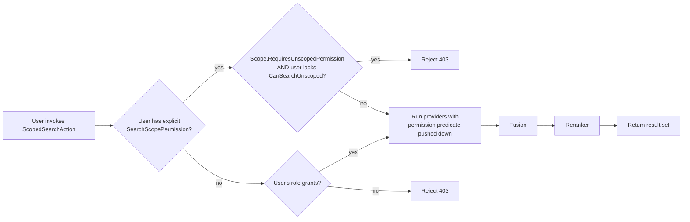
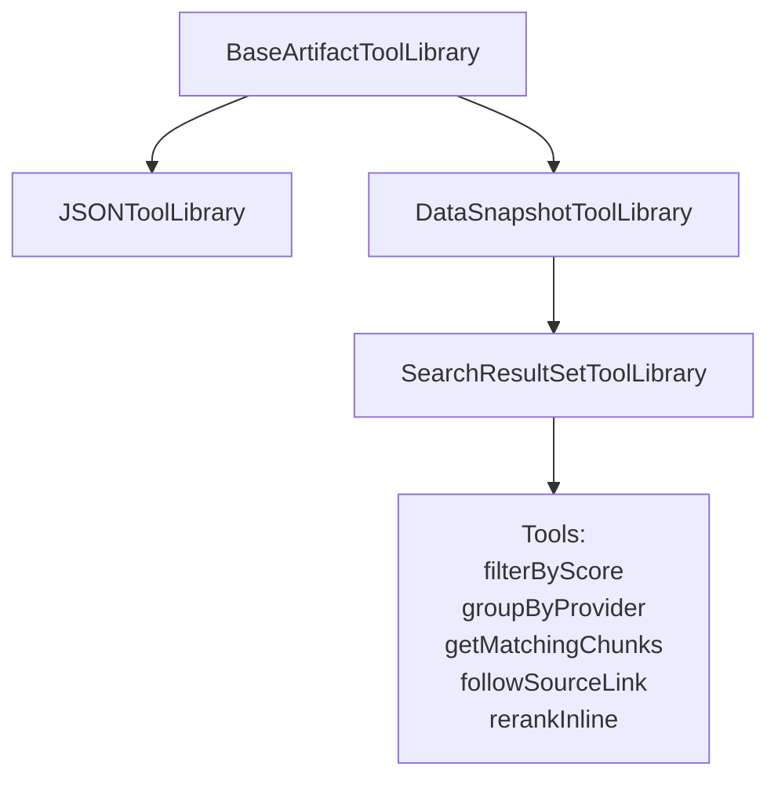
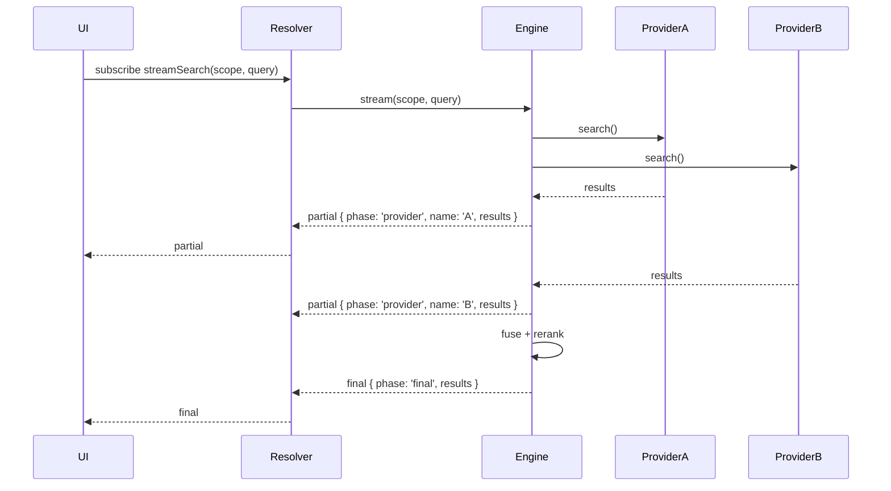

# Search Scopes & RAG+ Agent Integration: Phase 2+ Implementation Plan

**Document owner:** Arie Glazier (arie-glazier-bcc)
**Target audience:** Blue Cypress engineering team (junior to mid-level engineers, ~25 total, ~4 to 6 working in parallel on this initiative)
**Companion documents:** `plans/search-scopes-rag-plus.md`, `guides/SEARCH_SCOPES_AND_RAG_GUIDE.md`, `guides/UUID_COMPARISON_GUIDE.md`, the MJ Coding Standards docs and the Development Process Checklist
**Source PRs:** PR #2374 (this work, Phase 1 already merged in branch), PR #2404 (Artifact Tools, merged to `next` on 2026-04-21), PR #2237 (closed, superseded by #2404)
**Local repo root referenced throughout:** `/Users/arieglazier/repos/MJ_20260427`

> **Important note on grounding:** Every file path, table name, column name and class name in this document is given as a target. Before starting any task, run a quick `grep` or `rg` against the local repo to confirm the final names that landed in Phase 1 and adjust your branch accordingly. Names like `SearchScopePermission` versus `MJ: Search Scope Permissions` and `CanSearchUnscoped` versus `AllowsUnscopedSearch` are the kind of detail that the spec may have already locked in differently, and you should not re-litigate them.

---

## 1. Executive Summary

### 1.1 Scope statement

This plan covers all work required to take the Search Scopes & RAG+ Agent Integration initiative from the state delivered by Phase 1 of PR #2374 (entities, runtime SearchEngine, four search providers, Nunjucks template renderer, fusion, NoopReRanker, an AgentPreExecutionRAG hook, the ScopedSearchAction, GraphQL resolvers, the Angular SearchScopeSelectorComponent, the SearchScopeChildGridComponent, generated forms, and the Knowledge Hub Config dashboard tab) through to a production-ready, observable, multi-tenant-safe, streaming, externally-pluggable system. Concretely, this means delivering: the per-user permission gate (Phase 2 critical fast-follow), the search-specific artifact tool library that builds on top of the now-merged PR #2404 primitives, streaming search results from providers to the agent and the UI, a real reranker catalog (Cohere, Voyage, OpenAI, BGE), a metrics and observability layer, the scope-author tuning UI, and the external index providers (Elasticsearch, Typesense, AzureAISearch, OpenSearch). Cross-cutting cleanup tasks pulled from the AN-BC review threads on #2237, #2374 and #2404 are folded into the relevant phases.

### 1.2 Phase ordering and rationale

Arie's guidance was that order does not strictly matter because all of the work will eventually ship, so this plan presents phases in the order that maximizes parallelism, minimizes merge conflicts, and lets us harvest user value early. The recommended order is:

1. **Phase 2A — Per-user permission gate.** This is the only item we have characterized as a "critical fast-follow" because Phase 1 ships a system that effectively trusts every authenticated agent caller with unscoped search. Until this lands, any production rollout is gated. It is small enough to be done by one pair in roughly a week.
2. **Phase 2B — SearchResultSetToolLibrary** (artifact tools integration). This is unblocked by PR #2404 and is mostly additive. It can run in parallel with 2A.
3. **Phase 2C — Streaming search results.** Independent of permissions and artifact tools, depends only on existing SearchEngine and AgentPreExecutionRAG hook points. A pair can pick this up in parallel.
4. **Phase 2D — Reranker catalog.** Independent runtime work behind ClassFactory, parallelizable.
5. **Phase 3 — Observability and analytics.** Best done after 2A through 2D so we are measuring the system as it will actually run.
6. **Phase 4 — Tuning and admin UI.** Builds on Phase 3 metrics.
7. **Phase 5 — External index providers.** The schema already supports them; the runtime classes are net-new but follow the SearchProvider interface established in Phase 1.
8. **Phase 6 — Cross-cutting cleanup, doc updates, and tech debt** (UUIDsEqual sweeps, ChildGrid generic refinements, Search Result Set ParentID repoint, guide updates).

Phases 2A through 2D may be cut in any order or delivered in any combination. Phases 3 through 6 are best done sequentially because they each consume the output of the previous phase.

### 1.3 Headcount and rough timeline

Assume four to six engineers can work in parallel out of the team of ~25, organized into pairs for major tasks. With pairing and code review overhead, the total wall-clock estimate is:

| Phase | Pairs | Effort (pair-weeks) | Calendar weeks |
|------|------|---------------------|----------------|
| 2A Permissions | 1 | 1.0 | 1 |
| 2B Artifact tools | 1 | 1.5 | 1.5 |
| 2C Streaming | 1 | 2.0 | 2 |
| 2D Reranker catalog | 1 | 1.5 | 1.5 |
| 3 Observability | 1 | 2.0 | 2 |
| 4 Tuning UI | 1 | 2.0 | 2 |
| 5 External providers | 2 | 4.0 (split) | 2 |
| 6 Cleanup and docs | 0.5 | 1.0 | 1 |

If 2A through 2D run in parallel with two pairs each on the long ones, the critical path through Phase 2 is roughly two calendar weeks. The full sweep through Phase 6 is on the order of six to eight calendar weeks of wall-clock time given parallelism, or roughly fifteen pair-weeks of total effort.

### 1.4 Major risks and mitigations

The first risk is **silent permission bypass**. The Phase 1 ScopedSearchAction enforces scope membership at query time, but the spec is clear that all permission decisions must push down into the SQL or vector filter rather than running fusion first and then filtering. If the Phase 2A permission gate is layered on top of fusion instead of pushed into each provider's WHERE clause, we leak record existence through latency and result-count side channels. The mitigation is an explicit unit test matrix covering "user can see record A but not record B," "user has unscoped permission," "user belongs to a role granting access," and "user has only per-row grant," and the test must measure that no provider returned the forbidden record at all rather than that the post-filter dropped it.

The second risk is **streaming complexity in Angular**. MJ today uses GraphQL subscriptions over WebSockets in a few places (look for `@Subscription` decorators in `packages/MJServer/src/resolvers`) and Server-Sent Events in others. Picking the wrong mechanism, or building a bespoke one, will create a maintenance burden. The mitigation is to do a one-day spike before Phase 2C task work begins where the assigned pair documents three options in the open-questions doc, gets sign-off from Arie, and then implements only the chosen one.

The third risk is **migration ordering conflicts** with the merged PR #2404 migration `V202604211000__v5.29.x__*.sql`. Any new migration we add must be timestamped strictly after that file, and any new artifact-type metadata that re-parents Search Result Set onto Data Snapshot must come after the migration that introduces Data Snapshot's `ToolLibraryClass`. The mitigation is the migration plan in section 4.

The fourth risk is **reranker cost overrun**. Cohere Rerank, Voyage Rerank and OpenAI's reranker-style endpoints all charge per request and per token. If we wire them into the agent loop without a budget guard, a single misbehaving agent can rack up significant spend. The mitigation is to push reranker invocations through the existing AI cost-tracking hooks (look for `AIPromptRunCost` and the AI engine cost wiring), gate them behind a `SearchScope.RerankerBudgetCents` per-run cap, and add a circuit breaker.

The fifth risk is **review feedback churn**. AN-BC's recurring review themes across #2237, #2374 and #2404 are: weak typing (`object.Get('FieldName')` instead of `entity.FieldName`), formatting churn (re-flowing files unrelated to the change), seed data in raw SQL `INSERT` statements rather than `metadata/` files, manual FK indexes and `__mj_CreatedAt`/`__mj_UpdatedAt` columns in migrations (CodeGen owns these), and direct UUID string equality with `===`. The mitigation is the architectural-context section of this document and a one-page pre-flight checklist every PR description must repeat.

### 1.5 Dependency status

**Now satisfied:**
- PR #2404 has merged to `next`. `BaseArtifactToolLibrary`, `ArtifactToolDefinition`, `ArtifactToolManager` and the parent-chain resolution via `ArtifactMetadataEngine` are available. The `Data Snapshot` artifact type exists with its `ToolLibraryClass` populated via the `V202604211000__v5.29.x__*.sql` migration. `DataSnapshotToolLibrary`, `JSONToolLibrary`, `TextToolLibrary`, `PDFToolLibrary`, `ExcelToolLibrary` and `DocxToolLibrary` are reference implementations to model the new `SearchResultSetToolLibrary` after.
- The `ParentID` column on `MJ: Artifact Types` is live, so the Search Result Set artifact type can be re-parented onto Data Snapshot through a metadata sync.
- The `SecondaryScopeConfig`, `ExecuteAgentParams.primaryScopeRecordId` and `secondaryScopes` types in `packages/AI/CorePlus/` are stable. Search Scopes' multi-tenant context propagation can rely on these contracts.

**Still open:**
- Streaming mechanism choice (see Phase 2C and the open-questions section).
- Reranker provider priority (Cohere first is recommended; see Phase 2D and open-questions).
- Whether external index providers ship in this body of work or get split into a follow-up release. The recommendation in this plan is to ship Elasticsearch and Typesense in this body of work and split AzureAISearch and OpenSearch off if Phase 5 slips.
- The exact UX for per-user permission management (a child grid on the AIAgent form versus a child grid on the SearchScope form versus both). The recommendation is "both, with the AIAgent form as the primary author surface and the SearchScope form as the audit surface."

---

## 2. Architectural Context

### 2.1 Recap of Phase 1

PR #2374 Phase 1 delivered the data model, the runtime, and a baseline of UI and developer-facing tooling. The migration `migrations/v5/V202604182034__v5.28.x__Add_Search_Scopes_And_Agent_Integration.sql` (verify the exact final filename in your branch) created the `SearchScope`, `SearchScopeProvider`, `SearchScopeFilter` and related entities along with the `AIAgent.PreExecutionRAGEnabled` (or equivalently named) flag. CodeGen produced the `core-entities` and `core-entities-server` typed wrappers and the `core-actions` action stub. The `packages/SearchEngine/` package houses `SearchEngineBase`, the four search providers (Vector, Full-text, plus two more added in Phase 1), the `ScopeTemplateRenderer` Nunjucks wrapper, the `SearchFusion` Reciprocal Rank Fusion implementation, and the `BaseReRanker` and `NoopReRanker` reference reranker pair. `AgentPreExecutionRAG.ts` in `packages/AI/Agents/src/` is the hook that runs before each agent turn when an agent has its scope-selection enabled. `ScopedSearchAction` in `packages/Actions/CoreActions/` is the action surface agents and humans use to invoke a search.

The Angular side delivered `SearchScopeSelectorComponent` (the in-form scope picker) and `SearchScopeChildGridComponent` (a generic child grid the same pattern can use elsewhere) in `packages/Angular/Generic/ng-search/`, plus the shared `SearchService`. Generated forms live in `packages/Angular/Explorer/core-entity-forms/` and a Search Scopes section was added to the Knowledge Hub Config dashboard.

Test coverage in Phase 1 spans `SearchFusion`, `ScopeTemplateRenderer`, `NoopReRanker`, `AgentPreExecutionRAG` and `ScopedSearchAction`. New tests in Phase 2+ should follow the same Jest setup these files use and the same naming convention (`*.spec.ts` co-located with sources).

### 2.2 Architectural patterns Phase 2+ must follow

These patterns are not optional. Every reviewer on the team will be looking for them.

**ClassFactory and `@RegisterClass`.** Every pluggable runtime class (search providers, rerankers, artifact tool libraries) must register itself via `@RegisterClass(BaseClass, 'Friendly Name')` and be resolved via `ClassFactory.Instance.CreateInstance(BaseClass, 'Friendly Name')`. This is how Phase 1 wires providers and rerankers, and how PR #2404 wires artifact tool libraries. Hard-coded `new` calls of subclasses are an anti-pattern, fail discoverability, and break the metadata-driven model.

**Containment over inheritance.** When extending behavior, prefer composition. The `SearchEngineBase` does not inherit from `BaseEntity`; it composes one. Rerankers do not inherit from search providers; they receive a result set and return a permuted one. When you find yourself reaching for `extends`, ask whether a strategy or delegate would do.

**Nunjucks template rendering with sandboxed context.** The `ScopeTemplateRenderer` in `packages/SearchEngine/` is the canonical way to evaluate user-authored templates. It runs Nunjucks with a deliberately restricted context object that exposes only the run-scoped variables we want available. Never pass raw `BaseEntity` instances into a template context, never expose `Metadata` or any provider, and never `eval` template output.

**Permission push-down, not post-fusion.** This is one of the most-emphasized rules in the spec. Each provider's WHERE clause or filter expression must include the permission predicate so that records the calling user cannot see are never returned. Post-fusion filtering is a leak and a performance hazard.

**Scratchpad-style state management.** The `ScratchpadManager` pattern is the model: ephemeral within a single agent run, persistent within a turn. The streaming partial-results buffer in Phase 2C, the reranker scoring metadata, and the per-search artifact context all live in the scratchpad rather than in long-lived state.

**`UUIDsEqual()` for every UUID comparison.** SQL Server returns uppercase GUIDs and Postgres returns lowercase, and JavaScript's `===` is case-sensitive. The `guides/UUID_COMPARISON_GUIDE.md` document is unambiguous: use `UUIDsEqual(a, b)` from `@memberjunction/global` for any equality check between two values that are or might be UUIDs. This is a recurring AN-BC review thread.

**No `__mj_*` timestamp columns or manual FK indexes in migrations.** CodeGen owns `__mj_CreatedAt`, `__mj_UpdatedAt` and the foreign-key indexes. If you add an FK in your DDL, do not also add `CREATE INDEX IX_*`. If you need an additional non-FK index for a query, add it explicitly with a clear name and a comment, but never duplicate what CodeGen will emit.

**`sp_addextendedproperty` for every new column.** Every column you add must include an `EXEC sys.sp_addextendedproperty @name=N'MS_Description', ...` block describing its purpose. Reviewers will reject migrations that skip this.

**Metadata sync for seed data, never `INSERT` in SQL.** Seed records (artifact types, scope templates, default search scopes, sample agents) live in `metadata/` as YAML or JSON, and ship through `mj sync push`. Raw `INSERT` statements in migrations are an anti-pattern. The Data Snapshot artifact type that PR #2404 introduced lives in `metadata/artifact-types/` for exactly this reason.

**Strong typing through the ORM.** Use `await md.GetEntityObject<SearchScopeEntity>('MJ: Search Scopes')` and access typed fields like `entity.CanSearchUnscoped`. Never write `entity.Get('CanSearchUnscoped')` outside of code that is genuinely generic across many entity types.

**Markdown, not JSON, for prompt injection.** When constructing strings for an LLM prompt, prefer markdown tables and lists over JSON. Token counts are lower, model accuracy is higher, and the rendered output is more useful for debugging. JSON is the right format for the agent's tool-call output; it is the wrong format for what we feed in.

**Alpha-sequence IDs for in-run identifiers, not UUIDs in prompts.** When you need to give the LLM a handle to a result so it can refer back to it, use `A`, `B`, `C` ... `AA`, `AB` (a base-26 sequence). UUIDs in prompts waste tokens, are noisy in tool-call output, and tempt the model to hallucinate them.

### 2.3 Reference standards documents

Before starting any task, the assigned engineer should re-read:

- `plans/search-scopes-rag-plus.md` and the plan-companion docs in `plans/search-scopes-rag-plus/` (mockups, audit doc, README).
- `guides/SEARCH_SCOPES_AND_RAG_GUIDE.md` to see how the feature is described to users.
- `guides/UUID_COMPARISON_GUIDE.md`.
- The MJ Coding Standards docs (search the repo for `CODING_STANDARDS.md` and similar).
- The MJ Development Process Checklist (the typical filename is `DEVELOPMENT_PROCESS_CHECKLIST.md` or it lives under `guides/`).
- `CLAUDE.md` at the repo root, which captures the high-level conventions in a single place.

---

## 3. Phase Breakdown

### Phase 2A — Per-user permission gate

#### Goal

Every search invocation, whether triggered by a human in the Explorer UI or by an agent through `ScopedSearchAction`, must be evaluated against an explicit per-user permission. There must be no path through the system where a user receives a result for a record their identity does not grant them access to, and there must be no path where a user can search "everywhere" unless an administrator has explicitly granted them that capability.

#### Why this matters

In Phase 1 the security boundary was effectively the union of (a) row-level security on the underlying entities and (b) the scope template's filter. Both are necessary but neither is sufficient. Row-level security covers the entity layer, but vector indexes, full-text indexes and external indexes do not necessarily honor RLS at all, and certainly not at the same fidelity. Scope filters cover what gets searched, but they do not say who is allowed to invoke that scope. Without an explicit per-user gate, a low-trust agent caller can invoke a high-trust scope and get back results their identity should never see.

#### Architecture overview



#### Tasks

**P2A.1 — DDL for the permission column on `AIAgent`.** ✅ SHIPPED — generalized from boolean to enum.
Description: Add a `SearchScopeAccess` (NVARCHAR(20), default `'None'`, not null) column to `__mj.AIAgent` with a CHECK constraint over the values `'None'`, `'All'`, `'Assigned'`. This generalizes the original boolean spec (`CanSearchUnscoped`) so the same column expresses three distinct postures: `None` blocks the agent from searches entirely; `All` lets it use any scope as a fallback; `Assigned` restricts it to scopes listed in `__mj.AIAgentSearchScope` for that agent (the deny-list mode). Migration `V202604182034__v5.29.x__AIAgent_SearchScopeAccess_and_more.sql`. Acceptance: after `mj migrate`, every existing row has `SearchScopeAccess = 'None'`, and CodeGen adds the typed property to `AIAgentEntity`. Tests: covered by `SearchScopePermissionResolver.test.ts` (PM-05/06/11/12/13 exercise each enum value). Effort: S. Pitfalls: the original spec mentioned a boolean, but the 3-valued enum is the shipped shape; UI dropdowns and resolver paths assume the enum.

**P2A.2 — DDL and CodeGen for `MJ: Search Scope Permissions`.**
Description: Create a `__mj.SearchScopePermission` table with columns `ID` (uniqueidentifier PK, default `newsequentialid()`), `SearchScopeID` (FK to `__mj.SearchScope`), `UserID` (FK to `__mj.User`, nullable), `RoleID` (FK to `__mj.Role`, nullable), `PermissionLevel` (varchar(20) with check constraint over the values `'None'`, `'Read'`, `'Search'`, `'Manage'`), and a `CHECK` constraint that exactly one of `UserID` or `RoleID` is non-null. The table grants, denies or elevates a user's or a role's access to a specific scope. Files: same migration as P2A.1 or a sibling migration. Class signatures after CodeGen: `SearchScopePermissionEntity` in `core-entities`. Acceptance: rows can be created via `BaseEntity.Save()`, the check constraint rejects rows that have both `UserID` and `RoleID` populated or neither, and CodeGen produces the typed entity. Tests: an `SearchScopePermission.spec.ts` covering the constraint, CRUD, and round-trip. Migration considerations: include `sp_addextendedproperty` on every column, do not add `__mj_*` columns, and let CodeGen own indexes. Effort: M, ~1 day. Dependencies: P2A.1. Pitfalls: the temptation is to use a single nullable `PrincipalID` plus a `PrincipalType` discriminator. Resist this. The reviewer will ask for explicit FKs because they preserve referential integrity.

**P2A.3 — Permission resolution service.** ✅ SHIPPED.
Description: `SearchScopePermissionResolver` in `packages/SearchEngine/src/permissions/SearchScopePermissionResolver.ts`. Public method `ResolveEffectivePermission(input: ResolvePermissionInput): Promise<EffectivePermission>` (PascalCase per MJ class-member convention). Returns `{ Allowed, Level, Source, Reason, toSqlPredicate() }`. Source enum has 6 values: `DirectGrant`, `RoleGrant`, `AgentUnscopedAll`, `AgentNone`, `AgentAssignedNotListed`, `NoGrant`. Resolution order:
  1. `Agent.SearchScopeAccess === 'None'` → reject (`AgentNone`).
  2. `Agent.SearchScopeAccess === 'Assigned'` AND scope NOT in `AIAgentSearchScope` for this agent → reject (`AgentAssignedNotListed`). Restricts; does not grant.
  3. User direct grant (a None row is an explicit deny that short-circuits).
  4. Role grant (highest non-None level wins).
  5. Agent fallback: `SearchScopeAccess === 'All'` grants `Search` when no user/role grant exists.
  6. Otherwise reject (`NoGrant`).
Tests: 19 cases in `SearchScopePermissionResolver.test.ts` (PM-01 through PM-13 + UUID + toSqlPredicate). Phase 2A audit-time matrix in `/tmp/rag-audit/phase-2a.sh` runs all 19 cells against the live resolver via GraphQL — 19/19 pass.
Note re original spec: the original `agent: AIAgentEntityExtended | null` parameter is still present, but the enum-valued `SearchScopeAccess` replaces the original boolean `CanSearchUnscoped`.

**P2A.4 — GraphQL resolver enforcement.**
Description: Modify the search GraphQL resolvers (the `SearchKnowledge*` family in `packages/MJServer/src/resolvers/`) to invoke `SearchScopePermissionResolver` before doing any work. On reject, return a typed error (look for the existing pattern of throwing `ForbiddenError` or returning a `Result` union). Push the permission predicate into the `WHERE` clause that each provider builds, rather than letting the provider return everything and post-filtering. Files: each affected resolver in `packages/MJServer/src/resolvers/`. Acceptance: every resolver path now calls `resolveEffectivePermission` and either rejects or attaches the permission predicate. Tests: GraphQL integration tests for both human and agent callers in `packages/MJServer/src/__tests__/`. Migration considerations: none. CodeGen: none. Effort: M, ~2 days. Dependencies: P2A.3. Pitfalls: do not pass the user's identity through the `IRunActionParams.ContextUser` and then re-read it from session in a different layer. Use the same identity throughout the call.

**P2A.5 — `ScopedSearchAction` enforcement matrix.**
Description: Update `ScopedSearchAction` in `packages/Actions/CoreActions/src/` so its execution path also invokes `SearchScopePermissionResolver`. The action is invoked by agents and the agent's identity is the `AIAgentEntityExtended` we pass in. The result of the resolver feeds the WHERE clause of every provider via the existing scope template pipeline, not by post-filtering. Files: `packages/Actions/CoreActions/src/scoped-search.action.ts` (verify exact filename). Acceptance: the action correctly rejects unauthorized searches with a structured failure, attaches the permission predicate to authorized searches, and emits an audit log entry through the existing `ActionExecutionLog` machinery for both outcomes. Tests: `scoped-search.action.spec.ts` covering rejection, authorization, and audit log emission. Migration considerations: none. Effort: M, ~2 days. Dependencies: P2A.3, P2A.4. Pitfalls: the existing action probably passes scope context through a `ScopeContext` object; do not bypass that, and do not let permission checks run twice on the same call.

**P2A.6 — Angular UI for managing per-user and per-role permissions.**
Description: Add a child grid `SearchScopePermissionChildGrid` to the generated `SearchScopeForm` and to the `AIAgentForm`. Reuse `SearchScopeChildGridComponent` from `packages/Angular/Generic/ng-search/`. The grid lets the user pick a User or Role, set a permission level, and save. Use existing user and role pickers (look for `mj-user-picker` and `mj-role-picker` in `Angular/Generic/`). Files: `packages/Angular/Explorer/core-entity-forms/src/lib/generated/Entities/AIAgent/sections/permissions.component.ts` and a parallel section on the SearchScope form. Acceptance: an admin can create, edit and delete `SearchScopePermission` rows from either form, and changes are immediately reflected by the resolver. Tests: Angular component tests and a Cypress or Playwright e2e if e2e infra is in place. Migration considerations: none. CodeGen: this section likely needs to be marked as a custom (non-regenerated) section so we don't lose it on the next CodeGen pass; verify the pattern that other custom child-grid sections use. Effort: M, ~3 days. Dependencies: P2A.2 (entity), P2A.3 (so the UI shows real effective permissions). Pitfalls: do not put the User or Role picker into a `<select>` with a static option list; bind to the live entity through the existing pickers.

**P2A.7 — Knowledge Hub Config dashboard surface for permissions.**
Description: Add a "Permissions" subtab to the Search Scopes section of the Knowledge Hub Config dashboard so admins can audit who has access to what across the system. Files: `packages/Angular/Explorer/core-entity-forms/src/lib/generated/Dashboards/KnowledgeHubConfig/SearchScopes/permissions-tab.component.ts` (verify path against Phase 1). Acceptance: a list view of all `SearchScopePermission` rows with filtering by scope, by user and by role. Tests: component test. Effort: S to M, ~1 day. Dependencies: P2A.6. Pitfalls: do not duplicate the grid component; reuse the one from P2A.6.

#### Phase 2A acceptance criteria

A user with no permissions cannot invoke `ScopedSearchAction` against any scope and receives a structured 403. An agent with `CanSearchUnscoped=1` can. An admin can grant a user `Read` permission on a scope and that user immediately gains the ability to search through that scope. The full test matrix from section 5.4 passes.

#### Suggested sub-team

One backend engineer (DDL, resolver, action), one Angular engineer (forms and dashboard), one mid-level pair lead. Code review by Arie or another senior.

---

### Phase 2B — `SearchResultSetToolLibrary`

#### Goal

Make Search Result Set artifacts first-class citizens of the artifact tool ecosystem. After this phase, an agent that has produced a `Search Result Set` artifact can ask it for filtered slices, follow source links, get matching chunks, group by source provider, and inherit all the generic tools that Data Snapshot provides through the ParentID chain.

#### Why this matters

PR #2404 establishes that artifact types form a parent chain and that tools registered on a parent are available to all descendants. Before #2404 merged, the Search Result Set type fell back to JSON tools. With #2404 live, we can re-parent it onto Data Snapshot, gain all of Data Snapshot's tabular tools (filter, sort, paginate, get-row, project-columns), and add search-specific tools on top.

#### Architecture overview



#### Tasks

**P2B.1 — Re-parent the Search Result Set artifact type onto Data Snapshot.**
Description: Update the metadata YAML/JSON for the Search Result Set artifact type in `metadata/artifact-types/` to set `ParentID` to the Data Snapshot artifact type's ID. Then set `DriverClass` to `DataArtifactViewerPlugin`. Run `mj sync push`. Files: `metadata/artifact-types/search-result-set.json` (verify exact filename). Acceptance: the artifact type's ParentID is Data Snapshot's ID, the driver is `DataArtifactViewerPlugin`, and the existing Search Result Set artifacts still render correctly in the Explorer artifact viewer. Tests: a metadata validation test (the metadata-sync `validate` command should pass). Migration considerations: this is a metadata change, not a SQL migration, so do not add a SQL `UPDATE` statement. Effort: S, ~2 hours. Dependencies: PR #2404 (already merged). Pitfalls: do not write a SQL `UPDATE` to change the parent. Use metadata sync.

**P2B.2 — `SearchResultSetToolLibrary` skeleton.**
Description: Create `SearchResultSetToolLibrary extends BaseArtifactToolLibrary` in `packages/AI/Agents/src/artifact-tools/` (mirror the directory structure of the other tool libraries shipped in PR #2404). Register it with `@RegisterClass(BaseArtifactToolLibrary, 'Search Result Set')`. Implement the abstract members: `getToolDefinitions(): ArtifactToolDefinition[]` returning the search-specific tools enumerated in P2B.3 through P2B.7. Files: `packages/AI/Agents/src/artifact-tools/search-result-set-tool-library.ts`. Class signature:
```typescript
@RegisterClass(BaseArtifactToolLibrary, 'Search Result Set')
export class SearchResultSetToolLibrary extends BaseArtifactToolLibrary {
  public getToolDefinitions(): ArtifactToolDefinition[] { /* ... */ }
}
```
Acceptance: the class loads through ClassFactory, parent-chain resolution returns this library plus DataSnapshot's plus all ancestors. Tests: a test in `search-result-set-tool-library.spec.ts` that instantiates through ClassFactory and asserts the parent-chain count. Effort: S, ~4 hours. Dependencies: P2B.1. Pitfalls: do not hand-instantiate; always go through the factory.

**P2B.3 — Tool: `filterByScore`.**
Description: A tool that accepts `{ minScore: number, maxScore?: number }` and returns the subset of the result set whose score falls in range. The score in question is the post-fusion score, not any individual provider's raw score. Files: same file as P2B.2 plus a small executor. Acceptance: agent can call `filterByScore({ minScore: 0.7 })` and get back a tool result containing only rows at or above 0.7. Tests: unit test. Effort: S, ~3 hours.

**P2B.4 — Tool: `groupBySourceProvider`.**
Description: A tool that returns the result set grouped by which provider contributed each result, with per-group counts and average scores. Useful for an agent that wants to know "the vector index produced N results, full-text produced M, and the rerank changed the order this much." Files: same file. Acceptance: tool returns a markdown table grouped by provider with counts. Effort: S, ~3 hours.

**P2B.5 — Tool: `getMatchingChunks`.**
Description: A tool that, given a result row's alpha-sequence ID, returns the underlying chunk text, its embedding metadata if available, and its source URL. This is the deep-dive tool agents will use most often. Files: same file. Acceptance: given a valid row ID, returns the matching chunk; given an invalid ID, returns a structured error. Tests: unit test. Effort: M, ~1 day. Pitfalls: the row IDs in agent-facing output must be alpha-sequence (`A`, `B`, `C` ...) per the prompt-engineering convention. The tool implementation maps these back to internal UUIDs without leaking those UUIDs into the agent prompt.

**P2B.6 — Tool: `followSourceLink`.**
Description: A tool that, given a row's alpha-sequence ID, fetches the upstream entity (the actual `ContentItem`, `Document`, or whatever the source was) and returns it as a sub-artifact for the agent to interrogate further. Files: same file. Acceptance: returns a properly typed entity reference and surfaces the entity through the agent's existing artifact slot. Effort: M, ~1 day. Pitfalls: re-check permissions here. Just because a row landed in a search result does not automatically mean the user has every permission on the underlying entity; respect entity-level RLS.

**P2B.7 — Tool: `rerankInline`.**
Description: A tool that re-runs reranking on the current result set with a different (named) reranker. This lets an agent that received cheap-NoopReRanker results re-run them through Cohere on demand. Files: same file. Acceptance: reranker switch works and the response includes the new ordering plus a note of the reranker that produced it. Effort: M, ~1 day. Dependencies: Phase 2D (at least one real reranker). Pitfalls: gate this through the cost-tracking machinery so an agent cannot loop on it.

**P2B.8 — Integration tests with `ArtifactToolManager`.**
Description: End-to-end tests that load a Search Result Set artifact, ask `ArtifactToolManager` for available tools, and confirm the merged set (DataSnapshot tools plus SearchResultSet tools plus JSON tools through chained ParentID) appears in the right priority order. Files: `packages/AI/Agents/src/__tests__/search-result-set-artifact-tools.spec.ts`. Acceptance: parent-chain resolution returns the expected set; calling each tool produces the expected result. Effort: M, ~1 day. Dependencies: P2B.2 through P2B.7.

#### Phase 2B acceptance criteria

The Search Result Set artifact type is parented onto Data Snapshot, exposes the seven inherited and five new tools, and an agent can use all of them through the existing tool-call protocol. The Knowledge Hub agent's reference recipe documented in `guides/SEARCH_SCOPES_AND_RAG_GUIDE.md` works end-to-end.

#### Suggested sub-team

One backend AI/agent engineer with familiarity with the PR #2404 patterns, one mid-level pair partner, one reviewer with PR #2404 context.

---

### Phase 2C — Streaming search results

#### Goal

Begin emitting search results to the agent and the UI as each provider returns them, rather than waiting for fusion. The agent can begin reasoning about partial results, the UI can show partial results, and the user gets perceptible latency wins.

#### Why this matters

The current architecture is request-response: invoke `SearchEngineBase.search`, block until every provider has returned and fusion plus reranking have run, then return the full set. For an agent, that means dead time and worse perceived quality (the model only sees the final list and never has a chance to start reasoning while the slow provider catches up). For a user, that means a spinner. Streaming both lets the agent emit "while you wait" outputs and gives the UI a progressive feel.

#### Architecture overview



#### Tasks

**P2C.0 — Mechanism choice spike.**
Description: One day, one engineer. Survey the existing MJ streaming patterns: GraphQL subscriptions over WebSocket (look for `@Subscription` in `packages/MJServer`), SSE (look for `text/event-stream` and any `Response.write` patterns in resolvers), and any custom SignalR. Document the three options in the open-questions section, recommend one, and get sign-off. The recommendation in this plan is GraphQL subscriptions because the rest of the API is GraphQL and Apollo Server already wires the subscription transport, but verify before committing. Files: a new doc `plans/search-scopes-rag-plus/streaming-mechanism-decision.md`. Effort: S, 1 day.

**P2C.1 — Stream-aware `SearchEngine.streamSearch`.** ⚠️ SHIPPED with semantic divergence — post-hoc partition, not concurrent live streaming.
Description: Implemented on the `SearchEngine` singleton (not `SearchEngineBase`). Returns an `AsyncIterable<SearchStreamEvent>` with phases `'provider'`, `'fused'`, `'final'`, `'error'`. **Semantics:** the implementation awaits the synchronous `Search()` call to completion, then partitions the per-provider results into discrete events emitted in sequence. This delivers an event stream the consumer can iterate over (used by `AgentPreExecutionRAG` and the Angular UI), but it does **not** deliver true concurrent live streaming — slow providers do not emit early; the entire `Search()` call must complete before any events fire. The Angular UI's "provider chips" and "in-flight" cues work on a fast workbench (<100ms total) because providers complete quickly; on a deployment with a genuinely slow provider, the streaming benefit doesn't materialize. **If true live streaming becomes a requirement:** rewrite `Search()` to emit per-provider results as they complete via a Promise.race-style iterator with backpressure handling. For now, the contract (an AsyncIterable of typed events) is stable and consumers don't need to change.
Files: `packages/SearchEngine/src/generic/SearchEngine.ts` (lines 425-482), `packages/SearchEngine/src/generic/search.types.ts` (lines 288-325).

**P2C.1-original — Stream-aware `SearchEngineBase.streamSearch` (original spec).**
Description: Add an `async *streamSearch(...)` method on `SearchEngineBase` returning an async iterable of `SearchStreamEvent` discriminated unions: `{ phase: 'provider', providerName, results, durationMs }`, `{ phase: 'fused', results }`, `{ phase: 'reranked', results }`, `{ phase: 'final', results }`, `{ phase: 'error', providerName?, error }`. Each provider runs concurrently and reports as soon as it completes. Backpressure: the consumer awaits each event; the engine queues at most a small bounded buffer. Cancellation: the iterable is `AbortSignal`-aware. Files: `packages/SearchEngine/src/search-engine-base.ts`. Acceptance: a unit test consumes the iterable and asserts the expected event ordering. Tests: `search-engine-base.stream.spec.ts`. Effort: M, ~2 days. Pitfalls: do not start fusion until at least one provider has returned, otherwise empty fusion fires; do not block on the slowest provider before emitting partials.

**P2C.2 — Streaming GraphQL resolver.**
Description: Add a `streamScopedSearch` subscription resolver that wraps `streamSearch` and emits the events. Files: `packages/MJServer/src/resolvers/SearchKnowledgeStream.ts`. Acceptance: an Apollo Sandbox subscription against the resolver streams events in order. Tests: integration test using the existing subscription test harness. Effort: M, ~2 days. Dependencies: P2C.0, P2C.1. Pitfalls: subscription error propagation and resolver context lifetime; lean on the patterns from existing subscriptions.

**P2C.3 — `AgentPreExecutionRAG` streaming hook.**
Description: Update `AgentPreExecutionRAG` to consume `streamSearch` rather than `search`. Append partial results into the agent's pre-execution context as they arrive. Use the scratchpad to buffer; flush into the agent prompt at logical boundaries (every provider completion, plus the final reranked set). Files: `packages/AI/Agents/src/AgentPreExecutionRAG.ts`. Acceptance: an integration test verifies that the agent sees partial results before the slow provider completes. Tests: `AgentPreExecutionRAG.stream.spec.ts`. Effort: M, ~2 days. Dependencies: P2C.1. Pitfalls: the prompt format must be markdown-friendly; do not pour JSON into the prompt at every event.

**P2C.4 — `ScopedSearchAction` streaming.**
Description: Add an alternate execution mode `streamingMode: 'partials' | 'finalOnly'` to the action. When `partials` is set, the action emits partial results through whatever the action framework's progress-emit mechanism is (look for `IRunActionParams.OnProgress` or similar). Files: `packages/Actions/CoreActions/src/scoped-search.action.ts`. Acceptance: an action invocation with `streamingMode: 'partials'` emits progress events. Tests: action streaming test. Effort: M, ~1.5 days. Dependencies: P2C.1.

**P2C.5 — Angular UI streaming.**
Description: Update `SearchService` and the search results component to subscribe to `streamScopedSearch` and render partials with skeleton rows that fill in as each provider returns. Show a small per-provider status indicator. Files: `packages/Angular/Generic/ng-search/src/lib/services/search.service.ts` and the relevant component. Acceptance: a manual demo against a slow provider shows the UI fills progressively. Tests: a service test using a mocked subscription stream. Effort: M, ~2 days. Dependencies: P2C.2.

#### Phase 2C acceptance criteria

A search invocation against a scope with two providers, one fast and one deliberately slowed, shows the fast provider's results in the UI within its real latency budget, and the slow provider's results merge in as soon as they arrive. The agent sees the same progressive experience.

#### Suggested sub-team

One backend pair (resolver, engine, action), one Angular pair (UI). Stagger so the engine work lands first.

---

### Phase 2D — Reranker catalog

#### Goal

Move beyond `NoopReRanker` to real, configurable rerankers. Ship Cohere first because it is the spec-referenced default, then Voyage, then OpenAI's reranker-style endpoint, then the BGE family for self-hosted deployments.

#### Why this matters

A NoopReRanker is the right default for Phase 1 because it lets us ship the plumbing without committing to a vendor relationship in code. But the whole point of fusion-plus-rerank is that fusion gives you breadth and the reranker gives you precision. Without a real reranker, the system is no better than RRF on its own, which is fine for many cases but undercuts the "RAG+" naming.

#### Architecture overview

Each reranker is a `BaseReRanker` subclass registered with ClassFactory, configured by `SearchScope.RerankerClass` (or whatever the scope column is named, verify in Phase 1's migration). Each reranker accepts an array of `RankedResult` and returns a re-ordered array. Cost is reported through a side channel.

#### Tasks

**P2D.1 — `BaseReRanker` enhancements.**
Description: Confirm or add to `BaseReRanker` the methods `estimateCostCents(results)`, `getMaxResultCount()`, and a `reportCost(cents)` callback. The base class should also expose a `name` and a `version`. Files: `packages/SearchEngine/src/rerankers/base-rerank.ts`. Effort: S, ~4 hours.

**P2D.2 — `CohereReRanker`.**
Description: Implement using Cohere's `rerank` v3 endpoint. Files: `packages/SearchEngine/src/rerankers/cohere-rerank.ts`. Class: `@RegisterClass(BaseReRanker, 'Cohere') class CohereReRanker extends BaseReRanker`. Read API key from the existing AI provider secrets pattern (look for how `OpenAILLM` or similar reads its key). Acceptance: a unit test mocks the Cohere endpoint and verifies result re-ordering. Tests: `cohere-rerank.spec.ts`. Effort: M, ~1.5 days. Dependencies: P2D.1. Pitfalls: do not embed the API key in code or env-var-only logic; use the MJ AI provider secret pattern. Track cost.

**P2D.3 — `VoyageReRanker`.**
Description: Implement using Voyage's `rerank` endpoint. Mirror the Cohere class structure. Files: `packages/SearchEngine/src/rerankers/voyage-rerank.ts`. Effort: M, ~1 day. Dependencies: P2D.1.

**P2D.4 — `OpenAIReRanker`.**
Description: OpenAI does not offer a first-party reranker endpoint as of this writing; verify before starting. The fallback is to use a small chat-completion-based reranker (a "judge" that scores each candidate). If a first-party endpoint has launched between now and when you start, prefer that. Files: `packages/SearchEngine/src/rerankers/openai-rerank.ts`. Acceptance: documented decision (first-party vs judge) and working implementation. Effort: M to L, 1 to 2 days. Dependencies: P2D.1.

**P2D.5 — `BGEReRanker`.**
Description: Local-model reranker for self-hosted deployments. Use the existing local-model invocation pattern (look for any `transformers.js` or ONNX usage in the AI packages). Files: `packages/SearchEngine/src/rerankers/bge-rerank.ts`. Acceptance: works with `bge-reranker-base` and `bge-reranker-large` from a local path or HuggingFace ID. Effort: L, ~3 days. Dependencies: P2D.1. Pitfalls: do not bundle the model in the npm package; load it lazily from disk or a configurable URL.

**P2D.6 — Cost tracking and budget guard.**
Description: Wire reranker cost reports into the existing `AIPromptRunCost` (or equivalent) machinery. Add a `RerankerBudgetCents` column to `SearchScope` (separate small migration) and a circuit breaker that aborts reranking when the budget is exceeded for the run. Files: a small migration, a new helper in `packages/SearchEngine/src/rerankers/budget.ts`, and integration into `SearchEngineBase`. Effort: M, ~1.5 days. Dependencies: P2D.1 through P2D.5.

**P2D.7 — Configuration UI.**
Description: Surface the reranker choice in the SearchScope form as a dropdown populated from ClassFactory. Surface the `RerankerBudgetCents` field. Files: the generated `SearchScopeForm` plus a small custom section. Effort: S, ~4 hours. Dependencies: P2D.6 (for the column).

#### Phase 2D acceptance criteria

A SearchScope can be configured to use Cohere, Voyage, OpenAI or BGE; the reranker actually re-orders results in integration tests; cost is tracked per run; the budget guard fires when exceeded.

#### Suggested sub-team

One backend engineer with AI integration experience, mid-level pair partner.

---

### Phase 3 — Observability and analytics

#### Goal

Make the system measurable: per-scope query counts, per-provider latency distributions, hit rates, fusion contribution distributions, reranker score deltas, cost per query, and per-user activity.

#### Why this matters

Without metrics, scope authors cannot tune fusion weights, admins cannot spot slow providers, and finance cannot answer "how much is reranking costing us." Phase 1 emits some of this through the action execution log but not in a queryable, dashboard-ready form.

#### Tasks

**P3.1 — `SearchExecutionLog` entity.**
Description: New table `__mj.SearchExecutionLog` with one row per search invocation: `ID`, `SearchScopeID`, `UserID`, `AIAgentID` (nullable), `Query` (nvarchar(max)), `TotalDurationMs`, `ResultCount`, `RerankerName` (nullable), `RerankerCostCents` (nullable), `Status` ('Success' | 'Failure' | 'Forbidden'), `FailureReason` (nullable), and a JSON-typed `ProvidersJSON` capturing per-provider durations and counts. Files: a new migration. Tests: schema test. Effort: M, ~1 day. Pitfalls: keep the `Query` length unbounded (`nvarchar(max)`); some queries will be long.

**P3.2 — Logging hook in `SearchEngineBase`.**
Description: Emit a `SearchExecutionLog` row at the end of each invocation (success or failure). Files: `packages/SearchEngine/src/search-engine-base.ts`. Effort: S, ~4 hours.

**P3.3 — Knowledge Hub Config dashboard analytics tab.**
Description: A new tab "Search Analytics" with charts: per-scope volume over time, per-provider p50/p95 latency, hit rate (rows where ResultCount > 0), top failure reasons, top users, and total reranker cost. Use the existing Kendo charts in the dashboards. Files: `packages/Angular/Explorer/core-entity-forms/src/lib/generated/Dashboards/KnowledgeHubConfig/SearchAnalytics/`. Effort: L, ~3 days. Dependencies: P3.1, P3.2.

**P3.4 — Per-scope tuning data export.**
Description: A button on the SearchScope form that exports a CSV of the last N runs for offline tuning. Files: `packages/Angular/Generic/ng-search/`. Effort: S, ~4 hours.

#### Phase 3 acceptance criteria

A new run produces a log row, the analytics tab loads and renders, a scope author can export tuning data.

---

### Phase 4 — Tuning UI for scope authors

#### Goal

Give a non-engineer scope author the ability to author, test and tune scopes, including weight tuning, reranker selection, and live preview.

#### Tasks

**P4.1 — Scope author live-preview panel.**
Description: On the SearchScope form, a side panel where the author types a sample query, hits Run, and sees the same streaming UI Phase 2C built. Files: `packages/Angular/Explorer/core-entity-forms/src/lib/generated/Entities/SearchScope/sections/preview.component.ts`. Effort: M, ~2 days. Dependencies: Phase 2C.

**P4.2 — Fusion weight slider.**
Description: Sliders for each provider's RRF weight, persisted to the `SearchScopeProvider.Weight` column. Files: same form. Effort: S, ~4 hours.

**P4.3 — Reranker A/B comparison.**
Description: Run the same query through two rerankers and show side-by-side output with a Kendall-tau or RBO score for ordering similarity. Files: same form. Effort: M, ~2 days. Dependencies: Phase 2D.

**P4.4 — Saved test queries.**
Description: A small `SearchScopeTestQuery` entity capturing canonical test queries per scope. Migration plus form section. Effort: M, ~1.5 days.

#### Phase 4 acceptance criteria

A scope author can iterate without an engineer's help: edit, preview, tune weights, swap rerankers, save canonical test queries, and re-run them.

---

### Phase 5 — External index providers

#### Goal

Implement the `SearchProvider` interface for Elasticsearch, Typesense, AzureAISearch and OpenSearch.

#### Why this matters

The Phase 1 schema generalized to support these but the runtime ships only Vector and Full-text. Customers running on Elastic or Azure AI Search have no path to onboard.

#### Tasks

**P5.1 through P5.4 — One provider class each.**
Description: For each of `ElasticsearchSearchProvider`, `TypesenseSearchProvider`, `AzureAISearchProvider`, `OpenSearchSearchProvider`, implement `BaseSearchProvider`. Each accepts a JSON config blob from `SearchScopeProvider.ProviderConfigJSON` (verify column name) and translates the scope template plus permission predicate into the provider's native query DSL. Files: `packages/SearchEngine/src/providers/{elasticsearch,typesense,azure-ai-search,opensearch}.ts`. Tests: each gets a unit test against a mocked client and an integration test gated behind an env-var. Effort per provider: M to L, ~1.5 to 3 days. Dependencies: none on each other; can be built in parallel by two pairs.

**P5.5 — Provider registration and discovery in the SearchScope form.**
Description: ClassFactory-driven dropdown for the provider class. Effort: S, ~4 hours.

#### Phase 5 acceptance criteria

A SearchScope can be configured against any of the four external providers, results stream through fusion as expected, and permission predicates are pushed down to the native query.

#### Suggested sub-team

Two pairs in parallel; each pair owns two providers.

---

### Phase 6 — Cross-cutting cleanup, doc updates, and tech debt

#### Tasks

**P6.1 — UUIDsEqual sweep.**
Description: `rg "===" packages/SearchEngine packages/AI/Agents packages/Actions/CoreActions packages/MJServer/src/resolvers | grep -i uuid` and similar searches. Replace any remaining string-equality UUID comparisons with `UUIDsEqual()`. Files: scattered. Effort: S, ~4 hours. Pitfalls: do not over-replace; only UUID-typed comparisons need this.

**P6.2 — `SearchScopeChildGridComponent` generic refinements.**
Description: Per AN-BC's review threads, the generic child grid should accept a typed `entityName` and use the strongly-typed entity API rather than `BaseEntity.Get/Set`. Verify against the Phase 1 implementation. Files: `packages/Angular/Generic/ng-search/`. Effort: S, ~4 hours.

**P6.3 — Search Result Set ParentID repoint follow-up.**
Description: Verify the metadata sync from Phase 2B (P2B.1) holds after every CodeGen pass; add a metadata-validation test that asserts the parent. Effort: S, ~2 hours.

**P6.4 — `guides/SEARCH_SCOPES_AND_RAG_GUIDE.md` updates.**
Description: Add sections on per-user permissions (Phase 2A), artifact tools (Phase 2B), streaming (Phase 2C), reranker catalog (Phase 2D), analytics (Phase 3), tuning UI (Phase 4) and external providers (Phase 5). Effort: M, ~1.5 days. Pitfalls: do not duplicate content from the spec doc; link to it.

**P6.5 — `plans/search-scopes-rag-plus.md` update.**
Description: Mark phases complete as they land. Update the spec to reflect any decisions made along the way (streaming mechanism, reranker order, etc.). Effort: S, ongoing.

**P6.6 — Migration sequencing audit.**
Description: After all migrations land, re-run `mj migrate` from a fresh database and verify the order is monotonically increasing. Effort: S, ~2 hours.

---

## 4. Migration Plan

### 4.1 Naming convention

Every new migration file is named `V202604xxxxxx__v5.YY.x__Description.sql` where:

- The 12-digit timestamp is `YYYYMMDDHHMM` and must be strictly later than the last migration on `next`. As of this plan, the last known is `V202604211000__v5.29.x__*.sql` from PR #2404.
- `v5.YY.x` is the target MJ minor version, almost certainly `v5.30.x` or `v5.31.x` for this body of work.
- `Description` uses underscores and is descriptive.

### 4.2 Expected migrations (in commit order)

1. `V202604xxxxxx__v5.30.x__Add_AIAgent_CanSearchUnscoped.sql` — Phase 2A.1.
2. `V202604xxxxxx__v5.30.x__Add_SearchScopePermission_Table.sql` — Phase 2A.2 (or rolled into the previous).
3. `V202604xxxxxx__v5.30.x__Add_SearchScope_RerankerBudget.sql` — Phase 2D.6.
4. `V202604xxxxxx__v5.30.x__Add_SearchExecutionLog.sql` — Phase 3.1.
5. `V202604xxxxxx__v5.30.x__Add_SearchScopeTestQuery.sql` — Phase 4.4.

### 4.3 DDL stubs

Phase 2A.1 (`AIAgent.CanSearchUnscoped`):
```sql
ALTER TABLE __mj.AIAgent
  ADD CanSearchUnscoped BIT NOT NULL CONSTRAINT DF_AIAgent_CanSearchUnscoped DEFAULT 0;
GO

EXEC sys.sp_addextendedproperty
  @name = N'MS_Description',
  @value = N'When 1, the agent identity is permitted to invoke ScopedSearchAction without belonging to any SearchScope (subject to row-level security on the underlying entities). Defaults to 0.',
  @level0type = N'SCHEMA', @level0name = N'__mj',
  @level1type = N'TABLE',  @level1name = N'AIAgent',
  @level2type = N'COLUMN', @level2name = N'CanSearchUnscoped';
GO
```

Phase 2A.2 (`SearchScopePermission`):
```sql
CREATE TABLE __mj.SearchScopePermission (
  ID UNIQUEIDENTIFIER NOT NULL CONSTRAINT DF_SearchScopePermission_ID DEFAULT NEWSEQUENTIALID()
    CONSTRAINT PK_SearchScopePermission PRIMARY KEY,
  SearchScopeID UNIQUEIDENTIFIER NOT NULL
    CONSTRAINT FK_SearchScopePermission_SearchScope REFERENCES __mj.SearchScope(ID),
  UserID UNIQUEIDENTIFIER NULL
    CONSTRAINT FK_SearchScopePermission_User REFERENCES __mj.[User](ID),
  RoleID UNIQUEIDENTIFIER NULL
    CONSTRAINT FK_SearchScopePermission_Role REFERENCES __mj.Role(ID),
  PermissionLevel NVARCHAR(20) NOT NULL
    CONSTRAINT CK_SearchScopePermission_Level CHECK (PermissionLevel IN (N'None', N'Read', N'Search', N'Manage')),
  CONSTRAINT CK_SearchScopePermission_Principal CHECK (
    (UserID IS NOT NULL AND RoleID IS NULL) OR
    (UserID IS NULL AND RoleID IS NOT NULL)
  )
);
GO

EXEC sys.sp_addextendedproperty
  @name = N'MS_Description',
  @value = N'Per-user or per-role permission grant on a SearchScope. Exactly one of UserID or RoleID must be set.',
  @level0type = N'SCHEMA', @level0name = N'__mj',
  @level1type = N'TABLE',  @level1name = N'SearchScopePermission';
GO
-- sp_addextendedproperty for every column omitted here for brevity; required in the actual migration.
```

> Do not add `__mj_CreatedAt` or `__mj_UpdatedAt` columns. CodeGen will introduce these. Do not add `CREATE INDEX IX_SearchScopePermission_SearchScopeID` for the FKs. CodeGen will introduce these.

### 4.4 CodeGen run instructions

After each migration:

```bash
mj migrate
mj codegen
mj sync push   # only if metadata files changed
npm run build
npm test
```

### 4.5 Metadata sync workflow

Re-parenting Search Result Set onto Data Snapshot (P2B.1) is a metadata edit, not a SQL migration:

```bash
# Edit metadata/artifact-types/search-result-set.json:
# - parentId: <Data Snapshot ID>
# - driverClass: DataArtifactViewerPlugin
mj sync validate
mj sync push
```

Default SearchScope seed records (sample scopes that ship out of the box) likewise live in `metadata/`, not in SQL.

---

## 5. Test Strategy

### 5.1 Per-package test expectations

**`packages/SearchEngine/`.** Unit tests for `SearchEngineBase`, `ScopeTemplateRenderer`, `SearchFusion`, each reranker, each provider, and each new helper (permission resolver, budget guard, streaming iterable). All tests run in Jest and follow the `*.spec.ts` co-location convention from Phase 1.

**`packages/AI/Agents/`.** Unit tests for `AgentPreExecutionRAG` streaming, `SearchResultSetToolLibrary`, and integration tests through `ArtifactToolManager`.

**`packages/Actions/CoreActions/`.** Unit tests for `ScopedSearchAction` covering permission rejection, authorization, streaming mode, and audit log emission.

**`packages/MJServer/`.** GraphQL integration tests for the new resolvers and the new subscription, gated behind a test database.

**`packages/Angular/Generic/ng-search/`** and **`packages/Angular/Explorer/core-entity-forms/`.** Angular component tests for the new permission grids, the streaming UI, and the analytics dashboard.

### 5.2 Required end-to-end scenarios

A: human user with no permissions invokes search through Explorer and gets a structured 403. B: human user with `Read` on scope X invokes search and gets results. C: agent with `CanSearchUnscoped=1` invokes search through `ScopedSearchAction` without a scope and gets results. D: agent without that flag invokes scopeless search and is rejected. E: streaming search emits provider partials before final fusion. F: an agent that received a Search Result Set artifact calls `filterByScore` and `getMatchingChunks` and gets correct outputs. G: reranker budget exceeded mid-run aborts cleanly and logs the abort. H: each external provider (Phase 5) returns results when configured.

### 5.3 Migration tests

After every new migration, run `mj migrate` against a fresh DB and assert the schema matches the CodeGen output. Confirm the new columns appear on the typed entities after `mj codegen`.

### 5.4 Permission matrix tests for `SearchScopePermission`

| Test ID | User direct grant | User role grant | Agent CanSearchUnscoped | Scope membership | Expected |
|---------|-------------------|-----------------|-------------------------|------------------|----------|
| PM-01 | None | None | n/a (human) | None | Reject |
| PM-02 | Read | None | n/a | None | Allow Read |
| PM-03 | None | Search | n/a | None | Allow Search |
| PM-04 | Read | Search | n/a | None | Allow Search (highest wins) |
| PM-05 | None | None | true | None | Allow (Agent) |
| PM-06 | None | None | false | None | Reject |
| PM-07 | None | None | n/a | Member | Allow (membership implies Read) |
| PM-08 | Manage | None | n/a | None | Allow Manage |
| PM-09 | None | None | true | Member | Allow (membership) |
| PM-10 | None | None | true | None, but RLS blocks underlying entity | No rows in result |

Tests must also verify that a forbidden record never reaches the fusion stage; this is asserted by counting provider outputs, not just resolver outputs.

---

## 6. Documentation Updates

### 6.1 `guides/SEARCH_SCOPES_AND_RAG_GUIDE.md` sections to add

A new top-level section "Permissions" describing the per-user permission model with a worked example. A "Streaming" section describing how the agent and the UI consume partials. A "Reranker catalog" section enumerating the bundled rerankers and how to add a new one. An "Analytics" section walking through the dashboard tabs. An "External providers" section per provider. A "Tuning a scope" section walking through the Phase 4 UI. A "Adding a new search provider" how-to. A "Adding a new reranker" how-to. A "Adding a new artifact tool library" how-to.

### 6.2 Coding standards sections that may need additions

Reaffirm the `UUIDsEqual` rule with a worked example. Reaffirm the metadata-versus-SQL seed rule with the Data Snapshot artifact type as an example. Reaffirm the no-`__mj_*`-in-migrations rule with a worked example. Add a section on streaming patterns (subscription versus action progress emit) once Phase 2C lands. Add a section on the alpha-sequence ID convention for prompt injection.

### 6.3 Inline TSDoc expectations

Every public class and method introduced in this work must carry TSDoc with a one-line summary, a `@remarks` block when there is non-obvious behavior, `@example` blocks on the artifact tool library and reranker classes, and `@see` cross-references to the spec doc and the guides.

### 6.4 Plan doc itself

`plans/search-scopes-rag-plus.md` gains a new "Phase 2 onward delivery log" section appended at the bottom, with a checkbox for each task in this document. Update as tasks land.

---

## 7. Open Questions and Decisions Needed

1. **Streaming mechanism.** GraphQL subscription versus SSE versus a custom WebSocket. Recommendation: GraphQL subscription, because Apollo already wires the transport and the rest of the API is GraphQL. Decision needed before P2C.0 closes.
2. **Reranker provider priority.** Recommendation: Cohere first (referenced by the spec), then Voyage, then BGE for self-hosted, then OpenAI (because OpenAI's first-party reranker story is the least mature; if they ship a first-party endpoint while we are mid-flight, reprioritize). Decision needed before P2D starts.
3. **Per-user permission UI placement.** Recommendation: child grid on both the AIAgent form (where most permissions are authored by agent owners) and the SearchScope form (where admins audit). Both reuse `SearchScopeChildGridComponent`. Decision needed before P2A.6.
4. **External index providers in scope.** Recommendation: ship Elasticsearch and Typesense in this body of work, defer AzureAISearch and OpenSearch to a follow-up release if Phase 5 slips. Decision needed before Phase 5 starts.
5. **`CanSearchUnscoped` on agent versus user.** Recommendation: agent only, as in this plan. The user-level decision is captured by their roles and direct grants. Decision needed before P2A.1.
6. **Reranker cost reporting.** Recommendation: reuse the existing AI cost-tracking entity (`AIPromptRunCost` or equivalent) rather than introducing a new `RerankerCost` entity. Decision needed before P2D.6.
7. **Saved test queries scope.** Recommendation: keep them per-scope, not per-tenant or per-user. Decision needed before P4.4.

---

## 8. Appendices

### 8.1 Glossary of MJ-specific terms

**Action.** A metadata-driven, server-side unit of work invokable by humans or agents through `ActionEngine.RunAction`. Lives in `packages/Actions/`.

**ArtifactType.** Metadata classification of an artifact. The new ParentID column from PR #2404 lets types form a chain.

**ArtifactToolLibrary.** Per-type collection of tools that an agent can call against an artifact of that type. Resolved through the parent chain so a child type inherits its parent's tools.

**BaseEntity.** The strongly-typed ORM base class. `await md.GetEntityObject<MyEntity>('MJ: My Entity')` returns one.

**ClassFactory.** Singleton registry that maps `(BaseClass, friendlyName)` to a constructor. Anything pluggable in MJ goes through this.

**CodeGen.** The MJ tool that introspects the database schema and metadata and emits typed entity classes, GraphQL resolvers, and Angular forms. Run with `mj codegen`. Owns `__mj_*` audit columns and FK indexes.

**Knowledge Hub.** The Explorer dashboard that surfaces all knowledge-related configuration, including Search Scopes.

**Metadata sync.** The `mj sync` workflow that round-trips metadata records between SQL Server and YAML/JSON files in `metadata/`.

**RAG.** Retrieval-Augmented Generation. RAG+ in this initiative refers to scoped, fused, permissioned, rerankable retrieval.

**Scratchpad.** The per-run, per-turn ephemeral state buffer that an agent uses to accumulate intermediate output.

**SearchEngine.** The `packages/SearchEngine/` package that orchestrates providers, fusion, and reranking.

**SearchScope.** A configurable, named, templated query against one or more providers, with permissions and reranker config.

### 8.2 Reference file paths

Spec: `plans/search-scopes-rag-plus.md`. Guide: `guides/SEARCH_SCOPES_AND_RAG_GUIDE.md`. UUID guide: `guides/UUID_COMPARISON_GUIDE.md`. Phase 1 migration: `migrations/v5/V202604182034__v5.28.x__Add_Search_Scopes_And_Agent_Integration.sql`. PR #2404 migration: `migrations/v5/V202604211000__v5.29.x__*.sql`. SearchEngine: `packages/SearchEngine/src/`. Pre-execution RAG: `packages/AI/Agents/src/AgentPreExecutionRAG.ts`. Action: `packages/Actions/CoreActions/src/scoped-search.action.ts`. Server resolvers: `packages/MJServer/src/resolvers/SearchKnowledge*`. Angular generic: `packages/Angular/Generic/ng-search/`. Generated forms: `packages/Angular/Explorer/core-entity-forms/src/lib/generated/`. Artifact tool libraries: `packages/AI/Agents/src/artifact-tools/`. Artifact tool primitives: `packages/AI/CorePlus/src/artifact-tool-library.ts`. Artifact metadata: `metadata/artifact-types/`.

### 8.3 Templates

#### 8.3.1 Registering a new search provider

```typescript
import { RegisterClass } from '@memberjunction/global';
import { BaseSearchProvider, SearchProviderConfig, RankedResult } from '@memberjunction/search-engine';

@RegisterClass(BaseSearchProvider, 'Elasticsearch')
export class ElasticsearchSearchProvider extends BaseSearchProvider {
  public async search(query: string, config: SearchProviderConfig, permissionPredicate: string): Promise<RankedResult[]> {
    // 1. translate scope template + permissionPredicate into ES DSL
    // 2. call ES, await results
    // 3. map to RankedResult[]
    // 4. return
  }
}
```

#### 8.3.2 Registering a new reranker

```typescript
import { RegisterClass } from '@memberjunction/global';
import { BaseReRanker, RankedResult, RerankerContext } from '@memberjunction/search-engine';

@RegisterClass(BaseReRanker, 'Cohere')
export class CohereReRanker extends BaseReRanker {
  public override readonly name = 'Cohere';
  public override readonly version = 'rerank-v3';

  public async rerank(query: string, results: RankedResult[], ctx: RerankerContext): Promise<RankedResult[]> {
    const cost = this.estimateCostCents(results);
    if (!ctx.budget.canAfford(cost)) {
      ctx.budget.tripCircuit('Cohere reranker would exceed budget');
      return results;
    }
    // call Cohere rerank endpoint, map response, report cost
  }
}
```

#### 8.3.3 Registering a new artifact tool library

```typescript
import { RegisterClass } from '@memberjunction/global';
import { BaseArtifactToolLibrary, ArtifactToolDefinition } from '@memberjunction/ai-coreplus';

@RegisterClass(BaseArtifactToolLibrary, 'Search Result Set')
export class SearchResultSetToolLibrary extends BaseArtifactToolLibrary {
  public getToolDefinitions(): ArtifactToolDefinition[] {
    return [
      this.defineFilterByScore(),
      this.defineGroupBySourceProvider(),
      this.defineGetMatchingChunks(),
      this.defineFollowSourceLink(),
      this.defineRerankInline(),
    ];
  }
  // private helpers omitted
}
```

#### 8.3.4 Permission resolution call site

```typescript
import { UUIDsEqual } from '@memberjunction/global';
import { SearchScopePermissionResolver } from '@memberjunction/search-engine';

const effective = await new SearchScopePermissionResolver().resolveEffectivePermission(
  contextUser.ID,
  scope.ID,
  agent ?? null
);
if (!effective.allowed) {
  // emit audit log entry, throw or return structured error
}
const predicate = effective.toSqlPredicate();
const results = await provider.search(query, providerConfig, predicate);
```

#### 8.3.5 Streaming consumer in `AgentPreExecutionRAG`

```typescript
for await (const event of engine.streamSearch(scope, query, { signal: abort.signal })) {
  switch (event.phase) {
    case 'provider':
      scratchpad.appendMarkdown(`### Provider ${event.providerName} returned ${event.results.length} rows in ${event.durationMs}ms`);
      break;
    case 'final':
      scratchpad.setFinalResults(event.results);
      break;
    case 'error':
      scratchpad.appendMarkdown(`> Provider ${event.providerName ?? 'unknown'} failed: ${event.error.message}`);
      break;
  }
}
```

### 8.4 Pre-flight checklist (paste into every PR description)

Before requesting review, confirm each of these:

- All UUID equality goes through `UUIDsEqual()`.
- No `__mj_CreatedAt` or `__mj_UpdatedAt` columns in any new migration.
- No `CREATE INDEX` on FK columns in any new migration; CodeGen owns those.
- Every new column has an `sp_addextendedproperty` block.
- No `INSERT` statements for seed data in migrations; seed data lives in `metadata/`.
- Every pluggable class is registered through `@RegisterClass` and instantiated through ClassFactory.
- Strong typing throughout; no `entity.Get()` or `entity.Set()` outside genuinely generic code.
- TSDoc on every new public class and method.
- Tests co-located as `*.spec.ts`, covering both happy path and rejection paths.
- No formatting churn unrelated to the change.
- Plan doc and guide doc updated.
- `mj codegen` and `mj sync push` (if metadata changed) have been run and the output is committed.

---

## Closing notes for the team

This is a large initiative but it is decomposable into small, parallel chunks. The single most important thing to internalize before writing code is that this system is a permission boundary first and a search system second. The recurring AN-BC review themes are not stylistic preferences; they are the difference between a system that ships and a system that gets sent back. When in doubt, prefer the explicit, typed, metadata-driven path over the clever shortcut, and ask in the PR description rather than in the code. If you find a discrepancy between this plan and the live state of the repo (a class renamed, a column dropped, a path moved), trust the repo and update this plan in the same PR.