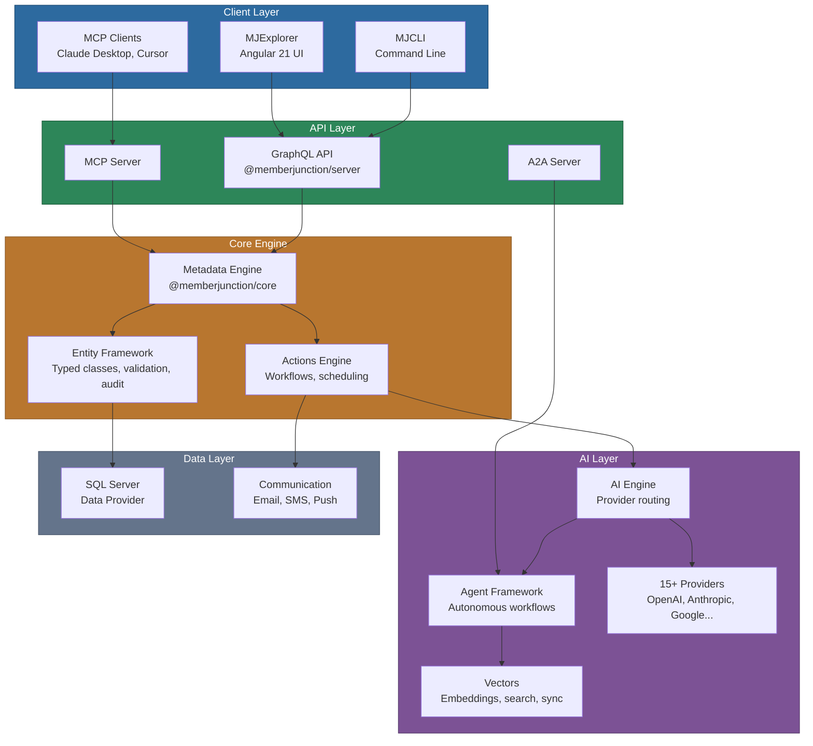

<p align="center">
  <picture>
    <source media="(prefers-color-scheme: dark)" srcset="./MJ_logo_dark.png">
    <source media="(prefers-color-scheme: light)" srcset="./MJ_logo.webp">
    
  </picture>
</p>

<h3 align="center">The open-source, AI-native data platform.</h3>

<p align="center">
  Unify your data. Add intelligence. Ship faster.
</p>

<p align="center">
  <a href="https://github.com/MemberJunction/MJ/blob/main/LICENSE"></a>
  <a href="https://www.npmjs.com/package/@memberjunction/core"></a>
  <a href="https://www.typescriptlang.org/"></a>
  <a href="https://github.com/MemberJunction/MJ/stargazers"></a>
  <a href="https://docs.memberjunction.org"></a>
  <a href="https://github.com/MemberJunction/MJ/issues"></a>
</p>

---

## What is MemberJunction?

MemberJunction is a **metadata-driven application platform** that turns your database into a fully functional application — complete with auto-generated APIs, forms, security, and deep AI integration. Define your schema, and MJ generates everything else: typed entity classes, GraphQL endpoints, Angular UI components, validation, and audit trails.

What makes it different: **175 modular TypeScript packages** that work together or independently, **15+ AI providers** behind a single abstraction layer, and an **agent framework** for building autonomous workflows — all driven by metadata, not boilerplate.

```typescript
// Three lines to load, modify, and save any entity — fully typed, validated, and audited
const md = new Metadata();
const customer = await md.GetEntityObject<CustomerEntity>('Customers');
await customer.Load(customerId);
customer.Status = 'Active';
await customer.Save(); // Triggers validation, audit logging, and downstream actions automatically
```

```typescript
// Swap AI providers with zero code changes
const ai = new AIEngine();
const result = await ai.ChatCompletion({
  model: 'gpt-4o',          // or 'claude-sonnet-4-5-20250929', 'gemini-pro', 'llama-3', ...
  messages: [{ role: 'user', content: 'Summarize this quarter\'s metrics' }],
  data: await rv.RunView({ EntityName: 'Quarterly Reports', ResultType: 'simple' })
});
```

---

## Key Capabilities

<table>
<tr>
<td width="50%" valign="top">

### Metadata-Driven Core
- **Auto-generated APIs** — GraphQL endpoints from database schema
- **Typed entity classes** — Full TypeScript with validation and change tracking
- **Dynamic UI** — Angular forms, grids, and dashboards generated from metadata
- **Row-level security** — Fine-grained access control with field-level permissions
- **Audit trail** — Every change tracked automatically via Record Changes

</td>
<td width="50%" valign="top">

### AI-Native Platform
- **15+ AI providers** — OpenAI, Anthropic, Google, Mistral, Groq, and [more](./packages/AI/Providers)
- **Agent framework** — Autonomous multi-step workflows with sub-agent delegation
- **Vector operations** — Embedding, semantic search, duplicate detection, and sync
- **MCP + A2A protocols** — Interop with Claude Desktop, Cursor, and external agents
- **Prompt engine** — Hierarchical templates with model selection and execution tracking

</td>
</tr>
<tr>
<td width="50%" valign="top">

### Communication & Automation
- **Multi-channel messaging** — Email (SendGrid, Gmail, MSGraph), SMS (Twilio)
- **Actions framework** — Metadata-driven business logic for workflows and agents
- **Scheduled jobs** — Cron-based scheduling with distributed locking
- **Template engine** — Nunjucks templates with AI-powered content generation

</td>
<td width="50%" valign="top">

### Developer Experience
- **175 npm packages** — Use the whole platform or just the pieces you need
- **Code generation** — Entity classes, stored procedures, views, and Angular forms
- **CLI tooling** — Command-line tools for codegen, metadata sync, and AI operations
- **Docker support** — Containerized deployment with Flyway migrations

</td>
</tr>
</table>

---

## Quick Start

```bash
# Clone and install
git clone https://github.com/MemberJunction/MJ.git && cd MJ
npm install

# Configure your database and auth
cp install.config.json.example install.config.json
# Edit install.config.json with your SQL Server connection and auth settings

# Initialize the database
node InstallMJ.js

# Start the platform
npm run start:api        # GraphQL API on port 4000
npm run start:explorer   # Angular UI on port 4200
```

> **Prerequisites:** Node.js 20+, npm 9+, SQL Server 2019+ (or Azure SQL), Angular CLI 21+

> **Full documentation:** [docs.memberjunction.org](https://docs.memberjunction.org)

---

## Architecture



> **[Full package directory with 175 packages](#-full-package-directory)** | **[packages/ overview](./packages/README.md)**

---

## AI Providers

Connect to any major AI service through a unified API — swap providers with zero code changes:

| Provider | Capabilities | Package |
|----------|-------------|---------|
| **OpenAI** | GPT-4o, o1/o3 reasoning, DALL-E, Whisper, embeddings | [`@memberjunction/ai-openai`](./packages/AI/Providers/OpenAI) |
| **Anthropic** | Claude 4 family, streaming, prompt caching, extended thinking | [`@memberjunction/ai-anthropic`](./packages/AI/Providers/Anthropic) |
| **Google Gemini** | Gemini Pro/Flash, native multimodal, long context | [`@memberjunction/ai-gemini`](./packages/AI/Providers/Gemini) |
| **Azure OpenAI** | Enterprise Azure-hosted models | [`@memberjunction/ai-azure`](./packages/AI/Providers/Azure) |
| **Amazon Bedrock** | Multi-model access via AWS | [`@memberjunction/ai-bedrock`](./packages/AI/Providers/Bedrock) |
| **Google Vertex** | Vertex AI platform integration | [`@memberjunction/ai-vertex`](./packages/AI/Providers/Vertex) |
| **Mistral** | Open-source and commercial models, embeddings | [`@memberjunction/ai-mistral`](./packages/AI/Providers/Mistral) |
| **Groq** | Ultra-fast LPU inference | [`@memberjunction/ai-groq`](./packages/AI/Providers/Groq) |
| **Ollama** | Local inference, no API keys | [`@memberjunction/ai-ollama`](./packages/AI/Providers/Ollama) |
| **+ 6 more** | Cerebras, Fireworks, OpenRouter, LM Studio, xAI, Cohere | [All providers →](./packages/AI/Providers) |

**Specialized:** [ElevenLabs](./packages/AI/Providers/ElevenLabs) (TTS) · [HeyGen](./packages/AI/Providers/HeyGen) (video) · [BlackForestLabs](./packages/AI/Providers/BlackForestLabs) (image gen) · [Pinecone](./packages/AI/Providers/Vectors-Pinecone) (vectors)

---

## Agent Framework

Build autonomous AI agents that orchestrate complex, multi-step workflows:

- **[AI Agents](./packages/AI/Agents)** — Core execution engine with hierarchical prompt composition, sub-agent delegation, and automatic context compression
- **LoopAgentType** — Iterative agents with ForEach/While operations (90% token reduction for batch tasks)
- **FlowAgentType** — Deterministic workflow graphs with conditional branching and parallel execution
- **[MCP Server](./packages/AI/MCPServer)** — Expose MJ entities and agents as tools for Claude Desktop, Cursor, and other MCP clients
- **[A2A Server](./packages/AI/A2AServer)** — Google's Agent-to-Agent protocol for cross-platform agent interop
- **[Prompt Engine](./packages/AI/Prompts)** — Hierarchical templates, model selection, effort level control, and execution tracking

---

## Deployment

```bash
# Docker
docker build -f docker/MJAPI/Dockerfile -t memberjunction/api .
docker-compose up -d

# Database migrations (Flyway)
# Versioned migrations in /migrations/v2/ run automatically on startup
```

**Security:** Auth0 + Azure AD (MSAL) authentication, row-level security, field permissions, GraphQL query depth limiting, and complete audit logging.

---

## Upgrading

- **[v5.0 Upgrade Guide](./UPGRADE-v5.0.md)** — Breaking changes, automated migration tools, and step-by-step instructions for upgrading from v4.x
- **[General Upgrade Procedure](./UPDATES.md)** — Standard process for upgrading across environments (dev/stage/prod)

## Contributing

We welcome contributions!

- **[GitHub Issues](https://github.com/MemberJunction/MJ/issues)** — Bug reports and feature requests
- **[Discussions](https://github.com/MemberJunction/MJ/discussions)** — Questions and ideas
- **[Documentation](https://docs.memberjunction.org)** — Full platform docs
- **Development Guide** — See [`CLAUDE.md`](./CLAUDE.md) for coding standards, naming conventions, and architecture guidelines

## License

MemberJunction is open source under the [ISC License](./LICENSE).

---

## 📦 Full Package Directory

> Every package in the MemberJunction monorepo, organized by directory. Click any package to jump to its README.

### [Actions](./packages/Actions/README.md)

Metadata-driven action framework for workflows, agents, and automation (13 packages).

#### Core

| Package | npm | Description |
|---------|-----|-------------|
| [Engine](./packages/Actions/Engine/README.md) | `@memberjunction/actions` | Main library for MemberJunction Actions. This library is only intended to be imported on the server side. |
| [Base](./packages/Actions/Base/README.md) | `@memberjunction/actions-base` | Base classes and interfaces for the Actions framework. Used on both server and network nodes. |
| [CoreActions](./packages/Actions/CoreActions/README.md) | `@memberjunction/core-actions` | Library of generated and custom actions for the core MemberJunction framework, maintained by MemberJunction. |
| [CodeExecution](./packages/Actions/CodeExecution/README.md) | `@memberjunction/code-execution` | Sandboxed code execution service for MemberJunction actions and agents. |

#### Integrations

| Package | npm | Description |
|---------|-----|-------------|
| [ApolloEnrichment](./packages/Actions/ApolloEnrichment/README.md) | `@memberjunction/actions-apollo` | Action classes that wrap the Apollo.io data enrichment API for contacts and accounts. |
| [ContentAutotag](./packages/Actions/ContentAutotag/README.md) | `@memberjunction/actions-content-autotag` | Action classes that execute the content autotagging and vectorization actions. |

#### Scheduling

| Package | npm | Description |
|---------|-----|-------------|
| [ScheduledActions](./packages/Actions/ScheduledActions/README.md) | `@memberjunction/scheduled-actions` | Allows system administrators to schedule any MemberJunction action for recurring or one-time future execution. |
| [ScheduledActionsServer](./packages/Actions/ScheduledActionsServer/README.md) | `@memberjunction/scheduled-actions-server` | Simple application server that can be called via URL to invoke Scheduled Actions. |

#### [Actions / BizApps](./packages/Actions/BizApps/README.md)

Business application-specific actions for integrating with external business systems.

| Package | npm | Description |
|---------|-----|-------------|
| [Accounting](./packages/Actions/BizApps/Accounting/README.md) | `@memberjunction/actions-bizapps-accounting` | Accounting system integration actions (QuickBooks, NetSuite, Sage, Dynamics) |
| [CRM](./packages/Actions/BizApps/CRM/README.md) | `@memberjunction/actions-bizapps-crm` | CRM system integration actions (Salesforce, HubSpot, Dynamics, Pipedrive) |
| [FormBuilders](./packages/Actions/BizApps/FormBuilders/README.md) | `@memberjunction/actions-bizapps-formbuilders` | Form builder and survey platform integration actions (Typeform, Google Forms, Jotform) |
| [LMS](./packages/Actions/BizApps/LMS/README.md) | `@memberjunction/actions-bizapps-lms` | Learning management system integration actions (Moodle, Canvas, Blackboard, LearnDash) |
| [Social](./packages/Actions/BizApps/Social/README.md) | `@memberjunction/actions-bizapps-social` | Social media integration actions (Twitter, LinkedIn, Facebook, Instagram, TikTok, YouTube, HootSuite, Buffer) |

### [AI](./packages/AI/README.md)

AI infrastructure -- model abstractions, provider implementations, vector operations, agent management, and supporting tools (42 packages).

#### Core Packages

| Package | npm | Description |
|---------|-----|-------------|
| [Core](./packages/AI/Core/README.md) | `@memberjunction/ai` | Base AI abstractions and interfaces for LLMs, embeddings, audio/video generation; zero MJ dependencies beyond `@memberjunction/global` |
| [CorePlus](./packages/AI/CorePlus/README.md) | `@memberjunction/ai-core-plus` | Extended AI components that require MJ entity concepts; usable on both server and client |
| [BaseAIEngine](./packages/AI/BaseAIEngine/README.md) | `@memberjunction/ai-engine-base` | Base AI engine with extended types and data caching; usable anywhere |
| [Engine](./packages/AI/Engine/README.md) | `@memberjunction/aiengine` | AI orchestration engine handling automatic execution of Entity AI Actions using AI Models |
| [Prompts](./packages/AI/Prompts/README.md) | `@memberjunction/ai-prompts` | Prompt execution engine with hierarchical template composition, system placeholders, parallel execution, and output validation |
| [Agents](./packages/AI/Agents/README.md) | `@memberjunction/ai-agents` | AI agent execution and management with metadata-driven agent types and sub-agent delegation |
| [Reranker](./packages/AI/Reranker/README.md) | `@memberjunction/ai-reranker` | AI reranker service and LLM-based reranking for two-stage retrieval |

#### Protocol and Server Packages

| Package | npm | Description |
|---------|-----|-------------|
| [A2AServer](./packages/AI/A2AServer/README.md) | `@memberjunction/a2aserver` | Agent-to-Agent (A2A) protocol server for AI agent interoperability via Google's A2A protocol |
| [MCPServer](./packages/AI/MCPServer/README.md) | `@memberjunction/ai-mcp-server` | Model Context Protocol (MCP) server providing entity CRUD and AI agent execution to MCP-compatible clients |
| [MCPClient](./packages/AI/MCPClient/README.md) | `@memberjunction/ai-mcp-client` | MCP client implementation for consuming external MCP servers |

#### CLI

| Package | npm | Description |
|---------|-----|-------------|
| [AICLI](./packages/AI/AICLI/README.md) | `@memberjunction/ai-cli` | AI agent, prompt, and action execution CLI integrated with the main MJ CLI |

#### [AI / Providers](./packages/AI/Providers/README.md)

LLM, embedding, cloud-platform, local-inference, and specialty AI provider implementations (23 packages).

**LLM Providers**

| Package | npm | Description |
|---------|-----|-------------|
| [Anthropic](./packages/AI/Providers/Anthropic/README.md) | `@memberjunction/ai-anthropic` | Wrapper for Anthropic AI Models (Claude) |
| [Gemini](./packages/AI/Providers/Gemini/README.md) | `@memberjunction/ai-gemini` | Wrapper for Google Gemini AI Models |
| [Groq](./packages/AI/Providers/Groq/README.md) | `@memberjunction/ai-groq` | Wrapper for Groq AI LPU inference engine |
| [Mistral](./packages/AI/Providers/Mistral/README.md) | `@memberjunction/ai-mistral` | Wrapper for Mistral AI Models |
| [OpenAI](./packages/AI/Providers/OpenAI/README.md) | `@memberjunction/ai-openai` | Wrapper for OpenAI AI Models (GPT-4, etc.) |
| [xAI](./packages/AI/Providers/xAI/README.md) | `@memberjunction/ai-xai` | Wrapper for xAI models (Grok) |

**Cloud Platform Providers**

| Package | npm | Description |
|---------|-----|-------------|
| [Azure](./packages/AI/Providers/Azure/README.md) | `@memberjunction/ai-azure` | Azure AI Provider for MemberJunction |
| [Bedrock](./packages/AI/Providers/Bedrock/README.md) | `@memberjunction/ai-bedrock` | Wrapper for Amazon Bedrock AI Models |
| [Vertex](./packages/AI/Providers/Vertex/README.md) | `@memberjunction/ai-vertex` | Wrapper for Google Vertex AI Models |

**Inference Routers and Aggregators**

| Package | npm | Description |
|---------|-----|-------------|
| [Fireworks](./packages/AI/Providers/Fireworks/README.md) | `@memberjunction/ai-fireworks` | Wrapper for Fireworks.ai AI Models |
| [OpenRouter](./packages/AI/Providers/OpenRouter/README.md) | `@memberjunction/ai-openrouter` | Wrapper for OpenRouter AI inference services |

**Local Inference**

| Package | npm | Description |
|---------|-----|-------------|
| [LMStudio](./packages/AI/Providers/LMStudio/README.md) | `@memberjunction/ai-lmstudio` | Wrapper for LM Studio AI - Local Inference Engine |
| [Ollama](./packages/AI/Providers/Ollama/README.md) | `@memberjunction/ai-ollama` | Wrapper for Ollama - Local Inference |

**Specialized Providers**

| Package | npm | Description |
|---------|-----|-------------|
| [BettyBot](./packages/AI/Providers/BettyBot/README.md) | `@memberjunction/ai-betty-bot` | Wrapper for Betty Bot conversational AI |
| [BlackForestLabs](./packages/AI/Providers/BlackForestLabs/README.md) | `@memberjunction/ai-blackforestlabs` | Wrapper for Black Forest Labs FLUX Image Generation Models |
| [Cerebras](./packages/AI/Providers/Cerebras/README.md) | `@memberjunction/ai-cerebras` | Wrapper for Cerebras AI inference engine |
| [Cohere](./packages/AI/Providers/Cohere/README.md) | `@memberjunction/ai-cohere` | Cohere AI Provider - Semantic reranking using Cohere's Rerank API |
| [ElevenLabs](./packages/AI/Providers/ElevenLabs/README.md) | `@memberjunction/ai-elevenlabs` | Wrapper for ElevenLabs Audio Generation (TTS) |
| [HeyGen](./packages/AI/Providers/HeyGen/README.md) | `@memberjunction/ai-heygen` | Wrapper for HeyGen Video Generation |
| [LocalEmbeddings](./packages/AI/Providers/LocalEmbeddings/README.md) | `@memberjunction/ai-local-embeddings` | Local Embeddings Models via Xenova/Transformers |

**Vector Database Providers**

| Package | npm | Description |
|---------|-----|-------------|
| [Vectors-Pinecone](./packages/AI/Providers/Vectors-Pinecone/README.md) | `@memberjunction/ai-vectors-pinecone` | Pinecone Implementation for AI Vectors |

**Recommendation Providers**

| Package | npm | Description |
|---------|-----|-------------|
| [Recommendations-Rex](./packages/AI/Providers/Recommendations-Rex/README.md) | `@memberjunction/ai-recommendations-rex` | Recommendations Provider for rasa.io Rex engine |

**Meta / Utility**

| Package | npm | Description |
|---------|-----|-------------|
| [Bundle](./packages/AI/Providers/Bundle/README.md) | `@memberjunction/ai-provider-bundle` | Loads all standard AI providers to prevent tree-shaking |

#### [AI / Vectors](./packages/AI/Vectors/README.md)

Vector storage, search, and synchronization (5 packages).

| Package | npm | Description |
|---------|-----|-------------|
| [Core](./packages/AI/Vectors/Core/README.md) | `@memberjunction/ai-vectors` | Core vector operations and abstractions for entity vectorization |
| [Database](./packages/AI/Vectors/Database/README.md) | `@memberjunction/ai-vectordb` | Vector database abstraction layer (index management, query operations) |
| [Dupe](./packages/AI/Vectors/Dupe/README.md) | `@memberjunction/ai-vector-dupe` | Duplicate record detection using vector similarity |
| [Memory](./packages/AI/Vectors/Memory/README.md) | `@memberjunction/ai-vectors-memory` | In-memory vector utilities |
| [Sync](./packages/AI/Vectors/Sync/README.md) | `@memberjunction/ai-vector-sync` | Synchronization between MemberJunction entities and vector databases |

#### [AI / AgentManager](./packages/AI/AgentManager/README.md)

Meta-agent system for creating, managing, and orchestrating AI agents (2 packages).

| Package | npm | Description |
|---------|-----|-------------|
| [core](./packages/AI/AgentManager/core/README.md) | `@memberjunction/ai-agent-manager` | Core interfaces, types, and the `AgentSpec` class for agent metadata management |
| [actions](./packages/AI/AgentManager/actions/README.md) | `@memberjunction/ai-agent-manager-actions` | Agent management actions (create, update, list, deactivate, export, etc.) |

#### [AI / Recommendations](./packages/AI/Recommendations/README.md)

Provider-agnostic recommendation engine framework (1 package).

| Package | npm | Description |
|---------|-----|-------------|
| [Engine](./packages/AI/Recommendations/Engine/README.md) | `@memberjunction/ai-recommendations` | Core recommendation engine with provider pattern, run tracking, and entity integration |

### [Angular](./packages/Angular/README.md)

Angular UI framework -- the Bootstrap package, Explorer application components, and a comprehensive library of reusable generic components (61 packages).

| Package | npm | Description |
|---------|-----|-------------|
| [Bootstrap](./packages/Angular/Bootstrap/README.md) | `@memberjunction/ng-bootstrap` | Angular bootstrap and class registration manifest |

#### [Angular / Explorer](./packages/Angular/Explorer/README.md)

The MJExplorer application -- MemberJunction's primary Angular-based UI for browsing, editing, and managing data (19 packages).

**Core / Shell**

| Package | npm | Description |
|---------|-----|-------------|
| [explorer-app](./packages/Angular/Explorer/explorer-app/README.md) | `@memberjunction/ng-explorer-app` | Complete branded entry point for Explorer-style applications |
| [explorer-core](./packages/Angular/Explorer/explorer-core/README.md) | `@memberjunction/ng-explorer-core` | Core Explorer framework: application shell, routing, resource containers, and navigation |
| [explorer-modules](./packages/Angular/Explorer/explorer-modules/README.md) | `@memberjunction/ng-explorer-modules` | Consolidated Explorer NgModule bundle that re-exports all Explorer feature modules |
| [kendo-modules](./packages/Angular/Explorer/kendo-modules/README.md) | `@memberjunction/ng-kendo-modules` | Consolidated Kendo UI NgModule bundle for shared Kendo component imports |
| [base-application](./packages/Angular/Explorer/base-application/README.md) | `@memberjunction/ng-base-application` | BaseApplication class system for app-centric navigation |
| [auth-services](./packages/Angular/Explorer/auth-services/README.md) | `@memberjunction/ng-auth-services` | Authentication services with Auth0, MSAL, and Okta provider support |
| [shared](./packages/Angular/Explorer/shared/README.md) | `@memberjunction/ng-shared` | Shared Explorer utilities, base components, services, and events used across Explorer packages |
| [workspace-initializer](./packages/Angular/Explorer/workspace-initializer/README.md) | `@memberjunction/ng-workspace-initializer` | Workspace initialization service and components for bootstrapping the Explorer environment |

**Forms & Entity Editing**

| Package | npm | Description |
|---------|-----|-------------|
| [base-forms](./packages/Angular/Explorer/base-forms/README.md) | `@memberjunction/ng-base-forms` | Base form components, field rendering, and validation framework |
| [core-entity-forms](./packages/Angular/Explorer/core-entity-forms/README.md) | `@memberjunction/ng-core-entity-forms` | Auto-generated and custom entity forms with dynamic form loading and registration |
| [entity-form-dialog](./packages/Angular/Explorer/entity-form-dialog/README.md) | `@memberjunction/ng-entity-form-dialog` | Modal dialog for displaying and editing any entity record |
| [form-toolbar](./packages/Angular/Explorer/form-toolbar/README.md) | `@memberjunction/ng-form-toolbar` | Form action toolbar providing save, cancel, delete, and navigation controls |

**Data Grids & Lists**

| Package | npm | Description |
|---------|-----|-------------|
| [list-detail-grid](./packages/Angular/Explorer/list-detail-grid/README.md) | `@memberjunction/ng-list-detail-grid` | Master-detail grid for displaying dynamic and saved list details |
| [simple-record-list](./packages/Angular/Explorer/simple-record-list/README.md) | `@memberjunction/ng-simple-record-list` | Lightweight component for displaying, editing, creating, and deleting records in any entity |

**Dashboards**

| Package | npm | Description |
|---------|-----|-------------|
| [dashboards](./packages/Angular/Explorer/dashboards/README.md) | `@memberjunction/ng-dashboards` | Dashboard components including AI model management, Entity Admin ERD, and Actions configuration |

**Utility & Navigation**

| Package | npm | Description |
|---------|-----|-------------|
| [link-directives](./packages/Angular/Explorer/link-directives/README.md) | `@memberjunction/ng-link-directives` | Directives for turning elements into email, web, or record links |
| [entity-permissions](./packages/Angular/Explorer/entity-permissions/README.md) | `@memberjunction/ng-entity-permissions` | Components for displaying and editing entity-level permissions |
| [explorer-settings](./packages/Angular/Explorer/explorer-settings/README.md) | `@memberjunction/ng-explorer-settings` | Reusable components for the Explorer settings section |
| [record-changes](./packages/Angular/Explorer/record-changes/README.md) | `@memberjunction/ng-record-changes` | Change-tracking dialog with diff visualization for individual records |

#### [Angular / Generic](./packages/Angular/Generic/README.md)

Reusable Angular components and services shared across MemberJunction applications (41 packages).

**Core & Base Types**

| Package | npm | Description |
|---------|-----|-------------|
| [base-types](./packages/Angular/Generic/base-types/README.md) | `@memberjunction/ng-base-types` | Simple types that are used across many generic Angular UI components for coordination |
| [shared](./packages/Angular/Generic/shared/README.md) | `@memberjunction/ng-shared-generic` | Utility services and reusable elements used in any Angular application |
| [container-directives](./packages/Angular/Generic/container-directives/README.md) | `@memberjunction/ng-container-directives` | Fill Container for auto-resizing and plain container directives for element identification/binding |
| [Testing](./packages/Angular/Generic/Testing/README.md) | `@memberjunction/ng-testing` | Testing components and utilities for Angular applications |

**AI & Chat**

| Package | npm | Description |
|---------|-----|-------------|
| [chat](./packages/Angular/Generic/chat/README.md) | `@memberjunction/ng-chat` | Reusable chat component for AI or peer-to-peer chat applications |
| [conversations](./packages/Angular/Generic/conversations/README.md) | `@memberjunction/ng-conversations` | Conversation, collection, and artifact management components |
| [agents](./packages/Angular/Generic/agents/README.md) | `@memberjunction/ng-agents` | Reusable components for AI Agent management including permissions panel, dialog, and slideover |
| [ai-test-harness](./packages/Angular/Generic/ai-test-harness/README.md) | `@memberjunction/ng-ai-test-harness` | Reusable component for testing AI agents and prompts with beautiful UX |
| [skip-chat](./packages/Angular/Generic/skip-chat/README.md) | `@memberjunction/ng-skip-chat` | **DEPRECATED** -- use `@memberjunction/ng-conversations` instead |
| [artifacts](./packages/Angular/Generic/artifacts/README.md) | `@memberjunction/ng-artifacts` | Artifact viewer plugin system for rendering different artifact types (JSON, Code, Markdown, HTML, SVG, Components) |

**Entity & Data**

| Package | npm | Description |
|---------|-----|-------------|
| [entity-viewer](./packages/Angular/Generic/entity-viewer/README.md) | `@memberjunction/ng-entity-viewer` | Components for viewing entity data in multiple formats (grid, cards) with filtering, selection, and shared data management |
| [entity-communication](./packages/Angular/Generic/entity-communication/README.md) | `@memberjunction/ng-entity-communications` | Components to allow a user to select templates, preview messages, and send them |
| [entity-relationship-diagram](./packages/Angular/Generic/entity-relationship-diagram/README.md) | `@memberjunction/ng-entity-relationship-diagram` | Entity Relationship Diagram (ERD) component for visualizing entity relationships using D3.js force-directed graphs |
| [data-context](./packages/Angular/Generic/data-context/README.md) | `@memberjunction/ng-data-context` | Component and pop-up window to display and edit the contents of a data context |
| [deep-diff](./packages/Angular/Generic/deep-diff/README.md) | `@memberjunction/ng-deep-diff` | Component to display the differences between two objects, using the non-visual functionality from `@memberjunction/global` |
| [record-selector](./packages/Angular/Generic/record-selector/README.md) | `@memberjunction/ng-record-selector` | Components to allow a user to select/deselect items from a possible set |
| [find-record](./packages/Angular/Generic/find-record/README.md) | `@memberjunction/ng-find-record` | Component to allow a user to find a single record in any entity |
| [join-grid](./packages/Angular/Generic/join-grid/README.md) | `@memberjunction/ng-join-grid` | Grid component for displaying/editing the relationship between two entities (e.g., Users + Roles in a single grid) |

**Actions & Workflows**

| Package | npm | Description |
|---------|-----|-------------|
| [actions](./packages/Angular/Generic/actions/README.md) | `@memberjunction/ng-actions` | Reusable components for testing and running actions with no Kendo dependencies |
| [action-gallery](./packages/Angular/Generic/action-gallery/README.md) | `@memberjunction/ng-action-gallery` | Filterable gallery component for browsing and selecting actions |
| [flow-editor](./packages/Angular/Generic/flow-editor/README.md) | `@memberjunction/ng-flow-editor` | Generic visual flow editor component powered by Foblex Flow, with an agent-specific Flow Agent Editor |
| [tasks](./packages/Angular/Generic/tasks/README.md) | `@memberjunction/ng-tasks` | Components for task visualization and management with Gantt chart support |

**Query & Reporting**

| Package | npm | Description |
|---------|-----|-------------|
| [query-grid](./packages/Angular/Generic/query-grid/README.md) | `@memberjunction/ng-query-grid` | Grid to display any MemberJunction Query |
| [query-viewer](./packages/Angular/Generic/query-viewer/README.md) | `@memberjunction/ng-query-viewer` | Components for viewing and executing stored queries with parameter input, interactive results grid, and entity linking |
| [filter-builder](./packages/Angular/Generic/filter-builder/README.md) | `@memberjunction/ng-filter-builder` | Modern, intuitive filter builder for creating complex boolean filter expressions with portable JSON format |

**Dashboard & Layout**

| Package | npm | Description |
|---------|-----|-------------|
| [dashboard-viewer](./packages/Angular/Generic/dashboard-viewer/README.md) | `@memberjunction/ng-dashboard-viewer` | Components for metadata-driven dashboards with Golden Layout panels, supporting views, queries, artifacts, and custom content |
| [tab-strip](./packages/Angular/Generic/tab-strip/README.md) | `@memberjunction/ng-tabstrip` | Simple tab strip component used in the MJ Explorer app and reusable anywhere else |
| [timeline](./packages/Angular/Generic/timeline/README.md) | `@memberjunction/ng-timeline` | Responsive timeline component; works with MemberJunction entities or plain JavaScript objects with no external dependencies |
| [trees](./packages/Angular/Generic/trees/README.md) | `@memberjunction/ng-trees` | Tree and tree-dropdown components for hierarchical entity selection |
| [markdown](./packages/Angular/Generic/markdown/README.md) | `@memberjunction/ng-markdown` | Lightweight markdown component with Prism.js highlighting, Mermaid diagrams, and extensible features |
| [notifications](./packages/Angular/Generic/notifications/README.md) | `@memberjunction/ng-notifications` | Simple library for displaying user notifications |

**Credentials & Permissions**

| Package | npm | Description |
|---------|-----|-------------|
| [credentials](./packages/Angular/Generic/credentials/README.md) | `@memberjunction/ng-credentials` | Components for credential management -- panels and dialogs for creating and editing credentials |
| [resource-permissions](./packages/Angular/Generic/resource-permissions/README.md) | `@memberjunction/ng-resource-permissions` | Generic components for displaying/editing permissions for a resource |

**UI Utilities**

| Package | npm | Description |
|---------|-----|-------------|
| [generic-dialog](./packages/Angular/Generic/generic-dialog/README.md) | `@memberjunction/ng-generic-dialog` | Component for a generic dialog |
| [code-editor](./packages/Angular/Generic/code-editor/README.md) | `@memberjunction/ng-code-editor` | Angular code editor component |
| [file-storage](./packages/Angular/Generic/file-storage/README.md) | `@memberjunction/ng-file-storage` | Components for managing files and related operations |
| [export-service](./packages/Angular/Generic/export-service/README.md) | `@memberjunction/ng-export-service` | Export service and dialog for exporting data to Excel, CSV, and JSON |
| [list-management](./packages/Angular/Generic/list-management/README.md) | `@memberjunction/ng-list-management` | Components for managing entity list membership with responsive UI |
| [react](./packages/Angular/Generic/react/README.md) | `@memberjunction/ng-react` | Angular components for hosting React components in MemberJunction applications |
| [user-avatar](./packages/Angular/Generic/user-avatar/README.md) | `@memberjunction/ng-user-avatar` | User Avatar Service -- manages user avatar synchronization from auth providers and avatar operations |
| [versions](./packages/Angular/Generic/versions/README.md) | `@memberjunction/ng-versions` | Version History Components -- label creation, detail viewing, and slide panel |

### [APIKeys](./packages/APIKeys/README.md)

Server-side API key authorization with hierarchical scopes and pattern-based access control (2 packages).

| Package | npm | Description |
|---------|-----|-------------|
| [Base](./packages/APIKeys/Base/README.md) | `@memberjunction/api-keys-base` | Metadata caching for API scopes, applications, and key bindings (client or server) |
| [Engine](./packages/APIKeys/Engine/README.md) | `@memberjunction/api-keys` | Server-side authorization engine with hierarchical scopes and application-level restrictions |

### [Communication](./packages/Communication/README.md)

Multi-channel messaging -- message composition, delivery, and entity-level integration (10 packages).

| Package | npm | Description |
|---------|-----|-------------|
| [base-types](./packages/Communication/base-types/README.md) | `@memberjunction/communication-types` | Core interfaces, base provider abstract class, message/recipient types, and template integration types |
| [engine](./packages/Communication/engine/README.md) | `@memberjunction/communication-engine` | Main communication engine -- provider management, template rendering, message orchestration, and batch processing |
| [entity-comm-base](./packages/Communication/entity-comm-base/README.md) | `@memberjunction/entity-communications-base` | Base types for client/server use with the Entity Communications Engine |
| [entity-comm-client](./packages/Communication/entity-comm-client/README.md) | `@memberjunction/entity-communications-client` | Client-side GraphQL integration for entity communications and template preview |
| [entity-comm-server](./packages/Communication/entity-comm-server/README.md) | `@memberjunction/entity-communications-server` | Server-side bridge between the MJ entities framework and the communication framework |
| [notifications](./packages/Communication/notifications/README.md) | `@memberjunction/notifications` | Unified notification system with multi-channel delivery via the communication engine |

#### [Communication / Providers](./packages/Communication/providers/README.md)

Email and SMS delivery provider implementations.

| Package | npm | Description |
|---------|-----|-------------|
| [gmail](./packages/Communication/providers/gmail/README.md) | `@memberjunction/communication-gmail` | Gmail/Google Suite provider for MemberJunction Communication framework |
| [MSGraph](./packages/Communication/providers/MSGraph/README.md) | `@memberjunction/communication-ms-graph` | Microsoft Graph provider for the MJ Communication framework |
| [sendgrid](./packages/Communication/providers/sendgrid/README.md) | `@memberjunction/communication-sendgrid` | SendGrid provider for the MJ Communication framework |
| [twilio](./packages/Communication/providers/twilio/README.md) | `@memberjunction/communication-twilio` | Twilio provider for MemberJunction Communication framework |

### [Credentials](./packages/Credentials/)

Secure credential management (1 package).

| Package | npm | Description |
|---------|-----|-------------|
| [Engine](./packages/Credentials/Engine/README.md) | `@memberjunction/credentials` | Credential Engine - secure credential management with caching, encryption, and audit logging |

### [React](./packages/React/README.md)

React component infrastructure for the MemberJunction platform (2 packages).

| Package | npm | Description |
|---------|-----|-------------|
| [runtime](./packages/React/runtime/README.md) | `@memberjunction/react-runtime` | Platform-agnostic component runtime with Babel compilation, registry, and error boundaries |
| [test-harness](./packages/React/test-harness/README.md) | `@memberjunction/react-test-harness` | Playwright-based test harness for validating React components |

### [Scheduling](./packages/Scheduling/README.md)

Distributed scheduled-jobs system with cron-based scheduling and plugin-based execution (4 packages).

| Package | npm | Description |
|---------|-----|-------------|
| [base-types](./packages/Scheduling/base-types/README.md) | `@memberjunction/scheduling-base-types` | Core type definitions and interfaces for the scheduled jobs system (zero heavy dependencies) |
| [base-engine](./packages/Scheduling/base-engine/README.md) | `@memberjunction/scheduling-engine-base` | Metadata caching layer and adaptive polling interval calculation |
| [engine](./packages/Scheduling/engine/README.md) | `@memberjunction/scheduling-engine` | Server-side execution engine with distributed locking and driver-based job execution |
| [actions](./packages/Scheduling/actions/README.md) | `@memberjunction/scheduling-actions` | MJ Actions for programmatic job management (query, create, update, delete, execute, statistics) |

### [Templates](./packages/Templates/README.md)

Extensible templating engine with AI-powered content generation (2 packages).

| Package | npm | Description |
|---------|-----|-------------|
| [base-types](./packages/Templates/base-types/README.md) | `@memberjunction/templates-base-types` | Core types, base classes, and metadata management for client/server use |
| [engine](./packages/Templates/engine/README.md) | `@memberjunction/templates` | Template rendering engine with Nunjucks integration, AI prompts, and template embedding |

### [TestingFramework](./packages/TestingFramework/README.md)

Metadata-driven testing framework supporting agent evals and multi-oracle evaluation (3 packages).

| Package | npm | Description |
|---------|-----|-------------|
| [EngineBase](./packages/TestingFramework/EngineBase/README.md) | `@memberjunction/testing-engine-base` | Metadata cache for test types, suites, and tests (UI-safe, no execution logic) |
| [Engine](./packages/TestingFramework/Engine/README.md) | `@memberjunction/testing-engine` | Core test execution and evaluation engine supporting multiple test types |
| [CLI](./packages/TestingFramework/CLI/README.md) | `@memberjunction/testing-cli` | Command-line interface for test execution and management |

### Standalone Packages

Packages at the top level of the `packages/` directory, not part of a multi-package group.

#### Core Framework

| Package | npm | Description |
|---------|-----|-------------|
| [MJGlobal](./packages/MJGlobal/README.md) | `@memberjunction/global` | Global class factory and event system -- required by all other MJ components |
| [MJCore](./packages/MJCore/README.md) | `@memberjunction/core` | Core metadata engine, entity framework, and utilities |
| [MJCoreEntities](./packages/MJCoreEntities/README.md) | `@memberjunction/core-entities` | Entity subclasses for the MJ metadata layer (core schema) |
| [MJCoreEntitiesServer](./packages/MJCoreEntitiesServer/README.md) | `@memberjunction/core-entities-server` | Server-only entity subclasses for the MJ metadata layer |
| [Config](./packages/Config/README.md) | `@memberjunction/config` | Central configuration with default configs and merge utilities |

#### Data Layer

| Package | npm | Description |
|---------|-----|-------------|
| [SQLServerDataProvider](./packages/SQLServerDataProvider/README.md) | `@memberjunction/sqlserver-dataprovider` | SQL Server data provider |
| [GraphQLDataProvider](./packages/GraphQLDataProvider/README.md) | `@memberjunction/graphql-dataprovider` | GraphQL client data provider |
| [MJDataContext](./packages/MJDataContext/README.md) | `@memberjunction/data-context` | Runtime data context loading and cross-tier interaction types |
| [MJDataContextServer](./packages/MJDataContextServer/README.md) | `@memberjunction/data-context-server` | Server-side data context implementation with raw SQL support |
| [MJStorage](./packages/MJStorage/README.md) | `@memberjunction/storage` | Cloud storage provider interface for server-side API integration |

#### Server

| Package | npm | Description |
|---------|-----|-------------|
| [MJServer](./packages/MJServer/README.md) | `@memberjunction/server` | GraphQL API access to the MemberJunction data store |
| [ServerBootstrap](./packages/ServerBootstrap/README.md) | `@memberjunction/server-bootstrap` | Server initialization logic and class registration manifests |
| [ServerBootstrapLite](./packages/ServerBootstrapLite/README.md) | `@memberjunction/server-bootstrap-lite` | Lightweight server bootstrap without ESM-incompatible dependencies |
| [MJAPI](./packages/MJAPI/README.md) | `mj_api` | MemberJunction API server application |

#### Code Generation and Tooling

| Package | npm | Description |
|---------|-----|-------------|
| [CodeGenLib](./packages/CodeGenLib/README.md) | `@memberjunction/codegen-lib` | Reusable code generation library for the MemberJunction platform |
| [MJCodeGenAPI](./packages/MJCodeGenAPI/README.md) | `mj_codegen_api` | API engine for MemberJunction CodeGen |
| [GeneratedEntities](./packages/GeneratedEntities/README.md) | `mj_generatedentities` | Auto-generated entity subclasses maintained by CodeGen |
| [GeneratedActions](./packages/GeneratedActions/README.md) | `mj_generatedactions` | Auto-generated action subclasses maintained by CodeGen |

#### Client Applications

| Package | npm | Description |
|---------|-----|-------------|
| [MJExplorer](./packages/MJExplorer/README.md) | `mj_explorer` | MemberJunction Explorer UI (Angular) |
| [MJCLI](./packages/MJCLI/README.md) | `@memberjunction/cli` | MemberJunction command-line tools |
| [AngularElements](./packages/AngularElements/mj-angular-elements-demo/README.md) | `mj_angular_elements_demo` | Angular Elements demo application |

#### Utilities

| Package | npm | Description |
|---------|-----|-------------|
| [ComponentRegistry](./packages/ComponentRegistry/README.md) | `@memberjunction/component-registry-server` | Component registry server API implementation |
| [ComponentRegistryClientSDK](./packages/ComponentRegistryClientSDK/README.md) | `@memberjunction/component-registry-client-sdk` | Component registry client SDK |
| [ContentAutotagging](./packages/ContentAutotagging/README.md) | `@memberjunction/content-autotagging` | Content autotagging application |
| [DBAutoDoc](./packages/DBAutoDoc/README.md) | `@memberjunction/db-auto-doc` | AI-powered database documentation generator for SQL Server, MySQL, and PostgreSQL |
| [DocUtils](./packages/DocUtils/README.md) | `@memberjunction/doc-utils` | Dynamic retrieval and caching of MJ object model documentation |
| [Encryption](./packages/Encryption/README.md) | `@memberjunction/encryption` | Field-level AES-256-GCM/CBC encryption with pluggable key sources |
| [ExternalChangeDetection](./packages/ExternalChangeDetection/README.md) | `@memberjunction/external-change-detection` | Detection of entity changes made by external systems |
| [InteractiveComponents](./packages/InteractiveComponents/README.md) | `@memberjunction/interactive-component-types` | Type specifications for MJ interactive UI components |
| [MetadataSync](./packages/MetadataSync/README.md) | `@memberjunction/metadata-sync` | Metadata synchronization CLI tool |
| [MJExportEngine](./packages/MJExportEngine/README.md) | `@memberjunction/export-engine` | Export engine for Excel, CSV, and JSON with sampling and formatting |
| [MJQueue](./packages/MJQueue/README.md) | `@memberjunction/queue` | Server-side queue management |
| [QueryGen](./packages/QueryGen/README.md) | `@memberjunction/query-gen` | AI-powered SQL query template generation with automatic testing and refinement |
| [SkipTypes](./packages/SkipTypes/README.md) | `@memberjunction/skip-types` | Shared types for the Skip AI Assistant used across MJAPI, Skip API, and Explorer |
| [VersionHistory](./packages/VersionHistory/README.md) | `@memberjunction/version-history` | Label-based versioning, dependency-graph snapshots, cross-entity diffs, and point-in-time restore |

---

<p align="center">
  <a href="https://docs.memberjunction.org">Documentation</a> · <a href="https://github.com/MemberJunction/MJ/issues">Issues</a> · <a href="https://github.com/MemberJunction/MJ/discussions">Discussions</a> · <a href="mailto:support@memberjunction.org">Support</a>
</p>

<p align="center">
  <sub>Built with TypeScript · Angular 21 · SQL Server · Open source under ISC License</sub>
</p>
