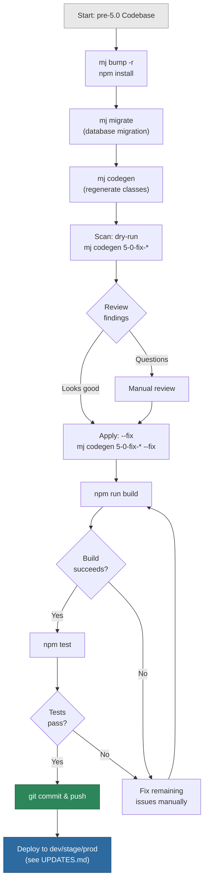

# MemberJunction v5.0 Upgrade Guide

> **Audience:** MJ platform consumers upgrading from any pre-5.0 version to v5.0
> **Estimated effort:** 30 minutes for small projects, 1-2 hours for large codebases
> **Risk level:** Low — automated tools handle 95%+ of changes

---

## What's New in v5.0

MemberJunction v5.0 is a **major version release** with two breaking changes, both related to entity naming:

| Change | Why | Impact |
|--------|-----|--------|
| **Entity Name Normalization** | Prevent naming collisions between MJ core entities and your custom entities | All ~272 core MJ entities get an `MJ: ` prefix |
| **ClassName Prefix Fix** | Prevent TypeScript class name collisions across database schemas | Generated class names incorporate the schema prefix |

Both changes are **fully automated** — the database migration renames entities, and CLI tools fix your source code.

---

## TL;DR — Quick Upgrade

```bash
# 1. Update MJ packages
mj bump -r
npm install

# 2. Run database migration
mj migrate

# 3. Run CodeGen to regenerate entity classes
mj codegen

# 4. Scan your code for old entity names (dry-run first)
mj codegen 5-0-fix-entity-names --path src/
mj codegen 5-0-fix-html-entity-names --path src/
mj codegen 5-0-fix-metadata-names --path metadata/

# 5. Apply fixes
mj codegen 5-0-fix-entity-names --path src/ --fix
mj codegen 5-0-fix-html-entity-names --path src/ --fix
mj codegen 5-0-fix-metadata-names --path metadata/ --fix

# 6. Rebuild and test
npm run build
```

---

## Breaking Change #1: Entity Name Normalization

### What Changed

All **272 core MJ entities** now use an `MJ: ` prefix in their entity name. This prevents collisions when your application defines entities with common names like "Users", "Actions", or "Templates".

```
┌─────────────────────────────────────────────────────────────┐
│                    BEFORE (pre-5.0)                            │
│                                                             │
│   Core MJ entities:     "Users", "Actions", "AI Models"    │
│   Your entities:        "Users" ← COLLISION!                │
│                                                             │
├─────────────────────────────────────────────────────────────┤
│                    AFTER (v5.0)                              │
│                                                             │
│   Core MJ entities:     "MJ: Users", "MJ: Actions",        │
│                         "MJ: AI Models"                     │
│   Your entities:        "Users" ← No conflict!              │
│                                                             │
└─────────────────────────────────────────────────────────────┘
```

### What the Migration Does Automatically

The SQL migration handles the heavy lifting in your database:

1. **Renames all core entities** — Adds `MJ: ` prefix to the `Name` column
2. **Preserves display names** — Sets `DisplayName` to the old short name, so your UI still shows "Users" instead of "MJ: Users"
3. **Updates all foreign key references** — Entity names used in relationship metadata, field metadata, etc. are updated
4. **Refreshes all dependent views** — Database views are recreated with the new names

### What You Need to Fix

Any **hardcoded entity name strings** in your TypeScript, HTML, or metadata files need updating. The most common patterns:

#### TypeScript Code

```typescript
// ❌ BEFORE (pre-5.0) — These will break
const entity = await md.GetEntityObject<UserEntity>('Users');
const results = await rv.RunView({ EntityName: 'AI Models' });
callbacks.OpenEntityRecord('Actions', actionId);
const e = md.EntityByName('Entity Fields');

// ✅ AFTER (v5.0) — Add the "MJ: " prefix
const entity = await md.GetEntityObject<UserEntity>('MJ: Users');
const results = await rv.RunView({ EntityName: 'MJ: AI Models' });
callbacks.OpenEntityRecord('MJ: Actions', actionId);
const e = md.EntityByName('MJ: Entity Fields');
```

#### Angular HTML Templates

```html
<!-- ❌ BEFORE -->
<mj-entity-viewer EntityName="Users"></mj-entity-viewer>
<mj-grid [RowsEntityName]="'Actions'"></mj-grid>

<!-- ✅ AFTER -->
<mj-entity-viewer EntityName="MJ: Users"></mj-entity-viewer>
<mj-grid [RowsEntityName]="'MJ: Actions'"></mj-grid>
```

#### Metadata / JSON Files

```json
// ❌ BEFORE
{ "entity": "Users", "fields": { "Name": "Admin" } }
{ "EntityName": "AI Models" }
"@lookup:Users.Name|Admin"

// ✅ AFTER
{ "entity": "MJ: Users", "fields": { "Name": "Admin" } }
{ "EntityName": "MJ: AI Models" }
"@lookup:MJ: Users.Name|Admin"
```

### Scope of Entity Name Changes

```
╔══════════════════════════════════════════════════════════════════╗
║           Entity Name Normalization — By the Numbers            ║
╠══════════════════════════════════════════════════════════════════╣
║                                                                  ║
║   Total core MJ entities:           272                          ║
║   Entities renamed (gained prefix):  ~160                        ║
║   Already had prefix (unchanged):    ~110                        ║
║                                                                  ║
║   Examples of renamed entities:                                  ║
║   ├── "Users"              → "MJ: Users"                        ║
║   ├── "Actions"            → "MJ: Actions"                      ║
║   ├── "AI Models"          → "MJ: AI Models"                    ║
║   ├── "Entity Fields"      → "MJ: Entity Fields"               ║
║   ├── "Templates"          → "MJ: Templates"                    ║
║   ├── "Queries"            → "MJ: Queries"                      ║
║   ├── "Scheduled Jobs"     → "MJ: Scheduled Jobs"              ║
║   └── ... and ~150 more                                         ║
║                                                                  ║
║   Examples of unchanged entities (already had prefix):           ║
║   ├── "MJ: AI Agent Runs"  → "MJ: AI Agent Runs"  (no change) ║
║   ├── "MJ: AI Prompt Runs" → "MJ: AI Prompt Runs" (no change) ║
║   └── "MJ: Report Versions"→ "MJ: Report Versions"(no change) ║
║                                                                  ║
║   Your custom entities:     NOT AFFECTED                         ║
║   (only __mj schema entities are renamed)                        ║
║                                                                  ║
╚══════════════════════════════════════════════════════════════════╝
```

> **Important:** Only entities in the `__mj` schema (MJ's internal schema) are affected. Your custom entities in other schemas are **never renamed**.

### DisplayName Preserves Your UI

The migration sets `DisplayName` on every renamed entity to its old short name. MJ's UI layer uses `DisplayName` (when available) for labels, headers, and navigation — so your users won't see "MJ: Users" in the interface:

| Property | Before | After |
|----------|--------|-------|
| `Name` | `Users` | `MJ: Users` |
| `DisplayName` | *(null)* | `Users` |
| **Shown in UI** | Users | Users |

The `MJ: ` prefix only appears in **code** and **API calls** — never in the user-facing UI.

---

## Breaking Change #2: ClassName Prefix Fix

### What Changed

Generated TypeScript class names now incorporate the schema's `EntityNamePrefix` to prevent cross-schema collisions.

### The Problem (pre-5.0)

If two schemas had tables with the same name, their generated TypeScript classes would collide:

```
Schema: committees    Table: Roles    → Class: RolesEntity     ❌ Collision!
Schema: crm           Table: Roles    → Class: RolesEntity     ❌ Collision!
```

### The Fix (v5.0)

Class names now include the schema prefix:

```
Schema: committees    Table: Roles    → Class: CommitteesRolesEntity    ✅
Schema: crm           Table: Roles    → Class: CRMRolesEntity           ✅
```

### Impact on Core MJ Entities

For MJ core entities (in the `__mj` schema), the generated artifacts change:

| Artifact | Before (pre-5.0) | After (v5.0) |
|----------|---------------|--------------|
| Entity Name | `AI Models` | `MJ: AI Models` |
| CodeName | `AIModels` | `MJAIModels` |
| ClassName | `AIModel` | `MJAIModel` |
| TypeScript Class | `AIModelEntity` | `MJAIModelEntity` |
| Zod Schema | `AIModelSchema` | `MJAIModelSchema` |
| Angular Form | `AIModelFormComponent` | `MJAIModelFormComponent` |

> **Note:** If you import specific entity class names (e.g., `import { AIModelEntity }`), those imports will need updating after CodeGen runs. The entity name scanner tools handle the entity name strings, but you may need to update class name imports manually or via find-and-replace.

---

## Migration Tools

MemberJunction v5.0 ships with three AST-based scanner/fixer tools that automatically find and fix entity name references in your code. Each tool supports **dry-run mode** (default) so you can review changes before applying them.

### Tool 1: TypeScript Scanner

Scans `.ts` files using the TypeScript Compiler API for accurate, context-aware detection.

```bash
# Dry-run — shows what would change
mj codegen 5-0-fix-entity-names --path src/

# Apply fixes
mj codegen 5-0-fix-entity-names --path src/ --fix
```

**Detected patterns:**

| Pattern | Example |
|---------|---------|
| `GetEntityObject()` calls | `md.GetEntityObject('Users')` |
| `RunView` EntityName | `rv.RunView({ EntityName: 'Actions' })` |
| `OpenEntityRecord()` calls | `callbacks.OpenEntityRecord('AI Models', id)` |
| `EntityByName()` calls | `md.EntityByName('Templates')` |
| `@RegisterClass` decorators | `@RegisterClass(BaseEntity, 'Users')` |
| Property assignments | `{ EntityName: 'Queries' }` |
| Name comparisons | `entity.Name === 'Users'` |

### Tool 2: HTML Template Scanner

Scans Angular `.html` templates using regex-based detection (since HTML can't be parsed as TypeScript AST).

```bash
# Dry-run
mj codegen 5-0-fix-html-entity-names --path src/

# Apply fixes
mj codegen 5-0-fix-html-entity-names --path src/ --fix
```

**Detected patterns:**

| Pattern | Example |
|---------|---------|
| Static attribute values | `EntityName="Users"` |
| Template expressions | `[EntityName]="'Actions'"` |
| Method calls in templates | `navigateToEntity('AI Models')` |

### Tool 3: Metadata Scanner

Scans JSON metadata files used by `mj sync` for entity name references.

```bash
# Dry-run
mj codegen 5-0-fix-metadata-names --path metadata/

# Apply fixes
mj codegen 5-0-fix-metadata-names --path metadata/ --fix
```

**Detected patterns:**

| Pattern | Example |
|---------|---------|
| `@lookup:` directives | `@lookup:Users.Name\|Admin` |
| `.mj-sync.json` entity fields | `"entity": "Users"` |
| `relatedEntities` keys | `"Entity Fields": [...]` |
| Metadata field values | `"Name": "Actions"` in entity-managing folders |

### Sample Dry-Run Output

In dry-run mode (the default), the tools write a structured report to **stdout** that you can review in the console or pipe to a file:

```bash
# Review in console
mj codegen 5-0-fix-entity-names --path src/

# Save to a file for team review
mj codegen 5-0-fix-entity-names --path src/ > entity-name-findings.txt
```

Example output:

```
Scanned 142 files, found 7 entity name(s) needing update
Rename map: 272 entity name mappings loaded

  src/lib/actions/actions-overview.component.ts:
    Line 45: 'Actions' -> 'MJ: Actions' [GetEntityObject]
    Line 89: 'Actions' -> 'MJ: Actions' [OpenEntityRecord]
    Line 112: 'Action Params' -> 'MJ: Action Params' [RunView.EntityName]

  src/lib/entity-form/entity-form.component.ts:
    Line 23: 'Entities' -> 'MJ: Entities' [OpenEntityRecord]
    Line 67: 'Entities' -> 'MJ: Entities' [OpenEntityRecord]

  src/lib/query/query-browser.component.ts:
    Line 34: 'Queries' -> 'MJ: Queries' [OpenEntityRecord]
    Line 55: 'Queries' -> 'MJ: Queries' [OpenEntityRecord]

Run with --fix to apply these changes
```

Each finding includes the file, line number, old name, new name, and the detected pattern kind (e.g., `GetEntityObject`, `RunView.EntityName`, `OpenEntityRecord`).

### Common Flags

All three tools support:

| Flag | Description |
|------|-------------|
| `--path <dir>` | File or directory to scan (default: current directory) |
| `--fix` | Apply fixes (default: dry-run only) |
| `--entity-subclasses <path>` | Custom path to `entity_subclasses.ts` |
| `-v, --verbose` | Show detailed progress |
| `-q, --quiet` | Suppress detailed output |

### What the Tools Skip

The scanners are designed to avoid false positives. They automatically exclude:
- `node_modules/` directories
- `dist/` build output
- `*.d.ts` declaration files
- `generated/` directories (CodeGen will regenerate these)
- Test files (`*.spec.ts`, `*.test.ts`)

---

## Step-by-Step Upgrade Procedure

### Prerequisites

- MJ CLI installed globally and updated: `npm install -g @memberjunction/cli@latest`
- Access to your database (SQL Server / Azure SQL)
- Current MJ version: any pre-5.0 release

### Phase 1: Prepare

```bash
# Create a feature branch for the upgrade
git checkout -b upgrade-mj-v5

# Update all @memberjunction/* dependencies to v5.0
mj bump -r
npm install
```

### Phase 2: Database Migration

```bash
# Back up your database first!
# Then run the migration
mj migrate
```

The migration will:
- Add `MJ: ` prefix to ~160 core entity names
- Set `DisplayName` to preserve UI labels
- Update `vwEntities` for ClassName prefix support
- Refresh all dependent database views

### Phase 3: Regenerate Code

```bash
# Run CodeGen to regenerate entity classes, GraphQL schemas, and Angular forms
mj codegen
```

After CodeGen, the generated files will use the new entity names and class names.

### Phase 4: Scan Your Code (Dry-Run)

Run all three scanners in dry-run mode to see what needs fixing:

```bash
# TypeScript files
mj codegen 5-0-fix-entity-names --path packages/

# Angular HTML templates
mj codegen 5-0-fix-html-entity-names --path packages/

# Metadata JSON files
mj codegen 5-0-fix-metadata-names --path metadata/
```

Review the output. Each finding shows:
- File path and line number
- The old entity name found
- The new entity name it will be changed to
- The context (method call, property assignment, etc.)

### Phase 5: Apply Fixes

```bash
# Apply TypeScript fixes
mj codegen 5-0-fix-entity-names --path packages/ --fix

# Apply HTML fixes
mj codegen 5-0-fix-html-entity-names --path packages/ --fix

# Apply metadata fixes
mj codegen 5-0-fix-metadata-names --path metadata/ --fix
```

### Phase 6: Review and Build

```bash
# Review all changes
git diff

# Build to verify no TypeScript errors
npm run build

# Run tests
npm test
```

### Phase 7: Manual Review Checklist

After the automated tools run, check these areas manually:

- [ ] **Dynamic entity names** — If you construct entity names from variables (e.g., `const name = prefix + 'Models'`), the scanner can't detect these
- [ ] **Database queries** — Raw SQL strings referencing entity names in application tables
- [ ] **Configuration files** — `.env` files, `mj.config.cjs`, or other config that contains entity names
- [ ] **External integrations** — API calls to external systems that pass MJ entity names
- [ ] **Class name imports** — If you import specific entity classes by name (e.g., `import { AIModelEntity }`), update them to the new names (e.g., `import { MJAIModelEntity }`)

### Phase 8: Commit and Deploy

```bash
git add .
git commit -m "Upgrade to MemberJunction v5.0"
git push --set-upstream origin upgrade-mj-v5
```

Follow your standard environment promotion process as described in [UPDATES.md](./UPDATES.md).

---

## Workflow Diagram



---

## Frequently Asked Questions

### Will my UI show "MJ: Users" everywhere?

**No.** The migration sets `DisplayName` to the old short name. MJ's UI components use `DisplayNameOrName` for labels, so users see "Users", "Actions", "AI Models" — the same as before.

### Do I need to update my custom entities?

**No.** Only entities in the `__mj` schema are renamed. Your custom entities in other schemas are completely unaffected.

### What if I have a custom entity also named "Users"?

That's exactly why this change was made. Before v5.0, having a custom "Users" entity would collide with MJ's core "Users" entity. Now MJ's entity is "MJ: Users" and yours remains "Users" — no conflict.

### Can I run the scanners multiple times?

**Yes.** The tools are idempotent. Running them again after fixing will show zero findings (or only find already-prefixed names, which they skip).

### What about my `@RegisterClass` decorators?

If you have custom entity subclasses registered with `@RegisterClass(BaseEntity, 'EntityName')`, the TypeScript scanner will detect and update the entity name in the decorator argument. The class name itself may need manual updating if it follows the old naming pattern.

### What about RunView calls with `ResultType: 'simple'`?

The entity name in the `EntityName` field needs updating regardless of `ResultType`. The scanner handles this automatically.

### I use entity names in database stored procedures or SQL. Will those break?

The database migration updates all MJ internal views and procedures. However, if you have **custom stored procedures or SQL** that reference entity names in application tables, you'll need to update those manually. Search your SQL files for old entity names.

### What version of the MJ CLI do I need?

You need MJ CLI v5.0 or later. Update with:
```bash
npm install -g @memberjunction/cli@latest
```

### Can I upgrade incrementally (one package at a time)?

**No.** This is a major version bump across all 170+ packages. All `@memberjunction/*` packages must be upgraded together. The `mj bump -r` command handles this automatically.

### What if the scanner misses something?

The scanners cover the most common patterns (method calls, property assignments, decorators, HTML attributes, metadata references). If you have unusual patterns like dynamically constructed entity names, you'll need to find and fix those manually. A global search for old entity names (e.g., `grep -r "'Users'" --include="*.ts"`) can catch stragglers.

---

## Reference: Complete Entity Name Mapping

For the full list of renamed entities, run:

```bash
# Show all MJ: prefixed entities
mj codegen 5-0-fix-entity-names --path . --verbose 2>&1 | head -50
```

Or check the authoritative source directly:

```
packages/MJCoreEntities/src/generated/entity_subclasses.ts
```

Every `@RegisterClass(BaseEntity, 'MJ: XYZ')` line shows the current (v5.0) entity name.

---

## Getting Help

- **GitHub Issues:** [github.com/MemberJunction/MJ/issues](https://github.com/MemberJunction/MJ/issues)
- **Discussions:** [github.com/MemberJunction/MJ/discussions](https://github.com/MemberJunction/MJ/discussions)
- **Documentation:** [docs.memberjunction.org](https://docs.memberjunction.org)
- **Upgrade procedure (general):** [UPDATES.md](./UPDATES.md)
