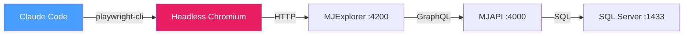

# Docker Configurations — Context for Claude

This directory contains Docker configurations for MemberJunction. When working with Docker in this repo, use this context.

## Directory Layout

### docker/MJAPI/
**Purpose**: Production MJAPI container, published with each MJ release.

- Runs Flyway migrations, CodeGen, then starts MJAPI via PM2
- Build from repo root: `docker build -f docker/MJAPI/Dockerfile -t memberjunction/api .`
- Configured via environment variables (see `docker.config.cjs`)
- SSH debugging on port 2222 (password: `Docker!`)

### docker/workbench/
**Purpose**: Claude Code workbench with dedicated SQL Server, headless browser, and Auth0 integration for autonomous development and testing.

- `docker-compose.yml` spins up two containers: `sql-claude` (SQL Server 2022) and `claude-dev` (Node 24 + Claude Code + MJ CLI + Playwright CLI + Chromium)
- SQL Server SA credentials: `sa` / `Claude2Sql99` (docker-internal only, not a real password)
- SQL Server accessible from host at `localhost:1444`
- Claude Code, MJ CLI, and Playwright CLI auto-update on every container start via `entrypoint.sh`
- MJ repo is auto-cloned to `/workspace/MJ` on first start (from `next` branch)
- Pre-configured permissions in `claude-settings.json` allow npm, git, sqlcmd, mj, playwright-cli, and other common commands
- Oh-My-Zsh with aliases: `cc` = `claude --dangerously-skip-permissions`
- Chromium gets 2GB shared memory (`shm_size: '2gb'`) to prevent tab crashes

**Starting the workbench:**
```bash
cd docker/workbench
./start.sh
docker exec -it claude-dev zsh
```

**Running Claude inside the workbench:**
```bash
cc                          # Interactive Claude with skip-permissions
ccp "run the migrations"    # One-shot prompt
ccr                         # Resume last conversation
```

**SQL from inside the container:**
```bash
sql                         # Interactive sqlcmd as SA
sqlq "SELECT name FROM sys.databases"  # Inline query
sqldbs                      # List all databases
```

## Auth0 Configuration

The workbench uses Auth0 for authentication. On first boot (or when Auth0 credentials are missing from `.env`), the `auth-setup` script runs interactively to collect:

- `AUTH0_DOMAIN` / `TEST_AUTH0_DOMAIN` — Your Auth0 tenant domain
- `AUTH0_CLIENT_ID` / `TEST_AUTH0_CLIENT_ID` — SPA application client ID
- `AUTH0_CLIENT_SECRET` / `TEST_AUTH0_CLIENT_SECRET` — Application secret
- `TEST_UID` — Test user email for browser automation login
- `TEST_PWD` — Test user password for browser automation login

**How credentials flow:**
1. User provides values via `auth-setup` interactive prompts
2. Values are saved to `/workspace/MJ/.env` (both `AUTH0_*` and `TEST_*` prefixed)
3. `.env` is symlinked to `packages/MJAPI/.env` so MJAPI reads the same file
4. Angular environment files (`environment.ts`, `environment.development.ts`) are generated with `AUTH0_DOMAIN` and `AUTH0_CLIENTID`
5. All changes persist across container restarts (files are on the host-mounted `/workspace` volume)

**To reconfigure:** Run `auth-setup` at any time.

**Browser automation login:** Claude Code can read `TEST_UID` and `TEST_PWD` from `.env` to automate Auth0 login in the headless browser.

## Headless Browser Automation

The workbench includes Microsoft's Playwright CLI (`@playwright/cli`) and headless Chromium for full-stack browser automation.

### How It Works



### Workflow for UI Testing

```bash
# 1. Start the MJ stack
mjapi &                                     # Start MJAPI in background
mjui &                                      # Start Explorer in background
# Wait for both to be ready...

# 2. Open headless browser
playwright-cli open http://localhost:4200

# 3. Interact with the page
playwright-cli snapshot                     # Get element refs
playwright-cli click e15                    # Click elements
playwright-cli fill e7 "test@example.com"   # Fill forms
playwright-cli screenshot                   # Capture visual state
playwright-cli console error                # Check for JS errors

# 4. Make code changes, rebuild
# Angular library changes: Vite auto-reloads the browser
# Server-side changes: restart MJAPI

# 5. Re-test
playwright-cli reload
playwright-cli snapshot

# 6. Clean up
playwright-cli close
```

### Shell Aliases

| Alias | Command | Purpose |
|-------|---------|---------|
| `pwc` | `playwright-cli` | Short alias |
| `pwopen` | `playwright-cli open http://localhost:4200` | Open Explorer headless |
| `pwsnap` | `playwright-cli snapshot` | Accessibility snapshot |
| `pwclose` | `playwright-cli close` | Close browser |
| `pwscreen` | `playwright-cli screenshot` | Take screenshot |
| `pwconsole` | `playwright-cli console` | JS console output |
| `pwlist` | `playwright-cli list` | List active sessions |

### Key Differences from Desktop

| Aspect | Desktop | Docker Workbench |
|--------|---------|-----------------|
| Display | `--headed` (visible window) | Headless (no display, snapshot-driven) |
| Ports | MJAPI :4001, Explorer :4201 | MJAPI :4000, Explorer :4200 |
| Auth profile | `.playwright-cli/profile` | Fresh session per run (or `--persistent`) |
| Screenshots | Viewable in OS | Saved to filesystem, read with Read tool |

## MJ Repository and Branch Workflow

The workbench entrypoint automatically clones the MJ repo to `/workspace/MJ` from the `next` branch on first startup. On subsequent starts, it fetches the latest from `origin/next`.

### CRITICAL: Branch Rules for All Work

**NEVER work directly on the `next` branch.** Always follow this workflow:

1. **Before starting any new task**, ensure you're up to date with `next`:
   ```bash
   cd /workspace/MJ
   git checkout next
   git pull origin next
   ```

2. **Create a new feature branch** for every task:
   ```bash
   git checkout -b claude/<descriptive-name>
   ```

3. **Push the branch to remote and track it** (same-named remote branch):
   ```bash
   git push -u origin claude/<descriptive-name>
   ```

4. **Verify tracking** before every push:
   ```bash
   git branch -vv
   # Should show: * claude/<name> [origin/claude/<name>]
   # NEVER: * claude/<name> [origin/next]  ← DANGEROUS
   ```

5. **When done**, create a PR targeting `next`:
   ```bash
   gh pr create --base next --title "..." --body "..."
   ```

### Why This Matters
- Pushing directly to `next` bypasses PR review and can break the main branch
- Feature branches isolate work and enable clean PRs
- Same-name tracking prevents accidental pushes to the wrong remote branch
- The `claude/` prefix makes it clear which branches were created in the workbench

### Starting a New Project After Previous Work
```bash
cd /workspace/MJ
git checkout next
git pull origin next
git checkout -b claude/<new-task-name>
git push -u origin claude/<new-task-name>
```

### GitHub Authentication
Run `gh auth login` once inside the container. The credential is persisted in the `gh-config` Docker volume across restarts.

## File Persistence

The `/workspace` directory is a bind mount from the host (`docker/workbench/workspace/`). **All changes inside `/workspace/MJ/` persist across container restarts**, including:

- `.env` files (Auth0 credentials, DB config)
- Angular environment files
- Code changes and git history
- npm `node_modules/`

Named Docker volumes also persist:
- `claude-settings` — Claude Code config (`/root/.claude/`)
- `gh-config` — GitHub CLI auth tokens (`/root/.config/gh/`)
- `sql-claude-data` — SQL Server database files

**To start completely fresh:** `docker compose down -v` removes all volumes.

## When to Use Each

| Scenario | Use |
|----------|-----|
| Deploy MJAPI for users | `docker/MJAPI/` |
| Give Claude a SQL Server sandbox | `docker/workbench/` |
| Automated testing with Claude | `docker/workbench/` |
| CI/CD pipeline with Claude | `docker/workbench/` |
| Database experimentation | `docker/workbench/` |
| Headless browser automation | `docker/workbench/` |
| End-to-end UI testing | `docker/workbench/` |
| Auth0 login flow testing | `docker/workbench/` |

## Managing the Workbench via Slash Command

Use `/docker-workbench` to start, stop, and interact with the workbench from any Claude Code session. See `.claude/commands/docker-workbench.md` for details.
