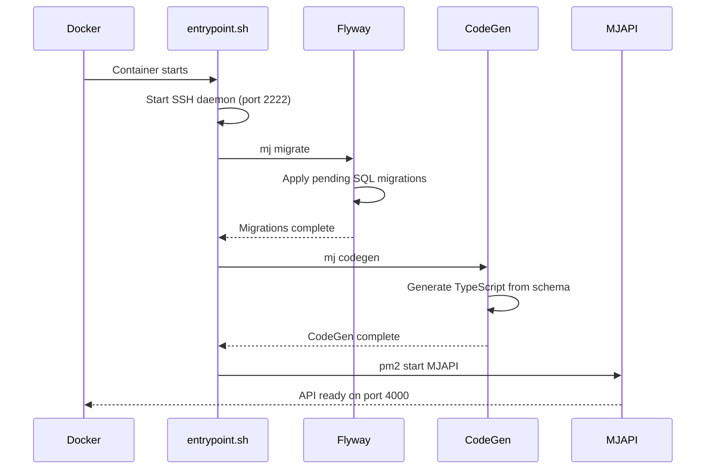
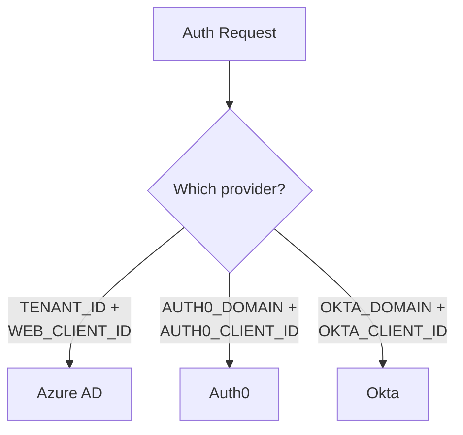

# MJAPI Docker Container

Production-ready Docker container for running the MemberJunction GraphQL API server. Ships with each MJ release so users can quickly spin up an MJAPI instance.

## How It Works

When the container starts, it runs an automated sequence that gets your API server fully operational:



1. **SSH daemon** starts on port 2222 (for remote debugging)
2. **Flyway migrations** apply any pending database changes
3. **CodeGen** regenerates TypeScript classes from the latest schema
4. **PM2** launches MJAPI on port 4000 with process management

## Building

> The build context **must** be the repository root, not this directory. The Dockerfile copies files from multiple locations in the monorepo.

```bash
# From the repo root
docker build -f docker/MJAPI/Dockerfile -t memberjunction/api .
```

## Running

### Minimal Example

```bash
docker run -p 4000:4000 \
  -e DB_HOST=your-sql-server \
  -e DB_DATABASE=your-database \
  -e DB_USERNAME=sa \
  -e DB_PASSWORD=your-password \
  memberjunction/api
```

### With an Environment File

```bash
# Create .env with all your settings
docker run -p 4000:4000 --env-file .env memberjunction/api
```

### With Docker Compose

```yaml
services:
  mjapi:
    build:
      context: ../..          # repo root
      dockerfile: docker/MJAPI/Dockerfile
    ports:
      - "4000:4000"
    env_file:
      - .env
```

## Configuration

All configuration is via environment variables, read by `docker.config.cjs`.

### Database (Required)

| Variable | Description | Default |
|----------|-------------|---------|
| `DB_HOST` | SQL Server hostname | -- |
| `DB_PORT` | SQL Server port | `1433` |
| `DB_DATABASE` | Database name | -- |
| `DB_USERNAME` | Database username | -- |
| `DB_PASSWORD` | Database password | -- |

### CodeGen

| Variable | Description | Default |
|----------|-------------|---------|
| `CODEGEN_DB_USERNAME` | Separate user for CodeGen (needs DDL rights) | falls back to `DB_USERNAME` |
| `CODEGEN_DB_PASSWORD` | Password for CodeGen user | falls back to `DB_PASSWORD` |

### Authentication

You need at least one auth provider configured. The container auto-detects which providers are available based on which environment variables are set.



| Variable | Description |
|----------|-------------|
| `TENANT_ID` | Azure AD Tenant ID |
| `WEB_CLIENT_ID` | Azure AD Client ID |
| `AUTH0_DOMAIN` | Auth0 domain |
| `AUTH0_CLIENT_ID` | Auth0 Client ID |
| `AUTH0_CLIENT_SECRET` | Auth0 Client Secret |
| `OKTA_DOMAIN` | Okta domain |
| `OKTA_CLIENT_ID` | Okta Client ID |

### Server

| Variable | Description | Default |
|----------|-------------|---------|
| `PORT` / `GRAPHQL_PORT` | GraphQL server port | `4000` |
| `GRAPHQL_ROOT_PATH` | GraphQL endpoint path | `/` |
| `AUTO_CREATE_NEW_USERS` | Auto-create users on first login | `false` |

## SSH Access (Debugging)

The container runs an SSH server for remote debugging:

```bash
ssh root@<container-ip> -p 2222
# Password: Docker!
```

## What's Included

| Component | Version | Purpose |
|-----------|---------|---------|
| Eclipse Temurin JRE | 17 | Java runtime for Flyway |
| Node.js | 24.x | MJAPI runtime |
| Flyway | 11.20.0 | Database migrations |
| SQL Server tools | sqlcmd + ODBC | Database connectivity |
| PM2 | latest | Process management |
| @memberjunction/cli | latest | `mj migrate` and `mj codegen` |

## Files

| File | Purpose |
|------|---------|
| `Dockerfile` | Multi-stage build definition |
| `entrypoint.sh` | Container startup script (migrate, codegen, start) |
| `docker.config.cjs` | MJ configuration (reads env vars) |
| `sshd_config` | SSH server configuration |
