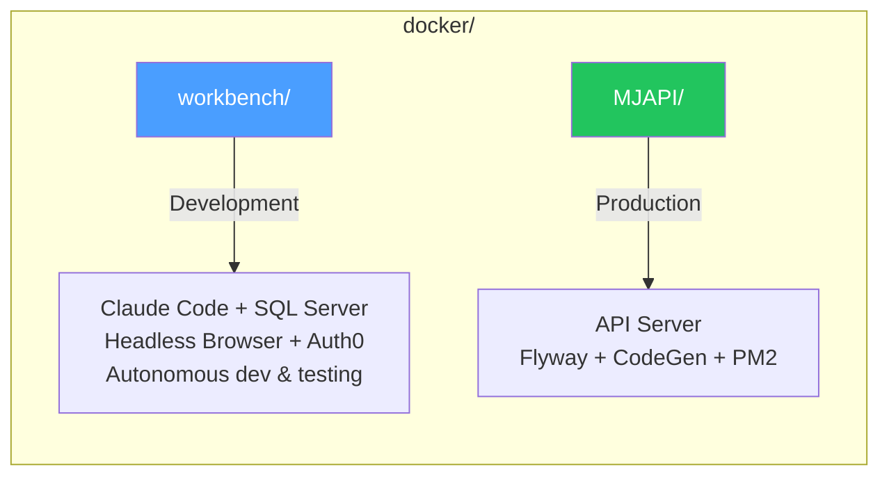

# Docker Environments

MemberJunction ships two Docker configurations for different use cases.



## Which one do I need?

| I want to... | Use |
|---|---|
| Let Claude Code build, test, and iterate on MJ code autonomously | [workbench/](workbench/) |
| Deploy the MJAPI server as a container (CI/CD, staging, production) | [MJAPI/](MJAPI/) |
| Develop MJ features with a sandboxed SQL Server | [workbench/](workbench/) |
| Run the full MJ stack (API + Explorer) inside Docker | [workbench/](workbench/) |
| Do headless browser automation with Playwright CLI | [workbench/](workbench/) |
| Test Auth0 login flows end-to-end | [workbench/](workbench/) |

---

## Workbench (Development)

A two-container Compose stack: **Claude Code** + **SQL Server 2022**. Includes the MJ repo, all build tools, headless Chromium browser, Playwright CLI, and shell aliases for fast iteration.

### Quick Start

```bash
cd docker/workbench
cp .env.example .env      # optionally set ANTHROPIC_API_KEY
./start.sh                # builds images, starts containers
```

Then enter the container and start working:

```bash
docker exec -it claude-dev zsh
# Auth0 setup runs automatically on first boot
cc                        # launch Claude Code (autonomous mode)
```

### What's Inside

| Component | Purpose |
|-----------|---------|
| Node.js 24 | JavaScript/TypeScript runtime |
| Claude Code | AI coding assistant (auto-updated) |
| @memberjunction/cli | MJ CLI for migrations, codegen, etc. (auto-updated) |
| Playwright CLI + Chromium | Headless browser automation for AI agents (auto-updated) |
| Flyway 10.20.1 | Database migration engine (standalone + bundled JRE) |
| Turbo | Monorepo build orchestration |
| Angular CLI | Angular development tools |
| GitHub CLI (`gh`) | GitHub operations from the command line |
| Oh-My-Zsh | Enhanced shell with plugins and aliases |
| Xvfb | Virtual framebuffer for browser edge cases |
| SQL Server tools | `sqlcmd` and ODBC driver |

### Auth0 Setup

On first boot, the workbench prompts for Auth0 test credentials:

```
  Auth0 Domain (e.g. myapp.us.auth0.com): ____
  Auth0 Client ID: ____
  Auth0 Client Secret: ____
  Test User Email: ____
  Test User Password: ____
```

These are saved to the repo `.env` file and used to generate Angular environment files. MJAPI reads Auth0 config from `.env`, and MJExplorer reads it from `environment.development.ts`.

Run `auth-setup` manually at any time to reconfigure.

### Browser Automation

Claude Code can do full-stack headless browser automation inside the container:

```bash
# Start the MJ stack
mjapi &                                     # MJAPI on :4000
mjui &                                      # Explorer on :4200

# Automate with Playwright CLI
playwright-cli open http://localhost:4200    # headless Chromium
playwright-cli snapshot                     # get element refs
playwright-cli click e15                    # interact
playwright-cli screenshot                   # capture state
playwright-cli console error                # check for JS errors
playwright-cli close                        # done
```

### Port Mapping

| Service | Inside Container | Your Machine | What to use it for |
|---------|-----------------|-------------|-------------------|
| SQL Server | 1433 | **localhost:1444** | Azure Data Studio, DBeaver |
| MJAPI | 4000 | **localhost:4100** | API testing, GraphQL Playground |
| MJ Explorer | 4200 | **localhost:4300** | Browser UI |

See [workbench/README.md](workbench/) for the full step-by-step guide.

---

## MJAPI (Production)

A single container that runs the MemberJunction GraphQL API with automatic database migrations and code generation.

```bash
# Build from the repo root (not from docker/MJAPI)
docker build -f docker/MJAPI/Dockerfile -t memberjunction/api .

# Run with your environment file
docker run -p 4000:4000 --env-file .env memberjunction/api
```

See [MJAPI/README.md](MJAPI/) for configuration reference and deployment details.

---

## Prerequisites

Both configurations require **Docker** installed on your machine. If you've never used Docker before, see the [workbench README](workbench/) which includes a complete "from zero" setup guide.

| Tool | Minimum Version | Check with |
|------|----------------|------------|
| Docker Desktop (macOS/Windows) | 4.0+ | `docker --version` |
| Docker Engine (Linux) | 20.10+ | `docker --version` |
| Docker Compose | v2 (built into Desktop) | `docker compose version` |

### Memory Requirements

The workbench requires at least **8 GB** allocated to Docker (16 GB recommended):

| Container | Memory Limit | Purpose |
|-----------|-------------|---------|
| `sql-claude` | 2.5 GB | SQL Server 2022 |
| `claude-dev` | 4 GB | Node.js + Claude Code + Chromium + MJAPI + Explorer |
| `/dev/shm` | 2 GB | Chromium shared memory (prevents tab crashes) |
