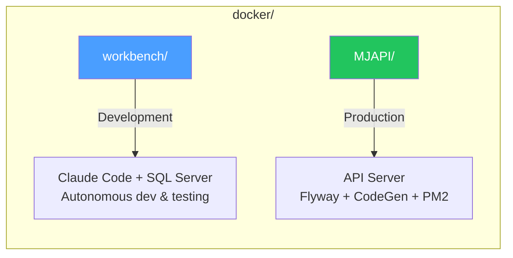

# Docker Environments

MemberJunction ships two Docker configurations for different use cases.



## Which one do I need?

| I want to... | Use |
|---|---|
| Let Claude Code build, test, and iterate on MJ code autonomously | [workbench/](workbench/) |
| Deploy the MJAPI server as a container (CI/CD, staging, production) | [MJAPI/](MJAPI/) |
| Develop MJ features with a sandboxed SQL Server | [workbench/](workbench/) |
| Run the full MJ stack (API + Explorer) inside Docker | [workbench/](workbench/) |

---

## Workbench (Development)

A two-container Compose stack: **Claude Code** + **SQL Server 2022**. Includes the MJ repo, all build tools, and shell aliases for fast iteration.

```bash
cd docker/workbench
cp .env.example .env      # optionally set ANTHROPIC_API_KEY
./start.sh                # builds images, starts containers
```

Then enter the container and start working:

```bash
docker exec -it claude-dev zsh
cc                        # launch Claude Code (autonomous mode)
```

See [workbench/README.md](workbench/) for the full step-by-step guide.

---

## MJAPI (Production)

A single container that runs the MemberJunction GraphQL API with automatic database migrations and code generation.

```bash
# Build from the repo root (not from docker/MJAPI)
docker build -f docker/MJAPI/Dockerfile -t memberjunction/api .

# Run with your environment file
docker run -p 4000:4000 --env-file .env memberjunction/api
```

See [MJAPI/README.md](MJAPI/) for configuration reference and deployment details.

---

## Prerequisites

Both configurations require **Docker** installed on your machine. If you've never used Docker before, see the [workbench README](workbench/) which includes a complete "from zero" setup guide.

| Tool | Minimum Version | Check with |
|------|----------------|------------|
| Docker Desktop (macOS/Windows) | 4.0+ | `docker --version` |
| Docker Engine (Linux) | 20.10+ | `docker --version` |
| Docker Compose | v2 (built into Desktop) | `docker compose version` |
