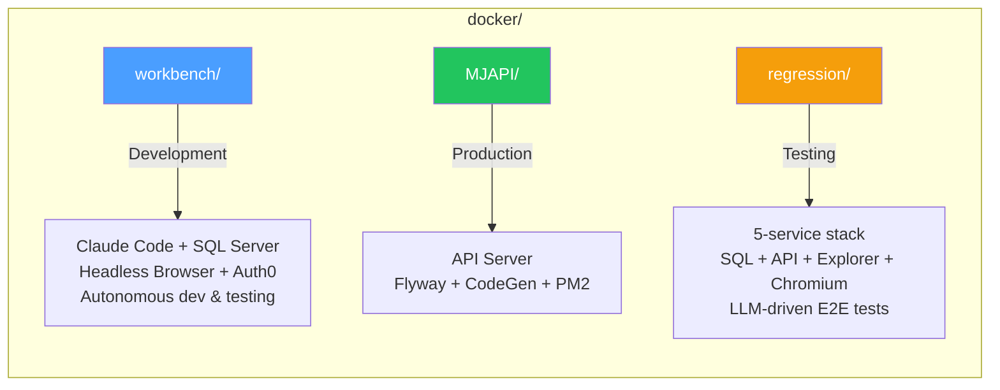

# Docker Environments

MemberJunction ships three Docker configurations for different use cases.


```mermaid
graph LR
    subgraph "docker/"
        A["workbench/"] -->|Development| B["Claude Code + SQL Server<br/>Headless Browser + Auth0<br/>Autonomous dev & testing"]
        C["MJAPI/"] -->|Production| D["API Server<br/>Flyway + CodeGen + PM2"]
        E["regression/"] -->|Testing| F["5-service stack<br/>SQL + API + Explorer + Chromium<br/>LLM-driven E2E tests"]
    end

    style A fill:#4a9eff,color:#fff
    style C fill:#22c55e,color:#fff
    style E fill:#f59e0b,color:#fff
```

## Which one do I need?

| I want to... | Use |
|---|---|
| Let Claude Code build, test, and iterate on MJ code autonomously | [workbench/](workbench/) |
| Deploy the MJAPI server as a container (CI/CD, staging, production) | [MJAPI/](MJAPI/) |
| Develop MJ features with a sandboxed SQL Server | [workbench/](workbench/) |
| Run automated E2E regression tests against MJ Explorer | [regression/](#regression-tests-e2e) |
| Run the full MJ stack (API + Explorer) inside Docker | [workbench/](workbench/) |
| Do headless browser automation with Playwright CLI | [workbench/](workbench/) |
| Test Auth0 login flows end-to-end | [workbench/](workbench/) |

---

## Regression Tests (E2E)

Automated end-to-end regression testing of MJ Explorer using LLM-driven browser automation (Computer Use engine) running headless Chromium in Docker.

### Architecture

```
┌──────────────────────────────────────────────────────────────────────────┐
│                     Docker Compose (mj-regression)                       │
│                                                                          │
│  ┌──────────┐  ┌──────────┐  ┌──────────┐  ┌──────────┐  ┌──────────┐    │
│  │ SQL      │  │ DB Setup │  │ MJAPI    │  │ MJ       │  │ Test     │    │
│  │ Server   │◄─│ (init)   │  │ Server   │◄─│ Explorer │◄─│ Runner   │    │
│  │          │  │          │  │          │  │ (nginx)  │  │ (Chrome) │    │
│  │ :1433    │  │ one-shot │  │ :4000    │  │ :4200    │  │          │    │
│  └──────────┘  └──────────┘  └──────────┘  └──────────┘  └──────────┘    │
│    host:11433                   host:14000    host:4200                  │
└──────────────────────────────────────────────────────────────────────────┘
```

**Request flow** from the headless browser:

1. **Static assets**: Browser → `socat` (localhost:4200 → mjexplorer:4200) → nginx → static files
2. **Auth0 login**: Browser → Auth0 (external) → redirects back to `http://localhost:4200/?code=...&state=...`
3. **GraphQL API**: Browser → socat → nginx `/api/` → `proxy_pass http://mjapi:4000/` → Apollo Server
4. **WebSocket subscriptions**: Same path as GraphQL, nginx upgrades when `Upgrade: websocket` header is present

The `socat` proxy is required because Auth0's SDK only works on secure origins, and browsers treat `localhost` as secure but not arbitrary Docker hostnames like `mjexplorer`.

**Startup sequence:**

1. **SQL Server** starts, waits for healthcheck
2. **DB Setup** (one-shot) creates the database, runs `mj migrate`, installs [AssociationDB](../Demos/AssociationDB/) demo data (58 tables, 10K+ records), runs `mj codegen`, then exits
3. **MJAPI** starts after db-setup completes (`service_completed_successfully`). Runs the GraphQL server only.
4. **MJ Explorer** starts after MJAPI is healthy (nginx serves Angular app)
5. **Test Runner** starts after MJAPI is healthy and MJExplorer is started. Syncs test metadata, verifies the stack, runs the regression suite, extracts screenshots, generates a report.

### Quick Start

```bash
# 1. Create environment file with Auth0 + Anthropic credentials
cp docker/regression/.env.test.example docker/regression/.env.test
# Edit docker/regression/.env.test with real values

# 2. Build all images
npm run regression:build

# 3. Run the full stack
npm run regression:up

# 4. Check results
cat docker/regression/test-results/report.md
ls docker/regression/test-results/screenshots/

# 5. Tear down
npm run regression:down
```

### Rebuilding Individual Services

```bash
# Rebuild only the explorer (e.g., after changing environment config)
npm run regression:build -- mjexplorer

# Rebuild only the test runner (e.g., after changing ComputerUse packages)
npm run regression:build -- test-runner

# The entrypoint script is bind-mounted — changes take effect without rebuilding
```

### Environment Variables

All variables go in `docker/regression/.env.test` (gitignored). See `.env.test.example` for the template.

| Variable | Required | Purpose |
|----------|----------|---------|
| `TEST_SA_PASSWORD` | Yes | SQL Server SA password (min 8 chars, requires complexity) |
| `MJ_BASE_ENCRYPTION_KEY` | Yes | Base64 encryption key (`openssl rand -base64 32`) |
| `AUTH0_DOMAIN` | Yes | Auth0 tenant domain (e.g., `dev-xxxxx.us.auth0.com`) |
| `AUTH0_CLIENTID` | Yes | Auth0 SPA application client ID |
| `AUTH0_CLIENT_SECRET` | Yes | Auth0 application client secret |
| `TEST_UID` | Yes | Test user email (must exist in Auth0, email verified, no MFA) |
| `TEST_PWD` | Yes | Test user password in Auth0 |
| `ANTHROPIC_API_KEY` | Yes | Anthropic API key (for Computer Use controller/judge LLM) |
| `GOOGLE_API_KEY` | No | Google API key (if using Gemini models) |

**Auth0 setup requirements** -- the SPA application must have:
- **Allowed Callback URLs**: `http://localhost:4200`
- **Allowed Logout URLs**: `http://localhost:4200`
- **Allowed Web Origins**: `http://localhost:4200`
- **Token Endpoint Authentication Method**: None (SPA)
- **Grant Types**: Authorization Code (with PKCE)
- The test user must exist in Auth0 with email verified and MFA disabled

### How Tests Work

Each test uses the **ComputerUseTestDriver** which:

1. Launches headless Chromium via Playwright
2. Navigates to MJExplorer at `http://localhost:4200`
3. Takes a screenshot and sends it to an LLM (controller) which decides what to click/type
4. The LLM-driven agent performs the test workflow (login, navigate, verify UI)
5. A judge LLM periodically evaluates whether the goal was achieved
6. Oracles score the result (goal-completion, url-match, step-count)
7. Results and screenshots are persisted to the MJ database
8. The entrypoint extracts screenshots to `test-results/screenshots/` and generates `report.md`

**Oracles** -- each test configures weighted oracles:

| Oracle | Purpose | Typical Weight |
|--------|---------|---------------|
| `goal-completion` | Did the judge LLM confirm the goal was achieved? | 0.5-0.7 |
| `url-match` | Does the final URL match the expected pattern? | 0.2-0.3 |
| `step-count` | Did the test complete within the step budget? | 0.2-0.4 |

The weighted scores combine into a final test score (0.0 to 1.0). A test passes when goal-completion passes.

### Adding New Tests

1. Create a new `.json` file in `metadata/tests/regression/` following the T01 pattern
2. Add a `relatedEntities` entry in `metadata/test-suites/.regression-suite.json` linking the test
3. The test runner automatically syncs metadata on each run -- no rebuild needed
4. Metadata files are bind-mounted from the host, so edits are picked up immediately

Test definitions have three sections:
- **InputDefinition**: Goal description, start URL, auth credentials, allowed domains
- **Configuration**: LLM prompts, oracles, step limits, viewport size, judge frequency
- **ExpectedOutcomes**: URL patterns, confidence thresholds, validation criteria

### Test Inventory (25 Tests)

**P0 -- Critical Path** (release-blocking)

| Test | Description |
|------|-------------|
| T01 - Login Smoke | Auth0 login + verify dashboard loads with navigation elements |
| T02 - Home Application Load | Verify header, MJ logo, app switcher, and navigation items |
| T03 - Application Switcher | Switch between Home, Data Explorer, and AI applications |
| T04 - Data Explorer Browse Entities | Navigate to Members entity, verify records grid |
| T05 - Data Explorer Open Entity Record | Open a member record detail form |
| T06 - Data Explorer Search | Search for "Event", verify results appear |
| T07 - Entity Form View Record Details | Open an Event record, verify form fields |
| T08 - Navigation and Tab Management | Open multiple tabs, switch, close one |

**P1 -- Core Functionality**

| Test | Description |
|------|-------------|
| T09 - Entity Form Create New Record | Create a new Member record and save |
| T10 - Entity Form Edit and Save Record | Edit an existing Member record and save |
| T11 - Run a Saved Query | Execute a saved query and verify results |
| T12 - Admin Dashboard ERD Viewer | Open the ERD viewer, verify entity diagram |
| T13 - Admin Dashboard User Management | View user management list |
| T14 - AI Application Agent List View | View configured AI agents |
| T15 - AI Application Prompt Management | View prompts and open a prompt detail form |

**P2 -- Extended Functionality**

| Test | Description |
|------|-------------|
| T16 - Lists Create and Populate | Create a list and add a record |
| T17 - Settings Page Navigation | Open settings, verify categories |
| T18 - Communication Templates View | View communication templates |
| T19 - Query Browser Execute Query | Find and execute a query |
| T20 - Dashboard Browser | Open a dashboard, verify rendering |
| T21 - AI Monitor Dashboard | View AI monitoring dashboard |
| T22 - Integrations Overview | View integrations overview |

**P3 -- Resilience & Edge Cases**

| Test | Description |
|------|-------------|
| T23 - Handle Invalid Navigation Gracefully | Navigate to invalid URL, verify no crash |
| T24 - Session Persistence Reload Page | Reload page, verify session maintained |
| T25 - Multiple Tab Workflow | Open 3 entity tabs, close middle, verify others |

### Output

Each run produces three artifacts in `docker/regression/test-results/`:

- **results.json** -- Full suite results with oracle scores per test
- **report.md** -- Human-readable markdown summary with pass/fail table
- **screenshots/** -- Per-test step-by-step PNG screenshots organized by test name

### Cost

| Component | Cost per Step | Steps per Test | Cost per Test |
|-----------|--------------|----------------|---------------|
| Controller LLM (Sonnet) | ~$0.02 | 15 avg | $0.30 |
| Judge LLM (Sonnet, every 3 steps) | ~$0.02 | 5 avg | $0.10 |
| **Total per test** | | | **~$0.40** |

Full 25-test suite: approximately **$10-12** per run.

### Container Details

**Dockerfile.db-setup** -- One-shot init container that creates the database, runs `mj migrate` (Flyway migrations, 290+ entities), installs AssociationDB via Node.js mssql driver (2,000 members, 21 events, 60 courses, 50 forum threads, 100 resources, 413 certifications, 110 products), and runs `mj codegen`. MJAPI depends on it via `service_completed_successfully`.

**Dockerfile.explorer** -- Two-stage build: Angular AOT build + nginx:alpine. The nginx config uses a `map` block to conditionally set `Connection: upgrade` only for WebSocket requests (critical -- unconditionally setting it causes GraphQL POST requests to hang). `GRAPHQL_URI` must be an absolute URL (`http://localhost:4200/api/`) because `graphql-request` v7+ validates with `new URL()`.

**Dockerfile.api** -- Two-stage build. Patches `mj.config.cjs` to force `autoCreateNewUsers: true`. Only runs the GraphQL server -- all setup is handled by db-setup.

**Dockerfile.test-runner** -- Based on `mcr.microsoft.com/playwright:v1.58.1-noble` (includes Chromium). Installs `socat`, builds the full monorepo with `--concurrency=2` (avoids OOM), creates a bootstrap ESM file to register `ComputerUseTestDriver` via `@RegisterClass`.

**test-runner-entrypoint.sh** -- Orchestrates: socat proxy → metadata sync → MJAPI/nginx verification → suite execution (with `--delay 15000` between tests for Auth0 rate limits) → screenshot extraction → markdown report. Uses `set +e` around suite execution so failures don't prevent screenshot/report generation.

### Port Mapping

| Service | Container Port | Host Port | Purpose |
|---------|---------------|-----------|---------|
| SQL Server | 1433 | **11433** | Avoids conflict with local SQL Server |
| MJAPI | 4000 | **14000** | Avoids conflict with local MJAPI |
| MJExplorer | 4200 | **4200** | Standard (test runner uses localhost:4200) |

### Regression Troubleshooting

**"Loading workspace..." hangs after login**
1. Check MJAPI healthcheck: `curl http://localhost:14000/healthcheck`
2. Check nginx proxy: `curl -X POST http://localhost:4200/api/ -H 'Content-Type: application/json' -d '{"query":"{ __schema { queryType { name } } }"}'` (should return 401)
3. Verify `GRAPHQL_URI` is absolute (`http://localhost:4200/api/`, not `/api/`)
4. Check nginx config: `docker exec <explorer> cat /etc/nginx/conf.d/default.conf`

**Docker OOM during build** -- Build one service at a time: `npm run regression:build -- mjapi`, or increase Docker Desktop memory to 12+ GB.

**"Port already in use"** -- The stack uses non-standard host ports (11433, 14000). Edit `ports:` in `docker/regression/docker-compose.test.yml` if needed.

**Migrations fail** -- Ensure `DB_TRUST_SERVER_CERTIFICATE=true` is set (already in compose `x-db-env`).

**Test suite not found** -- Check that `metadata/` volume mount is working and test file names start with `.` (mj-sync convention).

**ComputerUseTestDriver not found** -- The bootstrap import isn't loading. Check `NODE_OPTIONS` in the entrypoint and that `@memberjunction/computer-use-engine` built successfully.

**Screenshots not saved** -- Check `test-results` volume mount, that `results.json` was written, and database connectivity.

**Auth0 login fails** -- Verify Auth0 app has `http://localhost:4200` in Allowed Callback URLs, test user has email verified and MFA disabled, and `TEST_UID`/`TEST_PWD` match.

---

## Workbench (Development)

A two-container Compose stack: **Claude Code** + **SQL Server 2022**. Includes the MJ repo, all build tools, headless Chromium browser, Playwright CLI, and shell aliases for fast iteration.

### Quick Start

```bash
cd docker/workbench
cp .env.example .env      # optionally set ANTHROPIC_API_KEY
./start.sh                # builds images, starts containers
```

Then enter the container and start working:

```bash
docker exec -it claude-dev zsh
# Auth0 setup runs automatically on first boot
cc                        # launch Claude Code (autonomous mode)
```

### What's Inside

| Component | Purpose |
|-----------|---------|
| Node.js 24 | JavaScript/TypeScript runtime |
| Claude Code | AI coding assistant (auto-updated) |
| @memberjunction/cli | MJ CLI for migrations, codegen, etc. (auto-updated) |
| Playwright CLI + Chromium | Headless browser automation for AI agents (auto-updated) |
| Flyway 10.20.1 | Database migration engine (standalone + bundled JRE) |
| Turbo | Monorepo build orchestration |
| Angular CLI | Angular development tools |
| GitHub CLI (`gh`) | GitHub operations from the command line |
| Oh-My-Zsh | Enhanced shell with plugins and aliases |
| Xvfb | Virtual framebuffer for browser edge cases |
| SQL Server tools | `sqlcmd` and ODBC driver |

### Auth0 Setup

On first boot, the workbench prompts for Auth0 test credentials:

```
  Auth0 Domain (e.g. myapp.us.auth0.com): ____
  Auth0 Client ID: ____
  Auth0 Client Secret: ____
  Test User Email: ____
  Test User Password: ____
```

These are saved to the repo `.env` file and used to generate Angular environment files. MJAPI reads Auth0 config from `.env`, and MJExplorer reads it from `environment.development.ts`.

Run `auth-setup` manually at any time to reconfigure.

### Browser Automation

Claude Code can do full-stack headless browser automation inside the container:

```bash
# Start the MJ stack
mjapi &                                     # MJAPI on :4000
mjui &                                      # Explorer on :4200

# Automate with Playwright CLI
playwright-cli open http://localhost:4200    # headless Chromium
playwright-cli snapshot                     # get element refs
playwright-cli click e15                    # interact
playwright-cli screenshot                   # capture state
playwright-cli console error                # check for JS errors
playwright-cli close                        # done
```

### Port Mapping

| Service | Inside Container | Your Machine | What to use it for |
|---------|-----------------|-------------|-------------------|
| SQL Server | 1433 | **localhost:1444** | Azure Data Studio, DBeaver |
| MJAPI | 4000 | **localhost:4100** | API testing, GraphQL Playground |
| MJ Explorer | 4200 | **localhost:4300** | Browser UI |

See [workbench/README.md](workbench/) for the full step-by-step guide.

---

## MJAPI (Production)

A single container that runs the MemberJunction GraphQL API with automatic database migrations and code generation.

```bash
# Build from the repo root (not from docker/MJAPI)
docker build -f docker/MJAPI/Dockerfile -t memberjunction/api .

# Run with your environment file
docker run -p 4000:4000 --env-file .env memberjunction/api
```

See [MJAPI/README.md](MJAPI/) for configuration reference and deployment details.

---

## File Inventory

```
docker/
├── MJAPI/                        # Production MJAPI container
│   ├── Dockerfile
│   └── docker.config.cjs
├── workbench/                    # Development workbench (Claude Code + SQL Server)
│   ├── docker-compose.yml
│   ├── Dockerfile
│   ├── entrypoint.sh
│   └── start.sh
└── regression/                   # E2E regression test stack
    ├── docker-compose.test.yml   # Orchestration (5 services)
    ├── Dockerfile.db-setup       # DB init: migrations + AssociationDB + CodeGen
    ├── db-setup-entrypoint.sh    # DB init entrypoint script
    ├── Dockerfile.api            # MJAPI for test environment
    ├── Dockerfile.explorer       # MJExplorer: Angular + nginx reverse proxy
    ├── Dockerfile.test-runner    # Test runner: Playwright + MJ Testing Framework
    ├── test-runner-entrypoint.sh # Test execution, screenshots, report generation
    ├── .env.test.example         # Environment variable template
    └── test-results/             # Output directory (gitignored)

metadata/
├── tests/regression/             # 25 test definition JSON files (.T01 through .T25)
└── test-suites/
    └── .regression-suite.json    # Suite linking all 25 tests in sequence
```

## Prerequisites

All configurations require **Docker** installed on your machine.

| Tool | Minimum Version | Check with |
|------|----------------|------------|
| Docker Desktop (macOS/Windows) | 4.0+ | `docker --version` |
| Docker Engine (Linux) | 20.10+ | `docker --version` |
| Docker Compose | v2 (built into Desktop) | `docker compose version` |

### Memory Requirements

| Configuration | Minimum | Recommended |
|---------------|---------|-------------|
| Workbench | 8 GB | 16 GB |
| Regression Tests | 8 GB | 12 GB |
| MJAPI (production) | 2 GB | 4 GB |
