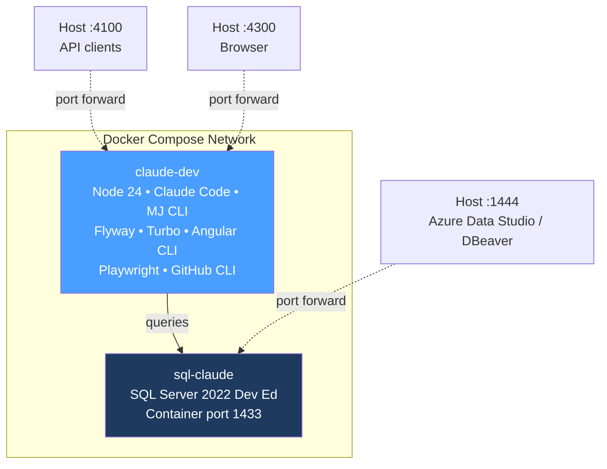
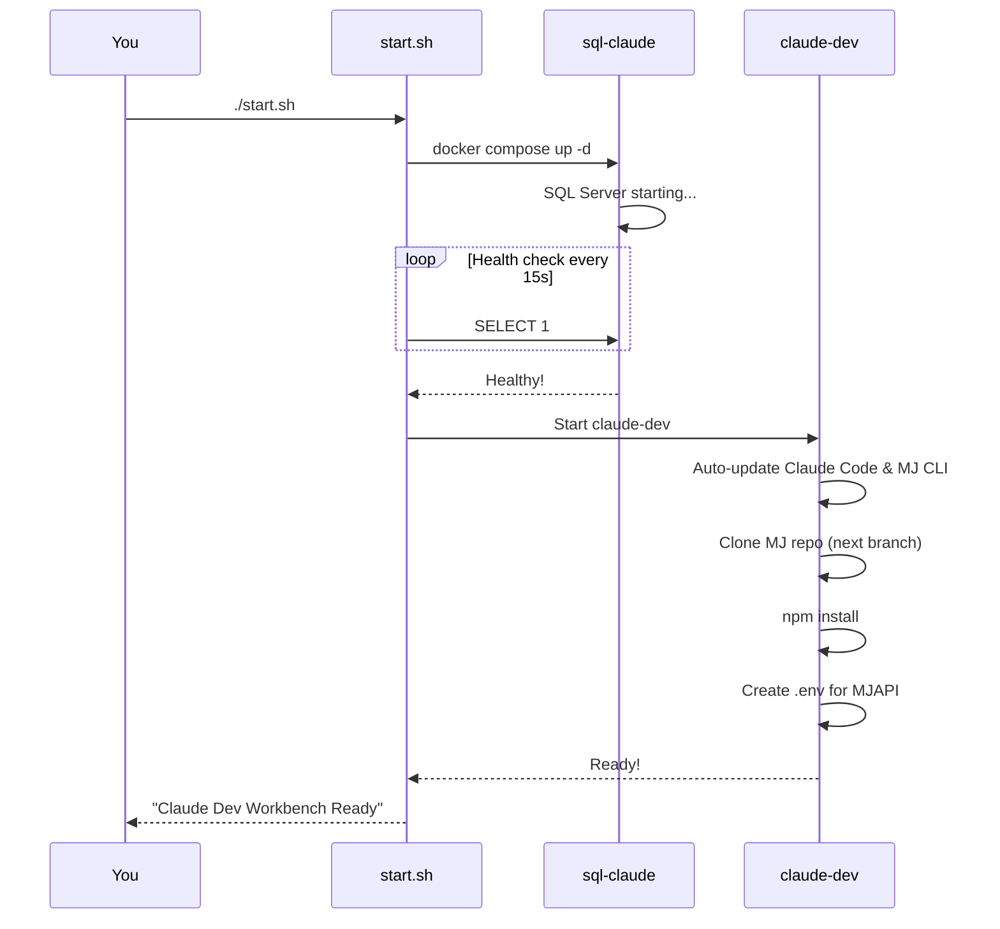
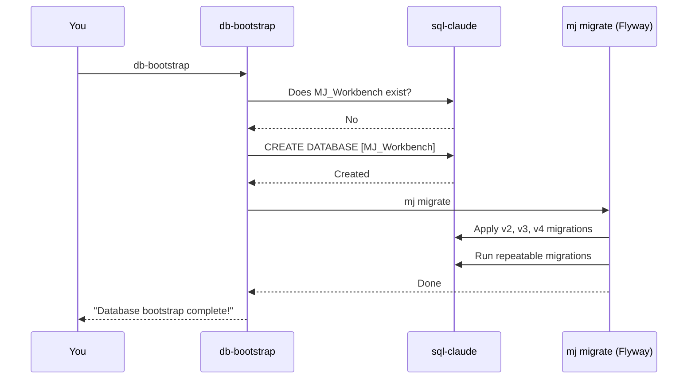
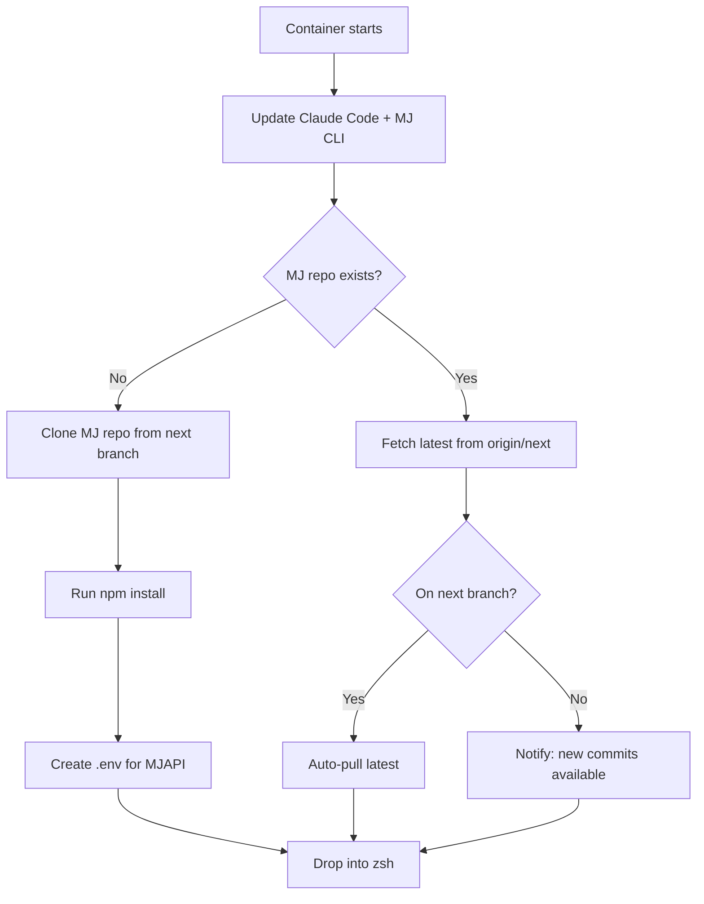

# Workbench

A Docker Compose environment that pairs **Claude Code** with a dedicated **SQL Server 2022** instance, giving you (or an AI agent) a fully self-contained MemberJunction development environment.



---

## Setup from Scratch (Complete Beginner Guide)

If you have never used Docker before, follow every step below. If you already have Docker running, skip to [Step 3](#step-3-configure).

### Step 1: Install Docker Desktop

Docker Desktop gives you everything you need (Docker Engine + Docker Compose) in one installer.

1. Download Docker Desktop for your OS:
   - **macOS**: https://www.docker.com/products/docker-desktop/
   - **Windows**: https://www.docker.com/products/docker-desktop/ (requires WSL 2)
   - **Linux**: Use your package manager, or download from the link above
2. Run the installer and follow the prompts
3. **Start Docker Desktop** — you should see the whale icon in your menu bar / system tray
4. Verify it works:

```bash
docker --version        # Should print "Docker version 27.x" or similar
docker compose version  # Should print "Docker Compose version v2.x"
```

### Step 2: Allocate Enough Memory

Docker Desktop limits how much RAM the containers can use. The workbench needs at least **6 GB** (SQL Server alone wants 2 GB).

**macOS / Windows:**
1. Open Docker Desktop
2. Go to **Settings** (gear icon) > **Resources**
3. Set **Memory** to at least **8 GB** (16 GB recommended if you have it)
4. Click **Apply & restart**

**Linux:** Docker uses host memory directly — no configuration needed.

### Step 3: Configure

```bash
cd docker/workbench
cp .env.example .env
```

Open `.env` in a text editor. The only setting you might want to change:

| Variable | What it does | Default |
|----------|-------------|---------|
| `ANTHROPIC_API_KEY` | Your Anthropic API key for Claude Code. **Leave blank** if you use Claude Max (OAuth login). | _(empty)_ |
| `SA_PASSWORD` | SQL Server admin password. Fine to leave as-is for local dev. | `Claude2Sql99` |

### Step 4: Start the Workbench

```bash
./start.sh
```

This does three things:
1. **Builds** the `claude-dev` container image (first time takes a few minutes)
2. **Starts** SQL Server and waits for it to be healthy
3. **Starts** the Claude Code container



### Step 5: Enter the Container

```bash
docker exec -it claude-dev zsh
```

You'll see a welcome banner with all available shortcuts. You're now inside the container with a full development environment.

### Step 6: Start Claude Code

```bash
cc                          # launch Claude Code (autonomous mode)
```

Claude Code is now running inside the container with full access to:
- The MJ repo at `/workspace/MJ`
- SQL Server at `sql-claude`
- All build tools (npm, turbo, Angular CLI, etc.)

### Step 7: Bootstrap the Database (Optional)

If you want a full MJ database with schema and metadata:

```bash
db-bootstrap                # Creates MJ_Workbench + runs Flyway migrations
```

Then start the MJ stack:

```bash
mjapi                       # Start MJAPI (container :4000 → host :4100)
mjui                        # Start Explorer (container :4200 → host :4300)
```

Open `http://localhost:4300` in your browser to see MJ Explorer.

---

## Daily Workflow

Once the workbench is set up, your daily routine looks like this:


**Start (if containers are stopped):**
```bash
cd docker/workbench && docker compose up -d
```

**Enter:**
```bash
docker exec -it claude-dev zsh
```

**Stop when done:**
```bash
docker compose down           # stops containers, keeps data
docker compose down -v        # stops containers AND deletes all data (fresh start)
```

---

## Port Mapping

All ports are offset from their defaults so they don't conflict with anything you're running locally.

| Service | Inside Container | Your Machine | What to use it for |
|---------|-----------------|-------------|-------------------|
| SQL Server | 1433 | **localhost:1444** | Azure Data Studio, DBeaver |
| MJAPI | 4000 | **localhost:4100** | API testing, GraphQL Playground |
| MJ Explorer | 4200 | **localhost:4300** | Browser UI |

---

## Shell Aliases

When you enter the container (`docker exec -it claude-dev zsh`), these shortcuts are available:

### Claude Code

| Type this | What it does |
|-----------|-------------|
| `cc` | Start Claude Code in autonomous mode (`--dangerously-skip-permissions`) |
| `ccp "do something"` | One-shot prompt — runs Claude with `-p`, then exits |
| `ccr` | Resume your last Claude conversation |
| `ccc` | Continue last conversation (with normal permissions) |

### SQL Server

| Type this | What it does |
|-----------|-------------|
| `sql` | Interactive sqlcmd session connected to sql-claude |
| `sqlmj` | Interactive session connected to the MJ_Workbench database |
| `sqlq "SELECT ..."` | Run a one-off query and see results |
| `sqldbs` | List all databases on the server |
| `sqld MyDB` | Connect to a specific database |

### MemberJunction

| Type this | What it does |
|-----------|-------------|
| `mjcd` | `cd` to the MJ repo (`/workspace/MJ`) |
| `mjapi` | Start MJAPI server (accessible at host :4100) |
| `mjui` | Start MJ Explorer (accessible at host :4300) |
| `mjcg` | Run CodeGen (`mj codegen`) |
| `mjmig` | Run database migrations (`mj migrate`) |
| `mjb` | Build all packages (`npm run build`) |
| `db-bootstrap` | Create MJ database + run all migrations |

### Build Tools

| Type this | What it does |
|-----------|-------------|
| `tb` | `turbo build` — build the whole monorepo |
| `tbf @memberjunction/core` | `turbo build --filter` — build a specific package |

### Git

| Type this | What it does |
|-----------|-------------|
| `gs` | `git status` |
| `gd` | `git diff` |
| `gl` | Last 20 commits (one line each) |
| `gco branch-name` | `git checkout` |
| `gcb new-branch` | `git checkout -b` |

---

## Database Bootstrap

The `db-bootstrap` command creates a fresh MJ database and applies all Flyway migrations so you have a working schema with metadata.

```bash
# Default: creates a database called MJ_Workbench
db-bootstrap

# Custom name
db-bootstrap MyProjectDB

# Skip creation, just run migrations on an existing database
db-bootstrap --migrate-only
```



The standalone `flyway` CLI is also available if you need to run Flyway directly.

---

## Auto-Update

Every time the container starts (including restarts), the entrypoint automatically updates Claude Code and the MJ CLI to their latest versions:

```bash
npm update -g @anthropic-ai/claude-code @memberjunction/cli
```

This means you always have the latest tools without needing to rebuild the Docker image.

---

## SQL Server Connection

### From Inside the Container

Everything is pre-configured via environment variables. Just use the `sql` alias or connect programmatically:

```
Host:     sql-claude
Port:     1433
User:     sa
Password: Claude2Sql99
Database: MJ_Workbench  (after running db-bootstrap)
```

### From Your Host Machine

Connect with Azure Data Studio, DBeaver, or any SQL client:

```
Server:   localhost,1444
User:     sa
Password: Claude2Sql99
```

---

## What's on First Start

Here's what happens the very first time a container starts (subsequent starts are much faster):



---

## Permissions

The container includes pre-approved permissions for common dev commands (`claude-settings.json`), so Claude Code can run npm, git, sqlcmd, turbo, etc. without asking for confirmation each time.

For fully autonomous operation (no permission prompts at all), use the `cc` alias which adds `--dangerously-skip-permissions`.

---

## Troubleshooting

### "Cannot connect to the Docker daemon"

Docker Desktop isn't running. Start it from your Applications folder (macOS) or Start menu (Windows).

### SQL Server container keeps restarting

Usually a memory issue. Check Docker Desktop > Settings > Resources and increase RAM to at least 8 GB.

### "Port 1444 is already in use"

Something else is using that port. Either stop the other service or change the port in `docker-compose.yml`:
```yaml
ports:
  - "1555:1433"    # change 1444 to something else
```

### Build takes forever

The first build downloads ~2 GB of dependencies (Node, Chromium, SQL tools, Flyway). Subsequent builds use Docker's cache and are much faster. If you need to force a full rebuild:

```bash
docker compose build --no-cache
```

### How do I start fresh?

```bash
docker compose down -v     # removes containers AND all data volumes
./start.sh                 # rebuild everything from scratch
```

---

## What's Included

| Component | Purpose |
|-----------|---------|
| Node.js 24 | JavaScript/TypeScript runtime |
| Claude Code | AI coding assistant (auto-updated) |
| @memberjunction/cli | MJ CLI for migrations, codegen, etc. (auto-updated) |
| Flyway 10.20.1 | Database migration engine (standalone + bundled JRE) |
| Turbo | Monorepo build orchestration |
| Angular CLI | Angular development tools |
| Playwright + Chromium | Browser testing |
| GitHub CLI (`gh`) | GitHub operations from the command line |
| Oh-My-Zsh | Enhanced shell with plugins and aliases |
| jq | Command-line JSON processor |
| ripgrep (`rg`) | Fast file content search |
| fzf | Fuzzy finder for files and history |

## Files

| File | Purpose |
|------|---------|
| `Dockerfile` | Container image definition |
| `docker-compose.yml` | Compose stack (SQL Server + Claude) |
| `entrypoint.sh` | Auto-update, MJ clone, npm install, shell startup |
| `db-bootstrap.sh` | Database creation and migration script |
| `.zshrc` | Oh-My-Zsh config with all aliases |
| `.env.database` | SQL + MJAPI connection details (committed, docker-internal only) |
| `.env.example` | Template for user-specific settings |
| `claude-settings.json` | Pre-approved Claude Code permissions |
| `start.sh` | One-command setup script |
