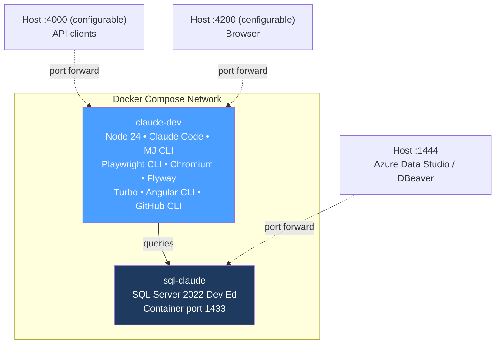
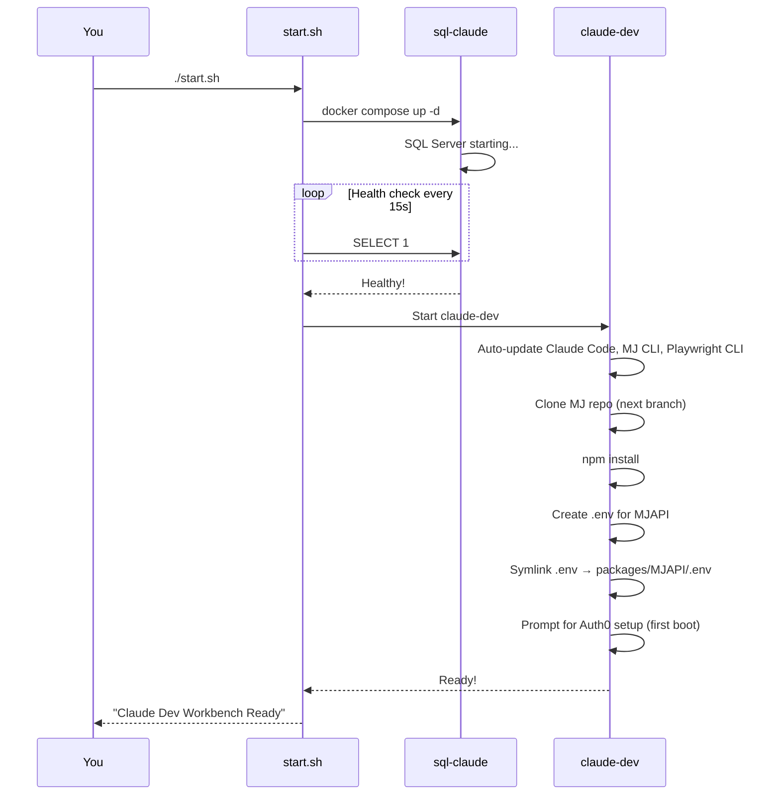
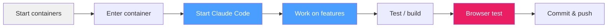
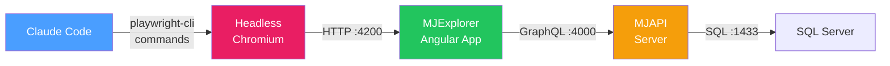
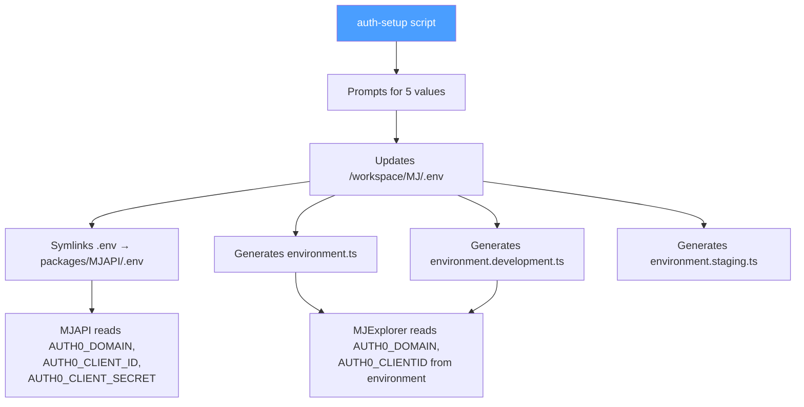
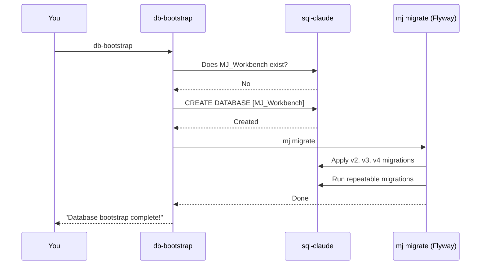
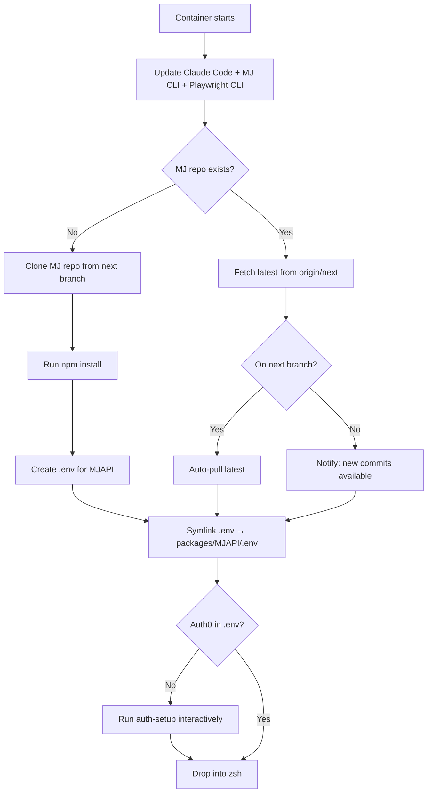

# Workbench

A Docker Compose environment that pairs **Claude Code** with a dedicated **SQL Server 2022** instance and **headless Chromium browser**, giving you (or an AI agent) a fully self-contained MemberJunction development environment with end-to-end browser automation capabilities.



---

## Setup from Scratch (Complete Beginner Guide)

If you have never used Docker before, follow every step below. If you already have Docker running, skip to [Step 3](#step-3-configure).

### Step 1: Install Docker Desktop

Docker Desktop gives you everything you need (Docker Engine + Docker Compose) in one installer.

1. Download Docker Desktop for your OS:
   - **macOS**: https://www.docker.com/products/docker-desktop/
   - **Windows**: https://www.docker.com/products/docker-desktop/ (requires WSL 2)
   - **Linux**: Use your package manager, or download from the link above
2. Run the installer and follow the prompts
3. **Start Docker Desktop** — you should see the whale icon in your menu bar / system tray
4. Verify it works:

```bash
docker --version        # Should print "Docker version 27.x" or similar
docker compose version  # Should print "Docker Compose version v2.x"
```

### Step 2: Allocate Enough Memory

Docker Desktop limits how much RAM the containers can use. The workbench needs at least **8 GB** (SQL Server needs 2 GB, and Chromium needs headroom).

**macOS / Windows:**
1. Open Docker Desktop
2. Go to **Settings** (gear icon) > **Resources**
3. Set **Memory** to at least **8 GB** (16 GB recommended if you have it)
4. Click **Apply & restart**

**Linux:** Docker uses host memory directly — no configuration needed.

### Step 3: Configure

```bash
cd docker/workbench
cp .env.example .env
```

Open `.env` in a text editor and configure:

| Variable | What it does | Default |
|----------|-------------|---------|
| `ANTHROPIC_API_KEY` | Your Anthropic API key for Claude Code. **Leave blank** if you use Claude Max (OAuth login). | _(empty)_ |
| `SA_PASSWORD` | SQL Server admin password. Fine to leave as-is for local dev. | `Claude2Sql99` |
| `MJAPI_HOST_PORT` | Host port mapped to MJAPI (container :4000). Override if you already run a local MJAPI. | `4000` |
| `EXPLORER_HOST_PORT` | Host port mapped to MJExplorer (container :4200). Override if you already run a local Explorer. | `4200` |
| `TEST_AUTH0_DOMAIN` | Auth0 tenant domain. Pre-fill to skip interactive `auth-setup` on first boot. | _(empty)_ |
| `TEST_AUTH0_CLIENT_ID` | Auth0 SPA application client ID. | _(empty)_ |
| `TEST_AUTH0_CLIENT_SECRET` | Auth0 application secret. | _(empty)_ |
| `TEST_UID` | Test user email for browser automation login. | _(empty)_ |
| `TEST_PWD` | Test user password for browser automation login. | _(empty)_ |
| `AI_VENDOR_API_KEY__OpenAILLM` | OpenAI API key — needed for Sage and other MJ AI agents. | _(empty)_ |
| `AI_VENDOR_API_KEY__AnthropicLLM` | Anthropic API key for MJ AI agents. | _(empty)_ |
| `AI_VENDOR_API_KEY__GroqLLM` | Groq API key for MJ AI agents. | _(empty)_ |
| `AI_VENDOR_API_KEY__GeminiLLM` | Google Gemini API key for MJ AI agents. | _(empty)_ |
| `AI_VENDOR_API_KEY__MistralLLM` | Mistral API key for MJ AI agents. | _(empty)_ |

> **Tip**: If you pre-fill the `TEST_AUTH0_*` / `TEST_UID` / `TEST_PWD` variables, the container will auto-configure Auth0 on first boot without any interactive prompts.
>
> **AI Agents**: MJ uses the `AI_VENDOR_API_KEY__<DriverClass>` pattern for AI provider keys. You need at least one LLM key (e.g., OpenAI or Anthropic) for Sage and other AI agents to work. See `.env.example` for the full list of supported providers.

### Step 4: Start the Workbench

```bash
./start.sh
```

This does three things:
1. **Builds** the `claude-dev` container image (first time takes a few minutes)
2. **Starts** SQL Server and waits for it to be healthy
3. **Starts** the Claude Code container



### Step 5: Enter the Container

```bash
docker exec -it claude-dev zsh
```

You'll see a welcome banner with all available shortcuts. You're now inside the container with a full development environment.

### Step 6: Auth0 Setup (First Boot)

On first boot, the entrypoint detects that Auth0 credentials are missing and prompts you:

```
  Auth0 credentials not found in .env.
  MJAPI and MJExplorer need Auth0 to authenticate users.

  Run Auth0 setup now? [Y/n] Y

  ┌─────────────────────────────────────────┐
  │     MJ Workbench — Auth0 Setup          │
  └─────────────────────────────────────────┘

  Auth0 Domain (e.g. myapp.us.auth0.com): ____
  Auth0 Client ID: ____
  Auth0 Client Secret: ____
  Test User Email (for browser automation login): ____
  Test User Password: ____
```

This script (`auth-setup`) does three things:
1. **Saves credentials** to `/workspace/MJ/.env` (both `AUTH0_*` for MJAPI and `TEST_*` for automation)
2. **Creates Angular environment files** (`environment.ts`, `environment.development.ts`, `environment.staging.ts`) with your Auth0 domain and client ID
3. **Symlinks** the repo root `.env` to `packages/MJAPI/.env` so MJAPI reads it directly

You can re-run `auth-setup` at any time to update credentials.

#### Auth0 Tenant Prerequisites

Your Auth0 tenant needs a **Single Page Application** (SPA) configured with:

| Setting | Values |
|---------|--------|
| Allowed Callback URLs | `http://localhost:4200` through `http://localhost:4205` |
| Allowed Logout URLs | `http://localhost:4200` through `http://localhost:4205` |
| Allowed Web Origins | `http://localhost:4200` through `http://localhost:4205` |

The port range (4200–4205) supports running multiple workbench instances simultaneously by setting different `EXPLORER_HOST_PORT` values in each instance's `.env` file.

And a **test user account** with email/password for browser automation.

### Step 7: Start Claude Code

```bash
cc                          # launch Claude Code (autonomous mode)
```

Claude Code is now running inside the container with full access to:
- The MJ repo at `/workspace/MJ`
- SQL Server at `sql-claude`
- All build tools (npm, turbo, Angular CLI, etc.)
- Headless Chromium browser via Playwright CLI

### Step 8: Bootstrap the Database (Optional)

If you want a full MJ database with schema and metadata:

```bash
db-bootstrap                # Creates MJ_Workbench + runs Flyway migrations
```

Then start the MJ stack:

```bash
mjapi                       # Start MJAPI (container :4000 → host :4000 by default)
mjui                        # Start Explorer (container :4200 → host :4200 by default)
```

Open `http://localhost:4200` in your browser to see MJ Explorer (or the port you set in `EXPLORER_HOST_PORT`).

---

## Daily Workflow

Once the workbench is set up, your daily routine looks like this:



**Start (if containers are stopped):**
```bash
cd docker/workbench && docker compose up -d
```

**Enter:**
```bash
docker exec -it claude-dev zsh
```

**Stop when done:**
```bash
docker compose down           # stops containers, keeps data
docker compose down -v        # stops containers AND deletes all data (fresh start)
```

---

## Browser Automation

The workbench includes Microsoft's [Playwright CLI](https://github.com/microsoft/playwright-cli) (`@playwright/cli`) and headless Chromium. This enables Claude Code to do full-stack browser automation — navigating the UI, filling forms, clicking buttons, taking screenshots, and checking console errors — all without a visible browser window.

### How It Works



### Quick Example

```bash
# Start the stack
mjapi &                                     # MJAPI in background
mjui &                                      # Explorer in background
# Wait for compilation to finish...

# Open the browser and interact
playwright-cli open http://localhost:4200    # Launch headless Chromium
playwright-cli snapshot                     # Get accessible element refs
playwright-cli fill e5 "admin@test.com"     # Fill the email field
playwright-cli fill e7 "password123"        # Fill the password field
playwright-cli click e9                     # Click the login button
playwright-cli snapshot                     # See the logged-in state
playwright-cli screenshot --filename=home.png  # Save a screenshot
playwright-cli console error                # Check for JS errors
playwright-cli close                        # Close the browser
```

### Auth0 Login Automation

Claude Code can automate the Auth0 login flow using the test credentials stored in `.env`:

```bash
# Read credentials from .env
source /workspace/MJ/.env
# TEST_UID and TEST_PWD are available as environment variables

# Use in playwright-cli
playwright-cli open http://localhost:4200
playwright-cli snapshot                     # Find the login form elements
playwright-cli fill e3 "$TEST_UID"          # Email field
playwright-cli fill e5 "$TEST_PWD"          # Password field
playwright-cli click e7                     # Submit
```

### Browser Automation Aliases

| Type this | What it does |
|-----------|-------------|
| `pwc` | Short alias for `playwright-cli` |
| `pwopen` | Open headless browser pointing at Explorer (:4200) |
| `pwsnap` | Take accessibility snapshot (element refs) |
| `pwclose` | Close the browser session |
| `pwscreen` | Take a screenshot |
| `pwconsole` | Show browser console output |
| `pwlist` | List active browser sessions |

### Desktop vs Docker Differences

| Aspect | Desktop | Docker Workbench |
|--------|---------|-----------------|
| Display mode | `--headed` (visible window) | Headless (no display) |
| Interaction style | Visual + snapshot | Snapshot-driven |
| Ports | MJAPI :4001, Explorer :4201 | MJAPI :4000, Explorer :4200 (configurable) |
| Auth caching | `.playwright-cli/profile` dir | Fresh per session (or use `--persistent`) |
| Screenshots | Open in OS viewer | Read with `Read` tool or copy to host |

### Chromium Memory

Chromium uses `/dev/shm` (shared memory) for inter-process communication. The Docker default of 64MB is too small and causes tab crashes. The workbench sets `shm_size: '2gb'` in `docker-compose.yml` to prevent this.

---

## Port Mapping

By default, host ports match container ports so Auth0 callbacks work without extra configuration. Override via `.env` if you have local services on those ports.

| Service | Inside Container | Your Machine (Default) | Env Var Override |
|---------|-----------------|----------------------|-----------------|
| SQL Server | 1433 | **localhost:1444** | _(hardcoded)_ |
| MJAPI | 4000 | **localhost:4000** | `MJAPI_HOST_PORT` |
| MJ Explorer | 4200 | **localhost:4200** | `EXPLORER_HOST_PORT` |

Example: To avoid conflicts with a local MJAPI on port 4000, add `MJAPI_HOST_PORT=4100` to your `.env`.

---

## Shell Aliases

When you enter the container (`docker exec -it claude-dev zsh`), these shortcuts are available:

### Claude Code

| Type this | What it does |
|-----------|-------------|
| `cc` | Start Claude Code in autonomous mode (`--dangerously-skip-permissions`) |
| `ccp "do something"` | One-shot prompt — runs Claude with `-p`, then exits |
| `ccr` | Resume your last Claude conversation |
| `ccc` | Continue last conversation (with normal permissions) |

### SQL Server

| Type this | What it does |
|-----------|-------------|
| `sql` | Interactive sqlcmd session connected to sql-claude |
| `sqlmj` | Interactive session connected to the MJ_Workbench database |
| `sqlq "SELECT ..."` | Run a one-off query and see results |
| `sqldbs` | List all databases on the server |
| `sqld MyDB` | Connect to a specific database |

### MemberJunction

| Type this | What it does |
|-----------|-------------|
| `mjcd` | `cd` to the MJ repo (`/workspace/MJ`) |
| `mjapi` | Start MJAPI server (host port configurable via `MJAPI_HOST_PORT`, default :4000) |
| `mjui` | Start MJ Explorer (host port configurable via `EXPLORER_HOST_PORT`, default :4200) |
| `mjcg` | Run CodeGen (`mj codegen`) |
| `mjmig` | Run database migrations (`mj migrate`) |
| `mjb` | Build all packages (`npm run build`) |
| `db-bootstrap` | Create MJ database + run all migrations |
| `auth-setup` | Configure Auth0 credentials + generate environment files |

### Build Tools

| Type this | What it does |
|-----------|-------------|
| `tb` | `turbo build` — build the whole monorepo |
| `tbf @memberjunction/core` | `turbo build --filter` — build a specific package |

### Git

| Type this | What it does |
|-----------|-------------|
| `gs` | `git status` |
| `gd` | `git diff` |
| `gl` | Last 20 commits (one line each) |
| `gco branch-name` | `git checkout` |
| `gcb new-branch` | `git checkout -b` |

### Browser Automation

| Type this | What it does |
|-----------|-------------|
| `pwc` | Short alias for `playwright-cli` |
| `pwopen` | Open headless Chromium → MJ Explorer |
| `pwsnap` | Take accessibility snapshot |
| `pwclose` | Close browser session |
| `pwscreen` | Take screenshot |
| `pwconsole` | Check browser console output |
| `pwlist` | List active browser sessions |

---

## Auth0 Configuration

### What You Need

A test Auth0 tenant with:
1. A **Single Page Application** (SPA) configured with:
   - **Allowed Callback URLs**: `http://localhost:4200` through `http://localhost:4205`
   - **Allowed Logout URLs**: `http://localhost:4200` through `http://localhost:4205`
   - **Allowed Web Origins**: `http://localhost:4200` through `http://localhost:4205`

   The port range supports multiple simultaneous workbench instances with different `EXPLORER_HOST_PORT` values.
2. A **test user account** for browser automation

### How Setup Works



### Credential Mapping

| You Enter | Saved As | Used By |
|-----------|---------|---------|
| Auth0 Domain | `AUTH0_DOMAIN` + `TEST_AUTH0_DOMAIN` | MJAPI (.env), Explorer (environment.ts) |
| Client ID | `AUTH0_CLIENT_ID` + `TEST_AUTH0_CLIENT_ID` | MJAPI (.env), Explorer (environment.ts as `AUTH0_CLIENTID`) |
| Client Secret | `AUTH0_CLIENT_SECRET` + `TEST_AUTH0_CLIENT_SECRET` | MJAPI (.env) |
| Test Email | `TEST_UID` | Claude Code (browser automation login) |
| Test Password | `TEST_PWD` | Claude Code (browser automation login) |

### Re-running Setup

```bash
auth-setup                  # Interactive prompts, overwrites previous values
auth-setup --check          # Silent check: exit 0 if configured, exit 1 if not
```

---

## Database Bootstrap

The `db-bootstrap` command creates a fresh MJ database and applies all Flyway migrations so you have a working schema with metadata.

```bash
# Default: creates a database called MJ_Workbench
db-bootstrap

# Custom name
db-bootstrap MyProjectDB

# Skip creation, just run migrations on an existing database
db-bootstrap --migrate-only
```



The standalone `flyway` CLI is also available if you need to run Flyway directly.

---

## File Persistence

### What Persists Across Restarts

The `/workspace` directory is a **bind mount** from the host filesystem (`docker/workbench/workspace/`). Everything inside persists automatically:

| What | Location | Persists? |
|------|----------|-----------|
| MJ source code | `/workspace/MJ/` | Yes (host mount) |
| `.env` files | `/workspace/MJ/.env` | Yes (host mount) |
| Angular environments | `/workspace/MJ/packages/MJExplorer/src/environments/` | Yes (host mount) |
| node_modules | `/workspace/MJ/node_modules/` | Yes (host mount) |
| Claude Code settings | `/root/.claude/` | Yes (named volume) |
| GitHub CLI auth | `/root/.config/gh/` | Yes (named volume) |
| SQL Server data | SQL container volume | Yes (named volume) |

### Fresh Start

```bash
docker compose down -v     # removes containers AND all data volumes
./start.sh                 # rebuild everything from scratch
```

---

## Auto-Update

Every time the container starts (including restarts), the entrypoint automatically updates Claude Code, the MJ CLI, and Playwright CLI to their latest versions:

```bash
npm update -g @anthropic-ai/claude-code @memberjunction/cli @playwright/cli
```

This means you always have the latest tools without needing to rebuild the Docker image.

---

## SQL Server Connection

### From Inside the Container

Everything is pre-configured via environment variables. Just use the `sql` alias or connect programmatically:

```
Host:     sql-claude
Port:     1433
User:     sa
Password: Claude2Sql99
Database: MJ_Workbench  (after running db-bootstrap)
```

### From Your Host Machine

Connect with Azure Data Studio, DBeaver, or any SQL client:

```
Server:   localhost,1444
User:     sa
Password: Claude2Sql99
```

---

## What's on First Start

Here's what happens the very first time a container starts (subsequent starts are much faster):



---

## Permissions

The container includes pre-approved permissions for common dev commands (`claude-settings.json`), so Claude Code can run npm, git, sqlcmd, turbo, playwright-cli, etc. without asking for confirmation each time.

For fully autonomous operation (no permission prompts at all), use the `cc` alias which adds `--dangerously-skip-permissions`.

---

## Troubleshooting

### "Cannot connect to the Docker daemon"

Docker Desktop isn't running. Start it from your Applications folder (macOS) or Start menu (Windows).

### SQL Server container keeps restarting

Usually a memory issue. Check Docker Desktop > Settings > Resources and increase RAM to at least 8 GB.

### Chromium tabs crash immediately

This is a shared memory issue. The `shm_size: '2gb'` setting in `docker-compose.yml` should prevent this. If you still see crashes, try increasing it to `4gb`.

### "Port 1444 is already in use"

Something else is using that port. Either stop the other service or change the port in `docker-compose.yml`:
```yaml
ports:
  - "1555:1433"    # change 1444 to something else
```

### Auth0 login fails

1. Run `auth-setup` to verify your credentials
2. Check that your Auth0 SPA application has `http://localhost:4200` through `http://localhost:4205` in its Allowed Callback URLs (the port must match your `EXPLORER_HOST_PORT` setting, default 4200)
3. Verify the test user exists and has a password set in Auth0
4. Make sure MJAPI is started with the proper start command (via `npm run start` or the `mjapi` alias) so that `-r dotenv/config` loads the Auth0 environment variables

### Angular environment files missing

If `npm start` fails with missing environment files, run `auth-setup` to regenerate them.

### Build takes forever

The first build downloads ~2.5 GB of dependencies (Node, Chromium, SQL tools, Flyway, Playwright). Subsequent builds use Docker's cache and are much faster. If you need to force a full rebuild:

```bash
docker compose build --no-cache
```

### How do I start fresh?

```bash
docker compose down -v     # removes containers AND all data volumes
./start.sh                 # rebuild everything from scratch
```

---

## What's Included

| Component | Purpose |
|-----------|---------|
| Node.js 24 | JavaScript/TypeScript runtime |
| Claude Code | AI coding assistant (auto-updated) |
| @memberjunction/cli | MJ CLI for migrations, codegen, etc. (auto-updated) |
| Playwright CLI (`@playwright/cli`) | Token-efficient browser automation CLI for AI agents (auto-updated) |
| Chromium | Headless browser for Playwright CLI |
| Xvfb | Virtual framebuffer for edge cases requiring a display |
| Flyway 10.20.1 | Database migration engine (standalone + bundled JRE) |
| Turbo | Monorepo build orchestration |
| Angular CLI | Angular development tools |
| GitHub CLI (`gh`) | GitHub operations from the command line |
| Oh-My-Zsh | Enhanced shell with plugins and aliases |
| jq | Command-line JSON processor |
| ripgrep (`rg`) | Fast file content search |
| fzf | Fuzzy finder for files and history |

## Files

| File | Purpose |
|------|---------|
| `Dockerfile` | Container image definition |
| `docker-compose.yml` | Compose stack (SQL Server + Claude) |
| `entrypoint.sh` | Auto-update, MJ clone, npm install, Auth0 check, shell startup |
| `auth-setup.sh` | Interactive Auth0 credential setup + Angular environment generation |
| `db-bootstrap.sh` | Database creation and migration script |
| `.zshrc` | Oh-My-Zsh config with all aliases (including browser automation) |
| `.env.database` | SQL + MJAPI connection details (committed, docker-internal only) |
| `.env.example` | Template for user-specific settings |
| `claude-settings.json` | Pre-approved Claude Code permissions (includes playwright-cli) |
| `start.sh` | One-command setup script |
