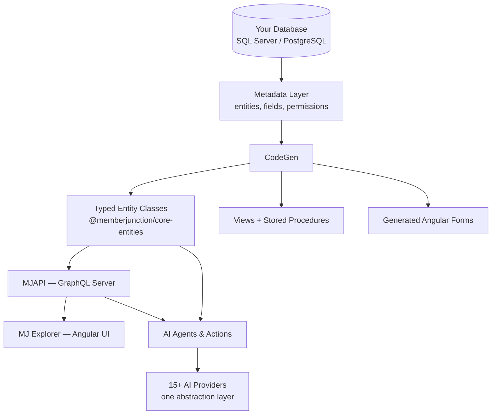

MemberJunction is **metadata-driven**: you define your schema in the database, and CodeGen produces everything above it — typed entity classes, stored procedures and views, GraphQL resolvers, and Angular forms. One object model runs identically on the server, in the browser, in the CLI, and inside agents.

## The layers

- **Metadata core** — every entity, field, relationship, and permission is described in metadata tables. [`@memberjunction/core`](../packages/mjcore/) is the runtime that reads it.
- **Generated data layer** — [CodeGen](../overview/) emits typed `BaseEntity` subclasses, SQL views, and CRUD stored procedures. You never hand-write CRUD.
- **API layer** — MJAPI serves a GraphQL API generated from the same metadata, with row-level security and full audit trails.
- **UI layer** — MJ Explorer renders generated forms, dashboards, and grids; every surface is extensible with custom Angular components.
- **AI stack** — providers, prompts, agents, and vector sync operate directly on your entities. See [AI & Agents](../ai-and-agents/).

## Go deeper

- [Building Apps on MJ](../custom-apps/) — the schema-to-app development model.
- [Framework comparison](../guides/framework-comparison/) — MJ vs. Next.js/Supabase/Rails/Django.
- [Caching & real-time sync](../guides/caching-and-pubsub/) — the server cache + pub/sub architecture.
- [Package directory](../packages/) — all 290+ packages by area.
- [API Reference](../api/) — TypeDoc for every published package.
