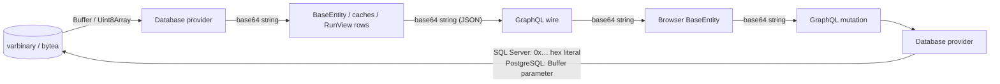

# Binary Fields Guide

How MemberJunction stores, moves and reads binary data — `varbinary` / `binary` / `image` columns on
SQL Server, `bytea` on PostgreSQL — and how the persisted embedding vectors use it.

**Read this before** adding a binary column, writing code that reads one, or touching a provider's
row conversion or save binding.

---

## 1. The one rule: above the database, a binary value is a base64 string



| Layer | Representation |
|---|---|
| Column | raw bytes |
| Provider read (`PostProcessRows`) | driver `Buffer` → **base64** |
| `BaseEntity` field, every cache, `RunView` row | **base64 string** (`string \| null`) |
| GraphQL (both directions) | **base64 string** |
| Provider save | base64 → SQL Server `0x<HEX>` literal / PostgreSQL `Buffer` parameter |

There is exactly one representation, so a value can move between any two of these places without
conversion code. That is why `BaseEntity` holds a string rather than a `Uint8Array`: a
`Uint8Array` does not survive `JSON.stringify`, structured caches, or GraphQL. A Node `Buffer`
serializes as `{"type":"Buffer","data":[…]}`, which is what MJ used to send before this design.

Base64 costs 4/3 the size of the raw bytes on the wire. Large binary payloads do not belong on a
general-purpose read path anyway (see §3), so MJ does not optimise for them.

### Encoding helpers — `@memberjunction/global`

| Function | Use |
|---|---|
| `BytesToBase64(bytes)` / `Base64ToBytes(b64)` | Bytes ↔ base64. `Base64ToBytes` throws on invalid input. |
| `TryBase64ToBytes(b64 \| null)` | Same, but returns `null` for null or invalid input. |
| `IsValidBase64(value)` | Canonical base64 only: standard alphabet, optional padding, no whitespace, no data-URI prefix, no URL-safe alphabet. |
| `Float32VectorToBase64(values)` / `Base64ToFloat32Vector(b64)` | An embedding as little-endian float32 bytes. |
| `ReplaceByteArraysWithBase64(row)` | Makes a raw query row JSON-safe (copy-on-write; never mutates a cached row). |

The codec is chosen once per process from the fastest the host offers:

1. Native `Uint8Array.fromBase64` / `toBase64`, which current browsers provide (feature-detected).
2. Node `Buffer`. On Node, validation is fused into the decode: a canonical string decodes to an
   exact byte count, so a length check plus a URL-safe-alphabet check is a full validation. This is
   fuzz-tested to agree with `IsValidBase64` on every input, and it is what makes server decoding
   about 4× faster than a separate character scan.
3. `atob` / `btoa`, available everywhere.

Every codec produces the same accept/reject decision and the same bytes.

---

## 2. Writing a binary field

```typescript
import { BytesToBase64, Float32VectorToBase64 } from '@memberjunction/global';

doc.VectorBinary = Float32VectorToBase64(embedding);   // a float32 vector
file.Content = BytesToBase64(bytes);                    // arbitrary bytes
file.Content = null;                                    // clear it
await file.Save();
```

- **Validation.** `BaseEntity.Validate()` rejects a non-base64 value with a message naming base64,
  and rejects a value whose decoded length exceeds a fixed-length column (`binary(16)`,
  `varbinary(512)`). `varbinary(MAX)` / `bytea` has no length limit.
- **Saving.** The provider binds the decoded bytes. SQL Server inlines a `0x…` hex literal, so the
  value never round-trips through `nvarchar`. PostgreSQL binds a `Buffer` parameter; inside a
  transaction group it inlines `'\x…'::bytea`.
- **CodeGen.** A binary parameter is declared `varbinary(MAX)` when the column has no fixed length.
  The old declaration was a bare `varbinary`, which T-SQL reads as `varbinary(1)` and silently
  truncates to one byte.

---

## 3. Reading binary fields: omitted by default

Binary columns are often large and rarely needed in a list, so **`RunView` leaves them out unless
asked**:

```typescript
// Default — no binary fields in the rows (the key is absent, not null)
await rv.RunView({ EntityName: 'MJ: Entity Record Documents', ExtraFilter: f });

// Ask for all of them
await rv.RunView({ EntityName: 'MJ: Entity Record Documents', ExtraFilter: f, IncludeBinaryFields: true });

// Or name one — naming a binary field in Fields sets IncludeBinaryFields for you
await rv.RunView({ EntityName: 'MJ: Entity Record Documents', Fields: ['ID', 'VectorBinary'], ResultType: 'simple' });
```

| Path | Binary fields |
|---|---|
| `RunView` / `RunViews`, no `Fields` | omitted; the provider emits an explicit column list instead of `*` |
| `RunView` with `IncludeBinaryFields: true` | included |
| `RunView` with a binary field named in `Fields` | included (flag set automatically) |
| Saved user view whose columns include a binary field | omitted unless flagged |
| `entity.Load(id)` (one record) | **always included** |
| `BaseEngine` config `IncludeBinaryFields: true` | included |
| `BaseEngine` config `IncludeBinaryFields: 'DatabaseProviderOnly'` | included in server processes, omitted in the browser |

`IncludeBinaryFields` is part of the RunView cache fingerprint, so a flagged read and an unflagged
read never share a cache entry.

**Saving a record loaded without its binary fields is safe.** A field the source row omitted is
marked `EntityField.NotLoaded`, and a `NotLoaded` field is left out of the save entirely on both
tiers. The server's update procedure then keeps the stored value, and the GraphQL client never
sends the field in its mutation. Reading the field returns `null` until the record is `Load()`ed,
so load before you rely on the value.

Use `'DatabaseProviderOnly'` for engine-cached entities whose binary column only server code reads.
The persisted embedding columns are the example (§4): the server needs them to build its vector
index, while a browser caching the same entity for display does not.

---

## 4. Binary embedding vectors

Every entity that persists an embedding has a **binary companion** next to its JSON vector column:

| Entity | JSON column | Binary column |
|---|---|---|
| `MJ: Entity Record Documents` | `VectorJSON` | `VectorBinary` |
| `MJ: AI Agent Notes` | `EmbeddingVector` | `EmbeddingVectorBinary` |
| `MJ: AI Agent Examples` | `EmbeddingVector` | `EmbeddingVectorBinary` |
| `MJ: Queries` | `EmbeddingVector` | `EmbeddingVectorBinary` |
| `MJ: Tags` | `EmbeddingVector` | `EmbeddingVectorBinary` |
| `MJ: Components` | `FunctionalRequirementsVector` | `FunctionalRequirementsVectorBinary` |
| `MJ: Components` | `TechnicalDesignVector` | `TechnicalDesignVectorBinary` |

The binary value holds the same vector as little-endian IEEE-754 float32 bytes, 4 per dimension,
with no header.

**Why.** Loading a vector from JSON builds a string per number and parses it back. Decoding the
binary column is a copy. For 20,000 × 1,536 vectors, measured on Node 22:

| | Time | Stored size per vector |
|---|---|---|
| `JSON.parse` of the JSON column | 3.9 s | 32 KB |
| `Base64ToFloat32Vector` of the binary column | **0.28 s** | 6 KB (8 KB as base64) |
| Write: `JSON.stringify` | 4.6 s | |
| Write: `Float32VectorToBase64` | **0.24 s** | |

### Writers fill both

Every writer stores both forms, so the two never disagree:

- `BaseEntity.GenerateEmbedding*` takes an optional binary field (`binaryVectorFieldName` /
  `binaryVectorField`) and sets it alongside the JSON field, clearing both together.
- The note, example, component, query and tag entity servers, `TagEngine`, and the entity vectorizer
  (`EntityVectorSyncer`) all write both columns.

### Readers prefer binary — `ReadStoredVector`

```typescript
import { ReadStoredVector } from '@memberjunction/ai-vectors-memory';

const vector = ReadStoredVector(note.EmbeddingVectorBinary, note.EmbeddingVector);
if (vector) service.AddOrUpdateVector(note.ID, vector, metadata);   // Float32Array | number[]
```

`ReadStoredVector` returns the binary vector when it is valid: non-empty, a whole number of float32
values, all finite. Otherwise it falls back to the JSON column, and returns `null` when neither
holds a usable vector. The fallback covers rows written before the binary column existed, browser
code that did not fetch binary fields, and a corrupt binary value, which never hides a good JSON
copy. `SimpleVectorService` accepts `number[]`, `Float32Array` and `Float64Array` alike.

These readers use it:

- `SimpleVectorServiceProvider`
- `AIEngine` (notes and examples)
- `TagEngine` and `TagHealthJob`
- `QueryEngineServer`
- `EntityDocumentVectorSource` (clustering)

`SimpleVectorDatabase` reads it when its ProviderConfig names the companion:

```json
{ "entityName": "MJ: AI Agent Notes", "vectorField": "EmbeddingVector", "binaryVectorField": "EmbeddingVectorBinary" }
```

---

## 5. Adding a binary column

1. Write the migration: a nullable `VARBINARY(MAX)` (or a fixed length), plus an
   `sp_addextendedproperty` description saying what the bytes are.
2. Run CodeGen. The generated getter is `string | null` with a "Binary Value: base64-encoded string"
   doc line. Generated forms skip binary fields, so render them with a custom panel if users need
   them.
3. Write it with `BytesToBase64` (or `Float32VectorToBase64`). Read it with `TryBase64ToBytes`
   (or `ReadStoredVector` for a vector).
4. If code reads it from a `RunView`, pass `IncludeBinaryFields: true` or name it in `Fields`. If an
   engine caches the entity, set `IncludeBinaryFields` on that config.

---

## 6. Tests

- **Unit:**
  - `MJGlobal` — the codecs, including a fuzz test of the fused Node validation
  - `MJCore` — selection, fingerprint, validation, engine flag, `GenerateEmbedding`
  - Each provider — row conversion, save binding, transaction groups
  - `MJServer` and `GraphQLDataProvider` — forwarding and wire shape
  - `CodeGenLib` — getter docs, form skipping
  - `ai-vectors-memory` and every vector reader and writer
- **Integration:** IT99, the `binary-fields` bundle (BF1–BF6), run client-first over GraphQL:
  - BF1 metadata
  - BF2 selection and cache isolation
  - BF3 stored vectors agree with their JSON copy
  - BF4 all 256 byte values round-trip byte for byte
  - BF5 validation
  - BF6 a 1,536-d vector round-trips bit-identical

  ```bash
  pnpm mj test run "IT99 - Binary Fields and Vector Columns"
  ```
