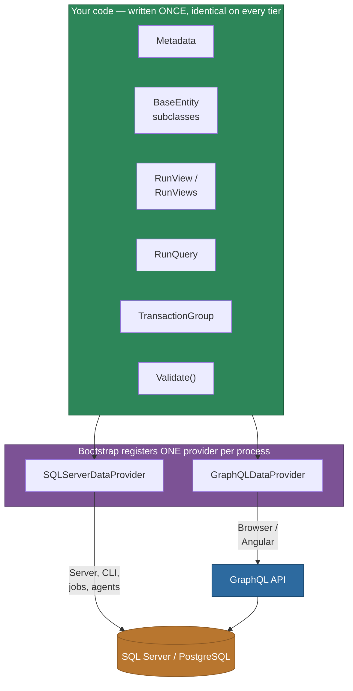
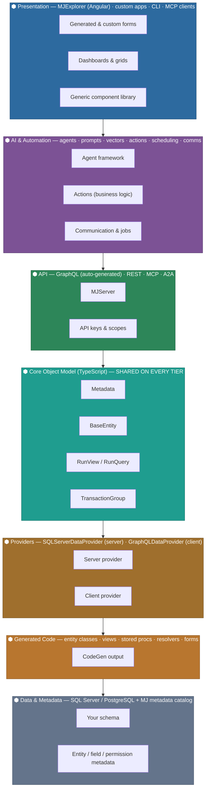
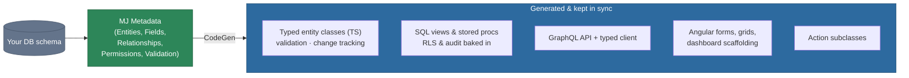
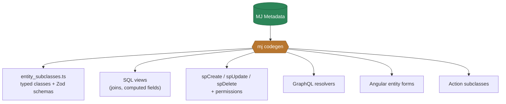
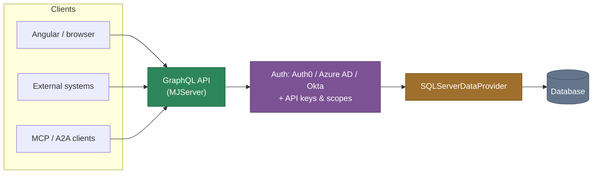
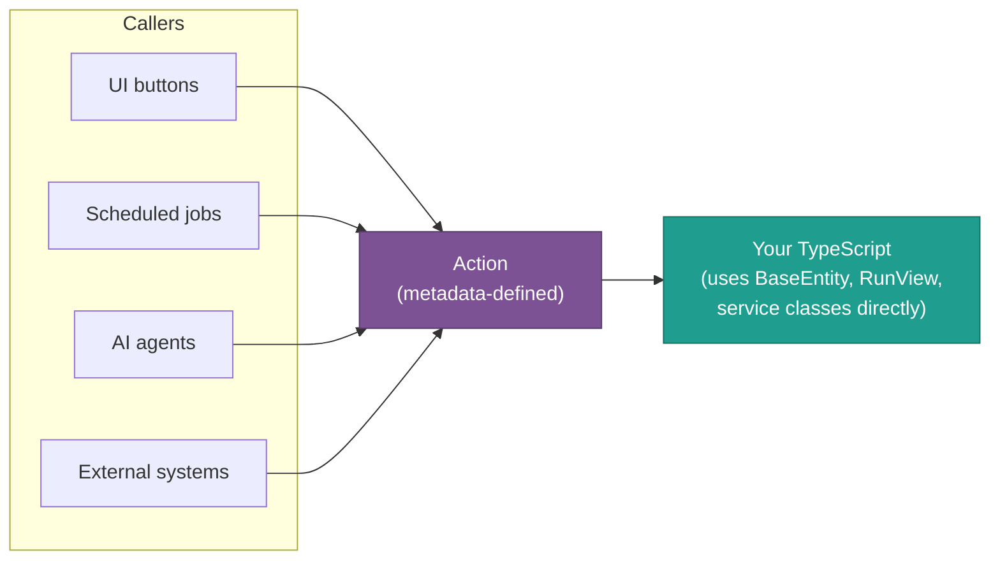

# Building Applications on MemberJunction

> **The short version** — MemberJunction is best known as an AI data platform: unify your data, add intelligence, ship faster. But the engine that ingests and reasons over your data is also a **first-class application development platform** for database-driven business apps. You model a schema; MJ generates a complete, type-safe, secured full-stack application around it — typed data access, APIs, UI, business logic, and AI — all in **one language (TypeScript)** with **one object model that runs identically on every tier**. Once your data is in MJ, you build directly on it. You don't move it somewhere else first.

This is the **developer's hub** for that story. It explains the architecture, the model that makes it work, and links to the authoritative README/guide for every layer so you can go from "my data is in MJ" to "I'm shipping a custom application on MJ."

---

## Table of contents

1. [Who this guide is for](#who-this-guide-is-for)
2. [The one idea that matters most: one language, one object model, every tier](#the-one-idea-that-matters-most-one-language-one-object-model-every-tier)
3. [The architecture, in layers](#the-architecture-in-layers)
4. [The core idea: model the schema, get the application](#the-core-idea-model-the-schema-get-the-application)
5. [The build journey](#the-build-journey)
6. [Layer-by-layer deep dive](#layer-by-layer-deep-dive)
   - [1. Data modeling & schema](#1-data-modeling--schema)
   - [2. Code generation — the engine that ties it together](#2-code-generation--the-engine-that-ties-it-together)
   - [3. The entity framework — typed data access](#3-the-entity-framework--typed-data-access)
   - [4. Write once, run on every tier — the isomorphic core in practice](#4-write-once-run-on-every-tier--the-isomorphic-core-in-practice)
   - [5. The API layer](#5-the-api-layer)
   - [6. Security, permissions & audit](#6-security-permissions--audit)
   - [7. The UI layer — MJExplorer & Angular](#7-the-ui-layer--mjexplorer--angular)
   - [8. Business logic — the Actions framework](#8-business-logic--the-actions-framework)
   - [9. AI — the force multiplier](#9-ai--the-force-multiplier)
   - [10. Application metadata as code](#10-application-metadata-as-code)
   - [11. Deployment](#11-deployment)
7. [Cross-cutting developer guides](#cross-cutting-developer-guides)
8. [A mental model to keep](#a-mental-model-to-keep)

---

## Who this guide is for

You've probably arrived one of two ways:

1. **You came for the data/AI platform.** You pulled data in from other systems — CRM, accounting, a legacy database, spreadsheets — and now you're wondering: *can I actually build applications on top of this, or do I have to export it somewhere else?* You build right here.
2. **You're starting greenfield.** You want a database-driven business application — a membership system, a CRM, a case-management tool, an internal ops console — and you want the data layer, API, security, audit, and UI handled for you so you can focus on what's unique to your domain.

Either way, the rest of this guide shows you the layers MJ gives you and where to learn each one.

---

## The one idea that matters most: one language, one object model, every tier

If you take away nothing else, take this: **MemberJunction lets you write your data and business logic *once*, in TypeScript, and run that *exact same code* on the server, in the browser, in a CLI, and inside background jobs and AI agents.** This is rare, and it is the single biggest reason MJ apps are faster to build and cheaper to maintain than conventionally-architected apps.

### Why this is uncommon — and powerful

A typical database-driven web app forces you to redefine your domain several times, in several languages, across a tier boundary:

| Concern | Conventional stack | MemberJunction |
|---|---|---|
| Schema / migrations | SQL | SQL (migrations) |
| Server data model | ORM models (often a 2nd language/DSL) | **`BaseEntity` subclass (TypeScript)** |
| API contract | GraphQL SDL / OpenAPI / gRPC proto | **Auto-generated from metadata** |
| API serialization | Hand-written DTOs / serializers | **Handled by the provider** |
| Client data model | TS interfaces duplicating the server | **The same `BaseEntity` subclass** |
| Client API calls | fetch/axios/Apollo hooks | **The same `RunView` / `.Save()` calls** |
| Validation | Re-implemented per tier | **One `Validate()` on the entity, runs everywhere** |

Each row in the "conventional" column is a place where your model can drift, where a field rename breaks something silently, and where you write and test the *same logic twice*. MemberJunction collapses the whole column into **one typed object model**.

> Quoting `@memberjunction/core`'s own readme: *"The package uses a **provider model** that allows the same application code to run transparently on different tiers. On the server, a `SQLServerDataProvider` communicates directly with the database. On the client, a `GraphQLDataProvider` routes requests through the GraphQL API. **Your code does not need to know which provider is active.**"*

### How it works: the provider model

`Metadata`, `BaseEntity`, `RunView`, `RunQuery`, and `TransactionGroup` are tier-independent abstractions in [`@memberjunction/core`](../packages/MJCore/readme.md). At application startup, you register **one provider**. That provider is the only thing that knows *how* to reach the data. Everything above it is identical regardless of tier.



The payoff:

- **Share real logic, not just types.** A validation rule, a computed field, a "recalculate totals" method on an entity subclass is written once and is correct on the server *and* in the browser.
- **No DTO/mapping layer.** There is no translation step between "server object" and "client object" — they are the same class.
- **Refactors are safe.** Rename a field via CodeGen and TypeScript flags every call site across all tiers, because there's only one set of types.
- **One mental model for the whole team.** Front-end and back-end developers use the same `GetEntityObject` / `RunView` / `.Save()` vocabulary.

See [§4](#4-write-once-run-on-every-tier--the-isomorphic-core-in-practice) for concrete side-by-side code.

---

## The architecture, in layers

MemberJunction is a layered stack. Each layer depends only on the ones below it, and the **core object model layer is shared by everything above it** on every tier.



The teal **Core Object Model** layer is the one to internalize: it sits in the middle of the stack and is literally the same code whether the request originates from an Angular component or a server-side agent.

---

## The core idea: model the schema, get the application

MemberJunction is **metadata-driven**. You define (or import) a database schema, register the tables as *entities* in MJ's metadata, and the platform generates and maintains everything downstream — and keeps it in sync as the schema evolves.



In practice: **you write the code that's genuinely unique to your business** — custom forms, dashboards, actions, agents — and MJ handles the repetitive, error-prone plumbing every database app needs (CRUD, typed clients, API surface, row-level security, field permissions, audit trails, change tracking). All of it regenerates from metadata whenever the schema changes, so it never drifts.

---

## The build journey

A typical "build an app on MJ" path, with the doc to read at each step:

```mermaid
flowchart LR
    A["1. Model data<br/>migrations"] --> B["2. Run CodeGen<br/>generate the stack"]
    B --> C["3. Work with data<br/>typed entities + RunView"]
    C --> D["4. Expose &amp; consume<br/>GraphQL + typed client"]
    D --> E["5. Build UI<br/>forms · dashboards"]
    E --> F["6. Add business logic<br/>Actions"]
    F --> G["7. Layer in AI<br/>agents · prompts · RAG"]
    G --> H["8. Config as code<br/>MetadataSync"]
    H --> I["9. Deploy<br/>containers · migrations"]

    style A fill:#64748b,stroke:#475569,color:#fff
    style B fill:#b8762f,stroke:#8a5722,color:#fff
    style C fill:#1f9d8f,stroke:#147068,color:#fff
    style D fill:#2d8659,stroke:#1a5c3a,color:#fff
    style E fill:#2d6a9f,stroke:#1a4971,color:#fff
    style F fill:#7c5295,stroke:#563a6b,color:#fff
    style G fill:#7c5295,stroke:#563a6b,color:#fff
    style H fill:#9f6f2d,stroke:#71501f,color:#fff
    style I fill:#64748b,stroke:#475569,color:#fff
```



| Step | What you do | Start here |
|------|-------------|------------|
| 1. **Model your data** | Create/evolve tables via migrations; register them as entities | [migrations/CLAUDE.md](../migrations/CLAUDE.md) · [Organic Keys](../packages/MJCore/docs/organic-keys.md) |
| 2. **Generate the stack** | Run CodeGen to produce entities, views, sprocs, API, forms | [CodeGenLib README](../packages/CodeGenLib/README.md) |
| 3. **Work with data in code** | Use typed `BaseEntity` classes + `RunView` | [MJCore readme](../packages/MJCore/readme.md) · [MJCoreEntities readme](../packages/MJCoreEntities/readme.md) |
| 4. **Expose & consume the API** | GraphQL server + typed client provider | [MJServer README](../packages/MJServer/README.md) · [GraphQLDataProvider README](../packages/GraphQLDataProvider/README.md) |
| 5. **Build the UI** | Explorer shell, generated + custom forms, dashboards | [Angular README](../packages/Angular/README.md) · [Dashboard Best Practices](DASHBOARD_BEST_PRACTICES.md) |
| 6. **Add business logic** | Actions for workflows, validation, integrations | [Actions README](../packages/Actions/README.md) |
| 7. **Layer in AI** | Agents, prompts, RAG over your now-unified data | [AI README](../packages/AI/README.md) · [Agents README](../packages/AI/Agents/README.md) |
| 8. **Manage app metadata as code** | Version your config/seed data declaratively | [MetadataSync README](../packages/MetadataSync/README.md) · [metadata/CLAUDE.md](../metadata/CLAUDE.md) |
| 9. **Deploy** | Containers, migrations, environments | [DEPLOYMENT.md](../DEPLOYMENT.md) |

---

## Layer-by-layer deep dive

### 1. Data modeling & schema

Your application starts with a schema. MJ doesn't hide SQL from you — it embraces it and layers metadata on top.

- **[migrations/CLAUDE.md](../migrations/CLAUDE.md)** — Authoring database migrations (Flyway): naming conventions, hardcoded UUIDs, and what CodeGen adds automatically (timestamps, FK indexes) so you don't.
- **[Organic Keys](../packages/MJCore/docs/organic-keys.md)** — Working with natural/composite keys, not just surrogate IDs.
- **[ISA Relationships](../packages/MJCore/docs/isa-relationships.md)** — Modeling inheritance/subtyping across entities.
- **[Virtual Entities](../packages/MJCore/docs/virtual-entities.md)** — Surface a view or external source as a first-class entity without a physical table.
- **[Soft Deletes Guide](SOFT_DELETES_GUIDE.md)** — Opt into `DeleteType='Soft'` and get filtered views + soft-delete stored procedures managed for you.
- **[Full-Text Search Guide](../packages/MJCore/docs/FULL_TEXT_SEARCH_GUIDE.md)** — Native SQL full-text search wired into entities.

> **Already imported data and skipping migrations?** That's fine — point CodeGen at existing tables and MJ will register them as entities. Migrations are how you *evolve* the schema over time, not a precondition for building.

### 2. Code generation — the engine that ties it together

CodeGen turns metadata into a working full-stack app and keeps everything synchronized as your schema evolves. One schema change fans out into every artifact your app needs:



- **[CodeGenLib README](../packages/CodeGenLib/README.md)** — What CodeGen produces and how to run it.
- **[Multi-Database Workflow](../packages/CodeGenLib/MULTI_DATABASE_WORKFLOW.md)** — Running CodeGen across multiple database targets/platforms.
- **Never hand-edit generated files** — regenerate instead (see the CodeGen rules in the root [CLAUDE.md](../CLAUDE.md)). This is what guarantees the layers never drift apart.

### 3. The entity framework — typed data access

This is how you read and write data in code, with full type safety, validation, dirty-tracking, and automatic audit. Three lines load, modify, and save any record — validated and audited:

```typescript
import { Metadata } from '@memberjunction/core';
import { CustomerEntity } from 'mj_generatedentities';

const md = new Metadata();
const customer = await md.GetEntityObject<CustomerEntity>('Customers');
await customer.Load(customerId);
customer.Status = 'Active';        // strongly typed — IntelliSense + compile-time checks
const ok = await customer.Save();  // runs validation, writes audit trail, fires downstream events
```

Loading collections uses `RunView` with a generic for full typing:

```typescript
import { RunView } from '@memberjunction/core';

const rv = new RunView();
const result = await rv.RunView<CustomerEntity>({
  EntityName: 'Customers',
  ExtraFilter: `Status = 'Active'`,
  OrderBy: 'AnnualRevenue DESC',
  ResultType: 'entity_object'
});
if (result.Success) {
  for (const c of result.Results) { /* fully-typed CustomerEntity */ }
}
```

Read these before going deep:

- **[MJCore readme](../packages/MJCore/readme.md)** — The metadata engine, `Metadata`, `BaseEntity`, `RunView`/`RunViews`, providers, `TransactionGroup`, and the core utilities every tier uses.
- **[MJCoreEntities readme](../packages/MJCoreEntities/readme.md)** — The generated entity subclasses for MJ's own metadata schema, and the pattern your app's entities follow.
- **[BaseEntity Server-Side Patterns](BASE_ENTITY_SERVER_PATTERNS.md)** — Persisted embeddings, cross-record invariants via `ValidateAsync`, FK cleanup before delete.
- **[RunQuery Pagination](../packages/MJCore/docs/runquery-pagination.md)** & **[Keyset Pagination Guide](KEYSET_PAGINATION_GUIDE.md)** — Efficient paging for grids and bulk jobs.
- **[Caching & Real-Time Sync Guide](CACHING_AND_PUBSUB_GUIDE.md)** — The multi-tier cache, RunView cache behavior, and event-driven invalidation that keeps your UI live.

### 4. Write once, run on every tier — the isomorphic core in practice

This section makes [the headline idea](#the-one-idea-that-matters-most-one-language-one-object-model-every-tier) concrete. The code below is **the same** whether it runs in a Node.js server, an Angular component, a CLI command, or an AI agent. The only difference is which provider was registered at bootstrap.

**Server-side** (a resolver, action, or job — note `contextUser` for multi-user isolation):

```typescript
const md = new Metadata();
const rv = new RunView();
const result = await rv.RunView<InvoiceEntity>(
  { EntityName: 'Invoices', ExtraFilter: `Status='Open'`, ResultType: 'entity_object' },
  contextUser   // server passes the request's user
);
for (const inv of result.Results) {
  inv.Status = 'Overdue';
  await inv.Save(null, contextUser);
}
```

**Client-side** (an Angular component — same classes, same calls, no DTOs, no fetch):

```typescript
const md = new Metadata();
const rv = new RunView();
const result = await rv.RunView<InvoiceEntity>(
  { EntityName: 'Invoices', ExtraFilter: `Status='Open'`, ResultType: 'entity_object' }
);  // browser context user is implicit
for (const inv of result.Results) {
  inv.Status = 'Overdue';
  await inv.Save();
}
```

Same `InvoiceEntity` class. Same `RunView`. Same `.Save()` with its validation, dirty-tracking, and audit. The server hits the database directly through `SQLServerDataProvider`; the browser routes through `GraphQLDataProvider` → the GraphQL API → the database. **You wrote and tested the logic once.**

Where this pays off most:

- **Domain methods on entity subclasses.** Put `RecalculateTotals()` or a `Validate()` rule on your `InvoiceEntity` subclass and it's enforced identically on both tiers — no client/server skew.
- **Background agents and the UI share logic.** An AI agent that processes invoices and the screen a human uses to process them run the *same* code path.
- **Migrating code between tiers is free.** Logic that started client-side can move to a server action with zero rewrite.

Provider-tier docs:

- **[GraphQLDataProvider README](../packages/GraphQLDataProvider/README.md)** — The typed client provider; the browser half of the model.
- **[SQLServerDataProvider README](../packages/SQLServerDataProvider/README.md)** — The server provider that executes against the database directly.

> **One caution for multi-provider scenarios:** in code that may run under a non-default provider (a client talking to multiple MJ servers, or per-request server contexts), use the provider you were handed (`this`, an event's `provider`, or a passed parameter) rather than reaching for the global `new Metadata()`. See the "Don't reach for the global Metadata provider" rules in the root [CLAUDE.md](../CLAUDE.md).

### 5. The API layer

Every entity is automatically exposed through a secured, typed API — no resolver code to write.



- **[MJServer README](../packages/MJServer/README.md)** — The GraphQL API gateway: schema generation, authentication, query-depth limiting, scheduling hooks.
- **[GraphQLDataProvider README](../packages/GraphQLDataProvider/README.md)** — The typed client so the *same* `BaseEntity` / `RunView` code runs in the browser against the API.
- **[APIKeys README](../packages/APIKeys/README.md)** — Programmatic access with hierarchical scopes for service-to-service and integration use cases.

### 6. Security, permissions & audit

Security isn't an add-on you wire up per screen — it's generated into the data layer and enforced everywhere the object model runs.

- **Row-level security & field permissions** — defined in metadata, baked into generated views/stored procedures, enforced at the data layer regardless of tier.
- **Audit trail / Record Changes** — every `BaseEntity.Save()` and `Delete()` is tracked automatically. You get built-in version history without writing any of it. See *Entity Version Control* in the root [CLAUDE.md](../CLAUDE.md).
- **Authentication** — Auth0, Azure AD (MSAL), and Okta supported out of the box via [auth-services](../packages/Angular/Explorer/auth-services/README.md) on the client and [MJServer](../packages/MJServer/README.md) on the server.
- **API authorization** — [APIKeys README](../packages/APIKeys/README.md) for scoped, key-based access.
- **Field-level encryption** — [Encryption README](../packages/Encryption/README.md) for AES-256 encryption of sensitive columns.

### 7. The UI layer — MJExplorer & Angular

MJ ships a complete Angular application shell plus a large library of reusable components. You can run inside Explorer or assemble your own app from the pieces — and because the UI speaks the same object model, components bind directly to typed entities.

- **[Angular README](../packages/Angular/README.md)** — Overview of the 60+ Angular packages: the Explorer app, the generic component library, bootstrap.
- **[Angular CLAUDE.md](../packages/Angular/CLAUDE.md)** — Conventions: standalone vs NgModule, change detection, custom forms, naming, the MJ UI components.
- **[Explorer README](../packages/Angular/Explorer/README.md)** — The Explorer application: shell, routing, generated entity forms, custom forms, lists, dashboards.
- **[MJExplorer README](../packages/MJExplorer/README.md)** — The runnable Explorer app itself.
- **[Dashboard Best Practices](DASHBOARD_BEST_PRACTICES.md)** — Building dashboards the MJ way: page chrome, state management, engine classes, permissions.
- **[Navigation and Routing Guide](NAVIGATION_AND_ROUTING_GUIDE.md)** — URL state, deep links, sub-navigation.
- **[Lazy Loading Guide](LAZY_LOADING_GUIDE.md)** — Code-split your dashboards/features for fast startup.
- **[Theming](THEMING.md)** & **[App Color Architecture](APP_COLOR_ARCHITECTURE.md)** — Design tokens, dark mode, white-labeling. No hardcoded colors.

### 8. Business logic — the Actions framework

Actions are MJ's metadata-driven unit of business logic: reusable, discoverable, and invocable by UI, workflows, schedules, agents, and external systems. They're the seam where your domain logic becomes available to both humans and AI.



- **[Actions README](../packages/Actions/README.md)** — The framework, core actions, and the BizApps integration actions (CRM, Accounting, LMS, Social, Form Builders).
- **[Actions CLAUDE.md](../packages/Actions/CLAUDE.md)** — Authoring patterns, parameter validation, error handling, and **when to use an Action vs. a direct class call** (a critical design boundary — Actions are for integration edges, not internal code-to-code calls).
- **[Scheduling README](../packages/Scheduling/README.md)** — Run actions on cron schedules with distributed locking.
- **[Communication README](../packages/Communication/README.md)** — Multi-channel email/SMS (SendGrid, Gmail, MS Graph, Twilio) and entity-level messaging.
- **[Templates README](../packages/Templates/README.md)** — Nunjucks templating with optional AI-generated content for documents, emails, and more.

### 9. AI — the force multiplier

This is where the "AI data platform" and "app dev platform" stories converge: because your data is unified in MJ entities, AI features have a clean, governed substrate to reason over — and agents invoke the very same Actions and entities your UI does.

- **[AI README](../packages/AI/README.md)** — The full AI stack: provider abstraction (15+ providers), engine, prompts, vectors, agents.
- **[Agents README](../packages/AI/Agents/README.md)** — Build autonomous, multi-step agents with sub-agent delegation that operate on your entities and actions.
- **[Prompts README](../packages/AI/Prompts/README.md)** — Hierarchical prompt templates, model selection, execution tracking.
- **[Search Scopes & RAG+ Guide](SEARCH_SCOPES_AND_RAG_GUIDE.md)** — Retrieval-augmented generation over your data.
- **[Content Autotagging](CONTENT_AUTOTAGGING_GUIDE.md)** & **[Taxonomy & Tagging](TAXONOMY_TAGGING_GUIDE.md)** — Automatically classify and organize records.

### 10. Application metadata as code

Beyond schema, your *application configuration* — apps, navigation, seed/reference data, agent and action definitions — is itself metadata you can version, diff, and deploy declaratively.

- **[MetadataSync README](../packages/MetadataSync/README.md)** — Push/pull MJ metadata records as files; treat config as code.
- **[metadata/CLAUDE.md](../metadata/CLAUDE.md)** — Authoring metadata files: `@lookup` / `@file` / `@parent` references, seeding lookup tables, defining applications and nav.
- **[MJCLI README](../packages/MJCLI/README.md)** — The command line for codegen, metadata sync, and platform operations.

### 11. Deployment

- **[DEPLOYMENT.md](../DEPLOYMENT.md)** — Containerized deployment, environment configuration.
- **[docker/CLAUDE.md](../docker/CLAUDE.md)** — MJAPI container and workbench configurations.
- **[UPDATES.md](../UPDATES.md)** & **[v5.0 Upgrade Guide](../UPGRADE-v5.0.md)** — Promoting changes across dev/stage/prod and upgrading MJ versions.

---

## Cross-cutting developer guides

These apply no matter which layer you're working in. The **[guides/ index](README.md)** is the full list; the essentials:

- **[UUID Comparison Guide](UUID_COMPARISON_GUIDE.md)** — Always use `UUIDsEqual()`; SQL Server and PostgreSQL case UUIDs differently.
- **[Caching & Real-Time Synchronization Guide](CACHING_AND_PUBSUB_GUIDE.md)** — Server cache + reactive `BaseEngine` patterns for live UIs.
- **[BaseEntity Server-Side Patterns](BASE_ENTITY_SERVER_PATTERNS.md)** — The right way to extend entities on the server.
- The foundational **[CLAUDE.md](../CLAUDE.md)** at the repo root — coding standards, type-safety rules, naming conventions, and the architectural guardrails that keep an MJ app maintainable.

---

## A mental model to keep

> **MJ as a data platform** ingests and unifies your data and makes it intelligent.
> **MJ as an app platform** lets you build the applications your business runs on, directly on that unified data — in one language, with one object model, on every tier — without rebuilding the data layer, API, security, audit, or UI from scratch every time.

They're the same platform. The data you brought in is the foundation; everything in this guide is what you build on top of it — and the fact that you build it *once* and run it *everywhere* is what makes MJ fast.

For the bird's-eye view of all 175 packages, see the **[packages/ directory overview](../packages/README.md)** and the package directory in the root **[README](../README.md)**.
