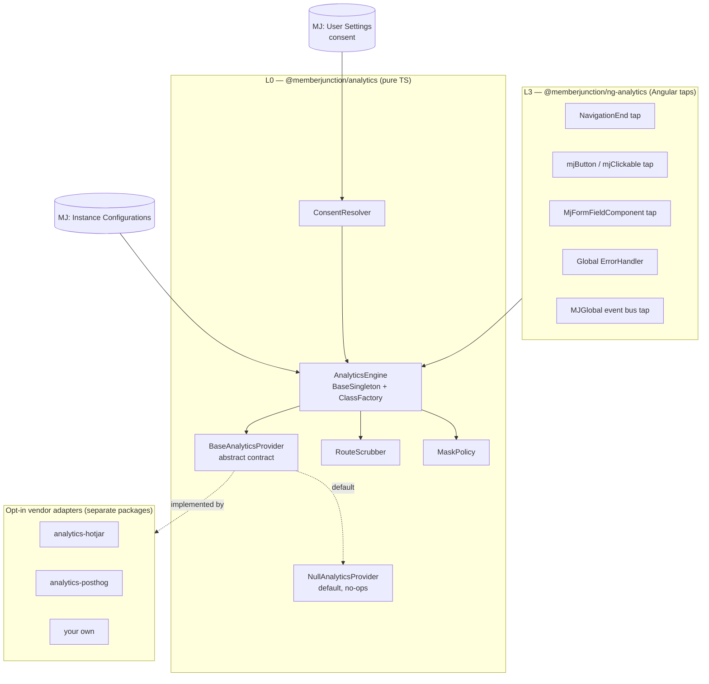

# Client Analytics Providers — Design Proposal

> **Status: PROPOSAL — not implemented.** This document is the design for review. No code in this
> PR. Decisions the team needs to make are collected in [Open questions](#open-questions-for-review).

How a MemberJunction **deployment** plugs a client-side product-analytics or session-tooling
vendor (Hotjar, PostHog, Microsoft Clarity, GA4, Matomo, or something bespoke) into MJ Explorer —
as a first-class, supported seam rather than a hand-edited `index.html`.

---

## TL;DR

- MJ ships the **seam**, never the vendor. Nothing is sent anywhere by default, and no vendor code
  is in the default bundle.
- Configuration is **per deployment**, via `MJ: Instance Configurations` — the customer's own
  Hotjar/PostHog account, in the customer's own estate. MemberJunction (the company) receives
  nothing. There is no cross-customer telemetry channel in this design and adding one is explicitly
  out of scope.
- The value MJ adds over dropping a `<script>` tag in `index.html` is **semantic context**. A raw
  vendor tag sees `div.k-grid > tbody > tr:nth-child(3) > button`. MJ knows that click was
  *"Save" on the Deals form, Financials section*. MJ can hand the vendor meaning; nothing else can.
- Two safety mechanisms are load-bearing and both **fail closed**: a **route scrubber** (record IDs
  and search terms never reach a vendor from MJ) and a **mask-by-default policy** for rendered data.
- Consent is required by default and mirrors the posture already established for realtime session
  capture: **off by default, explicit opt-in, fail-closed**.

---

## Scope

**In scope**

- A vendor-neutral provider contract and registry.
- Per-deployment configuration and per-user consent.
- Semantic taps at MJ's existing interaction choke points (routes, buttons, form fields, errors).
- Privacy controls: route scrubbing, data masking, pseudonymous identity, user exclusion.

**Explicitly NOT in scope**

- **No server-side event store.** A native `MJ: Track Events` table is a separate idea with a
  separate cost profile; this design deliberately does not require it and does not block it.
- **No telemetry to MemberJunction.** Ever, in this design. Each deployment owns its own vendor
  account and its own data.
- **No keystroke content capture.** In an AMS/CRM the keystrokes *are* the member PII. MJ implements
  field-level encryption, entity permissions and RLS; a keystroke capture routes around all of it.
  Timing and counts are acceptable signals; content is not, and no provider will be given a hook for it.
- **No always-on session replay** shipped as a default. Replay is a capture level a deployment must
  select deliberately (see [Capture levels](#capture-levels)).

---

## Why a seam, and not just a script tag

A deployment *can* already paste a Hotjar tag into `packages/MJExplorer/src/index.html`. Four things
go wrong when they do, and each is the reason for a corresponding piece of this design.

| What goes wrong | Why | Addressed by |
|---|---|---|
| **PII leaks through the URL.** `resource/search/:searchInput` puts the user's search text in the path — in an AMS that is member names. Vendors collect page URLs as a matter of course, before any recording setting is touched. | MJ's route shapes are ID- and text-bearing | [Route scrubbing](#route-scrubbing) |
| **Rendered member data is captured.** Vendors mask `<input>` values by default, *not* rendered text. MJ's read-mode forms, grids and record headers are all member data as text. | Vendor defaults assume a marketing site | [Masking policy](#masking-policy) |
| **Heatmaps and funnels fragment.** Routes are record-ID-keyed (`resource/record/:entityName/:recordId`), so every record open is a distinct URL and every page has one visit. | Vendors key analysis by URL | [Route scrubbing](#route-scrubbing) |
| **The data has no meaning.** DOM selectors don't survive a UI change and don't say what the user was doing. | Vendors can only see the DOM | [Semantic context](#semantic-context--the-part-only-mj-can-do) |

A hand-pasted tag also can't be turned off per user, can't be consent-gated, and gets lost on the
next `mj app install`.

---

## Architecture

Layered per [`UI_LAYERING_GUIDE.md`](UI_LAYERING_GUIDE.md): the decision logic is pure TypeScript
and testable without a browser; only the taps know about Angular.



**Package boundary.** The L0 package has no Angular dependency, so the contract, the scrubber, the
mask policy and the consent rules are unit-testable and reusable by a non-Angular MJ host (MobileApp,
a React surface). Vendor adapters are **separate opt-in packages** so the default Explorer bundle
carries only the abstraction — a few KB of no-ops — and no vendor SDK. See
[Open questions](#open-questions-for-review) for the alternative of folding L0 into `@memberjunction/global`.

---

## The provider contract

Small interface, real work hidden. A vendor adapter implements six methods and nothing else;
everything shared — consent, scrubbing, masking, config resolution — lives in the engine, so a
new vendor cannot accidentally opt out of a safety control by forgetting to implement it.

```typescript
export abstract class BaseAnalyticsProvider {
  /** Stable key matched against the `Analytics.Provider` instance-config value. */
  public abstract readonly ProviderKey: string;

  /** Load the vendor SDK and start it. Called ONLY after consent resolves to Granted. */
  public abstract Initialize(config: AnalyticsProviderConfig): Promise<void>;

  /** Stop capture and drop any vendor-held identity. Called on consent revocation and logout. */
  public abstract Shutdown(): Promise<void>;

  public abstract TrackPageView(view: AnalyticsPageView): void;
  public abstract TrackEvent(event: AnalyticsEvent): void;

  /** Pass null to de-identify (logout, consent revoked, Identify.Mode = None). */
  public abstract Identify(identity: AnalyticsIdentity | null): void;

  /** Capability probes — default false; the engine will not offer what a provider cannot do. */
  public get SupportsSessionReplay(): boolean { return false; }
  public get SupportsIdentify(): boolean { return true; }

  /** Vendor-specific DOM attribute that suppresses an element from capture. */
  public get MaskAttribute(): string | null { return null; }
}
```

Registration uses MJ's existing `@RegisterClass` + `ClassFactory`, so a deployment can ship its own
adapter without a fork:

```typescript
@RegisterClass(BaseAnalyticsProvider, 'Hotjar')
export class HotjarAnalyticsProvider extends BaseAnalyticsProvider { /* … */ }
```

### Payload types

```typescript
export interface AnalyticsPageView {
  /** Stable route template — the groupable key. e.g. 'resource/record/:entityName/:recordId' */
  RouteTemplate: string;
  /** Scrubbed path safe to send. e.g. '/resource/record/Deals/_id_' */
  ScrubbedPath: string;
  ResourceType?: 'record' | 'view' | 'dashboard' | 'query' | 'artifact' | 'search' | 'app';
  EntityName?: string;
  ApplicationName?: string;
  /** Names of well-known resources only — NOT user-authored view/dashboard names by default. */
  ResourceName?: string;
}

export interface AnalyticsEvent {
  /** Dot-namespaced, closed vocabulary. e.g. 'Form.Field.ValidationFailed' */
  Name: string;
  /** Semantic, non-PII properties only. Values are never included. */
  Properties?: Readonly<Record<string, string | number | boolean>>;
}

export interface AnalyticsIdentity {
  /** Opaque and stable. Under Pseudonymous mode this is an HMAC, never the raw UserID. */
  DistinctID: string;
  /** Non-identifying cohort traits only: role names, environment, MJ version. */
  Traits?: Readonly<Record<string, string | number | boolean>>;
}
```

**`Properties` deliberately excludes field values.** The type says `string | number | boolean`, but
the taps never populate it from record data — see [Masking policy](#masking-policy).

---

## Semantic context — the part only MJ can do

This is the whole argument for building a seam instead of documenting "paste your tag here." MJ is
metadata-driven, so at the moment of any interaction the app already knows the entity, the field, the
section, the view, the permission state. And because MJ funnels interaction through a small number of
shared components, **capturing that costs a handful of files, not a sweep of the codebase.**

| Tap | File | Reach | Emits |
|---|---|---|---|
| **Route** | `explorer-core/src/lib/shell/shell.component.ts:702`, `explorer-app/src/lib/explorer-app.component.ts:431` | all navigation | `TrackPageView` with scrubbed route |
| **Buttons** | `ui-components/src/lib/button/button.directive.ts` | **715 template usages** | `UI.Button.Clicked` `{label, variant, route}` |
| **Clickables** | `ui-components/src/lib/clickable/clickable.directive.ts` | retrofitted div/span controls | `UI.Clickable.Clicked` `{label, route}` |
| **Form fields** | `base-forms/src/lib/field/form-field.component.ts` | every field of every generated form | `Form.Field.{Focused,Changed,ValidationFailed}` `{EntityName, FieldName}` |
| **Errors** | *does not exist yet* — see below | every uncaught client error | `App.Error` `{message, route}` |
| **Session** | `MJGlobal.GetEventListener()` | `LoggedIn` / `LoggedOut` | `Identify` / `Shutdown` |

Both directives already compute a human-readable **accessible name** (`MJButtonDirective` warns in
dev mode about unlabeled icon buttons; `mjClickable` takes the name as its input value). That name is
the event label — a real string like `"Save"`, not a CSS path — and it comes for free.

> ### Independent finding: MJ has no global Angular `ErrorHandler`
>
> A repo-wide search for `ErrorHandler` across `packages/**/*.ts` returns **zero** non-test hits.
> An uncaught client-side error today goes to the browser console and nowhere else. No analytics
> vendor fixes this — Hotjar will not tell you your Angular threw.
>
> **Recommendation: land the `ErrorHandler` on its own, ahead of and independent of this design.**
> It is a few dozen lines, it is useful with no vendor configured at all (it can write to
> `MJ: Error Logs`), and it becomes the highest-value analytics tap for free once one is.

---

## Route scrubbing

**The single most important safety component**, because MJ's routes carry both identifiers and free
text. From `packages/Angular/Explorer/explorer-core/src/app-routing.module.ts`:

```
app/:appName/record/:param1/:param2       resource/record/:entityName/:recordId
app/:appName/:resourceType/:param1        resource/view/:viewId
app/:appName/:navItemName                 resource/dashboard/:dashboardId
resource/query/:queryId                   resource/artifact/:artifactId
resource/search/:searchInput          ← the user's search text, in the path
```

`RouteScrubber` matches the live URL against the route table and returns `{RouteTemplate,
ScrubbedPath}`. Rules:

1. **Identifier segments are replaced by a token**, not hashed — `:recordId` → `_id_`. A hash is
   still a stable per-record identifier and would let a vendor build a per-record profile.
2. **`:searchInput` is dropped entirely**, not tokenized. Search text has no analytic value that
   justifies its risk.
3. **Query strings are dropped** except an allow-list of known-safe keys.
4. **Unknown routes fail closed** — an unmatched URL yields `RouteTemplate: 'unknown'` and a path of
   `/unknown`, never the raw URL. New routes are opaque until someone adds them to the table.

### The honest limitation, stated up front

**A vendor script running in the page can read `location.href` itself.** The scrubber governs what
*MJ* hands a provider; it cannot stop a vendor SDK from reading the address bar. Three consequences,
in order of preference:

1. **Fix the route.** `resource/search/:searchInput` should not carry the term in the path at all —
   it belongs in a transient store or a fragment. This is a small, independently valuable change that
   also fixes the term appearing in browser history and server access logs. **Recommended as a
   separate PR, and as a prerequisite for enabling any vendor on a deployment that uses search.**
2. **Configure the vendor.** Every serious vendor supports URL suppression/rewriting. The per-vendor
   adapter should apply it in `Initialize()` from the same route table, so it is not left to a
   customer's console settings.
3. **Document it.** The deployment checklist must state that URL-derived PII is a shared
   responsibility until (1) lands.

Any review of this design should push hardest here. It is the failure mode most likely to ship
silently.

---

## Masking policy

Session-replay and heatmap vendors reconstruct the DOM. In MJ the DOM *is* member data.

**Default: mask everything that renders record data. Opt out per field, never opt in.**

The implementation insight that makes this affordable:

> **Masking belongs on the shared renderer, not in the generated templates.**
>
> `MjFormFieldComponent` renders every field of every generated form. `ExplorerEntityDataGridComponent`
> renders the grids. Putting the mask attribute on those two components covers essentially all
> rendered record data — with **zero changes to CodeGen templates**, which matters because generated
> forms are overwritten on every `mj codegen` run and any hand-added class would silently disappear.

Mechanics:

- The active provider declares its `MaskAttribute` (`data-hj-suppress`, `data-ph-mask`,
  `data-clarity-mask`, …). `MaskPolicy` in L0 maps provider → attribute, so the shared components
  bind one attribute whose *name* varies by vendor.
- An `mjAnalyticsMask` directive is available for hand-authored surfaces (dashboards, custom panels).
- A future `EntityField`-level opt-out (`AnalyticsSafe`) can un-mask non-sensitive fields such as
  `Status` or `Stage` where a heatmap is genuinely useful. **Out of scope for v1** — v1 masks all
  record data, which is the safe default and requires no schema change.
- **Structure is not masked.** Layout, section expansion, which controls exist and where — all of
  that survives masking, and it is what heatmaps actually need.

---

## Consent

Mirrors the posture already established for realtime session capture
([`REALTIME_SESSION_CAPTURE_GUIDE.md`](REALTIME_SESSION_CAPTURE_GUIDE.md)): **off by default,
resolved from most-specific to least, consent-gated, fail-closed.** That posture has already been
litigated in this repo; this design does not relitigate it.

State is `Unknown | Granted | Denied`, stored per user via `UserInfoEngine.SetSetting('Analytics.Consent', …)`.

| `Analytics.Consent.Mode` | Behavior |
|---|---|
| `Required` *(default)* | No provider initializes until the user explicitly grants. `Unknown` behaves as `Denied`. |
| `Implied` | Initializes on login without a prompt. For deployments where staff usage is covered by an employee handbook or works-council agreement. A deliberate, documented choice. |
| `Disabled` | No provider ever initializes, regardless of other config. The kill switch. |

Revocation calls `Shutdown()` and `Identify(null)` immediately — not at next page load.

`navigator.doNotTrack` and Global Privacy Control are honored as `Denied` under `Required`, and are
advisory under `Implied`.

---

## Configuration

All keys are `MJ: Instance Configurations` rows read through the existing `InstanceConfigEngine`
(cached, auto-refreshing, typed getters, admin-settable). No new config mechanism.

| FeatureKey | Type | Default | Notes |
|---|---|---|---|
| `Analytics.Enabled` | boolean | `false` | Master switch. Off means the engine short-circuits before reading anything else. |
| `Analytics.Provider` | string | *(empty)* | Matches a `ProviderKey`. Empty ⇒ `NullAnalyticsProvider`. |
| `Analytics.Config` | JSON | `{}` | Vendor-specific, e.g. `{"siteId":"1234567"}`. |
| `Analytics.Consent.Mode` | string | `Required` | See above. |
| `Analytics.Capture.Level` | string | `PageViews` | See below. |
| `Analytics.Identify.Mode` | string | `Pseudonymous` | `None` / `Pseudonymous` / `Full`. |
| `Analytics.Exclude.UserTypes` | JSON | `["Owner"]` | Keeps staff/admin usage out of product metrics. |

**Initialization is post-login, by construction.** `InstanceConfigEngine.Config()` requires an
authenticated data call and runs in `shell.component.ts:481`. That is a feature, not a limitation:
login-screen and anonymous traffic are never captured, and consent is evaluated before any vendor
script loads.

> ⚠️ **These rows are `metadata/` seeds, which means they do not reach a host until a release folds
> them into a `Metadata_Sync` migration.** Nothing in CI detects a pending metadata change with no
> migration behind it — see [`metadata/CLAUDE.md`](../metadata/CLAUDE.md). Ship the seed rows and
> flag them for the release engineer in the same PR.

### Capture levels

| Level | What the provider is allowed to do |
|---|---|
| `PageViews` *(default)* | Scrubbed route changes only. |
| `Interactions` | Adds button/clickable/field/error events. Still no DOM capture. |
| `Replay` | Permits session replay for providers that support it. Requires `Consent.Mode = Required`; the engine **refuses** `Replay` combined with `Implied` consent. |

---

## Identity

`Pseudonymous` (the default) sends `HMAC-SHA256(UserID, deployment-salt)`. The vendor gets a stable
distinct-ID that supports funnels and returning-user analysis, and cannot be reversed to a person.
`Full` (email/name) is available but must be chosen deliberately. `None` sends nothing.

Traits are cohort-level only — role names, environment name, MJ version — never email, name, or
employer.

---

## Loading the vendor SDK

- **Lazy and late.** The script tag is injected only after `Enabled && Provider && consent Granted`.
- **Non-blocking with a timeout.** A vendor outage or an ad-blocker must never delay or break app
  boot. Failure logs **once** and disables the provider for the session — never per event, and never
  silently (per the never-swallow-errors rule).
- **No `document.write`, no synchronous loads.**

### CSP — a gap worth closing alongside this

`packages/MJExplorer/src/staticwebapp.config.json` currently sets only `navigationFallback`;
**there is no Content-Security-Policy.** Meanwhile `index.html` already loads from
`fonts.googleapis.com`, `cdnjs.cloudflare.com` and `unpkg.com`. Adding a third-party analytics tag to
a page with no CSP widens an already-open door.

Recommended: ship a baseline CSP covering the existing CDN origins, and have the analytics engine
document the one additional `script-src`/`connect-src` origin each vendor adapter needs so a
deployment adds exactly one line. Sizing this is a task in its own right and should not gate the
analytics seam, but the two should land in the same release.

---

## Zero cost when unconfigured

A hard requirement, not an aspiration. With `Analytics.Enabled = false` (the default):

- No vendor SDK is in the bundle — adapters are separate packages, absent unless installed.
- `AnalyticsEngine.Track*` returns on a single boolean check before constructing any payload. Taps
  must not build event objects speculatively.
- No network request, no timer, no listener beyond the ones MJ already runs.
- The route scrubber never runs.

This is testable and should be an assertion in CI, not a promise in a doc.

---

## Testing

- `NullAnalyticsProvider` — the default, asserts the no-op path.
- `RecordingAnalyticsProvider` — a test double that captures emitted semantic events so taps can be
  asserted without a browser or a vendor.
- **`RouteScrubber` gets a table-driven test per route in the Explorer route table**, including a
  regression case asserting that a search term never survives scrubbing, and that an unknown route
  yields `unknown` rather than the raw URL.
- Consent-matrix tests: every `(Consent.Mode × consent state × Capture.Level)` combination, asserting
  fail-closed — in particular that `Replay + Implied` is refused.
- Vitest, per [`.claude/rules/testing.md`](../.claude/rules/testing.md).

---

## Phasing

| Phase | Contents | Notes |
|---|---|---|
| **0** | Global `ErrorHandler` → `MJ: Error Logs` | Independent value. No vendor needed. Land first. |
| **1** | L0 package: contract, engine, scrubber, mask policy, consent, `NullAnalyticsProvider` + tests | No vendor, no Angular. Fully testable. |
| **2** | `ng-analytics` taps: route + `mjButton` + `mjClickable`; `MjFormFieldComponent` mask attribute | `PageViews` + `Interactions` levels. |
| **3** | First vendor adapters: `analytics-posthog`, `analytics-hotjar` | Separate opt-in packages. |
| **4** | Search-route fix; baseline CSP | Can proceed in parallel; **(4) is a prerequisite for enabling any vendor on a search-using deployment.** |

---

## Open questions for review

1. **Package shape.** Two new packages (`analytics` L0 + `ng-analytics` L3) plus one per vendor — or
   fold L0 into `@memberjunction/global` to avoid new packages? *Recommendation: separate packages.*
   The L0 logic is genuinely framework-agnostic and non-Angular hosts (MobileApp) will want it, and
   keeping vendor SDKs out of the default bundle requires separate packages regardless.
2. **Do we maintain vendor adapters at all?** Shipping them is what makes this "first class," but each
   is a maintenance obligation against someone else's SDK. *Recommendation: ship exactly two —
   PostHog and Hotjar — and treat the contract as the supported surface.*
3. **PostHog over Hotjar as the documented default?** PostHog self-hosts, which keeps the data in the
   customer's estate and sidesteps the third-party-processor question entirely; it also covers events
   *and* replay in one tool. Hotjar is SaaS-only.
4. **Is `Replay` allowed in shipped configuration at all,** or should it require an explicit
   deployment-level override beyond the config key?
5. **Pseudonymous salt storage.** `MJ: Instance Configurations` is admin-readable. Is that acceptable
   for the HMAC salt, or does it belong in the credentials/encryption subsystem?
6. **Search-route fix** — separate PR, or a blocking prerequisite inside this one?
7. **`EntityField.AnalyticsSafe`** for per-field un-masking — worth a schema change later, or should
   the mask stay all-or-nothing?

---

## Appendix — what MJ already has

Verified against `next` while writing this. These are the seams this design builds on; none of them
needs to be created.

| Capability | Where |
|---|---|
| Per-deployment feature config, cached + auto-refreshing | `MJCoreEntities/src/engines/InstanceConfigEngine.ts` |
| Per-user settings with debounced flush | `MJCoreEntities/src/engines/UserInfoEngine.ts` (`GetSetting` / `SetSetting`) |
| Client event bus | `MJGlobal.RaiseEvent` / `GetEventListener` (`MJGlobal/src/Global.ts:81`) |
| Class registration / override | `@RegisterClass` + `ClassFactory` |
| Route change taps | `shell.component.ts:702`, `explorer-app.component.ts:431` |
| Single button choke point | `ui-components/src/lib/button/button.directive.ts` — 715 template usages |
| Single field renderer | `base-forms/src/lib/field/form-field.component.ts` |
| Consent-gated, fail-closed capture precedent | [`REALTIME_SESSION_CAPTURE_GUIDE.md`](REALTIME_SESSION_CAPTURE_GUIDE.md) |
| Existing audit sinks (server-side) | `MJ: Audit Logs`, `MJ: User Record Logs`, `MJ: Action Execution Logs`, `MJ: AI Agent Runs` |

**Gaps found while writing this**, each independently actionable:

1. No global Angular `ErrorHandler` anywhere in `packages/**` — uncaught client errors are lost.
2. No CSP in `packages/MJExplorer/src/staticwebapp.config.json`.
3. `resource/search/:searchInput` carries user-entered text in the URL path.
4. `RecentAccessService.logAccess()` (`Angular/Generic/shared/src/lib/recent-access.service.ts`)
   accepts a `resourceType` parameter that is never persisted, and does a `RunView` round-trip plus a
   full `BaseEntity.Save()` per record open.
5. `MJ: Audit Logs` is clustered on a random UUID PK with only FK indexes — no index on
   `__mj_CreatedAt`, so every time-ranged audit query scans.
