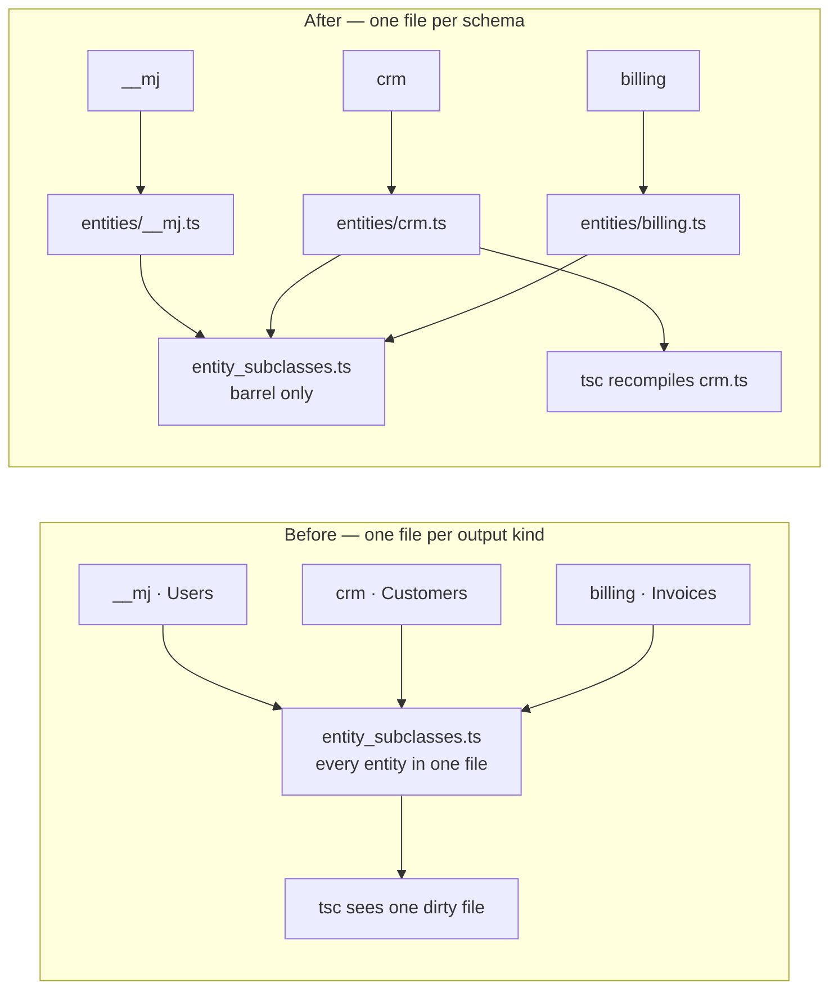
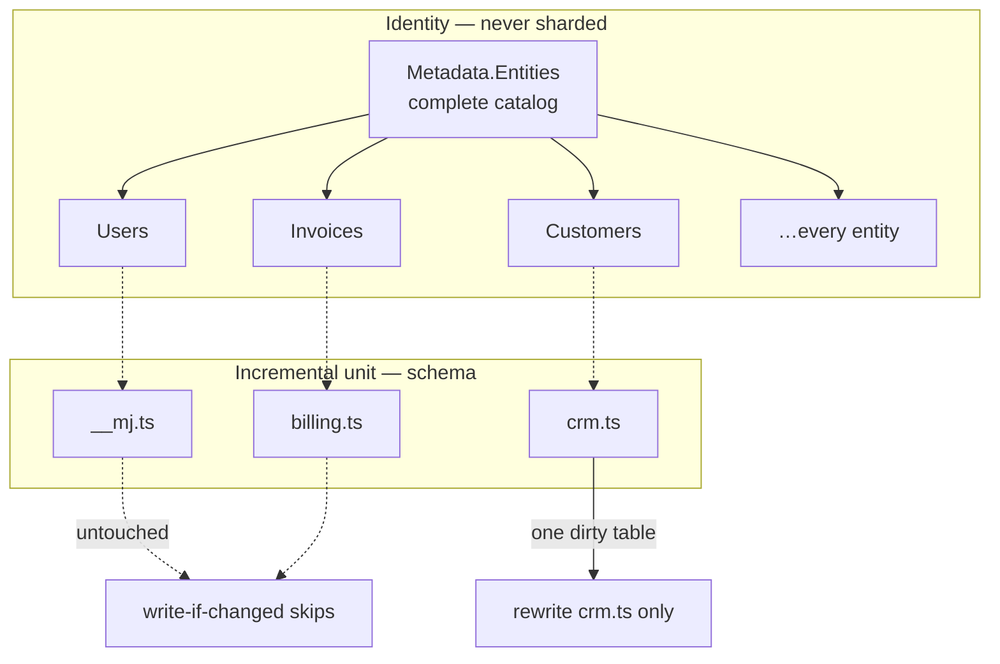
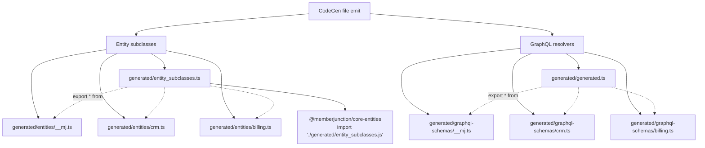
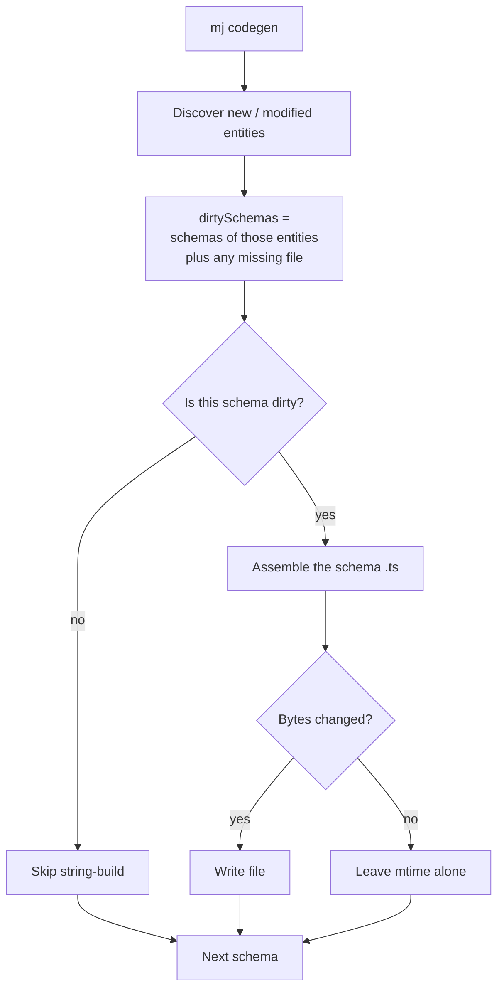
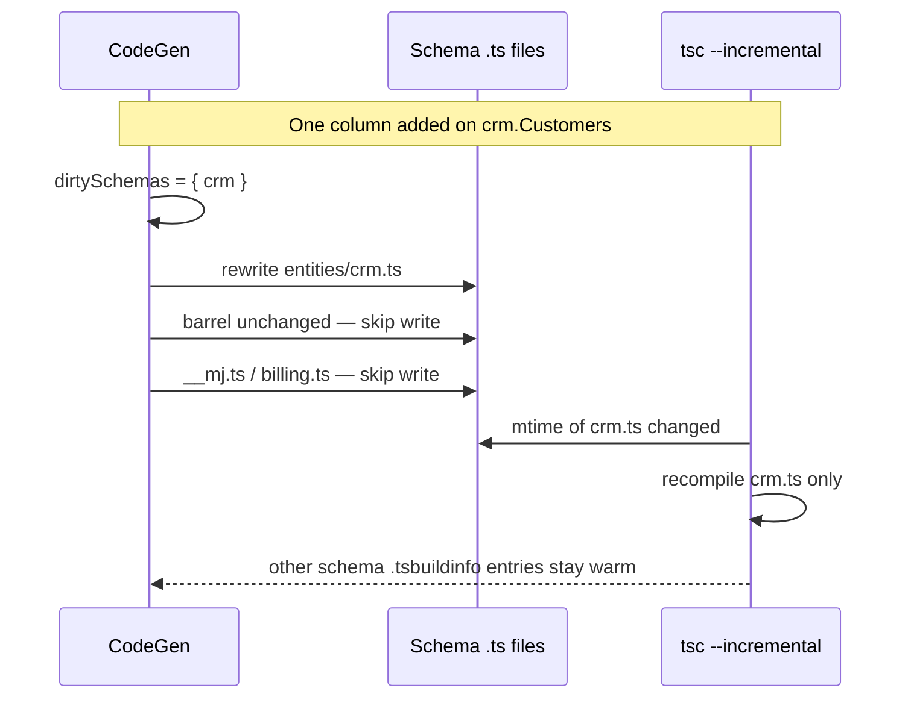
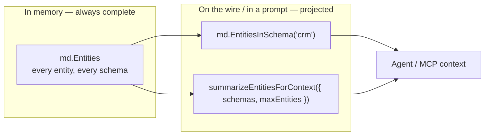
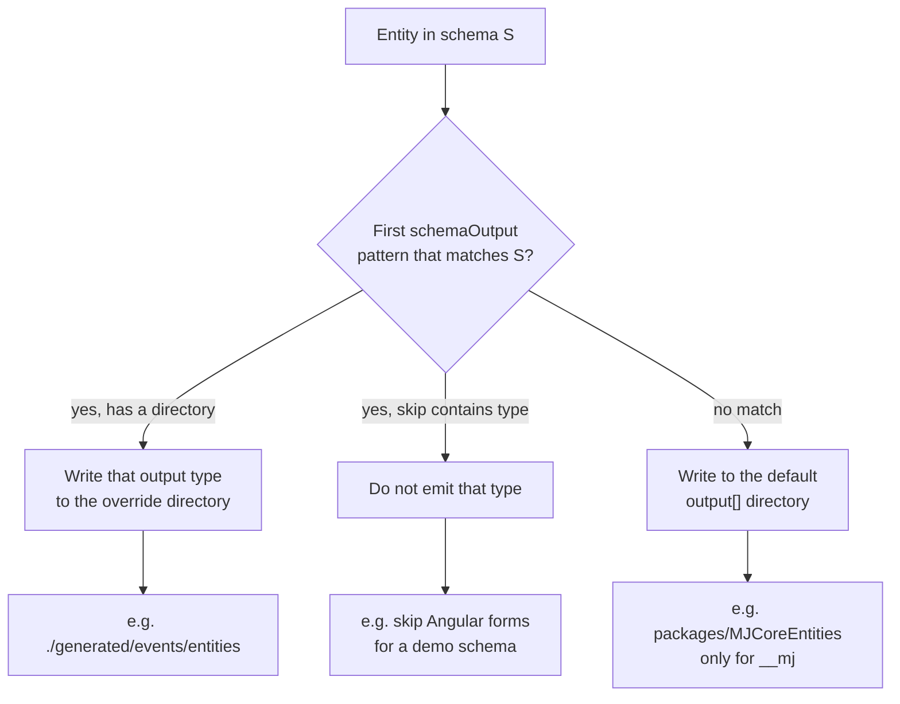
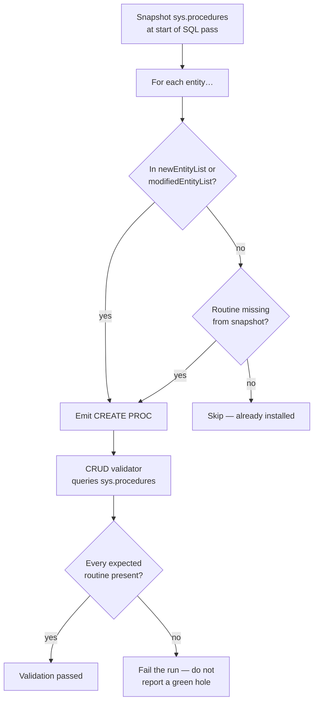

# Scaling CodeGen across many schemas

MemberJunction CodeGen turns database metadata into TypeScript entities, GraphQL resolvers, SQL objects, and related artifacts. This guide explains how that pipeline stays incremental when a database has **many schemas** — the MemberJunction platform catalog, your application schemas, and, often, both.

Read this before you configure CodeGen for a multi-schema database, before you add another generated output target, or before you assume a one-file-per-kind layout will still compile quickly as the catalog grows.

A droppable test bed that exercises the same layout lives at [`Demos/BigSchemaDemo`](../Demos/BigSchemaDemo/README.md). It is optional. You do not need it to use anything described here.

---

## Who this is for

Anyone who runs `mj codegen`:

- Teams whose database is **MJ Core plus one or more application schemas**
- Teams connecting MemberJunction to an **existing multi-schema database**
- Anyone whose generated TypeScript has become the slow part of a change, even if the database itself is not “large” by row count

MJ Core (`__mj`) is a full platform catalog — entities, fields, AI, permissions, conversations, and the rest of the product. Core is emitted the same way as every other schema. The techniques here exist so **core and application schemas can grow independently** without each change rewriting the other.

A database with a single application schema next to core still benefits: a change in `crm` should not force a rewrite of `__mj.ts`. A database with two or three dozen business schemas (on the order of 100–150 tables each) is the shape this work was measured against. A single schema with thousands of tables is less common and still supported; the incremental unit is still that schema.

---

## The problem CodeGen is solving

For a long time CodeGen wrote **one file per output kind**: one `entity_subclasses.ts`, one GraphQL `generated.ts`, and so on. That is simple and correct. The public import surface stays a single module.

The cost shows up as the catalog grows. One new column changes the generated bytes of a file that already contains every entity. TypeScript’s incremental compile keys off file mtimes, so rewriting that file — even with identical bytes — throws the cache away. The compile unit becomes “the entire catalog,” not “the schema you just changed.”

Production databases are already organized by schema. CodeGen now uses that same grain for anything that can be incremental.



A column added on `crm.Customers` used to dirty the whole monolith. It now dirties `entities/crm.ts`. The barrel and every other schema file stay untouched.

---

## The invariant

> **Entity is the identity. Schema is the incremental unit.**

Every entity still has a name, a class, a row in `MJ: Entities`, fields, and relationships. `Metadata.Entities` is the **complete** catalog. Nothing is sharded. There is no “CRM metadata provider” and no second catalog for application tables.

What becomes incremental is everything that can key off schema:

| Concern | Unit | Why |
|---|---|---|
| File emit | one `.ts` file per schema, plus a barrel | A change in `crm` must not rewrite `billing.ts` or `__mj.ts` |
| Dirty regen | schemas that contain a new or modified entity | One dirty table → one dirty schema → one file |
| Parallelism | schemas are independent string-builds | Many schemas, bounded concurrency, no shared mutable file |
| Output routing | schema → directory or npm package | Application and demo schemas must not land in `@memberjunction/core-entities` |
| Agent / MCP context | schema-filtered *projection* of the catalog | Serializing thousands of table definitions into a prompt is the expensive part, not holding the catalog |
| Skip-entity | `schema.table` (or a LIKE pattern such as `%.%History`) | Leave a table out of metadata entirely when it should not become an entity |

Two layouts to avoid:

- **One file per entity** — thousands of tiny files, an unusable barrel, and GraphQL types that only resolve when they share a file.
- **One monolith per output kind** — one byte change dirties a file large enough that incremental `tsc` cannot help.

Schema is the unit that matches how the database is already laid out.



The catalog is still one array. The files are not.

---

## What changed

### 1. Per-schema emit

`EntitySubClassGeneratorBase.generateAllEntitySubClasses` and `GraphQLServerGeneratorBase.generateGraphQLServerCode` write one file per schema and a barrel that re-exports them:

```
generated/
  entity_subclasses.ts          # barrel
  entities/
    __mj.ts
    crm.ts
    billing.ts
    …

generated/
  generated.ts                  # GraphQL barrel
  graphql-schemas/
    __mj.ts
    crm.ts
    billing.ts
    …
```

Public import paths do not change. `@memberjunction/core-entities` still does `export * from './generated/entity_subclasses.js'`. `@memberjunction/server` still does `export * from './generated/generated.js'`. The barrel is the stable surface; the per-schema files are the incremental ones.

**Import path for core GraphQL.** Per-schema GraphQL files live one directory deeper (`generated/graphql-schemas/__mj.ts`) than the former single file (`generated/generated.ts`). The core file’s `mj_core_schema` import is therefore `../../config.js`, not `../config.js`. A wrong relative path compiles the barrel and then fails `tsc` in `@memberjunction/server` with `Cannot find module '../config.js'`.

**Cross-schema GraphQL child arrays.** A reverse-relationship field uses a bare ObjectType name, which only compiles when that class is declared in the same file (`GeneratedTypeAvailability`). An invoice in `billing` that points at a customer in `crm` still has the foreign-key field. It does not get a `Customers: Customer_[]` resolver in the billing file. Use `RunView` (or a query) for that set.



Public import paths do not change. Callers never name a per-schema file.

Legacy single-file emit remains available: `fileEmit.perSchema: false`.

### 2. Write only when bytes change

`writeFileIfChanged` compares the would-be file to what is on disk and skips the write when they are identical. SQL generation already did this; entity and GraphQL emit now share it.

That is what makes incremental `tsc` (item 6) actually work. TypeScript’s `.tsbuildinfo` keys off file mtimes. Rewriting a large file with the same bytes still counts as dirty. Not writing it is the optimization.

A CodeGen run against an unchanged database should produce **zero mtime changes** in generated TypeScript.

### 3. Dirty-schema scoped regen

On a full run (`mj codegen`, database + files), only schemas that contain an entity in `newEntityList ∪ modifiedEntityList` are rebuilt — plus any schema whose file is missing, so a fresh clone is complete.

`--skipdb` (files only, from current metadata) rebuilds every schema and still uses write-if-changed. Use that when metadata is already right and you want artifacts refreshed.

Disable with `fileEmit.dirtySchemaOnly: false`.

This is scoped regen at the **schema** grain. Entity-level regen of views and stored procedures already existed (`newEntityList` / `modifiedEntityList` in SQL generation). File emit was the piece that was still all-or-nothing.



`--skipdb` still walks every schema, but write-if-changed keeps a no-op second pass at **zero TypeScript writes**.

### 4. Schema-qualified `excludeTables` strings

`excludeTables` still accepts `{ schema, table }` objects. It also accepts strings, which is the form most operators want for “do not turn this table into an entity”:

```js
excludeTables: [
  { schema: '%', table: 'sys%' },
  { schema: '%', table: 'flyway_schema_history' },
  'audit.EntityRecordVersions',   // one specific table
  '%.%History',                   // family glob, any schema
  '%Audit%',                      // table-only → schema '%'
]
```

The string is parsed by `parseExcludeTableEntry` (the last `.` splits schema from table; no dot means any schema) and fed to the same LIKE/equals predicate `createExcludeTablesAndSchemasFilter` already emits. Excluded tables never become MJ entities, so they never get audit columns, CRUD routines, or TypeScript.

If a table should not be in the product, skip it. Do not generate an entity and then try to make the generated path cheaper.

### 5. Schema-parallel file generation

Independent schema files are assembled with a bounded `mapLimit` (default 8). This is CPU-bound string building — not `worker_threads`, and not more SQL connections.

PostgreSQL SQL generation stays serial. Parallel phased DDL deadlocks the catalog; that constraint is unchanged. On SQL Server, per-entity SQL width is `fileEmit.sqlEntityBatchSize` (default 8).

Tune with `fileEmit.concurrency` and `fileEmit.parallel`.

### 6. Incremental `tsc`

`@memberjunction/core-entities` and `@memberjunction/server` set `"incremental": true` with `tsBuildInfoFile` under `dist/` (already gitignored via `*.tsbuildinfo`). Combined with items 1–3, a one-schema change recompiles that schema’s `.ts` and the barrel, not every other schema file.

The first build after a clean `dist/` costs the same as before. Every build after that is proportional to what actually changed.



### 7. Runtime projections — the catalog stays complete

`GetAllMetadata` / `md.Entities` is **not** sharded. A catalog of a few thousand entities is a few thousand rows in memory, and that is the intended model. What is expensive in a prompt or an MCP tool is *serializing* it.

Use the projection helpers in `@memberjunction/core`:

```ts
import { summarizeEntitiesForContext, entitiesInSchemas } from '@memberjunction/core';

const crmOnly = md.EntitiesInSchema('crm');
const summary = summarizeEntitiesForContext(md.Entities, {
  schemas: ['crm', 'billing'],
  maxEntities: 80,
  includeFields: false,
});
```

`Metadata.SchemaNames()` and `Metadata.EntitiesInSchema(name)` are the same idea on the helper class.

This is not lazy-loading `EntityField` rows per schema on `GetAllMetadata`. That would be a real follow-up — the `EntityFields` dataset is the payload that grows fastest — and it is deliberately not the default. Too many callers assume every `EntityInfo` already has `Fields`. When that lands it will be an opt-in on the provider, not a silent behavior change.



Holding the catalog is cheap. Serializing it is not. Project; do not shard.

### 8. Package topology (`entityPackageName` + `schemaOutput`)

Two maps, two jobs:

- **`entityPackageName`** — already existed. A string (legacy: every non-core schema is `mj_generatedentities`) or a `Record<schema, npmPackage>` so an installed Open App is imported from its own package and **not** re-emitted by the host.
- **`schemaOutput`** — routes (or skips) generated *files* for matching schemas to a directory that is not the host default. First match wins. `%` wildcards are allowed; `_` is literal.

```js
schemaOutput: [
  {
    schema: 'events_%',
    EntitySubClasses: './generated/events/entities',
    GraphQLServer: './generated/events/graphql',
    skip: ['Angular'],
  },
]
```

Use this when a schema should be generated but must not land in `@memberjunction/core-entities` (or in Explorer forms). Together with `includeSchemas` (positive scope, already resolved into `excludeSchemas`) you can run CodeGen against one application after the platform bootstrap, or against one Open App in a multi-app database.



`entityPackageName` answers a different question: *which npm package does generated TypeScript import this entity from?* `schemaOutput` answers *where does the file go?*

---

## Config reference

```js
// mj.config.cjs
module.exports = {
  includeSchemas: ['__mj', 'crm'], // optional positive scope
  excludeSchemas: ['sys', 'staging'],
  excludeTables: [
    { schema: '%', table: 'sys%' },
    'audit.EntityRecordVersions',
    '%.%History',
  ],
  fileEmit: {
    perSchema: true,
    writeIfChanged: true,
    parallel: true,
    concurrency: 8,
    dirtySchemaOnly: true,
    sqlEntityBatchSize: 8,
  },
  schemaOutput: [
    {
      schema: 'events_%',
      EntitySubClasses: './generated/events/entities',
      skip: ['Angular'],
    },
  ],
  entityPackageName: {
    // events: '@your-org/events-entities',
  },
};
```

All `fileEmit` fields default as shown. Omitting the block is the recommended setup for new projects.

---

## What a run looks like

```
First run against a database CodeGen has not seen
  discover tables → create Entity rows → emit every schema file
  incremental tsc is a full compile (no .tsbuildinfo yet)

Second run, no schema change
  newEntityList = [] , modifiedEntityList = []
  dirty schemas = ∅ , every file exists
  string-build skipped, disk writes skipped, tsc is a cache hit

One column added on crm.OrderLine
  modifiedEntityList = ['Order Lines']   // example entity name
  dirty schemas = { crm }
  only entities/crm.ts is rewritten
  barrel unchanged (write-if-changed)
  tsc recompiles crm.ts
```

After the first discovery, time is proportional to **dirty schemas**, not to the total entity count.

The first discovery of a large existing database is still a full pass: every table has to become metadata once. This guide does not claim that pass is instant. It claims the *next* pass is incremental.

```mermaid
flowchart TB
  subgraph pass1["First discovery"]
    D1["Read every table"] --> M1["Create Entity rows"]
    M1 --> F1["Emit every schema file"]
    F1 --> T1["Full tsc"]
  end

  subgraph pass2["Later run — one dirty table"]
    D2["new / modified lists"] --> S2["One dirty schema"]
    S2 --> F2["Rewrite that schema .ts"]
    F2 --> T2["Incremental tsc"]
  end

  subgraph noop["Later run — no DDL change"]
    D3["empty dirty set"] --> S3["Skip every schema"]
    S3 --> F3["filesWritten = 0"]
  end
```



### Missing SQL objects on an existing entity

If a schema is dropped and recreated (or a prior run failed after deleting a procedure), the `MJ: Entities` row can remain while the stored procedure is gone. That entity is not “new” or “modified,” so incremental SQL would skip it.

CodeGen snapshots existing routines at the start of the SQL pass and force-emits `CREATE PROC` (SQL Server) for anything missing. The SQL Server CRUD validator implements `getRoutineNamesBySchemaSQL` against `sys.procedures` so a green validation result means the routines were actually found.



---

## What this does not do yet

- **Checkpoint / `--resume` of a killed CodeGen run.** The run-state JSON under `~/.mj/codegen-state/` is telemetry, not a cursor. If skip-entity plus dirty-schema keep full runs short enough, resume may never need its own semantics.
- **`worker_threads` for the string-build.** `mapLimit` on the main thread is the current implementation. Profile before adding worker serialization of `EntityInfo`.
- **Default-on lazy `EntityField` hydration.** Item 7 is the projection API. Splitting that dataset is a follow-up.
- **PostgreSQL SQL generation in parallel.** Still serial, on purpose.

---

## Measuring a run

Pass `--report` (or rely on the default reporter). Each run writes `~/.mj/codegen-state/run-*.json` with phase timings (`generateEntitySubclasses`, `generateGraphQL`, `manageSQLScriptsAndExecution`) and emit counters (`filesWritten`, `filesSkipped`, `schemasEmitted`, `schemasSkipped`).

A second run with no DDL change should show the file-emit phases collapsing: **schemas emitted = 0**, TypeScript **files written = 0**. SQL generation may still do a small amount of incremental work if an entity is marked modified; that is separate from the TypeScript no-op.

For a first discovery of thousands of new entities, set `advancedGeneration.enableAdvancedGeneration: false` for that run if you are measuring CodeGen itself. Advanced generation is per new entity and is not what the emit path is optimizing.

To exercise the multi-schema layout without using a production database, see [`Demos/BigSchemaDemo`](../Demos/BigSchemaDemo/README.md). Point it at a **private** database name. It is a test bed, not a product sample.

---

## AFTER commands and the CodeGen process exit

CodeGen can run shell commands after file generation (`commands` in `mj.config.cjs`, typically package builds). Success is the **process exit code**. Compilers and package managers often print the word `error` to stderr on a successful build; that must not fail the run. A real non-zero exit keeps the captured output so the diagnostic is visible.

Use the package manager your repository actually uses (`pnpm`, `npm`, or `yarn`). The commands fail for the usual reasons a local build fails — missing `dist/` of a workspace dependency, an unresolved import — not because CodeGen invented a new failure mode.

---

## Related

- [BigSchemaDemo](../Demos/BigSchemaDemo/README.md) — optional multi-schema test bed
- [Migration → CodeGen workflow](MIGRATION_CODEGEN_WORKFLOW_GUIDE.md) — the migrate → codegen → consolidate cycle for any schema change
- [CodeGenLib README](../packages/CodeGenLib/README.md) — the generator itself
- [Scoped entity regeneration](../plans/codegen/scoped-entity-regeneration-plan.md) — entity-grain regen of views and procedures, which this complements
