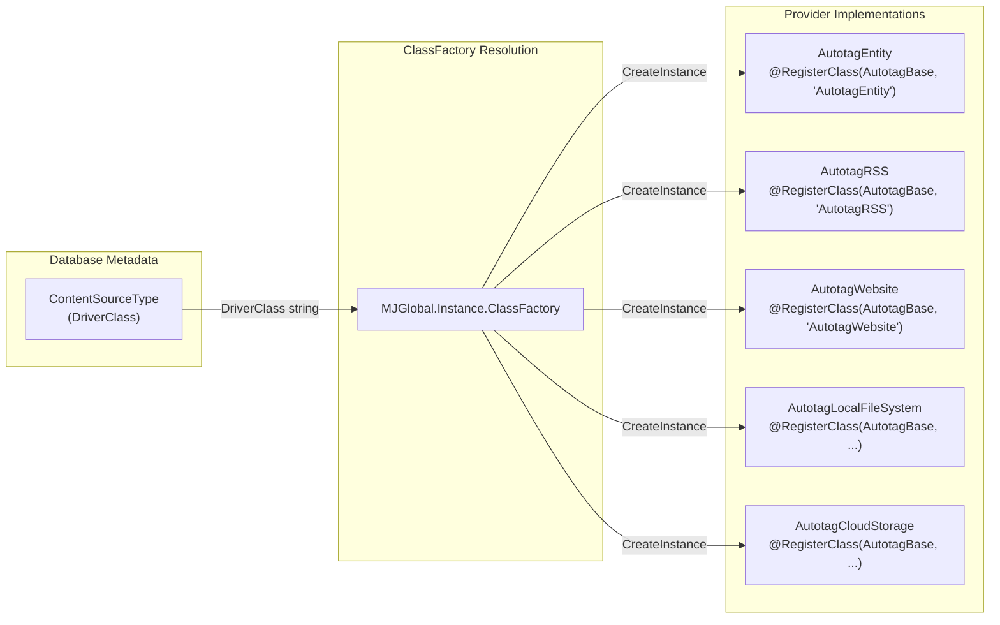
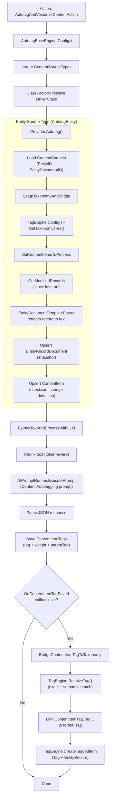
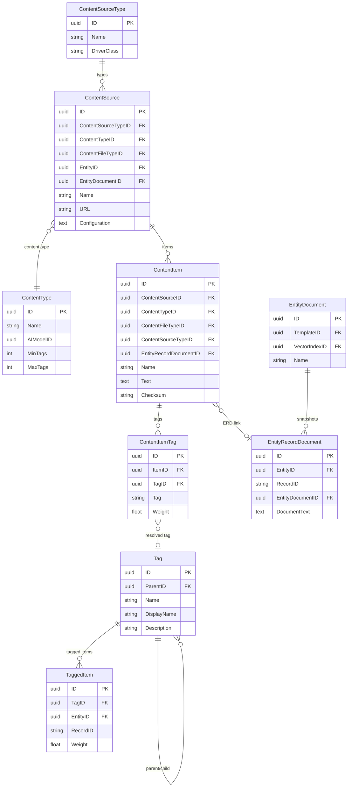

# Content Autotagging Guide

## Overview

The Knowledge Hub content autotagging system is a pluggable, metadata-driven pipeline that automatically analyzes textual content, extracts keywords with relevance weights, and bridges those keywords into MemberJunction's formal Tag taxonomy. It supports multiple content source types (entity records, RSS feeds, websites, local files, cloud storage) through a provider architecture backed by the MJ ClassFactory.

This guide covers architecture, data flow, the tag taxonomy bridge, prompt structure, and configuration.

---

## Architecture

### Plugin Architecture

Content source types are resolved at runtime using the ClassFactory provider pattern. Each `ContentSourceType` record in the database carries a `DriverClass` string. The action iterates all source types and instantiates the matching provider via `MJGlobal.Instance.ClassFactory.CreateInstance<AutotagBase>(AutotagBase, driverClass)`.



Each provider extends the abstract `AutotagBase` class and implements two methods:

- `SetContentItemsToProcess(contentSources)` -- discovers and prepares content items
- `Autotag(contextUser, onProgress?)` -- orchestrates the full pipeline for its source type

### End-to-End Data Flow



---

## Schema ER Diagram



---

## Plugin System

### Registering a New Provider

To add a new content source type:

1. Create a database record in `ContentSourceType` with a unique `DriverClass` value (e.g., `'AutotagSlack'`).
2. Create a TypeScript class extending `AutotagBase` with the matching `@RegisterClass` decorator:

```typescript
import { RegisterClass } from '@memberjunction/global';
import { AutotagBase } from '@memberjunction/content-autotagging';

@RegisterClass(AutotagBase, 'AutotagSlack')
export class AutotagSlack extends AutotagBase {
    public async Autotag(contextUser: UserInfo, onProgress?: AutotagProgressCallback): Promise<void> {
        // Implementation
    }

    public async SetContentItemsToProcess(contentSources: MJContentSourceEntity[]): Promise<MJContentItemEntity[]> {
        // Implementation
    }
}
```

3. Ensure the module is imported so the `@RegisterClass` decorator executes before the action runs.

The action (`AutotagAndVectorizeContentAction`) automatically discovers and invokes all registered providers by iterating `ContentSourceType` records and resolving each `DriverClass` through the ClassFactory.

---

## Entity Records Source Type

The `AutotagEntity` provider (registered as `@RegisterClass(AutotagBase, 'AutotagEntity')`) is the primary provider for tagging MJ entity records. Its pipeline:

1. **Load ContentSources** -- queries all `ContentSource` records with `ContentSourceTypeID` matching the "Entity" source type. Each source references an `EntityID` and an `EntityDocumentID`.

2. **Setup Taxonomy and Bridge** -- initializes the `TagEngine`, injects the tag taxonomy tree into the prompt context (if `ShareTaxonomyWithLLM` is enabled), and registers the `OnContentItemTagSaved` callback on the engine.

3. **Get Modified Records** -- queries entity records where `__mj_UpdatedAt` is later than the last `ContentProcessRun` end time for this source.

4. **Render Template** -- uses `EntityDocumentTemplateParser` to render each record through the EntityDocument's linked Template, producing a text snapshot.

5. **Upsert EntityRecordDocument** -- creates or updates an `EntityRecordDocument` (ERD) snapshot containing the rendered text.

6. **Upsert ContentItem** -- creates or updates a `ContentItem` linked to the ERD. Uses SHA-based checksum comparison to skip unchanged content.

7. **LLM Processing** -- the `AutotagBaseEngine.ExtractTextAndProcessWithLLM()` method chunks the text, runs the "Content Autotagging" prompt via `AIPromptRunner`, and saves results (title, description, attributes, tags).

---

## Tag Taxonomy Bridge

When a `ContentItemTag` is saved, the engine invokes the `OnContentItemTagSaved` callback (if set). For the Entity source type, this callback calls `BridgeContentItemTagToTaxonomy`, which:

1. Looks up the `ContentItem` to find its `ContentSourceID` and `EntityRecordDocumentID`.
2. Reads the `IContentSourceConfiguration` for the source to determine mode, root, and threshold.
3. If the LLM suggested a `parentTag` and the mode allows creation, creates the parent tag via `TagEngine.CreateTag()`.
4. Calls `TagEngine.ResolveTag()` with the free-text tag string.
5. If resolved, links `ContentItemTag.TagID` to the formal `Tag` record.
6. Creates a `TaggedItem` linking the formal `Tag` to the source entity record (via the ERD's `EntityID` and `RecordID`).

### Three Taxonomy Modes

| Mode | Behavior | Use Case |
|------|----------|----------|
| `constrained` | Only matches existing tags in the taxonomy. Returns `null` if no match meets the threshold. No new tags are created. | Strict corporate taxonomies where tag creation requires manual approval. |
| `auto-grow` | Attempts to match existing tags first. If no match, creates a new tag as a child of the configured `TagRootID`. | Recommended default. Lets the taxonomy expand organically while staying organized under a known root. |
| `free-flow` | Attempts to match existing tags first. If no match, creates a new root-level tag (no parent). | Exploratory use cases where any concept can become a tag. |

### ResolveTag Resolution Strategy

`TagEngine.ResolveTag()` follows a three-step strategy:

1. **Exact name match** (fast path, no embedding needed) -- case-insensitive string comparison.
2. **Semantic similarity search** -- embeds the tag text and finds the nearest neighbor in the in-memory vector service, constrained by threshold and optional subtree filter.
3. **Mode-based fallback** -- if no match, behavior depends on the mode (return `null`, create under root, or create as root-level).

---

## Prompt Structure

The autotagging prompt is stored as the "Content Autotagging" AI Prompt record and uses a Nunjucks template at `metadata/prompts/templates/knowledge-hub/content-autotagging.template.md`.

### Template Variables

| Variable | Source | Description |
|----------|--------|-------------|
| `contentType` | ContentType.Name | The expected content type (e.g., "Article", "Documentation") |
| `contentSourceType` | ContentSourceType.Name | The source type name (e.g., "Entity", "RSS Feed") |
| `minTags` | ContentType.MinTags | Minimum number of tags to extract |
| `maxTags` | ContentType.MaxTags | Maximum number of tags to extract |
| `additionalAttributePrompts` | ContentTypeAttribute definitions | Extra extraction instructions from content type attributes |
| `existingTaxonomy` | TagEngine.GetTaxonomyTree() | JSON tree of existing tags (when `ShareTaxonomyWithLLM` is enabled) |
| `previousResults` | Prior chunk results | Accumulated results from previous chunks for context continuity |
| `contentText` | The actual text chunk | The content to analyze |

### Prefix Caching Optimization

The prompt template is structured to maximize LLM prefix caching:

1. **Static instructions** (system role, response format, tag guidelines) -- identical across all invocations, cached by the LLM provider.
2. **Taxonomy section** (conditional) -- changes only when tags are added/removed, stable within a run.
3. **Dynamic content** (previousResults, contentText) -- changes per item/chunk, placed last.

This ordering ensures the static prefix is cached and reused across all content items in a batch.

### Weight Tiers

The prompt instructs the LLM to assign relevance weights:

| Weight Range | Label | Description |
|-------------|-------|-------------|
| 1.0 | Central topic | The content is primarily about this concept |
| 0.7 -- 0.9 | Major theme | Strongly discussed throughout the content |
| 0.4 -- 0.6 | Moderate relevance | Mentioned meaningfully but not a primary focus |
| 0.1 -- 0.3 | Tangential | Briefly touched on or loosely related |

### Response Format

The LLM returns JSON with:

```json
{
    "title": "extracted or generated title",
    "description": "short summary",
    "keywords": [
        { "tag": "keyword", "weight": 0.95, "parentTag": null },
        { "tag": "child concept", "weight": 0.7, "parentTag": "existing parent tag name" }
    ],
    "isValidContent": true
}
```

The `parentTag` field enables the LLM to suggest hierarchical relationships, which the bridge callback uses when creating new tags in `auto-grow` mode.

---

## Configuration

### IContentSourceConfiguration

Each `ContentSource` record has an optional `Configuration` JSON column (typed as `JSONType`). For the Entity source type, this is parsed as `IContentSourceConfiguration`:

| Property | Type | Default | Description |
|----------|------|---------|-------------|
| `TagTaxonomyMode` | `'constrained' \| 'auto-grow' \| 'free-flow'` | `'auto-grow'` | Controls how unmatched tags are handled. See Three Taxonomy Modes above. |
| `TagRootID` | `string \| null` | `null` | The root Tag ID for taxonomy scoping. In `auto-grow` mode, new tags are created as children of this root. Also constrains semantic search to this subtree. |
| `TagMatchThreshold` | `number` | `0.9` | Minimum cosine similarity score (0--1) for semantic tag matching. Higher values require closer matches. |
| `ShareTaxonomyWithLLM` | `boolean` | `true` | Whether to inject the existing tag taxonomy into the LLM prompt. Helps the LLM prefer existing tags. |
| `EnableVectorization` | `boolean` | `false` | Whether to embed tagged content items into a vector index after tagging. |
| `MaxItemsPerRun` | `number` | unlimited | Caps content items handed to the LLM per run. Items skipped by change-detection don't count. Pause is graceful; next run picks up where this one stopped (the change-detection short-circuit skips already-tagged pages). |
| `MaxNewTagsPerRun` | `number` | unlimited | Caps auto-created tags per run. |
| `MaxNewTagsPerItem` | `number` | unlimited | Per-item cap; extras route to the `MJ:Tag Suggestions` queue instead of being created. |
| `MaxTokensPerRun` | `number` | unlimited | Cumulative LLM tokens (prompt + completion) before pause. |
| `MaxCostPerRun` | `number` | unlimited | Cumulative USD before pause. |
| `Website` | `IContentSourceWebsiteConfiguration` | — | Typed sub-object for Website-source crawler settings — see below. |

Run-budget priority (when multiple caps could trip the same batch): **items → tags → tokens → cost**. Items ranks first because it's the most user-intuitive cap and not tied to a specific model's pricing.

### IContentSourceWebsiteConfiguration

Sub-object on `Configuration.Website` for sources where `ContentSourceType = "Website"`. AutotagWebsite reads this first, then overlays any matching `ContentSourceParam` rows as a per-instance override (legacy storage / sharper-override path).

| Property | Type | Default | Description |
|----------|------|---------|-------------|
| `MaxDepth` | `number` | `2` | Recursion ceiling for in-domain links. `0` = just the start URL. |
| `CrawlSitesInLowerLevelDomain` | `boolean` | `true` | Recursive depth-aware crawler. Turn off for single-page-only behavior. |
| `CrawlOtherSitesInTopLevelDomain` | `boolean` | `false` | Single-pass sibling-path discovery on the seed page. |
| `URLPattern` | `string` (regex) | match-all | Only URLs matching the regex are added to the visited set. |
| `RootURL` | `string` | derived from seed | URL prefix for the in-domain check. |

Example configuration JSON on a Website ContentSource record:

```json
{
    "TagTaxonomyMode": "auto-grow",
    "MaxItemsPerRun": 100,
    "MaxCostPerRun": 5.00,
    "Website": {
        "MaxDepth": 3,
        "URLPattern": "^https://example\\.com/blog/.*"
    }
}
```

### UI: Editing Configuration via BaseFormPanel slots

These knobs are surfaced in the MJ Explorer content-source edit form via two
dynamically-injected panels in `@memberjunction/ng-core-entity-forms`:

- **`TagPipelineConfigurationPanel`** — taxonomy mode, scope, thresholds, share-with-LLM toggle, vectorization toggle, and the five run-budget caps. Registered against `(MJ: Content Sources, after-fields)` with `sortKey: 100`.
- **`WebsiteCrawlerSettingsPanel`** — the five `IContentSourceWebsiteConfiguration` fields. Registered against `(MJ: Content Sources, after-fields)` with `sortKey: 80`. Gates its own template on `IsWebsiteSourceType` so it renders nothing for non-Website sources.

Both panels self-register via `@RegisterClassEx(BaseFormPanel, { metadata: {...} })` and mount automatically when a content source is opened in the entity form — no per-form template edits, no custom-form override. The Knowledge Hub dashboard's quick-edit slide-in surfaces a minimal subset (MaxItemsPerRun + MaxDepth + the two crawl toggles) with an "Open advanced settings →" link that routes to the full entity form for the rest.

See [`packages/Angular/Generic/base-forms/PANELS.md`](../packages/Angular/Generic/base-forms/PANELS.md) for the full BaseFormPanel authoring guide and slot-system architecture.

### ContentType Settings

Each `ContentType` record controls LLM behavior:

- **AIModelID** -- optional override for the AI model used for tagging. If set, passed as a runtime model override to `AIPromptRunner`. If not set, the prompt's default model is used.
- **MinTags / MaxTags** -- the range of tags the LLM should extract per content item.

### Running the Pipeline

The pipeline is triggered via the `AutotagAndVectorizeContentAction` action with two parameters:

| Parameter | Type | Description |
|-----------|------|-------------|
| `Autotag` | Bit (0/1) | Set to 1 to run the autotagging pipeline across all content source types. |
| `Vectorize` | Bit (0/1) | Set to 1 to embed all content items into their configured vector indexes. |

Both can run in parallel when both are set to 1.

---

## Key File Paths

| File | Purpose |
|------|---------|
| `packages/Actions/ContentAutotag/src/generic/content-autotag-and-vectorize.action.ts` | Entry-point action that iterates source types and invokes providers |
| `packages/ContentAutotagging/src/Core/generic/AutotagBase.ts` | Abstract base class for all autotag providers |
| `packages/ContentAutotagging/src/Engine/generic/AutotagBaseEngine.ts` | Core engine: metadata caching, LLM prompting, chunking, tag saving |
| `packages/ContentAutotagging/src/Entity/generic/AutotagEntity.ts` | Entity source type provider with taxonomy bridge |
| `packages/AI/Knowledge/TagEngineBase/src/TagEngineBase.ts` | Client+server shared tag engine (hierarchy, CRUD) |
| `packages/AI/Knowledge/TagEngine/src/TagEngine.ts` | Server-only tag engine with semantic embeddings |
| `metadata/prompts/templates/knowledge-hub/content-autotagging.template.md` | Nunjucks prompt template for LLM tagging |
