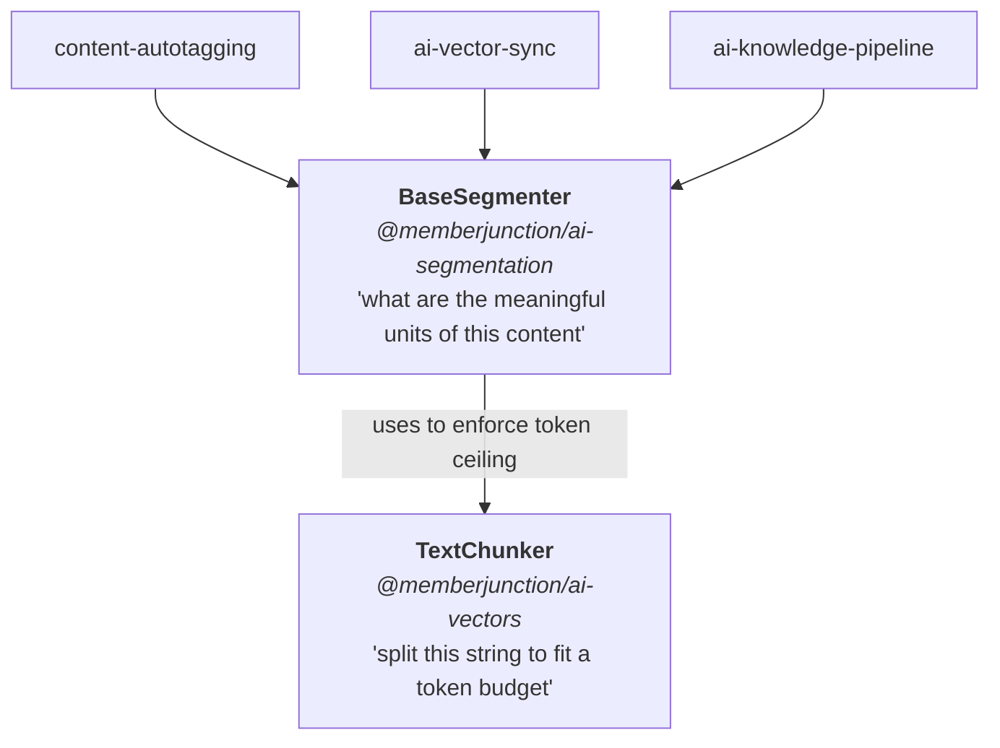
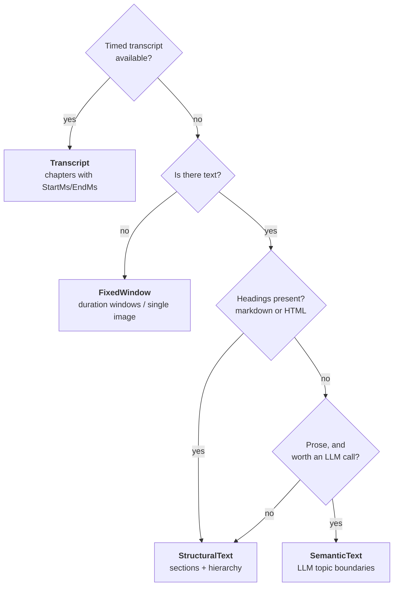
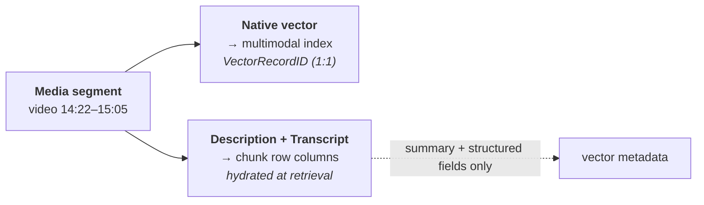

# Content Segmentation Guide

**Segmentation decides what gets embedded. The embedding model only decides how.**

Read this before changing how any pipeline chunks content, before adding a new chunking strategy, and
before ingesting audio, video, or images into a vector index.

- **Package**: [`@memberjunction/ai-segmentation`](../packages/AI/Segmentation/README.md)
- **Primitive it builds on**: `TextChunker` in [`@memberjunction/ai-vectors`](../packages/AI/Vectors/Core/README.md)
- **Consumers**: [`@memberjunction/content-autotagging`](../packages/ContentAutotagging/README.md), `@memberjunction/ai-vector-sync`, `@memberjunction/ai-knowledge-pipeline`

---

## Why this matters

Retrieval quality is capped by segmentation quality, and no amount of embedding-model upgrade
recovers a bad split. Two failure modes dominate:

**Straddling.** Cut a document on an arbitrary token boundary and a chunk covers the tail of one topic
and the head of the next. Its vector is the average of two meanings, so it ranks mediocre for both
queries — and because it never ranks first, the failure is invisible in evaluation.

**Mush.** Hand a 60-minute recording to a multimodal model in one call and you get a single vector for
an hour of distinct content. Multimodal embedders sample a bounded number of frames regardless of clip
length, so the effective window is on the order of half a minute — the rest is silently dropped.

Segmentation fixes both by cutting on *real* boundaries — a heading, a topic shift, a silence gap —
before anything is embedded.

---

## Layering



`TextChunker` is a low-level string primitive: given a string and a budget, split it. It has no notion
of documents, media, or meaning. Segmenters sit above it and answer the semantic question, *using*
`TextChunker` to enforce the budget within a unit they identified.

> **Why segmentation is not in `ai-vectors`:** the LLM-driven segmenter needs `AIPromptRunner`, and
> `ai-prompts → templates → ai-provider-bundle → ai-vectors-pinecone → ai-vectors` — so `ai-vectors`
> importing `ai-prompts` is a genuine cycle. Sitting one layer up also keeps segmentation reusable by
> `ai-vector-sync`, which could not have depended on it had it lived inside the autotagger.

---

## Choosing a strategy



`SuggestSegmenterKey(params)` implements the top of this tree. The ordering encodes the quality
hierarchy: **a real transcript beats document structure, which beats uniform windows.**

| Key | Class | Model calls | Best for |
|---|---|---|---|
| `StructuralText` | `StructuralTextSegmenter` | none | Documents with headings — markdown, HTML, converted PDFs. **The text default.** |
| `AdaptiveBoundary` | `AdaptiveBoundarySegmenter` | none | Prose without headings. Targets a size and closes on the nearest natural break. |
| `SemanticText` | `SemanticTextSegmenter` | 1 per document | Prose where topics shift with no structural signal at all. |
| `Transcript` | `TranscriptSegmenter` | none | Audio/video with timed cues. Produces **chapters**. |
| `PagedContent` | `PagedContentSegmenter` | none | PDFs and slide decks — one segment per page, with `PageNumber`. |
| `FixedWindow` | `FixedWindowSegmenter` | none | Universal fallback — logs, machine text, untranscribed media. |

### Size chunks to your queries, not to your model

The embedding model's context window is an **upper bound, not a target**. A chunk should be
roughly as much content as a good answer to a typical query, so that a matching chunk is
mostly signal. If your queries are short paraphrases, smaller chunks retrieve better; if a
downstream summarizer needs context, larger ones do. Deriving chunk size from
`MAX_EMBEDDING_TOKENS` is the most common way to get retrieval quietly wrong.

`AdaptiveBoundary` makes this explicit: `TargetTokens` is the goal, `MaxSegmentTokens` is
only the ceiling. It escalates through boundary quality as it approaches the target —
paragraph, then sentence, then word, then a hard cut — so segment sizes **vary on purpose**.
A slightly short segment ending at a paragraph is worth more at retrieval time than an
exactly-sized one ending mid-clause. It also declines to split at all when the whole text is
only modestly over target (`NoSplitPercent`), which avoids one full chunk plus a two-sentence
runt with no context.

Selection is metadata-driven and degrades rather than throws:

```typescript
import { ResolveSegmenter, SuggestSegmenterKey } from '@memberjunction/ai-segmentation';

const params = { Text: extractedText, MimeType: 'text/markdown', ContextUser: contextUser };
const segmenter = ResolveSegmenter(contentType.SegmenterKey, SuggestSegmenterKey(params));
const result = await segmenter.Segment({ ...params, Options: { MaxSegmentTokens: 512 } });

if (!result.Success) {
    LogError(`Segmentation failed: ${result.ErrorMessage}`);
    return;
}
```

A configured key that no longer resolves (renamed strategy, package not loaded) logs and falls back —
configuration is data, and data drifts. Segmenters **never throw** for content-shaped problems; they
return `Success: false`, matching `RunView` and `BaseEntity.Save()`.

> **Bootstrap requirement.** Segmenters are instantiated dynamically through the class factory, so
> bundlers can tree-shake them out. Call `LoadContentSegmenters()` once from your application
> bootstrap. Skipping it produces **no error** — resolution just falls back to the default strategy,
> so content is still chunked, silently by the wrong strategy. This is the same load-prevention
> pattern used by `LoadExpoPushProvider`, `LoadMJComputerUse`, and other factory-resolved packages.

---

## Cleaning: the stage before segmentation

Segmenting dirty content just produces well-bounded garbage. Real-world source pages are
mostly *not* content — navigation, sidebars, cookie banners, share widgets, related-article
rails, and advertising typically outweigh the article. Because that chrome repeats across
every page of a site, it produces many near-identical chunks that crowd out real answers.

Cleaning is therefore its own plug-in point, resolved the same way segmenters are:

```typescript
import { ResolveContentCleaner, SuggestCleanerKey } from '@memberjunction/ai-segmentation';

const cleaner = ResolveContentCleaner(source.CleanerKey, SuggestCleanerKey(mimeType));
const cleaned = cleaner.Clean({ Content: rawHtml, MimeType: mimeType, Options: cleaningOptions });
// cleaned.Content feeds the segmenter; cleaned.CharactersRemoved is a cheap "is my selector wrong?" signal
```

| Key | Best for |
|---|---|
| `Html` | Markup. CSS-selector-driven extraction with a sensible default exclusion list. |
| `PlainText` | Everything else — whitespace normalization and optional truncation only. |

**`IncludeSelectors` is the highest-leverage knob.** Naming the one element that holds the
content (`.article-body`, `main`, `#post`) discards everything else in one stroke, without
enumerating what to drop. `ExcludeSelectors` then handles whatever survives inside it. Both
are **per-source** configuration, because the right selector is a property of the site's
template, not of MemberJunction.

Two deliberate safety behaviours: an invalid selector is skipped rather than failing the
whole clean, and if cleaning would remove *everything* the original content is returned with
a warning — over-including beats silently dropping a document.

Cleaning and segmentation are separate because they change for different reasons: a new CMS
template needs new selectors, not a new chunking strategy. Splitting them also means the
rules apply once and benefit every consumer — embedding chunks, tagging chunks, and
full-text indexing alike.

## Two chunk sites, two budgets — do not unify them

Ingestion chunks content **twice**, for different consumers:

| Site | Sized for | Budget | Persisted? |
|---|---|---|---|
| Embedding chunks | the embedding model's context | e.g. 512–7500 tokens | **Yes** — becomes `Content Item Chunks` + vectors |
| LLM/tagging chunks | the tagging model's context window | `InputTokenLimit / 1.5` | No — transient, exists only to fit the prompt |

Routing both through `BaseSegmenter` is correct and desirable: the *strategy* should be shared.
Collapsing them into one call is **not** — their budgets are unrelated, and tying them means an
embedding-model change silently alters tagging behaviour. Keep them as two calls with different
`MaxSegmentTokens`.

### How ContentAutotagging wires this

`AutotagBaseEngine` routes both sites through one seam:

```typescript
protected resolveSegmenterKey(): string { return FIXED_WINDOW_SEGMENTER_KEY; }

protected async segmentTextForChunking(text: string, options): Promise<string[] | null> { ... }
```

`resolveSegmenterKey()` is the extension point. It defaults to `FixedWindow` with each site's
historical budget, so routing through the strategy layer changed no behaviour — override it in a
subclass, or resolve it from the Content Source / Content Type `Configuration`, to opt into
`StructuralText`, `SemanticText`, or `Transcript`.

`segmentTextForChunking` returns `null` on failure rather than an empty array, so each caller applies
its own fallback instead of silently embedding nothing.

---

## Multimodal: one vector, dual representation

A media segment carries **one** vector — the native multimodal one — plus readable text stored
alongside it on the chunk row:



This keeps `VectorRecordID` **1:1 with the chunk row**, so the chunk-identity contract, soft-delete,
and purge machinery all carry over from text unchanged.

### Which text is embedded, and which isn't

A precise rule, because the columns look similar and guessing wrong is expensive:

| Field | Embedded? | Purpose |
|---|---|---|
| `Text` | **Yes** — it *is* the embedded payload | For a media segment carrying both, the text is **fused with the media into one vector** (multimodal models accept interleaved text + media — an image and its caption become a single embedding). |
| `Description` | No | Readable representation for agents, reranking, and lexical search. |
| `Transcript` | No | Verbatim record; lexically searchable. |

So `Modality: 'multimodal'` means exactly this: `Text` **and** `Media` on the same segment,
fused into one vector. `Description`/`Transcript` never enter a vector — that is what keeps
`VectorRecordID` 1:1 with the chunk row.

**What each representation is for:**

- **Native vector** — retrieval. What the multimodal model actually indexes.
- **`Description` / `Transcript` columns** — everything downstream of retrieval: what an agent reads,
  what a cross-encoder reranks, what a UI displays. Without this, a hit resolves to
  `session_1428.mp4, 14:22–15:05` — a pointer the agent cannot reason over.
- **Vector metadata** — a **short summary plus structured fields** (`SegmentTitle`, `StartMs`/`EndMs`,
  `Speaker`, `Modality`, `PageNumber`). Structured fields are worth more here than prose because they
  are filterable. Metadata is size-capped per provider and is filter/payload, **not** ranked
  full-text — a full transcript does not belong there. (`buildVectorMetadata` already truncates text
  fields to 1000 chars; follow that precedent.)

### How a text query reaches a media chunk

Three paths, with different strengths:

| Path | Mechanism | Strong at | Weak at |
|---|---|---|---|
| **A. Native** | text→media similarity in the multimodal index | visual/audio semantics | runs colder than text→text; ranks poorly in a mixed top-k |
| **B. Lexical** | FTS/BM25 over `Description`/`Transcript` | names, acronyms, jargon, session titles | paraphrase and synonymy |
| **C. Description vector** | text→text over an LLM summary | paraphrase | rare proper nouns |

**Recommendation: ship A + B. Add C selectively, measured.**

B and C fail in opposite directions, and B covers the queries archives actually receive — speaker
names, session titles, product names — nearly for free in the colocated pgvector/SQL Server path,
which already fuses a `tsvector` with the vector via RRF in one statement. The gap B leaves is
specifically paraphrase-shaped, which matters for speech-heavy content where the transcript *is* the
semantic payload.

If you add C, add it as a **sibling text chunk row** pointing at the media chunk — not a second column
on the same row. Each row keeps one vector, the contract holds, and you collapse on the parent key
after fusion so one chapter cannot surface twice.

> **Cost note.** Embedding a ~200-token summary with a text model is a rounding error next to the
> video embedding already paid for. C doubles *vector rows*, not spend; its real cost is schema and
> retrieval complexity.

### Reaching media chunks from non-semantic search

Because `Description`/`Transcript` are plain columns, they are indexable by everything that
isn't a vector — DB full-text search, and the external indexes MJ already queries (Azure AI
Search, Elasticsearch, OpenSearch, Typesense). A recording becomes findable by keyword the
same way a document is.

`ExternalHitMapper` in `@memberjunction/search-engine` is the shared field mapping all four
external providers use. It checks `description` and `transcript` when resolving a hit's
snippet (after the conventional `content`/`body`/`text`), so a media chunk returns readable
text rather than an empty snippet. It also recovers **chunk provenance** — `chunkId`,
`modality`, `startMs`/`endMs`, `pageNumber` — into the result's `RawMetadata` when the
indexing pipeline emits those fields, which is what lets a hit deep-link to a moment in a
recording or a page in a PDF instead of just naming the asset. Field names are matched in
camelCase, PascalCase, and snake_case, and numeric strings are coerced, since external
indexes are populated outside MJ and their conventions vary.

### Consider transcript-only first

For speech-dominant archives — conference sessions, webinars, podcasts — the transcript carries nearly
all retrievable meaning and the pixels add little. **Transcript-derived text chapters with time
windows** give full text→text semantics, hybrid FTS, and reranking at **zero multimodal embedding
spend** — the cost of ASR alone. The native multimodal vector earns its place when visuals carry
meaning the words do not: slide diagrams, product demos, image libraries. Price that comparison on a
representative corpus before committing to a multimodal index.

---

## Writing a new segmenter

Implement one method and register the class:

```typescript
import { RegisterClass } from '@memberjunction/global';
import { BaseSegmenter, ContentModality, RawSegment, SegmentationParams } from '@memberjunction/ai-segmentation';

@RegisterClass(BaseSegmenter, 'SlideDeck')
export class SlideDeckSegmenter extends BaseSegmenter {
    public get Key(): string { return 'SlideDeck'; }
    public get SupportedModalities(): ContentModality[] { return ['text', 'image']; }

    protected async SegmentCore(params: SegmentationParams): Promise<RawSegment[]> {
        return findSlides(params).map((slide, i) => ({
            Modality: 'text',
            Title: slide.Title,
            Text: slide.Notes,
            PageNumber: i + 1,
        }));
    }
}
```

`BaseSegmenter` handles the rest, so every strategy inherits the same guarantees:

| Base-class responsibility | Why it isn't the subclass's problem |
|---|---|
| Input validation | One place to decide what "segmentable" means |
| Token ceiling | Subclasses emit oversized segments freely; the base splits via `TextChunker`, preserving `Title` and rebasing offsets |
| Undersized merging | `MinSegmentTokens` prevents a spray of near-empty vectors |
| Sequence numbering | Assigned after splitting, so numbers are always contiguous |
| `ParentIndex` → `ParentSequence` | Subclasses reference siblings by raw array index and never reason about post-split numbering |
| Depth + cycle safety | A malformed parent chain can't hang ingestion |
| Provenance | Every segment is stamped with the `SegmenterKey` that produced it |

Return `RawSegment`s describing **where the boundaries are**; never pre-split to fit a budget.

---

## Options and budgets

Common to every segmenter (`SegmentationOptions`):

| Option | Default | Purpose |
|---|---|---|
| `MaxSegmentTokens` | 512 | Hard ceiling; the base splits anything larger |
| `OverlapTokens` | 10% of max | Overlap when an oversized segment is split |
| `MinSegmentTokens` | 0 (off) | Merge adjacent text segments below this size |

Each strategy extends these — see `StructuralTextSegmentationOptions` (heading syntax, whether to
prepend the heading to the body), `TranscriptSegmentationOptions` (`MaxChapterMs`, `BoundaryGapMs`,
`EmitSubChapters`), `SemanticTextSegmentationOptions` (`PromptName`, `MinTokensForLLM`,
`BlockPreviewChars`), and `FixedWindowSegmentationOptions` (`WindowMs`, `WindowOverlapMs`).

**Overlap is capped at half the window** in both text and time domains. Beyond 50% each unit is mostly
a copy of its predecessor, and as overlap approaches the window size the segment count explodes —
every one of which is a paid embedding call.

---

## Cost posture

Segmentation runs on every ingested item, so defaults are deliberately cheap:

- `StructuralText`, `Transcript`, `FixedWindow` make **no** model calls.
- `SemanticText` skips the LLM below `MinTokensForLLM` (default 750 tokens), truncates each block to a
  preview before prompting, and degrades to `StructuralText` on any failure — segmentation must never
  fail an ingestion run.
- `SemanticText` asks the model for **block indices**, never character offsets. Models are unreliable
  at arithmetic over long strings, and a bad offset would silently corrupt chunk provenance. Returned
  indices are clamped, deduped, and sorted before use.
- `Transcript` emits sub-chapters only when `EmitSubChapters` is on, since they double a chapter's
  embedding count.

Because `SemanticText` runs through `AIPromptRunner`, each pass is a tracked `MJ: AI Prompt Run` with
full token and cost attribution, and the prompt is versioned metadata rather than a string literal.

---

## Offsets are provenance — treat them as load-bearing

`StartOffset`/`EndOffset` (text) and `StartMs`/`EndMs` (media) are how a search hit resolves back to
the exact passage or moment. They are persisted, surfaced in citations, and used to build playback
deep-links.

`TextChunker` previously resolved a chunk's start with `indexOf` from position 0, so any repeated
sentence — boilerplate, a recurring header — made later chunks report the *first* occurrence: a chunk
truly spanning offsets 61–86 reported 0–86. It now resolves positions with a single forward cursor.

If you add a strategy that computes offsets, **test that `text.slice(StartOffset, EndOffset)` actually
contains the segment**. See `TextChunker.offsets.test.ts` for the regression pattern.

---

## Related guides

- **[Search Overview Guide](SEARCH_OVERVIEW_GUIDE.md)** — which search API to reach for; segmentation feeds all the semantic ones.
- **[Search Scopes & RAG Guide](SEARCH_SCOPES_AND_RAG_GUIDE.md)** — how retrieved chunks reach an agent.
- **[Content Autotagging Guide](CONTENT_AUTOTAGGING_GUIDE.md)** — the ingestion pipeline that consumes segmentation.
- **[Duplicate Detection Guide](DUPLICATE_DETECTION_GUIDE.md)** — a second consumer of embeddings; changes to how content is embedded affect it.
- **[Text Processing Guide](../packages/AI/Vectors/Core/docs/TEXT_PROCESSING_GUIDE.md)** — `TextChunker`/`TextExtractor` primitives in detail.
