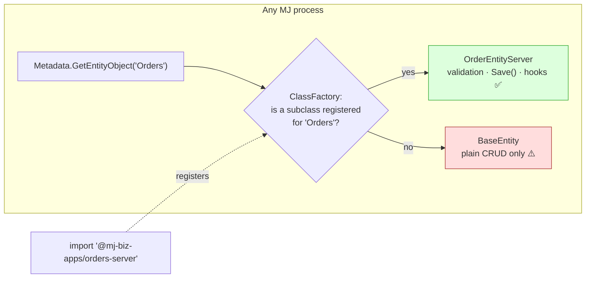
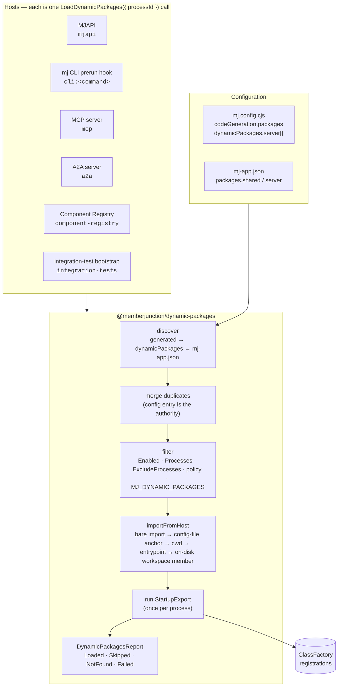
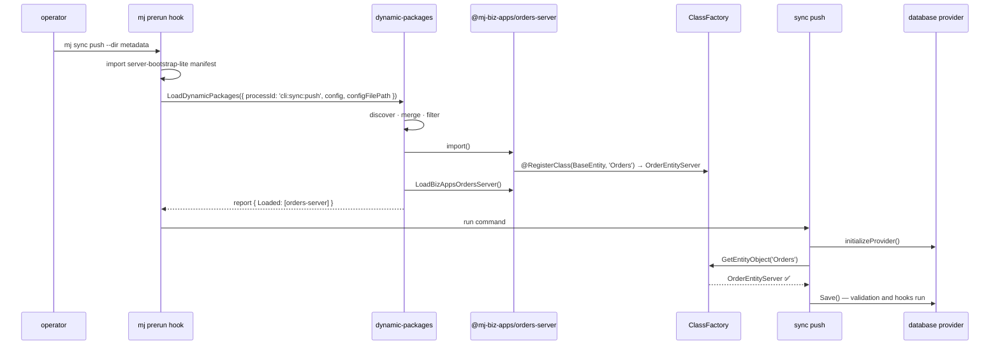
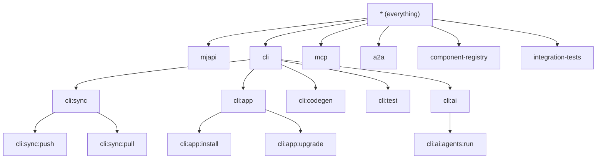
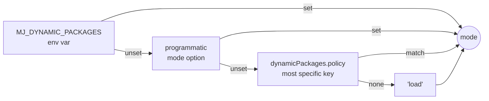

# Dynamic Package Loading Guide

**Read this before** wiring a new server-side process (a CLI, a worker, a server, a test harness, a
one-off script) to a MemberJunction database, before installing an Open App into a host, and before
debugging "my entity's custom `Save()` did not run" anywhere outside MJAPI.

MemberJunction resolves *which class* handles an entity, an action, a provider or an extension at
runtime through the ClassFactory. That only works if the package that registers the class has been
**imported** into the process. This guide explains how packages whose names are only known at
runtime get imported in every MJ process, how to configure it for a downstream application and for
an MJ install, and how to scope it per process.

> Package: [`@memberjunction/dynamic-packages`](../packages/DynamicPackages/README.md).
> Origin: [MemberJunction/MJ#4199](https://github.com/MemberJunction/MJ/issues/4199).

---

## 1. Why this exists

`Metadata.GetEntityObject('MJ_BizApps_Orders: Orders')` never fails when nothing is registered for
that entity. The ClassFactory hands back a plain `BaseEntity`, which saves through the generated
stored procedures and silently skips every custom `Save()` override, validation rule and lifecycle
hook the entity's real class carries. In a metadata push, a scheduled job, or an MCP tool call this
looks **identical to success**.



Whether the answer is "yes" depends entirely on whether the app's server package was imported
earlier in **that process**. MJAPI has always done this at boot by reading `mj.config.cjs`. Until
[#4201](https://github.com/MemberJunction/MJ/pull/4201), nothing else did:

| Process | Loaded MJ core's server subclasses | Loaded installed Open Apps' packages |
|---|---|---|
| MJAPI | ✅ manifest | ✅ `dynamicPackages.server[]` |
| `mj sync push`, `mj app …`, `mj test`, `mj ai` | ✅ lite manifest | ❌ |
| MCP server, A2A server, Component Registry | ✅ manifest | ❌ |
| integration-test bootstrap, ad-hoc scripts | ✅ manifest | ❌ |

The asymmetry is what made it invisible: MJ core's own entities *did* get their server classes in
the CLI, so `mj sync push` of an `MJ: AI Agent` behaved correctly while a push of an Open App's
`Order` quietly wrote a half-populated row.

## 2. The model

Three things can name a package a process must import at runtime:

| Source | Written by | Read from | Loads in |
|---|---|---|---|
| `codeGeneration.packages.{entities,actions,graphqlResolvers}` | `mj codegen` / the host's own config | `mj.config.cjs` | every server process |
| `dynamicPackages.server[]` / `dynamicPackages.client[]` | `mj app install` (`mj app disable` flips `Enabled`) | `mj.config.cjs` | every process of that tier |
| `mj-app.json` `packages.shared[]` + `packages.server[]`/`client[]` | the app's own repository | beside the config | only when the process runs inside an Open App repo |

`@memberjunction/dynamic-packages` turns those into one ordered list, filters it for the calling
process, imports each package from the **host's** resolution context (not the loader's), runs the
entry's `StartupExport`, and returns a report.



### The load order is the priority order

The ClassFactory resolves ties by load order: the **last** registration under a key wins. The loader
therefore imports in this order, and every host calls it **after** its own class-registration
manifest (`@memberjunction/server-bootstrap` or `-lite`):

1. MJ core manifest (the host's static import) — base classes and core server subclasses
2. the host's generated packages — a host's own entity subclasses
3. installed Open Apps (`dynamicPackages`) — the apps' generated and server subclasses
4. the app whose repository the process is standing in (`mj-app.json`) — the most local definition

So an app's `OrderEntityServer` overrides the generated `OrderEntity`, which overrides `BaseEntity`,
without any priority numbers in configuration.

### Where it runs: before the provider



A `StartupExport` runs **before any database provider exists**. It registers classes and returns.
That is the contract MJAPI has always imposed, and it is what lets the CLI load packages in a hook
that knows nothing about the command's database.

## 3. Process IDs and scoping

Every host names itself with a lowercase, colon-separated **process ID**. IDs are hierarchical: a
pattern matches an ID when it equals the ID or names one of its ancestor segments.



`cli:sync` covers `cli:sync:push` and `cli:sync:pull` but not `cli:syncother` or `cli:migrate`. The
CLI derives its ID from the oclif command ID (`sync push` and `sync:push` both become
`cli:sync:push`).

Two optional, hand-authored fields scope an entry, and an optional map switches a whole process off:

```js
// mj.config.cjs
dynamicPackages: {
  server: [
    // written by `mj app install` — no Processes = loads wherever the server tier loads
    { PackageName: '@mj-biz-apps/orders-server', StartupExport: 'LoadBizAppsOrdersServer', AppName: 'mj-bizapps-orders', Enabled: true },

    // hand-added: a seed-data package that only `mj sync` commands need
    { PackageName: '@acme/demo-seed-server', StartupExport: 'LoadDemoSeed', Processes: ['cli:sync'] },

    // hand-added: everywhere except CodeGen
    { PackageName: '@acme/audit-server', StartupExport: 'LoadAudit', ExcludeProcesses: ['cli:codegen'] },
  ],

  // per-process on/off; the most specific matching key wins
  policy: { 'cli:codegen': 'none' },
}
```

`Processes` is evaluated first, then `ExcludeProcesses`. `mj app upgrade` prunes and re-adds entries
by `PackageName` and `AppName` and leaves a surviving entry byte-identical, so hand-added scoping on an
installed app's entry survives upgrades.

> **Light commands never load packages.** `mj migrate`, `mj clean`, `mj bump`, `mj install`, the
> `dbdoc` and `usage` commands skip the manifest and the loader for instant startup
> (`packages/MJCLI/src/light-commands.ts`). Scoping an entry to `cli:migrate` therefore never
> applies; those commands never construct entity objects.

### Turning it off for one run

Mode precedence, highest first — the same shape as `MJ_STARTUP_MODE`:



`MJ_DYNAMIC_PACKAGES=none` (also `off`, `skip`, `0`) disables loading for one invocation. The `mj`
CLI exposes it as the global flag `--no-app-packages`, consumed in the prerun hook so it works on every
command. Use it to restore a dump, bulk-ingest without side effects, or diagnose a package that breaks
boot.

It is deliberately **not** called `--raw`: MJ core's own server subclasses still register through the
host's manifest. Mode `none` skips the host's generated packages and every Open App package, so the
host's own custom entities fall back to `BaseEntity` too.

### Nested hosts

`mj ai …` imports `@memberjunction/ai-cli` in-process and `mj test …` imports
`@memberjunction/testing-cli`; both have their own provider bootstrap that also calls the loader (they
are standalone bins as well). The `mj` prerun hook publishes its process ID through
`MJ_DYNAMIC_PACKAGES_PROCESS`, and the nested host adopts it via `EffectiveProcessId('ai-cli')`, so an
entry excluded from `cli` is not loaded a moment later under a different name. Packages already loaded
are handed back from a per-process cache without re-running their startup export.

## 4. Configuring a downstream application

A host application (your own MJ instance) has three things to know.

**Your generated packages.** If your host generates its own entities into a separate package, name it
so every process loads it — not only MJAPI:

```js
// mj.config.cjs
codeGeneration: {
  packages: {
    entities: { name: '@acme/mj-generated-entities' },
    actions:  { name: '@acme/mj-generated-actions' },
  },
},
```

Without this, a host with custom-schema entities has always pushed metadata with `BaseEntity`;
`mj sync push` now tells you so, once per entity.

**Installed Open Apps.** `mj app install` writes `dynamicPackages.server[]` (and `.client[]`) and
`mj app upgrade` / `remove` / `disable` maintain them. You never hand-write the installed entries.
You *may* add scoping fields or your own entries next to them.

**A package of your own, for one process.** A seed-data package, an audit hook, a CLI-only extension:

```js
dynamicPackages: {
  server: [
    { PackageName: '@acme/seed-hooks', StartupExport: 'LoadSeedHooks', Processes: ['cli:sync:push'] },
  ],
},
```

The package must be resolvable from the host — declare it in the host's `package.json` (MJAPI's, or the
directory that holds `mj.config.cjs`). Under pnpm's strict layout the loader resolves from the
config file's directory, then the working directory, then the process entrypoint; a package none of
those can see is reported as not-found, never as an error.

**A `StartupExport`** is a named export invoked after import. Real apps use it as an anti-tree-shaking
anchor that also asserts the package's classes are wired:

```ts
// packages/Server/src/index.ts of an Open App
import '@acme/crm-entities';          // generated subclasses register on import
import './custom/OrderEntityServer.js';
export function LoadAcmeCrmServer(): void {
  // registration happened at import; this export exists so a host has something to call
}
export const RESOLVER_PATHS = [/* absolute paths to generated resolvers, read by MJAPI */];
```

## 5. Configuring an MJ install

An installed MJ (`mj install`, or the monorepo host) needs nothing beyond what `mj app install` writes.
What operators tune:

| Need | Do |
|---|---|
| Stop one app everywhere without uninstalling | `mj app disable <name>` (flips `Enabled: false`) |
| Stop one app in one process | add `ExcludeProcesses: ['cli:sync']` to its entry |
| Stop every app in one process | `dynamicPackages.policy: { 'cli:codegen': 'none' }` |
| One run without app packages | `mj sync push --no-app-packages` or `MJ_DYNAMIC_PACKAGES=none` |
| See what loaded and why | `mj … --verbose` (stderr), or MJAPI's boot log |

MJAPI's boot log and the MCP/A2A logs print `Loading Open App server packages...` followed by one
line per package (`Loaded … (ran LoadX)`, `not found (run 'npm install'?)`, or an error with its cause).
The CLI keeps stdout clean for `--format=json` and prints the same lines on stderr under `--verbose`.

## 6. Running inside an Open App repository

When `mj-app.json` sits beside the config the loader also imports that app's `packages.shared`
libraries and its `packages.server` bootstrap package(s), running each `startupExport`. Nothing at the
repo root can `require.resolve` a workspace member under pnpm, so the loader finds the package under
`code.sourceDirectory` (default `packages/`) and imports it by path. An unbuilt member (no `dist`) is
reported as not-found with the missing file named; build it first.

If the app's own package is *also* listed in the sibling `mj.config.cjs` (the installed form), the
config entry decides `Enabled` and scoping and the manifest's on-disk location is kept as the resolution
fallback — so `mj app disable` still works and an unresolvable config entry still loads from the
workspace.

Dependency apps are **not** walked from the manifest. Installed ones are already in the host's
`dynamicPackages`; dev-linked ones ride the workspace's env-supplied entries
([Open App Workspace Linking Spec](OPEN_APP_WORKSPACE_LINKING_SPEC.md)).

## 7. Adding the loader to a new host

```ts
import { DiscoverMJConfig, LoadDynamicPackages, StderrDynamicPackagesLogger } from '@memberjunction/dynamic-packages';
import '@memberjunction/server-bootstrap-lite/mj-class-registrations'; // core classes FIRST

// The raw config: a Zod-parsed config keeps only the keys its schema names.
const { config, configFilePath } = DiscoverMJConfig(undefined, { searchStrategy: 'none' });
const report = await LoadDynamicPackages({
  processId: 'my-worker',      // pick a stable, documented id; hierarchical if it has sub-modes
  tier: 'server',
  config, configFilePath,
  log: StderrDynamicPackagesLogger, // keep stdout for your own output
});
// … only now set up the database provider
```

Rules for a host:

1. Call it **after** the manifest import and **before** the provider. Startup exports must not need a
   provider.
2. Use the same `searchStrategy` your own config loader uses, so packages come from the file your
   database settings came from.
3. Pass the **raw** config. The CLI exposes `getRawConfig()` for this reason.
4. Never throw on the report. A missing package is `NotFound`; a package that threw is `Failed` with
   its own error; both are the operator's to read, not a reason to abort boot.
5. If the host needs something off a loaded module (`RESOLVER_PATHS`, `MJ_SERVER_EXTENSIONS`), read it
   from `report.Loaded[i].Module` by property access — MJAPI's bootstrap is the reference.

## 8. Troubleshooting

| Symptom | Cause | Fix |
|---|---|---|
| `No entity subclass is registered for 'X'` during `mj sync push` | the package that registers `X` was not imported in this process | check the entry exists, is enabled, is scoped to `cli:sync:push`, is installed and built; check `--no-app-packages` / `MJ_DYNAMIC_PACKAGES` |
| `… not found (run 'npm install'?)` | no resolution anchor can see the package | install it in the host; under pnpm, declare it in the package that holds `mj.config.cjs` |
| `… found at … but not built (missing dist/index.js)` | workspace member discovered via `mj-app.json`, not built | build the app |
| `Error loading … Cannot find package '<other>'` | the package resolved but a **transitive** dependency is missing | install the app's dependencies; this is the package's own error, surfaced on purpose |
| `… has no export named 'LoadX'` | stale `StartupExport` after a rename | `mj app upgrade` retargets it; or fix the entry |
| an entry scoped to `cli:migrate` never loads | migrate is a light command | scope to a heavy command, or accept that migrate never constructs entities |
| an app's classes load in `mj ai …` although excluded from `cli` | nested host ran with its own id | update to a version with `MJ_DYNAMIC_PACKAGES_PROCESS` propagation (this guide's release) |

## Related

- [`@memberjunction/dynamic-packages` README](../packages/DynamicPackages/README.md) — API, report shape, examples
- [`@memberjunction/server-bootstrap` README](../packages/ServerBootstrap/README.md) — what MJAPI does with the loaded modules
- [Open App README](../packages/OpenApp/README.md) — building the packages this loader imports
- [Open App Workspace Linking Spec](OPEN_APP_WORKSPACE_LINKING_SPEC.md) — dev-linked apps and env-supplied entries
- [Class Manifest Guide](../plans/complete/codegen/CLASS_MANIFEST_GUIDE.md) — the static half: manifests that defeat tree-shaking
- [MJAPI CLAUDE.md](../packages/MJAPI/CLAUDE.md) — startup mode and the other boot-time switches
