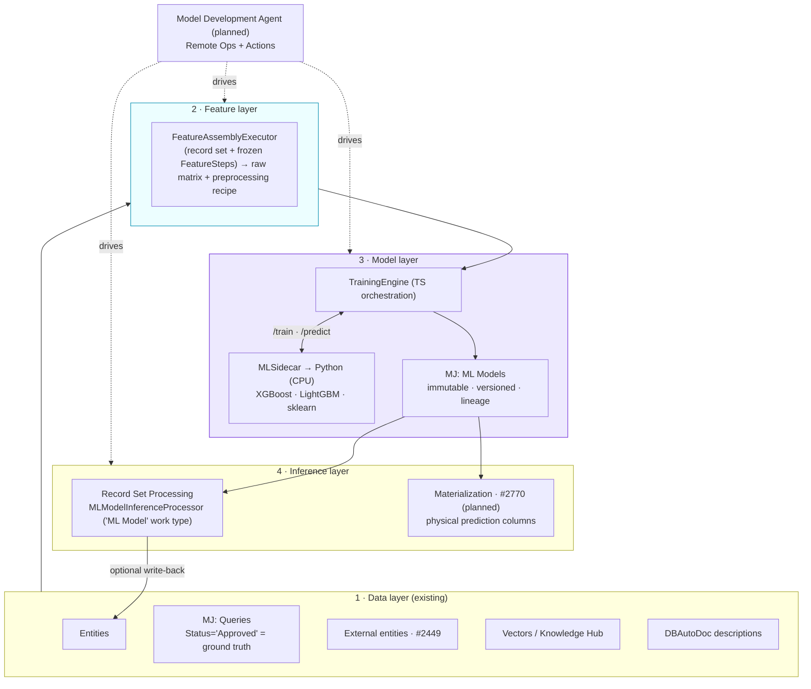
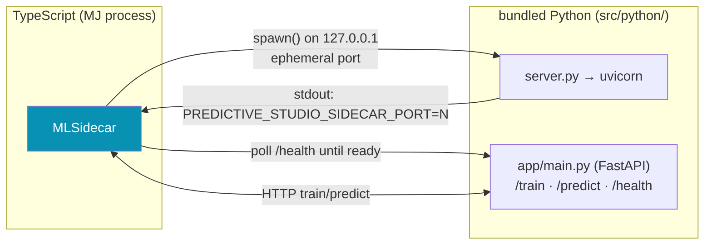
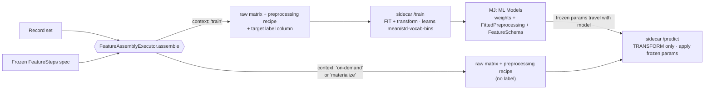
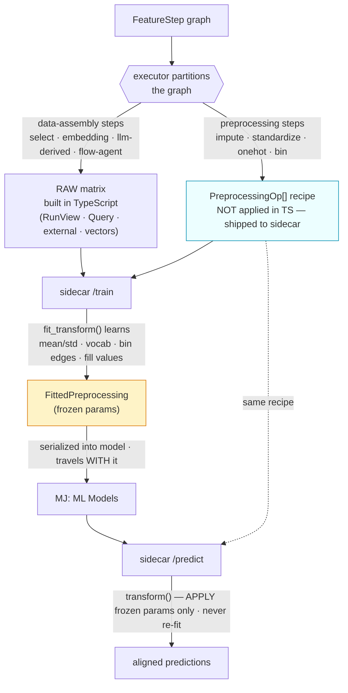
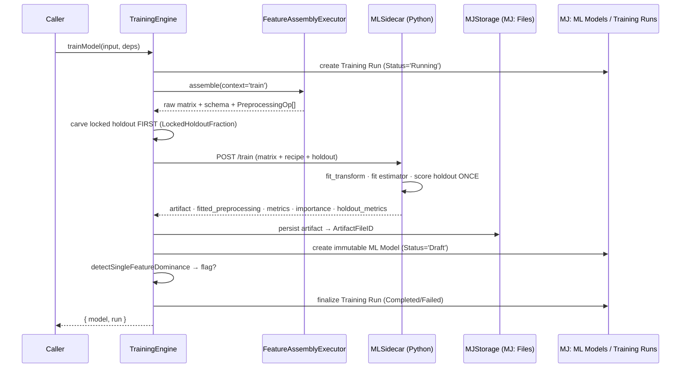
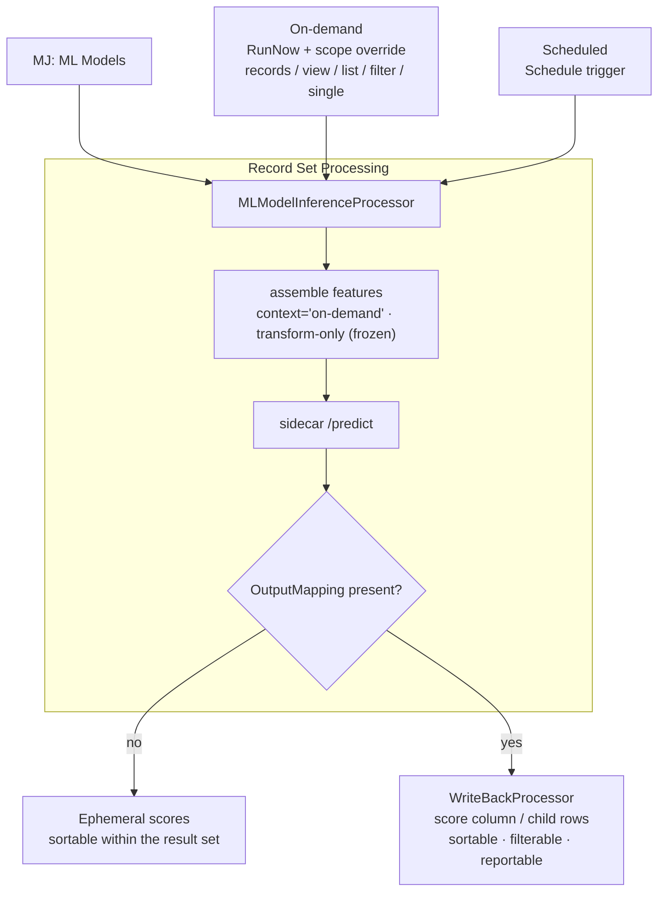
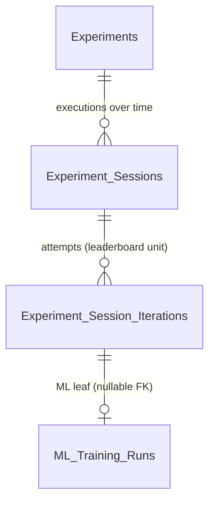
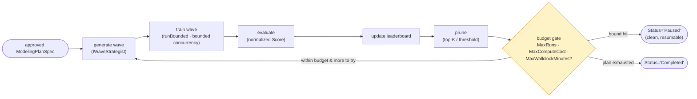
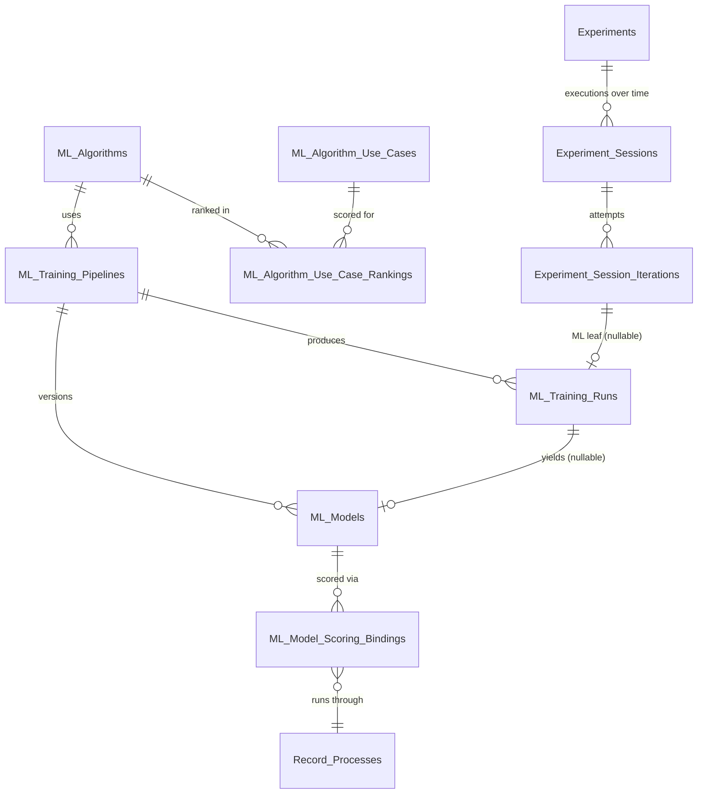
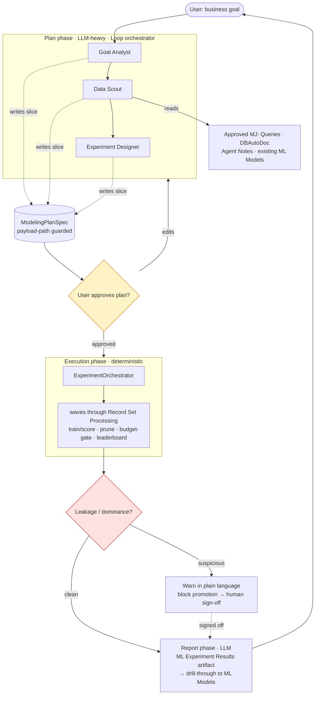

# Predictive Studio Guide

> **When to read this**: Before you touch anything under `packages/AI/PredictiveStudio/**`, the Predictive Studio dashboard (`packages/Angular/Explorer/dashboards/src/PredictiveStudio/`), the `MJ: ML *` / `MJ: Experiment*` entities, or before you add a *trained-model* capability (feature assembly, training, scoring, experiment search). This is the canonical reference for how MJ trains predictive models on a client's own data and scores records with them.

MJ already runs *off-the-shelf* models well — embeddings, LLMs, image/audio inference via `MJ: AI Models`. It does **not** train models on a client's own data. **Predictive Studio** closes that gap: a reasonably technical business user (not a career data scientist) can assemble features from across MJ's entire data surface, train a genuinely useful predictive model (member retention, renewal, lapse risk, lead scoring), and score who is likely to renew/lapse/return — and an **agent can drive the same object model end to end**.

---

## At a glance

| | |
|---|---|
| **What it is** | A core MJ capability for **training predictive models on a client's own data** and **scoring records** with them — feature assembly, training, scoring, and a budgeted agentic experiment search. |
| **Who it's for** | A reasonably technical business user (renewal/retention/lead-scoring analyst) **and** an agent — the same object model drives both. |
| **What it is *not*** | SageMaker/Databricks. No GPU. No training embeddings from scratch (it *uses* pre-trained embeddings as features). Deliberately rigid about algorithms (a fixed 6-catalog), flexible about data. |
| **Compute** | **CPU-bound, no GPU.** Gradient boosting / logistic / random forest / small MLP on tabular data train in seconds-to-minutes — matches MJ's API-runtime infra. |
| **Differentiation** | **Data assembly + agentic search over MJ's entire data surface**, not algorithmic innovation. |
| **Status** | Engines, sidecar, FeatureAssembly, training, scoring, the experiment orchestrator, the Studio UI, and a live integration test are **built**. Remote Operations, the Model Development Agent, materialization, and Knowledge Hub Feature Pipelines are **planned** (flagged inline). |

**Proof it works — real numbers from the live integration test** (`live-train-score.integration.test.ts`, real managed sidecar, 420-row synthetic dataset with a genuinely learnable signal, no DB):

- **XGBoost classifier** — **holdout AUC ≥ 0.70** on the locked holdout the search never saw.
- **Logistic Regression classifier** — **holdout AUC ≥ 0.70**.
- **Ridge regressor** — **holdout R² ≥ 0.40** on a continuous target.
- **Held-out directional accuracy > 0.60** — the model beats coin-flip on rows it never trained on.

These are asserted thresholds on a deterministically-seeded dataset, so they hold every run — the metrics above are floors the suite enforces, not best-case cherry-picks.

It is **core MJ, not an OpenApp**. It composes on substrates MJ already has (entities, Queries, vectors, Record Set Processing, Remote Operations, Agents, Artifacts) and adds a small, opinionated set of objects + a Python ML sidecar + world-class UI + an agent.

This guide ties together the packages that each document one layer:

| Layer | Package | What it is |
|---|---|---|
| Type contracts | [`@memberjunction/predictive-studio-core`](../packages/AI/PredictiveStudio/Core/README.md) | sidecar contract, pipeline spec, feature-step DAG, modeling plan — pure types, zero runtime deps |
| Python sidecar | [`@memberjunction/predictive-studio-sidecar`](../packages/AI/PredictiveStudio/Sidecar/README.md) | `MLSidecar` — self-managing, bundled FastAPI ML service (managed-spawn default; no Docker) |
| Server engine | [`@memberjunction/predictive-studio`](../packages/AI/PredictiveStudio/Engine/README.md) | `FeatureAssemblyExecutor`, `TrainingEngine`, `MLModelInferenceProcessor`, `ExperimentOrchestrator` |
| Studio UI | `@memberjunction/ng-dashboards` (`PredictiveStudio/`) | the lazy-loaded Explorer dashboard + embedded copilot |

---

## Table of contents

1. [The four-layer architecture](#1-the-four-layer-architecture)
2. [The self-managing Python sidecar](#2-the-self-managing-python-sidecar)
3. [The type contracts (`predictive-studio-core`)](#3-the-type-contracts-memberjunctionpredictive-studio-core)
4. [The FeatureAssembly executor — the correctness backbone](#4-the-featureassembly-executor--the-correctness-backbone)
5. [Training — immutable versioned models with honest metrics](#5-training--immutable-versioned-models-with-honest-metrics)
6. [Scoring — a Record Set Processing work type](#6-scoring--a-record-set-processing-work-type)
7. [The experiment engine — a generic agentic-search primitive](#7-the-experiment-engine--a-generic-agentic-search-primitive)
8. [The data model — entities and relationships](#8-the-data-model--entities-and-relationships)
9. [The guidance layer — algorithm catalog + the 6×7 matrix](#9-the-guidance-layer--algorithm-catalog--the-67-matrix)
10. [The API surface — Actions, Remote Operations, and the agent (planned)](#10-the-api-surface--actions-remote-operations-and-the-agent-planned)
11. [The Model Development Agent (planned)](#11-the-model-development-agent-planned)
12. [The Studio UI](#12-the-studio-ui)
13. [Getting started — train and score a model](#13-getting-started--train-and-score-a-model)
14. [Quick reference — what's built vs planned](#14-quick-reference--whats-built-vs-planned)

> **The five invariants** this system is built to protect. Each is enforced by code, not convention — they recur throughout the guide:
> 1. **Anti train/serve skew** — one assembly code path for train and score; preprocessing is *fit once, applied everywhere* (§4.2).
> 2. **Locked holdout** — a slice the search never sees, scored exactly once → the only *honest* metric (§5.1).
> 3. **Leakage gate** — deny-list at assembly + single-feature-dominance flag post-train, blocking auto-promotion (§4.4).
> 4. **Point-in-time correctness** — features assembled as-of the decision date, never leaking the future (§4.3).
> 5. **Model immutability** — every successful run yields a new versioned `MJ: ML Models` row, never a mutation (§5.2).

---

## 1. The four-layer architecture

Four layers, the first of which already existed in MJ. Data flows down; the agent drives across.



The differentiation is **data assembly + agentic search over MJ's entire data surface**, not algorithmic innovation. We are deliberately rigid about algorithms (a fixed 6-algorithm catalog) and flexible about data. This is **CPU-bound, no GPU** — gradient boosting / logistic regression / random forest / small MLP on tabular data train in seconds-to-minutes on CPU, matching MJ's API-runtime infra.

| Layer | Built? | Owns |
|---|---|---|
| **1 · Data** | existing | Entities, `MJ: Queries`, external entities (#2449), vectors, DBAutoDoc — all become feed-ins via `RunView`/`RunQuery` |
| **2 · Feature** | ✅ | `FeatureAssemblyExecutor` — the single correctness backbone (§4) |
| **3 · Model** | ✅ | `MLSidecar` + `TrainingEngine` → immutable versioned `MJ: ML Models` (§2, §5) |
| **4 · Inference** | ✅ scoring / ⏳ materialization | `MLModelInferenceProcessor` (§6); population-wide indexed columns wait on #2770 |

---

## 2. The self-managing Python sidecar

**Node is poor for ML training; Python is excellent.** So MJ (TypeScript) assembles the matrix and orchestrates, and a Python sidecar does the CPU-bound fitting and inference. The key engineering choice: the sidecar is **self-managing and Docker-free by default**.

### 2.1 `MLSidecar` — managed-spawn is the default

`MLSidecar` (`packages/AI/PredictiveStudio/Sidecar/src/ml-sidecar.ts`) follows the **`@memberjunction/sqlglot-ts` pattern**: the Python microservice is *bundled* inside the npm package (`src/python/`) and the TypeScript class spawns it as a child process on demand. **No Docker is required for local or embedded use.**



Two topologies, chosen automatically:

| Mode | When | What `start()` does |
|------|------|---------------------|
| **Managed** (default) | nothing configured | Spawns the bundled FastAPI service on `127.0.0.1` with an **OS-assigned ephemeral port**, reads `PREDICTIVE_STUDIO_SIDECAR_PORT=<n>` from its stdout, polls `/health` until ready, and registers SIGINT/SIGTERM/exit cleanup so the child dies with the parent. |
| **Remote** | `url` option **or** `PREDICTIVE_STUDIO_SIDECAR_URL` env set | Connects only — no child process — and just verifies `/health`. Use for a containerized/horizontally-scaled sidecar. `stop()` is then a no-op (this client never owned the process). |

The public surface (`packages/AI/PredictiveStudio/Sidecar/src/index.ts`): `MLSidecar`, `SidecarError`, plus the `MLSidecarOptions` and `SidecarHealthResponse` types.

```typescript
import { MLSidecar } from '@memberjunction/predictive-studio-sidecar';

const s = new MLSidecar();   // managed mode by default
await s.start();             // spawns the bundled Python service

const trained = await s.train({ /* TrainRequest */ });
const { predictions } = await s.predict({ /* PredictRequest */ });

await s.stop();              // SIGTERM the child (no-op in remote mode)
```

`MLSidecar` exposes `IsRemote`, `IsRunning` (remote always `true`; managed needs a live child), and `Port` (ephemeral in managed, `null` in remote). On macOS it automatically appends `DYLD_LIBRARY_PATH=/opt/homebrew/opt/libomp/lib` to the spawn environment so XGBoost/LightGBM find the OpenMP runtime.

### 2.2 `npm run setup:python` — the one-time bootstrap

Managed mode spawns a Python interpreter, so the bundled virtualenv must exist:

```bash
cd packages/AI/PredictiveStudio/Sidecar
npm run setup:python      # creates .venv and pip-installs src/python/requirements.txt
brew install libomp       # macOS only — XGBoost/LightGBM OpenMP runtime (Linux: libgomp1)
```

The pinned `requirements.txt` includes FastAPI + uvicorn, `xgboost`, `lightgbm`, `scikit-learn`, `numpy`, `pandas`, `joblib`, and the test deps. The setup script (`scripts/setup-python.mjs`) creates the venv, upgrades pip, and installs requirements; `MLSidecar` defaults its interpreter to that bundled `.venv` (falling back to `python3`, or an explicit `pythonPath` option).

### 2.3 The HTTP contract

The contract is defined **once** in `@memberjunction/predictive-studio-core` (`sidecar-contract.ts`) and mirrored by the Python Pydantic models (`app/schemas.py`). MJ assembles the matrix; the sidecar fits and serves.

| Endpoint | Request → Response | Role |
|---|---|---|
| `GET /health` | → `SidecarHealthResponse` (`status`, `algorithms[]`, `cached_models`) | liveness + registered driver keys + warm-cache depth |
| `POST /train` | `TrainRequest` → `TrainResponse` | **fits** preprocessing + estimator; returns artifact + `fitted_preprocessing` + metrics + importance + holdout metrics |
| `POST /predict` | `PredictRequest` → `PredictResponse` | **applies** frozen preprocessing only; returns aligned `predictions[]` |

The Python side: `server.py` resolves the port (0 → OS picks free), prints `PREDICTIVE_STUDIO_SIDECAR_PORT=<n>` to stdout, and runs uvicorn; `app/main.py` is the FastAPI app; `app/algorithms.py` is the driver registry (the `DriverClass` values seeded in `MJ: ML Algorithms`: `xgboost`, `lightgbm`, `logistic_regression`, `random_forest`, `ridge`, `mlp`); `app/preprocessing.py` is the fit/transform anti-skew core (§4.2); `app/artifacts.py` serializes the model envelope and runs the **warm LRU model cache** (max 32, SHA-256 keyed) that keeps single-record interactive scoring fast; `app/metrics.py` computes the deterministic metrics that drive the leaderboard.

**Model artifact envelope** (base64 on the wire, stored in MJStorage): `{ format: "joblib", version, payload_b64, fitted_preprocessing, feature_schema }`. The fitted preprocessing travels *with* the model — that is the anti-skew payload (§4.2).

---

## 3. The type contracts (`@memberjunction/predictive-studio-core`)

A pure-types package — zero runtime dependencies, only interfaces and union types. It is the shared vocabulary across the sidecar, the engine, the UI, and the agent. Four modules:

| File | Defines |
|---|---|
| `sidecar-contract.ts` | `TrainRequest`/`TrainResponse`, `PredictRequest`/`PredictResponse`, `FeatureSchemaEntry`, `PreprocessingOp`, `ValidationConfig`, `MatrixData`, `Prediction`; scalars `FeatureKind`, `ProblemType`, `ModelMetrics`, `FeatureImportance`, `FittedPreprocessing` |
| `pipeline-spec.ts` | `SourceBinding`, `AsOfStrategy`, `LeakageGuard`, `ValidationStrategy` (the declarative shape of a training pipeline) |
| `feature-steps.ts` | the visual **FeatureStep DAG** — a discriminated union on `Kind` (`select`/`impute`/`standardize`/`onehot`/`bin`/`embedding`/`llm-derived`/`flow-agent`) + `FeatureStepGraph` |
| `modeling-plan-spec.ts` | `ModelingPlanSpec` (the Model Development Agent's strongly-typed payload), `Budget`, `LeaderboardEntry` |

```typescript
import type { ModelingPlanSpec, TrainRequest, FeatureStepGraph } from '@memberjunction/predictive-studio-core';
```

> **Import the sidecar contract types from *here*, not from the Sidecar package** (which only re-uses them). Re-exporting cross-package shapes is forbidden by root `CLAUDE.md` rule 5.

---

## 4. The FeatureAssembly executor — the correctness backbone

`FeatureAssemblyExecutor` (`packages/AI/PredictiveStudio/Engine/src/feature-assembly/feature-assembly-executor.ts`) is the single most important piece of the system. Its one public method —

```typescript
public async assemble(params: FeatureAssemblyParams): Promise<FeatureAssemblyResult>
```

— turns `(record set, frozen FeatureSteps spec) → feature matrix`, and it is the **single code path** for every context. That single-path property is what prevents train/serve skew *by construction*.

### 4.1 One executor, three contexts



`AssemblyContext` is `'train' | 'materialize' | 'on-demand'`. The same code assembles features in all three, so a feature computed at training time is computed *identically* at scoring time.

### 4.2 The raw-vs-preprocessing split (anti train/serve skew)



This is the subtle, critical design. The TypeScript executor partitions the FeatureStep graph into **two kinds of step**:

- **Data-assembly steps** (`select`, `embedding`, `llm-derived`, `flow-agent`) → produce the **raw matrix** in TypeScript, drawing from `RunView`/`RunViews`, Query bindings, external entities, and persisted vectors.
- **Preprocessing steps** (`impute`, `standardize`, `onehot`, `bin`) → are **NOT applied in TypeScript**. They are emitted as a `PreprocessingOp[]` recipe and shipped to the sidecar.

> **Why:** Stateful transforms (normalization mean/std, one-hot vocabulary, bin edges, imputation fill values) must be **fit once on the training data** and then *only applied* — never re-fit — at inference. The sidecar (`app/preprocessing.py`) does exactly this: `fit_transform()` at `/train` learns the params and returns them as `fitted_preprocessing`; `transform()` at `/predict` only applies those frozen params. The fitted preprocessing is serialized into `MLModel.FittedPreprocessing` alongside the weights and **travels with the model**. This is why `FeatureSchema` alone is insufficient: the fitted pipeline is part of the model's identity. The Python golden test (`src/python/tests/test_preprocessing_golden.py`) locks this down — the same raw row produces an identical transformed vector at train and at predict.

### 4.3 Point-in-time / "as-of" assembly

The single biggest **new** correctness primitive — nothing else in MJ provides it (`packages/AI/PredictiveStudio/Engine/src/feature-assembly/as-of.ts`). For forward prediction, features must be assembled **as they were at the decision point** (e.g. 90 days before the renewal window), not as they are today. Computing `days_since_last_activity` at training time over *post-decision* data leaks the future and produces a model that looks brilliant in validation and useless in production.

`AsOfStrategy` (on the pipeline) has three modes:

| Mode | Behavior |
|---|---|
| `none` | features assembled as-of "now" (no time-relative correctness) |
| `column` | a decision-date column on each training unit defines that record's cutoff |
| `offset` | `OffsetDays` before the label event defines the cutoff |

Time-relative feature logic (`daysSinceLastActivityAsOf`, `activityCountAsOf`, …) filters dated source rows to each record's cutoff, so training "as-of-then" and scoring "as-of-now" stay consistent. A golden test proves no future leakage for `offset` mode.

### 4.4 The leakage guard

An automated feature-search agent will relentlessly exploit target leakage (a field that's a proxy for the label → AUC ~0.99 garbage). Two complementary defenses live in `packages/AI/PredictiveStudio/Engine/src/feature-assembly/leakage-guard.ts`:

1. **Deny-list enforcement (assembly-time).** `LeakageGuardEnforcer` normalizes the `LeakageGuard.DenyFields` / `DenySources` into case-insensitive sets; deny-listed fields/sources are filtered out of the matrix **before any column is produced** (`isFieldAllowed`, `isSourceAllowed`, `partitionColumns`).
2. **Single-feature-dominance detection (post-train).** `detectSingleFeatureDominance(featureImportance, threshold)` normalizes the importance map to shares of total importance (using magnitudes, so signed coefficients work) and flags when the top feature's share exceeds `SingleFeatureDominanceThreshold` (e.g. `0.6`).

> When a run is flagged, the system does **not** silently proceed and does **not** auto-promote. It surfaces a clear, **business-person-friendly** warning — *"One field is doing almost all the predicting — this often means we're accidentally peeking at the answer. A human should confirm this is legitimate before we trust this model."* — and **blocks promotion** until a human signs off (the promotion sign-off gate is part of the planned agent/UI work — SP9 PS-AGENT-7).

---

## 5. Training — immutable versioned models with honest metrics

`TrainingEngine` (`packages/AI/PredictiveStudio/Engine/src/training/training-engine.ts`) orchestrates the whole train path:

```typescript
public async trainModel(input: TrainModelInput, deps: TrainingDeps): Promise<TrainModelResult>
```

The flow:

1. **Resolve the pipeline** — parse the `MJ: ML Training Pipelines` JSON config (sources, feature steps, as-of, leakage guard, validation).
2. **Create the run row** — `MJ: ML Training Runs` (`Status='Running'`).
3. **Assemble** — call `FeatureAssemblyExecutor` with `context='train'` → raw matrix + schema + preprocessing recipe.
4. **Carve the locked holdout FIRST** — a leading `LockedHoldoutFraction` slice the search *never sees*, scored exactly once on the final model (§5.1).
5. **Call the sidecar `/train`** — get back the artifact, `fitted_preprocessing`, train+validation metrics, feature importance, and `holdout_metrics`.
6. **Persist the artifact** to MJStorage (`MJ: Files`) via an injected store.
7. **Create the immutable `MJ: ML Models` row** (`Status='Draft'`) carrying `FittedPreprocessing`, `FeatureSchema`, `Metrics`, `HoldoutMetrics`, `FeatureImportance`, and full `Lineage`.
8. **Leakage check** — run `detectSingleFeatureDominance`; a dominant feature flags the run and blocks auto-promotion.
9. **Finalize the run** (`Completed`/`Failed`, results, costs, notes).



The engine is built on **dependency-injection seams** (`src/training/types.ts` + `src/training/seams.ts`): `IEntityFactory`, `IRecordLoader`, `ISidecarTrainer`, `IArtifactStore`. Production wires `MetadataEntityFactory`, `RunViewRecordLoader`, `MJSidecarTrainer`, and `MJFilesArtifactStore`; tests substitute in-memory fakes (which is what makes the engine unit-testable with no DB and no live sidecar — see the live integration test in §13.4).

### 5.1 Validation discipline + locked holdout

Be opinionated; don't ship broken models. Default to a train/test split with overfitting detection; optional k-fold and holdout. The decisive primitive is the **locked final holdout** — a slice the search never sees, scored *exactly once* on the promoted model → `MLModel.HoldoutMetrics` is the **honest number**. This prevents leaderboard optimism and the multiple-comparisons overfitting an automated search inevitably produces. Deterministic scoring (AUC/F1/accuracy/RMSE) drives the loop.

> The integration test (§13.4) asserts this end-to-end: the holdout is carved *before* training, scored *once* on the final model, and the resulting `HoldoutMetrics.auc` clears **0.70** for both XGBoost and Logistic Regression on a deliberately noisy synthetic signal.

### 5.2 `MJ: ML Models` is distinct from `MJ: AI Models`

| | `MJ: AI Models` | `MJ: ML Models` |
|---|---|---|
| What | off-the-shelf foundation models we **call** (LLMs, embeddings, image-gen) | predictive models we **train** from client data |
| Inference path | vendor API + driver class | the **Python sidecar** |
| Produced by | seeded vendor metadata | a `TrainingEngine` run |

An ML Model is **immutable + versioned** — each successful run yields a new row, never a mutation. It may *reference* an AI Model in its `Lineage` (e.g. the embedding model used to build features) — a pointer, not membership. The generated entity classes are `MJMLModelEntity` / `MJMLTrainingPipelineEntity` in `@memberjunction/core-entities`.

---

## 6. Scoring — a Record Set Processing work type

Scoring composes onto **Record Set Processing** (see the [Record Set Processing Guide](RECORD_SET_PROCESSING_GUIDE.md)) rather than re-implementing batching/concurrency/audit. `MLModelInferenceProcessor` (`packages/AI/PredictiveStudio/Engine/src/scoring/ml-model-inference-processor.ts`) is a new **work type** alongside the substrate's built-in `FieldRules` / `Action` / `Agent` / `Infer`:

```typescript
@RegisterClass(MLModelInferenceProcessor, 'ML Model')
export class MLModelInferenceProcessor implements IRecordProcessor {
  public async ProcessRecord(record: RecordRef, context: RecordProcessorContext): Promise<RecordResult>
  public async ProcessBatch(records: RecordRef[], context: RecordProcessorContext): Promise<RecordResult[]>
}
```

> **⚠️ Disambiguation:** the existing **`Infer`** work type runs an **AI Prompt** per record — that is LLM inference, **not** ML inference. The new **`ML Model`** work type (`MLModelInferenceProcessor`) runs a **trained ML model** through the sidecar. Don't confuse them.

### 6.1 How it plugs in without forking the substrate

The `record-set-processor` base package must **not** depend on Predictive Studio. So instead of editing `RecordProcessExecutor.buildProcessor()`, the processor registers itself on the **MJGlobal ClassFactory** via `@RegisterClass` — primary key `'ML Model'` (on the decorator) and alias `'MLModelInference'` (registered in `src/scoring/register.ts`). A thin `resolveMLInferenceProcessor(workType, options)` pulls it back out by work-type key; `isMLInferenceWorkType()` gates membership; `LoadMLModelInferenceProcessor()` is the tree-shaking anchor. A supervisor wires this into the executor seam — no change to the base substrate.

### 6.2 Per-record flow + warm model cache



The processor **warm-loads the model once** and shares it across the batch (an in-flight `loadPromise` deduplicates concurrent records). It resolves the assembly config from the model's `Lineage` (or the related pipeline), assembles features in `'on-demand'` context (**transform-only — never re-fits**), calls the sidecar `/predict`, and returns a `RecordResult` with an `MLInferenceResultPayload` (`modelId`, `target`, `problemType`, `score`, `class`).

### 6.3 Ephemeral vs write-back

**Ephemeral by default; write-back when an `OutputMapping` is present.** The processor itself only produces the result payload (sortable within the result set). The substrate's shared `WriteBackProcessor` decorator — not the ML processor — applies the `OutputMapping` when configured, writing a prediction column to the entity (or a child record). Written-back predictions become sortable/filterable/reportable like any column. This is the same write-back mechanism every Action/Agent/Infer work type uses, so the ML scorer inherits it for free.

### 6.4 Single, batch, on-demand, scheduled

The sidecar doesn't care about cardinality — single-record serves interactive/agent needs, batch serves bulk. **On-demand** = `RecordProcess.RunNow` + a runtime scope override (records/view/list/filter/single). **Scheduled** = the `Schedule` trigger, with an `MJ: ML Model Scoring Binding` recording lineage for staleness detection and retraining. **Materialized** prediction columns (population-wide, indexed) are the *planned* later optimization gated on #2770; scoring + write-back ship with **zero dependency** on it.

---

## 7. The experiment engine — a generic agentic-search primitive

`Experiment` → `ExperimentSession` → `ExperimentSessionIteration` are deliberately **GENERIC, ML-agnostic, reusable** primitives: a budgeted, plan-then-execute-then-refine agentic search that groups N iterations with a leaderboard and an owning agent run. **Predictive Studio is the first consumer** (the ML leaf is `MJ: ML Training Runs`, which FKs into an iteration), but the same three tables are intended to back prompt-optimization, agent-config search, and eval sweeps — each with its own leaf run table.



- **`MJ: Experiments`** — the durable "what we're optimizing," independent of any execution. `ExperimentType` is an **open NVARCHAR** (no CHECK) so new consumers add types without a migration. Re-running monthly creates new sessions under the same Experiment for comparison over time.
- **`MJ: Experiment Sessions`** — one execution. Carries the `Budget` (JSON), the approved `PlanSpec` (for PS, the `ModelingPlanSpec`), a `Leaderboard` snapshot, and `AgentRunID`.
- **`MJ: Experiment Session Iterations`** — one attempt, the **leaderboard unit**. Carries `Sequence`, `Status`, the normalized `Score` (the Experiment's `TargetMetric`), `ComputeCost`/`TokensUsed`, `Rationale`, and the driving `AIAgentRunID`.

### 7.1 The wave orchestrator

`ExperimentOrchestrator` (`packages/AI/PredictiveStudio/Engine/src/experiment/experiment-orchestrator.ts`) is **deterministic** TS that executes an *already-approved* `ModelingPlanSpec`:

```typescript
public async runSession(plan: ModelingPlanSpec, deps: ExperimentDeps, options?: ExperimentRunOptions): Promise<ExperimentSessionResult>
```

It asserts `plan.Approved === true` (the approval gate is the agent's job, not the orchestrator's) and runs iterations in **waves through Record Set Processing**:



| Concern | How |
|---|---|
| **Wave generation** | the `IWaveStrategist` seam — default `PlanOrderWaveStrategist` (priority order); swap in an LLM-backed strategist for adaptive "what next" without touching the orchestrator |
| **Leaderboard** (`src/experiment/leaderboard.ts`) | `LeaderboardEntry[]` ranked by a **normalized** score (prefers `HoldoutMetrics`, falls back to training metrics; error metrics negated so higher always = better) |
| **Pruning** | `selectPrunedIterationIds()` — top-K / relative-threshold rules; pruned iterations marked `Pruned` + removed from the leaderboard |
| **Budget gate** | `MaxRuns` / `MaxComputeCost` / `MaxWallclockMinutes` checked per-wave and per-iteration; the session pauses cleanly (`Status='Paused'`) when a bound is hit |
| **Concurrency** | `runBounded()` (`src/experiment/concurrency.ts`) with a configurable max |

A session may spawn **one Process Run per wave** (the two are kept distinct, no hard FK in v1). Because scoring *also* composes onto Record Set Processing, the whole feature shares one batching/budget/audit substrate. Like the other engines, the orchestrator is built on injectable seams (`IExperimentEntityFactory`, `IClock`, `IExperimentTrainer`, `IWaveStrategist` — `src/experiment/types.ts` / `seams.ts`).

---

## 8. The data model — entities and relationships

10 core entities. CodeGen generates timestamps, FK indexes, sprocs, views, and the strongly-typed entity classes (`MJMLModelEntity`, `MJMLTrainingPipelineEntity`, …) in `@memberjunction/core-entities`. Names follow the MJ "MJ: " prefix convention. The three `Experiment*` tables are **generic** (ML-agnostic); everything `ML *` is the Predictive Studio leaf.



_(Entity names shown without the "MJ: " prefix for diagram clarity. `Record_Processes` is the existing Record Set Processing entity. `MaterializedResultID` on a scoring binding is a **soft** reference to #2770's table — not a FK until that table exists.)_

| Entity | Role | Key fields |
|---|---|---|
| `MJ: ML Algorithms` | the fixed 6-algorithm catalog | `ProblemTypes`, `DriverClass` (sidecar key), `HyperparameterSchema`, `DefaultHyperparameters`, `SupportsFeatureImportance` |
| `MJ: ML Algorithm Use Cases` | 7 decision-relevant scenarios | `ProblemTypeScope`, `Guidance`, `DisplayOrder` |
| `MJ: ML Algorithm Use Case Rankings` | the 6×7 join (42 rows) | `SuitabilityScore` (1–5), `RecommendationLevel`, `Rationale`; UNIQUE(Algorithm, UseCase) |
| `MJ: ML Training Pipelines` | declarative training definition | `TargetEntityID`, `TargetVariable`, `ProblemType`, `AlgorithmID`, `SourceBindings`, `FeatureSteps`, `AsOfStrategy`, `LeakageGuard`, `ValidationStrategy` |
| `MJ: ML Models` | **immutable, versioned** trained model | `FittedPreprocessing`, `FeatureSchema`, `Metrics`, `HoldoutMetrics`, `FeatureImportance`, `Lineage`, `ArtifactFileID`, `Status` |
| `MJ: ML Training Runs` | one training attempt (iteration leaf) | `PipelineID`, `ResultingModelID`, `ExperimentSessionIterationID` (nullable), `ValidationResults`, `ComputeCost`, `TokensUsed` |
| `MJ: Experiments` | durable "what we optimize" (generic) | `ExperimentType` (open NVARCHAR), `Goal`, `TargetMetric`, `PlanSpecTemplate` |
| `MJ: Experiment Sessions` | one execution (generic) | `ExperimentID`, `Budget`, `PlanSpec`, `Leaderboard`, `AgentRunID` |
| `MJ: Experiment Session Iterations` | one attempt / leaderboard unit (generic) | `Sequence`, `Status`, `Score`, `ComputeCost`, `TokensUsed`, `Rationale`, `AIAgentRunID` |
| `MJ: ML Model Scoring Bindings` | lineage for scoring/retraining | `MLModelID`, `RecordProcessID`, `TargetEntityID`/`TargetColumn`, `Mode`, `MaterializedResultID` (soft), `LastScoredAt` |

> **CLAUDE.md rule 2b reminder:** don't write code against new fields until the migration + CodeGen have run. All ML reference data (`ml-algorithms/`, `ml-algorithm-use-cases/`, `ml-algorithm-use-case-rankings/`) is seeded via **metadata files + `mj sync push`**, never SQL INSERTs.

---

## 9. The guidance layer — algorithm catalog + the 6×7 matrix

Neither the agent nor a non-expert user should have to guess which algorithm fits. Three seeded metadata entities encode evidence-based defaults:

- **`MJ: ML Algorithms`** — the fixed, curated catalog (6 algorithms): XGBoost, LightGBM, Logistic Regression, Random Forest, Linear/Ridge Regression, MLP. Each row declares `ProblemTypes`, `DriverClass` (the sidecar key), `HyperparameterSchema`, `DefaultHyperparameters`, and `SupportsFeatureImportance`.
- **`MJ: ML Algorithm Use Cases`** — **decision-relevant** scenarios that genuinely differentiate algorithms (7 of them), NOT business labels (churn/renewal/attendee-return are all the same *binary classification* shape and so don't differentiate). E.g. "Binary classification", "Regression", "Interpretability required", "Minimal tuning (business-user)", "Large/wide dataset (speed)", "Embedding/LLM-feature-heavy", "Small dataset".
- **`MJ: ML Algorithm Use Case Rankings`** — the **6×7 join** (42 rows). Each cell carries a `SuitabilityScore` (1–5), a `RecommendationLevel` (`Primary` / `Strong` / `Viable` / `Weak` / `NotRecommended`), and the real payoff: a **`Rationale`** (agent- and human-readable, e.g. *"Gives feature importances but not simple coefficients — if a stakeholder needs to see exactly why each prediction was made, prefer Logistic/Ridge."*).

The seeded recommendation matrix (the per-cell `Rationale` is the real payoff):

| Use case ↓ / Algo → | XGBoost | LightGBM | Logistic Reg | Random Forest | Linear/Ridge | MLP |
|---|---|---|---|---|---|---|
| Binary classification | **Primary** | Strong | Viable | Strong | NotRec | Viable |
| Regression | **Primary** | Strong | NotRec | Strong | Strong | Viable |
| Interpretability required | Weak | Weak | **Primary** | Viable | **Primary** | NotRec |
| Minimal tuning (business-user) | Viable | Viable | Strong | **Primary** | Strong | Weak |
| Large/wide dataset (speed) | Strong | **Primary** | Strong | Viable | Strong | Viable |
| Embedding/LLM-feature-heavy | Strong | Strong | Viable | Viable | Viable | **Primary** |
| Small dataset | Viable | Viable | **Primary** | Strong | **Primary** | Weak |

All three are seeded via **metadata files** (`metadata/ml-algorithms/`, `metadata/ml-algorithm-use-cases/`, `metadata/ml-algorithm-use-case-rankings/`) with `@lookup:` refs and `mj sync push` — **never SQL INSERTs**. The dashboard's catalog panel and the (planned) Experiment Designer both query this matrix for ranked, rationale-bearing recommendations per scenario (the UI computes "best level across selected scenarios" via `PredictiveStudioEngine.BestLevelsForScenarios`).

---

## 10. The API surface — Actions, Remote Operations, and the agent (planned)

> **Status: planned (SP3/SP4/SP8/SP9 in the WBS).** The engines above are built and unit/integration-tested; the invocation layer below is the next tranche. This documents the *intended* shape so you don't hand-roll a divergent one.

Every server-side capability is intended to be a **Remote Operation** (Manual mode) + a thin **Action**, so agents / Skip / Query Builder inherit it. See the [Remote Operations Guide](REMOTE_OPERATIONS_GUIDE.md) and [Transport-Layer Architecture Guide](TRANSPORT_LAYER_ARCHITECTURE_GUIDE.md).

- **Remote Operations** (`MJ: Remote Operations` rows, `GenerationType='Manual'`, `RequiredScope='predictive:execute'`, `LongRunning` progress where applicable): `PredictiveStudio.TrainModel`, `.ScoreRecordSet`, `.RunFeaturePipeline`, `.StartExperimentSession`, `.ControlExperimentSession`, `.PromoteModel`.
- **Actions** — thin wrappers over those ops for agent/workflow/low-code use (code→agent boundary only, per the Actions philosophy). Plus a generic **"Write Entity Field(s)" Action** usable by Flow Agents and as a Feature Pipeline terminal step.

---

## 11. The Model Development Agent (planned)

> **Status: planned (SP9 — the capstone).** Documented here so the shipped object model isn't bent into a divergent design.

A **Loop** agent (conversational) that mirrors **Agent Manager**: collaborate with the user to build a strongly-typed `ModelingPlanSpec`, get approval, then execute mostly with deterministic code (the `ExperimentOrchestrator`), then report with an LLM-authored rich artifact.



- **Three sub-agents** (Goal Analyst, Data Scout, Experiment Designer) are constrained via metadata payload-path guards (`PayloadDownstreamPaths` / `PayloadUpstreamPaths` / `PayloadSelfReadPaths` / `PayloadSelfWritePaths`) so each can only read/write its slice of the plan — sequencing is *declarative*, not hardcoded control flow.
- **Goal Analyst** refines the business goal into a precise target + problem type + success metric. **Data Scout** studies the data (reads **ground truth** only from `MJ: Queries` where `Status='Approved'`, plus DBAutoDoc descriptions, Agent Notes, and existing approved ML Models) and flags leakage risks. **Experiment Designer** proposes a ranked set of experiments with rationale + a proposed budget.
- **Approval gate** — the plan is emitted as an artifact + a `responseForm`/`Chat` step; the user approves/edits before any execution.
- **Deterministic execution** — once approved, the `ExperimentOrchestrator` runs the plan as RSP waves (§7); internal LLM inference is used *only* for "what to try next," the bulk is deterministic loop/compare/prune code.
- **Semantic-layer guard** — queries the Data Scout *drafts itself* land `Status='Pending'` for human approval; they're usable for the current exploration but never treated as ground truth until a human signs off.
- **Reporting** — an LLM authors the **ML Experiment Results artifact** (`application/vnd.mj.ml-experiment-results`) with a `MLExperimentResultsViewerPlugin` rendering goal/leaderboard/metrics/importance and clickable drill-through (`NavigationRequest`) to each winning `MJ: ML Models` record.

---

## 12. The Studio UI

Predictive Studio is an MJ Explorer dashboard built to the ng-dashboards world-class standards (see [Dashboard Best Practices](DASHBOARD_BEST_PRACTICES.md)) and **lazy-loaded** (see [Lazy Loading Guide](LAZY_LOADING_GUIDE.md)). It lives at `packages/Angular/Explorer/dashboards/src/PredictiveStudio/`.

- **Shell**: `PredictiveStudioDashboardComponent` (`@RegisterClass(BaseDashboard, 'PredictiveStudioDashboard')`, NgModule-declared) — page-chrome trio, a left-nav across six panels, query-param round-trip (`activePanel` survives deep links / back-forward), and `BaseDashboard` auto-calls `NotifyLoadComplete()` after `loadData()`.
- **Data layer**: `PredictiveStudioEngine` (`engine/predictive-studio.engine.ts`) — a `BaseEngine` singleton that caches the PS reference entities via `RunView` (`Algorithms`, `UseCases`, `Rankings`, `Models`, `Pipelines`, `TrainingRuns`, `Experiments`, `Sessions`, `Iterations`) and exposes domain helpers (`BestLevelsForScenarios`, `RankingsForUseCase`, `IterationsForSession`). No Angular services for data — the canonical MJ pattern.
- **Six panels** (standalone components in `components/`, each receiving the engine via `@Input()`), with the pinned mockup design noted:

  | Panel | Component | Pinned design |
  |---|---|---|
  | Home | `PSHomeComponent` | Action-Forward (`home-2`) — hero band + entry paths + activity timeline |
  | Algorithm Catalog | `PSCatalogComponent` | Card-gallery + Guide-me (`algorithms-2`) — scenario picker drives recommendations from the rankings matrix |
  | Pipeline Builder | `PSPipelinesComponent` | Visual DAG (`pipelines-1`) — SVG feature-assembly graph + node inspector + leakage/validation config |
  | Experiments | `PSExperimentsComponent` | Kanban (`experiments-2`) — Running/Completed/Pruned columns + leaderboard strip + budget gauges |
  | Model Registry | `PSRegistryComponent` | Master-detail (`models-3`) — lifecycle stepper, train-vs-holdout, feature importance, lineage, sign-off gate |
  | Compare Runs | `PSCompareComponent` | all three layouts (`compare-1/2/3`) as switchable modes — side-by-side / overlay charts / champion-vs-challenger |

- **Embedded copilot**: an `<mj-conversation-chat-area>` (from `@memberjunction/ng-conversations`, see [Conversations UX Stack Guide](CONVERSATIONS_UX_STACK_GUIDE.md)) docked across **all** panels — agent picker hidden, pinned to the Model Dev Agent, with an `appContext` carrying the active panel + published-model / running-session counts so the agent can act on the current context. (The `defaultAgentId` is wired to `null` until the agent metadata is seeded.)
- **Lazy load**: `PredictiveStudioDashboardsModule` is exported via the `./predictive-studio-dashboards.module` subpath in the dashboards `package.json`; `LoadPredictiveStudioDashboard()` in `public-api.ts` is the tree-shaking anchor; the ClassFactory resolves the `'PredictiveStudioDashboard'` driver to the code-split chunk on demand.

The panels currently render with representative sample data (`predictive-studio.types.ts`) where the engine arrays are empty, so the UX is fully reviewable before the backend Remote Ops/agent land.

The HTML option mockups (the source of the pinned designs) are at [`plans/predictive-studio/mockups/`](../plans/predictive-studio/mockups/) — `home-{1,2,3}.html`, `algorithms-*`, `pipelines-*`, `experiments-*`, `models-*`, `compare-*`, `agent-*`, plus `index.html`.

---

## 13. Getting started — train and score a model

### 13.1 One-time setup

```bash
# 1. Set up the bundled Python sidecar environment (once)
cd packages/AI/PredictiveStudio/Sidecar
npm run setup:python
brew install libomp          # macOS only (Linux: install libgomp1)

# 2. Build the packages
cd packages/AI/PredictiveStudio/Core    && npm run build
cd ../Sidecar                            && npm run build
cd ../Engine                             && npm run build
```

### 13.2 Train (programmatic shape)

The `TrainingEngine` orchestrates assembly → sidecar `/train` → model persistence. In production you'd invoke it via the (planned) `PredictiveStudio.TrainModel` Remote Op; directly, the shape is:

```typescript
import { TrainingEngine } from '@memberjunction/predictive-studio';
// deps wire the production seams: MetadataEntityFactory, RunViewRecordLoader,
// MJSidecarTrainer (over MLSidecar), MJFilesArtifactStore.

const engine = new TrainingEngine();
const result = await engine.trainModel(
  { pipelineId: retentionPipelineId, /* … */ },
  productionDeps,
);
// → a new immutable MJ: ML Models row (Status='Draft') with FittedPreprocessing,
//   FeatureSchema, Metrics, HoldoutMetrics (the honest number), FeatureImportance, Lineage.
```

A pipeline (`MJ: ML Training Pipelines`) declares the target entity, target variable, problem type, algorithm, `SourceBindings`, `FeatureSteps` DAG, `AsOfStrategy`, `LeakageGuard`, and `ValidationStrategy` (including the locked-holdout fraction).

### 13.3 Score (Record Set Processing)

Scoring runs as the `'ML Model'` work type. On-demand against a view/list/selection via `RecordProcess.RunNow` with a scope override; scheduled via the `Schedule` trigger. Attach an `OutputMapping` to write the prediction back as a sortable/filterable column; omit it for ephemeral scores. See the [Record Set Processing Guide](RECORD_SET_PROCESSING_GUIDE.md) for the substrate mechanics.

### 13.4 Run the live integration test (`PS_INTEGRATION=1`)

The engine ships an opt-in end-to-end test that spawns the **real** managed sidecar and trains + scores against it (`packages/AI/PredictiveStudio/Engine/src/__tests__/integration/live-train-score.integration.test.ts`):

```bash
# Prerequisite: the sidecar venv must exist
cd packages/AI/PredictiveStudio/Sidecar && npm run setup:python

# Run the live integration suite (sets PS_INTEGRATION=1 via vitest.integration.config.ts)
cd packages/AI/PredictiveStudio/Engine && npm run test:integration
```

It exercises the real `FeatureAssemblyExecutor`, `TrainingEngine`, `MLSidecar` (managed-spawn of XGBoost / Logistic / Ridge), and `MLModelInferenceProcessor`, faking only the entity factory / record loader / artifact store (no DB needed). The thresholds it asserts are the [at-a-glance numbers](#at-a-glance): **holdout AUC ≥ 0.70** (XGBoost, Logistic), **holdout R² ≥ 0.40** (Ridge), **held-out directional accuracy > 0.60**. It **skips gracefully** with a clear console note when the venv or Python is unavailable, so it is CI-safe by default — the standard `npm run test` (mocked) always runs; the live suite is explicit opt-in.

---

## 14. Quick reference — what's built vs planned

| Area | Status |
|---|---|
| 10-entity data model + CodeGen | ✅ built |
| Algorithm catalog + use cases + 6×7 rankings (metadata) | ✅ authored/validated (push runs in local env) |
| `MLSidecar` self-managing Python sidecar (managed + remote) | ✅ built |
| `FeatureAssemblyExecutor` (raw/preprocessing split, as-of, leakage guard) | ✅ built |
| `TrainingEngine` (immutable models, locked holdout, lineage) | ✅ built |
| `MLModelInferenceProcessor` ('ML Model' RSP work type, ephemeral/write-back) | ✅ built |
| `ExperimentOrchestrator` (waves, leaderboard, pruning, budget gate) | ✅ built |
| Studio dashboard UI (6 panels, engine, embedded copilot, lazy-load) | ✅ built (sample data pending backend) |
| Live integration test (`PS_INTEGRATION=1`) | ✅ built |
| Remote Operations (Train/Score/RunFeaturePipeline/Experiment/Promote) | ⏳ planned (SP3/4/8) |
| Model Development Agent + ML Experiment Results artifact | ⏳ planned (SP9) |
| Knowledge Hub Feature Pipelines | ⏳ planned (SP6) |
| Materialized prediction columns (#2770) | ⏳ planned (SP5) |
| Maintenance / retraining triggers | ⏳ planned (SP10) |

**Related guides**: [Record Set Processing](RECORD_SET_PROCESSING_GUIDE.md) (the scoring + wave substrate) · [Remote Operations](REMOTE_OPERATIONS_GUIDE.md) & [Transport-Layer Architecture](TRANSPORT_LAYER_ARCHITECTURE_GUIDE.md) (the planned API surface) · [Dashboard Best Practices](DASHBOARD_BEST_PRACTICES.md) & [Lazy Loading](LAZY_LOADING_GUIDE.md) (the Studio UI) · [Conversations UX Stack](CONVERSATIONS_UX_STACK_GUIDE.md) (the embedded copilot).

**Package READMEs**: [Core (types)](../packages/AI/PredictiveStudio/Core/README.md) · [Sidecar (`MLSidecar`)](../packages/AI/PredictiveStudio/Sidecar/README.md) · [Engine (assembly/training/scoring/experiments)](../packages/AI/PredictiveStudio/Engine/README.md).

For the authoritative, dependency-ordered task list, see [`plans/predictive-studio.md` §14](../plans/predictive-studio.md).
