# Predictive Studio Guide

> **When to read this**: Before you touch anything under `packages/AI/PredictiveStudio/**`, the Predictive Studio dashboard (`packages/Angular/Explorer/dashboards/src/PredictiveStudio/`), the Knowledge Hub Feature Pipelines panel, the `MJ: ML *` / `MJ: Experiment*` entities, the 6 `PredictiveStudio.*` Remote Operations, the Model Development Agent, or before you add a *trained-model* capability (feature assembly, training, scoring, experiment search, maintenance). This is the canonical reference for how MJ trains predictive models on a client's own data and scores records with them.

MJ already runs *off-the-shelf* models well — embeddings, LLMs, image/audio inference via `MJ: AI Models`. It does **not** train models on a client's own data. **Predictive Studio** closes that gap: a reasonably technical business user (not a career data scientist) can assemble features from across MJ's entire data surface, train a genuinely useful predictive model (member retention, renewal, lapse risk, lead scoring, attendee-return), and score who is likely to renew/lapse/return — and the **Model Development Agent drives the same object model end to end**.

It is **core MJ, not an OpenApp**. It composes on substrates MJ already has — entities, `MJ: Queries`, vectors, **Record Set Processing**, **Remote Operations**, **Actions**, **Agents**, **Artifacts** — and adds a small, opinionated set of objects + a self-managing Python ML sidecar + a world-class Studio UI + an agent. The differentiation is **data assembly + agentic search over MJ's entire data surface**, not algorithmic innovation.

---

## At a glance

| | |
|---|---|
| **What it is** | A core MJ capability for **training predictive models on a client's own data** and **scoring records** with them — feature assembly, training, scoring, a budgeted agentic experiment search, and a maintenance/retrain loop. |
| **Who it's for** | A reasonably technical business user (renewal / retention / lead-scoring analyst) **and** an agent — the same object model + the same 6 Remote Operations drive both. |
| **What it is *not*** | SageMaker / Databricks. No GPU. No training embeddings from scratch (it *uses* pre-trained embeddings as features). Deliberately rigid about algorithms (a fixed 6-catalog), flexible about data. |
| **Compute** | **CPU-bound, no GPU.** Gradient boosting / logistic / random forest / small MLP on tabular data train in seconds-to-minutes — matches MJ's API-runtime infra. |
| **Invocation** | **6 typed Remote Operations** (`predictive:execute` scope) + **4 Actions**, both delegating to one shared engine layer. The browser, Skip, and the agent all call the same code. |
| **Status** | **End-to-end shipped** — sidecar, FeatureAssembly, training, scoring, the experiment orchestrator, the 6 Remote Ops + 4 Actions, Feature Pipelines, the Model Development Agent + artifact + viewer, maintenance/retrain, multimodal vision-as-feature, the Studio UI, and a live integration test. The one explicitly-deferred item is **SP5 materialized prediction columns**, gated on PR #2770 (see [Roadmap](#16-roadmap--future-phases)). |

**Proof it works — real numbers from the live integration test** (`live-train-score.integration.test.ts`, real managed sidecar, 420-row synthetic dataset with a genuinely learnable signal, no DB):

- **XGBoost classifier** — **holdout AUC ≥ 0.70** on the locked holdout the search never saw.
- **Logistic Regression classifier** — **holdout AUC ≥ 0.70**.
- **Ridge regressor** — **holdout R² ≥ 0.40** on a continuous target.
- **Held-out directional accuracy > 0.60** — the model beats coin-flip on rows it never trained on.

These are asserted thresholds on a deterministically-seeded dataset, so they hold every run — floors the suite enforces, not best-case cherry-picks.

This guide ties together the packages that each document one layer:

| Layer | Package | What it is |
|---|---|---|
| Type contracts | [`@memberjunction/predictive-studio-core`](../packages/AI/PredictiveStudio/Core/README.md) | sidecar contract, pipeline spec, feature-step DAG, modeling plan, **Zod plan/budget validators**, **shared metric-direction util** |
| Python sidecar | [`@memberjunction/predictive-studio-sidecar`](../packages/AI/PredictiveStudio/Sidecar/README.md) | `MLSidecar` — self-managing, bundled FastAPI ML service (managed-spawn default; no Docker) |
| Server engine | [`@memberjunction/predictive-studio`](../packages/AI/PredictiveStudio/Engine/README.md) | `FeatureAssemblyExecutor`, `TrainingEngine`, `MLModelInferenceProcessor`, `ExperimentOrchestrator`, `FeaturePipelineEngine`, `MaintenanceEngine`, the 6 Remote Ops + 4 Actions |
| Studio UI | `@memberjunction/ng-dashboards` (`PredictiveStudio/`) | the lazy-loaded Explorer dashboard + embedded copilot; the Knowledge Hub Feature Pipelines panel |
| Artifact viewer | `@memberjunction/ng-artifacts` | `MLExperimentResultsViewerComponent` — leaderboard / metrics / importance + drill-through |

---

## Table of contents

1. [The four-layer architecture](#1-the-four-layer-architecture)
2. [The self-managing Python sidecar](#2-the-self-managing-python-sidecar)
3. [The type contracts (`predictive-studio-core`)](#3-the-type-contracts-memberjunctionpredictive-studio-core)
4. [The FeatureAssembly executor — the correctness backbone](#4-the-featureassembly-executor--the-correctness-backbone)
5. [Training — immutable versioned models with honest metrics](#5-training--immutable-versioned-models-with-honest-metrics)
6. [Scoring — a Record Set Processing work type](#6-scoring--a-record-set-processing-work-type)
7. [The experiment engine — a generic agentic-search primitive](#7-the-experiment-engine--a-generic-agentic-search-primitive)
8. [The data model — entities and relationships](#8-the-data-model--entities-and-relationships)
9. [The guidance layer — algorithm catalog + the 6×7 matrix](#9-the-guidance-layer--algorithm-catalog--the-67-matrix)
10. [The invocation surface — Actions vs Remote Operations](#10-the-invocation-surface--actions-vs-remote-operations)
11. [Feature Pipelines — the category route (no new entity)](#11-feature-pipelines--the-category-route-no-new-entity)
12. [The Model Development Agent + artifact + viewer](#12-the-model-development-agent--artifact--viewer)
13. [The security model](#13-the-security-model)
14. [The maintenance loop — staleness + challenger-vs-incumbent](#14-the-maintenance-loop--staleness--challenger-vs-incumbent)
15. [Phase 2 — Model as a First-Class Primitive (Reach)](#15-phase-2--model-as-a-first-class-primitive-reach)
16. [Roadmap / future phases](#16-roadmap--future-phases)
17. [The Studio UI](#17-the-studio-ui)
18. [Getting started — train and score a model](#18-getting-started--train-and-score-a-model)
19. [Quick reference — what's built](#19-quick-reference--whats-built)

> **The six invariants** this system is built to protect. Each is enforced by code, not convention — they recur throughout the guide:
> 1. **Anti train/serve skew** — one assembly code path for train and score; preprocessing is *fit once, applied everywhere*, and the **validation fit happens inside the train/val split** (§4.2, §5.1).
> 2. **Locked holdout** — a slice the search never sees, scored exactly once → the only *honest* metric (§5.1).
> 3. **Leakage gate** — deny-list at assembly + single-feature-dominance flag post-train, blocking auto-promotion (§4.4); promotion of a flagged model requires an **auditable sign-off reason** (§13).
> 4. **Point-in-time correctness** — features assembled as-of the decision date, never leaking the future (§4.3).
> 5. **Model immutability** — every successful run yields a new versioned `MJ: ML Models` row, never a mutation (§5.2).
> 6. **One engine, thin surfaces** — every server capability lives in an engine exactly once; the 6 Remote Operations and 4 Actions share one delegation path (§10).

---

## 1. The four-layer architecture

Four layers, the first of which already existed in MJ. Data flows down; the agent drives across.

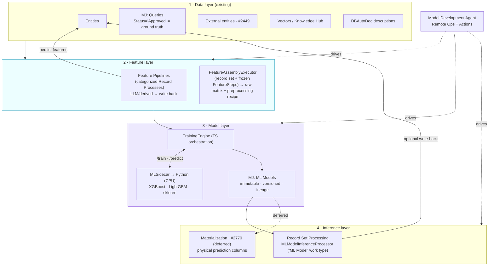

The differentiation is **data assembly + agentic search over MJ's entire data surface**, not algorithmic innovation. We are deliberately rigid about algorithms (a fixed 6-algorithm catalog) and flexible about data. This is **CPU-bound, no GPU** — gradient boosting / logistic regression / random forest / small MLP on tabular data train in seconds-to-minutes on CPU, matching MJ's API-runtime infra.

| Layer | Owns | §|
|---|---|---|
| **1 · Data** (existing) | Entities, `MJ: Queries`, external entities (#2449), vectors, DBAutoDoc — all become feed-ins via `RunView`/`RunQuery` | — |
| **2 · Feature** | `FeatureAssemblyExecutor` (the single correctness backbone) + Feature Pipelines (persisted derived features) | §4, §11 |
| **3 · Model** | `MLSidecar` + `TrainingEngine` → immutable versioned `MJ: ML Models` | §2, §5 |
| **4 · Inference** | `MLModelInferenceProcessor` (RSP work type); population-wide indexed columns are deferred to #2770 | §6, §16 |

---

## 2. The self-managing Python sidecar

**Node is poor for ML training; Python is excellent.** So MJ (TypeScript) assembles the matrix and orchestrates, and a Python sidecar does the CPU-bound fitting and inference. The key engineering choice: the sidecar is **self-managing and Docker-free by default**.

### 2.1 `MLSidecar` — managed-spawn is the default

`MLSidecar` (`packages/AI/PredictiveStudio/Sidecar/src/ml-sidecar.ts`) follows the **`@memberjunction/sqlglot-ts` pattern**: the Python microservice is *bundled* inside the npm package (`src/python/`) and the TypeScript class spawns it as a child process on demand. **No Docker is required for local or embedded use.**

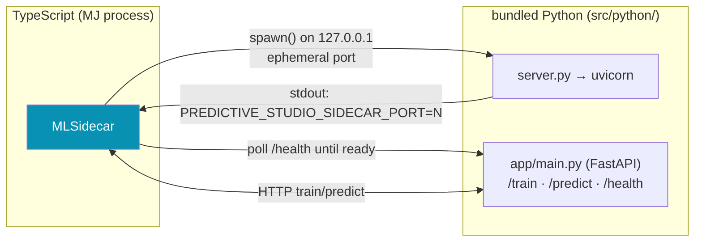

Two topologies, chosen automatically:

| Mode | When | What `start()` does |
|------|------|---------------------|
| **Managed** (default) | nothing configured | Spawns the bundled FastAPI service on `127.0.0.1` with an **OS-assigned ephemeral port**, reads `PREDICTIVE_STUDIO_SIDECAR_PORT=<n>` from its stdout, polls `/health` until ready, and registers SIGINT/SIGTERM/exit cleanup so the child dies with the parent. |
| **Remote** | `url` option **or** `PREDICTIVE_STUDIO_SIDECAR_URL` env set | Connects only — no child process — and just verifies `/health`. Use for a containerized/horizontally-scaled sidecar. `stop()` is then a no-op (this client never owned the process). |

The public surface (`Sidecar/src/index.ts`): `MLSidecar`, `SidecarError`, plus the `MLSidecarOptions` and `SidecarHealthResponse` types.

```typescript
import { MLSidecar } from '@memberjunction/predictive-studio-sidecar';

const s = new MLSidecar();   // managed mode by default
await s.start();             // spawns the bundled Python service

const trained = await s.train({ /* TrainRequest */ });
const { predictions } = await s.predict({ /* PredictRequest */ });

await s.stop();              // SIGTERM the child (no-op in remote mode)
```

`MLSidecar` exposes `IsRemote`, `IsRunning` (remote always `true`; managed needs a live child), and `Port` (ephemeral in managed, `null` in remote). On macOS it automatically appends `DYLD_LIBRARY_PATH=/opt/homebrew/opt/libomp/lib` to the spawn environment so XGBoost/LightGBM find the OpenMP runtime.

### 2.2 `npm run setup:python` — the one-time bootstrap

Managed mode spawns a Python interpreter, so the bundled virtualenv must exist:

```bash
cd packages/AI/PredictiveStudio/Sidecar
npm run setup:python      # creates .venv and pip-installs src/python/requirements.txt
brew install libomp       # macOS only — XGBoost/LightGBM OpenMP runtime (Linux: libgomp1)
```

The pinned `requirements.txt` includes FastAPI + uvicorn, `xgboost`, `lightgbm`, `scikit-learn`, `numpy`, `pandas`, `joblib`, and the test deps. The setup script (`scripts/setup-python.mjs`) creates the venv, upgrades pip, and installs requirements; `MLSidecar` defaults its interpreter to that bundled `.venv` (falling back to `python3`, or an explicit `pythonPath` option).

### 2.3 The HTTP contract

The contract is defined **once** in `@memberjunction/predictive-studio-core` (`sidecar-contract.ts`) and mirrored by the Python Pydantic models (`app/schemas.py`). MJ assembles the matrix; the sidecar fits and serves.

| Endpoint | Request → Response | Role |
|---|---|---|
| `GET /health` | → `SidecarHealthResponse` (`status`, `algorithms[]`, `cached_models`) | liveness + registered driver keys + warm-cache depth |
| `POST /train` | `TrainRequest` → `TrainResponse` | **fits** preprocessing + estimator; returns artifact + `fitted_preprocessing` + metrics + importance + holdout metrics |
| `POST /predict` | `PredictRequest` → `PredictResponse` | **applies** frozen preprocessing only; returns aligned `predictions[]` |

The Python side: `server.py` resolves the port (0 → OS picks free), prints `PREDICTIVE_STUDIO_SIDECAR_PORT=<n>` to stdout, and runs uvicorn; `app/main.py` is the FastAPI app and the train/score flow; `app/algorithms.py` is the driver registry (the `DriverClass` values seeded in `MJ: ML Algorithms`: `xgboost`, `lightgbm`, `logistic_regression`, `random_forest`, `ridge`, `mlp`); `app/preprocessing.py` is the fit/transform anti-skew core (§4.2); `app/artifacts.py` serializes the model envelope and runs the **warm LRU model cache** (max 32, SHA-256 keyed) that keeps single-record interactive scoring fast; `app/metrics.py` computes the deterministic metrics that drive the leaderboard.

**Model artifact envelope** (base64 on the wire, stored in MJStorage): `{ format: "joblib", version, payload_b64, fitted_preprocessing, feature_schema }`. The fitted preprocessing travels *with* the model — that is the anti-skew payload (§4.2).

---

## 3. The type contracts (`@memberjunction/predictive-studio-core`)

The shared vocabulary across the sidecar, the engine, the UI, and the agent. **Six modules:**

| File | Defines |
|---|---|
| `sidecar-contract.ts` | `TrainRequest`/`TrainResponse`, `PredictRequest`/`PredictResponse`, `FeatureSchemaEntry`, `PreprocessingOp`, `ValidationConfig`, `MatrixData`, `Prediction`; scalars `FeatureKind`, `ProblemType`, `ModelMetrics`, `FeatureImportance`, `FittedPreprocessing` |
| `pipeline-spec.ts` | `SourceBinding`, `AsOfStrategy`, `LeakageGuard`, `ValidationStrategy` (the declarative shape of a training pipeline) |
| `feature-steps.ts` | the visual **FeatureStep DAG** — a discriminated union on `Kind` (**8 kinds**: `select`/`impute`/`standardize`/`onehot`/`bin`/`embedding`/`llm-derived`/`flow-agent`/`vision-llm`) + `FeatureStepGraph` |
| `modeling-plan-spec.ts` | `ModelingPlanSpec` (the Model Development Agent's strongly-typed payload), `Budget`, `LeaderboardEntry` |
| `modeling-plan-schema.ts` | **Zod** `ModelingPlanSpecSchema` / `BudgetSchema` + `validateModelingPlanSpec()` / `validateBudget()` — the **runtime** plan/budget validators the Start-Experiment op and Run-Experiment action call before any iteration runs |
| `metrics-util.ts` | `isErrorMetric(metricKey)` + the canonical **lower-is-better** key set (`rmse`/`mae`/`mse`/`loss`/`logloss`/`log_loss`) — lifted to Core so the leaderboard (§7) and the challenger-vs-incumbent comparison (§14) **cannot drift** on metric direction |

```typescript
import type { ModelingPlanSpec, TrainRequest, FeatureStepGraph } from '@memberjunction/predictive-studio-core';
import { validateModelingPlanSpec, isErrorMetric } from '@memberjunction/predictive-studio-core';
```

> **Note on dependencies:** Core is *almost* pure types, but it carries **one** runtime dependency — `zod` — for `modeling-plan-schema.ts`. Plan/budget validation is a correctness invariant shared by every consumer, so it lives in Core (push-to-generic) rather than being re-implemented per call site. Everything else in the package is interfaces and union types.
>
> **Import the sidecar contract types from *here*, not from the Sidecar package** (which only re-uses them). Re-exporting cross-package shapes is forbidden by root `CLAUDE.md` rule 5.

---

## 4. The FeatureAssembly executor — the correctness backbone

`FeatureAssemblyExecutor` (`Engine/src/feature-assembly/feature-assembly-executor.ts`) is the single most important piece of the system. Its one public method —

```typescript
public async assemble(params: FeatureAssemblyParams): Promise<FeatureAssemblyResult>
```

— turns `(record set, frozen FeatureSteps spec) → feature matrix`, and it is the **single code path** for every context. That single-path property is what prevents train/serve skew *by construction*.

### 4.1 One executor, three contexts

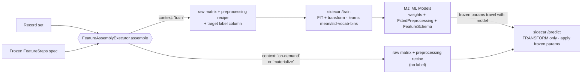

`AssemblyContext` is `'train' | 'materialize' | 'on-demand'`. The same code assembles features in all three, so a feature computed at training time is computed *identically* at scoring time.

### 4.2 The raw-vs-preprocessing split (anti train/serve skew)

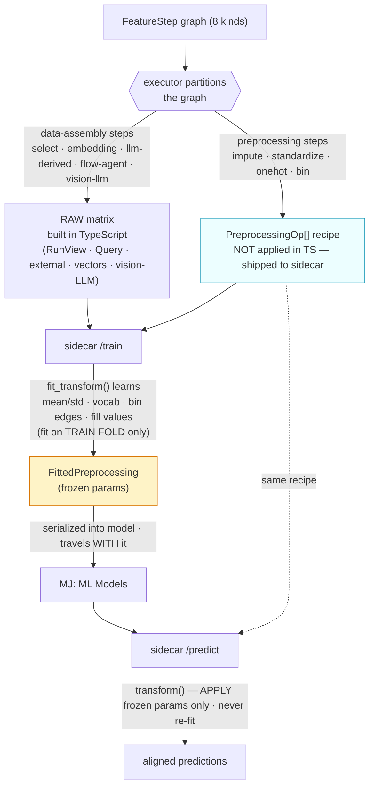

This is the subtle, critical design. The TypeScript executor (`partitionSteps`) partitions the FeatureStep graph into **two kinds of step**:

- **Data-assembly steps** (`select`, `embedding`, `llm-derived`, `flow-agent`, **`vision-llm`**) → produce the **raw matrix** in TypeScript, drawing from `RunView`/`RunViews`, Query bindings, external entities, persisted vectors, and (for `vision-llm`) a per-row vision prompt (§12 note: it's a *dedicated* kind, distinct from `llm-derived`).
- **Preprocessing steps** (`impute`, `standardize`, `onehot`, `bin`) → are **NOT applied in TypeScript**. They are emitted as a `PreprocessingOp[]` recipe and shipped to the sidecar.

> **Why:** Stateful transforms (normalization mean/std, one-hot vocabulary, bin edges, imputation fill values) must be **fit once on the training data** and then *only applied* — never re-fit — at inference. The sidecar (`app/preprocessing.py`) does exactly this: `fit_transform()` at `/train` learns the params and returns them as `fitted_preprocessing`; `transform()` at `/predict` only applies those frozen params ("APPLY ONLY, never re-fit"). The fitted preprocessing is serialized into `MLModel.FittedPreprocessing` alongside the weights and **travels with the model**. This is why `FeatureSchema` alone is insufficient: the fitted pipeline is part of the model's identity. The Python golden test (`src/python/tests/test_preprocessing_golden.py`) locks this down — the same raw row produces an identical transformed vector at train and at predict.

> **Recently hardened — the validation fit lives *inside* the split.** When the sidecar reports *validation* metrics, it does **not** fit preprocessing on the whole dataset and then split. `_fit_and_score` splits the dev rows by index *first*, then `_anti_skew_val_metrics` calls `preprocessing.fit_transform(...)` on the **train fold only** and `preprocessing.transform(...)` (apply-only) on the validation fold — *"so the validation fold never leaks into the fitted params."* The result is an **honest, non-optimistic** validation estimate. The production estimator and the frozen `fitted` payload that ships with the model are still fit on all dev data (that's correct — the shipped model should use every available row); the hardening is specifically that the *reported* validation number isn't inflated by fitting preprocessing across the split.

### 4.3 Point-in-time / "as-of" assembly

The single biggest **new** correctness primitive — nothing else in MJ provides it (`feature-assembly/as-of.ts`). For forward prediction, features must be assembled **as they were at the decision point** (e.g. 90 days before the renewal window), not as they are today. Computing `days_since_last_activity` at training time over *post-decision* data leaks the future and produces a model that looks brilliant in validation and useless in production.

`AsOfStrategy` (on the pipeline) has three modes:

| Mode | Behavior |
|---|---|
| `none` | features assembled as-of "now" (no time-relative correctness) |
| `column` | a decision-date column on each training unit defines that record's cutoff |
| `offset` | `OffsetDays` before the label event defines the cutoff |

Time-relative feature logic (`daysSinceLastActivityAsOf`, `activityCountAsOf`, …) filters dated source rows to each record's cutoff, so training "as-of-then" and scoring "as-of-now" stay consistent. A golden test proves no future leakage for `offset` mode.

### 4.4 The leakage guard

An automated feature-search agent will relentlessly exploit target leakage (a field that's a proxy for the label → AUC ~0.99 garbage). Two complementary defenses live in `feature-assembly/leakage-guard.ts`:

1. **Deny-list enforcement (assembly-time).** `LeakageGuardEnforcer` normalizes the `LeakageGuard.DenyFields` / `DenySources` into case-insensitive sets; deny-listed fields/sources are filtered out of the matrix **before any column is produced** (`isFieldAllowed`, `isSourceAllowed`, `partitionColumns`).
2. **Single-feature-dominance detection (post-train).** `detectSingleFeatureDominance(featureImportance, threshold)` normalizes the importance map to shares of total importance (using magnitudes, so signed coefficients work) and flags when the top feature's share exceeds `SingleFeatureDominanceThreshold` (e.g. `0.6`).

> When a run is flagged, the system does **not** silently proceed and does **not** auto-promote. It surfaces a clear, **business-person-friendly** warning — *"One field is doing almost all the predicting — this often means we're accidentally peeking at the answer. A human should confirm this is legitimate before we trust this model."* — and **blocks promotion** until a human signs off with an auditable reason (the promotion sign-off gate, §13).

---

## 5. Training — immutable versioned models with honest metrics

`TrainingEngine` (`Engine/src/training/training-engine.ts`) orchestrates the whole train path:

```typescript
public async trainModel(input: TrainModelInput, deps: TrainingDeps): Promise<TrainModelResult>
```

The flow:

1. **Resolve the pipeline** — parse the `MJ: ML Training Pipelines` JSON config (sources, feature steps, as-of, leakage guard, validation).
2. **Create the run row** — `MJ: ML Training Runs` (`Status='Running'`).
3. **Assemble** — call `FeatureAssemblyExecutor` with `context='train'` → raw matrix + schema + preprocessing recipe.
4. **Carve the locked holdout FIRST** — a leading `LockedHoldoutFraction` slice the search *never sees*, scored exactly once on the final model (§5.1).
5. **Call the sidecar `/train`** — get back the artifact, `fitted_preprocessing`, train+validation metrics, feature importance, and `holdout_metrics`.
6. **Persist the artifact** to MJStorage (`MJ: Files`) via an injected store.
7. **Create the immutable `MJ: ML Models` row** (`Status='Draft'`) carrying `FittedPreprocessing`, `FeatureSchema`, `Metrics`, `HoldoutMetrics`, `FeatureImportance`, and full `Lineage`.
8. **Leakage check** — run `detectSingleFeatureDominance`; a dominant feature flags the run and blocks auto-promotion.
9. **Finalize the run** (`Completed`/`Failed`, results, costs, notes).

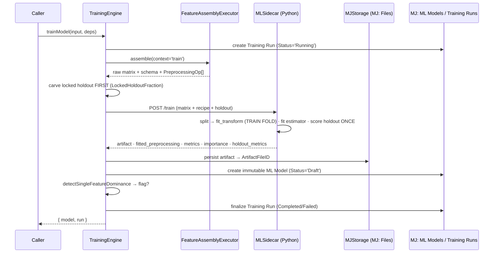

The engine is built on **dependency-injection seams** (`src/training/types.ts` + `src/training/seams.ts`): `IEntityFactory`, `IRecordLoader`, `ISidecarTrainer`, `IArtifactStore`. Production wires `MetadataEntityFactory`, `RunViewRecordLoader`, `MJSidecarTrainer`, and `MJFilesArtifactStore`; tests substitute in-memory fakes (which is what makes the engine unit-testable with no DB and no live sidecar — see the live integration test in §18.4).

### 5.1 Validation discipline + locked holdout

Be opinionated; don't ship broken models. Default to a train/test split with overfitting detection; optional k-fold and holdout. The decisive primitive is the **locked final holdout** — a slice the search never sees (`carveLockedHoldout()` leads the split), scored *exactly once* on the promoted model → `MLModel.HoldoutMetrics` is the **honest number**. This prevents leaderboard optimism and the multiple-comparisons overfitting an automated search inevitably produces. The holdout is scored through the frozen apply-only path (the same `transform()` inference uses), so it measures exactly what production will see. Deterministic scoring (AUC/F1/accuracy/RMSE) drives the loop.

> The integration test (§18.4) asserts this end-to-end: the holdout is carved *before* training, scored *once* on the final model, and the resulting `HoldoutMetrics.auc` clears **0.70** for both XGBoost and Logistic Regression on a deliberately noisy synthetic signal.

### 5.2 `MJ: ML Models` is distinct from `MJ: AI Models`

| | `MJ: AI Models` | `MJ: ML Models` |
|---|---|---|
| What | off-the-shelf foundation models we **call** (LLMs, embeddings, image-gen) | predictive models we **train** from client data |
| Inference path | vendor API + driver class | the **Python sidecar** |
| Produced by | seeded vendor metadata | a `TrainingEngine` run |

An ML Model is **immutable + versioned** — each successful run yields a new row, never a mutation. It may *reference* an AI Model in its `Lineage` (e.g. the embedding model used to build features) — a pointer, not membership. The generated entity classes are `MJMLModelEntity` / `MJMLTrainingPipelineEntity` in `@memberjunction/core-entities`. Its lifecycle is the **Draft → Validated → Published → Archived** state machine enforced at promotion (§13).

---

## 6. Scoring — a Record Set Processing work type

Scoring composes onto **Record Set Processing** (see the [Record Set Processing Guide](RECORD_SET_PROCESSING_GUIDE.md)) rather than re-implementing batching/concurrency/audit. `MLModelInferenceProcessor` (`Engine/src/scoring/ml-model-inference-processor.ts`) is a new **work type** alongside the substrate's built-in `FieldRules` / `Action` / `Agent` / `Infer`:

```typescript
@RegisterClass(MLModelInferenceProcessor, 'ML Model')
export class MLModelInferenceProcessor implements IRecordProcessor {
  public async ProcessRecord(record: RecordRef, context: RecordProcessorContext): Promise<RecordResult>
  public async ProcessBatch(records: RecordRef[], context: RecordProcessorContext): Promise<RecordResult[]>
}
```

> **⚠️ Disambiguation:** the existing **`Infer`** work type runs an **AI Prompt** per record — that is LLM inference, **not** ML inference. The new **`ML Model`** work type (`MLModelInferenceProcessor`) runs a **trained ML model** through the sidecar. Don't confuse them. (The [Record Set Processing Guide](RECORD_SET_PROCESSING_GUIDE.md) §4 carries the same disambiguation note.)

### 6.1 How it plugs in without forking the substrate

The `record-set-processor` base package must **not** depend on Predictive Studio. So instead of editing `RecordProcessExecutor.buildProcessor()`, the processor registers itself on the **MJGlobal ClassFactory** via `@RegisterClass` — primary key `'ML Model'` (on the decorator) and alias `'MLModelInference'` (registered in `src/scoring/register.ts`). A thin `resolveMLInferenceProcessor(workType, options)` pulls it back out by work-type key; `isMLInferenceWorkType()` gates membership; `LoadMLModelInferenceProcessor()` is the tree-shaking anchor. A supervisor wires this into the executor seam — no change to the base substrate. This is the generic pluggable-processor registry working exactly as designed: a new work type ships as a registered class, not a fork.

### 6.2 Per-record flow + warm model cache

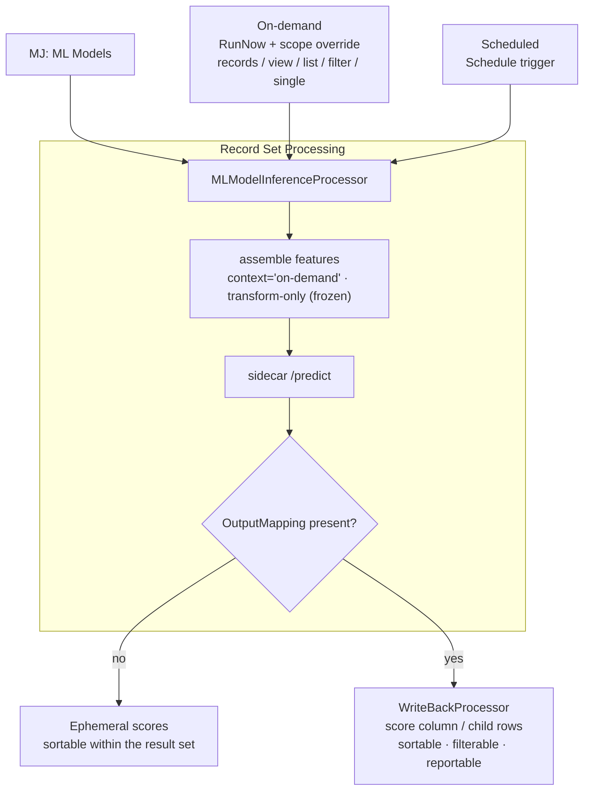

The processor **warm-loads the model once** and shares it across the batch (an in-flight `loadPromise` deduplicates concurrent records). It resolves the assembly config from the model's `Lineage` (or the related pipeline), assembles features in `'on-demand'` context (**transform-only — never re-fits**), calls the sidecar `/predict`, and returns a `RecordResult` with an `MLInferenceResultPayload` (`modelId`, `target`, `problemType`, `score`, `class`).

### 6.3 Ephemeral vs write-back

**Ephemeral by default; write-back when an `OutputMapping` is present.** The processor itself only produces the result payload (sortable within the result set). The substrate's shared `WriteBackProcessor` decorator — not the ML processor — applies the `OutputMapping` when configured, writing a prediction column to the entity (or a child record). Written-back predictions become sortable/filterable/reportable like any column. This is the same write-back mechanism every Action/Agent/Infer work type uses, so the ML scorer inherits it for free.

### 6.4 Single, batch, on-demand, scheduled

The sidecar doesn't care about cardinality — single-record serves interactive/agent needs, batch serves bulk. **On-demand** = `RecordProcess.RunNow` + a runtime scope override (records/view/list/filter/single). **Scheduled** = the `Schedule` trigger, with an `MJ: ML Model Scoring Binding` (`upsertScoringBinding`) recording lineage (`LastScoredAt` / `LastRowCount`) for staleness detection and retraining (§14). **Materialized** prediction columns (population-wide, indexed) are the *deferred* later optimization gated on #2770 (§16); scoring + write-back ship with **zero dependency** on it.

---

## 7. The experiment engine — a generic agentic-search primitive

`Experiment` → `ExperimentSession` → `ExperimentSessionIteration` are deliberately **GENERIC, ML-agnostic, reusable** primitives: a budgeted, plan-then-execute-then-refine agentic search that groups N iterations with a leaderboard and an owning agent run. **Predictive Studio is the first consumer** (the ML leaf is `MJ: ML Training Runs`, which FKs into an iteration), but the same three tables are intended to back prompt-optimization, agent-config search, and eval sweeps — each with its own leaf run table.

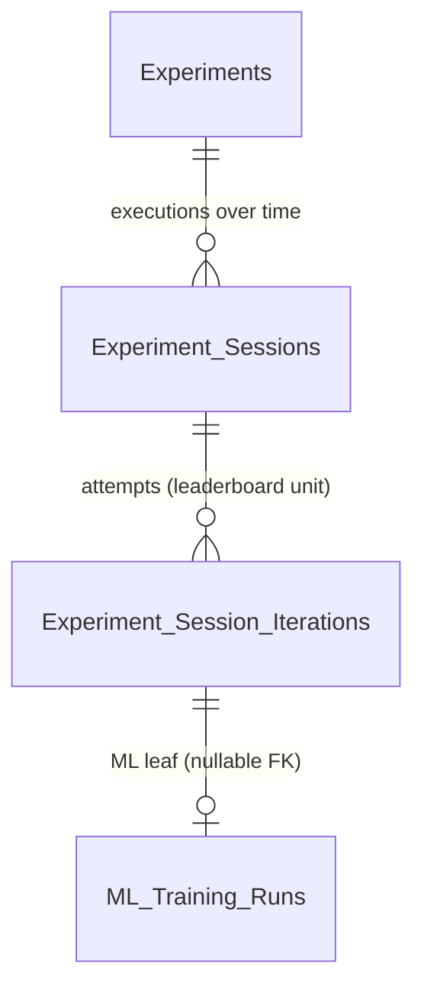

- **`MJ: Experiments`** — the durable "what we're optimizing," independent of any execution. `ExperimentType` is an **open NVARCHAR** (no CHECK) so new consumers add types without a migration. Re-running monthly creates new sessions under the same Experiment for comparison over time.
- **`MJ: Experiment Sessions`** — one execution. Carries the `Budget` (JSON), the approved `PlanSpec` (for PS, the `ModelingPlanSpec`), a `Leaderboard` snapshot, and `AgentRunID`.
- **`MJ: Experiment Session Iterations`** — one attempt, the **leaderboard unit**. Carries `Sequence`, `Status`, the normalized `Score` (the Experiment's `TargetMetric`), `ComputeCost`/`TokensUsed`, `Rationale`, and the driving `AIAgentRunID`.

### 7.1 The wave orchestrator

`ExperimentOrchestrator` (`Engine/src/experiment/experiment-orchestrator.ts`) is **deterministic** TS that executes an *already-approved* `ModelingPlanSpec`:

```typescript
public async runSession(plan: ModelingPlanSpec, deps: ExperimentDeps, options?: ExperimentRunOptions): Promise<ExperimentSessionResult>
```

It asserts `plan.Approved === true` (the approval gate is the agent's job, not the orchestrator's) and runs iterations in **waves through Record Set Processing**:

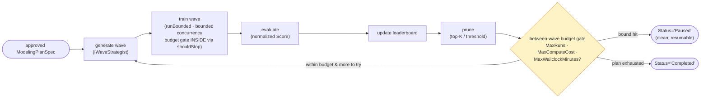

| Concern | How |
|---|---|
| **Wave generation** | the `IWaveStrategist` seam — default `PlanOrderWaveStrategist` (priority order); swap in an LLM-backed strategist for adaptive "what next" without touching the orchestrator |
| **Leaderboard** (`src/experiment/leaderboard.ts`) | `LeaderboardEntry[]` ranked by a **normalized** score (prefers `HoldoutMetrics`, falls back to training metrics; error metrics negated via Core's `isErrorMetric` so higher always = better) |
| **Pruning** | `selectPrunedIterationIds()` — top-K / relative-threshold rules; pruned iterations marked `Pruned` + removed from the leaderboard |
| **Budget gate** | `MaxRuns` / `MaxComputeCost` / `MaxWallclockMinutes` checked **both** between waves *and inside the bounded runner* (see below) |
| **Concurrency** | `runBounded()` (`src/experiment/concurrency.ts`) with a configurable max |

> **The budget gate is enforced *inside* the bounded runner, not just between waves.** As each iteration completes within a wave, `foldOutcome` folds its cost into `budgetState` immediately and re-checks `checkBudget(...)`; if a bound trips it sets `stopReason`, which feeds `runBounded`'s `shouldStop` predicate (each worker calls `if (shouldStop && shouldStop()) return;` before claiming its next task). The comment is explicit: *"fold each completed train into the leaderboard + budget IMMEDIATELY as it finishes … so the `shouldStop` predicate sees up-to-date budget state and can halt further dispatch the instant a bound trips — no in-flight overrun."* There is also a between-waves gate (`gateBeforeWave`) and a `trimWaveToBudget`, but the in-wave `shouldStop` is the tight enforcement.

A session may spawn **one Process Run per wave** (the two are kept distinct, no hard FK in v1). Because scoring *also* composes onto Record Set Processing, the whole feature shares one batching/budget/audit substrate. Like the other engines, the orchestrator is built on injectable seams (`IExperimentEntityFactory`, `IClock`, `IExperimentTrainer`, `IWaveStrategist` — `src/experiment/types.ts` / `seams.ts`).

---

## 8. The data model — entities and relationships

10 core entities. CodeGen generates timestamps, FK indexes, sprocs, views, and the strongly-typed entity classes (`MJMLModelEntity`, `MJMLTrainingPipelineEntity`, …) in `@memberjunction/core-entities`. Names follow the MJ "MJ: " prefix convention. The three `Experiment*` tables are **generic** (ML-agnostic); everything `ML *` is the Predictive Studio leaf.

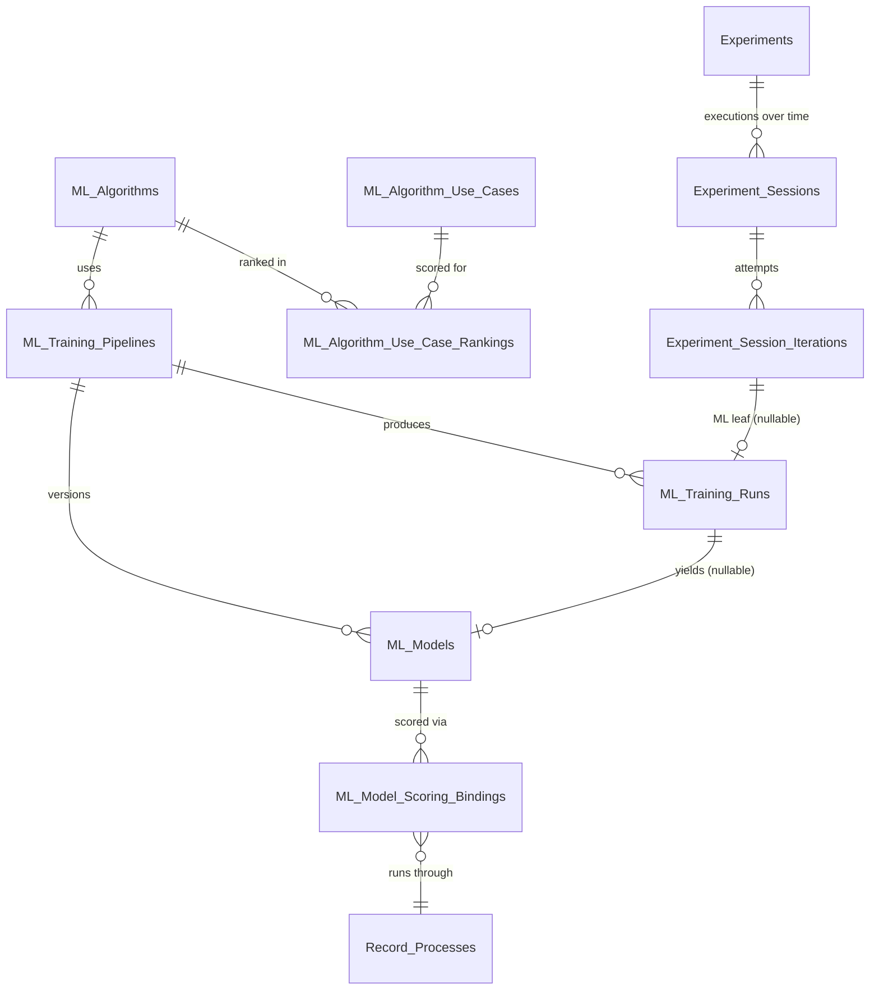

_(Entity names shown without the "MJ: " prefix for diagram clarity. `Record_Processes` is the existing Record Set Processing entity — Feature Pipelines are categorized rows of it (§11), not a separate entity. `MaterializedResultID` on a scoring binding is a **soft** reference to #2770's table — not a FK until that table exists.)_

| Entity | Role | Key fields |
|---|---|---|
| `MJ: ML Algorithms` | the fixed 6-algorithm catalog | `ProblemTypes`, `DriverClass` (sidecar key), `HyperparameterSchema`, `DefaultHyperparameters`, `SupportsFeatureImportance` |
| `MJ: ML Algorithm Use Cases` | 7 decision-relevant scenarios | `ProblemTypeScope`, `Guidance`, `DisplayOrder` |
| `MJ: ML Algorithm Use Case Rankings` | the 6×7 join (42 rows) | `SuitabilityScore` (1–5), `RecommendationLevel`, `Rationale`; UNIQUE(Algorithm, UseCase) |
| `MJ: ML Training Pipelines` | declarative training definition | `TargetEntityID`, `TargetVariable`, `ProblemType`, `AlgorithmID`, `SourceBindings`, `FeatureSteps`, `AsOfStrategy`, `LeakageGuard`, `ValidationStrategy` |
| `MJ: ML Models` | **immutable, versioned** trained model | `FittedPreprocessing`, `FeatureSchema`, `Metrics`, `HoldoutMetrics`, `FeatureImportance`, `Lineage`, `ArtifactFileID`, `Status` (Draft/Validated/Published/Archived) |
| `MJ: ML Training Runs` | one training attempt (iteration leaf) | `PipelineID`, `ResultingModelID`, `ExperimentSessionIterationID` (nullable), `ValidationResults`, `ComputeCost`, `TokensUsed` |
| `MJ: Experiments` | durable "what we optimize" (generic) | `ExperimentType` (open NVARCHAR), `Goal`, `TargetMetric`, `PlanSpecTemplate` |
| `MJ: Experiment Sessions` | one execution (generic) | `ExperimentID`, `Budget`, `PlanSpec`, `Leaderboard`, `AgentRunID` |
| `MJ: Experiment Session Iterations` | one attempt / leaderboard unit (generic) | `Sequence`, `Status`, `Score`, `ComputeCost`, `TokensUsed`, `Rationale`, `AIAgentRunID` |
| `MJ: ML Model Scoring Bindings` | lineage for scoring/retraining | `MLModelID`, `RecordProcessID`, `TargetEntityID`/`TargetColumn`, `Mode`, `MaterializedResultID` (soft), `LastScoredAt`, `LastRowCount` |

> **CLAUDE.md rule 2b reminder:** don't write code against new fields until the migration + CodeGen have run. All ML reference data (`ml-algorithms/`, `ml-algorithm-use-cases/`, `ml-algorithm-use-case-rankings/`) is seeded via **metadata files + `mj sync push`**, never SQL INSERTs.

---

## 9. The guidance layer — algorithm catalog + the 6×7 matrix

Neither the agent nor a non-expert user should have to guess which algorithm fits. Three seeded metadata entities encode evidence-based defaults:

- **`MJ: ML Algorithms`** — the fixed, curated catalog (6 algorithms): XGBoost, LightGBM, Logistic Regression, Random Forest, Linear/Ridge Regression, MLP. Each row declares `ProblemTypes`, `DriverClass` (the sidecar key), `HyperparameterSchema`, `DefaultHyperparameters`, and `SupportsFeatureImportance`.
- **`MJ: ML Algorithm Use Cases`** — **decision-relevant** scenarios that genuinely differentiate algorithms (7 of them), NOT business labels (churn/renewal/attendee-return are all the same *binary classification* shape and so don't differentiate). E.g. "Binary classification", "Regression", "Interpretability required", "Minimal tuning (business-user)", "Large/wide dataset (speed)", "Embedding/LLM-feature-heavy", "Small dataset".
- **`MJ: ML Algorithm Use Case Rankings`** — the **6×7 join** (42 rows). Each cell carries a `SuitabilityScore` (1–5), a `RecommendationLevel` (`Primary` / `Strong` / `Viable` / `Weak` / `NotRecommended`), and the real payoff: a **`Rationale`** (agent- and human-readable, e.g. *"Gives feature importances but not simple coefficients — if a stakeholder needs to see exactly why each prediction was made, prefer Logistic/Ridge."*).

The seeded recommendation matrix (the per-cell `Rationale` is the real payoff):

| Use case ↓ / Algo → | XGBoost | LightGBM | Logistic Reg | Random Forest | Linear/Ridge | MLP |
|---|---|---|---|---|---|---|
| Binary classification | **Primary** | Strong | Viable | Strong | NotRec | Viable |
| Regression | **Primary** | Strong | NotRec | Strong | Strong | Viable |
| Interpretability required | Weak | Weak | **Primary** | Viable | **Primary** | NotRec |
| Minimal tuning (business-user) | Viable | Viable | Strong | **Primary** | Strong | Weak |
| Large/wide dataset (speed) | Strong | **Primary** | Strong | Viable | Strong | Viable |
| Embedding/LLM-feature-heavy | Strong | Strong | Viable | Viable | Viable | **Primary** |
| Small dataset | Viable | Viable | **Primary** | Strong | **Primary** | Weak |

All three are seeded via **metadata files** (`metadata/ml-algorithms/`, `metadata/ml-algorithm-use-cases/`, `metadata/ml-algorithm-use-case-rankings/`) with `@lookup:` refs and `mj sync push` — **never SQL INSERTs**. The dashboard's catalog panel and the Experiment Designer both query this matrix for ranked, rationale-bearing recommendations per scenario (the UI computes "best level across selected scenarios" via `PredictiveStudioEngine.BestLevelsForScenarios`).

---

## 10. The invocation surface — Actions vs Remote Operations

Every server-side capability is a **Remote Operation** (Manual mode) + (for the four agent-facing ones) a thin **Action**, so the browser, Skip, Query Builder, and agents all inherit it. See the [Remote Operations Guide](REMOTE_OPERATIONS_GUIDE.md) and [Transport-Layer Architecture Guide](TRANSPORT_LAYER_ARCHITECTURE_GUIDE.md). **Crucially, both surfaces delegate through one shared path** (`operations/delegation.ts`) — the production deps/seams wiring exists exactly once, so an Action and its sibling Remote Op can't diverge.

### 10.1 The 6 Remote Operations

All are `@RegisterClass(BaseRemotableOperation, '<key>')` Manual-mode subclasses of CodeGen-emitted bases in `MJCoreEntities/src/generated/remote_operations.ts`; the subclass bodies live in `Engine/src/operations/`. Every one carries `RequiredScope = 'predictive:execute'` and is seeded as an `MJ: Remote Operations` row (`metadata/remote-operations/.remote-operations.json`, category "Predictive Studio", `GenerationType='Manual'`, `CodeApprovalStatus='Approved'`).

| Operation key | Server class | Mode | Delegates to |
|---|---|---|---|
| `PredictiveStudio.TrainModel` | `PredictiveStudioTrainModelServerOperation` | `LongRunning` | `trainModelViaEngine` → `TrainingEngine.trainModel` |
| `PredictiveStudio.ScoreRecordSet` | `PredictiveStudioScoreRecordSetServerOperation` | `LongRunning` | `scoreRecordSetViaRunner` → `ProductionScoreRecordSetRunner` → `MLModelInferenceProcessor` |
| `PredictiveStudio.RunFeaturePipeline` | `PredictiveStudioRunFeaturePipelineServerOperation` | `LongRunning` | `RecordProcessExecutor.RunByID` (the RSP substrate — §11) |
| `PredictiveStudio.StartExperimentSession` | `PredictiveStudioStartExperimentSessionServerOperation` | `LongRunning` | `runExperimentSessionViaOrchestrator` → `ExperimentOrchestrator.runSession` |
| `PredictiveStudio.ControlExperimentSession` | `PredictiveStudioControlExperimentSessionServerOperation` | `Sync` | a lifecycle `Status` write on the `MJ: Experiment Sessions` row (pause/resume/cancel) |
| `PredictiveStudio.PromoteModel` | `PredictiveStudioPromoteModelServerOperation` | `Sync` | `promoteModelViaGate` → `ProductionModelPromotionGate` (§13) |

The four `LongRunning` ops emit `context.emitProgress({ OperationKey, Processed, Total?, Status, Message })`. **RunFeaturePipeline is the richest** — it forwards the RSP executor's per-batch `onProgress` as typed progress, so attached *and* over-the-wire callers see live progress (mirroring `RecordProcess.RunNow`); Train/Score/StartExperiment emit coarse start/finish phases (the underlying engines expose no per-step hook). The wire input/output types are defined inline in the generated `remote_operations.ts`; `Budget` and `ModelingPlanSpec` come from Core and are runtime-validated by `validateBudget` / `validateModelingPlanSpec` before any work runs. Tree-shaking anchor: `LoadPredictiveStudioOperations()`.

### 10.2 The 4 Actions

For the agent / workflow / low-code boundary, four ops also have thin Actions in `Engine/src/actions/` (all extend `BasePredictiveStudioAction` → `BaseAction`, registered via `@RegisterClass(BaseAction, '<DriverClass>')`, seeded in `metadata/actions/predictive-studio/`):

| Action (`MJ: Actions`) | DriverClass | Delegates to |
|---|---|---|
| Train ML Model | `PredictiveStudioTrainModelAction` | `TrainingEngine.trainModel` |
| Score Record Set | `PredictiveStudioScoreRecordSetAction` | `ProductionScoreRecordSetRunner` → `MLModelInferenceProcessor` |
| Run Experiment Session | `PredictiveStudioRunExperimentAction` | `ExperimentOrchestrator.runSession` |
| Promote ML Model | `PredictiveStudioPromoteModelAction` | `ProductionModelPromotionGate` |

There is **no** "Control Experiment Session" or "Run Feature Pipeline" Action — those two exist only as Remote Operations (control is a UI/host concern; feature-pipeline running is the RSP facade). Tree-shaking anchor: `LoadPredictiveStudioActions()`.

### 10.3 Decision table — which surface do I reach for?

| You want to… | Use | Why |
|---|---|---|
| Have an **agent** train / score / run an experiment / promote | an **Action** | Actions are the metadata-discoverable code→agent boundary (see root `CLAUDE.md` Actions philosophy) |
| Have the **browser, Skip, or Query Builder** invoke a capability with typed I/O + `LongRunning` progress | a **Remote Operation** | typed, scope-gated (`predictive:execute`), marshalled identically client + server |
| **Read** ML models / runs / leaderboards / rankings for display | `RunView` / `RunViews` (or `PredictiveStudioEngine` in Angular) | plain reads — no need for an op; the engine caches reference data |
| **Score a set of records** as a saved, scheduled, audited job | a **Record Process** (`'ML Model'` work type) via `RecordProcess.RunNow` | inherits batching/concurrency/budget/pause/resume/audit (§6) |
| Run a **derived-feature pipeline** that writes attributes back | a **Feature Pipeline** = categorized Record Process, run via `RunFeaturePipeline` | reuses the whole RSP substrate (§11) |
| Call training/scoring **from other server-side code** | the **engine class directly** (`TrainingEngine`, `MLModelInferenceProcessor`) | never call an Action from code (root `CLAUDE.md`) — import the engine |

---

## 11. Feature Pipelines — the category route (no new entity)

A **Feature Pipeline** generalizes Content Autotagging (LLM classify → persisted tags): chain `LLM prompt / Action / Agent / vision → transform → write an attribute back to the row`. They have **standalone analytics value**, independent of any model, which is why they live in **Knowledge Hub** as well as feeding Predictive Studio.

**The key shipped decision: a Feature Pipeline IS a *categorized* `MJ: Record Processes` row — there is NO standalone `MJ: Feature Pipelines` entity.** (Verified: zero `MJ: Feature Pipelines` / `FeaturePipelineEntity` in generated code or migrations.) Reusing the Record Set Processing substrate means batching, resume, audit, and write-back all come for free; the only new thing is a category that marks a Record Process as a feature pipeline.

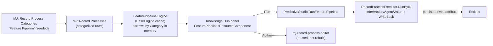

- **`FeaturePipelineEngine`** (`Engine/src/feature-pipelines/feature-pipeline-engine.ts`) — a `BaseEngine` singleton that caches all `MJ: Record Processes` + recent `MJ: Process Runs`, then narrows **in memory** to feature pipelines by matching the denormalized `Category` view field against `FEATURE_PIPELINE_CATEGORY_NAME = 'Feature Pipeline'` (case-insensitive, `isFeaturePipeline()`). It projects `FeaturePipelineSummary[]` (target entity, the written `OutputAttribute` parsed from `OutputMapping`, last-run freshness). It's a discovery/monitoring cache, not a registry.
- **Category seed** — `metadata/record-process-categories/.record-process-categories.json` seeds the one `MJ: Record Process Categories` row named "Feature Pipeline".
- **Run path** — `RunFeaturePipeline` (the only op with no PS-specific logic) delegates straight to `RecordProcessExecutor.RunByID(featurePipelineID, …)`. Running a feature pipeline is *exactly* running the underlying Record Process — full batching/resume/audit + true forwarded per-batch progress.
- **Knowledge Hub UI** — `FeaturePipelinesResourceComponent` (`@RegisterClass(BaseResourceComponent, 'FeaturePipelinesResource')`, `packages/Angular/Explorer/dashboards/src/KnowledgeHub/components/feature-pipelines/`) lists pipelines from the engine, shows target/written-attribute/freshness, offers **Run** (via the provider's `RouteOperation` seam → `RunFeaturePipeline`), and an **authoring** entry that opens the reusable `mj-record-process-editor` rather than rebuilding authoring.

---

## 12. The Model Development Agent + artifact + viewer

A **Loop** agent (conversational) mirroring **Agent Manager**: collaborate with the user to build a strongly-typed `ModelingPlanSpec`, get approval, then execute mostly with deterministic code (the `ExperimentOrchestrator`), then report with an LLM-authored rich artifact. **Seeded and shipped** — `metadata/agents/.model-development-agent.json`.

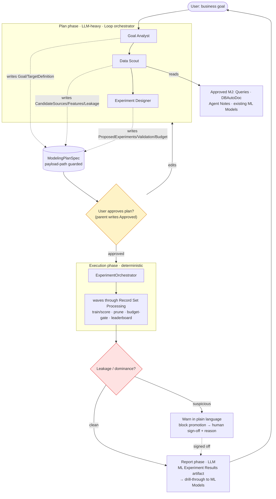

### 12.1 Topology — the agent and its three sub-agents

The parent **Model Development Agent** is a `Loop` agent (`ModelSelectionMode='Agent'`, `ArtifactCreationMode='Always'`, `DefaultArtifactTypeID → ML Experiment Results`, `InjectNotes=true`, `MaxNotesToInject=10`, `ExposeAsAction=true`). Its four wired Actions are the agent-facing PS Actions plus `Write Entity Field(s)`. Three sub-agents (all `Loop`, `InvocationMode='Sub-Agent'`) refine the plan:

| Sub-agent | ExecOrder | Writes (its payload slice) |
|---|---|---|
| **Goal Analyst** | 1 | refines the business goal → `Goal`, `TargetDefinition` (target + problem type + success metric) |
| **Data Scout** | 2 | studies the data → `CandidateSources`, `CandidateFeatures`, `LeakageNotes`; flags leakage risks |
| **Experiment Designer** | 3 | proposes ranked experiments + validation + budget → `ProposedExperiments`, `ValidationStrategy`, `ProposedBudget` |

**Sequencing is declarative, not hardcoded control flow** — it's enforced by metadata **payload-path guards**. Each sub-agent has `PayloadDownstreamPaths: ["*"]` (it can *read* the whole plan) and an `PayloadUpstreamPaths` list scoped to exactly the slice it's allowed to *write back* (e.g. Goal Analyst → `["Goal", "TargetDefinition", "TargetDefinition.*"]`). The parent holds `PayloadSelfWritePaths: ["Approved", "Leaderboard"]` — only the orchestrator stamps the approval gate and the execution-phase leaderboard.

### 12.2 Ground truth, drafted queries, memory

The **Data Scout** reads **ground truth only from approved sources**, wired via `MJ: AI Agent Data Sources`:
- `APPROVED_QUERIES` — `RunView` over `MJ: Queries` where `Status = 'Approved'` (the trusted semantic layer; *"Never hand-write raw SQL for feature extraction"*).
- `EXISTING_APPROVED_MODELS` — `MJ: ML Models` where `Status IN ('Published','Validated')`.
- **Agent Notes** — prior learnings (what worked, what leaked), auto-injected (`InjectNotes`).

When the Scout needs a query that doesn't exist, it may **draft a new `MJ: Query` as `Status='Pending'`** — usable for *this* exploration but **not** trusted ground truth until a human approves it into the shared semantic layer.

### 12.3 The artifact + the Angular viewer

The agent emits an **ML Experiment Results** artifact — content type **`application/vnd.mj.ml-experiment-results`** (`metadata/artifact-types/.ml-experiment-results-artifact-type.json`, `ParentID → JSON`, `DriverClass='MLExperimentResultsViewerPlugin'`, with `ExtractRules` for `name`/`description`/`displayMarkdown`/`bestModelId`/`leaderboardSize`).

The viewer is **`MLExperimentResultsViewerComponent`** (`@RegisterClass(BaseArtifactViewerPluginComponent, 'MLExperimentResultsViewerPlugin')`, `packages/Angular/Generic/artifacts/src/lib/components/plugins/ml-experiment-results-viewer.component.ts`, package `@memberjunction/ng-artifacts`). It renders the experiment **Goal** + headline best score, a ranked **leaderboard** (rank / algorithm / feature-set / score / cv-score / modelId), normalized **feature-importance** bars, a **winning-model card**, and an extra "Report" tab for the agent-authored markdown. **Drill-through** to a model emits a `NavigationRequest`:

```typescript
// OnDrillThroughToModel() / OnOpenRowModel(row)
{ appName: 'Predictive Studio', navItemName: 'Models', queryParams: { modelId } }
```

> **Stale-prose caveat:** the artifact-type **Description** field still says the Angular viewer "is a follow-up; falls back to the parent JSON viewer." That prose is out of date — the viewer is fully built, registered, and module-declared, and the `DriverClass` correctly points at it. Treat the description text as lagging reality.

---

## 13. The security model

Predictive Studio touches client data, runs arbitrary trained models against record sets, and lets an agent draft queries — so security is treated as a first-class concern, enforced at code boundaries, not by convention.

**1 · API scope gating (`predictive:execute`).** Every one of the 6 Remote Operations declares `RequiredScope = 'predictive:execute'` (on the generated base and on the seeded `MJ: Remote Operations` row). The scope itself is defined as an APIScope (`metadata/api-scopes/.predictive-scopes.json`, `FullPath: 'predictive:execute'`). An API key without that scope can't invoke train / score / run-feature-pipeline / experiment / promote. (Scope is a Remote Operations concept; Actions carry no scope — they run under the agent's own permissions.)

**2 · Primary-key field-NAME validation (injection guard) at the scoring boundary.** When `ProductionScoreRecordSetRunner` builds a SQL filter from caller-supplied primary keys, it validates each **key name** (not just the value) against the entity's real field list before interpolation (`score-record-set.runner.ts → primaryKeyFilter`):

```typescript
const field = entity.Fields.find(f => f.Name.trim().toLowerCase() === k.trim().toLowerCase());
if (!field)
  throw new Error(`Score Record Set: '${k}' is not a field on entity '${entityName}'; refusing to build a filter from an unknown key.`);
return `${field.Name}='${String(v).replace(/'/g, "''")}'`;   // canonical field name + escaped value
```

An unknown/forged key name is refused outright rather than concatenated; the value is single-quote-escaped; and the **resolved canonical** `field.Name` (from metadata) is used, never the raw caller string.

**3 · UUID-gated ids.** Before any id is concatenated into SQL, it must match a strict UUID regex (`promote-model.gate.ts`):

```typescript
const UUID_RE = /^[0-9a-f]{8}-[0-9a-f]{4}-[0-9a-f]{4}-[0-9a-f]{4}-[0-9a-f]{12}$/i;
```

`loadModel` returns `null` for a non-UUID `modelId` (*"a non-UUID can't match a real row and is refused rather than concatenated"*); `resolveThreshold` falls back to the default for a non-UUID `pipelineId`. The id is interpolated only *after* the gate passes.

**4 · The promotion state machine (Draft → Validated → Published → Archived).** `ProductionModelPromotionGate` (`actions/promote-model.gate.ts`) is the single place that loads the model, detects leakage, enforces sign-off, and transitions status. The allowed transitions are an explicit table:

```typescript
static readonly ALLOWED_TRANSITIONS = {
    Draft:     ['Validated'],
    Validated: ['Published', 'Archived'],
    Published: ['Archived'],
    Archived:  ['Published'],
};
```

An illegal jump (e.g. Draft → Published) is rejected **before any mutation** with `{ kind: 'invalid-transition' }` → action error code `INVALID_TRANSITION`.

**5 · Leakage sign-off requires an auditable reason.** Promoting a model the leakage guard flagged (§4.4) is blocked unless the caller passes **both** `signOff: true` **and** a non-empty `reason`:

- no `signOff` → `{ kind: 'refused-leakage' }` → `LEAKAGE_SIGNOFF_REQUIRED`
- `signOff` but blank `reason` → `{ kind: 'signoff-reason-required' }` → `SIGNOFF_REASON_REQUIRED`
- valid sign-off → `recordSignOff()` writes an **auditable note** (who / when / what-was-overridden / reason) before the transition proceeds.

The Remote Op surfaces these as clean `EXECUTION_ERROR`s with the same plain-language messages; the Action returns `ActionResultSimple` failures with the codes above. Nothing about a leaky model gets promoted silently.

---

## 14. The maintenance loop — staleness + challenger-vs-incumbent

Maintenance is a **co-equal pillar**, not an afterthought. `MaintenanceEngine` (`Engine/src/maintenance/maintenance-engine.ts`, entry `runMaintenancePass(...)`) drives staleness detection, scheduled re-scoring, and retraining-with-comparison off the `MJ: ML Model Scoring Bindings`.

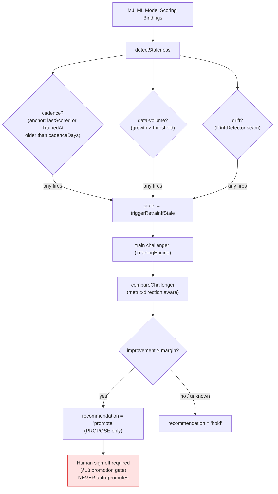

**Staleness — three triggers.** `detectStaleness` accumulates `StalenessReason[]`; the binding is stale if any fires:
- **Cadence** — anchor is `binding.LastScoredAt` (when `cadenceAnchor='lastScored'`) or `model.TrainedAt`; stale if older than `cadenceDays`. A never-scored/never-trained binding is treated as stale so it's picked up on the first pass.
- **Data-volume** — `growth = (currentRowCount − model.TrainingRowCount) / model.TrainingRowCount`; stale if `growth > dataVolumeGrowthThreshold` (current count via an injected `rowCounter`).
- **Drift** — gated by `policy.driftEnabled`, delegated to an injected `IDriftDetector` seam.

Scheduled re-scoring (`rescoreScheduledBinding`, for `Mode='Scheduled'` bindings) stamps `LastScoredAt = now` and `LastRowCount = scoredCount` after each pass.

**Challenger-vs-incumbent — respects metric direction, never auto-promotes.** When a binding is stale, a challenger is trained and compared. Direction is handled via Core's shared `isErrorMetric`:

```typescript
private metricImprovement(metric, incumbentValue, challengerValue): number | null {
    if (incumbentValue == null || challengerValue == null) return null;
    return isErrorMetric(metric) ? incumbentValue - challengerValue   // lower-is-better
                                 : challengerValue - incumbentValue;  // higher-is-better
}
private recommendPromotion(improvement, margin): PromotionRecommendation {
    if (improvement == null) return 'hold';                  // unknown → hold
    return improvement >= margin ? 'promote' : 'hold';
}
```

Positive `improvement` always means "better," whichever direction the metric runs. `compareChallenger` returns only a `recommendation` (`'promote' | 'hold'`) — it performs **no promotion**. The class doc is explicit: *"It NEVER auto-promotes — promotion is a separate signed-off Action,"* and the comparison detail always appends *"Promotion still requires explicit human sign-off — nothing has been promoted automatically."* Promotion only ever happens through the §13 gate with its sign-off.

> One nuance: the `'auto'` comparison-metric *selection* (`metrics.ts → resolveComparisonMetric`) only auto-picks higher-is-better keys; a **pinned** error metric is still compared direction-correctly via `metricImprovement`, but `'auto'` won't land on an error metric by itself.

---

## 15. Phase 2 — Model as a First-Class Primitive (Reach)

Phase 1 (§1–§14) shipped the model *entity* and its core invocation surfaces — Actions, Remote Operations, and write-back into entity fields — proven live end-to-end. **Phase 2 extends the model's *reach*: the *same* trained scorer, plumbed into every MJ surface where a prediction is useful.** None of this is new ML. There is exactly **one** scorer (`MLModelInferenceProcessor`, §6) and exactly **one** scoring entry point (`PredictiveStudioScoreRecordSetAction` / the `PredictiveStudio.ScoreRecordSet` Remote Op, which share one delegation path); Phase 2 is purely the plumbing that exposes that one scorer as a saved/scheduled Record Process, a discoverable per-model Action, a query column, and an interactive-component capability — and turns its output into ordinary entity data via write-back.

### 15.1 The unifying picture — one scorer, many surfaces

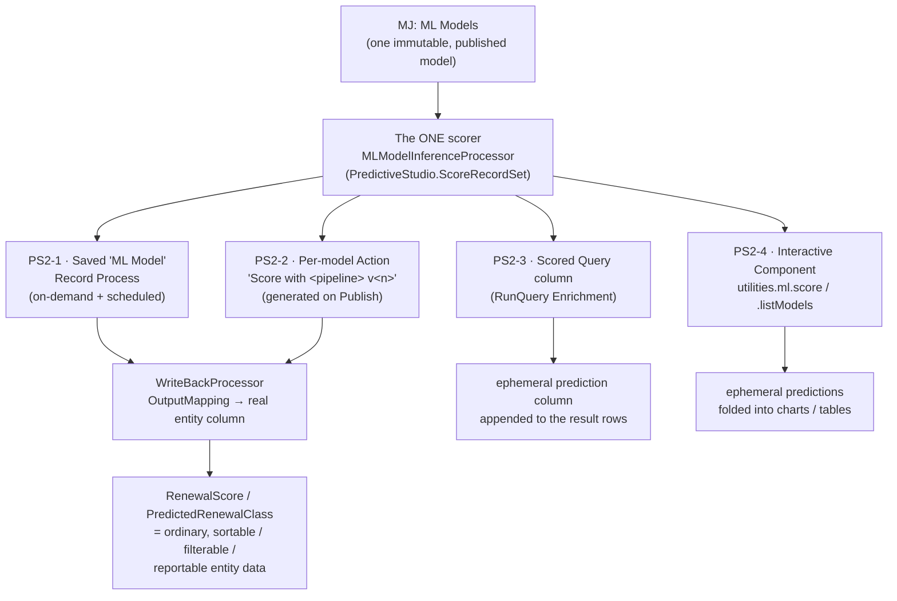

**Decoupling is the discipline that makes this safe.** No base/types package gains a dependency on Predictive Studio. Every surface plugs in through a *registry* or the *MJGlobal ClassFactory*, resolved by string key at runtime, no-op when the providing package isn't loaded:

| Surface | Seam | Lives in (PS-free) | Provided by (PS) |
|---|---|---|---|
| Record Process | `RecordProcessorRegistry` | `@memberjunction/record-set-processor-base` | `registerMLScoringProcessor()` at startup |
| Scored Query | `QueryResultEnricherBase` + ClassFactory | `@memberjunction/core` (`queryResultEnricher.ts`) | `@RegisterClass(QueryResultEnricherBase, 'ML Model Score')` |
| Interactive Component | `ComponentUtilities.ml?` (optional) | `@memberjunction/interactive-component-types` | `RuntimeUtilities.CreateSimpleMLTools()` (ng-react) |
| Per-model Action | `MJ: Actions` metadata + `ParentID` | — (pure metadata) | `ModelScoringActionGenerator` on Publish |

### 15.2 PS2-1 — Scoring as a saved (and scheduled) Record Process

**What it is.** Phase 1's `MLModelInferenceProcessor` is a Record Set Processing **work type** (`'ML Model'`, §6), but a `@RegisterClass` decoration only makes it *resolvable* through the ClassFactory — it does not make the substrate *route* a saved `MJ: Record Processes` row with `WorkType='ML Model'` to it. PS2-1 closes that gap so a **saved, replayable, schedulable** Record Process scores a scope and writes a prediction column.

**Key entry points.**

- `registerMLScoringProcessor(deps: MLInferenceDeps): void` (`Engine/src/scoring/register.ts`) — installs a factory into `RecordProcessorRegistry.Instance` for both `'ML Model'` and the `'MLModelInference'` alias. The factory reads the per-run `MLScoringConfiguration` (`{ modelId, primaryKeyField?, datedSources? }`) off the Record Process's `Configuration` JSON and closes over the injected `MLInferenceDeps` (model loader / artifact loader / sidecar).
- `PredictiveStudioScoringStartup` (`Engine/src/scoring/startup-register.ts`) — a `@RegisterForStartup`-decorated `IStartupSink` (a `BaseSingleton`) whose `HandleStartup()` calls `registerMLScoringProcessor(buildProductionMLInferenceDeps())` **once at MJAPI boot**. It warms no `BaseEngine` cache and touches no DB — the injected seams take their `provider` + `user` per call — so the registration is a cheap synchronous map write (not `deferred`). Mirrors `RemoteBrowserEngine`'s startup pattern.
- The **migration** `migrations/v5/V202606280215__v5.44.x__RecordProcess_WorkType_Pluggable.sql` drops the closed `CK_RecordProcess_WorkType` CHECK constraint. That CHECK hard-coded `WorkType` to the four built-ins (`'Action' | 'Agent' | 'Infer' | 'FieldRules'`), so a row with `WorkType='ML Model'` failed on INSERT *before* the registry ever got to resolve a processor — directly contradicting the pluggable design. Work-type **validity** is now enforced where it belongs: at execution time, by `RecordProcessExecutor.buildProcessor() → RecordProcessorRegistry.Resolve()`, which throws for an unregistered work type. The built-in values stay first-class **suggestions** via the field's value list (which drives the generated TypeScript union + the UI dropdown) — just not a hard DB constraint a registered extension can never satisfy. Idempotent (`DROP ... IF EXISTS`); no CodeGen needed (a CHECK is not CodeGen output).

**Dry-run write-back fix.** PS2-1 also hardened the substrate's write-back so a **dry-run** of any wrapped work type (Action / Agent / Infer / **ML Model**) computes its effect without mutating data. `applyOutputMapping(... dryRun: true)` (`packages/RecordSetProcessor/engine/src/writeBack.ts`) now still resolves the mapped values and validates the target entity/field metadata, but saves nothing — returning the would-be values in `previewFields` / `previewChild` (`WriteBackResult.dryRun`). This mirrors the first-class `ProcessRun.DryRun` flag threaded through `WriteBackProcessor.ts` and `RecordProcessExecutor.ts`, and through the action's `ScoreRecordSetRequest.dryRun`.

**Usage** — score a view and write a probability column on demand:

```typescript
// A saved MJ: Record Processes row (created once, then runnable / schedulable):
//   WorkType      = 'ML Model'                         // set via rp.Set('WorkType', …) — see 15.6
//   ScopeType     = 'Filter'  ScopeFilter = "IsActive = 1"
//   Configuration = { "modelId": "<MJ: ML Models id>", "primaryKeyField": "ID" }
//   OutputMapping = { "fields": { "RenewalScore": "$.score" } }   // write-back
// Run it (same path the scheduled job driver uses):
await RecordProcessExecutor.RunByID(recordProcessId, { contextUser, provider });
// → each row scored by the model → RenewalScore column written back.
```

**Proven live by** `ps-live-recordprocess-scoring.ts` — a SAVED Record Process scoring over GraphQL against a running MJAPI, relying on the **startup-registered** scorer (it does *not* register the work type itself).

### 15.3 PS2-2 — A per-model Action generated on Promote

**What it is.** When a model is promoted to **Published**, the promote gate auto-generates an idempotent child Action **`Score with <pipeline> v<n>`**, so every published model becomes a first-class, discoverable Action — ActionSmith / CodeSmith pick it up for free, with zero per-model code or AI codegen.

**Key entry points.**

- `ModelScoringActionGenerator` (`Engine/src/actions/model-scoring-action-generator.ts`):
  - `generateForModel(model, contextUser, provider): Promise<void>` — find-or-create the Action by its deterministic name; reconcile its params (delete + recreate to stay in sync with the parent contract).
  - `disableForModel(model, contextUser, provider): Promise<void>` — flip `Status` to `'Disabled'` when the model is Archived.
- The hook is in `ProductionModelPromotionGate.syncScoringAction()` (`Engine/src/actions/promote-model.gate.ts`), called from `transition()` after the lifecycle save: generate on `Published`, disable on `Archived`. It is a **pure enhancement** — any failure is logged and swallowed so it can never fail an otherwise-successful promotion.

**Composition, not inheritance** (CLAUDE.md Actions rule). The generated row is a *child* of the canonical **Score Record Set** parent — it carries the parent's `ParentID` (metadata link only) and reuses the **same** `DriverClass` (`SCORE_RECORD_SET_DRIVER_CLASS = 'PredictiveStudioScoreRecordSetAction'`). That driver already reads `ModelID` / `Scope` / `WriteBack`, so the child needs no new implementation. The only thing model-specific is the `ModelID` input param's `DefaultValue`, **baked to `model.ID`** — ActionEngine seeds each param from its `DefaultValue` before invoke, so omitting `ModelID` scores with *this* model. The Action is named from the model's denormalized `Pipeline` view field (the model has no `Name` column) and `Version`, and grouped under a find-or-create `Predictive Studio Models` Action Category.

**Proven live by** `ps-live-modelaction-generation.ts` — promotes a model to Published over GraphQL, then reads `MJ: Actions` / `MJ: Action Params` back and asserts the generated Action name + the baked `ModelID` default.

### 15.4 PS2-3 — Scored-query enrichment

**What it is.** A `RunQuery` post-query enrichment seam: a query run with an `Enrichment` directive has its result rows scored by the existing scorer and the prediction **appended as a new column** — post-query, **not** SQL-inline, so the model stays in the engine (portable, no DB-side model dependency).

**Key types/entry points (all decoupled from PS).**

- `QueryResultEnricherBase` (abstract) + `RunQueryEnrichment` (`{ EnricherKey: string; Config: Record<string, unknown> }`) + `resolveQueryResultEnricher(key)` live in **`@memberjunction/core`** (`src/generic/queryResultEnricher.ts`). `RunQueryParams.Enrichment?: RunQueryEnrichment` is a **runtime-only** directive — there is intentionally **no** persisted per-query column (a saved annotation is a deliberate follow-up), so the feature is purely additive: no schema change, no CodeGen.
- The hook is in `GenericDatabaseProvider.InternalRunQuery` → `enrichQueryResults(...)`: after paging, if `params.Enrichment?.EnricherKey` is set, it resolves the enricher via the ClassFactory and awaits `EnrichResults(...)`. **Resolution checks `GetRegistration` before constructing** (so it never instantiates the abstract base) and the whole call is wrapped in try/catch — when no enricher is registered (providing package not loaded) or anything fails, it **returns the original rows**. A scoring problem can never break the query.
- `MLModelScoreEnricher` (`Engine/src/scoring/ml-model-score-enricher.ts`, `@RegisterClass(QueryResultEnricherBase, 'ML Model Score')`) is the PS half. Its `MLModelScoreEnricherConfig` is `{ modelId, outputField, primaryKeyField?, valueKind?: 'score' | 'class' }`. Because the **model** determines the target entity, the enricher only needs each row's primary key: it collects the PKs, scores them **without write-back** (ephemeral), and joins predictions back onto rows by id (`O(1)` map). `LoadMLModelScoreEnricher()` anchors the registration against tree-shaking.

**Usage:**

```typescript
const result = await new RunQuery().RunQuery({
  QueryName: 'Active Members',
  Enrichment: {
    EnricherKey: 'ML Model Score',
    Config: { modelId: '<MJ: ML Models id>', outputField: 'RenewalScore', primaryKeyField: 'ID' },
  },
});
// → each result row now carries a `RenewalScore` column (the model's numeric score).
```

**Proven live by** `ps-inproc-scored-query.ts` — runs in-process (the `Enrichment` param is not marshaled over GraphQL yet, by design), exercising the full path: `RunQuery → resolveQueryResultEnricher('ML Model Score') → MLModelScoreEnricher → MLModelInferenceProcessor → DB + sidecar → new column`.

### 15.5 PS2-4 — An `ml` capability on Interactive Components

**What it is.** An optional `ml` capability on the Interactive Components `utilities` surface, so Skip's components can **list trained models** and **score records** and weave predictions (renewal likelihood, lead scores, churn risk) into charts / tables / dashboards. Push-to-generic: every interactive component gains it.

**Key types/entry points.**

- `SimpleMLTools` (`packages/InteractiveComponents/src/shared.ts`) — the capability interface:
  - `listModels(filter?: SimpleMLListModelsFilter, contextUser?): Promise<SimpleMLModelInfo[]>` — newest version first; resilient (returns `[]` on failure).
  - `score(modelId, records: Array<Record<string,unknown> | string>, options?): Promise<SimpleMLScoreResult>` — ephemeral predictions (nothing written back).
  - Supporting shapes: `SimpleMLModelInfo`, `SimpleMLPrediction`, `SimpleMLScoreResult`, `SimpleMLListModelsFilter`.
- `ComponentUtilities.ml?: SimpleMLTools` (`runtime-types.ts`) is **optional** — it can be `undefined` when the capability isn't available in the current environment/security context, so component code **must guard** for that.
- `RuntimeUtilities.CreateSimpleMLTools()` (`packages/Angular/Generic/react/src/lib/utilities/runtime-utilities.ts`) builds it: `listModels` reads the `MJ: ML Models` catalog via `RunView` (defaulting `Status='Published'`); `score` marshals the `PredictiveStudioScoreRecordSetOperation` (the `PredictiveStudio.ScoreRecordSet` Remote Op) **over GraphQL** to the server engine — because the Python sidecar lives server-side and cannot run in the browser. Returns `undefined` when there is no `GraphQLDataProvider`, so the `ml` capability degrades cleanly.

**Usage (inside an interactive component):**

```typescript
if (utilities.ml) {
  const models = await utilities.ml.listModels({ targetVariable: 'Renewed' });
  const { predictions } = await utilities.ml.score(models[0].id, memberRows /* objects or pk strings */);
  // fold predictions (by recordId) into the chart/table…
}
```

### 15.6 PS2-6 — The north-star: scheduled model scoring

**What it is.** The end-to-end composition Phase 2 builds toward: *"build a model, write the renewal probability back into the member record, and re-score it on the 1st of every month"* — as a **single call**, with **no new scheduling, dispatch, or write-back code**. Everything underneath already exists (PS2-1 + the scheduled-job machinery); the helper just assembles one `MJ: Record Processes` row.

**Key entry point.** `createScheduledModelScoring(opts: ScheduleModelScoringOptions): Promise<MJRecordProcessEntity>` (`Engine/src/scheduling/scheduled-model-scoring.ts`). Required quartet: `modelId`, `targetEntityName`, `outputField`, and exactly one `scope` selector (`filter` | `viewId` | `listId`); sensible defaults otherwise (`'Monthly'` cadence = `0 0 1 * *`, `ID` primary key, numeric `'score'`, UTC). It validates, maps the `ScoringCadence` to a cron (`cadenceToCron`), and populates the row:

- `WorkType='ML Model'` — set via `rp.Set('WorkType', 'ML Model')`, the **documented legitimate exception** to the no-`.Set()` rule: the CodeGen'd `WorkType` union (`'Action' | 'Agent' | 'FieldRules' | 'Infer'`) cannot represent a runtime-registered extension work type. (Same exception PS2-1's path uses.)
- `Configuration = { modelId, primaryKeyField }`, `OutputMapping = { fields: { <outputField>: '$.score' | '$.class' } }`.
- `Status='Active'`, `ScheduleEnabled=true`, `CronExpression`, `Timezone`, `OnDemandEnabled=true`.

Saving that row auto-creates an **owned `MJ: Scheduled Jobs`** row via `MJRecordProcessEntityServer.Save → reconcileScheduledJob`; `SchedulingEngine` then dispatches it on its cron through `RecordProcessScheduledJobDriver → RecordProcessExecutor.RunByID(...)` — which resolves the scope, scores each row, and writes the prediction back per the `OutputMapping`. The `schedule-model-scoring.action.ts` Action wraps the helper for agent/workflow invocation.

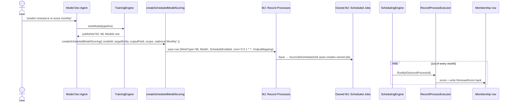

**Proven live by** `ps-inproc-scheduled-scoring.ts` — one `createScheduledModelScoring(...)` call, then it verifies the owned Scheduled Job the scheduler *would* dispatch and runs the Record Process now via `RecordProcessExecutor.RunByID` (the same path the job driver uses), asserting the write-back landed.

### 15.7 Integration-test proofs

Each Phase 2 capability ships with an MJServer integration script that exercises the real path (no mocked ML). The `ps-live-*` scripts drive an already-running MJAPI over GraphQL (system API key); the `ps-inproc-*` scripts bootstrap a real `SQLServerDataProvider` in-process (used where the path isn't marshaled over GraphQL yet). All gate the sidecar legs behind `PS_INTEGRATION=1` and skip gracefully without it.

| Capability | Script | Harness | Proves |
|---|---|---|---|
| PS2-1 — saved Record Process scoring | `ps-live-recordprocess-scoring.ts` | live / GraphQL | a saved `WorkType='ML Model'` Record Process scores a view + writes columns, via the **startup-registered** scorer |
| PS2-2 — per-model Action on Promote | `ps-live-modelaction-generation.ts` | live / GraphQL | promoting to Published generates `Score with <pipeline> v<n>` with `ModelID` `DefaultValue` baked in |
| PS2-3 — scored-query enrichment | `ps-inproc-scored-query.ts` | in-process | `RunQuery` + `Enrichment` appends the model's prediction column |
| PS2-6 — scheduled model scoring | `ps-inproc-scheduled-scoring.ts` | in-process | one `createScheduledModelScoring(...)` call → owned Scheduled Job + a real scored write-back |

> PS2-5 (catalog awareness for agents) is delivered *through* PS2-2: every published model is a discoverable Action, which ActionSmith / CodeSmith see for free — no separate code.

---

## 16. Roadmap / future phases

Predictive Studio ships end-to-end. The one explicitly-deferred capability is honest here:

| Item | Status | Detail |
|---|---|---|
| **SP5 — Materialized prediction columns** | **Deferred, gated on PR #2770** | The "population-wide, indexed prediction column" optimization runs ML batch-scoring inside the offline **materialization** refresh and writes predictions as **physical columns** on a materialized `VirtualEntity` (Skip/reports/views query them like any table). It depends on PR #2770 landing the `MJ: Materialized Results` table. **The forward-compat seam is already in place**: `MJ: ML Model Scoring Bindings.MaterializedResultID` is a **soft reference** (not a FK) to that table, and the `ScoringBindingMode = 'OnDemand' \| 'Scheduled' \| 'Materialized'` already names the `Materialized` mode. On-demand + scheduled scoring (§6) ship with **zero dependency** on #2770 — when the table lands, materialization is additive. |

Other open questions carried forward (none block the shipped feature): model serialization native-vs-ONNX for cross-platform portability; reserving algorithm slots (k-NN / Naive Bayes); the precise drift-detection method behind the `IDriftDetector` seam; sidecar multi-tenancy / per-session resource limits for long agentic searches; and detached fire-and-forget Remote-Op progress (poll-via-status today, full background execution later).

---

## 17. The Studio UI

Predictive Studio is an MJ Explorer dashboard built to the ng-dashboards world-class standards (see [Dashboard Best Practices](DASHBOARD_BEST_PRACTICES.md)) and **lazy-loaded** (see [Lazy Loading Guide](LAZY_LOADING_GUIDE.md)). It lives at `packages/Angular/Explorer/dashboards/src/PredictiveStudio/`.

- **Shell**: `PredictiveStudioDashboardComponent` (`@RegisterClass(BaseDashboard, 'PredictiveStudioDashboard')`, NgModule-declared) — page-chrome trio, a left-nav across six panels, query-param round-trip (`activePanel` survives deep links / back-forward), and `BaseDashboard` auto-calls `NotifyLoadComplete()` after `loadData()`.
- **Data layer**: `PredictiveStudioEngine` (`engine/predictive-studio.engine.ts`) — a `BaseEngine` singleton that caches the PS reference entities via `RunView` (`Algorithms`, `UseCases`, `Rankings`, `Models`, `Pipelines`, `TrainingRuns`, `Experiments`, `Sessions`, `Iterations`) and exposes domain helpers (`BestLevelsForScenarios`, `RankingsForUseCase`, `IterationsForSession`). No Angular services for data — the canonical MJ pattern.
- **Six panels** (standalone components in `components/`, each receiving the engine via `@Input()`):

  | Panel | Component | Design |
  |---|---|---|
  | Home | `PSHomeComponent` | Action-Forward — hero band + entry paths + activity timeline |
  | Algorithm Catalog | `PSCatalogComponent` | Card-gallery + Guide-me — scenario picker drives recommendations from the rankings matrix |
  | Pipeline Builder | `PSPipelinesComponent` | Visual DAG — SVG feature-assembly graph + node inspector + leakage/validation config |
  | Experiments | `PSExperimentsComponent` | Kanban — Running/Completed/Pruned columns + leaderboard strip + budget gauges |
  | Model Registry | `PSRegistryComponent` | Master-detail — lifecycle stepper, train-vs-holdout, feature importance, lineage, sign-off gate |
  | Compare Runs | `PSCompareComponent` | switchable side-by-side / overlay charts / champion-vs-challenger |

- **Embedded copilot**: an `<mj-conversation-chat-area>` (from `@memberjunction/ng-conversations`, see [Conversations UX Stack Guide](CONVERSATIONS_UX_STACK_GUIDE.md)) docked across **all** panels — agent picker hidden, pinned to the Model Development Agent, with an `appContext` carrying the active panel + published-model / running-session counts so the agent can act on the current context.
- **Knowledge Hub side**: the **Feature Pipelines** panel (`FeaturePipelinesResourceComponent`, §11) lives in the Knowledge Hub dashboard — list / run / author derived-feature pipelines.
- **Lazy load**: `PredictiveStudioDashboardsModule` is exported via the `./predictive-studio-dashboards.module` subpath in the dashboards `package.json`; `LoadPredictiveStudioDashboard()` in `public-api.ts` is the tree-shaking anchor; the ClassFactory resolves the `'PredictiveStudioDashboard'` driver to the code-split chunk on demand.

The HTML option mockups that informed the pinned designs are at [`plans/predictive-studio/mockups/`](../plans/predictive-studio/mockups/).

---

## 18. Getting started — train and score a model

### 18.1 One-time setup

```bash
# 1. Set up the bundled Python sidecar environment (once)
cd packages/AI/PredictiveStudio/Sidecar
npm run setup:python
brew install libomp          # macOS only (Linux: install libgomp1)

# 2. Build the packages
cd packages/AI/PredictiveStudio/Core    && npm run build
cd ../Sidecar                            && npm run build
cd ../Engine                             && npm run build
```

### 18.2 Train

In production you invoke the `PredictiveStudio.TrainModel` Remote Op (browser/Skip) or the `Train ML Model` Action (agent). Both delegate to `TrainingEngine.trainModel`. Directly, the shape is:

```typescript
import { TrainingEngine } from '@memberjunction/predictive-studio';
// productionDeps wire the seams: MetadataEntityFactory, RunViewRecordLoader,
// MJSidecarTrainer (over MLSidecar), MJFilesArtifactStore.

const engine = new TrainingEngine();
const result = await engine.trainModel(
  { pipelineId: retentionPipelineId, /* maxRows?, asOf?, … */ },
  productionDeps,
);
// → a new immutable MJ: ML Models row (Status='Draft') with FittedPreprocessing,
//   FeatureSchema, Metrics, HoldoutMetrics (the honest number), FeatureImportance, Lineage.
```

A pipeline (`MJ: ML Training Pipelines`) declares the target entity, target variable, problem type, algorithm, `SourceBindings`, `FeatureSteps` DAG, `AsOfStrategy`, `LeakageGuard`, and `ValidationStrategy` (including the locked-holdout fraction).

### 18.3 Score (Record Set Processing)

Scoring runs as the `'ML Model'` work type. On-demand against a view/list/selection via `RecordProcess.RunNow` with a scope override (or the `PredictiveStudio.ScoreRecordSet` op / `Score Record Set` Action); scheduled via the `Schedule` trigger (which also upserts an `MJ: ML Model Scoring Binding` for maintenance, §14). Attach an `OutputMapping` to write the prediction back as a sortable/filterable column; omit it for ephemeral scores. See the [Record Set Processing Guide](RECORD_SET_PROCESSING_GUIDE.md) for the substrate mechanics.

### 18.4 Run the live integration test (`PS_INTEGRATION=1`)

The engine ships an opt-in end-to-end test that spawns the **real** managed sidecar and trains + scores against it (`Engine/src/__tests__/integration/live-train-score.integration.test.ts`):

```bash
# Prerequisite: the sidecar venv must exist
cd packages/AI/PredictiveStudio/Sidecar && npm run setup:python

# Run the live integration suite (sets PS_INTEGRATION=1 via vitest.integration.config.ts)
cd packages/AI/PredictiveStudio/Engine && npm run test:integration
```

It exercises the real `FeatureAssemblyExecutor`, `TrainingEngine`, `MLSidecar` (managed-spawn of XGBoost / Logistic / Ridge), and `MLModelInferenceProcessor`, faking only the entity factory / record loader / artifact store (no DB needed). The thresholds it asserts are the [at-a-glance numbers](#at-a-glance): **holdout AUC ≥ 0.70** (XGBoost, Logistic), **holdout R² ≥ 0.40** (Ridge), **held-out directional accuracy > 0.60**. It **skips gracefully** with a clear console note when the venv or Python is unavailable, so it is CI-safe by default — the standard `npm run test` (mocked) always runs; the live suite is explicit opt-in.

---

## 19. Quick reference — what's built

| Area | Status |
|---|---|
| 10-entity data model + CodeGen | ✅ built |
| Algorithm catalog + use cases + 6×7 rankings (metadata) | ✅ built |
| `MLSidecar` self-managing Python sidecar (managed + remote) | ✅ built |
| `FeatureAssemblyExecutor` (raw/preprocessing split, fit-in-split, as-of, leakage guard) | ✅ built |
| `TrainingEngine` (immutable models, locked holdout, lineage) | ✅ built |
| `MLModelInferenceProcessor` ('ML Model' RSP work type, ephemeral/write-back) | ✅ built |
| `ExperimentOrchestrator` (waves, leaderboard, pruning, budget-in-runner) | ✅ built |
| **6 Remote Operations** (Train/Score/RunFeaturePipeline/Start+Control Experiment/Promote) + **4 Actions** | ✅ built |
| **Feature Pipelines** (category route — `FeaturePipelineEngine` + KH panel; no new entity) | ✅ built |
| **Model Development Agent** + 3 sub-agents + **ML Experiment Results artifact** + Angular viewer | ✅ built |
| **Security model** (scope gate, PK field-name guard, UUID gate, promotion state machine, sign-off reason) | ✅ built |
| **Maintenance** (staleness + direction-aware challenger-vs-incumbent, never auto-promotes) | ✅ built |
| **Multimodal** vision-LLM-as-feature (`'vision-llm'` FeatureStep kind, additive) | ✅ built |
| Studio dashboard UI (6 panels, engine, embedded copilot, lazy-load) | ✅ built |
| Live integration test (`PS_INTEGRATION=1`) | ✅ built |
| Materialized prediction columns (#2770) | ⏳ **deferred — gated on PR #2770** (§16) |

**Related guides**: [Record Set Processing](RECORD_SET_PROCESSING_GUIDE.md) (the scoring + wave + feature-pipeline substrate) · [Remote Operations](REMOTE_OPERATIONS_GUIDE.md) & [Transport-Layer Architecture](TRANSPORT_LAYER_ARCHITECTURE_GUIDE.md) (the invocation surface) · [Dashboard Best Practices](DASHBOARD_BEST_PRACTICES.md) & [Lazy Loading](LAZY_LOADING_GUIDE.md) (the Studio UI) · [Conversations UX Stack](CONVERSATIONS_UX_STACK_GUIDE.md) (the embedded copilot) · [Agent Memory](AGENT_MEMORY_GUIDE.md) (the Model Dev Agent's notes).

**Package READMEs**: [Core (types)](../packages/AI/PredictiveStudio/Core/README.md) · [Sidecar (`MLSidecar`)](../packages/AI/PredictiveStudio/Sidecar/README.md) · [Engine (assembly/training/scoring/experiments/ops/actions/maintenance)](../packages/AI/PredictiveStudio/Engine/README.md).

For the authoritative, dependency-ordered task list, see [`plans/predictive-studio.md` §14](../plans/predictive-studio.md).
