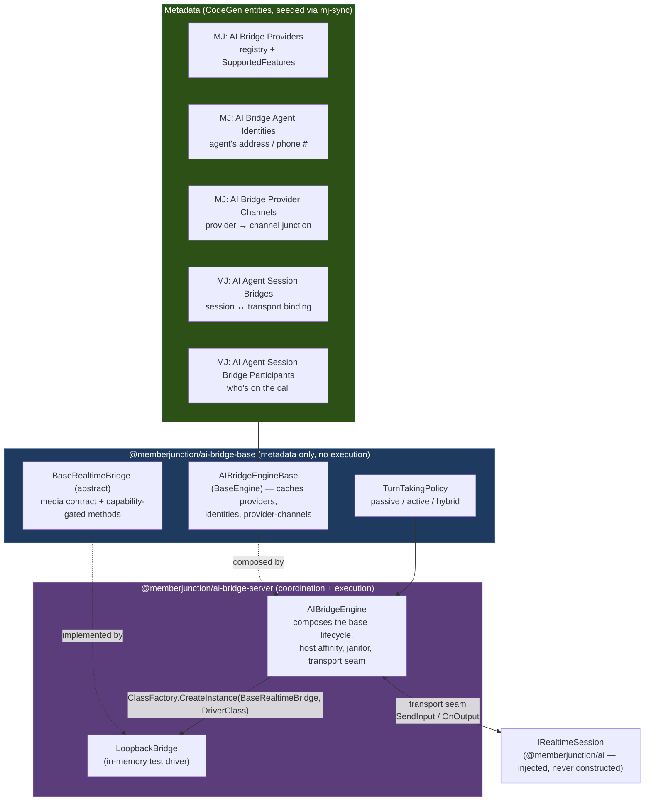
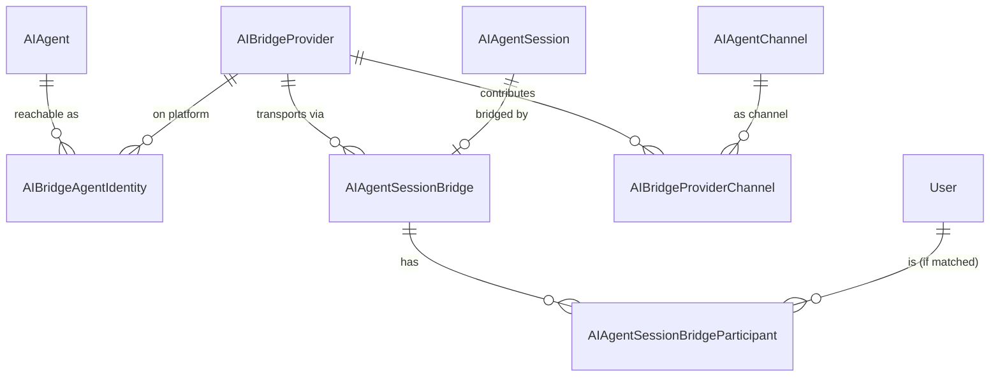
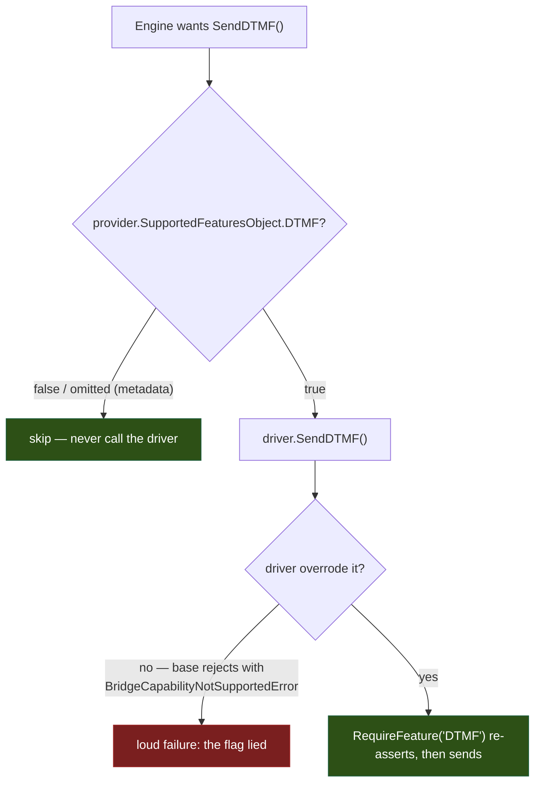
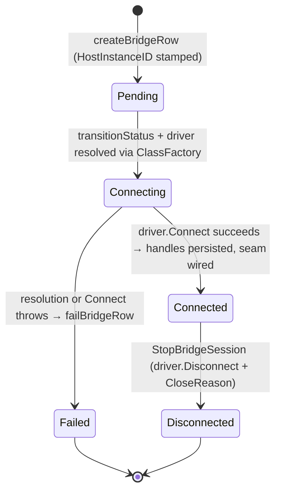
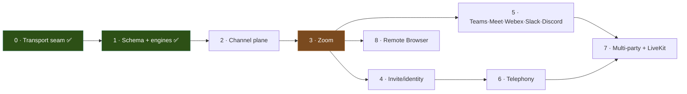

# Realtime Bridges Guide

How MemberJunction connects its **one** realtime agent engine to the outside world — Zoom/Teams/
Slack/Meet/Webex/Discord **meetings** and Twilio/Vonage/RingCentral **telephony** — through a single,
pluggable **media-transport seam**.

There is exactly **one** realtime agent engine (the `Realtime` agent type, the co-agent resolution
chain, tools, narration, channels, transcript relay, the `AIAgentSession` lifecycle — all documented in
the [Real-Time Co-Agents Guide](REALTIME_CO_AGENTS_GUIDE.md)). A **bridge** is a pluggable media
transport that fills that engine's long-deferred *server-bridged* seam from an external endpoint. We do
not build a second realtime stack; a bridge is just a driver that supplies the media plane.

> **Nothing in this architecture is audio-specific.** Audio is the first track lit up because the
> realtime models are there today, but the seam carries typed media tracks (audio / video / screen,
> each inbound *and* outbound). When realtime models gain full-duplex video, the same bridges already
> carry the video tracks with zero re-architecture.

**Companion documents:**

- [`/plans/realtime/realtime-bridges-architecture.md`](../plans/realtime/realtime-bridges-architecture.md)
  — the full architecture (mermaid, ERD, all phases, channels, multi-party, turn-taking). This guide
  is the developer-facing distillation of what has **shipped**; the plan retains the full rationale and
  the planned/deferred tracks.
- [`/guides/REALTIME_CO_AGENTS_GUIDE.md`](REALTIME_CO_AGENTS_GUIDE.md) — the realtime engine the bridge
  plugs into (the `Realtime` agent type, `IRealtimeSession`, channels, sessions, the janitor pattern
  bridges copy).
- [`packages/AI/BridgeBase/README.md`](../packages/AI/BridgeBase/README.md) — the base package
  (`@memberjunction/ai-bridge-base`).
- [`packages/AI/Bridge/README.md`](../packages/AI/Bridge/README.md) — the server package
  (`@memberjunction/ai-bridge-server`).

---

## Table of Contents

1. [What a Bridge Is](#1-what-a-bridge-is)
2. [Architecture](#2-architecture)
3. [The Capability Model](#3-the-capability-model)
4. [How to Add a New Bridge Driver](#4-how-to-add-a-new-bridge-driver)
5. [The Transport Seam](#5-the-transport-seam)
6. [Turn-Taking](#6-turn-taking)
7. [Entity Invariants](#7-entity-invariants)
8. [Join Methods & Agent Identity (Planned)](#8-join-methods--agent-identity-planned)
9. [Multi-Party (Planned)](#9-multi-party-planned)
10. [Roadmap / Phase Status](#10-roadmap--phase-status)

---

## 1. What a Bridge Is

A bridge is a **media transport + (planned) channel contributor** that connects the realtime agent
engine to an external endpoint. Concretely it is a driver class (`LoopbackBridge` today; `ZoomBridge`,
`TwilioBridge`, … as drivers land) that:

- **carries bidirectional media** — audio, video, screen, full duplex; nothing is audio-specific; and
- (planned, Phase 2) **contributes channels** — the platform's native surfaces (hand-raise, roster,
  whiteboard) routed through MJ's existing channel plane.

The single biggest design win is **reuse**. The realtime session contract `IRealtimeSession` (in
`@memberjunction/ai`) is already media-agnostic — its `SendInput(chunk)` is *what the agent hears* and
`OnOutput(handler)` is *what the agent says* — but it had **no client-facing pipe**. A bridge **is**
that pipe.

### The transport seam

```
external endpoint                 the bridge driver                the realtime session
(Zoom / Twilio / …)               (BaseRealtimeBridge)             (IRealtimeSession)
        │   inbound media   ──▶   OnMedia(frame)         ──▶   SendInput(chunk)   "the agent hears"
        │   outbound media  ◀──   SendMedia(track,frame) ◀──   OnOutput(chunk)    "the agent says"
```

The engine wires those two hooks once, generically (see [§5](#5-the-transport-seam)). Meetings and
telephony are two families of the **same** abstraction — and because the session *is* the existing
`AIAgentSession`, a bridged session reviews in the existing console with zero new persistence code.

### No new "session" entity

The session is the existing `AIAgentSession`. A bridge is an **attachment** to it (the
`AIAgentSessionBridge` row), exactly parallel to how a channel attaches to a session. One session
record, one lifecycle, one transcript path — whether the media plane is a browser, a Zoom room, or a
phone line.

### A bridge is also a channel contributor (forward reference)

Beyond media, a bridge is *also* a contributor of **channels** — the platform's native tool +
signaling vocabulary (hand-raise, roster, native whiteboard) routed through MJ's existing channel
plane. That server-side channel plane is **planned (Phase 2)** and is not in the shipped code; see
[§10](#10-roadmap--phase-status). This guide documents the media transport + capability + turn-taking +
entity layers that **have** shipped (Phase 0/1).

---

## 2. Architecture

### The engine pair — `AIBridgeEngineBase` / `AIBridgeEngine`

The bridge plane mirrors `AIEngineBase` / `AIEngine` exactly.



**`AIBridgeEngineBase`** (`@memberjunction/ai-bridge-base`) — a `BaseEngine` subclass that caches the
three bridge reference datasets and exposes synchronous resolution helpers over them. **No execution.**
Because the datasets are small reference tables, every lookup filters the in-memory array client-side
(no `RunView`s). It is `@RegisterForStartup()` and reactive via the inherited `BaseEngine` event
integration. Key helpers:

| Helper | Purpose |
|---|---|
| `ProviderByName(name)` / `ProviderByDriverClass(driverClass)` | Resolve a provider row (case-insensitive, trim-tolerant). |
| `IdentityByValue(value, providerId?)` | Route an inbound invite/call (addressed to a mailbox/DID) to the owning agent. Active identities only. |
| `IdentitiesForAgent(agentId, providerId?)` | The agent's active identities (which surfaces it is reachable on). |
| `ChannelsForProvider(id)` / `DefaultChannelsForProvider(id)` | The channels a provider contributes / auto-attaches, ordered by `Sequence`. |

**`AIBridgeEngine`** (`@memberjunction/ai-bridge-server`) — the server tier that **composes** the base
(it does **not** extend it) and adds all coordination + execution: the transport seam, the bot-session
lifecycle state machine, host affinity + the janitor, participant tracking, and turn-taking
integration.

#### Why composition, not inheritance

`AIBridgeEngineBase` is a `BaseEngine` singleton keyed by class name. If `AIBridgeEngine` *inherited*
from it, the startup manager would instantiate **two** separate engines (the base AND the subclass),
each loading and event-subscribing its own copy of the same caches. By **composing** —
`AIBridgeEngine` reads through `protected get Base() => AIBridgeEngineBase.Instance` and delegates every
metadata accessor — there is exactly **one** `BaseEngine` cache, warmed once. This is the identical
pattern `AIEngine` uses over `AIEngineBase`. From the architecture's source:

```typescript
@RegisterForStartup({ deferred: true, deferredDelay: 15000, description: 'Server-side AI Bridge Engine' })
export class AIBridgeEngine extends BaseSingleton<AIBridgeEngine> implements IStartupSink {
    /** The single underlying base instance whose BaseEngine cache holds the registry. */
    protected get Base(): AIBridgeEngineBase {
        return AIBridgeEngineBase.Instance;
    }
    public async HandleStartup(contextUser?, provider?) { await this.Config(false, contextUser, provider); }
    public async Config(forceRefresh?, contextUser?, provider?) { await this.Base.Config(forceRefresh, contextUser, provider); }
    // ...every metadata read delegates: ProviderByName, IdentityByValue, ChannelsForProvider, …
}
```

### The `BaseRealtimeBridge` driver family

`BaseRealtimeBridge` is the abstract driver — a **sibling to `BaseRealtimeModel`** in the realtime
stack. Where a realtime *model* driver wraps a speech-to-speech provider, a bridge *driver* wraps a
media transport. Both self-register with the MJ `ClassFactory` and are resolved by metadata key. The
base class is abstract and unregistered; the engine resolves a concrete driver via
`MJGlobal.Instance.ClassFactory.CreateInstance(BaseRealtimeBridge, provider.DriverClass)`. See
[§4](#4-how-to-add-a-new-bridge-driver).

### The five entities

All five are CodeGen-generated, named with the `MJ:` prefix, and seeded via mj-sync metadata (not SQL
INSERTs). The migration created the tables; CodeGen produced the entity classes in
`@memberjunction/core-entities`.



| Entity (name) | Generated class | Role |
|---|---|---|
| `MJ: AI Bridge Providers` | `MJAIBridgeProviderEntity` | The platform registry. Holds `Name`, `DriverClass` (the `ClassFactory` key), `Status`, and `SupportedFeatures` (the typed JSON capability blob, accessed via `SupportedFeaturesObject`). |
| `MJ: AI Bridge Agent Identities` | `MJAIBridgeAgentIdentityEntity` | Which agents are reachable where — `IdentityType` (`Email` / `PhoneNumber` / `AccountID`) + `IdentityValue`, per agent, per provider. |
| `MJ: AI Bridge Provider Channels` | `MJAIBridgeProviderChannelEntity` | The provider→`AIAgentChannel` junction (`IsDefault`, `Sequence`) — which channels a provider contributes (consumed by the planned Phase 2 channel plane). |
| `MJ: AI Agent Session Bridges` | `MJAIAgentSessionBridgeEntity` | The transport attachment to an `AIAgentSession`. The lifecycle state machine (`Status`), direction, join method, turn mode, platform handles, `HostInstanceID`. |
| `MJ: AI Agent Session Bridge Participants` | `MJAIAgentSessionBridgeParticipantEntity` | One row per participant on the call (the diarization map), including the agent bot itself (`IsAgent = 1`). |

Telephony reuses these **same five tables** with no schema change: `BridgeType = 'Telephony'`,
`IdentityType = 'PhoneNumber'`, and a `SupportedFeatures` blob with `{ DTMF, OutboundDial, CallTransfer }`
on. That is the proof the model is genuinely unified.

---

## 3. The Capability Model

Every bridge is **100% generic and capability-gated**. A platform's capabilities are declared in
`MJ: AI Bridge Providers.SupportedFeatures` — a single `NVARCHAR(MAX)` JSON column strongly typed via
the `IBridgeProviderFeatures` interface (MJ's JSONType system; CodeGen emits the typed
`SupportedFeaturesObject` accessor). One JSON column instead of ~16 BIT columns keeps the table simple
and lets new features be added without a schema migration — just extend the interface.

### `IBridgeProviderFeatures`

The shipped interface (`metadata/entities/JSONType-interfaces/IBridgeProviderFeatures.ts`) holds
**transport/media** concerns only. All flags are optional — an omitted flag means **not supported**.

```typescript
export interface IBridgeProviderFeatures {
    // Join methods
    OnDemandJoin?: boolean; ScheduledJoin?: boolean; InviteJoin?: boolean;
    NativeInvite?: boolean; InboundRouting?: boolean; OutboundDial?: boolean;
    // Media tracks (directional — nothing here is audio-specific)
    AudioIn?: boolean;  AudioOut?: boolean;
    VideoIn?: boolean;  VideoOut?: boolean;
    ScreenIn?: boolean; ScreenOut?: boolean;
    // Signals & telephony
    SpeakerDiarization?: boolean; DTMF?: boolean; CallTransfer?: boolean; Recording?: boolean;
}
```

> Interactive surfaces (hand-raise, in-meeting chat, native whiteboard) are deliberately **not**
> features here — they are **channels** the bridge contributes (planned Phase 2). This interface is
> transport/media capabilities only.

In bridge code, `IBridgeProviderFeatures` is available as a documented type alias from
`@memberjunction/ai-bridge-base` (it aliases the generated `MJAIBridgeProviderEntity_IBridgeProviderFeatures`
so drivers needn't import the verbose generated name; the canonical source remains
`@memberjunction/core-entities`).

### The two-layer gating rule (defense in depth)



1. **The engine checks the flag first** and never calls a driver method whose feature is off. For
   example, participant tracking is gated before the driver is ever touched:
   ```typescript
   private wireParticipantTracking(active: ActiveBridgeSession): void {
       if (active.Provider.SupportedFeaturesObject?.SpeakerDiarization !== true) {
           return; // provider metadata says no roster — never call the driver.
       }
       try { active.Bridge.OnParticipantChange(/* … */); }
       catch (err) { /* driver didn't implement it despite the flag — log + continue */ }
   }
   ```
2. **The driver's virtual methods throw by default** (`BridgeCapabilityNotSupportedError`). This is the
   second layer: a driver that has not overridden a method — or a metadata flag that *lied* — fails
   loudly rather than silently degrading. An overriding driver re-asserts the flag at the top of its
   method via the protected `RequireFeature(flag)` helper, so even a direct (engine-bypassing) caller
   cannot run an action the metadata says is off.

`BridgeCapabilityNotSupportedError` carries both `FeatureName` and `ProviderName`, so the loud failure
points at exactly which capability flag lied (or which driver method is missing) for which platform.

---

## 4. How to Add a New Bridge Driver

This is the most important section. Adding a platform is a **minimal subclass** — the base + engine
carry all the generic weight (session wiring, frame normalization, turn-taking, participant bookkeeping,
lifecycle, the janitor). You implement only the irreducibly platform-specific primitives.

### Step 1 — Subclass `BaseRealtimeBridge` and register it

```typescript
import { RegisterClass } from '@memberjunction/global';
import { BaseRealtimeBridge } from '@memberjunction/ai-bridge-base';

@RegisterClass(BaseRealtimeBridge, 'ZoomBridge')   // ← the DriverClass key the provider row resolves
export class ZoomBridge extends BaseRealtimeBridge {
    // ...
}
```

The `'ZoomBridge'` string is the `ClassFactory` key. A `MJ: AI Bridge Providers` row whose
`DriverClass = 'ZoomBridge'` resolves to this class. (Add a tree-shaking-prevention loader and call it
from your package entry point, exactly as `LoadLoopbackBridge` does, so bundlers don't eliminate the
dynamically-registered class.)

### Step 2 — Implement the four abstract methods (every bridge MUST)

```typescript
public async Connect(ctx: RealtimeBridgeContext): Promise<BridgeConnectResult> {
    this.applyContext(ctx);                       // capture features + provider name FIRST
    // … join the meeting / place or accept the call …
    return { BotParticipantId, ExternalConnectionId };   // engine persists these onto the bridge row
}

public async Disconnect(reason: BridgeDisconnectReason): Promise<void> {
    // leave / hang up cleanly. `reason` lets you shortcut a graceful handshake on 'Error'/'Shutdown'.
}

public SendMedia(track: BridgeMediaTrackKind, frame: BridgeMediaFrame): void {
    // outbound: the agent's voice/video/screen INTO the meeting (fed from IRealtimeSession.OnOutput).
    // Audio is just one track — `frame.Track` selects which.
}

public OnMedia(handler: (frame: BridgeMediaFrame) => void): void {
    // inbound: what the agent HEARS/SEES (routed to IRealtimeSession.SendInput).
    // When the platform diarizes, stamp `frame.SpeakerLabel` so turn-taking can attribute speech.
}
```

`applyContext(ctx)` (a protected helper) captures the provider's `SupportedFeatures` and name onto the
instance so `RequireFeature` and capability-error messages work. **Call it first in `Connect`.**

### Step 3 — Override only the capability-gated virtuals your platform supports

Each optional method throws `BridgeCapabilityNotSupportedError` by default. Override the ones your
platform offers, and **re-assert the flag** at the top with `RequireFeature`:

| Method | Gating flag | Family |
|---|---|---|
| `GetParticipants()` / `OnParticipantChange(handler)` | `SpeakerDiarization` | roster + diarization mapping |
| `SendDTMF(digits)` / `OnDTMF(handler)` | `DTMF` | telephony |
| `TransferCall(target)` | `CallTransfer` | telephony |
| `StartRecording()` | `Recording` | recording (subject to consent handling upstream) |

Video/screen tracks need no extra methods — they ride the same `SendMedia` / `OnMedia` calls, gated by
the directional flags (`VideoIn/Out`, `ScreenIn/Out`).

### Step 4 — Set the matching `SupportedFeatures` flags in the provider seed

The driver advertises what it overrode; the provider's `SupportedFeatures` JSON **must match** — and is
validated server-side ([§7](#7-entity-invariants)). Seed the provider row (with its capability blob)
via mj-sync metadata, never a SQL INSERT.

### Worked minimal example — `LoopbackBridge`

The shipped `LoopbackBridge` (`@memberjunction/ai-bridge-server`) is the canonical minimal driver. It
proves the transport seam round-trips media with **no platform**: every outbound frame is echoed
straight back inbound (re-stamped `audio-out → audio-in`), and it overrides the diarization-gated roster
methods to return a single synthetic agent participant.

```typescript
@RegisterClass(BaseRealtimeBridge, LOOPBACK_BRIDGE_DRIVER_CLASS)   // 'LoopbackBridge'
export class LoopbackBridge extends BaseRealtimeBridge {
    public async Connect(ctx: RealtimeBridgeContext): Promise<BridgeConnectResult> {
        this.applyContext(ctx);
        this.connected = true;
        this.participantHandler?.([LoopbackBridge.AGENT_PARTICIPANT]);   // emit initial roster
        return { BotParticipantId: 'loopback-agent', ExternalConnectionId: `loopback:${ctx.Address || 'in-memory'}` };
    }

    public SendMedia(track: BridgeMediaTrackKind, frame: BridgeMediaFrame): void {
        if (!this.connected) return;                                     // disconnected → drop
        this.Sent.push(frame);
        this.mediaHandler?.({ ...frame, Track: this.toInboundTrack(track) });   // echo outbound → inbound
    }

    public OnMedia(handler: (frame: BridgeMediaFrame) => void): void { this.mediaHandler = handler; }

    public override async GetParticipants(): Promise<BridgeParticipantInfo[]> {
        this.RequireFeature('SpeakerDiarization');                       // defense-in-depth re-assert
        return [LoopbackBridge.AGENT_PARTICIPANT];
    }

    public override OnParticipantChange(handler: (p: BridgeParticipantInfo[]) => void): void {
        this.RequireFeature('SpeakerDiarization');
        this.participantHandler = handler;
    }
    // SendDTMF / TransferCall / StartRecording stay un-overridden → still throw NotSupported.
}
```

Telephony/recording features stay off, so those virtual base methods keep throwing — the loopback
driver documents the capability-gating contract by example. A real driver (e.g. `ZoomBridge`, **planned
Phase 3**) lives in its own package or the server package and overrides the diarization + (for
telephony, planned Phase 6) DTMF/transfer methods, translating between the platform's media SDK and
`BridgeMediaFrame`.

### Media-track translation & diarization

A real driver translates the platform's media SDK frames to/from `BridgeMediaFrame`:

- **Payload:** populate exactly one of `Bytes` (raw `ArrayBuffer`, the fast in-process path) **or**
  `Base64` (for transports that can only carry text). The engine's seam unwraps either.
- **Track + direction:** stamp `Track` (`audio-in` … `screen-out`). Direction is from the agent's POV:
  `*-in` flows from the endpoint to the agent; `*-out` from the agent to the endpoint.
- **Diarization:** when the platform labels speakers, stamp `SpeakerLabel` on inbound frames and emit
  `BridgeParticipantInfo` rosters via `OnParticipantChange`. The engine upserts those to
  `AIAgentSessionBridgeParticipant` rows and turn-taking uses the labels.

---

## 5. The Transport Seam

The transport seam is the single piece of code that completes the realtime engine's deferred
server-bridged media transport — the "`SendInput`/`OnOutput` have no client-facing pipe" gap. The
bridge **is** that pipe. It is wired in `AIBridgeEngine.StartBridgeSession` → `wireTransportSeam`.

### Injection — the engine never constructs the model

The realtime session is **injected** into `StartBridgeSession`, never constructed by the engine. This
keeps the only coupling the seam itself (to the `IRealtimeSession` *interface*), keeps the model's
lifecycle owned by the agent/session layer above, and makes the whole engine unit-testable with a mock
session + the `LoopbackBridge`.

```typescript
export interface StartBridgeSessionParams {
    AgentSessionID: string;              // the existing AIAgentSession this bridge attaches to
    Provider: MJAIBridgeProviderEntity;  // DriverClass resolves the driver
    RealtimeSession: IRealtimeSession;   // ← INJECTED — the engine wires its media plane, never builds it
    Address: string;                     // join URL/ID (meetings) or phone number (telephony)
    Direction?: 'Inbound' | 'Outbound';  // default 'Outbound'
    JoinMethod?: /* … */;                // default 'OnDemand'
    TurnMode?: BridgeTurnMode;           // default 'Passive'
    TurnMatcher?: IAddressedMatcher; TurnScorer?: IWorthSayingScorer; TurnTuning?: /* … */;
    ContextUser?: UserInfo;
    MetadataProvider?: IMetadataProvider;
}
```

### Wiring the two directions

```typescript
private wireTransportSeam(active: ActiveBridgeSession): void {
    const { Bridge, RealtimeSession } = active;

    // Inbound: endpoint media → the agent HEARS it.
    Bridge.OnMedia((frame: BridgeMediaFrame) => {
        const chunk = this.frameToArrayBuffer(frame);   // unwrap Bytes (fast) or decode Base64
        if (chunk) RealtimeSession.SendInput(chunk);
    });

    // Outbound: the agent SPEAKS → into the meeting/call.
    RealtimeSession.OnOutput((chunk: ArrayBuffer) => {
        const track: BridgeMediaTrackKind = 'audio-out';
        Bridge.SendMedia(track, this.arrayBufferToFrame(chunk, track));
    });
}
```

Audio is the first track lit up, so the outbound direction is wired as `audio-out`; video/screen ride
the same `SendMedia` method once the model emits them. The seam's `frameToArrayBuffer` prefers the
binary `Bytes` payload and decodes `Base64` only when that's all the frame carries (environment-agnostic
— Node `Buffer` server-side, `atob` fallback).

### Lifecycle state machine

`StartBridgeSession` drives the `AIAgentSessionBridge.Status` state machine and stamps `HostInstanceID`
for node affinity:



The flow, from the source:

1. `createBridgeRow` — insert the `AIAgentSessionBridge` as `Pending`, stamped with this host.
2. `resolveDriver` — `ClassFactory.CreateInstance(BaseRealtimeBridge, provider.DriverClass)`. (It first
   checks `GetRegistration` exists, because `CreateInstance` falls back to the abstract base when no
   driver is registered — returning an unusable instance otherwise.)
3. `transitionStatus → 'Connecting'`, build the `RealtimeBridgeContext`, call `driver.Connect`.
4. On success: persist `ExternalConnectionID` + `BotParticipantID`, stamp `ConnectedAt`,
   `transitionStatus → 'Connected'`, then `wireTransportSeam` + `wireParticipantTracking` +
   `wireTurnTaking`, and register the live `ActiveBridgeSession` in-memory.
5. On failure: `failBridgeRow` stamps `Failed` / `CloseReason = 'Error'` / `DisconnectedAt`, and
   rethrows.

`StopBridgeSession(id, reason, …)` disconnects the driver (tolerant of teardown errors) and transitions
the row to `Disconnected` with the `CloseReason`. Both start and stop are **idempotent** — stopping a
session this process no longer holds still reconciles the durable row (`markBridgeDisconnected` treats
an already-terminal row as success).

### `HostInstanceID` + the janitor

Every bridge row is stamped with `HostInstanceID` (from an **injected** `IHostInstanceIdentity` — the
host app supplies the real one; `DefaultHostInstanceIdentity` is the standalone fallback). A crash or
redeploy vaporizes the in-memory driver sockets but leaves durable rows reading `Connected` forever.
`ReconcileOrphans(contextUser, provider)` force-closes `Connecting`/`Connected` bridges left by a
**prior boot of this host** (matching hostname prefix, differing instance id) with
`CloseReason = 'Janitor'` — mirroring the realtime `SessionJanitor`. The **scheduling** (run-once-at-boot
+ periodic sweep) is intentionally a host-provided hook, so this engine package carries no timer/IO of
its own; the host's janitor calls `ReconcileOrphans`.

---

## 6. Turn-Taking

Turn-taking is **generic and platform-agnostic** — it operates on the diarized transcript stream the
bridge provides, lives in the base package, and is identical for Zoom or Twilio. The agent always
*hears* (inbound media always reaches the model so it has context); the policy gates only *generation*
— whether the agent **speaks**, **posts to chat**, or stays **silent**. All three modes ship together.

`TurnTakingPolicy` is **pure**: every external dependency (the addressed-matcher, the "worth saying"
scorer, and the clock) is **injected**, so there is no real time and no platform code in it — fully
unit-testable and deterministic.

| Mode | Behavior |
|---|---|
| **`Passive`** (default) | Generate ONLY when the agent is **addressed** (name/mention detection via the injected `IAddressedMatcher`; `RegexAddressedMatcher` is the shipped default). Two passive agents in one room never loop — neither speaks unless called on. |
| **`Active`** | A "worth saying" scorer that fires **only in silence windows** (never barging over a live speaker), throttled so it can't dominate. Speaks when `score ≥ threshold` AND the silence window elapsed AND not throttled. |
| **`Hybrid`** | Passive voice PLUS a chat hand-raise — speak when addressed, but post to chat (the social-cost-free "raise hand") when it has something to add and chat is available. Degrades to plain passive when chat is unavailable. |

```typescript
const policy = new TurnTakingPolicy({
    Mode: 'Passive',
    Matcher: new RegexAddressedMatcher(['Sage', 'the assistant']),
    // Active/Hybrid tuning (all optional): Scorer, SilenceWindowMs (1500), ThrottleMs (15000),
    // ScoreThreshold (0.7), Now (Date.now — injectable for deterministic tests).
});

const decision = policy.EvaluateTurn({
    Segment: { Text: 'Hey Sage, what do you think?', IsAgent: false, EndMs: Date.now() },
    HumanSpeaking: false,   // Active never fires while a human speaks
    ChatAvailable: false,   // Hybrid degrades to passive when false
});
// → { Action: 'Speak', Reason: 'Agent was addressed (passive).' }
```

`EvaluateTurn` returns `{ Action: 'Speak' | 'PostToChat' | 'Silent', Reason }`. The `Reason` string is
for observability and tests. Agent-spoken segments (`IsAgent: true`) are never treated as addressing the
agent — that avoids self-trigger loops.

### How the engine feeds the policy

`AIBridgeEngine.wireTurnTaking` subscribes the realtime session's transcript stream and feeds only
**completed human turns** through the policy, then acts on the decision:

```typescript
private wireTurnTaking(active: ActiveBridgeSession): void {
    active.RealtimeSession.OnTranscript((t: RealtimeTranscript) => {
        if (t.Role !== 'user' || !t.IsFinal) return;   // ignore the agent's own speech + partials
        const segment: TurnTranscriptSegment = { Text: t.Text, IsAgent: false, EndMs: Date.now() };
        const decision = active.TurnPolicy.EvaluateTurn({ Segment: segment });
        this.applyTurnDecision(active, decision.Action);
    });
}
```

`applyTurnDecision` acts behind the injected `IRealtimeSession`: `Speak` requests a spoken update (via
`RequestSpokenUpdate` when the provider supports it; otherwise the inbound media already reached the
model and it responds on its own turn). `PostToChat` is a documented hook for the **Phase 2** bridge-chat
channel (the wiring is complete; a chat-capable channel consumes it once the server-side channel plane
lands). `Silent` does nothing.

---

## 7. Entity Invariants

Each of the five entities has a server-side `*EntityServer` subclass (in `MJCoreEntitiesServer`) that
enforces cross-field / cross-record invariants the DB can't express, via `ValidateAsync`
(`DefaultSkipAsyncValidation` overridden to `false`). Each invariant is a **pure, separately-exported,
unit-tested helper**, and each gates on the fields it reads (so unrelated edits don't re-pay the cost or
resurface a pre-existing quirk on an untouched field).

| Entity server | Invariants enforced |
|---|---|
| `MJAIBridgeProviderEntityServer` | (1) **`SupportedFeatures` is well-formed** — parses as a JSON object whose every key is a known `IBridgeProviderFeatures` flag and every value is a boolean. Typos (`OutbondDial`) and non-booleans (`"true"`, `1`) are rejected with precise messages (`ValidateSupportedFeaturesJson`). (2) **`DriverClass` is non-empty** — it's the `ClassFactory` key; a blank value silently fails resolution (`ValidateDriverClass`). Both are intra-row → no DB round trips. |
| `MJAIBridgeAgentIdentityEntityServer` | (1) **`(ProviderID, IdentityValue)` is unique** (case-insensitive, cross-record `RunView` self-excluded on update) — two agents reachable at the same address on the same provider would make inbound routing ambiguous. (2) **`IdentityValue` shape matches `IdentityType`** — `Email` looks like an email, `PhoneNumber` is E.164-ish digits; `AccountID` is opaque (`ValidateIdentityValueFormat`). |
| `MJAIBridgeProviderChannelEntityServer` | **`(ProviderID, ChannelID)` is unique** — defense-in-depth + friendly message over the DB `UQ_AIBridgeProviderChannel` constraint (turns a raw SQL unique violation into a clear, field-attributed validation message). |
| `MJAIAgentSessionBridgeEntityServer` | Cross-field coherence the DB CHECKs can't express: (1) **Outbound needs a target** — `Direction='Outbound'` requires an `Address` or `ExternalConnectionID`. (2) **`Connected` ⇒ `ConnectedAt` set; terminal ⇒ `DisconnectedAt` set.** (3) **`CloseReason` only on terminal status** (a reason on an active bridge is a hard failure; a terminal bridge *missing* a reason is a **warning**, so the janitor/error paths aren't blocked from persisting). All intra-row → no DB round trips. |
| `MJAIAgentSessionBridgeParticipantEntityServer` | **At most one `IsAgent = 1` participant per bridge** — a bridge is one agent's connection into one room (multiple agents = multiple bridges, [§9](#9-multi-party-planned)); two bot participants would confuse diarization and the self-echo gate. The DB can't express a filtered-unique index, so a cross-record `RunView` (gated on dirty, self-excluded) enforces it. |

---

## 8. Join Methods & Agent Identity (Planned)

*This is forward-looking — the **identity entity and resolution helpers exist** (`MJAIBridgeAgentIdentityEntity`,
`AIBridgeEngineBase.IdentityByValue` / `IdentitiesForAgent`); the calendar watchers and provisioning
flow are **planned (Phase 4)**.*

There are several ways an agent gets onto an endpoint, each gated by a `SupportedFeatures` join flag and
recorded in `AIAgentSessionBridge.JoinMethod`:

- **On-demand** (`OnDemandJoin`) — a user pastes a join URL and sends the agent. The shipped default
  `JoinMethod` is `'OnDemand'`.
- **Scheduled** (`ScheduledJoin`) — an MJ Scheduled Action fires at the meeting start time.
- **Invite / Calendar** (`InviteJoin`) — *the headline planned UX.* The agent gets a real
  mailbox/calendar identity **in the customer's own tenant** (`AIBridgeAgentIdentity` with
  `IdentityType = 'Email'`). Organizers invite `sage@customer.com` like a person; a calendar watcher
  matches the invite to the identity and joins at start. The same identity model serves **inbound
  telephony** (a call to the agent's DID routes to it via `IdentityByValue`).
- **Native marketplace inclusion** (`NativeInvite`) and **in-meeting command** — planned, per-platform.

Because the tenant-resident identity generalizes to "agent presence," the same `AIBridgeAgentIdentity`
row is the seam for future **email** and **calendar** surfaces, and existing tenant governance
(retention, DLP, eDiscovery, offboarding) applies to the agent automatically.

---

## 9. Multi-Party (Planned)

*Emergent property — **planned (Phase 7)**.* Multi-party is **not** a separate build. The conferencing
platform *is* the shared room — it already does the SFU, the mixing, the multi-party media plane.

- **Multiple humans?** The platform already provides it — MJ builds nothing.
- **Multiple agents?** Each agent is an **independent bridge connection** (its own bot, its own
  `AIAgentSession`) into the *same* meeting. Two agents joining one Zoom call literally hear each other —
  each one's voice is part of "everyone else" in the other's inbound mix. No transcript-relay hack.
- **The one genuinely new problem** is turn-taking discipline among multiple agents so they don't loop —
  and that is exactly the passive/active/hybrid policy ([§6](#6-turn-taking)) already shipped. Two
  *passive* agents never loop (neither speaks unless addressed).

A self-hosted MJ-native room (e.g. LiveKit) is treated identically — *another bridge*, not a special
build. The `BridgeParticipantInfo.IsAgent` flag already lets multi-agent turn-taking exclude agents from
"a human addressed me" detection and avoid self-echo loops.

---

## 10. Roadmap / Phase Status

This guide documents **shipped** code (Phase 0 and Phase 1 core). Everything else is planned — honestly
marked here and in the architecture plan.

| Phase | Deliverable | Status |
|---|---|---|
| **0 — Transport seam** | `BaseRealtimeBridge` media contract wired to `IRealtimeSession` (`OnMedia → SendInput`, `OnOutput → SendMedia`); `AIBridgeEngine` ↔ injected `IRealtimeSession`; `LoopbackBridge` proving an in-memory round-trip. | ✅ **Shipped** |
| **1 — Schema + engines** | The 5-entity migration → CodeGen; `AIBridgeEngineBase` (cache) + `AIBridgeEngine` (composition, lifecycle, host registry, janitor `ReconcileOrphans`); capability-gated `BaseRealtimeBridge` + `BridgeCapabilityNotSupportedError`; `TurnTakingPolicy`; the `*EntityServer` invariants. | ✅ **Shipped** (provider seed metadata + the `Realtime: Advanced Bridge Controls` authorization pending) |
| **2 — Server-side channel plane** | Dynamic tool-definition contribution into `RealtimeSessionRunner.ExtraTools`, optional client surface, the `Meeting Controls` channel (roster / hand-raise queue / who's-speaking / timer → facilitator). Makes 3rd-party channels = MJ channels; the `PostToChat` turn hook consumes this. | 🔜 Planned |
| **3 — Zoom meeting bridge** | `ZoomBridge` (on-demand + scheduled join), diarized participants, all three turn modes live, Zoom-native channels, observer-console reuse. First real platform. | 🔜 Planned |
| **4 — Invite/calendar joins + agent identity** | Tenant-mailbox provisioning + calendar watcher ("invite the agent like a person"); shared with inbound telephony. | 🔜 Planned |
| **5 — Teams → Meet → Webex → Slack → Discord** | One minimal subclass per platform on the proven base. | 🔜 Planned |
| **6 — Telephony: RingCentral → Twilio → Vonage** | `BaseTelephonyBridge` — outbound dial + inbound DID routing, DTMF, transfer. Same engine/session/turn-taking. | 🔜 Planned |
| **7 — Multi-party** | 1+ agents in one shared room (emergent), multi-agent turn-taking discipline, the LiveKit MJ-native-room bridge. | 🔜 Planned |
| **8 — Remote Browser channel** | `RemoteBrowserChannel` + `ContainerRunner` (any Playwright Docker image), screen-track out, control arbiter. | 🔜 Planned |
| **9 — Native marketplace inclusion** | Per-platform "add the agent" apps. | 🔜 Planned |
| **UI — Realtime dashboard + forms** | A `Realtime` section in the AI dashboard + custom `*Extended` forms + an AIAgent Realtime panel. | 🔜 Planned |



---

## Reference Map

| Concern | Where |
|---|---|
| Abstract driver, capability gating | `packages/AI/BridgeBase/src/base-realtime-bridge.ts` |
| Metadata cache engine | `packages/AI/BridgeBase/src/ai-bridge-engine-base.ts` |
| Media-track types | `packages/AI/BridgeBase/src/media-tracks.ts` |
| Turn-taking policy | `packages/AI/BridgeBase/src/turn-taking-policy.ts` |
| Capability error | `packages/AI/BridgeBase/src/capability-errors.ts` |
| Server engine + transport seam + janitor | `packages/AI/Bridge/src/ai-bridge-engine.ts` |
| Worked driver example | `packages/AI/Bridge/src/loopback-bridge.ts` |
| Capability interface | `metadata/entities/JSONType-interfaces/IBridgeProviderFeatures.ts` |
| Entity invariants | `packages/MJCoreEntitiesServer/src/custom/MJAIBridge*EntityServer.server.ts`, `MJAIAgentSessionBridge*EntityServer.server.ts` |
| Generated entities | `@memberjunction/core-entities` (`MJAIBridgeProviderEntity`, …) |
| Full architecture + roadmap | `plans/realtime/realtime-bridges-architecture.md` |
