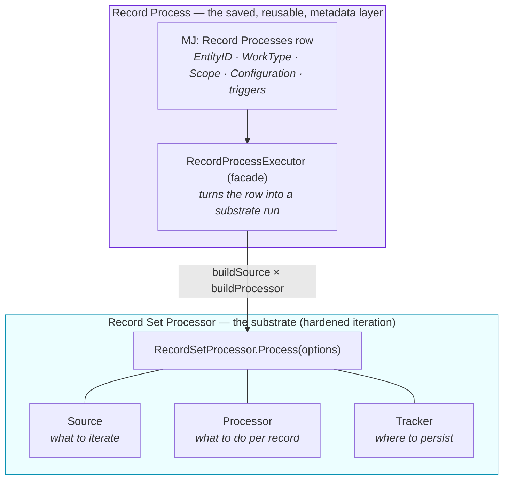
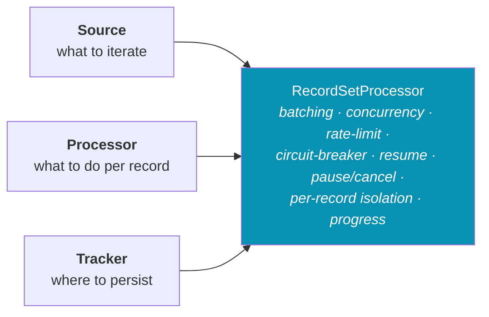
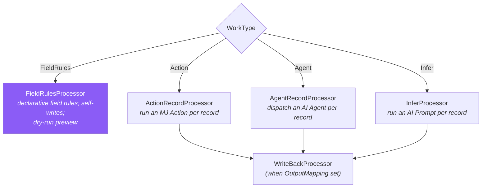
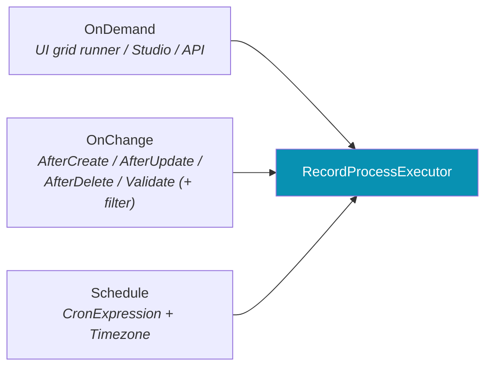
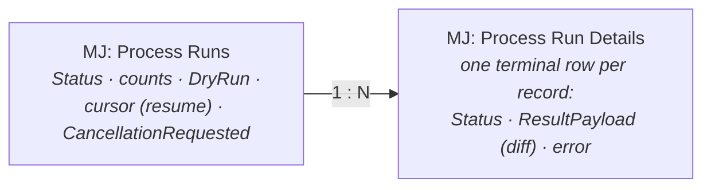

# Record Set Processing & Record Processes Guide

MemberJunction has **one** hardened substrate for *"do X to a set of an entity's records"* — batch a customer
view through an Action, run an AI agent over every flagged ticket, stamp a field on selected rows, infer a
summary per record and write it back. Instead of every feature re-implementing batching, concurrency,
rate-limiting, resume, and audit, they all route through the **Record Set Processor**, and most are declared as
reusable, metadata-defined **Record Processes** that a business user can author and run from the UI.

This guide is the map. It ties together five packages and two plan docs that each document one layer in
isolation:

| Layer | Package | What it is |
|---|---|---|
| Substrate seams + sources | [`@memberjunction/record-set-processor-base`](../packages/RecordSetProcessor/base/README.md) | client-safe types, the 3 seams, built-in sources |
| Substrate engine | [`@memberjunction/record-set-processor`](../packages/RecordSetProcessor/engine/README.md) | the hardened iteration lifecycle + the `RecordProcessExecutor` facade |
| Authoring + run UX | [`@memberjunction/ng-record-process-studio`](../packages/Angular/Generic/record-process-studio/README.md) | the Bulk Operations studio (hub / editor / history) |
| In-grid runner | [`@memberjunction/ng-entity-action-ux`](../packages/Angular/Generic/entity-action-ux/README.md) | the dry-run → diff → apply runner mounted from an entity grid |
| API surface | [`Remote Operations Guide`](REMOTE_OPERATIONS_GUIDE.md) | `RecordProcess.RunNow` + the control ops |

---

## 1. Two layers: the substrate and the Record Process



- **The substrate** (`RecordSetProcessor`) is the lower, code-level primitive: you compose a **Source × Processor
  × Tracker** and call `Process(options)`. Anything that iterates a record set can use it directly — a scheduled
  job, a one-off script, an import pipeline.
- **A Record Process** is the higher, declarative layer: a saved `MJ: Record Processes` row that names a target
  entity, a **work type**, a **scope**, and a JSON **Configuration**. The `RecordProcessExecutor` facade reads
  that row and assembles the substrate run for you. This is what the Bulk Operations UI authors and runs.

Use the **substrate directly** when you're writing code that owns its own logic. Use a **Record Process** when the
operation should be reusable, user-authorable, schedulable, or triggerable on data change.

---

## 2. The substrate — three seams the engine composes

A processing job is three independent choices. The engine owns the hard parts *between* them.



### Source — *what records to iterate*
Sources paginate themselves and hand back an opaque `ProcessCursor` the engine round-trips for resume.

| Source | Pagination | Use for |
|---|---|---|
| `ArraySource` | offset (in-memory) | a fixed list of `RecordRef`; also `SingleRecord` scopes |
| `ViewSource` | offset | a saved User View (arbitrary order/filter → offset) |
| `ListSource` | offset | a List's members (via `MJ: List Details`) |
| `FilterSource` | keyset → offset | entity + ad-hoc WHERE; keyset when the PK is single & orderable |
| `KeysetSource` | keyset (required) | large background sweeps — O(log N) per page, any depth |

### Processor — *what to do with each record*
Returns a `RecordResult` (`Succeeded` / `Failed` / `Skipped`) plus an optional `ResultPayload`. The built-ins are
covered in [§4](#4-the-four-work-types); `FunctionRecordProcessor` wraps an arbitrary function for code callers.

### Tracker — *where to persist run + per-record audit*
- `GenericProcessRunTracker` (default) — writes `MJ: Process Runs` + `MJ: Process Run Details`.
- `NoOpTracker` — persists nothing (fire-and-forget single-record work).
- Your own `IProcessRunTracker` — persist into domain-specific tables.

### What the engine owns (so no consumer re-invents it)
Batching · bounded concurrency within a batch (`maxConcurrency`) · optional token-bucket **rate limiting** ·
an **error-rate circuit breaker** · a **budget gate** (`onAfterBatch`) · **progress events** per batch · a
**pause/cancel handshake** (the tracker re-reads its cancellation flag at each checkpoint) · **resume** from an
offset or keyset cursor · and **per-record error isolation** — one bad record never aborts its batch.

```typescript
import { RecordSetProcessor, FunctionRecordProcessor } from '@memberjunction/record-set-processor';
import { ViewSource } from '@memberjunction/record-set-processor-base';

const result = await RecordSetProcessor.Instance.Process({
    source: new ViewSource(activeCustomersViewID),
    processor: new FunctionRecordProcessor(async (record, ctx) => {
        // ...work for `record` using ctx.provider / ctx.contextUser...
        return { Status: 'Succeeded', ResultPayload: { summarized: true } };
    }),
    contextUser,
    batchSize: 100,
    maxConcurrency: 4,
    triggeredBy: 'Schedule',
});
// result.Status, result.Success/result.Processed, result.ProcessRunID
```

---

## 3. Record Processes — the metadata layer

A **Record Process** (`MJ: Record Processes`) is a saved operation. Its columns are the entire authoring surface:

| Column | Role |
|---|---|
| `EntityID` | the target entity |
| `WorkType` | `FieldRules` · `Action` · `Agent` · `Infer` (see [§4](#4-the-four-work-types)) |
| `ActionID` / `AgentID` / `PromptID` | the work reference for `Action` / `Agent` / `Infer` |
| `ScopeType` + `ScopeViewID` / `ScopeListID` / `ScopeFilter` | the stored scope (see [§5](#5-scopes)) |
| `Configuration` | JSON — for `FieldRules`, the `FieldRuleSet`; for others, work-specific config |
| `InputMapping` / `OutputMapping` | shape the work's input + write its output back (Action/Agent/Infer) |
| `OnChangeEnabled` + `OnChangeInvocationType` + `OnChangeFilter` | trigger on entity events |
| `ScheduleEnabled` + `CronExpression` + `Timezone` | trigger on a schedule |
| `OnDemandEnabled` | runnable from the UI / API |
| `BatchSize` / `MaxConcurrency` | substrate knobs |
| `SkipUnchanged` | don't write (or count) records the work left unchanged |

The **`RecordProcessExecutor`** facade turns a row into a substrate run:

```typescript
import { RecordProcessExecutor } from '@memberjunction/record-set-processor';

const result = await new RecordProcessExecutor().RunByID(recordProcessID, {
    contextUser,
    triggeredBy: 'OnDemand',
    dryRun: true,                          // compute-only preview (FieldRules) — see §6
    scope: { Kind: 'records', RecordIDs }, // runtime scope override — see §5
});
```

Internally it calls `buildSource(rp, …)` (scope → Source) and `buildProcessor(rp, dryRun)` (work type → Processor),
then hands both to `RecordSetProcessor.Process`.

---

## 4. The four work types

`buildProcessor` maps `WorkType` to a processor. For `Action` / `Agent` / `Infer`, when an `OutputMapping` is
present the base processor is wrapped in a `WriteBackProcessor` that persists the result onto the record (or a
child record). `FieldRules` owns its own write, so it is **not** wrapped.



| Work type | Reference | What runs per record | Write-back |
|---|---|---|---|
| **FieldRules** | `Configuration` = `FieldRuleSet` | a set of rules, each setting a field from a fixed value / another field / a formula / an entity lookup / an **AI prompt** | self-writes; supports **dry-run preview** |
| **Action** | `ActionID` (+ `InputMapping`) | an MJ **Action** | via `OutputMapping` |
| **Agent** | `AgentID` (+ `InputMapping`) | an **AI Agent** (must be top-level + `ExposeAsAction`) | via `OutputMapping` |
| **Infer** | `PromptID` (+ `InputMapping`) | an **AI Prompt** → inferred values | via `OutputMapping` |

**FieldRules** is the flagship and the one with full authoring UI. Its rule engine is layered so the transform
logic lives exactly once: pure evaluation in `@memberjunction/global` (`FieldTransformEngine` +
`FieldRulesEvaluator`, returning a per-field diff **without mutating**), and the metadata-aware layer in
`@memberjunction/core` (`EntityFieldRules` — validation, type coercion, lookup resolution, `ApplyToEntity({DryRun})`
with Record Changes versioning).

> **⚠️ `Infer` (AI Prompt) is NOT ML inference.** The **`Infer`** work type above runs an **AI Prompt** per record
> (an LLM call → inferred values). It is unrelated to *predictive-model* scoring. **Predictive Studio** adds a
> separate **`ML Model`** work type (`MLModelInferenceProcessor`, registered on the ClassFactory via
> `@RegisterClass(MLModelInferenceProcessor, 'ML Model')` — see the
> [Predictive Studio Guide](PREDICTIVE_STUDIO_GUIDE.md)) that runs a **trained ML model** through the Python
> sidecar. It plugs in *without forking this substrate* (it registers externally rather than editing
> `buildProcessor`), and like the other work types it write-backs via `WriteBackProcessor` when an `OutputMapping`
> is set. When you mean "run a trained model over a record set," you want **`ML Model`**, not **`Infer`**.

---

## 5. Scopes — *which records to run over*

A Record Process has a **stored** scope (`ScopeType`), and a run can pass a **runtime override** — "run against
exactly what the user is looking at in this grid."

**Stored** (`ScopeType`): `View` (`ScopeViewID`) · `List` (`ScopeListID`) · `Filter` (`ScopeFilter`) ·
`SingleRecord` (needs a record id at run time).

**Runtime override** (`RecordProcessScopeOverride`, passed as `scope`):

```typescript
type RecordProcessScopeOverride =
    | { Kind: 'records'; RecordIDs: string[] }   // the user's selection
    | { Kind: 'view';    ViewID: string }
    | { Kind: 'list';    ListID: string }
    | { Kind: 'filter';  Filter?: string };
```

The override wins over the stored scope, which is how a grid runs a process against the selected rows / the
current view without editing the saved definition.

---

## 6. Dry-run — preview the per-record diff without writing

For `FieldRules`, `dryRun: true` computes the exact per-record change set and persists it (as `Process Run
Details`) **without writing anything to the target records**. This powers the preview step of the bulk-update UX:
review the diff, then apply.

The run header carries a first-class **`DryRun`** flag (`MJ: Process Runs`), so run history can distinguish a
compute-only preview from a real apply (the studio renders a **"Dry Run"** chip). A normal apply records
`DryRun = 0`.

```typescript
// preview
await new RecordProcessExecutor().RunByID(id, { contextUser, dryRun: true,  scope });
// apply
await new RecordProcessExecutor().RunByID(id, { contextUser, dryRun: false, scope });
```

---

## 7. Triggers — three ways a Record Process runs



- **OnDemand** — the Bulk Operations studio, the in-grid runner, or `RecordProcess.RunNow` over the API.
- **OnChange** — fires on entity events matching `OnChangeInvocationType` + `OnChangeFilter` (single-record scope).
- **Schedule** — the scheduling engine invokes `RecordProcessExecutor` on the cron in the given timezone.

---

## 8. The persisted run model



- The **run header** tracks status (`Running → Completed / Failed / Paused / Cancelled`), the counts
  (`Processed / Success / Error / Skipped`), the `DryRun` flag, the resume cursor (`LastProcessedOffset` /
  `LastProcessedKey`), and `CancellationRequested`.
- Each **detail** is one terminal record outcome plus its `ResultPayload` (for FieldRules, the field diff that
  was — or would be — applied). Details are written **fire-and-forget** by the tracker's `BaseEntitySaveQueue`
  and flushed before the run finalizes.
- **Pause / cancel** flip `CancellationRequested`; the engine re-reads it each checkpoint and stops, leaving a
  resume cursor. **Resume** picks up from that cursor on the next run.

---

## 9. The UI — authoring & running

Two surfaces, one engine (see the [Studio](../packages/Angular/Generic/record-process-studio/README.md) and
[Runner](../packages/Angular/Generic/entity-action-ux/README.md) READMEs for component-level detail):

- **Bulk Operations app → Record Process Studio** (`ng-record-process-studio`): a hub (list/create/edit/run), an
  **editor** with the visual **FieldRules builder** + an inline dry-run **Preview**, and a **reactive run history**
  (live-updates on run changes via BaseEntity events — no manual refresh).
- **In-grid runner** (`ng-entity-action-ux`, driver `RecordProcessRunnerUX`): mounted from an entity grid via a
  metadata-wired entity action; does server **dry-run → per-record diff review → confirm → apply**, against the
  user's selection / current view.

---

## 10. The API surface — Remote Operations

Record Processes are invoked over the wire (and in-process) through **Remote Operations** — MJ's typed 4th data
primitive — so the browser and server call them the same way:

| Operation | Purpose |
|---|---|
| `RecordProcess.RunNow` | run a process (with `dryRun`, runtime `scope`, and live `onProgress`) |
| `RecordProcess.GetRunStatus` | poll a run's status + counts |
| `RecordProcess.Pause` / `.Resume` / `.Cancel` | control a run |

```typescript
import { RecordProcessRunNowOperation } from '@memberjunction/core-entities';

const r = await new RecordProcessRunNowOperation().Execute(
    { recordProcessID, dryRun: true, scope: { Kind: 'records', RecordIDs } },
    { onProgress: (p) => console.log(p.Message) },
);
```

See the [**Remote Operations Guide**](REMOTE_OPERATIONS_GUIDE.md) for the full picture of how these are declared
and routed.

---

## 11. Extension recipes

**Add a Source** — implement `IRecordSetSource` (`Describe()` + `NextBatch(cursor, batchSize, user, provider)`)
in `@memberjunction/record-set-processor-base`. Paginate yourself; round-trip the `ProcessCursor` for resume.

**Add a Processor (custom logic)** — implement `IRecordProcessor.Process(record, ctx)` returning a `RecordResult`.
For a one-off, wrap a function in `FunctionRecordProcessor`.

**Add a new Work Type** — (1) add the value to `RecordProcess.WorkType` (migration + CodeGen), (2) write the
processor in the engine, (3) add a branch to `RecordProcessExecutor.buildProcessor`, (4) wire any new config
column (`*ID` / mapping). The `Infer` work type is the worked example — see the design plan §18.

**Add a custom Tracker** — implement `IProcessRunTracker` (`BeginRun` / `RecordResult` / `Checkpoint` /
`CompleteRun` / `LoadResumeCursor`) to persist into domain-specific tables instead of the generic ones.

---

## 12. Performance & safety notes

- **Deep sweeps** → `KeysetSource` (O(log N)/page at any depth; single-column PK required). UI-depth paging can
  stay on offset.
- **Throughput** → tune `BatchSize` × `MaxConcurrency`; add `rateLimit` for provider-bound work (Action/Agent/Infer).
- **Resilience** → the circuit breaker auto-fails a runaway error rate; per-record isolation contains a thrown
  processor; resume continues an interrupted run from its cursor.
- **Server-only** → `@memberjunction/record-set-processor` executes + persists; import it on the server. The
  `-base` package (types + seams + sources) is client-safe.

---

## See also

- Package READMEs: [base](../packages/RecordSetProcessor/base/README.md) ·
  [engine](../packages/RecordSetProcessor/engine/README.md) ·
  [studio](../packages/Angular/Generic/record-process-studio/README.md) ·
  [runner](../packages/Angular/Generic/entity-action-ux/README.md) ·
  [overview](../packages/RecordSetProcessor/README.md)
- [**Remote Operations Guide**](REMOTE_OPERATIONS_GUIDE.md) — the typed API surface (`RecordProcess.*`).
- [**Keyset Pagination Guide**](KEYSET_PAGINATION_GUIDE.md) — the `AfterKey` mechanism `KeysetSource`/`FilterSource` use.
- `plans/record-set-processing-and-record-processes.md` (repo root) — the design history + decisions (RO-0 … RO-4).
