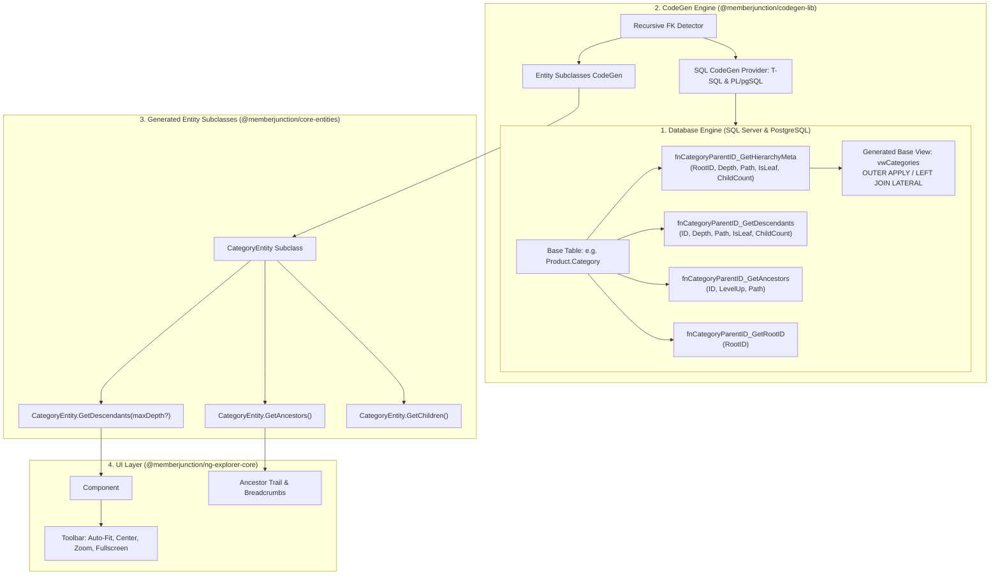
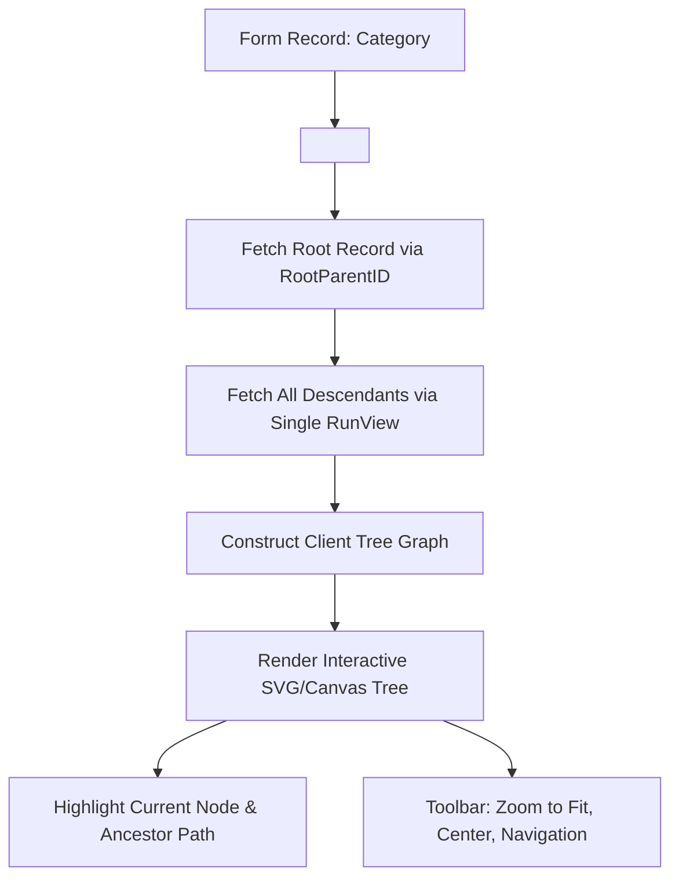

# Recursive Foreign Keys & Hierarchy Traversal Architecture

> **Audience**: Backend engineers, full-stack developers, and database architects building tree-structured domains (categories, organizational charts, task trees, folder structures, nested taxonomies) on MemberJunction.
>
> **Related Guides**:
> - [Building Apps on MemberJunction](BUILDING_APPS_ON_MJ.md) — schema conventions and CodeGen workflow
> - [Transactions, Batching & Entity Graphs](TRANSACTIONS_AND_BATCHING_GUIDE.md) — 1:N and 1:1 record cascades
> - [PostgreSQL Schema Casing Guide](POSTGRES_SCHEMA_CASING_GUIDE.md) — cross-engine casing stability

---

## 1. Overview & Architectural Philosophy

Hierarchical and tree-structured data models (e.g. self-referencing entities where a record points to a parent in the same entity) are notoriously difficult to scale and query efficiently in relational databases. Traditional approaches force a painful tradeoff:

1. **Adjacency Lists (`ParentID`)**: Simple to write and mutate, but requires expensive multiple round-trips or recursive CTE queries every time a client needs to display an ancestor trail, find all descendants, or render a tree view.
2. **Materialized Path / Nested Sets**: Fast reads, but slow and complex writes with fragile locking during subtree moves or insertions.

**MemberJunction provides the best of both worlds**:
- Schema authors define a simple, clean self-referencing foreign key (e.g. `ParentID` pointing to the same table).
- MemberJunction's CodeGen automatically creates a high-performance **Table-Valued Function (TVF) hierarchy suite** on the database and enriches the base view with calculated hierarchy metadata.
- **Zero Query Overhead**: Unselected hierarchy columns are pruned by the SQL query optimizer. When queried, inline TVFs / lateral joins compute root identifiers, tree depth, lineage path, leaf status, and child count in a single set-based scan.
- **Strongly Typed TypeScript Methods**: Entity subclasses automatically gain `GetDescendants()`, `GetAncestors()`, and `GetChildren()` backed by single-query `RunView` calls.
- **Out-of-the-Box Angular Visualization**: The `<mj-hierarchy-tree>` form component renders interactive visual trees with automatic zoom-to-fit, pan, centering, and deep-link node selection.

---

## 2. End-to-End Hierarchy Flow



---

## 3. Database Layer: Generated Hierarchy TVF Suite

For every self-referencing foreign key detected on an entity (where `RelatedEntityID === Entity.ID`), CodeGen emits four specialized routines ahead of the base view:

| Routine Suffix | SQL Server Name Pattern | PostgreSQL Name Pattern | Returns | Primary Use Case |
|---|---|---|---|---|
| **Hierarchy Meta** | `fn<Table><Field>_GetHierarchyMeta` | `fn_<table_snake>_<field_snake>_get_hierarchy_meta` | `RootID, Depth, Path, IsLeaf, ChildCount` | Projected into the base view via `OUTER APPLY` / `LEFT JOIN LATERAL` |
| **Descendants** | `fn<Table><Field>_GetDescendants` | `fn_<table_snake>_<field_snake>_get_descendants` | `ID, Depth, Path, IsLeaf, ChildCount` | Subtree retrieval and filtering below any arbitrary node |
| **Ancestors** | `fn<Table><Field>_GetAncestors` | `fn_<table_snake>_<field_snake>_get_ancestors` | `ID, LevelUp, Path` | Upward lineage traversal from leaf to root |
| **Root ID** | `fn<Table><Field>_GetRootID` | `fn_<table_snake>_<field_snake>_get_root_id` | `RootID` | Fast root resolution (legacy compatibility) |

### 3.1. Hierarchy Metadata Columns in Generated Base Views

Every entity with a recursive foreign key automatically projects five computed columns into its `vw<Entities>` view:

```sql
-- SQL Server View Projection Example
SELECT
    c.*,
    hier_ParentID.RootID AS [RootParentID],
    hier_ParentID.Depth AS [ParentIDDepth],
    hier_ParentID.Path AS [ParentIDPath],
    hier_ParentID.IsLeaf AS [ParentIDIsLeaf],
    hier_ParentID.ChildCount AS [ParentIDChildCount]
FROM
    [sales].[Category] AS c
OUTER APPLY
    [sales].[fnCategoryParentID_GetHierarchyMeta]([c].[ID], [c].[ParentID]) AS hier_ParentID
```

```sql
-- PostgreSQL View Projection Example
SELECT
    c.*,
    hier_ParentID."RootID" AS "RootParentID",
    hier_ParentID."Depth" AS "ParentIDDepth",
    hier_ParentID."Path" AS "ParentIDPath",
    hier_ParentID."IsLeaf" AS "ParentIDIsLeaf",
    hier_ParentID."ChildCount" AS "ParentIDChildCount"
FROM
    "sales"."Category" AS c
LEFT JOIN LATERAL
    "sales"."fn_category_parent_id_get_hierarchy_meta"(c."ID", c."ParentID") AS hier_ParentID ON true
```

### 3.2. Column Semantics & Materialized Lineage Format

- **`Root<FieldName>`** (`UUID` / `uniqueidentifier`): The top-level ancestor ID of the hierarchy tree. If a record has no parent (`ParentID IS NULL`), `Root<FieldName>` equals its own `ID`.
- **`<FieldName>Depth`** (`int`): Zero-based distance from the root. Root nodes have `Depth = 0`, direct children have `Depth = 1`, grandchildren have `Depth = 2`.
- **`<FieldName>Path`** (`string` / `varchar`): Materialized lineage breadcrumb formatted with forward slashes:
  ```
  /<RootID>/<ChildID>/<GrandchildID>/
  ```
  *Example*: `/E2B45F20-1111-4A1B-8234-A0B1C2D3E4F5/A7C89D01-2222-4B2C-9345-B1C2D3E4F5A6/`
- **`<FieldName>IsLeaf`** (`boolean` / `bit`): `1` (`true`) if no child records point to this record, `0` (`false`) if it has one or more children.
- **`<FieldName>ChildCount`** (`int`): Count of direct child records pointing to this record as their parent.

### 3.3. Performance & Optimization Architecture

1. **Inline TVFs & Lateral Optimization**:
   Because SQL Server ITVFs and PostgreSQL `LEFT JOIN LATERAL` functions return inline query definitions (not multi-statement execution blocks), the relational engine's query optimizer can inline the function directly into the outer query plan. If an application queries `SELECT ID, Name FROM vwCategories`, the query optimizer **completely prunes the hierarchy join from physical execution plan**, resulting in **zero I/O overhead**.
2. **Short-Circuit on Root Records**:
   When `ParentID IS NULL`, the TVF bypasses recursive CTE execution entirely and returns immediate constant expressions (`RootID = RecordID`, `Depth = 0`, `Path = '/' + RecordID + '/'`).
3. **Cycle Guard**:
   All recursive CTE queries enforce `Depth < 100` (or `LevelUp < 100`) termination limits to prevent runaway loops in the event of corrupt or cyclical data.

---

## 4. TypeScript & BaseEntity API

When CodeGen runs, generated entity subclasses (in `@memberjunction/core-entities` or application entity packages) inspect their metadata and automatically generate strongly-typed helper methods for each recursive relationship.

### 4.1. Method Signatures

```typescript
export class CategoryEntity extends BaseEntity<CategoryEntityType> {
    /**
     * Retrieves all descendant records in the hierarchy under this record using a single RunView query.
     * @param maxDepth Optional maximum relative depth to retrieve.
     * @returns Array of descendant entity instances ordered by hierarchy depth.
     */
    public async GetDescendants(maxDepth?: number): Promise<CategoryEntity[]>;

    /**
     * Retrieves all ancestor records in the hierarchy from the top-level root down to this record using a single RunView query.
     * @returns Array of ancestor entity instances ordered from root down to parent.
     */
    public async GetAncestors(): Promise<CategoryEntity[]>;

    /**
     * Retrieves all direct child records of this record using a single RunView query.
     * @returns Array of direct child entity instances.
     */
    public async GetChildren(): Promise<CategoryEntity[]>;
}
```

> **Naming Rule**: If an entity has multiple recursive foreign keys (e.g. `ParentID` and `ManagerID`), the primary `ParentID` relationship receives the clean `GetDescendants()` / `GetAncestors()` / `GetChildren()` names, while additional relationships receive field-prefixed names such as `GetManagerIDDescendants()`.

### 4.2. TypeScript Usage Examples

#### Example 1: Loading Subtree Descendants
```typescript
import { CategoryEntity } from '@memberjunction/core-entities';

const category = new CategoryEntity();
await category.Load('E2B45F20-1111-4A1B-8234-A0B1C2D3E4F5');

// Retrieve all descendants at any depth
const allDescendants = await category.GetDescendants();
console.log(`Found ${allDescendants.length} descendant categories under ${category.Name}`);

// Retrieve immediate children and grandchildren only (maxDepth = 2)
const shallowDescendants = await category.GetDescendants(2);
```

#### Example 2: Building Breadcrumbs from Ancestors
```typescript
// Fetch the complete lineage chain from top-level root down to the parent
const ancestors = await category.GetAncestors();

const breadcrumbTrail = [...ancestors, category]
    .map(c => c.Name)
    .join(' > ');

console.log(breadcrumbTrail);
// Output: "Electronics > Audio > Headphones > Noise-Cancelling"
```

#### Example 3: Zero-Query Client-Side Ancestor ID Extraction
Because the `<Field>Path` column is already loaded on the entity instance, client-side code can extract all ancestor IDs **instantaneously without issuing any database queries**:

```typescript
const path = category.ParentIDPath; // e.g. "/root-uuid/parent-uuid/current-uuid/"
if (path) {
    const ancestorIds = path
        .split('/')
        .filter(id => id.length > 0 && id !== category.ID);
    
    console.log('Ancestor IDs:', ancestorIds);
}
```

### 4.3. Querying Hierarchies Directly via `RunView` (Outside `BaseEntity`)

You do not need an instantiated entity object to query hierarchy structures. Because the base view (`vw<Entities>`) automatically projects `Root<Field>`, `<Field>Depth`, `<Field>Path`, `<Field>IsLeaf`, and `<Field>ChildCount`, you can pass standard filter expressions into `RunView`:

```typescript
import { RunView } from '@memberjunction/core';
import type { CategoryEntity } from '@memberjunction/core-entities';

const rv = new RunView();

// 1. Retrieve all descendants under an item across the wire (with full RLS, permissions, and caching)
const descendantsResult = await rv.RunView<CategoryEntity>({
    EntityName: 'Product Categories',
    ExtraFilter: `RootParentProductCategoryID = '${categoryId}'`,
    OrderBy: 'ParentProductCategoryIDDepth ASC',
});
const descendants = descendantsResult.Success ? descendantsResult.Results : [];

// 2. Retrieve subtree bounded to a maximum depth (e.g. 2 levels deep)
const shallowResult = await rv.RunView<CategoryEntity>({
    EntityName: 'Product Categories',
    ExtraFilter: `RootParentProductCategoryID = '${categoryId}' AND ParentProductCategoryIDDepth <= 2`,
    OrderBy: 'ParentProductCategoryIDDepth ASC',
});

// 3. Retrieve direct children only
const childrenResult = await rv.RunView<CategoryEntity>({
    EntityName: 'Product Categories',
    ExtraFilter: `ParentProductCategoryID = '${categoryId}'`,
});
```

---

## 5. UI Layer: Angular `<mj-hierarchy-tree>` Component

MemberJunction includes a specialized Angular component (`packages/Angular/Explorer/explorer-core/src/lib/hierarchy-tree/`) designed for embedding into entity record forms, dashboards, and custom viewers.



### 5.1. Embedding in Custom Entity Forms

```html
<!-- Custom Form HTML: e.g. category.form.component.html -->
<div class="category-hierarchy-container">
    <mj-hierarchy-tree
        [entityName]="'Categories'"
        [recordId]="record.ID"
        [parentFieldName]="'ParentID'"
        [displayFieldName]="'Name'"
        (nodeSelected)="onCategoryNodeSelected($event)"
    ></mj-hierarchy-tree>
</div>
```

### 5.2. Component Features

- **Full-Height Container Fill**: The tree fluidly stretches to utilize 100% of available height within form sections and card panels.
- **Smart Zoom-to-Fit & Center**: The dedicated toolbar button recalculates bounding boxes and scales the visual graph to fit the visible viewport cleanly.
- **Active Node Highlighting**: The currently loaded record is visually accented with an active ring and glowing connector line trace back to root.
- **Instant Node Navigation**: Clicking any node in the tree emits navigation events or opens the corresponding record seamlessly.

---

## 6. SQL Query Recipes & Direct TVF Invocations

### Recipe 1: Query All Records Belonging to a Specific Tree via Base View
```sql
-- Find all categories under the 'Electronics' root category
SELECT
    ID,
    Name,
    ParentIDDepth,
    ParentIDPath
FROM
    vwCategories
WHERE
    RootParentID = 'E2B45F20-1111-4A1B-8234-A0B1C2D3E4F5'
ORDER BY
    ParentIDDepth ASC,
    Name ASC;
```

### Recipe 2: Subtree Matching via Path Pattern
```sql
-- Find all descendants under an intermediate branch (node X)
SELECT
    ID,
    Name,
    ParentIDDepth
FROM
    vwCategories
WHERE
    ParentIDPath LIKE '%/A7C89D01-2222-4B2C-9345-B1C2D3E4F5A6/%'
ORDER BY
    ParentIDDepth ASC;
```

### Recipe 3: Invoking Generated TVF Routines Directly in Backend SQL & Stored Procedures

For server-side ETL, reporting queries, or custom stored procedures, you can query the generated table-valued functions directly:

#### A. Full Subtree Descendants
```sql
-- SQL Server (T-SQL)
SELECT d.ID, d.Depth, d.Path, c.Name
FROM [__mj].[fnCategoryParentID_GetDescendants]('E2B45F20-1111-4A1B-8234-A0B1C2D3E4F5', NULL) d
JOIN [__mj].[vwCategories] c ON c.ID = d.ID
ORDER BY d.Depth ASC;

-- PostgreSQL (PL/pgSQL)
SELECT d."ID", d."Depth", d."Path", c."Name"
FROM "__mj"."fn_category_parent_id_get_descendants"('e2b45f20-1111-4a1b-8234-a0b1c2d3e4f5', NULL) d
JOIN "__mj"."vwCategories" c ON c."ID" = d."ID"
ORDER BY d."Depth" ASC;
```

#### B. Ancestor Lineage (Root Down to Parent)
```sql
-- SQL Server (T-SQL)
SELECT * FROM [__mj].[fnCategoryParentID_GetAncestors]('A7C89D01-2222-4B2C-9345-B1C2D3E4F5A6');

-- PostgreSQL (PL/pgSQL)
SELECT * FROM "__mj"."fn_category_parent_id_get_ancestors"('a7c89d01-2222-4b2c-9345-b1c2d3e4f5a6');
```

#### C. Fast Top-Level Root ID Resolution
```sql
-- SQL Server (T-SQL)
SELECT [__mj].[fnCategoryParentID_GetRootID]('A7C89D01-2222-4B2C-9345-B1C2D3E4F5A6') AS RootID;

-- PostgreSQL (PL/pgSQL)
SELECT "__mj"."fn_category_parent_id_get_root_id"('a7c89d01-2222-4b2c-9345-b1c2d3e4f5a6') AS "RootID";
```

### Recipe 4: Leaf-Only Aggregations
```sql
-- Calculate sum of product inventory across leaf categories only
SELECT
    c.Name,
    COUNT(p.ID) AS TotalProducts
FROM
    vwCategories c
LEFT JOIN
    vwProducts p ON p.CategoryID = c.ID
WHERE
    c.ParentIDIsLeaf = 1
GROUP BY
    c.ID,
    c.Name;
```

---

## 7. Migration & Upgrade Notes

1. **Automatic View Regeneration**: When CodeGen detects a recursive foreign key in metadata, it generates the TVF suite and drops/recreates the base view with hierarchy columns.
2. **Metadata Synchronization**: When upgrading an existing database, run `mj codegen` so that `spUpdateExistingEntityFieldsFromSchema` registers the new `Root*`, `*Depth`, `*Path`, `*IsLeaf`, and `*ChildCount` columns in the `EntityField` catalog.
3. **Cross-Engine Support**: The hierarchy traversal engine is fully tested and supported on both **Microsoft SQL Server (2019+)** and **PostgreSQL (14+)**.

