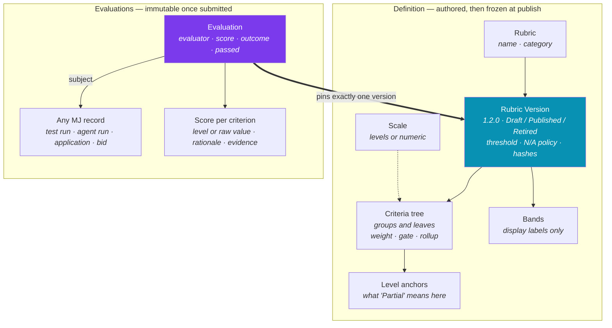
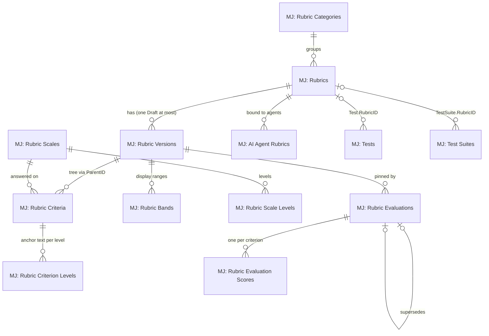
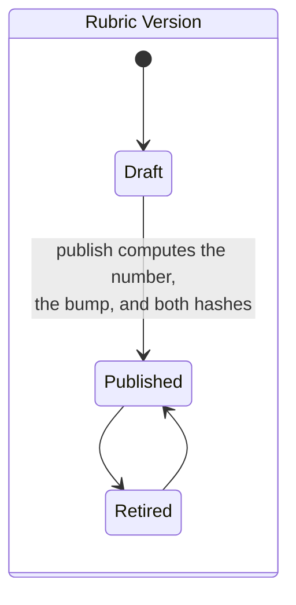
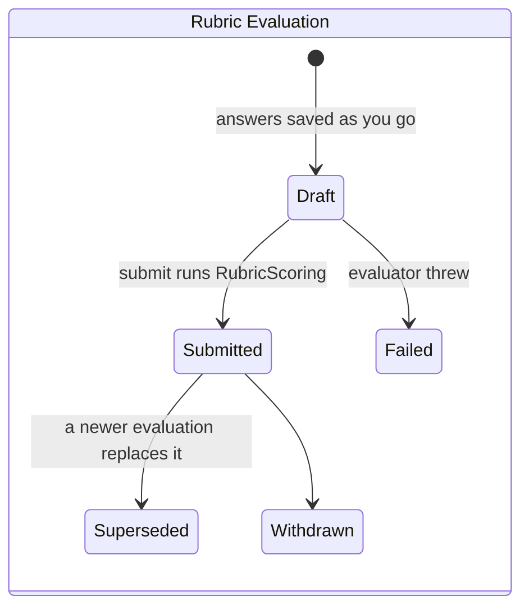
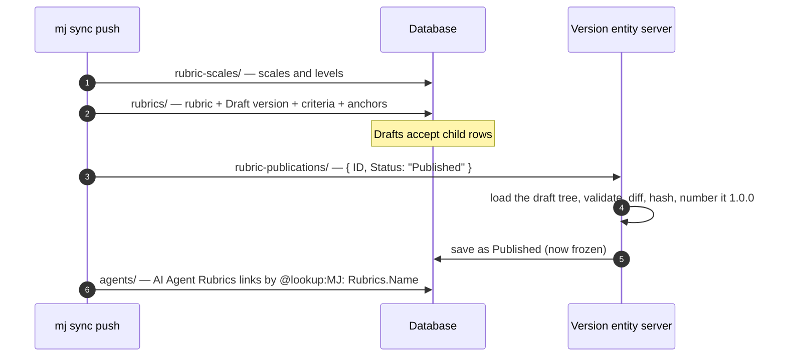
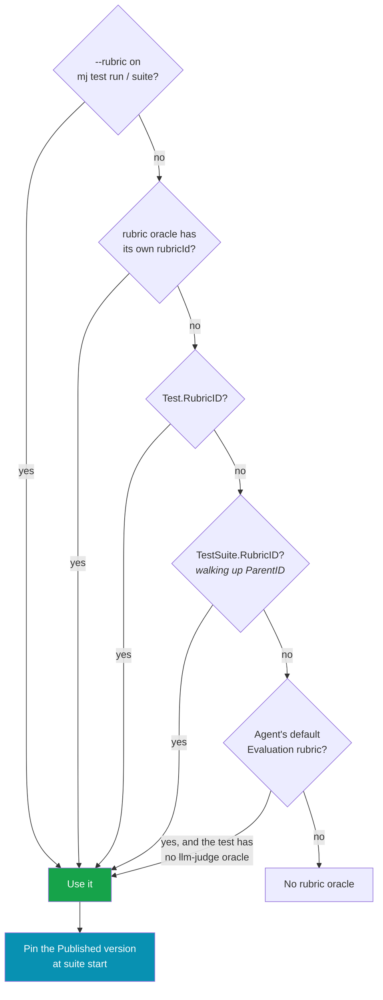
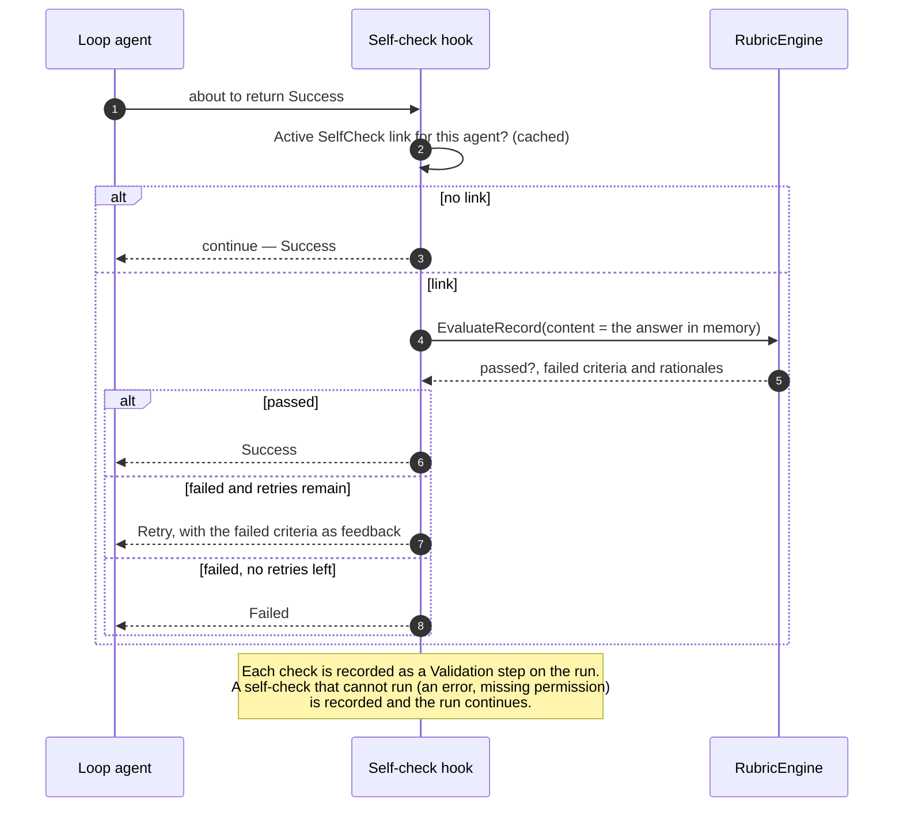
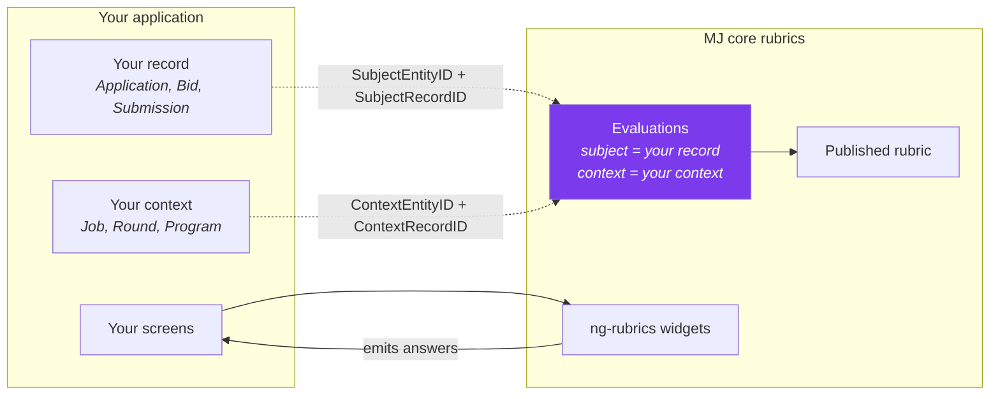
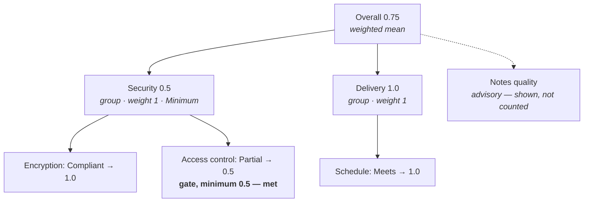
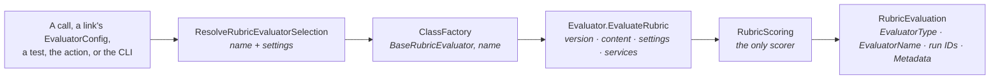

# Rubrics Guide

A **rubric** is a named, versioned set of criteria used to score any record in MemberJunction. A person, an
AI prompt, an agent, or a deterministic rule answers the criteria; one function, `RubricScoring`, turns the
answers into a stored score. Rubrics are a core primitive: the testing framework judges test runs with them,
agents check their own output with them, and applications score their own records with them.

**Read this guide before** you author a rubric, score a record, publish a version, bind a rubric to an agent
or a test, or build an application on top of rubrics. It is the map. The package READMEs are the API
reference:

| Layer | Package | What it is |
|---|---|---|
| Math | [`@memberjunction/rubrics-base`](../packages/Rubrics/Base/README.md) | `RubricScoring`, `RubricVersionDiff`, snapshots. Pure functions, browser-safe |
| Engine + evaluators | [`@memberjunction/rubrics`](../packages/Rubrics/Engine/README.md) | `RubricEngine`, the evaluator registry and the LLM / Decision / Agent / Deterministic / Human evaluators, actions, `mj rubric` |
| Server rules | `@memberjunction/core-entities-server` | Publish, submit, supersede, and validation on the entity subclasses |
| Widgets | [`@memberjunction/ng-rubrics`](../packages/Angular/Generic/rubrics/README.md) | Author, answer, result, publish, diff, and comparison widgets |
| Testing | [`@memberjunction/testing-engine`](../packages/TestingFramework/Engine/README.md) | `RubricOracle`, rubric resolution, the calibration test type |

**Contents**

1. [The model in one picture](#1-the-model-in-one-picture)
2. [Quick start: five tasks](#2-quick-start-five-tasks)
3. [Rubrics in tests](#3-rubrics-in-tests)
4. [Rubrics on agents](#4-rubrics-on-agents)
5. [Adopting rubrics in an application](#5-adopting-rubrics-in-an-application)
6. [Scoring reference](#6-scoring-reference)
7. [Versioning reference](#7-versioning-reference)
8. [Evaluators](#8-evaluators)
9. [Consensus and agreement](#9-consensus-and-agreement)
10. [Who can see what](#10-who-can-see-what)
11. [Extending](#11-extending)
12. [CLI and screens](#12-cli-and-screens)
13. [Troubleshooting](#13-troubleshooting)
14. [Worked examples](#14-worked-examples)

---

## 1. The model in one picture

Two halves never mix. The **definition** (rubric → version → criteria) is authored, published once, and then
frozen. The **evaluations** (evaluation → scores) point at exactly one published version, so a score always
means what the version said when it was given.



### The entities



| Entity | Holds |
|---|---|
| `MJ: Rubrics` | The stable identity. Name is unique across the install. |
| `MJ: Rubric Versions` | Draft, Published, or Retired. Version numbers, pass threshold, minimum completeness, N/A policy, display range, `ContentHash`, `ScoringHash`, change details. |
| `MJ: Rubric Criteria` | The tree. `NodeType` Group or Criterion, a permanent `Key`, weight, gate, rollup, N/A policy, `EvaluatorConfig`. |
| `MJ: Rubric Criterion Levels` | Anchor text: what a given scale level means for this criterion. |
| `MJ: Rubric Bands` | Display labels over the 0..1 score, for example "Strong" from 0.8. Never part of pass/fail. |
| `MJ: Rubric Scales` / `Scale Levels` | Reusable answer scales: Meets / Partial / Miss, Binary, 1–5 Likert, Compliance, Percentage. |
| `MJ: Rubric Evaluations` | One scoring of one subject: who scored it, the stored score, outcome, completeness, and the cohort columns on its view. |
| `MJ: Rubric Evaluation Scores` | One row per criterion: the answer, rationale, evidence, and the computed contribution. |
| `MJ: AI Agent Rubrics` | Binds a rubric to an agent with a purpose: Evaluation, SelfCheck, or ProductionSampling. |

### The two lifecycles





Published versions and submitted evaluations are **frozen in the database**. Triggers refuse edits with errors
51101–51110 ([Troubleshooting](#13-troubleshooting)). To change a published rubric, publish a new version.
To correct a submitted evaluation, submit a new one that supersedes it.

---

## 2. Quick start: five tasks

### Task 1 — Author and publish a rubric in Explorer

1. Open the **Rubrics** application and create a rubric. It starts with an empty Draft version.
2. In the builder, add criteria. Each leaf needs a scale. Set weights; the builder shows each node's share of
   its group. Mark a criterion as a **gate** when falling short must fail the whole evaluation, and give the
   gate a minimum.
3. Write the anchors: for each level, what that level means for this criterion. Anchors are what an LLM judge
   and a human reviewer both read, so they decide how consistent the scores are.
4. Set the version's pass threshold and, if partial scoring should not count, a minimum completeness.
5. Try sample answers in the preview. It runs the same `RubricScoring` the server runs on submit.
6. **Publish.** The dialog shows the computed bump and the reason for each change. The server assigns the
   number, computes the hashes, and freezes the tree.

To change it later, choose **Start new draft**. The draft is cloned from the latest published version, and
publishing it assigns the next number from how scores would change ([Versioning](#7-versioning-reference)).

### Task 2 — Ship a rubric as metadata

Rubrics that ship with an application or with MJ core live under `metadata/`. A published version cannot be
inserted directly, because its criteria would be refused by the immutability triggers. So a shipped rubric is
authored as a **Draft**, and a separate directory flips it to Published through the server's publish path.



Rules that keep this working:

- **Order.** `rubric-scales`, `rubrics`, and `rubric-publications` are pushed before `agents` and `tests` in
  `metadata/.mj-sync.json`. Anything that looks up a rubric by name must come after them.
- **Author Drafts.** Write `"Status": "Draft"` (or omit it) on the version. Never write `MajorVersion`,
  `MinorVersion`, `PatchVersion`, `AppliedBump`, `ContentHash`, `ScoringHash`, or `PublishedAt`. Publish
  computes them.
- **Publish by record.** Each publication record is just `{ "fields": { "Status": "Published" },
  "primaryKey": { "ID": "<version id>" } }`. Pushing it again is a no-op.
- **Keys are permanent.** A criterion `Key` is its identity across versions, consensus, and drift. Use short
  semantic keys (`answers-the-question`), at most 100 characters. Renaming one is a Major change.
- **Fixed IDs.** Every record gets a `uuidgen` primary key, and no `sync` block (see
  [`metadata/CLAUDE.md`](../metadata/CLAUDE.md)).

See `metadata/rubrics/.research-answer.json` and `metadata/rubric-publications/` for the shipped pattern.

### Task 3 — Score a record from server code

`ProviderRubricEngine` returns an engine wired to a provider and a user. `EvaluateRecord` resolves the latest
published version, loads the subject, runs the evaluator, and submits the result in one call.

```typescript
import { ProviderRubricEngine } from '@memberjunction/rubrics';

const engine = ProviderRubricEngine(provider, contextUser);

const result = await engine.EvaluateRecord({
    rubricName: 'Vendor proposal',
    subjectEntityName: 'Vendor Proposals',   // any entity; the record is loaded by ID
    subjectRecordId: proposalId,
    contextEntityName: 'Procurement Rounds',  // optional: what the subject was scored for
    contextRecordId: roundId,
    evaluator: 'LLM',                          // any registered evaluator; LLM when omitted (section 8)
    settings: { ModelID: modelId },            // optional: prompt, model, mode, samples (section 8)
});

result.score;        // 0..1, or null when nothing could be scored
result.outcome;      // 'Passed' | 'BelowThreshold' | 'GateFailed' | 'Incomplete' | ...
result.displayScore; // the score on the version's display range, for example 0..100
result.criteria;     // [{ key, normalizedScore, rationale }]
result.evaluationId; // the stored MJ: Rubric Evaluations row
```

`EvaluateRecord` throws when the rubric has no published version, when the subject is missing or not readable
by `contextUser`, or when the evaluator fails. A failed run is still stored as a `Failed` evaluation with its
`ErrorMessage`. Pass `versionId` to score against one specific version, and `content` when the subject is
already in memory (self-check does this, because the run's payload is not saved yet). Pass `evaluatorConfig`
instead of `evaluator` and `settings` to use a stored evaluator selection as is, the way sampling and self-check do.

From an agent, a workflow, or a low-code builder, use the **Evaluate Record Against Rubric** action. It takes
the same inputs and returns `EvaluationID`, `Score`, `Outcome`, and `Criteria`.

### Task 4 — Have a person score it

A person answers the same criteria in the scoring form (`mj-rubric-scoring-form`). Digits pick a level,
`N` marks a criterion not applicable, required rationale and evidence block submit, and every change is
emitted so the host can autosave the draft. The test review dialog already hosts it for test runs.

To submit a human score without the UI, call the **Submit Human Rubric** action. It writes the evaluation,
its scores, and the move to Submitted in one transaction:

| Input | |
|---|---|
| `RubricVersionID`, `SubjectEntityID`, `SubjectRecordID` | Required. The version and the record being scored. |
| `ContextEntityID`, `ContextRecordID` | Optional context. |
| `SupersedesEvaluationID` | Your earlier evaluation of the same subject, when this one replaces it. |
| `Answers` | JSON array of `{ CriterionId, ScaleLevelId \| RawValue \| IsNotApplicable, Rationale, Evidence }`. |

### Task 5 — Read the result and the consensus

A single evaluation's numbers are columns on `MJ: Rubric Evaluations`: `NormalizedScore`, `Outcome`,
`Passed`, `GateFailed`, `Completeness`, `BandID`. Per-criterion numbers are on `MJ: Rubric Evaluation
Scores`.

Consensus across evaluators is already on the views, so reading it is a plain `RunView`:

```typescript
import { RunView } from '@memberjunction/core';
import { MJRubricEvaluationEntity } from '@memberjunction/core-entities';
import { EscapeSQLString } from '@memberjunction/global';

const rv = RunView.FromMetadataProvider(provider);
const result = await rv.RunView<MJRubricEvaluationEntity>({
    EntityName: 'MJ: Rubric Evaluations',
    ExtraFilter: `SubjectRecordID='${EscapeSQLString(proposalId)}' AND Status='Submitted'`,
    ResultType: 'simple',
    Fields: ['ID', 'EvaluatorType', 'NormalizedScore', 'CohortMeanScore', 'CohortHumanMeanScore', 'CohortAIMeanScore', 'DeviationFromCohortMean'],
}, contextUser);
```

For a mean, median, or trimmed mean with a spread and sample size, use `engine.ConsensusForSubject(...)` or
the **Get Rubric Consensus** action ([Consensus](#9-consensus-and-agreement)).

---

## 3. Rubrics in tests

A test run can be judged by a rubric. The subject is the test run (`MJ: Test Runs`) and the context is the
test, so every run of the same test lands in one cohort.

### Which rubric judges a run

The first source that names a rubric wins:



- The published version is **pinned when the suite run starts**, so a publish in the middle of a run does not
  split the suite across two versions. A version you name explicitly (`--rubric "Research answer@1.2.0"`) is
  used as given.
- When a rubric resolves and the test has no `rubric` oracle, the driver adds one. It always gates the test's
  status, and it contributes to the score when `scoringWeights` is absent or already names `rubric`.
- A test that already has an `llm-judge` oracle keeps it, and the agent's default rubric is not added beside
  it. Rubrics named on the run, the test, or the suite are still added.

### Moving inline criteria to a rubric

```bash
mj test promote-criteria <test>
```

copies a test's inline judge criteria onto a new Draft rubric and sets `Test.RubricID`. Review the draft,
publish it, and remove the `llm-judge` oracle so the criteria are not scored twice.

### Checking the judge: calibration

An AI judge is only useful if it agrees with people. The **Rubric Judge Calibration** test type scores a gold
set with the AI evaluator and compares it with the submitted human scores on the same rubric major:

```json
{
  "rubricId": "<rubric id>",
  "goldSet": { "subjectEntity": "MJ: Test Runs", "filter": "TestID='...'" },
  "evaluator": { "EvaluatorName": "Decision", "ModelID": "<model id>" }
}
```

`evaluator` is an evaluator selection, the same shape as a link's `EvaluatorConfig`
([Choosing the evaluator for a link](#choosing-the-evaluator-for-a-link)). The older `{ "type": "LLM" }` still
works, with `type` read as the evaluator name. Calibrate each judge you intend to run: an LLM prompt, a
Decision model, and an agent disagree with people in different ways.

The test score is the overall quadratic-weighted kappa, clamped to 0..1. Agreement needs at least 20 subjects
that both a person and the judge scored; with fewer, the statistic is withheld and the sample size is still
reported. Run it after changing the judge prompt, the model, or a rubric's anchors.

---

## 4. Rubrics on agents

An `MJ: AI Agent Rubrics` row binds a rubric to an agent with one of three purposes:

| Purpose | When it runs | Effect | Shipped |
|---|---|---|---|
| **Evaluation** | When a test or a caller asks for the agent's default rubric | None on the run. It is the agent's default judge in tests | Active on 14 agents |
| **SelfCheck** | Every time the agent is about to return Success | Can send a Loop agent back for a retry, or fail it | **Disabled** |
| **ProductionSampling** | Nightly, on a sample of completed runs | Stores evaluations for drift dashboards. Never touches the run | Links Active, **job Disabled** |

### Self-check



- The judge reads the candidate answer **in memory**. The run's `FinalPayload` is not saved until later.
- `MaxSelfCheckAttempts` is the number of **retries**. 1 means one retry, then fail.
- Flow agents never retry or fail on a self-check. The result is recorded only.
- Every agent success exit goes through the hook, including `finishIf`, sub-agent `terminateAfter`, and
  client-tool `taskComplete`.

**Cost.** Each self-check is one judge LLM call on every successful run, and a retry is another full agent
turn. That is why the five shipped SelfCheck links (Research Agent, ActionSmith, SkillSmith, Infographic,
Duplicate Resolution) are `Disabled`. To turn one on, set the link's `Status` to `Active`, and first confirm
the **Core agent rubrics** test suite passes for that agent.

### Production sampling and drift

The **Evaluate Sampled Agent Runs** scheduled job (daily at 02:00 UTC) walks each Active ProductionSampling
link, keeps a deterministic sample of that agent's completed runs from the last 7 days at the link's `SampleRate`,
skips runs already evaluated for that rubric, and evaluates at most 100 runs per job run with the link's
evaluator. Samples are chosen by hashing the run ID, so the same run is
always in or out, on any database platform. The drift view in the AI dashboard plots per-criterion period
means over Submitted, non-Self evaluations, keyed by criterion `Key` so a new version does not reset a series.

The job ships **Disabled**. Enable it in Scheduled Jobs once you have chosen sample rates you are prepared to
pay for.

### Choosing the evaluator for a link

`EvaluatorConfig` on the link (type `IRubricEvaluatorSelection`) picks the evaluator and its settings:

```json
{ "EvaluatorType": "AIPrompt", "EvaluatorName": "Decision", "ModelID": "<Jev's AI Model ID>" }
```

`EvaluatorName` names any registered evaluator ([section 8](#8-evaluators)), including one your application
registered. Without it, `EvaluatorType` picks a built-in: `AIPrompt` is LLM, `Agent` is Agent, `Deterministic`
is Deterministic. An empty config is LLM SinglePass. `PromptID`, `ModelID`, `AgentID`, `Mode`, and `Samples`
are passed to the evaluator as its settings. Self-check and the sampling job both honor the whole selection.
`PassThreshold` on the link overrides the version's threshold for that purpose.

---

## 5. Adopting rubrics in an application

Rubrics are built for applications to score their own records: a submissions app scoring abstracts, an ATS
scoring candidates, a procurement app scoring bids. The pattern:



1. **Point evaluations at your records; don't copy scores into your tables.** The subject is any entity and
   record. Your table links to the evaluation (for example a nullable `RubricEvaluationID`) or reads it by
   subject. If you do roll a score up onto your record for list views, copy `NormalizedScore` and `Passed`,
   and treat the evaluation as the source of truth.
2. **Use context for "scored for what".** The same applicant can be scored for two jobs. Context keeps those
   cohorts apart, and consensus compares only evaluations with the same subject, context, rubric, and major.
3. **Use scales that mean something to your reviewers**, and write anchors per criterion. The score is always
   normalized to 0..1; `ScoreDisplayMin` and `ScoreDisplayMax` put it back on your users' range (0..100,
   1..5).
4. **Pass/fail lives in the rubric**, not your code. Use the pass threshold for "good enough" and gates for
   knockouts. Bands are labels only.
5. **App-specific settings go in `EvaluatorConfig.Extensions`** under your app's name, for example
   `{ "Extensions": { "Caliber": { "AppliesTo": ["Interview"] } } }`. Core stores and hashes them (a change is
   a Major bump) and never reads them.
6. **Ship your rubrics as metadata** ([Task 2](#task-2--ship-a-rubric-as-metadata)), with names prefixed by
   your app. Rubric names are unique across the whole install.
7. **Give your subject a content provider** if its useful text is not in plain columns
   ([Extending](#11-extending)). Without one, the judge sees the readable columns of the record.

Things to know:

- The engine loads a subject record by a single-column primary key named `ID`.
- A deterministic rule needs no LLM and is free; use it for checks a rule can decide (a required document is
  present, a value is in range).
- Retiring a version does not invalidate its evaluations. They stay valid for that major; consensus never
  mixes majors.

---

## 6. Scoring reference

Leaves on a levels scale score the level's normalized value, a number from 0 to 1. Numeric leaves map the raw
value across the scale's min and max, and invert that when lower is better. A Percentage scale is a Numeric
scale named Percentage, or any Numeric scale whose minimum is 0 and maximum is 100; the answer is the raw
number, not a level.

A group combines its included children by a weighted mean, a minimum, or a maximum. An advisory criterion is
shown and is not part of the rollup. A gate that falls short fails the evaluation even when the weighted score
is high.



Not-applicable answers follow the criterion's policy, or the version's policy when the criterion does not set
one:

| Policy | Effect |
|---|---|
| **Exclude and redistribute** | Drops the leaf and spreads its weight across its siblings. The default. |
| **Count as zero** | Keeps the leaf in the rollup at 0. |
| **Fail the evaluation** | Makes the outcome NotApplicableFailure. |
| **Not allowed** | Refuses the answer. |

The outcome is the first match:

| Order | Outcome | When |
|---|---|---|
| 1 | Incomplete | Completeness is below the version's minimum. Both sides are rounded to six places before the comparison. |
| 2 | NotApplicableFailure | A not-applicable answer used Fail the evaluation. |
| 3 | Incomplete | The overall score is null: an unanswered applicable leaf was dropped and nothing included remains to roll up. |
| 4 | GateFailed | A non-advisory gate is unanswered, or its rounded score is below that criterion's gate minimum (0 when not set). |
| 5 | Passed or BelowThreshold | A pass threshold is set. Passed when the rounded score is at least the rounded threshold. |
| 6 | Scored | No pass threshold, and none of the earlier rows matched. |

`Passed` is true only for the Passed outcome. It is null for Scored, and for Incomplete when the version has no
threshold and no gate. Every other outcome sets it false.

Scores are rounded to six decimal places after the arithmetic, and threshold, gate, band, and completeness
comparisons use that rounding. The same answers on the same `ScoringHash` produce the same score. The widgets
do not implement a second copy of this math: the author preview and the server submit both call
`RubricScoring`.

---

## 7. Versioning reference

A rubric has at most one draft. Publishing is what assigns numbers, and the bump says whether scores stay
comparable:

| Bump | When | Scores across the bump |
|---|---|---|
| Initial | The first publish. It becomes 1.0.0. | — |
| **Major** | A non-advisory node was added or removed. Or a non-advisory node's parent, type, weight, scale, gate, gate minimum, N/A policy, rollup, or evaluator config changed. Or `IsAdvisory` flipped. Or the version's N/A policy changed. Or a scale used by a non-advisory node changed its type, range, step, or direction, or a level's value changed. A node that is advisory on both sides does not make those edits Major. | **Not comparable.** Consensus and drift never mix majors. |
| Minor | The pass threshold or minimum completeness changed. A band was added or removed, or its range or tone changed. An advisory node was added, removed, or had a scoring field changed. Evidence or rationale became required or stopped being required. | Comparable; the verdict rules changed. |
| Patch | Wording and order only: names, descriptions, guidance, instructions, anchor text, level labels and descriptions, band labels and wording, sequence, and the display range. A band is matched by label, so a renamed label on the same band is Patch. | Identical scoring. |

- Parent links are compared by the parent's key, so a clone's new IDs are not a change.
- The highest change wins. The author may request a higher bump, never a lower one.
- A draft identical to its base cannot be published. The base is the highest Published or Retired version.
- `ScoringHash` covers only what changes a score. Two versions with the same `ScoringHash` produce the same
  scores for the same answers; a Major bump always changes it.

---

## 8. Evaluators

An evaluator turns a subject into one answer per criterion. It never computes the score: it hands its answers
to `RubricScoring`, so every evaluator scores the same way. Evaluators are plugins. Each one registers under
`BaseRubricEvaluator` by name, and the engine creates the one a call names through the class factory.



### The built-in evaluators

| Name | Stored as | What runs | Settings it reads |
|---|---|---|---|
| `LLM` (default) | AIPrompt | A chat prompt, **Rubric Evaluator** unless one is named. `SinglePass` asks once for the whole rubric; `PerCriterion` asks once per leaf | `PromptID` or `PromptName`, `ModelID`, `Mode`, `Samples` (at most 9) |
| `Decision` | AIPrompt | Typed Score questions on a Decision-type model, all leaves in one call. **Default Decision** binds Jev and LLM Decision | `PromptID` or `PromptName`, `ModelID` |
| `Agent` | Agent | The **Rubric Evaluation Agent**, a Loop agent that can read the rubric and the subject | `AgentID` |
| `Deterministic` | Deterministic | Each criterion's `EvaluatorConfig.Deterministic` rule. No model call | none |
| `Human` | Human | A person, through the scoring form or the Submit Human Rubric action. The engine never runs it | — |

`AI` is accepted as the old name for `Agent`, and `AIPrompt` as a name for `LLM`. Names are case-insensitive.

Every LLM and Decision call goes through MJ's prompt system, so the prompt's model bindings, failover,
credentials, and cost tracking all apply, and the prompt run is linked from the evaluation's `AIPromptRunID`.
An Agent evaluation links its agent run from `AIAgentRunID`. Both columns point at the run that **produced** the
evaluation, never at the subject.

**LLM or Decision?** A Decision model answers with a calibrated probability for each level, which is cheaper
and steadier than asking a chat model to emit JSON, and the chosen level's probability becomes the answer's
`Confidence`. It returns no rationale and no quotes, so it suits rubrics whose levels are well anchored and whose
criteria do not require evidence. The Decision evaluator refuses a rubric with an evidence-required criterion
before calling anything, writes each rationale as the chosen level and its probability, and leaves a criterion
on a numeric scale unanswered (it is listed in the run metadata as `UnaskedCriteria`). Use LLM when you need
written rationale, quotes, or numeric scales.

The LLM evaluator receives the rubric as the system message and the subject as a separate, delimited user
message, so subject text cannot rewrite the instructions. A quote cited as evidence that does not appear in
the subject text is dropped, so stored quotes are always real.

A deterministic rule reads a dotted path in the subject content's `data` and maps the comparison to a level:

```json
{
  "Deterministic": {
    "Path": "SecurityCertification",
    "Operator": "in",
    "Values": ["SOC2", "ISO27001"],
    "LevelWhenTrue": "Compliant",
    "LevelWhenFalse": "Non-compliant",
    "NotApplicableWhenMissing": false
  }
}
```

Operators: `equals`, `notEquals`, `in`, `notIn`, `contains`, `exists`, `between`, `gte`, `lte`, `matches`.

### What an evaluation records

| Column | Value |
|---|---|
| `EvaluatorType` | The evaluator's type: Human, AIPrompt, Agent, Deterministic, Self, or External |
| `EvaluatorName` | The registered name, for example `Decision` or your own |
| `AIPromptRunID` / `AIAgentRunID` | The run that produced it, when there was exactly one |
| `Metadata.Evaluator` | `Name`, the `Settings` it ran with, and what the evaluator reported: the prompt, every prompt run when there were several, the samples, dropped keys and quotes |

`Self` and `External` are not run by the engine: they are another party's or another system's scores, stored
and shown. **Self is never part of consensus.** A custom evaluator that is neither an AI prompt nor an agent
should report `External`.

## 9. Consensus and agreement

**The cohort** is every Submitted evaluation of the same subject and context, on the same rubric and major
version, except Self. Withdrawn and Superseded evaluations are out.

| Where | What you get |
|---|---|
| `MJ: Rubric Evaluations` view | `CohortMeanScore`, `CohortMinScore`, `CohortMaxScore`, `CohortScoreStdDev`, `CohortEvaluationCount`, `CohortPassedCount`, `CohortHumanMeanScore`, `CohortAIMeanScore`, `SelfAssessmentScore`, and `DeviationFromCohortMean` on every row |
| `MJ: Rubric Evaluation Scores` view | `CriterionCohortMeanScore`, `CriterionCohortHumanMeanScore`, `CriterionCohortAIMeanScore` per criterion |
| `ConsensusForSubject` / Get Rubric Consensus | `Mean` (default), `Median`, or `TrimmedMean` (drops `floor(0.1 × n)` from each end), with `StdDev`, `Range`, and `SampleSize` |

The human columns average Human evaluations. The AI columns average AIPrompt and Agent evaluations.
Deterministic and External are in the overall mean but in neither split. `SelfAssessmentScore` is the
subject's own Self score, shown beside the cohort. `ConsensusForSubject` uses the latest
Published major unless you pass one, and a call without a context matches evaluations whose context is null.

**Agreement** is separate from consensus. Quadratic-weighted Cohen's kappa compares two raters; Krippendorff's
alpha handles two or more. Both are withheld below 20 usable subjects, and the sample size is still returned.

---

## 10. Who can see what

Evaluations are about people's work, so reads are narrow by default:

- **Ordinary users (the UI role)** can create evaluations, and read and update **only their own**: a row-level
  filter matches `EvaluatorUserID` to the current user, on evaluations and on their scores. Nobody in the UI
  role can delete one.
- **The Administer Rubric Evaluations authorization** lifts that filter. Grant it to the roles that run review
  panels, calibration, or reporting.
- **Developer and Integration roles** keep unfiltered access, for agents, jobs, and tests.
- **While a reviewer's own evaluation of a subject is still a Draft**, the evaluation form and the comparison
  matrix hide the cohort columns and peer scores, so a reviewer cannot anchor on others before submitting.

Core has no separate blinding modes. If your process needs something stricter, for example hiding peer scores
until a round closes, express it as entity permissions or row-level filters in your application.

---

## 11. Extending

### Give a subject better content

The judge sees what the content provider for the subject's entity returns: `text`, `data`, and `files`.
Built-in providers cover `MJ: Test Runs`, `MJ: AI Agent Runs`, `MJ: AI Prompt Runs`, and `MJ: Conversations`.
For anything else, the record's readable columns become `data`. Register a provider when your subject's
meaning lives elsewhere, for example in an attached document or child rows:

```typescript
import { RubricContentRegistry } from '@memberjunction/rubrics';

RubricContentRegistry.Instance.Register('Vendor Proposals', record => ({
    text: String(record.ExecutiveSummary ?? ''),
    data: { Price: record.Price, DeliveryWeeks: record.DeliveryWeeks },
}));
```

Register at server startup. A provider receives the row already loaded under the caller's permissions, so it
should not widen what the caller can see.

### App settings on a criterion

Put them in `EvaluatorConfig.Extensions.<YourApp>`. Core never interprets them; your code reads them from the
version snapshot.

### Custom evaluators

Subclass `BaseRubricEvaluator`, register it by name, and every caller can run it: `EvaluateRecord`, a link's
`EvaluatorConfig`, a test's evaluator, the Evaluate Record Against Rubric action, and `mj rubric evaluate`.

```typescript
import { RegisterClass } from '@memberjunction/global';
import { BaseRubricEvaluator, type RubricEvaluatorContext, type RubricEvaluatorRun, type RubricEvaluatorType } from '@memberjunction/rubrics';

@RegisterClass(BaseRubricEvaluator, 'Acme Readability')
export class ReadabilityEvaluator extends BaseRubricEvaluator {
    public get EvaluatorName(): string { return 'Acme Readability'; }
    public get EvaluatorType(): RubricEvaluatorType { return 'External'; }

    public async EvaluateRubric(context: RubricEvaluatorContext): Promise<RubricEvaluatorRun> {
        const target = Number(context.Settings.Extensions?.['Acme Readability'] ?? 60);
        const grade = ReadingEase(context.Content.text ?? '');          // your own logic
        const answers = context.Version.nodes
            .filter(node => node.nodeType === 'Criterion')
            .map(node => ({
                criterionId: node.id,
                scaleLevelId: LevelFor(context.Version, node, grade >= target),
                rationale: `Reading ease ${grade}, target ${target}.`,
                evidence: [],
            }));
        return { ...this.Evaluate(context.Version, answers), metadata: { ReadingEase: grade } };
    }
}
```

- **Score with `this.Evaluate`.** It calls `RubricScoring`, which is what makes your evaluator's scores
  comparable with every other evaluator's.
- **Read settings from `context.Settings`.** Your own go under `Extensions['<your evaluator name>']`, so a link
  can carry them: `{ "EvaluatorName": "Acme Readability", "Extensions": { "Acme Readability": 70 } }`.
- **Use `context.Services` for models.** `Prompts` runs a chat prompt, `Decisions` asks Score questions, and
  `Agent` runs an agent, all through the caller's provider and user. Return the run's ID as `aiPromptRunId` or
  `aiAgentRunId` so the evaluation links to it.
- **Throw to fail.** The engine stores a `Failed` evaluation with your message.
- **The class factory constructs it with no arguments.** Everything a run needs arrives in the context.
- **Replace a built-in** by registering your class under the same name. The highest-priority registration wins.

`ListRubricEvaluators()` reports every registered evaluator with its type and whether the engine can run it.

---

## 12. CLI and screens

None of these commands publish a version.

```bash
mj rubric list
mj rubric show <rubric>[@version]
mj rubric diff <rubric> <version> <version>
mj rubric validate <file>
mj rubric evaluate --rubric <rubric> --entity <name> --record <id> [--evaluator <name>] [--prompt <name>] [--model <id>] [--mode SinglePass|PerCriterion]

mj test run   --rubric <name-or-id>[@version]     # pin a rubric for this run
mj test suite --rubric <name-or-id>[@version]
mj test promote-criteria <test>                   # inline judge criteria → Draft rubric
```

`@memberjunction/ng-rubrics` widgets are presentational: the host loads records and saves what they emit.

| Widget | For |
|---|---|
| `mj-rubric-builder` | Author a draft: criteria, weights and shares, problems that block publish, a live preview |
| `mj-rubric-scoring-form` | Answer a rubric: levels or raw values, N/A, rationale, evidence |
| `mj-rubric-result` | Show one evaluation: score on the display range, band, gates, a bar per criterion |
| `mj-rubric-publish-dialog` | Confirm a publish: the computed bump and each change's reason |
| `mj-rubric-version-diff` | Compare two versions side by side |
| `mj-rubric-comparison-matrix` | Evaluators across, criteria down, disagreement marked |

In Explorer, the **Rubrics** application hosts the catalog, scales, the builder, and the version board. The
evaluation form shows the result and the comparison matrix. The agent form has a **Rubrics** tab for links,
and the Testing dashboards show the rubric result for each run.

---

## 13. Troubleshooting

| Symptom | Cause | What to do |
|---|---|---|
| Error 51101 – 51105 | You changed or deleted a Published or Retired version, its criteria, anchors, or bands | Start a new draft and publish it |
| Error 51106 / 51107 | The scale is used by a published version | Create a new scale. Level descriptions can still be edited |
| Error 51108 – 51110 | You edited or deleted a submitted evaluation or its scores | Submit a new evaluation that supersedes it, or withdraw it |
| `No published version of that rubric.` | The rubric has only a Draft | Publish it, or pass `versionId` |
| `subject not found or not readable` | Wrong ID, or the user cannot read the record | Check the record and the user's permissions |
| A publish is refused as identical | The draft has no change from its base | Make a change, or discard the draft |
| `Lookup failed … 'MJ: Rubrics'` during `mj sync push` | A directory that references rubrics ran before `rubrics` | Keep the rubric directories ahead of `agents` and `tests` in `.mj-sync.json` |
| Outcome `Incomplete` with a high score | Completeness is below the version's minimum | Answer more criteria, or lower the minimum in a new version |
| A user sees only their own evaluations | The UI row filter | Grant the Administer Rubric Evaluations authorization to their role |
| Two evaluations don't show up in one cohort | Different major, context, or one is Self, Draft, Withdrawn, or Superseded | Compare on the same major and context |
| Calibration returns no kappa | Fewer than 20 subjects scored by both a person and the judge | Grow the gold set |

---

## 14. Worked examples

Each example is a small rubric and the evaluations of it. Scores are the `RubricScoring` result for those
answers. The levels scale is Meets = 1, Partial = 0.5, Miss = 0 unless an example names another. The matching
records ship as **Draft** rubrics under `metadata/rubrics/` so you can publish and try them.

### Agent evaluation

| Key | Weight | Scale | Gate |
|---|---|---|---|
| accuracy | 1 | Meets / Partial / Miss | minimum 0.6 |
| sourcing | 1 | Meets / Partial / Miss | no |
| completeness | 1 | Meets / Partial / Miss | no |

Pass threshold 0.6.

| Evaluation | Answers | Score | Outcome |
|---|---|---|---|
| AI judge | accuracy Partial, sourcing Meets, completeness Meets | 0.833333 | GateFailed |
| Human reviewer | all three Meets | 1 | Passed |

The AI judge's weighted score is above the pass threshold, but accuracy is 0.5, under the gate, so the outcome
is GateFailed. The human review clears the gate and passes.

### Peer review

| Key | Weight | Scale |
|---|---|---|
| argument | 1 | Meets / Partial / Miss |
| evidence | 1 | Meets / Partial / Miss |

| Evaluation | Status | Answers | Score | Outcome |
|---|---|---|---|---|
| Reviewer A | Submitted | both Meets | 1 | Scored |
| Reviewer B | Submitted | argument Meets, evidence Partial | 0.75 | Scored |
| Reviewer C | Withdrawn | both Miss | 0 | Scored, then withdrawn |

The cohort mean is the mean of the submitted scores, `(1 + 0.75) / 2 = 0.875`. Reviewer C's 0 is not in it.

### Awards

| Key | Weight | Scale | Gate |
|---|---|---|---|
| eligible | 1 | Met = 1 / Not met = 0 | minimum 1 |
| craft | 2 | Meets / Partial / Miss | no |
| originality | 1 | Meets / Partial / Miss | no |

Pass threshold 0.6.

| Evaluation | Answers | Score | Outcome |
|---|---|---|---|
| Entry north | eligible Met, craft Meets, originality Partial | 0.875 | Passed |
| Entry south | eligible Not met, craft Meets, originality Meets | 0.75 | GateFailed |

South's weighted score is high, but the eligibility gate is 0, so the entry is out. Ranking inside the
category uses the entries that were scored, not the gated-out row's score.

### Procurement

| Key | Parent | Weight | Scale | Policy |
|---|---|---|---|---|
| security | | 1 | group | |
| delivery | | 1 | group | |
| encryption | security | 1 | Compliant = 1 / Partial = 0.5 / Non-compliant = 0 | NotAllowed |
| schedule | delivery | 1 | Meets / Partial / Miss | Exclude and redistribute |

| Evaluation | Evaluator | Answers | Score | Outcome |
|---|---|---|---|---|
| Vendor packet | Self | encryption Compliant, schedule Meets | 1 | Scored |
| Buyer | Human | encryption Partial, schedule Meets | 0.75 | Scored |

The vendor cannot mark encryption not applicable. The Self score is reported beside the cohort and is not in
the cohort mean. The buyer's 0.75 is the cohort mean when it is the only non-Self submitted score. To make
encryption a knockout, mark it a gate with a minimum: a vendor that is Non-compliant then fails outright,
whatever its weighted score.

### Accreditation

| Key | Parent | Weight | Required |
|---|---|---|---|
| standard-1 | | 1 | group |
| records | standard-1 | 1 | evidence required |
| faculty | standard-1 | 1 | evidence required |

Scale for both leaves: Met = 1 / Not met = 0.

| Evaluation | Evaluator | Answers | Score | Outcome |
|---|---|---|---|---|
| Self-study | Self | both Met, each with a file citation | 1 | Scored |
| Visiting team | Human | records Met, faculty Not met, each with a citation | 0.5 | Scored |

An answer with no citation cannot be submitted. The team's 0.5 is the cohort mean; the self-study stays
visible and is not in it.

### Hiring

| Key | Weight | Scale |
|---|---|---|
| structure | 1 | 1 = 0, 2 = 0.25, 3 = 0.5, 4 = 0.75, 5 = 1, each level anchored |
| evidence | 1 | the same 1–5 anchors |

| Evaluation | Evaluator | Answers | Score | Outcome |
|---|---|---|---|---|
| Interviewer | Human | structure 4, evidence 4 | 0.75 | Scored |
| Transcript | AIPrompt | structure 5, evidence 3 | 0.75 | Scored |

Both are on the same major, so the comparison is 0.75 against 0.75, not a mix with an older rubric. The
anchors are what the interviewer reads while choosing a level, and what the AI judge reads too.

### Shipped agent rubrics

Seven rubrics ship as Published 1.0.0 on Meets / Partial / Miss, with pass threshold 0.7 and a gate minimum of
0.6, so Partial fails the gate: **Research answer, Query answer, Generated code, Schema proposal, Catalog
contract, Picture from the data, and Duplicate decision.** They are the Evaluation rubrics for the core agents
([Rubrics on agents](#4-rubrics-on-agents)), and the **Core agent rubrics** test suite runs one test per
orchestrator against them.
