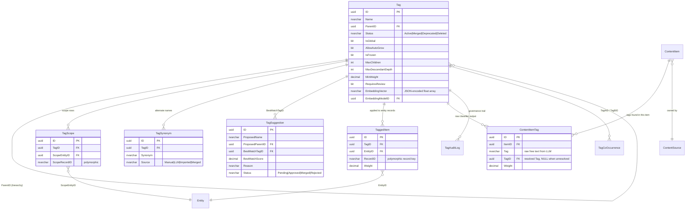
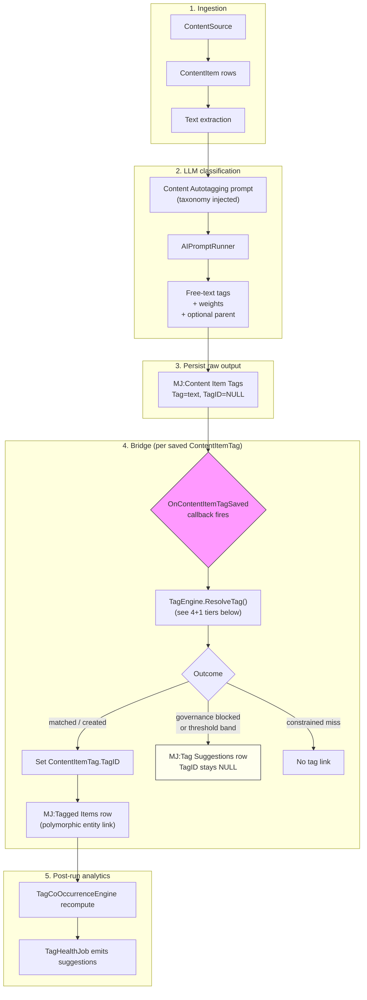
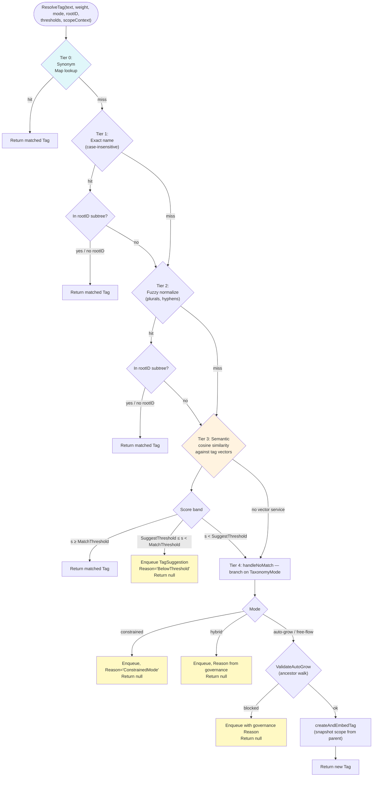
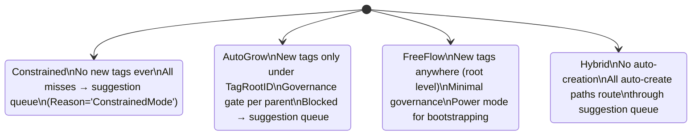
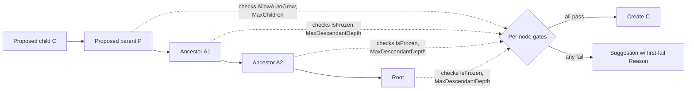
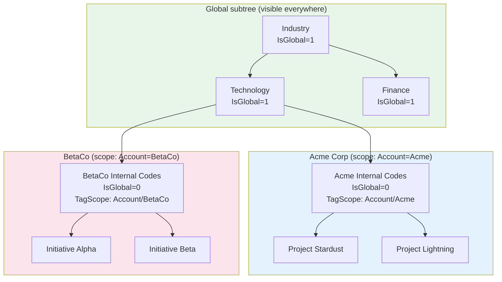
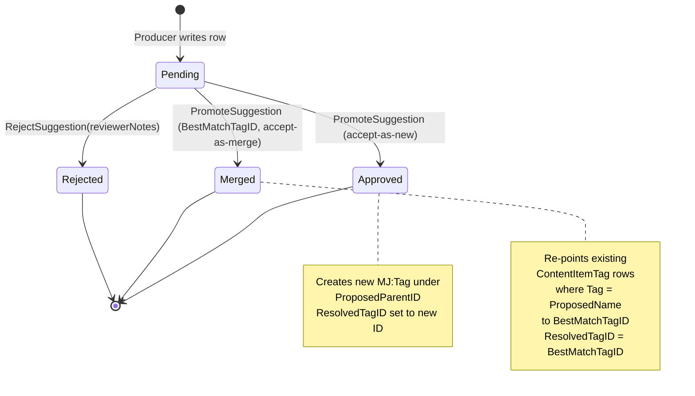

# Taxonomy & Tagging Guide

> Companion to [CONTENT_AUTOTAGGING_GUIDE.md](CONTENT_AUTOTAGGING_GUIDE.md). That guide covers how content gets ingested, classified, and bridged into tags. **This guide covers the tag taxonomy itself** — how it is shaped, scoped, governed, grown, embedded, reviewed, and pruned. Read both before doing serious work in this area.

## Overview

MemberJunction ships a unified, metadata-driven tag taxonomy that powers:

- **Automatic classification** of ingested content (the autotagger)
- **Semantic search** across business records via per-tag embeddings
- **Faceted navigation** in Knowledge Hub and other consumers
- **Multi-tenant scoping** so one customer's tags do not bleed into another's
- **Human-in-the-loop governance** with a review queue, ancestor-walk policy, and audit log

The taxonomy is intentionally **opinionated about what is a tag and how tags get created**, but flexible enough to span the full spectrum from *"a hand-curated list of 80 categories nobody can change"* through to *"every noun the LLM saw becomes a tag."* Every customer picks where on that spectrum they sit, per content source.

**Audience.** Engineers building on top of the tag system, customer-success engineers configuring it for a tenant, and AI/ML engineers tuning the classifier and review queue.

---

## Mental model

There are five core entities you must hold in your head simultaneously. They form a polymorphic chain that is easy to misread on first contact, so spend a minute on this section.



### The cast in plain English

| Entity | Role | Lifetime |
|---|---|---|
| **`MJ:Tags`** | The taxonomy node itself: a name, a parent, governance flags, an embedding. The "noun" everything else points at. | Persistent. Soft-deleted via `Status`. |
| **`MJ:Content Items`** | One ingested unit (a row, a doc, a feed entry). Owned by a `ContentSource`. | Persistent; updated when source content changes. |
| **`MJ:Content Item Tags`** | What the LLM said about a `ContentItem` — *raw, free-text* tag plus a weight. Has a `TagID` FK that gets populated when (and only when) the bridge resolves the free text to a formal Tag. | Persistent; rebuilt when an item is reprocessed. |
| **`MJ:Tagged Items`** | The polymorphic application of a Tag to *any* entity record `(EntityID, RecordID)`. This is the table the rest of MJ queries when it asks "what tags does record X have?" | Persistent; the read surface. |
| **`MJ:Tag Scopes`** | Polymorphic visibility rows for a non-global tag. A tag with one or more scope rows is visible *only* inside those `(Entity, Record)` scopes. | Persistent. |
| **`MJ:Tag Synonyms`** | Alternate names that resolve to the same Tag. Consulted *before* any new-tag creation path. | Persistent. |
| **`MJ:Tag Suggestions`** | The human-in-the-loop queue. Anything that would have been auto-created but was governance-blocked or in the suggestion threshold band lands here. | Pending → Approved/Merged/Rejected. |
| **`MJ:Tag Audit Logs`** | Append-only history of every governance action. | Persistent forever. |
| **`MJ:Tag Co Occurrences`** | Computed pair counts (how often Tag A and Tag B appear on the same item). Powers Tag Health and the suggestion emitters. | Recomputed after each autotag run. |

### The two-layer write model

There is one detail people miss on first pass: the autotagger writes to `ContentItemTag` *before* it knows whether the free-text tag will resolve to a formal `Tag`. The `TagID` column on `ContentItemTag` is intentionally nullable. This dual-storage shape means:

- **Raw classifier output is never lost**, even when governance rejects the tag, the threshold is too low, or the taxonomy is constrained and there is no match.
- **Re-running the bridge after a taxonomy change** can pick up previously-unresolved free-text tags and link them retroactively.
- **The suggestion queue can show the source text** that drove a proposal, because the `ContentItemTag` row is still there.

When `TagID` *does* get populated, a parallel row is also written to `TaggedItem` for the underlying entity record. That is the row Knowledge Hub, the tag facet, and consumer apps actually query. See [TagEngineBase.CreateTaggedItem()](../packages/AI/Knowledge/TagEngineBase/src/TagEngineBase.ts#L204).

---

## The autotag pipeline

The pipeline is orchestrated by [AutotagBaseEngine](../packages/ContentAutotagging/src/Engine/generic/AutotagBaseEngine.ts) with per-source-type providers (`AutotagEntity`, `AutotagRSS`, `AutotagWebsite`, etc.) registered via the ClassFactory. Per-source-type details live in [CONTENT_AUTOTAGGING_GUIDE.md](CONTENT_AUTOTAGGING_GUIDE.md); here we focus on what happens *to a tag* as it flows through.



The **`OnContentItemTagSaved` plugin point** is the seam where everything interesting happens. It is declared at [AutotagBaseEngine.ts:766](../packages/ContentAutotagging/src/Engine/generic/AutotagBaseEngine.ts#L766), wired up at [AutotagBaseEngine.ts:384](../packages/ContentAutotagging/src/Engine/generic/AutotagBaseEngine.ts#L384), and invoked at [AutotagBaseEngine.ts:807](../packages/ContentAutotagging/src/Engine/generic/AutotagBaseEngine.ts#L807). The default implementation calls into [AutotagEntity.BridgeContentItemTagToTaxonomy()](../packages/ContentAutotagging/src/Entity/generic/AutotagEntity.ts#L146), which reads per-source config and delegates to `TagEngine.ResolveTag()`.

If you want to intercept the bridge — for example to add custom governance, route to a different review surface, or attach domain-specific metadata to a `TaggedItem` — replace the callback. Do not subclass `BridgeContentItemTagToTaxonomy`; the seam is the callback.

---

## Tag resolution: the 4+1 tiers

`TagEngine.ResolveTag()` ([TagEngine.ts:385](../packages/AI/Knowledge/TagEngine/src/TagEngine.ts#L385)) is the heart of the system. It maps a piece of free text from the LLM (or any other producer) to a formal `MJ:Tag` record, falling through five tiers in strict order. Concurrent calls are serialized by an internal mutex so parallel batch processing cannot create duplicates.



### Why tier 0 (synonym) is first

Synonyms are the cheapest, most precise signal. A curated synonym `"Artificial Intelligence" → AI` is unambiguous and authoritative; running it through fuzzy or semantic matching is wasted work and *can lose*. Synonyms also let you absorb merge history: when you `MergeTags(['Old Name'], 'New ID')`, the merge writes a `Source='Merged'` synonym row so any future free-text "Old Name" still resolves correctly. See [TagGovernanceEngine.MergeTags()](../packages/AI/Knowledge/TagEngine/src/TagGovernanceEngine.ts#L78).

### The two thresholds

`TagMatchThreshold` (default `0.9`) is the **auto-apply** floor. `SuggestThreshold` (default `TagMatchThreshold - 0.05`) is the **route-to-review** floor. Anything below `SuggestThreshold` falls through to the auto-create / suggest path determined by `TagTaxonomyMode`. The band between the two is what makes the whole system feel responsive without being rash:

| Score | Action | Reason |
|---|---|---|
| `s ≥ MatchThreshold` (e.g. `≥ 0.90`) | Auto-apply | High-confidence match |
| `SuggestThreshold ≤ s < MatchThreshold` (e.g. `0.85–0.89`) | Suggestion | `BelowThreshold` |
| `s < SuggestThreshold` (e.g. `< 0.85`) | Fall through to mode-based handling | — |

Lower the band and you trade precision for recall (more auto-applied, fewer reviewed). Raise it and you trade recall for precision (more in the queue, fewer applied). Tune per content source.

### What "create" actually means

[`createAndEmbedTag()`](../packages/AI/Knowledge/TagEngine/src/TagEngine.ts#L636) does four things atomically (under the resolution mutex):

1. Calls `TagEngineBase.CreateTag()` to insert and save the `MJ:Tag` row.
2. Snapshots the parent's `TagScope` rows to the child (or marks the child `IsGlobal=1` if the parent is global).
3. Embeds the new tag's name + description and writes the JSON vector + `EmbeddingModelID` back to the row via `Save()`.
4. Inserts the embedding into the in-memory `SimpleVectorService` so subsequent calls in the same run can match it.

---

## Taxonomy modes

Each `ContentSource` picks one of four modes via `IContentSourceConfiguration.TagTaxonomyMode`. The mode controls *only* what happens at Tier 4 (no match). Tiers 0–3 always run.



| Mode | New tags? | Constrained to subtree? | Governance gate runs? | When to use |
|---|---|---|---|---|
| `constrained` | Never | N/A | N/A | Curated taxonomy where the customer has signed off on the exact set. Misses become suggestions for the steward to approve. |
| `auto-grow` | Yes, under `TagRootID` | Yes (semantic search and creation both bounded by the subtree) | Yes — full ancestor walk | The 80% case. Gives the LLM permission to extend the taxonomy where you have said it's safe. |
| `free-flow` | Yes, anywhere (no parent) | No | Light | Bootstrapping a brand-new taxonomy from a corpus. Run once, review, then convert to constrained or auto-grow. |
| `hybrid` | Never auto; only via approved suggestions | N/A | Suggestion-routed | Production taxonomies where every new node demands human review, but you still want similarity matching and below-threshold reviews to flow. |

Mode is read once per content source per run from the typed `_IContentSourceConfiguration` accessor and threaded through `ResolveTag()`.

---

## Per-tag governance

The taxonomy mode is set per *content source*. Governance flags are set per *tag node* and are **inherited via ancestor walk**. Both must agree for an auto-create to happen.

| Field | Meaning | What it blocks |
|---|---|---|
| `IsGlobal` | When `1`, visible to every scope. Mutually exclusive with `TagScope` rows. | Cannot coexist with `TagScope` rows (enforced in entity `Save()` overrides). |
| `AllowAutoGrow` | When `0`, autotagger may not auto-create children under this tag. | Tier 4 auto-create when this is the proposed parent → suggestion `Reason='AutoGrowDisabled'`. |
| `IsFrozen` | When `1`, no auto-creation in this subtree. Inherited downward. | Any auto-create where *any ancestor* has `IsFrozen=1` → `Reason='ParentFrozen'`. |
| `MaxChildren` | Cap on direct children of this tag. | Auto-create when proposed parent is at cap → `Reason='MaxChildrenExceeded'`. |
| `MaxDescendantDepth` | Cap on descendant depth from this tag. Inherited. | Auto-create that would exceed any ancestor's depth limit → `Reason='MaxDepthExceeded'`. |
| `MinWeight` | Per-node confidence floor for *applying* the tag. | Items below this weight → `Reason='BelowMinWeight'`. |
| `RequiresReview` | When `1`, every classifier hit on this tag goes through review. | All applies → `Reason='RequiresReview'`. |

### The ancestor walk

When the resolver wants to auto-create a child `C` under proposed parent `P`, it walks the ancestor chain of `P` evaluating each policy:



The first failing rule wins. Order of checks (per spec): `IsFrozen` → `AllowAutoGrow` → `MaxChildren` → `MaxDescendantDepth` → `MinWeight`. The `Reason` written to the suggestion is the *exact* code listed in the table above, and the ancestor that triggered the block is captured in `ReviewerNotes` (or in a structured detail field — see the Save hook implementation).

`RequiresReview` is special: it is checked at *apply* time (after a successful resolution), not at create time. A successful Tier 1 hit on a tag with `RequiresReview=1` still routes through the queue.

### Hybrid mode + RequiresReview

When mode is `hybrid` and the resolved tag has `RequiresReview=1`, the suggestion is written exactly once with `Reason='RequiresReview'` (it takes precedence over `Reason='AmbiguousMatch'` in this case). This is documented at the routing site in [TagEngine.ts](../packages/AI/Knowledge/TagEngine/src/TagEngine.ts).

---

## Scoping model

Scopes turn a single shared taxonomy into a per-tenant or per-context taxonomy without forking it. The shape mirrors the polymorphic `MJ:Tagged Items` table you already know: `(ScopeEntityID, ScopeRecordID)` is a polymorphic pointer to *any* record in *any* entity.

### The invariants

1. **`Tag.IsGlobal` ⊕ `TagScope` rows.** A tag is either global (everyone sees it) or scoped (only the listed scopes see it). Never both. Enforced in entity `Save()` overrides on both `MJ:Tags` and `MJ:Tag Scopes`.
2. **Children inherit parent scope by default.** When the autotagger creates a child under a non-global parent, the parent's `TagScope` rows are *snapshotted* (copied, not linked) onto the child. When the parent is global, the child is created `IsGlobal=1`.
3. **No widen.** A child's scope cannot be a strict superset of its parent's. Promotion to global is admin-only and goes through `TagScopeFilterBuilder.validateChildScope()`.
4. **The only DB-level guard** is the unique constraint on `TagScope (TagID, ScopeEntityID, ScopeRecordID)`. All other invariants are enforced by entity `Save()` overrides — cleaner errors, multi-provider safe, no SQL trigger debugging.

### Visibility filter SQL shape

The conceptual filter is:

```sql
Status = 'Active'
AND (
    IsGlobal = 1
    OR ID IN (
        SELECT TagID FROM TagScope
        WHERE (ScopeEntityID, ScopeRecordID) IN (... caller's scope set ...)
    )
)
```

`TagScopeFilterBuilder.buildVisibilityFilter()` produces this predicate at runtime. The composite index `IDX_TagScope_Scope_Tag (ScopeEntityID, ScopeRecordID, TagID)` is the critical hot-path index.

### Multi-tenant taxonomy example



A Knowledge Hub query running with Acme's scope context sees: `Industry`, `Technology`, `Finance`, `Acme Internal Codes`, `Project Stardust`, `Project Lightning`. It does *not* see `BetaCo Internal Codes` or its descendants. The classifier prompt for an Acme-scoped content source is built from the same filtered tree, so the LLM is never even tempted to suggest a BetaCo tag.

---

## Synonyms

Synonyms are the **first thing the resolver checks**, before exact match. They turn taxonomy churn into a non-event: rename a tag, run merge — old free text still resolves.

| Source | When written | By whom |
|---|---|---|
| `Manual` | Steward types into the taxonomy admin UI | Human |
| `LLM` | LLM volunteered "also known as" output during a generation pass | Classifier |
| `Imported` | Bulk-loaded from an external taxonomy file | Sync / migration |
| `Merged` | `TagGovernanceEngine.MergeTags()` records the source tag's `Name` + every source `TagSynonym` row as synonyms of the surviving tag | Governance op |

Synonyms are loaded once at `Config()` time into a `Map<lowercased synonym, TagID>` and consulted via `GetTagBySynonym(synonym, ctx?)`. Uniqueness is enforced per-tag via `UQ_TagSynonym_Tag_Synonym`.

**Always seed synonyms generously.** "AI" / "Artificial Intelligence" / "ML" / "Machine Learning" — different teams will say each. The synonym table is your shock absorber.

---

## The suggestion queue (`MJ:Tag Suggestions`)

The suggestion queue is the **single human-in-the-loop surface** for everything ambiguous. Three independent producers feed it:

1. **The classifier resolver** when a match is in the suggest band, governance is blocked, or the mode is constrained / hybrid.
2. **The `TagHealthJob`** post-run analytics: merge candidates, low-usage deprecation candidates, wide-node alerts.
3. **Manual operators** who need a structured way to propose changes.



### Reason vocabulary

`Reason` is a free-form `NVARCHAR(50)` for forward compatibility, but the conventional values are documented in the column's `MS_Description` and in [`TagSuggestion`'s zod schema](../packages/MJCoreEntities/src/generated/entity_subclasses.ts#L22582):

| Reason | Producer | Meaning |
|---|---|---|
| `ConstrainedMode` | Resolver (Tier 4, mode=constrained) | LLM emitted a tag that doesn't exist; mode forbids creation. |
| `BelowThreshold` | Resolver (Tier 3) | Semantic match landed in `[SuggestThreshold, MatchThreshold)`. |
| `ParentFrozen` | Resolver / governance | Auto-create blocked because an ancestor has `IsFrozen=1`. |
| `AutoGrowDisabled` | Resolver / governance | Proposed parent has `AllowAutoGrow=0`. |
| `MaxChildrenExceeded` | Resolver / governance | Proposed parent has hit its `MaxChildren` cap. |
| `MaxDepthExceeded` | Resolver / governance | Auto-create would exceed an ancestor's `MaxDescendantDepth`. |
| `BelowMinWeight` | Resolver / governance | Item weight is below the proposed tag's `MinWeight`. |
| `RequiresReview` | Resolver | Resolved tag has `RequiresReview=1`. |
| `MaxItemTagsExceeded` | Autotag engine (RunBudget) | The item has hit `MaxNewTagsPerItem`. |
| `MergeCandidate` | TagHealthJob | Two tags co-occur heavily AND have similar names AND similar embeddings. |
| `LowUsage` | TagHealthJob | Tag has `< maxUsage` applications in the lookback window. |
| `WideNode` | TagHealthJob | Tag has too many direct children (`> MaxChildren` if set, else `> maxImplicitChildren`). |

Reviewers in the inbox UI see the reason, the source content item (when applicable), the source text snippet, the best-match tag (when applicable), and the score. Each suggestion can be approved, merged, or rejected; bulk approval is supported for the `MergeCandidate` cohort.

---

## Tag Health

Tag Health is co-occurrence-driven analytics that emits suggestions to keep the taxonomy from rotting. It runs in the post-run hook ([AutotagBaseEngine.ts:218 / 1728](../packages/ContentAutotagging/src/Engine/generic/AutotagBaseEngine.ts#L218)) immediately after `TagCoOccurrenceEngine.RecomputeCoOccurrence()`.

### The three emitters

| Emitter | Triggers when | Suggestion |
|---|---|---|
| `EmitMergeSuggestions` | Two active tags have `CoOccurrenceCount ≥ minCoOccurrence` AND name-similarity passes AND embedding-cosine passes | `Reason='MergeCandidate'`, `BestMatchTagID` set, reviewer can one-click merge |
| `EmitLowUsageSuggestions` | An active tag has fewer than `maxUsage` applications in the lookback window | `Reason='LowUsage'`, `ProposedParentID=tag.ParentID` for context |
| `EmitWideNodeSuggestions` | A tag's direct-child count exceeds `MaxChildren` (when set) or `maxImplicitChildren` | `Reason='WideNode'`, reviewer adds intermediate categorization |

Each emitter is **idempotent**: it skips pairs/tags that already have a pending suggestion of the same reason. Re-running the job many times is safe and cheap.

### When it runs

Today: opportunistically after each autotag run. There is a code path to wire it as a scheduled action when you want predictable cadence; see Phase 1e of the implementation plan and [TagHealthJob](../packages/AI/Knowledge/TagEngine/src/TagHealthJob.ts) (post-implementation). Recommended cadence is once per day for low-volume customers, once per hour for high-volume.

---

## Per-source configuration knobs

All knobs live on `ContentSource.Configuration`, a JSON blob that CodeGen exposes as the typed `_IContentSourceConfiguration` accessor. Source: [IContentSourceConfiguration.ts](../metadata/entities/JSONType-interfaces/IContentSourceConfiguration.ts).

| Field | Type | Default | What it controls |
|---|---|---|---|
| `TagTaxonomyMode` | `'constrained' \| 'auto-grow' \| 'free-flow' \| 'hybrid'` | `'auto-grow'` | The Tier 4 branch. See [Taxonomy modes](#taxonomy-modes). |
| `TagRootID` | `string \| null` | `null` | When set, semantic search and auto-create are bounded to this subtree. Required for `constrained` and `auto-grow` to be useful. |
| `TagMatchThreshold` | `number` (0.0–1.0) | `0.9` | Auto-apply floor for Tier 3. |
| `ShareTaxonomyWithLLM` | `boolean` | `true` | Whether to inject the taxonomy tree into the classification prompt. Disable for blind classification. |
| `EnableVectorization` | `boolean` | `true` | Whether to embed/vectorize content for semantic search. Independent of tag matching. |
| `SuggestThreshold` | `number` (0.0–1.0) | `TagMatchThreshold - 0.05` | Lower bound of the suggestion band. Below this, we fall through to mode-based handling. |
| `MaxNewTagsPerRun` | `number \| null` | `null` (unlimited) | Pause the run gracefully once this many new tags have been auto-created. Resumes from `LastProcessedOffset`. |
| `MaxNewTagsPerItem` | `number \| null` | `null` (unlimited) | Per-item budget. Once exceeded, additional free-text tags route to `MJ:Tag Suggestions` with `Reason='MaxItemTagsExceeded'`. |
| `MaxTokensPerRun` | `number \| null` | `null` (unlimited) | Pause when cumulative LLM tokens exceed this. |
| `MaxCostPerRun` | `number \| null` | `null` (unlimited) | Pause when cumulative cost exceeds this (USD). |

**Budget enforcement uses the existing `CancellationRequested` / `LastProcessedOffset` machinery** — runs *pause*, they do not *fail*. A paused run resumes cleanly when restarted.

---

## Embeddings

Tag embeddings power the Tier 3 semantic-match path and the merge-candidate emitter. Each tag has two new columns:

- **`EmbeddingVector`** — `NVARCHAR(MAX)` JSON-encoded float array (the same shape used by `MJ:AI Agent Notes.EmbeddingVector`).
- **`EmbeddingModelID`** — FK to `AIModel` so we can detect "the global embedding model changed → these vectors are stale."

### The Save() hook refresh

[`MJTagEntityServer`](../packages/MJCoreEntitiesServer/src/custom/MJTagEntityServer.server.ts) overrides `Save()` to:

1. Validate the `IsGlobal` ⊕ `TagScope` invariant.
2. Detect when `Name` or `Description` is dirty (or it's the first save) and re-embed via `GenerateEmbeddingByFieldName('Name', 'EmbeddingVector', 'EmbeddingModelID')`. If `Name` is empty, it nulls out the cache.
3. Sync the in-memory `SimpleVectorService` on `TagEngine.Instance` so the new vector is searchable immediately.

This means the autotagger does not pay a cold-start embedding cost — `refreshTagEmbeddings()` ([TagEngine.ts:186](../packages/AI/Knowledge/TagEngine/src/TagEngine.ts#L186)) hydrates the in-memory vector service from the DB cache, falling back to the LLM only for tags that are missing a vector or whose `EmbeddingModelID` doesn't match the currently configured model.

### `RebuildTagEmbeddings` utility

When you change the global embedding model, every cached vector is silently stale. Run `TagEngine.Instance.RebuildTagEmbeddings(contextUser, options?)` once. It:

- Iterates active tags whose `EmbeddingModelID` doesn't match the current model.
- Re-embeds each in batches of 50 via `AIModelRunner.RunEmbedding`.
- Writes the new vector + `EmbeddingModelID` back via `Save()` (which triggers the in-memory sync).
- Logs cache-hits vs. computed-fresh for telemetry.

Wire this to a scheduled action if your team rotates models; otherwise call it ad-hoc after a model change.

---

## Implementation guides

### "I want a constrained taxonomy for my customer"

Goal: a fixed list of categories, no auto-creation, every miss goes to review.

1. **Bootstrap the tree.** Create the root tag plus all child categories via the metadata-files approach (see [Seeding the taxonomy](#seeding-the-taxonomy)).
2. **Mark the root frozen** (`IsFrozen=1`). This is belt-and-suspenders — the mode setting alone would suffice, but `IsFrozen` protects against accidental mode changes.
3. **On the `ContentSource`**:
   - `TagRootID` → the root's ID
   - `TagTaxonomyMode` → `'constrained'`
   - `TagMatchThreshold` → `0.85` (slightly lower since you want the LLM to find existing tags, not invent new ones)
4. **Seed synonyms** for every category — when the LLM emits a near-miss, you want it caught at Tier 0.
5. **Provision a steward.** Misses become `MJ:Tag Suggestions` with `Reason='ConstrainedMode'`. The steward triages them (most are noise; the rare good ones become new categories via the suggestion-promote path).

### "I want auto-growth but only inside a subtree"

Goal: an open taxonomy under one branch, locked down everywhere else.

1. **Pick the branch.** Set `IsFrozen=1` on the root and on every other top-level node. Only the open branch stays unfrozen.
2. **On the `ContentSource`**:
   - `TagRootID` → the open branch's ID
   - `TagTaxonomyMode` → `'auto-grow'`
3. **Set guardrails** on the open branch:
   - `MaxDescendantDepth=3` to prevent runaway depth
   - `MaxChildren=50` on intermediate nodes to keep the LLM from emitting one tag per noun
   - `MinWeight=0.6` to filter low-confidence applications
4. **Watch the budget knobs.** Set `MaxNewTagsPerRun=20` initially; relax once you see steady-state behavior.

### "I want per-tenant tag visibility"

Goal: tenant Acme has their own internal codes that BetaCo cannot see, both share a global "Industry" tree.

1. **Keep the shared roots global.** `Industry`, `Technology`, etc. → `IsGlobal=1`, no `TagScope` rows.
2. **Create the tenant subroot scoped.** When you create `Acme Internal Codes`, set `IsGlobal=0` and immediately add a `TagScope` row pointing to the Account record for Acme: `(ScopeEntityID=Accounts, ScopeRecordID=<Acme Account ID>)`.
3. **Children inherit automatically.** Anything the autotagger creates under `Acme Internal Codes` snapshots that scope row. You don't manage it per child.
4. **Wire scope context.** The autotag engine derives `TagScopeContext` from the source's `TagRootID` ancestry; if the root is non-global, its scope flows through. For Knowledge Hub, build the context from the logged-in user's tenant binding.

### "I want a review gate on a sensitive subtree"

Goal: HR / legal / financial categories must be human-approved every time.

1. Set `RequiresReview=1` on the *parent* of the sensitive subtree. There is no recursive flag — each sensitive node sets its own. (This is a deliberate design choice: review is a per-node policy, not an inherited one.)
2. Every classifier hit on those tags writes a `MJ:Tag Suggestions` row with `Reason='RequiresReview'` and leaves `ContentItemTag.TagID` null.
3. Reviewer approves → `PromoteSuggestion` re-points the existing `ContentItemTag` rows where `Tag = ProposedName` to the resolved `TagID` and creates the `TaggedItem`.

### "I want to add synonyms from a curated list"

Goal: bulk-import a synonym mapping from a CSV or spreadsheet.

1. **Use the metadata-files approach.** Create `metadata/tag-synonyms/.tag-synonyms.json` with one record per synonym:

   ```json
   [
     {
       "fields": {
         "TagID": "@lookup:MJ: Tags.Name=AI",
         "Synonym": "Artificial Intelligence",
         "Source": "Imported"
       }
     },
     {
       "fields": {
         "TagID": "@lookup:MJ: Tags.Name=AI",
         "Synonym": "Machine Intelligence",
         "Source": "Imported"
       }
     }
   ]
   ```

2. Add a `.mj-sync.json` for the directory pointing at `MJ: Tag Synonyms`.
3. `npx mj sync push --dir=metadata --include="tag-synonyms"`.
4. Restart MJAPI so `TagEngineBase.Config()` reloads the synonym map.

---

## Seeding the taxonomy

Three patterns, in order of preference for production:

### 1. Bootstrap from a curated CSV (recommended)

Author one JSON record per tag under `metadata/tags/.tags.json`, using `@lookup:` for `ParentID`:

```json
[
  {
    "fields": {
      "Name": "Industry",
      "DisplayName": "Industry",
      "IsFrozen": true,
      "Description": "Top-level industry classifier"
    }
  },
  {
    "fields": {
      "Name": "Technology",
      "DisplayName": "Technology",
      "ParentID": "@lookup:MJ: Tags.Name=Industry",
      "Description": "Tech industry subnodes"
    }
  }
]
```

`mj sync push --dir=metadata --include="tags"`. CodeGen and the `Save()` hook handle embeddings + scope invariants on insert.

### 2. Bootstrap from an existing corpus

When you have a body of content but no taxonomy:

1. Configure a `ContentSource` with `TagTaxonomyMode='free-flow'` and run the autotagger on a representative sample.
2. Review the resulting taxonomy in the admin UI. Use `MergeTags`, `RenameTag`, and `DeprecateTag` to clean up.
3. Promote good clusters to a stable structure with `MoveTag`.
4. Switch the source to `'auto-grow'` (or `'constrained'`) and freeze the curated nodes.

### 3. Bootstrap from an LLM

For greenfield taxonomies, prompt an LLM to draft the structure (one-shot with examples), human-review, and import via path 1. Skip if the corpus is small enough to do path 2.

**Always commit metadata files to git** — the database is regenerable, the taxonomy schema is source of truth.

---

## Operational guidance

### Budgets and pause/resume

`RunBudget` ([Phase 1d.4](#)) tracks new tags, tokens, and cost across a run. When any budget is hit:

- `ContentProcessRun.Status` → `'Paused'`
- `ContentProcessRun.CancellationRequested` → `1`
- `ContentProcessRunDetail.ErrorMessage` → reason (which budget tripped)

The run resumes from `LastProcessedOffset` on next start. **Do not lower budgets mid-run** — the run will pause but the next run will pause at the same offset and you'll go nowhere.

### Monitoring

Watch these signals in the MJ Explorer dashboards or directly:

- **Suggestion queue depth** by `Reason`. A growing `BelowThreshold` queue suggests `TagMatchThreshold` is too high. A growing `ConstrainedMode` queue suggests your taxonomy is missing categories.
- **Tag creation rate per run** vs. `MaxNewTagsPerRun`. Hitting the cap regularly means either you're in `free-flow` and shouldn't be, or your governance is too loose.
- **Embedding cache-hit ratio** in `TagEngine` startup logs. Low ratio after a model change is expected; persistent low ratio means `Save()` hooks aren't firing.
- **Co-occurrence merge candidates**. A spike usually means a new content source introduced near-duplicate tags.

### What to do when the suggestion queue grows

1. **Triage by `Reason`.** `MergeCandidate` and `BelowThreshold` are usually mass-approvable in bulk. `ConstrainedMode` and `RequiresReview` need per-row attention.
2. **Use bulk actions.** "Approve all `MergeCandidate` with `BestMatchScore >= 0.95`" usually clears 80% of the noise.
3. **Tune the inputs.** If `BelowThreshold` keeps refilling, lower `TagMatchThreshold` for that source by 0.02–0.05. If `MergeCandidate` keeps refilling, raise `minNameSimilarity` in the TagHealthJob config.

---

## Plugin points & extension

| Concern | File | Hook | Use case |
|---|---|---|---|
| Custom bridging from raw classifier output to taxonomy | [AutotagBaseEngine.ts:766](../packages/ContentAutotagging/src/Engine/generic/AutotagBaseEngine.ts#L766) | `OnContentItemTagSaved` callback | Replace the default bridge with custom logic |
| Notify on new tag creation | [TagEngine.ts](../packages/AI/Knowledge/TagEngine/src/TagEngine.ts) | `onTagCreated` callback (passed into `ResolveTag` via the autotag engine for budget tracking) | Hook into auto-create events for telemetry, slack alerts, etc. |
| Custom Tag Health rules | [TagHealthJob.ts](../packages/AI/Knowledge/TagEngine/src/TagHealthJob.ts) | Compose your own emitter alongside the three built-ins | Add domain-specific quality checks |
| Embedding refresh logic | [MJTagEntityServer.server.ts](../packages/MJCoreEntitiesServer/src/custom/MJTagEntityServer.server.ts) | `Save()` override | Change what fields drive the embedding text, or short-circuit refresh |
| Scope inference from a content source | `ScopeContextResolver.deriveScopeContext` | Plain function | Override the default "scope follows TagRootID ancestry" with explicit per-source scope |
| Governance enforcement | [TagGovernanceEngine](../packages/AI/Knowledge/TagEngine/src/TagGovernanceEngine.ts) | `ValidateAutoGrow`, `PromoteSuggestion`, `RejectSuggestion` | Add custom policy checks before promotion |
| LLM taxonomy context | [AutotagBaseEngine.ts:333](../packages/ContentAutotagging/src/Engine/generic/AutotagBaseEngine.ts#L333) | `TaxonomyContext` field | Customize how the taxonomy is serialized for the prompt |

---

## FAQ / gotchas

### 1. "Tags from one tenant are leaking into another's facet."

You forgot the scope context. The Knowledge Hub tag facet defaults to *all* active tags; you must pass a `TagScopeContext` (or use `GetVisibleTags(ctx)`) to scope it. Check the `RunView` in the analytics resource component for an `ExtraFilter` that respects scope. Also: clear the GraphQL data provider cache when switching backends; cached metadata can carry stale scope decisions.

### 2. "The autotagger created 200 new tags in one run."

You're in `free-flow` (or `auto-grow` with no budget). Set `MaxNewTagsPerRun=20` and `MaxNewTagsPerItem=5` per source. Add `MinWeight=0.6` on the open branches. Decide whether you want `auto-grow` (under a single root) or `hybrid` (review-gated).

### 3. "Embedding scores look wrong / inconsistent after a server restart."

You changed the global embedding model and the cached vectors are now from the old model. Run `TagEngine.Instance.RebuildTagEmbeddings(contextUser)` once. Going forward, gate model changes through a runbook that includes the rebuild.

### 4. "I created a `TagScope` row but the tag still shows up everywhere."

Either the tag is `IsGlobal=1` (the `Save()` invariant should have rejected the scope row — check `LatestResult.CompleteMessage`) or the consumer isn't passing `TagScopeContext` to its lookup. `TagScope` rows are necessary but not sufficient — every consumer must opt into the visibility filter.

### 5. "Suggestions of `Reason='ConstrainedMode'` keep piling up — why isn't the steward seeing them?"

Check that the Suggestion Inbox UI is filtered to `Status='Pending'` and that `SourceContentSourceID` filter isn't accidentally narrowing them out. Also verify the steward has read permission on `MJ:Tag Suggestions` — the entity is access-controlled like any other.

### 6. "Renaming a tag broke matching for a week."

Two possibilities. (1) The `Save()` hook didn't re-embed — check the server logs for `TagGovernanceEngine: Failed to re-embed tag ...`. (2) The merge didn't write a synonym — `MergeTags` does this automatically; manual rename via `RenameTag` does *not* (rename is a name change, not a merge). When you intend "users will type the old name," rename + manually insert a `TagSynonym` row.

### 7. "The LLM keeps returning a UUID as a tag name."

Known LLM tic when you inject the taxonomy with IDs. The autotag engine strips IDs from the tree before injection ([AutotagEntity.ts:128](../packages/ContentAutotagging/src/Entity/generic/AutotagEntity.ts#L128)). If you've replaced the bridge or the prompt, make sure your serialization does the same.

### 8. "TagEngine.ResolveTag is slow under heavy concurrency."

It's serialized by an internal mutex on purpose — without it, parallel batches create duplicate tags. The mutex is a feature, not a bug. If you need throughput, batch *items* upstream so each `ResolveTag` call processes more text at once (the LLM call is the bottleneck, not the resolver).

### 9. "Co-occurrence numbers look stale."

`TagCoOccurrenceEngine.RecomputeCoOccurrence` runs after each autotag run via the post-run hook. If you never run the autotagger (e.g. tags applied only manually), schedule a job to invoke it directly. Co-occurrences are not maintained incrementally — it's a recompute.

### 10. "I want to delete a tag, but `DeleteTag` only soft-deletes."

That is correct. The audit log and historical `TaggedItem` / `ContentItemTag` references would be orphaned by a hard delete. If you genuinely need a hard delete (e.g. PII compliance), write a maintenance migration that nulls out references first; do not bypass `TagGovernanceEngine`.

---

## Related guides

- [Content Autotagging Guide](CONTENT_AUTOTAGGING_GUIDE.md) — the upstream pipeline that feeds tags
- [Caching & PubSub Guide](CACHING_AND_PUBSUB_GUIDE.md) — relevant for the BaseEntity event-driven cache invalidation that keeps `TagEngineBase` fresh across providers
- [UUID Comparison Guide](UUID_COMPARISON_GUIDE.md) — every tag lookup hinges on `UUIDsEqual` / `NormalizeUUID`
- [Dashboard Best Practices](DASHBOARD_BEST_PRACTICES.md) — relevant if you're building Tag Health or Suggestion Inbox dashboards
