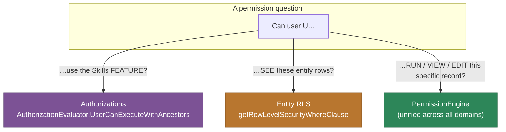
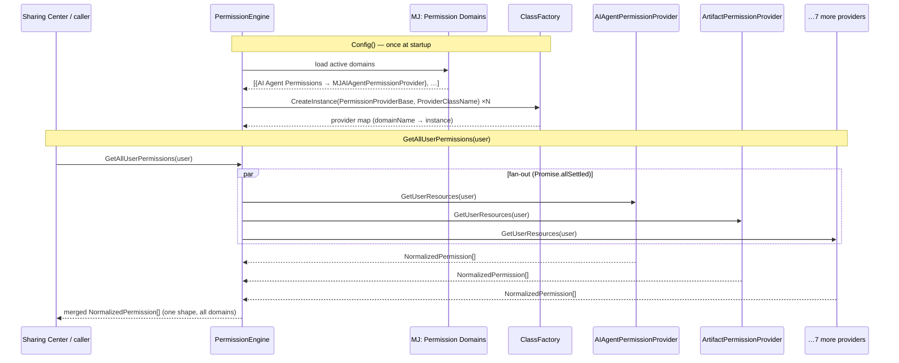
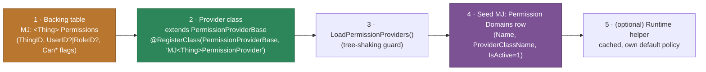

# Unified Permissions Guide

How MemberJunction answers **"can this user do this?"** across every kind of resource — agents, artifacts, dashboards, queries, collections, entity rows, and anything you add — through **one normalized model** instead of a dozen bespoke checks.

**Audience**: anyone gating an action, building a sharing UI, auditing access, or adding permissions to a new resource type.

---

## 1. The mental model: three concerns, one unifier

"Permissions" in MJ is not one thing. It's **three distinct concerns**, and conflating them is the #1 source of confusion:

| Concern | Question it answers | Mechanism | Where it lives |
|---|---|---|---|
| **Capability** | "Is this user *allowed the feature* at all?" | **Authorizations** (named, hierarchical grants) | `MJ: Authorizations` + `AuthorizationEvaluator` |
| **Row visibility (CRUD)** | "Which *rows* of this entity can this user read/create/update/delete?" | **Entity Permissions / RLS** (SQL WHERE injection) | `MJ: Entity Permissions` + `getRowLevelSecurityWhereClause` |
| **Per-resource access / sharing** | "Can this user *use / view / edit / own* this specific record?" | **Permission Providers** → the **PermissionEngine** | `PermissionProviderBase` + `PermissionEngine` |

The **third concern is the one that's "unified"** — and it's the subject of this guide. Every domain that has per-record access (an agent you can run, an artifact shared with you, a dashboard someone gave you Edit on) exposes its answer through **one common interface** so that sharing UIs, audit timelines, and programmatic checks treat them all identically.



> **Rule of thumb.** Gate a *button/feature* → **Authorization**. Filter a *list query* → **Entity RLS**. Check access to a *specific record* → **PermissionEngine**. They compose: e.g. the skill Share button is gated by the `Can Share Skills` **Authorization**, while who a skill is shared *with* is a **PermissionEngine** domain.

---

## 2. The unified core: `PermissionProviderBase` + `PermissionEngine`

### 2.1 The normalized vocabulary

Every domain maps its native storage (CRUD booleans, View/Edit/Owner levels, custom flags) onto **one shared vocabulary** (`packages/MJCore/src/generic/permissionInterfaces.ts`):

- **`PermissionAction`** = `'Read' | 'Create' | 'Update' | 'Delete' | 'Share' | 'Execute' | 'Admin'`
- **`GranteeType`** = `'User' | 'Role' | 'Everyone' | 'Public'`
- **`NormalizedPermission`** — the uniform record every provider emits: `{ DomainName, ResourceType, ResourceID, ResourceName?, GranteeType, GranteeID, GranteeName?, Actions[], Effect: 'Allow'|'Deny', SourceRecordID?, ExpiresAt? }`
- **`PermissionCheckResult`** = `{ Allowed, DomainName, Reason, MatchedPermission? }` — note the **`Reason`** string; every decision is self-explaining, which is what makes the audit UI and debug logs readable.

Because a `CanRun` bit and an `AccessLevel='Edit'` enum and an Access-Control-Rule all collapse to `Actions: PermissionAction[]`, a sharing UI can render **any** domain without knowing its storage.

### 2.2 The provider contract

A domain implements **`PermissionProviderBase`** (`@memberjunction/core`) — an abstract class registered with the ClassFactory:

```typescript
@RegisterClass(PermissionProviderBase, 'MJAIAgentPermissionProvider')
export class AIAgentPermissionProvider extends PermissionProviderBase {
    readonly DomainName = 'AI Agent Permissions';
    readonly Description = 'User- or role-level permissions on AI agents. Actions: View (Read), Run (Execute), Edit (Update), Delete.';
    readonly SupportedGranteeTypes: GranteeType[] = ['User', 'Role'];
    readonly SupportedActions: PermissionAction[] = ['Read', 'Execute', 'Update', 'Delete'];
    readonly SupportsDeny = false;

    GetResourceTypes(): string[] { return ['AI Agents']; }

    // The four data methods every provider implements:
    CheckPermission(user, resourceType, resourceId, action): Promise<PermissionCheckResult>;
    GetEffectivePermissions(user, resourceType, resourceId): Promise<NormalizedPermission[]>;
    GetUserResources(user, resourceType?): Promise<NormalizedPermission[]>;   // "everything this user can touch"
    GetResourcePermissions(resourceType, resourceId): Promise<NormalizedPermission[]>; // "who can touch this record"
}
```

The base class hands you the tedious parts so a provider stays ~150 lines:

- **`boolsToActions({ Read: row.CanView, Execute: row.CanRun, … })`** — collapse native flags to the normalized action list.
- **`fetchRows<T>(entityName, filter, fields, label)`** — provider-scoped `RunView` with logging.
- **`bulkLookupNames(entityName, ids[])`** — resolve resource IDs → display names in one query.
- **`buildNormalizedPermission({ … })`** — assemble a `NormalizedPermission` with `Effect: 'Allow'` defaulted.

### 2.3 The aggregator: `PermissionEngine`

`PermissionEngine` (`packages/MJCoreEntities/src/engines/PermissionEngine.ts`) is a `@RegisterForStartup` `BaseEngine` singleton that **discovers and fans out across every registered provider**:

1. On `Config()`, it loads the **`MJ: Permission Domains`** catalog (each row: `Name`, `ProviderClassName`, `IsActive`).
2. For each active domain, it `ClassFactory.CreateInstance(PermissionProviderBase, domain.ProviderClassName)` and stores it in a `domainName → provider` map. (So adding a domain is **data + a class**, never an edit to the engine.)
3. It exposes the unified API:

| Method | Answers | Powers |
|---|---|---|
| `CheckPermission(user, domain, resourceType, resourceId, action)` | "Is this one action allowed?" | Programmatic gates |
| `AuthorizeOrThrow(user, domain, resourceType, resourceId, action)` | same, but throws `PermissionDeniedError` | Server-side enforcement |
| `GetAllUserPermissions(user)` | "Everything, everywhere, this user can access" (parallel across all providers) | Sharing Center → *User Access Report* |
| `GetPermissionsSharedWithUser(grantee)` | "What was shared *with* me" | Sharing Center inbox |
| `GetPermissionsGrantedByUser(grantor)` | "What I've shared with others" | Sharing Center outbox |
| `GetResourcePermissions(domain, resourceType, resourceId)` | "Everyone who can touch this record" | Per-record share dialog |
| `GetAuditTimeline(filter)` | "Change history across permission tables" (via `RecordChange`) | Audit UI |



### 2.4 The domains that exist today

Nine providers ship in the catalog (`metadata/permission-domains/.permission-domains.json`):

| Domain (`Name`) | `ProviderClassName` | Resource type(s) | Backing storage |
|---|---|---|---|
| Entity Permissions | `MJEntityPermissionProvider` | (entities) | `MJ: Entity Permissions` (RLS, brought into the unified model) |
| Application Roles | `MJApplicationRolePermissionProvider` | (applications) | `MJ: Application Roles` |
| Dashboard Permissions | `MJDashboardPermissionProvider` | Dashboards | `MJ: Dashboard Permissions` |
| Resource Permissions | `MJResourcePermissionProvider` | Conversations, Reports, Queries, … | `MJ: Resource Permissions` (polymorphic) |
| Artifact Permissions | `MJArtifactPermissionProvider` | Artifacts | `MJ: Conversation Artifact Permissions` |
| Collection Permissions | `MJCollectionPermissionProvider` | Collections | `MJ: Collection Permissions` |
| AI Agent Permissions | `MJAIAgentPermissionProvider` | AI Agents | `MJ: AI Agent Permissions` |
| Query Permissions | `MJQueryPermissionProvider` | Queries | (query permission storage) |
| Access Control Rules | `MJAccessControlRuleProvider` | (entity records) | `MJ: Access Control Rules` |

Note the two storage *styles* that both flow into the same unified model: **dedicated per-entity tables** (`AIAgentPermission`, `ConversationArtifactPermission` — one table per domain, richer per-domain columns) and the **polymorphic `Resource Permissions`** table (one table, keyed by ResourceType, for the long tail: Conversations/Reports/Queries). The provider abstraction is exactly what lets them coexist.

---

## 3. The two access paths (don't confuse them)

Some domains — notably **AI Agents** — have **two** ways to ask about access, with **different defaults and different purposes**. This trips people up, so it's called out explicitly:

| Path | Class | Default when no grant rows exist | Cached? | Use it for |
|---|---|---|---|---|
| **Runtime helper** | `AIAgentPermissionHelper` (`@memberjunction/ai-engine-base`) | **Open** — anyone can View+Run; only owner can Edit/Delete | Yes (in `AIEngineBase`) | The hot path: gating `BaseAgent` execution, filtering the `@`-mention picker |
| **Unified provider** | `AIAgentPermissionProvider` (`@memberjunction/core-entities`) | **Closed** — reports only *explicit* grants | No (per-query) | The Sharing Center, audit, cross-domain "what has been shared" |

Both read the **same `MJ: AI Agent Permissions` table**. The helper answers *"can this user actually use it right now"* (with a friendly open-by-default policy baked in); the provider answers *"what has been explicitly granted"* (for display/audit). When you add a new permissioned resource that needs a runtime gate, you'll typically build **both**: a cached helper for the hot path, and a provider so it shows up in the unified surfaces.

---

## 4. Recipe: add permissions to a new resource type

This is the exact path a new domain follows (the [Agent Skills work](AGENT_SKILLS_AND_PLAN_MODE_GUIDE.md) uses it verbatim):



1. **Backing table** — migration for `MJ: <Thing> Permissions`, mirroring `AIAgentPermission`: `<Thing>ID`, nullable `UserID` **xor** `RoleID` (table validator enforces exactly-one), `CanView`/`CanRun`/`CanEdit`/`CanDelete` bits (or a level enum), `Comments`. Run CodeGen.
2. **Provider** — subclass `PermissionProviderBase`, `@RegisterClass(PermissionProviderBase, 'MJ<Thing>PermissionProvider')`, set the readonly metadata, and implement the four methods using `fetchRows` / `boolsToActions` / `buildNormalizedPermission`. Copy `AIAgentPermissionProvider.ts` — it's the canonical template.
3. **Register for load** — add it to `LoadPermissionProviders()` (`packages/MJCoreEntities/src/custom/PermissionProviders/index.ts`) so the decorator runs under bundler tree-shaking.
4. **Seed the domain** — add a `MJ: Permission Domains` metadata row (`Name`, `ProviderClassName`, `IsActive: 1`) in `metadata/permission-domains/.permission-domains.json` and `mj sync push`. `PermissionEngine.Config()` now discovers it automatically — **no engine code changes**.
5. **(Optional) runtime helper** — if the resource is checked on a hot path (every run, every keystroke of an autocomplete), add a cached helper in the relevant engine (mirror `AIAgentPermissionHelper`) so you're not doing a `RunView` per check, and choose the default policy (open vs. closed) deliberately.

That's the whole contract. The Sharing Center, `GetAllUserPermissions`, and the audit timeline pick up the new domain for free the moment the `Permission Domains` row is active.

---

## 5. The other two concerns (so you gate at the right layer)

### 5.1 Authorizations — capability/feature gates

`MJ: Authorizations` is a **hierarchical tree of named capability grants** (e.g. `Can Share Skills`, `Schema Management` → `Create Entities` → `Create in UDT Schema`). Checked with `AuthorizationEvaluator`:

```typescript
const auth = md.Authorizations.find(a => a.Name === 'Can Share Skills');
const allowed = new AuthorizationEvaluator().CurrentUserCanExecuteWithAncestors(auth, md);
```

Granting a parent implicitly grants descendants. Use this to gate **whether a user gets a feature at all** — the Share button, a dashboard, a designer — *not* per-record access. (See `packages/MJCore/src/generic/authEvaluator.ts`.)

### 5.2 Entity Permissions / Row-Level Security — CRUD row filtering

`MJ: Entity Permissions` drives **`getRowLevelSecurityWhereClause(provider, entityName, userPayload, EntityPermissionType.Read|Create|Update|Delete, prefix)`** (`packages/MJServer/src/generic/ResolverBase.ts`), which injects a SQL `WHERE` clause into generated entity queries so users only see rows they're allowed to. This is **query-time, set-level** gating — orthogonal to "can I use this one record." (It's *also* surfaced through the unified model via `MJEntityPermissionProvider`, so entity-level grants show up in the Sharing Center too.)

---

## 6. Where to look

| Concern | File |
|---|---|
| Normalized vocabulary + provider contract + base helpers | `packages/MJCore/src/generic/permissionInterfaces.ts` |
| The aggregator | `packages/MJCoreEntities/src/engines/PermissionEngine.ts` |
| Concrete providers (copy these) | `packages/MJCoreEntities/src/custom/PermissionProviders/*.ts` (`AIAgentPermissionProvider.ts` is the canonical template) |
| Provider load guard | `packages/MJCoreEntities/src/custom/PermissionProviders/index.ts` (`LoadPermissionProviders`) |
| Domain catalog (metadata) | `metadata/permission-domains/.permission-domains.json` |
| Share-entity extensions + share-notification hook | `packages/MJCoreEntities/src/custom/Permissions/*.ts` |
| Authorizations | `packages/MJCore/src/generic/authEvaluator.ts`, `securityInfo.ts` |
| Entity RLS | `packages/MJServer/src/generic/ResolverBase.ts` (`getRowLevelSecurityWhereClause`) |
| Angular share UI (generic dialog + adapters) | `packages/Angular/Generic/resource-permissions/` |
| Runtime helper example | `packages/AI/BaseAIEngine/src/AIAgentPermissionHelper.ts` |

## 7. Related guides

- **[Agent Skills & Plan Mode Guide](AGENT_SKILLS_AND_PLAN_MODE_GUIDE.md)** — a live worked example of adding a new permission domain (`AI Skill Permissions`) end-to-end, including the runtime helper + `/skill` picker filtering.
- **[Magic Link Guide](MAGIC_LINK_GUIDE.md)** — passwordless external-user access; how a restricted role + entity permissions scope what a magic-link guest can reach.
- **[Search Scopes & RAG Guide](SEARCH_SCOPES_AND_RAG_GUIDE.md)** — how search results are scoped per user (permissions applied to retrieval).
- **`@memberjunction/ng-resource-permissions`** ([README](../packages/Angular/Generic/resource-permissions/README.md)) — the reusable share dialog + adapter pattern over the polymorphic `Resource Permissions` domain.
