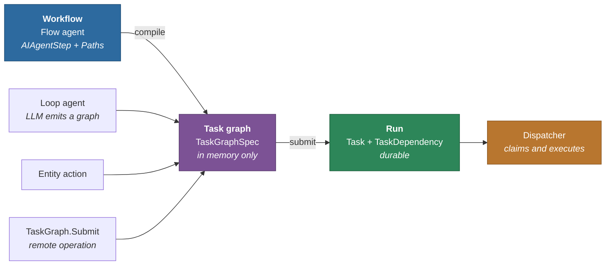
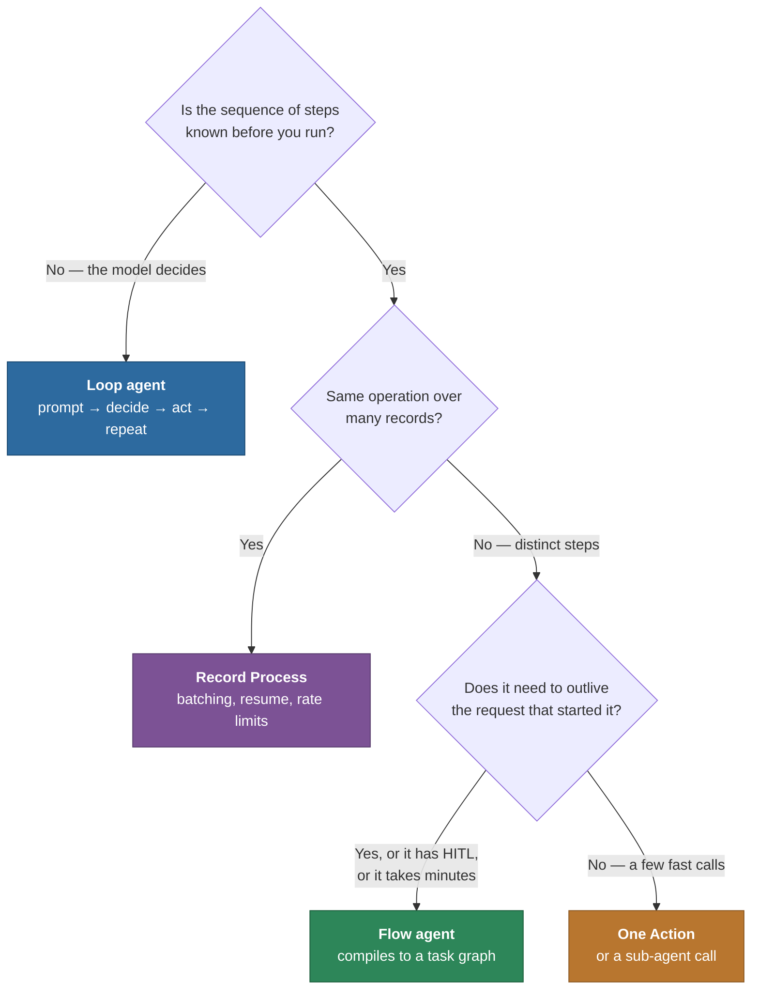
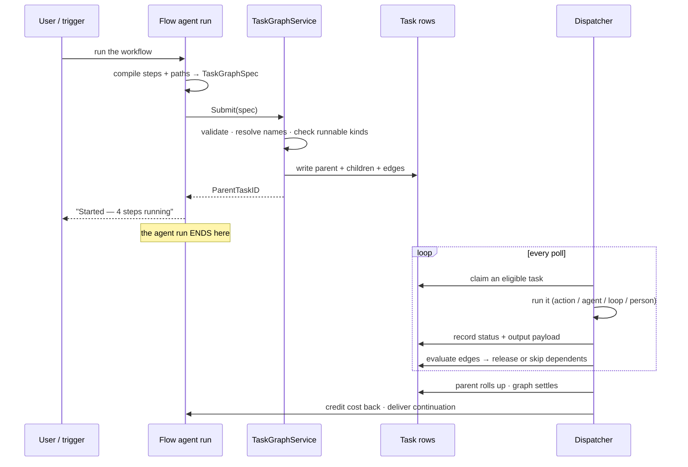
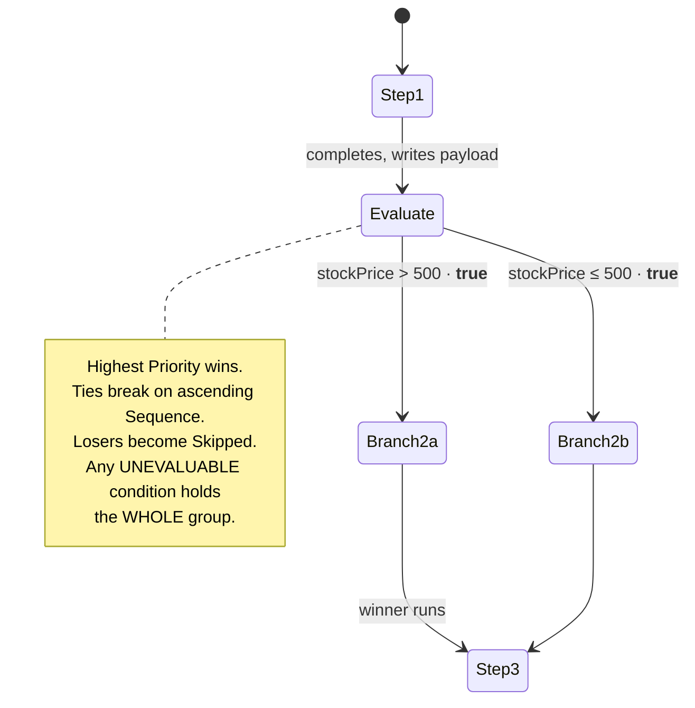
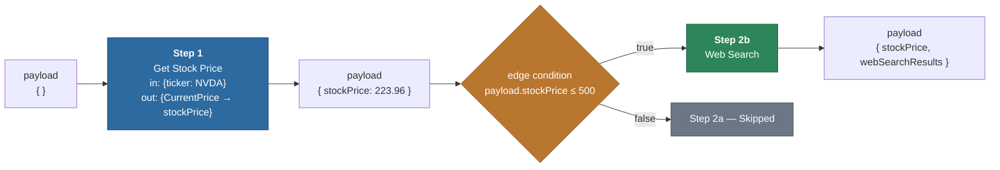
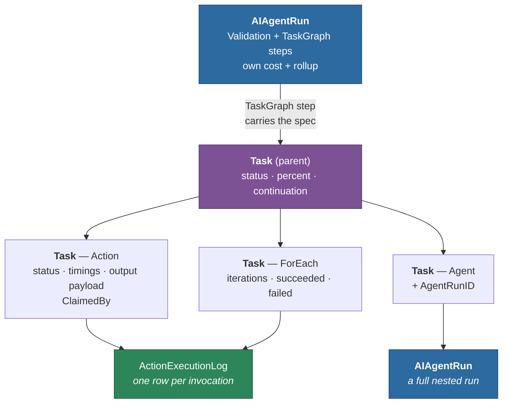

# Workflows and Task Graphs

**Read this before building anything that runs more than one step.** It covers what a workflow *is*
in MemberJunction, when to reach for one instead of an agent or a Record Process, how a workflow
becomes running work, and every rule that decides what happens next — conditions, branches, loops,
payload, failure, cost.

---

## Three words, and how they relate

Almost every misunderstanding in this area comes from using one word for three things.

| Term | What it is | Where it lives |
|---|---|---|
| **Workflow** | A *definition*. Steps and the paths between them, drawn by a person. | A **Flow agent** — `AIAgentStep` + `AIAgentStepPath` rows |
| **Task graph** | A *contract*. The executable form of a graph: nodes, typed configuration, dependency edges. | `TaskGraphSpec`, in memory. **Nothing persists it.** |
| **Run** | What actually happened. | `Task` + `TaskDependency` rows — **always**, for every producer |

The relationship is a one-way pipeline. A workflow *compiles into* a task graph; a task graph is
*submitted* and becomes a run.



Two consequences worth internalising immediately:

- **A graph can be built in memory by anything.** Only a Flow agent gives you a graph you can reopen
  and edit; but a Loop agent's model output, an entity action, or an outside caller of the
  `TaskGraph.Submit` remote operation can all hand the engine a graph that was never drawn.
- **Three of those producers have no agent run at all.** Their runs are just as real. Anything that
  reports on workflow execution has to work from `Task` rows, not from an agent run.

---

## Which tool for which job



- **Loop agent** — the path is discovered, not designed. See
  [`packages/AI/Agents/README.md`](../packages/AI/Agents/README.md).
- **Record Process** — "do X to a set of records" is a *different* problem with its own hardened
  substrate (batching, resume, circuit breakers, audit). Do not rebuild it as a workflow. See the
  [Record Set Processing Guide](RECORD_SET_PROCESSING_GUIDE.md).
- **Flow agent** — you can draw the steps, and the work deserves to be durable.
- **A single Action** — if it is one call, it is one call. See
  [`packages/Actions/CLAUDE.md`](../packages/Actions/CLAUDE.md).

**A Loop agent can also emit a task graph** when it decides work should be parallel and durable —
the two are not mutually exclusive. What makes a Flow agent different is that its graph is *drawn*
rather than *inferred*, so it is reviewable, diffable and rerunnable.

---

## What happens when a workflow runs

The single most important property: **submission and execution are separate.** An agent run that
submits a graph *ends immediately*. The graph outlives it.



This is why a page reload, a server restart, or the submitting run ending no longer lose the work —
and it is also why **cost cannot be totalled during the run** (see [Cost and
tokens](#cost-and-tokens-the-seam)).

---

## The seven node kinds

A node carries a `kind` and a typed `configuration` bag for that kind. The kind is the discriminator
everything routes on.

| Kind | What runs it | Where its target lives | Runnable today |
|---|---|---|---|
| `Agent` | `TaskAgentRunner` → a **new** `AIAgentRun` | `Task.AgentID` | ✅ |
| `Action` | `TaskActionRunner` → `ActionExecutionLog` | `Task.ActionID` | ✅ |
| `Human` | nobody — waits for a person | `Task.UserID` | ✅ |
| `ForEach` | `TaskLoopExecutor`, body dispatched per iteration | `Task.ActionID` / `AgentID` = the **body** | ✅ |
| `While` | `TaskLoopExecutor` | same | ✅ |
| `Prompt` | — | `Task.PromptID` | ❌ no runner yet |
| `External` | an outside system reports back | — | ❌ no runner yet |

Unrunnable kinds are **refused at submission by name**, not persisted. A task nobody can run would
sit in `Pending` forever and read as a workflow politely in progress — the worst available failure.

> **A loop's key points at what it repeats, not at the loop.** A `ForEach` row carries the
> `ActionID` of its body. That is why execution routes on `StepType` and not on "which key is set" —
> the older test would have run a loop exactly once.

---

## Edges: how the next step is chosen

An edge is a **prerequisite** (`dependsOn`), optionally carrying a condition. A flow's paths point
forward (`Origin → Destination`); a graph's edges point backward ("I wait for X"). Same edge,
opposite authoring convention.

### Exclusive groups — the rule that makes a flow a flow

A flow's default traversal is an **exclusive choice**, not a chain: the walker takes the
highest-priority *satisfied* path and discards the rest. Compiling a fan-out as plain parallel edges
would run branches the author's flow has never executed.

So sibling edges leaving one origin share an `ExclusiveGroup`, and exactly one wins.



Three rules, each earned:

1. **Highest `Priority` wins; ties break on ascending `Sequence`.** Compiled edges get fresh UUIDs
   and `Priority` defaults to `0`, so ties are the common case. Without a stored ordinal the same
   workflow could take a different branch on a different machine.
2. **Losers become `Skipped`, never `Blocked`.** A branch not taken is a normal outcome.
3. **One unevaluable condition holds the entire group.** A typo stalls the workflow *visibly* rather
   than firing every branch of a fork.

### Statuses

| Status | Meaning | Terminal? | Satisfies dependents? |
|---|---|---|---|
| `Pending` | waiting on prerequisites | no | no |
| `In Progress` | claimed and running | no | no |
| `Complete` | succeeded | yes | yes |
| `Failed` | ran and did not work | yes | only under `failureSemantics: 'edges'` |
| `Skipped` | **branch not taken** — a normal outcome | yes | **yes** |
| `Blocked` | can never run; a prerequisite is unsatisfiable | yes | no |
| `Cancelled` | stopped deliberately | yes | no |

`Skipped` satisfies dependents on purpose: a join downstream of a fork must still run once the fork
resolves. It is also invisible to failure precedence when the parent rolls up.

> **In any UI: `Skipped` is grey, never red.** Skipped means the workflow chose another route;
> Blocked means something broke. Rendering them alike sends people hunting for bugs that do not
> exist.

---

## Payload: how data moves between steps

**This is where most real workflow bugs live**, because the failure is silent: an undefined value is
*falsy*, not erroneous, so a workflow that lost its data still completes and reports success — it
just takes the wrong branch.

Every step can declare two mappings:

- **`inputMapping`** — builds the step's parameters. A string is a **literal** unless it carries a
  recognized prefix.
- **`outputMapping`** — writes the step's results back into the payload. This is what makes a branch
  condition possible at all.



### The mapping dialect

Both the in-run walker and the dispatcher call **one shared implementation**
(`@memberjunction/ai-core-plus` → `payload-mapping.ts`). Two implementations would diverge exactly
where the compile is supposed to be lossless.

**Input values** — a literal unless prefixed (prefix matching is case-insensitive):

| Form | Resolves to |
|---|---|
| `"NVDA"` | the literal string |
| `"payload.stockPrice"` | a value from the payload |
| `"static:[1,2,3]"` | the literal after the prefix |
| `"data.region"` | template data |
| `"context.apiKey"` | runtime context |
| `conversation[0].content` | a conversation message (where a conversation exists) |

**Output keys** — read from the step's result:

| Form | Meaning |
|---|---|
| `"CurrentPrice"` | one field, matched **case-insensitively** |
| `"Nested.Inner"` | dotted path, case-insensitive at each level |
| `"*"` | the whole result |

**Output targets** — where it lands in the payload:

| Form | Meaning |
|---|---|
| `"stockPrice"` | assign |
| `"a.b.c"` | nested assign |
| `"results[]"` | **append**, auto-creating the list |
| `"$message"` / `"$reasoning"` / `"$confidence"` | routed away from the payload to the run's own fields |

### Payload accumulates

Each step hands on `{...everything it received, ...its own updates}`. A condition three steps
downstream can still read a value written at the start. Handing each task only its immediate
predecessor's output would silently narrow that — and the workflow would quietly take a different
route than the flow it was compiled from.

---

## Loops

A loop is the one step whose size is unknowable until the steps before it have run — so it stays
**one Task row** and iterates inside its own execution. Expanding it into N rows at submission would
mean guessing N, and guessing wrong in the direction that silently drops work.

```json
{
  "type": "ForEach",
  "collectionPath": "static:[1,2,3,4,5]",
  "itemVariable": "number",
  "indexVariable": "i",
  "maxIterations": 5,
  "continueOnError": true,
  "executionMode": "sequential"
}
```

| Setting | Behaviour |
|---|---|
| `collectionPath` | resolved through the same mapping dialect — `payload.x`, `static:[…]`, a literal |
| `maxIterations` | **`0` means unlimited**; omitted takes the default (1000 ForEach / 100 While) |
| `continueOnError` | the loop succeeds despite failed iterations — counts still ride in the output |
| `executionMode` | `sequential` (default) or `parallel` with `maxConcurrency` |
| `delayBetweenIterationsMs` | for rate-limited work |

The per-iteration bindings are merged **into the payload**, so a body mapping reaches the current
item the same way it reaches anything else: `payload.number`.

> **Parallel loops keep results in *iteration* order**, not completion order — an output mapping
> writing `results[index]` and a downstream step reading it both assume position means iteration
> number.

A `While` loop is always sequential and always bounded; an **unevaluable condition fails the loop**
rather than ending it quietly, because "the condition broke" and "the loop finished" must not look
alike.

---

## Failure

Two levels, and they answer different questions.

**Per-node `onError` policy** — `fail` (default), `continue`, or `retry` with `retryCount`.
`continue` is what lets a workflow draw a recovery path instead of stopping dead.

**Per-graph `failureSemantics`:**

| Value | Meaning | Used by |
|---|---|---|
| `'block'` | a failed node is terminal for its dependents | agent-emitted graphs |
| `'edges'` | dependents are released along their edges, so a failure path can be *drawn* | **compiled flows** |

---

## Configuring a workflow, end to end

The shipped **Demo Flow Agent** is the reference. Four steps: fetch a price, branch on it, then loop.

**1. Create the agent** as a Flow type, then add steps. Each step is an `AIAgentStep`:

| Field | Step 1 |
|---|---|
| `Name` | `Step 1: Get NVIDIA Stock Price` |
| `StepType` | `Action` |
| `StartingStep` | `1` |
| `ActionID` | → `Get Stock Price` |
| `ActionInputMapping` | `{"ticker": "NVDA"}` |
| `ActionOutputMapping` | `{"CurrentPrice": "stockPrice"}` |
| `TimeoutSeconds` | `600` |
| `OnErrorBehavior` | `fail` |

**2. Draw the paths.** Each `AIAgentStepPath` carries `OriginStepID`, `DestinationStepID`, an
optional `Condition`, and a `Priority`:

| Origin | Destination | Condition | Priority |
|---|---|---|---|
| Step 1 | Step 2(a) Get Weather | `payload.stockPrice > 500` | 0 |
| Step 1 | Step 2(b) Web Search | `payload.stockPrice <= 500` | 0 |
| Step 2(a) | Step 3 | *(none)* | 100 |
| Step 2(b) | Step 3 | *(none)* | 100 |

Because both paths leave Step 1, the compiler puts them in one exclusive group — exactly one runs.

**3. A loop step** sets `StepType = ForEach`, `LoopBodyType = Action`, its `ActionID` to the body,
and its loop settings in `Configuration` (the JSON above).

**4. Run it.** The compile is automatic — `DetermineInitialStep` compiles and submits, and the run
returns a handle immediately.

### Prefer metadata over hand-editing

Author workflows as declarative metadata under `metadata/` and push with `mj sync push`, so they are
reviewable and travel between environments. See [`metadata/CLAUDE.md`](../metadata/CLAUDE.md).

---

## Submitting a graph from code

Everything goes through one seam, so a graph cannot be validated differently depending on who
produced it:

```typescript
import { GetTaskGraphSubmitter, TaskNode, type TaskGraphSpec } from '@memberjunction/ai-core-plus';

const spec: TaskGraphSpec = {
    workflowName: 'Enrich and notify',
    reasoning: 'Requested by the nightly job',
    failureSemantics: 'edges',
    tasks: [
        TaskNode.Action(
            { tempId: 'fetch', name: 'Fetch accounts', description: '', dependsOn: [] },
            { actionName: 'Run View', outputMapping: '{"Results":"accounts"}' },
        ),
        TaskNode.Agent(
            { tempId: 'summarize', name: 'Summarize', description: '', dependsOn: ['fetch'] },
            { agentName: 'Account Summarizer' },
        ),
    ],
};

const submitter = GetTaskGraphSubmitter();
if (!submitter) {
    // A host with no dispatcher is a legitimate configuration — a CLI, a test, a browser bundle.
    // Report it; never let the graph vanish quietly.
    throw new Error('No dispatcher on this host, so the workflow cannot be made durable.');
}

const outcome = await submitter.Submit({
    Spec: spec,
    EnvironmentID: environmentID,
    ContextUser: contextUser,
    Provider: provider,
});
```

`Submit` returns as soon as the graph is **durable**, not when it has run. `ParentTaskID` is the
handle for status, cancel and retry.

---

## Observability: where everything is recorded

A dispatched workflow does not write one run step per workflow step. The detail moved, and gained
things a run step never had.



| Question | Where to look |
|---|---|
| What did the workflow do? | `Task` rows — `StepType`, `Status`, `StartedAt`, `OutputPayload`, `ErrorMessage` |
| What did an action do? | `ActionExecutionLog` — **including one row per loop iteration** |
| What did a sub-agent do? | `Task.AgentRunID` → a full `AIAgentRun` with its own steps |
| Which instance ran it? | `Task.ClaimedBy` |
| What did the whole thing cost? | the submitting run's `TotalCostRollup` |

> A five-iteration loop over a web-search action produces **five** `ActionExecutionLog` rows, plus one
> for any non-loop use. That is the cheapest available proof that a loop actually iterated.

### Cost and tokens: the seam

`BaseAgent` totals a run by walking its steps in memory **at finalization** — but a submitting run
*ends at submission*. At the moment it computes its totals, the graph has not spent anything yet.
That is a **lifetime** problem, not a data-location one.

So a graph credits itself back when it settles, into columns that already existed for exactly this
distinction:

| Column | Meaning |
|---|---|
| `TotalCost`, `TotalTokensUsed`, … | what **this run itself** spent. Final at finalization; never rewritten. |
| `TotalCostRollup`, `TotalTokensUsedRollup`, … | this run **plus everything it caused**. Provisional until the graph settles. |

A Flow agent's own cost is genuinely near zero — it compiled a graph and handed it off. **Show the
rollup wherever one number is shown.** A nested run's own rollup is preferred over its `TotalCost`,
so an agent that dispatched a graph of its own does not lose a subtree.

> **Known gap:** `MaxCostPerRun` cannot police a dispatched graph, because the ceiling is checked
> during a run that ends before the spending starts. Budget enforcement belongs on the graph.

---

## Layout

A `TaskGraphSpec` has no geometry field and a `Task` row has **no position columns**. Anything
rendering a graph that was not drawn by hand has nothing to position with.

The rule:

- **Authored geometry persists** — a flow step's `PositionX/Y/Width/Height` rides in
  `Task.Configuration.layout`, so a hand-arranged workflow runs and appears in history in the shape
  its author drew.
- **Everything else is computed** — `LayoutTaskGraph` / `LayoutGraphNodes` in
  `@memberjunction/ai-core-plus`. A derived layout is *never* stored: it would freeze one rendering
  of a graph that can still change.

```typescript
import { LayoutGraphNodes, GraphLayoutBounds } from '@memberjunction/ai-core-plus';

// The run-view form: bare ids and edges, because a running graph is Task rows with no spec anywhere.
const positions = LayoutGraphNodes(
    tasks.map((t) => t.ID),
    dependencies.map((d) => ({ From: d.DependsOnTaskID, To: d.TaskID })),
    { Direction: 'LR', NodeWidth: 200, LayerGap: 90 },
);
const box = GraphLayoutBounds(positions); // for fit-to-view
```

Layered by **longest** path (so a dependent always clears every prerequisite), barycenter-ordered to
keep edges short, and deterministic — a run view re-projects on every status change, and a layout
that shifted each poll would be unusable.

---

## Debugging a run

The Run Console on **Workflows → Runs** is the debugger. Breakpoints, edge overrides, force-complete and edit-input are wired there. See the **[Workflow Debugger Guide](WORKFLOW_DEBUGGER_GUIDE.md)** for the walkthrough, the visual vocabulary (a forced path must never look like a real verdict), and the verb gates.

---

## Troubleshooting

### The workflow finished but did nothing

Look for **every branch `Skipped`**. That means no condition at a fork evaluated true — and the
usual cause is that an upstream `outputMapping` wrote nothing, so the condition read `undefined`,
which is falsy rather than erroneous.

```sql
SELECT Name, StepType, Status, OutputPayload
FROM __mj.Task WHERE ParentID = '<parent>' ORDER BY __mj_CreatedAt;
```

An `OutputPayload` of `{}` on the step *before* the fork is the tell.

### The workflow is stuck

| Symptom | Cause | Fix |
|---|---|---|
| A `Human` task `Pending` | waiting on a person | it is working as drawn |
| Tasks neither running nor skipped | **held** — a condition in an exclusive group could not be evaluated | fix the expression |
| `Blocked` dependents | an upstream step failed under `failureSemantics: 'block'` | fix the step, or draw a recovery path with `onError: continue` |
| Everything `Pending`, nothing claimed | no dispatcher on any host, or claims expired | check that MJAPI started `TaskGraphDispatcher` |

### The workflow refused to start

Read the message — it names the step. Common cases: a `Prompt` or `External` step (no runner yet), a
loop with nothing to repeat, a step referencing an agent or action that no longer exists, or a cycle.

### A submission reported no dispatcher

`GetTaskGraphSubmitter()` returns `null` on a host with no durable-execution package loaded. That is
a legitimate configuration; the honest response is to report it, never to swallow it.

---

## Extending: adding a node kind

The type system makes most of this a compile error rather than a runtime surprise. In order:

1. **`TaskGraphNodeKind` + `TaskGraphNodeConfigMap`** — add the kind and its typed configuration
   (`packages/AI/CorePlus/src/task-graph/task-graph-spec.ts`). Add a `TaskNode.<Kind>` constructor.
2. **Validator** — declare its required configuration fields.
3. **Compiler** — map the design-time `StepType` onto it, if it is authorable in a flow.
4. **Persistence** — extend the `switch` in `persistTasks`, and carry its settings in
   `BuildStepConfiguration`.
5. **`DISPATCHABLE_KINDS`** — add it **only once a runner exists**. Until then it is refused by name,
   which is the correct behaviour.
6. **Runner** — execute it in `TaskGraphDispatcher.runTaskBody`.
7. **D17 converter** — `stepShapeFor`, so a runtime graph can still be saved as a workflow.

> Steps 4 and 5 are the ones that bite. A kind added to the spec but not to the persistence switch
> throws loudly (by design); a kind added to `DISPATCHABLE_KINDS` without a runner produces a task
> that waits forever.

---

## Related reading

- [`packages/AI/Agents/README.md`](../packages/AI/Agents/README.md) — the agent framework, agent
  types, and where `FlowAgentType` fits
- [`packages/TaskGraph/README.md`](../packages/TaskGraph/README.md) — the durable execution package:
  dispatcher, claim protocol, runners
- [Record Set Processing Guide](RECORD_SET_PROCESSING_GUIDE.md) — for "do X to many records", which
  is a different problem
- [`packages/Actions/CLAUDE.md`](../packages/Actions/CLAUDE.md) — Actions are boundaries; when to
  create one
- [Transport Layer Architecture Guide](TRANSPORT_LAYER_ARCHITECTURE_GUIDE.md) — where a
  workflow-invoking capability belongs in the stack
- [UI Layering Guide](UI_LAYERING_GUIDE.md) — before building any workflow UI
- [`metadata/CLAUDE.md`](../metadata/CLAUDE.md) — authoring workflows as declarative metadata
- [Agent Memory Guide](AGENT_MEMORY_GUIDE.md) · [Agent Skills & Plan Mode
  Guide](AGENT_SKILLS_AND_PLAN_MODE_GUIDE.md) — adjacent agent capabilities
