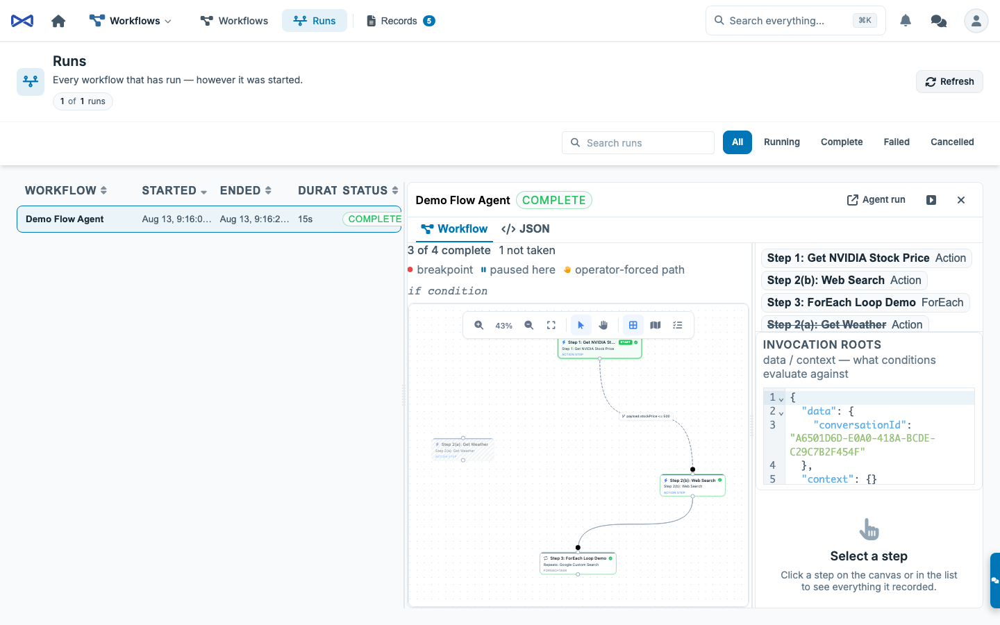
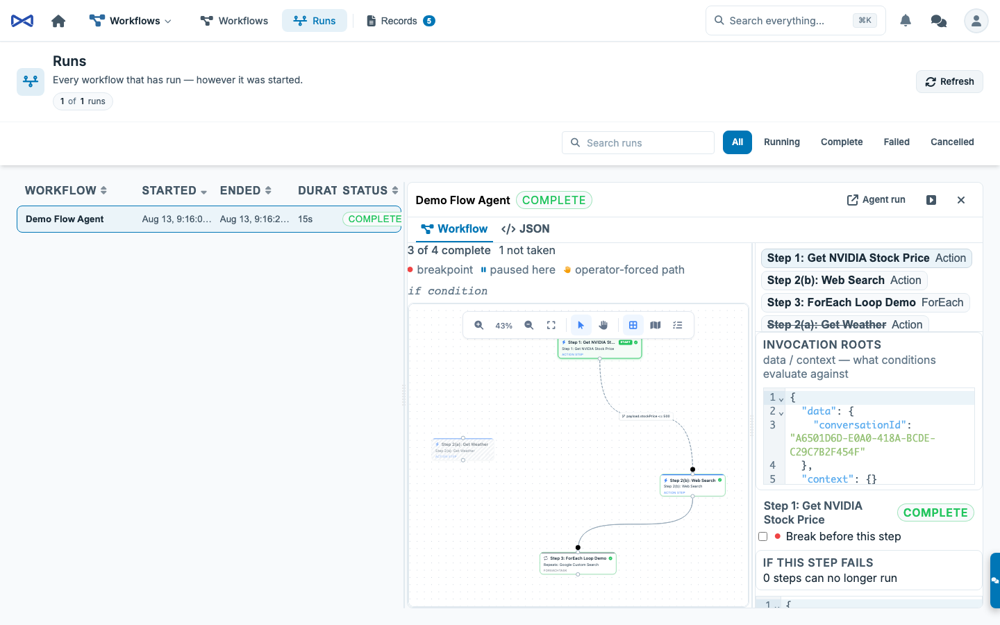

# Workflow Debugger

**Read this when a run is stuck, took the wrong branch, or you need to step through a live graph.** Companion to the [Workflows and Task Graphs Guide](WORKFLOW_AND_TASK_GRAPH_GUIDE.md) (what a workflow *is*) and [`packages/TaskGraph/README.md`](../packages/TaskGraph/README.md) (how the engine runs it).

The typical path is **Agent form → Run → Debug**. That starts the Flow agent *paused* — `$.debug.paused` is written on the parent row at Submit, so the dispatcher cannot claim the first step before you arrive. **Workflows → Runs** is the review console for a graph that is already going (or already finished). You cannot re-run a Flow agent from Runs; open the agent and Debug again.

Both surfaces embed the same drop-in: `<mj-task-graph-debugger>` in [`@memberjunction/ng-task-graph-editor`](../packages/Angular/Generic/task-graph-editor/README.md). Hosts pass a parent task id. The wrap owns frames, `$.debug`, and every `TaskGraph.*` Remote Operation.



---

## What you are looking at

A parent `MJ: Tasks` row **is** a run. Open it and the pane is the console:

| Piece | What it is |
|---|---|
| **Data pane (left)** | Invocation `data` / `context` plus the selected step's input and output. Starts **minimized** (a thin rail). Expand, drag the splitter, collapse again — width is restored. Persisted as one typed bag (`TaskGraphRunPrefs`, key `mj.taskGraphRun.prefs.v1`). |
| **Canvas** | The graph, live. Untaken branches disappear. A taken path is thicker and success-green. The edge about to run (or currently running) is brand-colored, thicker, and animated. |
| **Runner controls** | Continue (F5) / Step Over (F10) / Step Into (F11) / Stop (Shift+F5). These gate **claiming**, not running. In-flight work finishes. When every step is done the bar shows **Finished**, not Paused — settled state trumps a leftover `$.debug.paused` on the row. |
| **Canvas tools** | Minimized by default (wrench chip, top left). Expand for zoom / pan / fit. Hide leaves a recover tab. Fit-to-view runs once per geometry, not on every poll. |
| **Breakpoint** | Red circle on the selected step (hollow = off, filled = on). Same badge on the node. Right-click **Add / Remove Breakpoint** (F9). IDs are compared with `UUIDsEqual` so a case-folded UUID still matches. |
| **Stall card** | A held path names the condition and offers **Answer true / Answer false / Leave held**. |
| **Inspector** | The selected step or edge. Break-before-this-step, skip, edit input, retry, force complete. |

The same wrap embeds in the agent-run timeline (chrome off — that surface is a recording) and in the test harness (chrome **on** when you clicked Debug). Starting Payload in the harness is a collapsed disclosure, default closed, hidden while a run or debug session is live (`mj.aiTestHarness.prefs.v1`).

---

## How to debug from the Agent form

1. Open the Flow agent. Click **Run**.
2. Click **Debug**, not Run workflow. The live graph appears under the buttons as soon as Submit lands — do not wait for the agent run to finish (it is parked until the graph settles).
3. Run workflow / Debug hide once the debugger is live — the VCR is the session. Continue (F5) / Step Over (F10) / Step Into (F11) / Stop (Shift+F5).
4. The first eligible step shows **Next — waiting for the engine** until the dispatcher claims it, then **Running**, then the next one. A breakpoint paints **Waiting on you**. Right-click a step to add or remove a breakpoint. Right-click a conditional edge to force the path.
5. Close the dialog if you want — the dispatcher still owns the graph. Re-open Runs to find it later.

Start-paused cannot be a Pause clicked after submit. The first dispatcher pass would claim work first. Submit writes `$.debug.paused` on the parent row **and** kicks every running dispatcher so the first poll is immediate, not one `PollIntervalSeconds` later.

---

## How to debug a live run already in flight

1. Open **Workflows → Runs** and select a running (or just-submitted) graph.
2. **Pause**, or arm a breakpoint on the interesting step (red circle after selecting the node, or right-click) and **Continue**.
3. When the graph stops, the paused-here badge and chip name the step. Open the left pane to inspect its input. Edit it if the brief is wrong, then **Step**.
4. If the stall card says a path can't be answered, that is a held exclusive group. Answer the condition or fix the invocation roots and resume.
5. **Continue** to run freely to the next breakpoint, or **Step** / **Step wave** to walk.

A breakpoint pauses the **whole graph** before the named step is claimed. Siblings do not start. That is what "pause here" means on a parallel graph.


---

## How to read the picture

### Nodes

| Look | Meaning |
|---|---|
| **Next — waiting for the engine** (dashed brand glow) | Prerequisites are done (or it is an entry). The dispatcher has not claimed it yet. Distinct from a breakpoint. |
| **Running** (solid pulse) | Claimed. The runner is in flight. |
| **Waiting on you** (pause badge) | Breakpoint hit, or start-paused on the first step. Continue or Step to release. |
| **Grey / skipped** | The graph chose another route. Normal. Not a failure. |

### Edges

Untaken branches are **gone** from the picture (except an operator-forced edge, which must stay visible or the history lies).

| Stroke | Meaning |
|---|---|
| Thin, default color | Not yet traveled. A conditional still waiting on a decision is **dashed** and keeps its `if` / expression label. |
| Thick, success-green, **solid** | Traveled — the origin finished **and** the destination actually started (`In Progress` / `Complete` / `Failed` / `Cancelled`). A pending destination is still a candidate, so the edge stays dashed until one dest is claimed and the losers skip. |
| Thick, brand-colored, **animated** | Flowing — the dest is next-to-run or currently running. |
| **Dotted + hand + "forced yes/no"** | **You** answered this path. Never looks like a condition that evaluated on its own. |

A conditional that has been taken becomes solid and keeps the `if` label. The dash is "not decided yet," not "this edge has a condition."

State is read from `$.debug` on the parent row, not accumulated from frames. Refresh the page and the armed set is still there. Frames (`BreakpointHit`, `GateDecision`, `GraphSettled`, …) are how the console learns *quickly*; the row is how it stays honest.

---

## Continue, ForEach, and why one breakpoint is not five

`ForEach` is **one task row**. Iterations run inside that one claim. Continue does not mean "run one iteration" — it means "claim this step (the whole loop) and then run freely to the next armed breakpoint on a *different* task."

When you Continue from a breakpoint, Resume stamps `skipBreakpointTaskID` on the bag for the stopped step. The next claim gate ignores that id once so the Pending row is actually claimed. Without that, Resume would clear `paused` and the next poll would re-hit the same still-eligible breakpoint forever — which is exactly what a breakpoint on a last-step ForEach looked like.

The skip is cleared after the claim, or if the step is no longer eligible. Pause clears it too.

---

## Why the first step used to wait a few seconds

The dispatcher polls on `PollIntervalSeconds` (default **5**). Submit and the dispatcher are separate halves of the package — Submit cannot call the running instance directly. Each `Start()` registers a kick; `TaskGraph.Submit` calls `KickTaskGraphDispatchers()` so the first pass is immediate. `Start()` also kicks once so a dispatcher that just came up does not sit idle until its first interval.

If a graph sits on **Next — waiting for the engine** for several seconds after Debug, no dispatcher is registered to kick (MJAPI not running the worker, or `StartTaskGraphDispatcher` never ran).

---

## The verbs the console calls

| Verb | When | What it does |
|---|---|---|
| `TaskGraph.SetBreakpoints` | Any time | **Replaces** the breakpoint set. Empty array clears. The wrap re-reads immediately before composing so a stale write cannot drop someone else's breakpoint. |
| `TaskGraph.OverrideEdge` | A **conditional** edge | `'true'` opens the gate, `'false'` is branch-not-taken (skip cascade), `null` clears. Unconditional edges refuse — skip the step instead. |
| `TaskGraph.UpdateTaskInput` | Step is **Pending** | Replaces this run's input. Invalid JSON is refused in the UI. |
| `TaskGraph.RetryTask` + `inputPayload` | Step is **Failed** | Edit the brief and re-queue. |
| `TaskGraph.ForceCompleteTask` | Pending / Failed / Blocked, not a human step, not a live claim | Marks the step Complete. The RO field is `payload` — that value becomes the step **output** downstream conditions evaluate against. Typed confirmation required. |
| `TaskGraph.Pause` / `Resume` / `Step` / `Cancel` / `SkipTask` | See toolbar | Already wired. Resume from a breakpoint also stamps `skipBreakpointTaskID`. |



---

## Durable state

Everything lives under `$.debug` on the parent task's `InputPayload`. The debugger and the dispatcher never talk directly — they rendezvous on the row. See [`debug-state.ts`](../packages/TaskGraph/src/debug-state.ts).

```typescript
type TaskGraphDebugState = {
    paused?: boolean;
    pausedBy?: string | null;
    pausedReason?: 'user' | 'breakpoint';
    pausedAtTaskID?: string | null;
    breakpoints?: string[];
    step?: 'one' | 'wave' | string;
    skipBreakpointTaskID?: string | null;
    edgeOverrides?: Record<string, 'true' | 'false'>;
};
```

The empty object is "no debugging." A graph submitted before this existed parses to exactly that.

---

## Who can drive it

Debug verbs write through guarded SQL, so they authorize explicitly: the graph's recorded owner, or an Owner-type user. Everyone else sees a clear refusal, not a silent no-op.

Two consoles on the same run share the row. `SetBreakpoints` replaces the whole set — if someone else armed one while you were looking, a stale write would drop theirs. The wrap re-reads immediately before composing.

---

## Drop-in: embed the debugger anywhere

```html
<mj-task-graph-debugger
    [ParentTaskID]="parentTaskId"
    [AllowBreakpointEditing]="true"
    [ShowChrome]="true"
    (Settled)="onSettled()"
    (Frame)="onFrame($event)">
</mj-task-graph-debugger>
```

Public verbs (`Pause`, `Resume`, `Step`, `Cancel`, `ToggleBreakpoint`, `OverrideEdge`, `SkipTask`, `RetryTask`, `UpdateTaskInput`, `ForceCompleteTask`) and editor events (`NodeSelected`, `ConnectionSelected`) are on the wrap. Hosts must not re-subscribe to `TaskGraphFrames` or call `RouteOperation` for the same session — that is how Runs and the harness used to drift.

The **run view** inside the wrap is still paint-only (L1). The wrap is an L2 composite whose *job* is the session, so it reads the parent row and writes via `ProviderToUse.RouteOperation`. See [UI Layering](UI_LAYERING_GUIDE.md) §5.

Full API: [`packages/Angular/Generic/task-graph-editor/README.md`](../packages/Angular/Generic/task-graph-editor/README.md).

---

## What this is not

- Not a second canvas. The authoring canvas grew badges and a connection event; `flow-editor` stays a generic graph editor.
- Not cross-run breakpoint persistence. "Always break on this step of this workflow" is a design-time feature and a separate piece of work.
- Not a live channel to a worker. Every control is a row write. Every dispatcher instance obeys on the next pass (kicked immediately after Submit).
- Not "step one ForEach iteration." The loop is one task. Step/Continue claims that row once.

---

## Related

- [Workflows and Task Graphs](WORKFLOW_AND_TASK_GRAPH_GUIDE.md) — definitions, conditions, failure, payload dialect.
- [`packages/TaskGraph/README.md`](../packages/TaskGraph/README.md) — dispatcher, claims, kick, remote operations.
- [`packages/TaskGraph/src/debug-state.ts`](../packages/TaskGraph/src/debug-state.ts) — the durable state contract.
- [`@memberjunction/ng-task-graph-editor`](../packages/Angular/Generic/task-graph-editor/README.md) — canvas, run view, drop-in debugger.
- [UI Layering](UI_LAYERING_GUIDE.md) — L1 paint vs L2 session owner.
