# Database Documentation: UniversityDB

**Server**: localhost
**Generated**: 2026-01-22T18:10:30.195Z
**Total Iterations**: 2

## Analysis Summary

- **Status**: converged
- **Iterations**: 2
- **Tokens Used**: 0
- **Estimated Cost**: $0.00
- **AI Model**: gemini-2.0-flash
- **AI Vendor**: gemini
- **Temperature**: 0.1
- **Convergence**: No changes in last 2 iterations (stability achieved); All tables meet confidence threshold (0.85)

## Table of Contents

### [dbo](#schema-dbo) (20 tables)
- [Assignments](#assignments)
- [Attendance](#attendance)
- [BookCheckouts](#bookcheckouts)
- [Books](#books)
- [Buildings](#buildings)
- [Classrooms](#classrooms)
- [Courses](#courses)
- [CourseSections](#coursesections)
- [Departments](#departments)
- [Enrollments](#enrollments)
- [EventRegistrations](#eventregistrations)
- [Events](#events)
- [FinancialAid](#financialaid)
- [Grades](#grades)
- [Libraries](#libraries)
- [Professors](#professors)
- [ResearchProjects](#researchprojects)
- [Semesters](#semesters)
- [StudentResearch](#studentresearch)
- [Students](#students)

## Schema: dbo

### Entity Relationship Diagram

```mermaid
erDiagram
    Assignments {
        int AssignmentID "PK,NOT_NULL"
        int SectionID "FK,NOT_NULL"
        nvarchar AssignmentName "NOT_NULL"
        nvarchar Description
        datetime2 DueDate "NOT_NULL"
        decimal MaxPoints "NOT_NULL"
        nvarchar AssignmentType
        datetime2 CreatedAt
        datetime2 UpdatedAt
    }
    Attendance {
        int AttendanceID "PK,NOT_NULL"
        int EnrollmentID "FK,NOT_NULL"
        date AttendanceDate "NOT_NULL"
        nvarchar Status
        nvarchar Notes
        datetime2 CreatedAt
        datetime2 UpdatedAt
    }
    BookCheckouts {
        int CheckoutID "PK,NOT_NULL"
        int BookID "FK,NOT_NULL"
        int StudentID "FK,NOT_NULL"
        datetime2 CheckoutDate
        datetime2 DueDate "NOT_NULL"
        datetime2 ReturnDate
        decimal LateFee
        nvarchar Status
        datetime2 CreatedAt
        datetime2 UpdatedAt
    }
    Books {
        int BookID "PK,NOT_NULL"
        nvarchar ISBN
        nvarchar Title "NOT_NULL"
        nvarchar Author
        nvarchar Publisher
        int PublicationYear
        nvarchar Edition
        nvarchar Category
        int TotalCopies
        int AvailableCopies
        int LibraryID "FK,NOT_NULL"
        datetime2 CreatedAt
        datetime2 UpdatedAt
    }
    Buildings {
        int BuildingID "PK,NOT_NULL"
        nvarchar BuildingCode "NOT_NULL"
        nvarchar BuildingName "NOT_NULL"
        nvarchar Address
        int YearBuilt
        int TotalFloors
        bit HasElevator
        int ParkingSpaces
        datetime2 CreatedAt
        datetime2 UpdatedAt
    }
    Classrooms {
        int ClassroomID "PK,NOT_NULL"
        nvarchar RoomNumber "NOT_NULL"
        int BuildingID "FK,NOT_NULL"
        int Capacity "NOT_NULL"
        bit HasProjector
        bit HasSmartboard
        bit HasComputers
        int FloorNumber
        nvarchar RoomType
        datetime2 CreatedAt
        datetime2 UpdatedAt
    }
    Courses {
        int CourseID "PK,NOT_NULL"
        nvarchar CourseCode "NOT_NULL"
        nvarchar CourseName "NOT_NULL"
        int DepartmentID "FK,NOT_NULL"
        int Credits "NOT_NULL"
        nvarchar Level
        nvarchar Description
        int PrerequisiteCourseID "FK"
        int MaxEnrollment
        datetime2 CreatedAt
        datetime2 UpdatedAt
    }
    CourseSections {
        int SectionID "PK,NOT_NULL"
        int CourseID "FK,NOT_NULL"
        int SemesterID "FK,NOT_NULL"
        nvarchar SectionNumber "NOT_NULL"
        int ProfessorID "FK,NOT_NULL"
        int ClassroomID "FK"
        nvarchar MeetingDays
        time StartTime
        time EndTime
        int MaxStudents
        int EnrolledStudents
        nvarchar Status
        datetime2 CreatedAt
        datetime2 UpdatedAt
    }
    Departments {
        int DepartmentID "PK,NOT_NULL"
        nvarchar DepartmentCode "NOT_NULL"
        nvarchar DepartmentName "NOT_NULL"
        nvarchar Building
        decimal Budget
        int ChairPersonID "FK"
        datetime2 CreatedAt
        datetime2 UpdatedAt
    }
    Enrollments {
        int EnrollmentID "PK,NOT_NULL"
        int StudentID "FK,NOT_NULL"
        int SectionID "FK,NOT_NULL"
        datetime2 EnrollmentDate
        nvarchar Grade
        nvarchar Status
        datetime2 DropDate
        datetime2 CreatedAt
        datetime2 UpdatedAt
    }
    EventRegistrations {
        int RegistrationID "PK,NOT_NULL"
        int EventID "FK,NOT_NULL"
        int StudentID "FK,NOT_NULL"
        datetime2 RegistrationDate
        nvarchar AttendanceStatus
        datetime2 CreatedAt
        datetime2 UpdatedAt
    }
    Events {
        int EventID "PK,NOT_NULL"
        nvarchar EventName "NOT_NULL"
        nvarchar Description
        datetime2 EventDate "NOT_NULL"
        nvarchar Location
        int BuildingID "FK"
        int ClassroomID "FK"
        int Capacity
        int OrganizerDepartmentID "FK"
        nvarchar EventType
        bit RegistrationRequired
        datetime2 CreatedAt
        datetime2 UpdatedAt
    }
    FinancialAid {
        int AidID "PK,NOT_NULL"
        int StudentID "FK,NOT_NULL"
        int SemesterID "FK,NOT_NULL"
        nvarchar AidType
        decimal Amount "NOT_NULL"
        date AwardDate
        nvarchar Status
        datetime2 CreatedAt
        datetime2 UpdatedAt
    }
    Grades {
        int GradeID "PK,NOT_NULL"
        int EnrollmentID "FK,NOT_NULL"
        int AssignmentID "FK,NOT_NULL"
        decimal PointsEarned
        datetime2 SubmittedDate
        datetime2 GradedDate
        nvarchar Comments
        datetime2 CreatedAt
        datetime2 UpdatedAt
    }
    Libraries {
        int LibraryID "PK,NOT_NULL"
        nvarchar LibraryName "NOT_NULL"
        int BuildingID "FK"
        time OpeningTime
        time ClosingTime
        int MaxOccupancy
        bit HasStudyRooms
        bit HasComputers
        datetime2 CreatedAt
        datetime2 UpdatedAt
    }
    Professors {
        int ProfessorID "PK,NOT_NULL"
        nvarchar FirstName "NOT_NULL"
        nvarchar LastName "NOT_NULL"
        nvarchar Email "NOT_NULL"
        nvarchar Phone
        int DepartmentID "FK,NOT_NULL"
        date HireDate "NOT_NULL"
        decimal Salary
        nvarchar TenureStatus
        nvarchar OfficeNumber
        datetime2 CreatedAt
        datetime2 UpdatedAt
    }
    ResearchProjects {
        int ProjectID "PK,NOT_NULL"
        nvarchar ProjectName "NOT_NULL"
        nvarchar Description
        int DepartmentID "FK,NOT_NULL"
        int PrincipalInvestigatorID "FK,NOT_NULL"
        date StartDate
        date EndDate
        decimal Budget
        nvarchar FundingSource
        nvarchar Status
        datetime2 CreatedAt
        datetime2 UpdatedAt
    }
    Semesters {
        int SemesterID "PK,NOT_NULL"
        nvarchar SemesterName "NOT_NULL"
        int Year "NOT_NULL"
        date StartDate "NOT_NULL"
        date EndDate "NOT_NULL"
        date RegistrationStartDate
        date RegistrationEndDate
        bit IsCurrentSemester
        datetime2 CreatedAt
        datetime2 UpdatedAt
    }
    StudentResearch {
        int StudentResearchID "PK,NOT_NULL"
        int ProjectID "FK,NOT_NULL"
        int StudentID "FK,NOT_NULL"
        nvarchar Role
        date StartDate
        date EndDate
        int HoursPerWeek
        decimal Stipend
        datetime2 CreatedAt
        datetime2 UpdatedAt
    }
    Students {
        int StudentID "PK,NOT_NULL"
        nvarchar StudentNumber "NOT_NULL"
        nvarchar FirstName "NOT_NULL"
        nvarchar LastName "NOT_NULL"
        nvarchar Email "NOT_NULL"
        nvarchar Phone
        date DateOfBirth "NOT_NULL"
        date EnrollmentDate "NOT_NULL"
        int MajorDepartmentID "FK"
        int AdvisorID "FK"
        decimal GPA
        nvarchar Status
        nvarchar Address
        nvarchar City
        nvarchar State
        nvarchar ZipCode
        datetime2 CreatedAt
        datetime2 UpdatedAt
    }

    CourseSections ||--o{ Assignments : "has"
    Enrollments ||--o{ Attendance : "has"
    Books ||--o{ BookCheckouts : "has"
    Students ||--o{ BookCheckouts : "has"
    Libraries ||--o{ Books : "has"
    Buildings ||--o{ Classrooms : "has"
    Departments ||--o{ Courses : "has"
    Courses ||--o{ Courses : "has"
    Courses ||--o{ CourseSections : "has"
    Semesters ||--o{ CourseSections : "has"
    Professors ||--o{ CourseSections : "has"
    Classrooms ||--o{ CourseSections : "has"
    Professors ||--o{ Departments : "has"
    Students ||--o{ Enrollments : "has"
    CourseSections ||--o{ Enrollments : "has"
    Events ||--o{ EventRegistrations : "has"
    Students ||--o{ EventRegistrations : "has"
    Buildings ||--o{ Events : "has"
    Classrooms ||--o{ Events : "has"
    Departments ||--o{ Events : "has"
    Students ||--o{ FinancialAid : "has"
    Semesters ||--o{ FinancialAid : "has"
    Enrollments ||--o{ Grades : "has"
    Assignments ||--o{ Grades : "has"
    Buildings ||--o{ Libraries : "has"
    Departments ||--o{ Professors : "has"
    Departments ||--o{ ResearchProjects : "has"
    Professors ||--o{ ResearchProjects : "has"
    ResearchProjects ||--o{ StudentResearch : "has"
    Students ||--o{ StudentResearch : "has"
    Departments ||--o{ Students : "has"
    Professors ||--o{ Students : "has"
```

### Tables

#### Assignments

**Row Count**: 0
**Dependency Level**: 3

**Depends On**:
- [dbo.CourseSections](#coursesections) (via SectionID)

**Referenced By**:
- [dbo.Grades](#grades)

**Columns**:

| Column | Type | Description |
|--------|------|-------------|
| AssignmentID | int (PK, NOT NULL) |  |
| SectionID | int (FK, NOT NULL) |  |
| AssignmentName | nvarchar (NOT NULL) |  |
| Description | nvarchar |  |
| DueDate | datetime2 (NOT NULL) |  |
| MaxPoints | decimal (NOT NULL) |  |
| AssignmentType | nvarchar |  |
| CreatedAt | datetime2 |  |
| UpdatedAt | datetime2 |  |

#### Attendance

**Row Count**: 0
**Dependency Level**: 3

**Depends On**:
- [dbo.Enrollments](#enrollments) (via EnrollmentID)

**Columns**:

| Column | Type | Description |
|--------|------|-------------|
| AttendanceID | int (PK, NOT NULL) |  |
| EnrollmentID | int (FK, NOT NULL) |  |
| AttendanceDate | date (NOT NULL) |  |
| Status | nvarchar |  |
| Notes | nvarchar |  |
| CreatedAt | datetime2 |  |
| UpdatedAt | datetime2 |  |

#### BookCheckouts

**Row Count**: 0
**Dependency Level**: 3

**Depends On**:
- [dbo.Books](#books) (via BookID)
- [dbo.Students](#students) (via StudentID)

**Columns**:

| Column | Type | Description |
|--------|------|-------------|
| CheckoutID | int (PK, NOT NULL) |  |
| BookID | int (FK, NOT NULL) |  |
| StudentID | int (FK, NOT NULL) |  |
| CheckoutDate | datetime2 |  |
| DueDate | datetime2 (NOT NULL) |  |
| ReturnDate | datetime2 |  |
| LateFee | decimal |  |
| Status | nvarchar |  |
| CreatedAt | datetime2 |  |
| UpdatedAt | datetime2 |  |

#### Books

**Row Count**: 0
**Dependency Level**: 2

**Depends On**:
- [dbo.Libraries](#libraries) (via LibraryID)

**Referenced By**:
- [dbo.BookCheckouts](#bookcheckouts)

**Columns**:

| Column | Type | Description |
|--------|------|-------------|
| BookID | int (PK, NOT NULL) |  |
| ISBN | nvarchar |  |
| Title | nvarchar (NOT NULL) |  |
| Author | nvarchar |  |
| Publisher | nvarchar |  |
| PublicationYear | int |  |
| Edition | nvarchar |  |
| Category | nvarchar |  |
| TotalCopies | int |  |
| AvailableCopies | int |  |
| LibraryID | int (FK, NOT NULL) |  |
| CreatedAt | datetime2 |  |
| UpdatedAt | datetime2 |  |

#### Buildings

**Row Count**: 0
**Dependency Level**: 0

**Referenced By**:
- [dbo.Classrooms](#classrooms)
- [dbo.Events](#events)
- [dbo.Libraries](#libraries)

**Columns**:

| Column | Type | Description |
|--------|------|-------------|
| BuildingID | int (PK, NOT NULL) |  |
| BuildingCode | nvarchar (NOT NULL) |  |
| BuildingName | nvarchar (NOT NULL) |  |
| Address | nvarchar |  |
| YearBuilt | int |  |
| TotalFloors | int |  |
| HasElevator | bit |  |
| ParkingSpaces | int |  |
| CreatedAt | datetime2 |  |
| UpdatedAt | datetime2 |  |

#### Classrooms

**Row Count**: 0
**Dependency Level**: 1

**Depends On**:
- [dbo.Buildings](#buildings) (via BuildingID)

**Referenced By**:
- [dbo.CourseSections](#coursesections)
- [dbo.Events](#events)

**Columns**:

| Column | Type | Description |
|--------|------|-------------|
| ClassroomID | int (PK, NOT NULL) |  |
| RoomNumber | nvarchar (NOT NULL) |  |
| BuildingID | int (FK, NOT NULL) |  |
| Capacity | int (NOT NULL) |  |
| HasProjector | bit |  |
| HasSmartboard | bit |  |
| HasComputers | bit |  |
| FloorNumber | int |  |
| RoomType | nvarchar |  |
| CreatedAt | datetime2 |  |
| UpdatedAt | datetime2 |  |

#### Courses

**Row Count**: 0
**Dependency Level**: 3

**Depends On**:
- [dbo.Departments](#departments) (via DepartmentID)
- [dbo.Courses](#courses) (via PrerequisiteCourseID)

**Referenced By**:
- [dbo.Courses](#courses)
- [dbo.CourseSections](#coursesections)

**Columns**:

| Column | Type | Description |
|--------|------|-------------|
| CourseID | int (PK, NOT NULL) |  |
| CourseCode | nvarchar (NOT NULL) |  |
| CourseName | nvarchar (NOT NULL) |  |
| DepartmentID | int (FK, NOT NULL) |  |
| Credits | int (NOT NULL) |  |
| Level | nvarchar |  |
| Description | nvarchar |  |
| PrerequisiteCourseID | int (FK) |  |
| MaxEnrollment | int |  |
| CreatedAt | datetime2 |  |
| UpdatedAt | datetime2 |  |

#### CourseSections

**Row Count**: 0
**Dependency Level**: 3

**Depends On**:
- [dbo.Courses](#courses) (via CourseID)
- [dbo.Semesters](#semesters) (via SemesterID)
- [dbo.Professors](#professors) (via ProfessorID)
- [dbo.Classrooms](#classrooms) (via ClassroomID)

**Referenced By**:
- [dbo.Assignments](#assignments)
- [dbo.Enrollments](#enrollments)

**Columns**:

| Column | Type | Description |
|--------|------|-------------|
| SectionID | int (PK, NOT NULL) |  |
| CourseID | int (FK, NOT NULL) |  |
| SemesterID | int (FK, NOT NULL) |  |
| SectionNumber | nvarchar (NOT NULL) |  |
| ProfessorID | int (FK, NOT NULL) |  |
| ClassroomID | int (FK) |  |
| MeetingDays | nvarchar |  |
| StartTime | time |  |
| EndTime | time |  |
| MaxStudents | int |  |
| EnrolledStudents | int |  |
| Status | nvarchar |  |
| CreatedAt | datetime2 |  |
| UpdatedAt | datetime2 |  |

#### Departments

**Row Count**: 0
**Dependency Level**: 3

**Depends On**:
- [dbo.Professors](#professors) (via ChairPersonID)

**Referenced By**:
- [dbo.Courses](#courses)
- [dbo.Events](#events)
- [dbo.Professors](#professors)
- [dbo.ResearchProjects](#researchprojects)
- [dbo.Students](#students)

**Columns**:

| Column | Type | Description |
|--------|------|-------------|
| DepartmentID | int (PK, NOT NULL) |  |
| DepartmentCode | nvarchar (NOT NULL) |  |
| DepartmentName | nvarchar (NOT NULL) |  |
| Building | nvarchar |  |
| Budget | decimal |  |
| ChairPersonID | int (FK) |  |
| CreatedAt | datetime2 |  |
| UpdatedAt | datetime2 |  |

#### Enrollments

**Row Count**: 0
**Dependency Level**: 3

**Depends On**:
- [dbo.Students](#students) (via StudentID)
- [dbo.CourseSections](#coursesections) (via SectionID)

**Referenced By**:
- [dbo.Attendance](#attendance)
- [dbo.Grades](#grades)

**Columns**:

| Column | Type | Description |
|--------|------|-------------|
| EnrollmentID | int (PK, NOT NULL) |  |
| StudentID | int (FK, NOT NULL) |  |
| SectionID | int (FK, NOT NULL) |  |
| EnrollmentDate | datetime2 |  |
| Grade | nvarchar |  |
| Status | nvarchar |  |
| DropDate | datetime2 |  |
| CreatedAt | datetime2 |  |
| UpdatedAt | datetime2 |  |

#### EventRegistrations

**Row Count**: 0
**Dependency Level**: 3

**Depends On**:
- [dbo.Events](#events) (via EventID)
- [dbo.Students](#students) (via StudentID)

**Columns**:

| Column | Type | Description |
|--------|------|-------------|
| RegistrationID | int (PK, NOT NULL) |  |
| EventID | int (FK, NOT NULL) |  |
| StudentID | int (FK, NOT NULL) |  |
| RegistrationDate | datetime2 |  |
| AttendanceStatus | nvarchar |  |
| CreatedAt | datetime2 |  |
| UpdatedAt | datetime2 |  |

#### Events

**Row Count**: 0
**Dependency Level**: 3

**Depends On**:
- [dbo.Buildings](#buildings) (via BuildingID)
- [dbo.Classrooms](#classrooms) (via ClassroomID)
- [dbo.Departments](#departments) (via OrganizerDepartmentID)

**Referenced By**:
- [dbo.EventRegistrations](#eventregistrations)

**Columns**:

| Column | Type | Description |
|--------|------|-------------|
| EventID | int (PK, NOT NULL) |  |
| EventName | nvarchar (NOT NULL) |  |
| Description | nvarchar |  |
| EventDate | datetime2 (NOT NULL) |  |
| Location | nvarchar |  |
| BuildingID | int (FK) |  |
| ClassroomID | int (FK) |  |
| Capacity | int |  |
| OrganizerDepartmentID | int (FK) |  |
| EventType | nvarchar |  |
| RegistrationRequired | bit |  |
| CreatedAt | datetime2 |  |
| UpdatedAt | datetime2 |  |

#### FinancialAid

**Row Count**: 0
**Dependency Level**: 3

**Depends On**:
- [dbo.Students](#students) (via StudentID)
- [dbo.Semesters](#semesters) (via SemesterID)

**Columns**:

| Column | Type | Description |
|--------|------|-------------|
| AidID | int (PK, NOT NULL) |  |
| StudentID | int (FK, NOT NULL) |  |
| SemesterID | int (FK, NOT NULL) |  |
| AidType | nvarchar |  |
| Amount | decimal (NOT NULL) |  |
| AwardDate | date |  |
| Status | nvarchar |  |
| CreatedAt | datetime2 |  |
| UpdatedAt | datetime2 |  |

#### Grades

**Row Count**: 0
**Dependency Level**: 3

**Depends On**:
- [dbo.Enrollments](#enrollments) (via EnrollmentID)
- [dbo.Assignments](#assignments) (via AssignmentID)

**Columns**:

| Column | Type | Description |
|--------|------|-------------|
| GradeID | int (PK, NOT NULL) |  |
| EnrollmentID | int (FK, NOT NULL) |  |
| AssignmentID | int (FK, NOT NULL) |  |
| PointsEarned | decimal |  |
| SubmittedDate | datetime2 |  |
| GradedDate | datetime2 |  |
| Comments | nvarchar |  |
| CreatedAt | datetime2 |  |
| UpdatedAt | datetime2 |  |

#### Libraries

**Row Count**: 0
**Dependency Level**: 1

**Depends On**:
- [dbo.Buildings](#buildings) (via BuildingID)

**Referenced By**:
- [dbo.Books](#books)

**Columns**:

| Column | Type | Description |
|--------|------|-------------|
| LibraryID | int (PK, NOT NULL) |  |
| LibraryName | nvarchar (NOT NULL) |  |
| BuildingID | int (FK) |  |
| OpeningTime | time |  |
| ClosingTime | time |  |
| MaxOccupancy | int |  |
| HasStudyRooms | bit |  |
| HasComputers | bit |  |
| CreatedAt | datetime2 |  |
| UpdatedAt | datetime2 |  |

#### Professors

**Row Count**: 0
**Dependency Level**: 3

**Depends On**:
- [dbo.Departments](#departments) (via DepartmentID)

**Referenced By**:
- [dbo.CourseSections](#coursesections)
- [dbo.Departments](#departments)
- [dbo.ResearchProjects](#researchprojects)
- [dbo.Students](#students)

**Columns**:

| Column | Type | Description |
|--------|------|-------------|
| ProfessorID | int (PK, NOT NULL) |  |
| FirstName | nvarchar (NOT NULL) |  |
| LastName | nvarchar (NOT NULL) |  |
| Email | nvarchar (NOT NULL) |  |
| Phone | nvarchar |  |
| DepartmentID | int (FK, NOT NULL) |  |
| HireDate | date (NOT NULL) |  |
| Salary | decimal |  |
| TenureStatus | nvarchar |  |
| OfficeNumber | nvarchar |  |
| CreatedAt | datetime2 |  |
| UpdatedAt | datetime2 |  |

#### ResearchProjects

**Row Count**: 0
**Dependency Level**: 3

**Depends On**:
- [dbo.Departments](#departments) (via DepartmentID)
- [dbo.Professors](#professors) (via PrincipalInvestigatorID)

**Referenced By**:
- [dbo.StudentResearch](#studentresearch)

**Columns**:

| Column | Type | Description |
|--------|------|-------------|
| ProjectID | int (PK, NOT NULL) |  |
| ProjectName | nvarchar (NOT NULL) |  |
| Description | nvarchar |  |
| DepartmentID | int (FK, NOT NULL) |  |
| PrincipalInvestigatorID | int (FK, NOT NULL) |  |
| StartDate | date |  |
| EndDate | date |  |
| Budget | decimal |  |
| FundingSource | nvarchar |  |
| Status | nvarchar |  |
| CreatedAt | datetime2 |  |
| UpdatedAt | datetime2 |  |

#### Semesters

**Row Count**: 0
**Dependency Level**: 0

**Referenced By**:
- [dbo.CourseSections](#coursesections)
- [dbo.FinancialAid](#financialaid)

**Columns**:

| Column | Type | Description |
|--------|------|-------------|
| SemesterID | int (PK, NOT NULL) |  |
| SemesterName | nvarchar (NOT NULL) |  |
| Year | int (NOT NULL) |  |
| StartDate | date (NOT NULL) |  |
| EndDate | date (NOT NULL) |  |
| RegistrationStartDate | date |  |
| RegistrationEndDate | date |  |
| IsCurrentSemester | bit |  |
| CreatedAt | datetime2 |  |
| UpdatedAt | datetime2 |  |

#### StudentResearch

**Row Count**: 0
**Dependency Level**: 3

**Depends On**:
- [dbo.ResearchProjects](#researchprojects) (via ProjectID)
- [dbo.Students](#students) (via StudentID)

**Columns**:

| Column | Type | Description |
|--------|------|-------------|
| StudentResearchID | int (PK, NOT NULL) |  |
| ProjectID | int (FK, NOT NULL) |  |
| StudentID | int (FK, NOT NULL) |  |
| Role | nvarchar |  |
| StartDate | date |  |
| EndDate | date |  |
| HoursPerWeek | int |  |
| Stipend | decimal |  |
| CreatedAt | datetime2 |  |
| UpdatedAt | datetime2 |  |

#### Students

**Row Count**: 0
**Dependency Level**: 3

**Depends On**:
- [dbo.Departments](#departments) (via MajorDepartmentID)
- [dbo.Professors](#professors) (via AdvisorID)

**Referenced By**:
- [dbo.BookCheckouts](#bookcheckouts)
- [dbo.Enrollments](#enrollments)
- [dbo.EventRegistrations](#eventregistrations)
- [dbo.FinancialAid](#financialaid)
- [dbo.StudentResearch](#studentresearch)

**Columns**:

| Column | Type | Description |
|--------|------|-------------|
| StudentID | int (PK, NOT NULL) |  |
| StudentNumber | nvarchar (NOT NULL) |  |
| FirstName | nvarchar (NOT NULL) |  |
| LastName | nvarchar (NOT NULL) |  |
| Email | nvarchar (NOT NULL) |  |
| Phone | nvarchar |  |
| DateOfBirth | date (NOT NULL) |  |
| EnrollmentDate | date (NOT NULL) |  |
| MajorDepartmentID | int (FK) |  |
| AdvisorID | int (FK) |  |
| GPA | decimal |  |
| Status | nvarchar |  |
| Address | nvarchar |  |
| City | nvarchar |  |
| State | nvarchar |  |
| ZipCode | nvarchar |  |
| CreatedAt | datetime2 |  |
| UpdatedAt | datetime2 |  |

---

## Appendix: Iteration Analysis

This section documents the iterative refinement process used to generate the database documentation, highlighting corrections and improvements discovered through backpropagation.

No iterative refinements were needed - all descriptions were accepted on first analysis.
