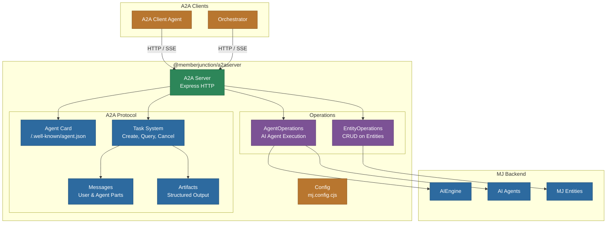
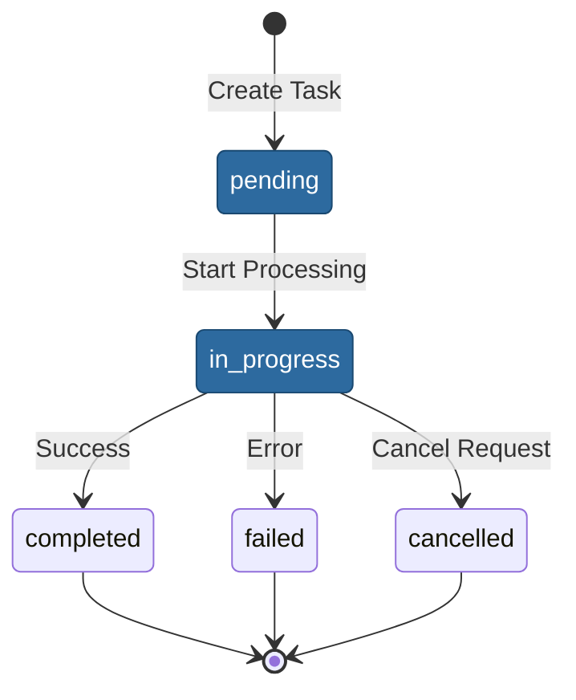

# @memberjunction/a2aserver

MemberJunction implementation of the Google Agent-to-Agent (A2A) protocol server. Exposes MemberJunction AI agents and entity operations as A2A-compliant capabilities, enabling interoperability with other A2A-compatible agents across different platforms and frameworks.

## Architecture



## About the A2A Protocol

Agent-to-Agent (A2A) is an open protocol developed by Google that enables communication and interoperability between opaque agentic applications. It provides a standardized way for agents built on different platforms to discover, communicate with, and delegate tasks to each other.

- [Official A2A Documentation](https://google.github.io/A2A/)
- [A2A Protocol Specification](https://google.github.io/A2A/specification/)
- [GitHub Repository](https://github.com/google/A2A)

## Installation

```bash
npm install @memberjunction/a2aserver
```

## Quick Start

```bash
# Start the A2A server (default port 3200)
npx @memberjunction/a2aserver
```

## Key Features

### Agent Card Discovery

The server publishes an Agent Card at `/.well-known/agent.json` following the A2A specification. The card describes the server's capabilities, supported skills, and authentication requirements.

### Task-Based Interaction

All interactions follow the A2A task model:



### Entity Operations

CRUD operations on MemberJunction entities exposed through A2A:

| Operation | Description |
|---|---|
| `Get` | Retrieve a single entity record by primary key |
| `Create` | Create a new entity record |
| `Update` | Update an existing entity record |
| `Delete` | Delete an entity record |
| `Query` | Search/filter entity records with RunView |

### Agent Operations

Execute MemberJunction AI agents through A2A tasks:

- Send messages to agents via A2A task creation
- Receive agent responses as A2A message parts
- Track execution status through task lifecycle
- Access agent artifacts (structured outputs)

### Server-Sent Events (SSE)

Streaming support for long-running agent operations. Clients can subscribe to task updates via SSE for real-time status and message delivery.

## A2A Protocol Endpoints

| Endpoint | Method | Description |
|---|---|---|
| `/.well-known/agent.json` | GET | Agent Card discovery |
| `/tasks/send` | POST | Create a new task |
| `/tasks/sendSubscribe` | POST | Create task with SSE subscription |
| `/tasks/{id}` | GET | Query task status |
| `/tasks/{id}/cancel` | POST | Cancel a running task |

## Configuration

Configure via `mj.config.cjs`:

```javascript
module.exports = {
    a2aServerSettings: {
        port: 3200
    },
    databaseSettings: {
        host: 'localhost',
        port: 1433,
        database: 'MemberJunction',
        username: 'sa',
        password: 'password'
    }
};
```

Required environment variables:
- `DB_HOST`, `DB_PORT`, `DB_DATABASE`, `DB_USERNAME`, `DB_PASSWORD` -- Database connection
- `AI_VENDOR_API_KEY__*` -- AI provider API keys

## Message Format

A2A messages contain typed parts:

```typescript
// Text part
{ type: 'text', content: 'Analyze sales data for Q3' }

// File part
{ type: 'file', content: '<base64-encoded-data>', metadata: { mimeType: 'application/pdf' } }

// Data part (structured)
{ type: 'data', content: { key: 'value' } }
```

## Dependencies

- `@memberjunction/ai-agents` -- AgentRunner for agent execution
- `@memberjunction/ai-core-plus` -- Extended entity classes
- `@memberjunction/aiengine` -- AIEngine for metadata
- `@memberjunction/ai` -- Core AI abstractions
- `@memberjunction/server` -- MJ server authentication
- `@memberjunction/server-bootstrap-lite` -- Class registration manifest
- `@memberjunction/sqlserver-dataprovider` -- SQL Server data access
- `@memberjunction/api-keys` -- API key management
- `@memberjunction/config` -- Configuration loading
- `@memberjunction/encryption` -- Data encryption
- `express` -- HTTP server framework
- `zod` -- Schema validation
