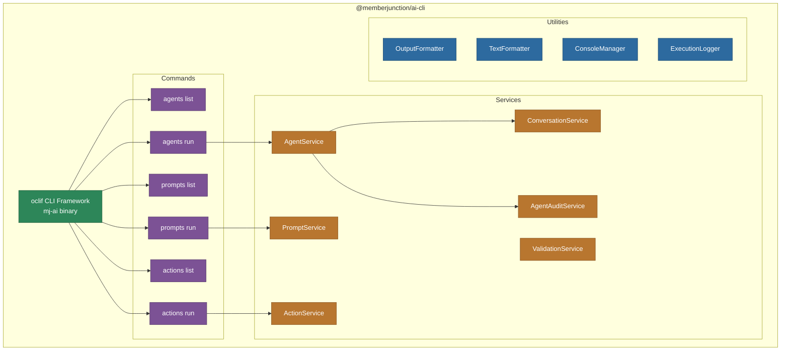

# @memberjunction/ai-cli

Command-line interface for executing MemberJunction AI agents, prompts, and actions. Built on the oclif framework, it provides both one-shot and interactive modes with rich terminal output, conversation history management, audit logging, and direct database integration.

> **Note**: The standalone `mj-ai` binary is deprecated. All AI functionality has been integrated into the main MemberJunction CLI. Use `mj ai` commands instead.

## Architecture



## Installation

```bash
npm install -g @memberjunction/ai-cli
```

## Commands

### Agent Commands

```bash
# List all available agents
mj-ai agents list

# List agents with filtering
mj-ai agents list --filter "sales"

# Run an agent interactively (chat mode)
mj-ai agents run --name "Sales Assistant"

# Run an agent with a single message
mj-ai agents run --name "Data Analyzer" --message "Show Q3 revenue by region"

# Run an agent by ID
mj-ai agents run --id "agent-uuid"
```

### Prompt Commands

```bash
# List all available prompts
mj-ai prompts list

# Run a prompt with data
mj-ai prompts run --name "Summarize Content" --data '{"content": "Long text..."}'

# Run a prompt with a file
mj-ai prompts run --name "Analyze Document" --file ./report.txt
```

### Action Commands

```bash
# List all available actions
mj-ai actions list

# Run an action with parameters
mj-ai actions run --name "Send Email" --params '{"to": "user@example.com", "subject": "Test"}'
```

## Key Features

### Interactive Chat Mode

When running an agent without `--message`, the CLI enters interactive chat mode with:
- Multi-line input support
- Conversation history across turns
- Real-time progress indicators (spinners)
- Formatted markdown output
- Color-coded output for different message types

### Conversation Management

The `ConversationService` manages conversation state:
- Creates and tracks MJ Conversation entities
- Maintains message history across agent turns
- Supports conversation resumption

### Audit Logging

The `AgentAuditService` provides detailed execution audit trails:
- Token usage tracking per turn
- Cost estimation
- Execution time tracking
- Action execution logging
- Error recording

### Output Formatting

Rich terminal output with:
- Markdown rendering via `TextFormatter`
- Tabular data display via `table` package
- Color-coded status messages via `chalk`
- Spinner animations via `ora-classic`
- Structured JSON output option

### Database Integration

Direct SQL Server connection for:
- Loading agent, prompt, and action metadata
- Storing conversation history
- Recording execution logs
- User context resolution

## Configuration

Configure via `mj.config.cjs`, `.mjrc`, or environment variables:

```javascript
module.exports = {
    databaseSettings: {
        host: 'localhost',
        port: 1433,
        database: 'MemberJunction',
        username: 'sa',
        password: 'password'
    }
};
```

Required environment variables:
- `DB_HOST`, `DB_PORT`, `DB_DATABASE`, `DB_USERNAME`, `DB_PASSWORD` -- Database connection
- `AI_VENDOR_API_KEY__OPENAILLM` -- OpenAI API key (or other provider keys)

## Dependencies

- `@oclif/core` -- CLI framework
- `@memberjunction/ai-agents` -- AgentRunner for agent execution
- `@memberjunction/ai-prompts` -- AIPromptRunner for prompt execution
- `@memberjunction/ai-core-plus` -- Shared types
- `@memberjunction/ai` -- Core AI abstractions
- `@memberjunction/actions` -- Action execution
- `@memberjunction/core` / `@memberjunction/core-entities` -- MJ framework
- `@memberjunction/sqlserver-dataprovider` -- SQL Server data access
- `@memberjunction/core-entities-server` -- Server-side entity extensions
- `@inquirer/prompts` -- Interactive prompts
- `chalk` -- Terminal colors
- `ora-classic` -- Terminal spinners
- `table` -- Tabular output
- `cosmiconfig` -- Configuration loading
