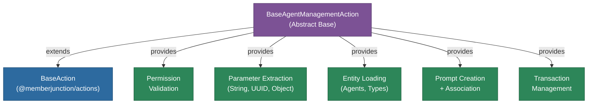

# @memberjunction/ai-agent-manager-actions

MemberJunction actions for AI agent management. This package provides the base action class and type definitions used by agent management actions, enabling programmatic creation, modification, and validation of AI agents through MemberJunction's action system.

## Architecture



## Features

- **Permission Validation**: Ensures agent management actions are called with proper user context
- **Parameter Extraction**: Type-safe extraction and validation of string, UUID, and object parameters
- **Entity Loading**: Helper methods for loading AI Agent and AI Agent Type entities with error handling
- **Prompt Management**: Create prompts and associate them with agents in a single operation
- **Transaction Support**: Database transaction management for multi-record operations with rollback
- **Error Handling**: Consistent error reporting via `ActionResultSimple` pattern
- **UUID Validation**: Built-in UUID format validation for entity references

## Installation

```bash
npm install @memberjunction/ai-agent-manager-actions
```

## Usage

### Extending for Custom Actions

```typescript
import { BaseAgentManagementAction } from '@memberjunction/ai-agent-manager-actions';
import { RunActionParams, ActionResultSimple } from '@memberjunction/actions-base';
import { RegisterClass } from '@memberjunction/global';
import { BaseAction } from '@memberjunction/actions';

@RegisterClass(BaseAction, 'My Agent Action')
export class MyAgentAction extends BaseAgentManagementAction {
    protected async InternalRunAction(params: RunActionParams): Promise<ActionResultSimple> {
        // Validate permissions
        const permError = await this.validateAgentManagerPermission(params);
        if (permError) return permError;

        // Extract typed parameters
        const agentId = this.getUuidParam(params, 'AgentID');
        if (agentId.error) return agentId.error;

        // Load agent entity
        const agentResult = await this.loadAgent(agentId.value, params.ContextUser);
        if (agentResult.error) return agentResult.error;

        // Perform action logic with the loaded agent
        const agent = agentResult.agent;
        // ...

        return { Success: true, ResultCode: 'SUCCESS', Message: 'Done' };
    }
}
```

### Using Transaction Support

```typescript
const providerResult = this.getTransactionProvider();
if (providerResult.error) return providerResult.error;
const provider = providerResult.provider;

await provider.BeginTransaction();
try {
    // Multiple database operations
    await agent.Save();
    await prompt.Save();
    await provider.CommitTransaction();
} catch (error) {
    await provider.RollbackTransaction();
    throw error;
}
```

## Key Types

| Type | Description |
|------|-------------|
| `ParameterResult<T>` | Result wrapper for parameter extraction (value or error) |
| `EntityLoadResult<T>` | Result wrapper for entity loading operations |
| `AgentLoadResult` | Specialized result for AI Agent loading |
| `AgentTypeValidationResult` | Result for agent type validation |
| `PromptCreationResult` | Result for prompt creation and association |
| `ObjectParameter` | `Record<string, unknown>` for object parameters |

## Base Class Methods

| Method | Description |
|--------|-------------|
| `validateAgentManagerPermission` | Validates user context for permissions |
| `getStringParam` | Extract and validate a string parameter |
| `getUuidParam` | Extract and validate a UUID parameter |
| `getObjectParam` | Extract and validate an object parameter |
| `loadAgent` | Load an AI Agent entity by ID |
| `validateAgentType` | Validate that an agent type ID exists |
| `createAndAssociatePrompt` | Create a prompt and link it to an agent |
| `getTransactionProvider` | Get database provider with transaction support |
| `handleError` | Consistent error logging and result creation |

## Dependencies

- `@memberjunction/actions` - BaseAction class
- `@memberjunction/actions-base` - Action parameter and result types
- `@memberjunction/core` - Metadata, RunView, entity operations
- `@memberjunction/core-entities` - AI Agent entity types
- `@memberjunction/ai-core-plus` - Extended AI entity types
