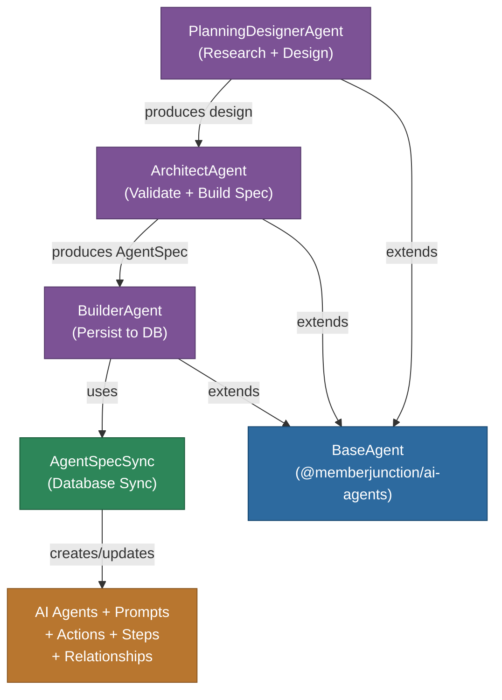
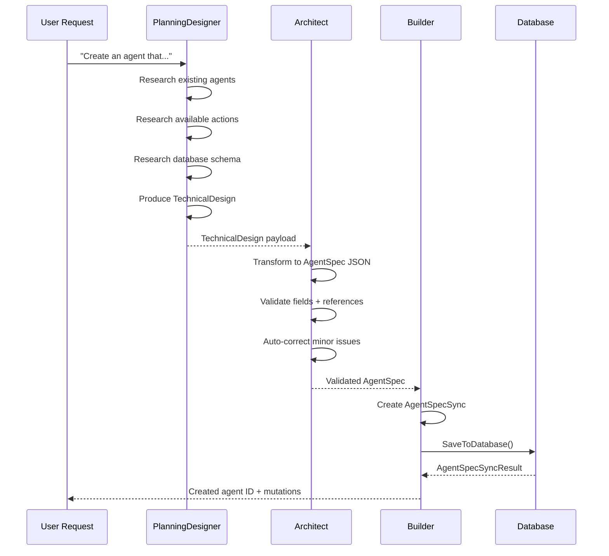

# @memberjunction/ai-agent-manager-core

Core package for the MemberJunction Agent Manager system -- a multi-agent pipeline that designs, validates, and persists new AI agents from natural language descriptions. This package contains three specialized agents and the AgentSpecSync utility for database persistence.

## Architecture



## Agent Pipeline



## Components

### PlanningDesignerAgent

Designs agent architectures by researching existing capabilities before producing a design. Overrides `validateSuccessNextStep` to enforce that required research actions are called before finalizing designs.

Key responsibilities:
- Force discovery of existing agents before selecting actions
- Force discovery of available actions before designing
- Force database schema research for CRUD operations
- Prevent hallucination of non-existent entities or actions
- Ensure designs are research-backed, not assumption-based

### ArchitectAgent

Transforms technical designs into validated AgentSpec JSON objects. Validates all references and auto-corrects minor issues before passing to the Builder.

Key responsibilities:
- Validate required fields (Name, TypeID, etc.)
- Verify action IDs exist in the database
- Verify prompt IDs exist if specified
- Validate SubAgent structure
- Auto-correct casing and missing optional fields
- Force retry with detailed errors if validation fails

### BuilderAgent

A code-based agent (overrides `executeAgentInternal` to bypass chat loop) that persists validated AgentSpecs to the database. Runs once and returns success or failure.

Key responsibilities:
- Receive validated AgentSpec from payload
- Create AgentSpecSync instance
- Persist all related records to database
- Track mutations in AI Agent Run Steps
- Return created agent ID or detailed error

### AgentSpecSync

Utility class for synchronizing AgentSpec objects with the database. Handles creation, updates, and deletion of all related records with diff-based orphan cleanup.

Key capabilities:
- Creates/updates AI Agent records
- Manages prompts and agent-prompt associations
- Manages action associations
- Manages sub-agent relationships via AI Agent Relationships
- Manages agent steps and step paths
- Performs topological sorting for dependency ordering
- Returns detailed mutation log (`AgentSpecSyncMutation[]`)

## Installation

```bash
npm install @memberjunction/ai-agent-manager-core
```

## Usage

### Using AgentSpecSync Directly

```typescript
import { AgentSpecSync } from '@memberjunction/ai-agent-manager-core';
import { AgentSpec } from '@memberjunction/ai-core-plus';

const spec: AgentSpec = {
    Name: 'My Custom Agent',
    TypeID: 'type-uuid-here',
    Description: 'An agent that processes customer feedback',
    Actions: [
        { ActionID: 'action-uuid-1' },
        { ActionID: 'action-uuid-2' }
    ],
    SubAgents: []
};

const sync = new AgentSpecSync(spec, contextUser);
sync.markDirty();

const result = await sync.SaveToDatabase();

if (result.success) {
    console.log('Agent created with ID:', result.agentId);
    for (const mutation of result.mutations) {
        console.log(`${mutation.Operation} ${mutation.Entity}: ${mutation.Description}`);
    }
}
```

## Key Types

| Type | Description |
|------|-------------|
| `AgentSpecSyncMutation` | Single database operation record (Entity, Operation, ID, Description) |
| `AgentSpecSyncResult` | Result with agentId, success flag, and mutations array |

## Class Registration

| Agent | Registration Key |
|-------|-----------------|
| PlanningDesignerAgent | `@RegisterClass(BaseAgent, 'AgentPlanningDesigner')` |
| AgentArchitectAgent | `@RegisterClass(BaseAgent, 'AgentArchitectAgent')` |
| AgentBuilderAgent | `@RegisterClass(BaseAgent, 'AgentBuilderAgent')` |

## Dependencies

- `@memberjunction/ai-agents` - BaseAgent, PayloadManager
- `@memberjunction/ai-core-plus` - AgentSpec, ExecuteAgentParams, extended entity types
- `@memberjunction/aiengine` - AIEngine for model resolution
- `@memberjunction/core` - Metadata, RunView, entity operations
- `@memberjunction/core-entities` - AI Agent, Step, Action, Relationship entities
- `@memberjunction/global` - Class registration via @RegisterClass
- `@memberjunction/templates` - TemplateEngineServer for prompt rendering
