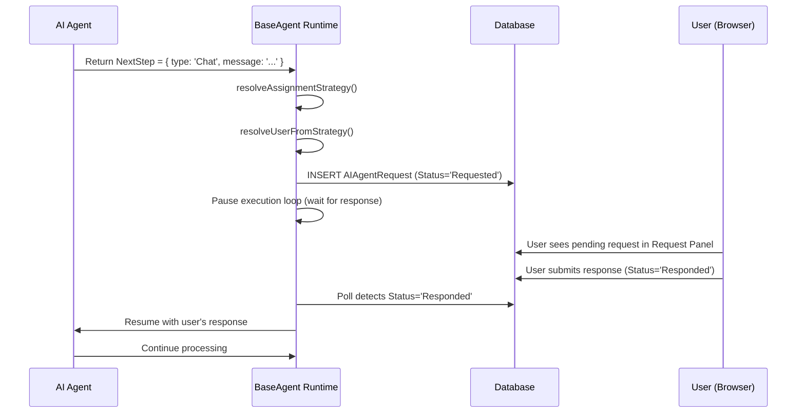
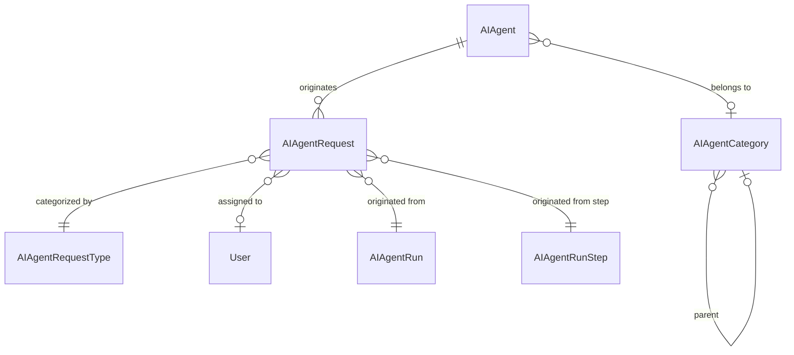
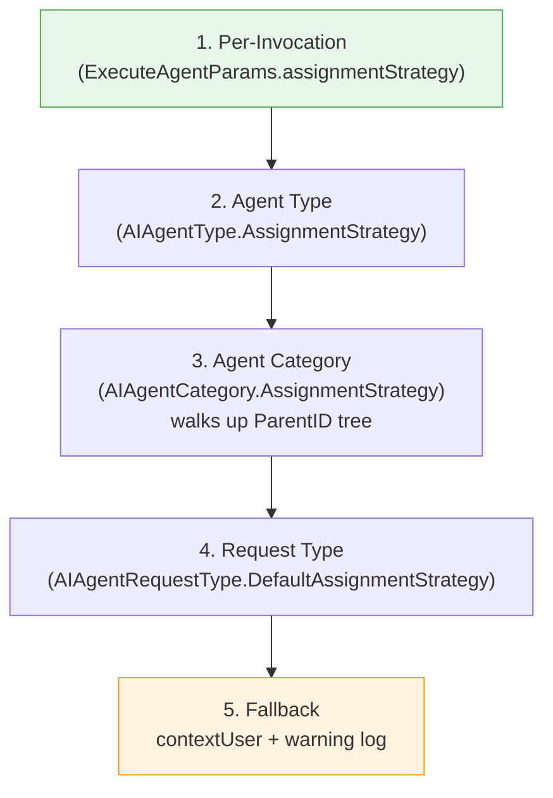
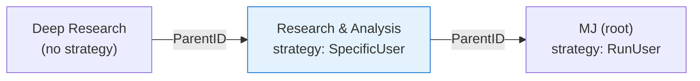
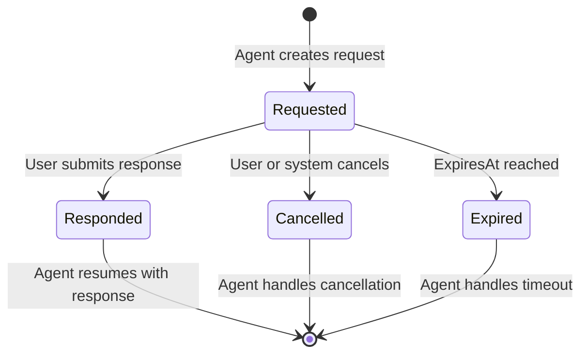

# Human-in-the-Loop (HITL) for MemberJunction AI Agents

## Overview

MemberJunction's agent framework supports **human-in-the-loop** workflows where running agents can pause execution, request feedback or approval from a human, and resume once a response is provided. This enables agents to handle tasks that require judgment, oversight, or domain-specific input that only a human can provide.

### Key Concepts

| Concept | Description |
|---------|-------------|
| **Feedback Request** | A persistent `AIAgentRequest` record created when an agent needs human input |
| **Request Type** | Categorizes the kind of input needed (e.g., Approval, Clarification, Data Input) |
| **Assignment Strategy** | Configurable routing rules that determine _who_ receives a request |
| **Response Schema** | Optional JSON schema describing the structured response the agent expects |
| **Agent Category** | Organizational grouping of agents; can carry default assignment strategies |

---

## Architecture

### How It Works



### Entity Relationship



---

## Creating a Feedback Request

When an agent needs human input, it returns a `Chat` step from its `DetermineNextStep()` method:

```typescript
protected async DetermineNextStep(params: ExecuteAgentParams): Promise<BaseAgentNextStep> {
    // Agent logic determines it needs human approval
    return {
        type: 'Chat',
        message: 'Should I proceed with sending 5,000 marketing emails to the selected segment?',
        responseForm: {
            type: 'object',
            properties: {
                approved: { type: 'boolean', title: 'Approve send?' },
                notes: { type: 'string', title: 'Additional instructions' }
            },
            required: ['approved']
        }
    };
}
```

The `BaseAgent` runtime intercepts this step and:

1. Resolves the **request type** (matching on the step's intent)
2. Resolves the **assignment strategy** (who should respond)
3. Creates an `AIAgentRequest` row in the database
4. Pauses the agent's execution loop
5. Waits for a response (polling or event-driven)

---

## Assignment Strategy

### Strategy Types

The `AgentRequestAssignmentStrategy` interface controls how requests are routed to users:

| Strategy | Behavior |
|----------|----------|
| `RunUser` | Assigns to the user who triggered the agent run (`contextUser`) |
| `AgentOwner` | Assigns to the agent's `OwnerUserID` |
| `SpecificUser` | Assigns to a hardcoded `userID` |
| `List` | Picks from an MJ List of Users (round-robin, least-busy, or random) |
| `SharedInbox` | Leaves unassigned; any member of a List can claim it |

### Configuration Levels

Strategies can be configured at multiple levels with a bottom-up, first-non-null-wins resolution:



### Strategy JSON Example

```json
{
    "type": "List",
    "listID": "8A3B2C1D-...",
    "listStrategy": "RoundRobin",
    "priority": 75,
    "expirationMinutes": 120
}
```

This JSON blob can be stored in:
- `AIAgentRequestType.DefaultAssignmentStrategy` (broadest default)
- `AIAgentCategory.AssignmentStrategy` (category-level)
- `AIAgentType.AssignmentStrategy` (agent-type-level)
- `ExecuteAgentParams.assignmentStrategy` (per-invocation, highest precedence)

### Category Hierarchy Walk

When resolving from the category level, the system walks up the `ParentID` tree:



In this example, an agent in "Deep Research" inherits the `SpecificUser` strategy from "Research & Analysis" because that's the first non-null strategy encountered walking up.

---

## Request Lifecycle



### Status Values

| Status | Description |
|--------|-------------|
| `Requested` | Waiting for user response |
| `Responded` | User has provided a response |
| `Cancelled` | Request was cancelled (by user or system) |
| `Expired` | Request timed out (`ExpiresAt` was reached) |

### Priority

Requests have a `Priority` field (1-100, lower = more urgent) that controls display ordering in the UI. Priority can be set via:
- The resolved assignment strategy's `priority` field
- The request type's `DefaultPriority`
- Default: 50

### Expiration

Optional. When `expirationMinutes` is set in the strategy, the request will have an `ExpiresAt` timestamp. The agent or a background process should handle expired requests gracefully.

---

## Request Types

Request types categorize the kind of human input needed. They are seeded via metadata files:

| Name | Description |
|------|-------------|
| **Approval** | Binary yes/no approval for an agent action |
| **Clarification** | Agent needs more information to proceed |
| **Data Input** | Agent needs structured data from the user |
| **Review** | Agent wants a human to review its output |
| **Error Resolution** | Agent encountered an error it cannot resolve |

Each request type can carry a `DefaultAssignmentStrategy` and `DefaultPriority`.

---

## Response Schemas

Agents can specify a `responseForm` (JSON Schema) describing the expected response structure. This enables the UI to render appropriate form controls:

```typescript
// Simple approval
responseForm: {
    type: 'object',
    properties: {
        approved: { type: 'boolean', title: 'Approve?' }
    },
    required: ['approved']
}

// Structured data input
responseForm: {
    type: 'object',
    properties: {
        selectedOption: {
            type: 'string',
            enum: ['Option A', 'Option B', 'Option C'],
            title: 'Choose an approach'
        },
        budget: { type: 'number', title: 'Budget limit ($)' },
        notes: { type: 'string', title: 'Additional notes' }
    },
    required: ['selectedOption']
}
```

When no `responseForm` is provided, the UI renders a free-text response field.

---

## UI Components

### Agent Request Panel

The `AgentRequestPanelComponent` (`@memberjunction/ng-agent-requests`) provides a slide-in panel for viewing and responding to requests:

- Displays request message, priority badge, and timestamps
- Renders dynamic form from `ResponseSchema` or free-text input
- Supports approve/reject/respond/reassign actions
- Shows request history and conversation context

### Request Dashboard

The `AgentRequestsResourceComponent` in the AI dashboard provides a centralized view of all pending requests with:

- Filtering by status, priority, agent, and request type
- Sorting by priority, date, or agent name
- Bulk operations (reassign, cancel)

---

## Agent Categories

Categories provide organizational grouping for agents with a hierarchical tree structure. They follow the same `ParentID` self-FK pattern used by other MJ entities (Action Categories, Prompt Categories, etc.).

### Default Categories

| Category | Parent | Description |
|----------|--------|-------------|
| MJ | _(root)_ | Root for all MemberJunction-shipped agents |
| Assistant | MJ | Conversational agents (Sage, Betty, Skip) |
| Research & Analysis | MJ | Data research and analytical agents |
| Content Creation | MJ | Code, visualization, and content generators |
| System | MJ | Internal infrastructure and maintenance agents |
| Platform Management | MJ | User onboarding and agent management |
| Demo | MJ | Reference implementation agents |

### Category-Level Assignment Strategies

A strategy set on a category applies to all agents in that category and its descendants (unless overridden at a lower level). This makes it easy to configure routing for entire groups of agents:

```json
// Set on "Research & Analysis" category:
// All research agents route requests to the data team lead
{
    "type": "SpecificUser",
    "userID": "DATA-TEAM-LEAD-UUID",
    "priority": 30
}
```

---

## Integration Guide

### For Agent Developers

1. **Return a `Chat` step** when you need human input
2. **Include a `responseForm`** (JSON Schema) for structured responses
3. **Handle the response** in your next `DetermineNextStep()` call
4. **Handle cancellation/expiration** gracefully

### For Platform Administrators

1. **Configure assignment strategies** at the appropriate level (request type, category, or agent type)
2. **Set up MJ Lists** for team-based routing (round-robin, shared inbox)
3. **Monitor request queues** via the Agent Requests dashboard
4. **Adjust priorities and expirations** to match your team's SLAs

### For UI Developers

1. **Use `AgentRequestPanelComponent`** to embed request handling in your views
2. **Listen for new requests** via the request polling mechanism
3. **Customize response forms** by extending the base panel component

---

## API Reference

### Key Types

```typescript
// packages/AI/CorePlus/src/assignment-strategy.ts
interface AgentRequestAssignmentStrategy {
    type: 'RunUser' | 'AgentOwner' | 'SpecificUser' | 'List' | 'SharedInbox';
    userID?: string;
    listID?: string;
    listStrategy?: 'RoundRobin' | 'LeastBusy' | 'Random';
    priority?: number;
    expirationMinutes?: number;
}

// Helper functions
function parseAssignmentStrategy(json: string | null): AgentRequestAssignmentStrategy | null;
function mergeAssignmentStrategies(base, override): AgentRequestAssignmentStrategy | null;
```

### Key Entities

| Entity | Description |
|--------|-------------|
| `MJ: AI Agent Requests` | Persistent feedback request records |
| `MJ: AI Agent Request Types` | Lookup table for request categorization |
| `MJ: AI Agent Categories` | Hierarchical agent grouping |
| `MJ: AI Agents` | Agent definitions (new `CategoryID` field) |
| `MJ: AI Agent Types` | Agent type definitions (new `AssignmentStrategy` field) |

---

## Future Enhancements

- **List-based resolution**: Full implementation of `RoundRobin`, `LeastBusy`, and `Random` assignment from MJ Lists
- **Real-time notifications**: WebSocket push for new requests (replacing polling)
- **Escalation rules**: Automatic re-routing when requests are not responded to within a time threshold
- **Delegation**: Allow assigned users to delegate requests to other users
- **Audit trail**: Detailed logging of assignment decisions and response history
