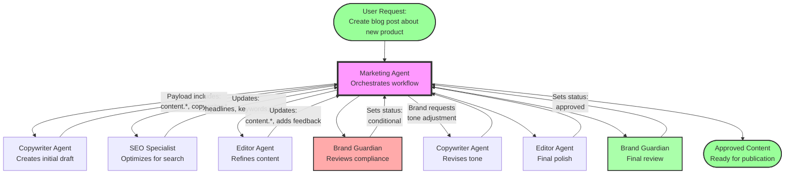
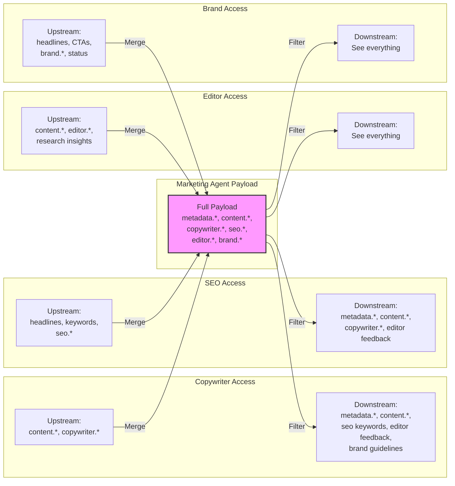

# Payload and State Management Guide

## Overview

The MemberJunction AI Agent framework provides a sophisticated payload management system that controls data flow between parent agents and their sub-agents. This system ensures efficient token usage, maintains data integrity, and provides fine-grained control over what information sub-agents can access and modify.

## Core Concepts

### Payload
The payload is a JSON object that represents the current state of an agent's execution. It flows through the agent hierarchy, carrying data, results, and context needed for decision-making and task completion.

### Payload Access Control
Each agent can define two sets of JSON paths:
1. **Downstream Paths** (`PayloadDownstreamPaths`): What data the agent sends to its sub-agents
2. **Upstream Paths** (`PayloadUpstreamPaths`): What data sub-agents are allowed to write back

## Configuration

### Database Fields
In the `AIAgent` table, configure access control using:
- `PayloadDownstreamPaths`: JSON array of paths to send downstream (default: `["*"]`)
- `PayloadUpstreamPaths`: JSON array of paths sub-agents can write (default: `["*"]`)

### Path Syntax

The system supports various path patterns:

#### 1. **Wildcard** - Full Access
```json
["*"]
```
Allows complete payload access (downstream) or modification rights (upstream).

#### 2. **Exact Paths**
```json
["customer.name", "order.id", "analysis.status"]
```
Grants access to specific fields only.

#### 3. **Object Wildcards**
```json
["customer.*", "order.items.*"]
```
Allows all properties under a specific object.

#### 4. **Array Access**
```json
["items[0]", "items[*].price", "customers[*].orders[*]"]
```
- Specific index: `items[0]`
- All array elements: `items[*]`
- Nested arrays: `customers[*].orders[*]`

#### 5. **Deep Wildcards**
```json
["**.id", "**.status"]
```
Matches properties at any depth in the object tree.

## Examples

### Basic Access Control
```json
// Agent configuration
{
  "PayloadDownstreamPaths": ["customer.id", "order.*"],
  "PayloadUpstreamPaths": ["analysis.results", "recommendations"]
}
```

### Using Wildcards
```json
{
  "PayloadDownstreamPaths": ["config.*", "data.customers[*].id"],
  "PayloadUpstreamPaths": ["results.**"]
}
```

## Real-World Example: Marketing Agent System

The Marketing Agent system demonstrates sophisticated payload management in a collaborative multi-agent workflow. This example shows how agents work together iteratively, like a human marketing team.

### System Overview

The Marketing Agent orchestrates content creation through five specialized sub-agents:
- **Copywriter Specialist**: Creates initial content and refines based on feedback
- **SEO/AIEO Specialist**: Optimizes for search engines and AI discovery
- **Editor**: Ensures quality, clarity, and consistency
- **Brand Guardian**: Enforces brand guidelines and compliance
- **Publisher**: Handles distribution (future implementation)

### Key Design Principles

1. **Root Agent Omniscience**: The Marketing Agent (root) doesn't need path restrictions - it has full access to all payload data by default
2. **Generous Downstream Sharing**: Sub-agents see each other's work to enable collaboration
3. **Controlled Upstream Writing**: Sub-agents can only modify specific sections while preserving others' work
4. **Iterative Workflow**: Supports back-and-forth refinement between specialists

### Payload Structure

```typescript
interface MarketingAgentOutput {
  metadata: {
    sessionId: string;
    status: 'draft' | 'in_review' | 'approved' | 'published';
    lastModifiedBy?: string;
    originalBrief: string;
    contentType?: 'email' | 'blog_post' | 'social_media' | etc;
  };
  
  content: {
    headline?: string;
    alternativeHeadlines?: string[];
    body?: string;
    callToAction?: string;
    keyPoints?: string[];
  };
  
  copywriter?: {
    initialDraft?: string;
    creativeApproach?: string;
    toneOfVoice?: string;
    // ... other copywriter-specific fields
  };
  
  seo?: {
    primaryKeyword?: string;
    metaTitle?: string;
    metaDescription?: string;
    // ... other SEO fields
  };
  
  editor?: {
    corrections?: Array<{type: string; original: string; corrected: string}>;
    feedback?: string[];
    suggestions?: string[];
    // ... other editor fields
  };
  
  brand?: {
    alignmentScore?: number;
    approvalStatus?: 'approved' | 'conditional' | 'rejected';
    // ... other brand fields
  };
  
  iterations?: Array<{iteration: number; agent: string; changes: string}>;
}
```

### Sub-Agent Configurations

#### Copywriter Specialist
```json
{
  "PayloadDownstreamPaths": [
    "metadata.*",              // Full task context
    "content.*",               // All content to work with
    "copywriter.*",            // Own previous work
    "seo.primaryKeyword",      // SEO targets to write for
    "seo.secondaryKeywords",
    "editor.feedback",         // Editor's revision requests
    "editor.suggestions",
    "brand.voiceConsistency",  // Brand guidelines
    "brand.messagingPillars",
    "iterations.*"             // Full history for context
  ],
  "PayloadUpstreamPaths": [
    "content.*",               // Can create/modify all content
    "copywriter.*",            // Own section
    "metadata.lastModifiedBy",
    "metadata.updatedAt"
  ]
}
```

**Workflow Example**: The copywriter receives the original brief, sees SEO keywords to target, and creates initial content. Later, when the editor provides feedback, the copywriter can see it and revise the content accordingly.

#### SEO/AIEO Specialist
```json
{
  "PayloadDownstreamPaths": [
    "metadata.*",
    "content.*",               // Content to optimize
    "copywriter.*",            // Understanding creative intent
    "seo.*",                   // Own previous work
    "editor.feedback",         // May affect SEO approach
    "brand.messagingPillars",  // Brand keywords to incorporate
    "iterations.*"
  ],
  "PayloadUpstreamPaths": [
    "content.headline",        // Can suggest better headlines
    "content.alternativeHeadlines",
    "content.keyPoints",       // Can restructure for SEO
    "seo.*",                   // Own section
    "metadata.lastModifiedBy",
    "metadata.updatedAt"
  ]
}
```

**Workflow Example**: The SEO specialist sees the copywriter's creative approach and can suggest headline variations that maintain the creative intent while improving search visibility.

#### Editor
```json
{
  "PayloadDownstreamPaths": [
    "metadata.*",
    "content.*",               // All content to edit
    "copywriter.*",            // Creative intent understanding
    "seo.*",                   // SEO requirements to maintain
    "editor.*",                // Own previous work
    "brand.*",                 // Brand guidelines to enforce
    "iterations.*"
  ],
  "PayloadUpstreamPaths": [
    "content.*",               // Full editing capabilities
    "editor.*",                // Own section
    "copywriter.researchInsights",  // Can add fact-checking notes
    "seo.metaDescription",     // Can refine meta content
    "metadata.lastModifiedBy",
    "metadata.updatedAt"
  ]
}
```

**Workflow Example**: The editor can see both the creative approach and SEO requirements, ensuring edits maintain both creative quality and search optimization.

#### Brand Guardian
```json
{
  "PayloadDownstreamPaths": [
    "metadata.*",
    "content.*",               // Final content review
    "copywriter.*",            // Assess creative alignment
    "seo.*",                   // Check SEO compliance
    "editor.*",                // Review all changes
    "brand.*",                 // Own assessments
    "iterations.*"
  ],
  "PayloadUpstreamPaths": [
    "content.headline",        // Can mandate brand-compliant headlines
    "content.callToAction",    // Ensure CTAs align with brand
    "brand.*",                 // Own section
    "metadata.status",         // Can approve/reject
    "metadata.lastModifiedBy",
    "metadata.updatedAt"
  ]
}
```

**Workflow Example**: The brand guardian reviews all specialists' work and can make final adjustments to ensure brand compliance, potentially sending work back for revision.

### Iteration Flow Example



1. **Initial Brief**: Marketing Agent receives request for blog post about new product
2. **First Pass**: Copywriter creates initial draft focusing on benefits
3. **SEO Review**: SEO specialist suggests headline changes and adds keywords
4. **Editorial Pass**: Editor improves clarity, fixes grammar, suggests restructuring
5. **Brand Check**: Brand guardian notes tone is too casual, requests revision
6. **Copywriter Revision**: Copywriter adjusts tone while maintaining SEO keywords
7. **Final Editorial**: Editor does final polish
8. **Brand Approval**: Brand guardian approves for publication

Throughout this process:
- Each agent can see relevant work from others
- The payload accumulates improvements without losing context
- The Marketing Agent orchestrates the flow based on task needs
- Iterations are tracked for full transparency

### Payload Flow Visualization



### Benefits of This Approach

1. **Collaborative Efficiency**: Agents see each other's work, reducing miscommunication
2. **Iterative Refinement**: Supports non-linear workflows and back-and-forth collaboration
3. **Preserved Context**: Important information isn't lost between handoffs
4. **Flexible Orchestration**: The Loop Agent Type can adapt flow based on content needs
5. **Quality Control**: Multiple specialists can catch and fix different types of issues

## How It Works

### 1. **Downstream Flow** (Parent → Sub-agent)
When a parent agent invokes a sub-agent:
1. The system reads the sub-agent's `PayloadDownstreamPaths`
2. Extracts only the specified paths from the parent's payload
3. Sends the filtered payload to the sub-agent

### 2. **Upstream Flow** (Sub-agent → Parent)
When a sub-agent completes:
1. The system reads the sub-agent's `PayloadUpstreamPaths`
2. Compares the sub-agent's returned payload with allowed paths
3. Merges only authorized changes back into the parent's payload
4. Logs warnings for unauthorized write attempts (but continues execution)

### 3. **Deep Hierarchy**
For agents beyond the second level:
- Can only access data their immediate parent has access to
- Must still specify explicit paths relative to the root payload
- Access is the intersection of their paths and their parent's access

## Best Practices

### 1. **Principle of Least Privilege**
Only grant access to data that sub-agents actually need:
```json
// ❌ Too permissive
["*"]

// ✅ Specific access
["customer.id", "customer.industry", "analysis.market_research"]
```

### 2. **Structured Payload Design**
Organize your payload with clear boundaries:
```json
{
  "input": {           // Read-only data from user
    "requirements": {},
    "constraints": {}
  },
  "working": {         // Shared working space
    "analysis": {},
    "calculations": {}
  },
  "output": {          // Final results
    "recommendations": {},
    "report": {}
  }
}
```

### 3. **Downstream vs Upstream Symmetry**
Consider whether downstream paths should match upstream paths:
```json
// Asymmetric (common pattern)
{
  "PayloadDownstreamPaths": ["customer.*", "analysis.*"],  // Read more
  "PayloadUpstreamPaths": ["analysis.results"]             // Write less
}

// Symmetric (for peer agents)
{
  "PayloadDownstreamPaths": ["shared.*"],
  "PayloadUpstreamPaths": ["shared.*"]
}
```

### 4. **Documentation**
Document your payload structure and access patterns:
```typescript
interface MarketingPayload {
  campaign: {
    id: string;          // Read-only for all sub-agents
    budget: number;      // Writable by: BudgetAnalyzer
    // ... etc
  };
}
```

## Debugging

### Enable Verbose Logging
The PayloadManager logs warnings when sub-agents attempt unauthorized writes:
```
Warning: Sub-agent attempted to write to unauthorized path: campaign.budget
```

### Trace Payload Flow
To debug payload transformations:
1. Log the filtered downstream payload before sending
2. Log the returned payload from sub-agents
3. Log the merged result after applying upstream rules

### Common Issues

#### 1. **Sub-agent Not Receiving Expected Data**
- Check the sub-agent's `PayloadDownstreamPaths`
- Verify the path syntax is correct
- Ensure parent has the data in its payload

#### 2. **Sub-agent Changes Not Persisting**
- Check the sub-agent's `PayloadUpstreamPaths`
- Verify the sub-agent is setting the correct paths
- Look for warning logs about unauthorized writes

#### 3. **JSON Parse Errors**
- Ensure paths arrays are valid JSON
- Use JSON array syntax: `["path1", "path2"]`
- Escape special characters properly

## Advanced Patterns

### 1. **Conditional Access**
Use wildcards for dynamic structures:
```json
["responses.*.content", "responses.*.metadata.public"]
```

### 2. **Hierarchical Permissions**
Design paths that naturally support delegation:
```json
{
  "team": {
    "marketing": { "campaigns": {}, "budget": {} },
    "sales": { "leads": {}, "opportunities": {} }
  }
}
// Marketing agent: ["team.marketing.*"]
// Sales agent: ["team.sales.*"]
```

### 3. **Versioned Payloads**
Include version info for backward compatibility:
```json
{
  "version": "1.0",
  "data": { /* actual payload */ }
}
```

## Performance Considerations

### Token Efficiency
Restricting downstream paths reduces token usage in prompts:
- Full payload: 5,000 tokens
- Filtered payload: 500 tokens (90% reduction)

### Processing Overhead
The PayloadManager uses efficient algorithms:
- Path extraction: O(n) where n is number of paths
- Merge operations: O(m) where m is number of changes
- Minimal performance impact even with complex payloads

## Security Considerations

### Data Isolation
- Sub-agents cannot access data outside their allowed paths
- Prevents accidental exposure of sensitive information
- Maintains clear boundaries between agent responsibilities

### Audit Trail
- All unauthorized write attempts are logged
- Execution trees show exact payload transformations
- Complete traceability for compliance needs

## Integration with Agent Types

Different agent types can implement custom payload handling:

### LoopAgentType
Uses payload to maintain state across iterations:
```typescript
// Injects previous iteration's payload
prompt.data[LoopAgentType.CURRENT_PAYLOAD_PLACEHOLDER] = payload;
```

### Custom Agent Types
Can override payload injection/extraction methods:
```typescript
class CustomAgentType extends BaseAgentType {
  async InjectPayload<T>(payload: T, prompt: AIPromptParams): Promise<void> {
    // Custom injection logic
  }
  
  async RetrievePayload<T>(promptResult: AIPromptRunResult): Promise<T> {
    // Custom extraction logic
  }
}
```

## Future Enhancements

1. **Path Transformations**: Allow renaming paths between layers
2. **Conditional Paths**: Grant access based on payload values
3. **Path Templates**: Reusable path configurations
4. **Runtime Path Validation**: Validate paths exist before execution
5. **Path Aliases**: Simplify complex path specifications

## Conclusion

The payload management system provides powerful capabilities for controlling data flow in agent hierarchies. By carefully designing payload structures and access patterns, you can build efficient, secure, and maintainable multi-agent systems that minimize token usage while maximizing agent autonomy and capability.