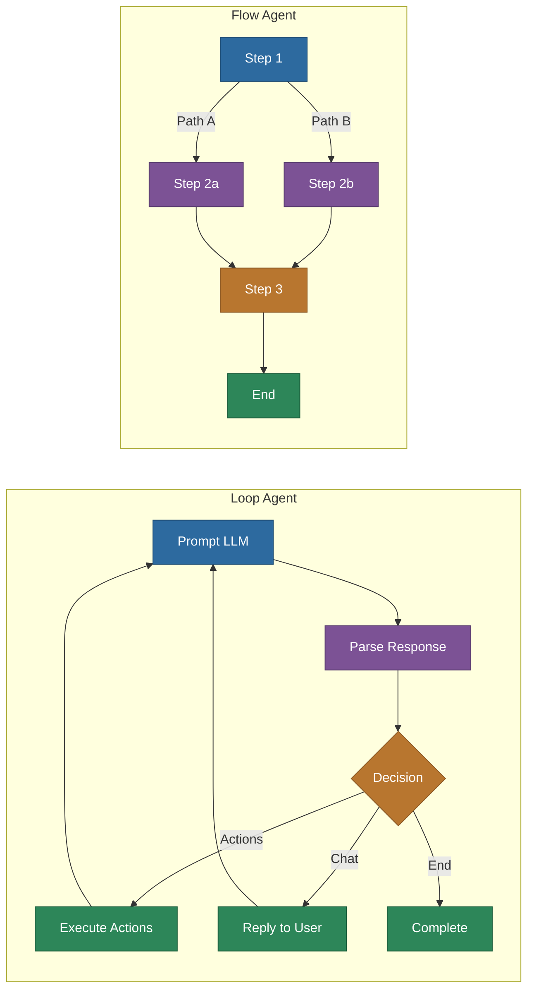

# @memberjunction/ai-agents

Complete framework for building and executing AI agents in MemberJunction. Provides the `BaseAgent` execution engine, pluggable agent type system (Loop and Flow agents), hierarchical sub-agent orchestration, action execution, memory management with notes and examples, payload management, conversation context with message lifecycle management, and reranker integration.

## Architecture

```mermaid
graph TD
    subgraph "@memberjunction/ai-agents"
        BA["BaseAgent<br/>Core Execution Engine"]
        style BA fill:#2d8659,stroke:#1a5c3a,color:#fff

        AR["AgentRunner<br/>Orchestration Entry Point"]
        style AR fill:#2d8659,stroke:#1a5c3a,color:#fff

        subgraph "Agent Types"
            BAT["BaseAgentType"]
            style BAT fill:#7c5295,stroke:#563a6b,color:#fff
            LAT["LoopAgentType"]
            style LAT fill:#7c5295,stroke:#563a6b,color:#fff
            FAT["FlowAgentType"]
            style FAT fill:#7c5295,stroke:#563a6b,color:#fff
        end

        subgraph "Support Systems"
            PM["PayloadManager<br/>Data Flow Between Steps"]
            style PM fill:#b8762f,stroke:#8a5722,color:#fff
            PCA["PayloadChangeAnalyzer"]
            style PCA fill:#b8762f,stroke:#8a5722,color:#fff
            PFM["PayloadFeedbackManager"]
            style PFM fill:#b8762f,stroke:#8a5722,color:#fff
            ACI["AgentContextInjector<br/>Notes, Examples, Data Sources"]
            style ACI fill:#b8762f,stroke:#8a5722,color:#fff
            ADP["AgentDataPreloader<br/>Batch Metadata Loading"]
            style ADP fill:#b8762f,stroke:#8a5722,color:#fff
            MMA["MemoryManagerAgent<br/>Note/Example Management"]
            style MMA fill:#b8762f,stroke:#8a5722,color:#fff
        end
    end

    BA --> BAT
    BA --> PM
    BA --> ACI
    BA --> ADP
    AR --> BA

    subgraph Dependencies
        AIP["@memberjunction/ai-prompts<br/>AIPromptRunner"]
        style AIP fill:#2d6a9f,stroke:#1a4971,color:#fff

        AIE["@memberjunction/aiengine<br/>AIEngine"]
        style AIE fill:#2d6a9f,stroke:#1a4971,color:#fff

        ACT["@memberjunction/actions<br/>ActionEngineServer"]
        style ACT fill:#2d6a9f,stroke:#1a4971,color:#fff

        RR["@memberjunction/ai-reranker<br/>RerankerService"]
        style RR fill:#2d6a9f,stroke:#1a4971,color:#fff
    end

    AIP --> BA
    AIE --> BA
    ACT --> BA
    RR --> BA
```



## Installation

```bash
npm install @memberjunction/ai-agents
```

## Key Components

### BaseAgent

The core execution engine that all agents use. Handles:

- Hierarchical prompt execution (agent type's system prompt as parent, agent's prompts as children)
- Action execution through the MJ Actions framework
- Sub-agent orchestration with full context propagation
- Conversation context management with automatic message compaction
- Memory retrieval (notes and examples) with optional reranking
- Payload data management across execution steps
- ForEach and While loop operations
- Comprehensive execution tracking (AIAgentRun, AIAgentRunStep records)

### AgentRunner

High-level entry point for agent execution. Provides:

- Agent resolution by ID or entity reference
- Permission checking before execution
- Data preloading for performance
- Simplified execution interface

```typescript
import { AgentRunner } from '@memberjunction/ai-agents';

const runner = new AgentRunner();
const result = await runner.ExecuteAgent({
    agentId: 'agent-uuid',
    conversationMessages: [{ role: 'user', content: 'Analyze Q3 sales trends' }],
    contextUser: currentUser,
    onProgress: (step) => console.log(`${step.step}: ${step.message}`)
});
```

### Agent Type System

Agents execute using a pluggable type system. The type determines how the agent decides its next action after each LLM call.

#### BaseAgentType

Abstract base that all agent types extend. Defines the `DetermineNextStep()` interface that produces a `BaseAgentNextStep` decision:

| Step | Description |
|---|---|
| `Chat` | Send a message back to the user |
| `Actions` | Execute one or more actions |
| `SubAgents` | Delegate to sub-agents |
| `MoreInfo` | Ask the user for additional information |
| `Retry` | Retry the current step (e.g., after validation failure) |
| `End` | Complete execution |
| `ForEach` | Iterate over a collection |
| `While` | Loop while a condition is true |

#### LoopAgentType

Conversational agent that runs in a loop: prompt -> decide -> act -> repeat. Best for interactive, chat-based agents. The LLM decides the next step at each iteration by producing a structured JSON response.

#### FlowAgentType

Step-based agent that follows a predefined flow graph. Each step has explicit paths to the next step based on conditions. Best for deterministic workflows where the execution path is known in advance.



### PayloadManager

Manages data flow through agent execution:

- Stores key-value data accessible across all steps and sub-agents
- Supports typed payload changes requested by the LLM
- Validates and applies changes through PayloadChangeAnalyzer
- Provides feedback to the LLM about successful/failed changes via PayloadFeedbackManager

```typescript
const manager = new PayloadManager();
manager.Set('customerData', { name: 'Acme', revenue: 1000000 });
const data = manager.Get('customerData');
```

### AgentContextInjector

Injects contextual information into agent prompts:

- Retrieves relevant notes via vector similarity search
- Retrieves relevant examples for few-shot learning
- Injects data source content
- Applies reranking when configured

### AgentDataPreloader

Optimizes agent startup by batch-loading all required metadata in parallel:

- Agent entity with all relationships
- Actions and their parameters
- Sub-agent data
- Prompt configurations

### MemoryManagerAgent

Handles persistent memory operations for agents:

- Creating and updating agent notes
- Managing agent examples
- Scoped memory for multi-tenant deployments (UserScope support)

## Usage

### Basic Agent Execution

```typescript
import { AgentRunner } from '@memberjunction/ai-agents';
import { ExecuteAgentParams } from '@memberjunction/ai-core-plus';

const runner = new AgentRunner();
const result = await runner.ExecuteAgent({
    agentId: 'my-agent-id',
    conversationMessages: [
        { role: 'user', content: 'What are the top 5 customers by revenue?' }
    ],
    contextUser: currentUser
});

if (result.success) {
    console.log(result.outputMessages);
}
```

### With Sub-Agent Orchestration

Sub-agents are automatically discovered from the agent's relationships and invoked when the LLM requests delegation:

```typescript
const result = await runner.ExecuteAgent({
    agentId: 'orchestrator-agent-id',
    conversationMessages: messages,
    contextUser: currentUser,
    onProgress: (step) => {
        // Track execution across agent hierarchy
        console.log(`[${step.agentName}] ${step.message}`);
    }
});
```

### With Runtime Action Changes

```typescript
const result = await runner.ExecuteAgent({
    agentId: 'my-agent-id',
    conversationMessages: messages,
    contextUser: currentUser,
    actionChanges: [
        { scope: 'global', mode: 'add', actionIds: ['crm-search-id'] },
        { scope: 'all-subagents', mode: 'remove', actionIds: ['delete-record-id'] }
    ]
});
```

### With User Scope (Multi-Tenant)

```typescript
const result = await runner.ExecuteAgent({
    agentId: 'my-agent-id',
    conversationMessages: messages,
    contextUser: currentUser,
    userScope: {
        primaryEntityName: 'Organizations',
        primaryRecordId: orgId,
        secondary: { TeamID: teamId }
    }
});
```

### With Message Lifecycle Management

```typescript
const result = await runner.ExecuteAgent({
    agentId: 'my-agent-id',
    conversationMessages: messages,
    contextUser: currentUser,
    messageExpirationOverride: {
        expirationTurns: 3,
        expirationMode: 'Compact',
        compactMode: 'First N Chars',
        compactLength: 500
    },
    onMessageLifecycle: (event) => {
        console.log(`${event.type}: ${event.reason} (saved ${event.tokensSaved} tokens)`);
    }
});
```

## Architecture Documentation

For multi-tenant memory scoping (notes/examples), see [AGENT_MEMORY_SCOPING.md](./AGENT_MEMORY_SCOPING.md).

## Re-exports

For backward compatibility, this package re-exports the following from `@memberjunction/ai-reranker`:

- `RerankerService`
- `RerankerConfiguration`
- `parseRerankerConfiguration`
- `RerankServiceResult`
- `RerankObservabilityOptions`
- `LLMReranker`

New code should import these directly from `@memberjunction/ai-reranker`.

## Dependencies

- `@memberjunction/ai-prompts` -- AIPromptRunner for prompt execution
- `@memberjunction/aiengine` -- AIEngine for metadata and vector search
- `@memberjunction/ai-core-plus` -- Shared types (ExecuteAgentParams, ExecuteAgentResult)
- `@memberjunction/ai-engine-base` -- Base metadata cache and permissions
- `@memberjunction/ai` -- Core AI abstractions
- `@memberjunction/ai-reranker` -- Two-stage retrieval reranking
- `@memberjunction/actions` -- Server-side action execution
- `@memberjunction/actions-base` -- Action framework base types
- `@memberjunction/core` -- MJ framework core
- `@memberjunction/core-entities` -- Generated entity classes
- `@memberjunction/global` -- Class factory and utilities
- `lodash` -- Utility functions
