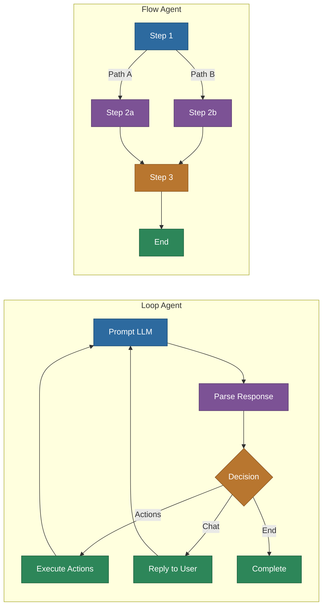

# @memberjunction/ai-agents

Complete framework for building and executing AI agents in MemberJunction. Provides the `BaseAgent` execution engine, pluggable agent type system (Loop and Flow agents), hierarchical sub-agent orchestration, action execution, memory management with notes and examples, payload management, conversation context with message lifecycle management, and reranker integration.

## Architecture


```mermaid
graph TD
    subgraph "@memberjunction/ai-agents"
        BA["BaseAgent<br/>Core Execution Engine"]
        style BA fill:#2d8659,stroke:#1a5c3a,color:#fff

        AR["AgentRunner<br/>Orchestration Entry Point"]
        style AR fill:#2d8659,stroke:#1a5c3a,color:#fff

        subgraph "Agent Types"
            BAT["BaseAgentType"]
            style BAT fill:#7c5295,stroke:#563a6b,color:#fff
            LAT["LoopAgentType"]
            style LAT fill:#7c5295,stroke:#563a6b,color:#fff
            FAT["FlowAgentType"]
            style FAT fill:#7c5295,stroke:#563a6b,color:#fff
        end

        subgraph "Support Systems"
            PM["PayloadManager<br/>Data Flow Between Steps"]
            style PM fill:#b8762f,stroke:#8a5722,color:#fff
            PCA["PayloadChangeAnalyzer"]
            style PCA fill:#b8762f,stroke:#8a5722,color:#fff
            PFM["PayloadFeedbackManager"]
            style PFM fill:#b8762f,stroke:#8a5722,color:#fff
            ACI["AgentContextInjector<br/>Notes, Examples, Data Sources"]
            style ACI fill:#b8762f,stroke:#8a5722,color:#fff
            ADP["AgentDataPreloader<br/>Batch Metadata Loading"]
            style ADP fill:#b8762f,stroke:#8a5722,color:#fff
            MMA["MemoryManagerAgent<br/>Note/Example Management"]
            style MMA fill:#b8762f,stroke:#8a5722,color:#fff
        end
    end

    BA --> BAT
    BA --> PM
    BA --> ACI
    BA --> ADP
    AR --> BA

    subgraph Dependencies
        AIP["@memberjunction/ai-prompts<br/>AIPromptRunner"]
        style AIP fill:#2d6a9f,stroke:#1a4971,color:#fff

        AIE["@memberjunction/aiengine<br/>AIEngine"]
        style AIE fill:#2d6a9f,stroke:#1a4971,color:#fff

        ACT["@memberjunction/actions<br/>ActionEngineServer"]
        style ACT fill:#2d6a9f,stroke:#1a4971,color:#fff

        RR["@memberjunction/ai-reranker<br/>RerankerService"]
        style RR fill:#2d6a9f,stroke:#1a4971,color:#fff
    end

    AIP --> BA
    AIE --> BA
    ACT --> BA
    RR --> BA
```

## Installation

```bash
npm install @memberjunction/ai-agents
```

## Key Components

### BaseAgent

The core execution engine that all agents use. Handles:

- Hierarchical prompt execution (agent type's system prompt as parent, agent's prompts as children)
- Action execution through the MJ Actions framework
- **Client tool invocation** for browser-side UI operations (navigate to records, switch tabs, show search results) via PubSub round-trip
- Sub-agent orchestration with full context propagation
- Conversation context management with automatic message compaction
- Memory retrieval (notes and examples) with optional reranking
- Payload data management across execution steps
- ForEach and While loop operations
- Comprehensive execution tracking (AIAgentRun, AIAgentRunStep records)

### AgentRunner

High-level entry point for agent execution. Provides:

- Agent resolution by ID or entity reference
- Permission checking before execution
- Data preloading for performance
- Simplified execution interface

```typescript
import { AgentRunner } from '@memberjunction/ai-agents';

const runner = new AgentRunner();
const result = await runner.ExecuteAgent({
    agentId: 'agent-uuid',
    conversationMessages: [{ role: 'user', content: 'Analyze Q3 sales trends' }],
    contextUser: currentUser,
    onProgress: (step) => console.log(`${step.step}: ${step.message}`)
});
```

### Agent Type System

Agents execute using a pluggable type system. The type determines how the agent decides its next action after each LLM call.

#### BaseAgentType

Abstract base that all agent types extend. Defines the `DetermineNextStep()` interface that produces a `BaseAgentNextStep` decision:

| Step | Description |
|---|---|
| `Chat` | Send a message back to the user |
| `Actions` | Execute one or more server-side actions |
| `ClientTools` | Invoke browser-side tools (navigate, switch tabs, show results) |
| `SubAgents` | Delegate to sub-agents |
| `MoreInfo` | Ask the user for additional information |
| `Retry` | Retry the current step (e.g., after validation failure) |
| `End` | Complete execution |
| `ForEach` | Iterate over a collection |
| `While` | Loop while a condition is true |

#### LoopAgentType

Conversational agent that runs in a loop: prompt -> decide -> act -> repeat. Best for interactive, chat-based agents. The LLM decides the next step at each iteration by producing a structured JSON response.

#### FlowAgentType

Step-based agent that follows a predefined flow graph. Each step has explicit paths to the next step based on conditions. Best for deterministic workflows where the execution path is known in advance.


```mermaid
graph LR
    subgraph "Loop Agent"
        L1["Prompt LLM"] --> L2["Parse Response"]
        L2 --> L3{Decision}
        L3 -->|"Actions"| L4["Execute Actions"]
        L4 --> L1
        L3 -->|"Chat"| L5["Reply to User"]
        L5 --> L1
        L3 -->|"End"| L6["Complete"]
    end

    subgraph "Flow Agent"
        F1["Step 1"] -->|"Path A"| F2["Step 2a"]
        F1 -->|"Path B"| F3["Step 2b"]
        F2 --> F4["Step 3"]
        F3 --> F4
        F4 --> F5["End"]
    end

    style L1 fill:#2d6a9f,stroke:#1a4971,color:#fff
    style L2 fill:#7c5295,stroke:#563a6b,color:#fff
    style L3 fill:#b8762f,stroke:#8a5722,color:#fff
    style L4 fill:#2d8659,stroke:#1a5c3a,color:#fff
    style L5 fill:#2d8659,stroke:#1a5c3a,color:#fff
    style L6 fill:#2d8659,stroke:#1a5c3a,color:#fff

    style F1 fill:#2d6a9f,stroke:#1a4971,color:#fff
    style F2 fill:#7c5295,stroke:#563a6b,color:#fff
    style F3 fill:#7c5295,stroke:#563a6b,color:#fff
    style F4 fill:#b8762f,stroke:#8a5722,color:#fff
    style F5 fill:#2d8659,stroke:#1a5c3a,color:#fff
```

### PayloadManager

Manages data flow through agent execution:

- Stores key-value data accessible across all steps and sub-agents
- Supports typed payload changes requested by the LLM
- Validates and applies changes through PayloadChangeAnalyzer
- Provides feedback to the LLM about successful/failed changes via PayloadFeedbackManager

```typescript
const manager = new PayloadManager();
manager.Set('customerData', { name: 'Acme', revenue: 1000000 });
const data = manager.Get('customerData');
```

### AgentContextInjector

Injects contextual information into agent prompts:

- Retrieves relevant notes via vector similarity search
- Retrieves relevant examples for few-shot learning
- Injects data source content
- Applies reranking when configured

### AgentDataPreloader

Optimizes agent startup by batch-loading all required metadata in parallel:

- Agent entity with all relationships
- Actions and their parameters
- Sub-agent data
- Prompt configurations

### MemoryManagerAgent

Handles persistent memory operations for agents:

- Creating and updating agent notes
- Managing agent examples
- Scoped memory for multi-tenant deployments (UserScope support)
- Consolidation, decay, and protection-tier maintenance over the agent note pool (see below)

#### Consolidation Pipeline

When invoked in maintenance mode, MemoryManagerAgent runs an end-to-end pipeline over the agent's notes to keep the memory pool useful and bounded over time. The pipeline is a sequence of phases on the run, each emitting its own observability data.

- **Clustering** — groups semantically similar notes by cosine similarity. The clustering threshold is `0.60` (intentionally broad — the LLM is the final arbiter for ambiguous clusters during the consolidate phase).
- **Cluster splitting** — `splitOversizedCluster` breaks any cluster larger than 7 notes so the consolidation prompt stays focused.
- **Drift prevention** — `maxConsolidationCount = 3` caps the number of times any one note can be folded into successor consolidations. When a cluster reaches the cap, anchored-mode drilling resolves the original sources via `DerivedFromNoteIDs` so consolidation operates on the underlying facts rather than re-summarizing summaries.
- **Consolidate** — the LLM generates a merged note for each cluster. The pipeline records `DerivedFromNoteIDs`, increments `ConsolidationCount`, and revokes source notes with `ConsolidatedIntoNoteID` back-links to preserve provenance.
- **Verify Consolidation Output** — post-check phase (`verifyConsolidationOutput`) confirms entity-attribute coverage hasn't been lost in the merge; reports `entitiesChecked` and `entitiesMissing`.
- **Contradiction detection** — extracts entity-attribute-value triples across active notes, flags conflicting values, and resolves contradictions by revoking the older or lower-importance side.
- **Ebbinghaus decay archival** — applies a forgetting curve to the importance score over time; low-importance notes that haven't been retrieved are archived. `ProtectionTier` modulates the decay rate.
- **Protection tiers** — `Immutable` / `Protected` / `Standard` / `Ephemeral`. Immutable notes are never modified; Protected notes are excluded from consolidation but still age normally; Ephemeral notes decay faster.
- **Outlier auto-promotion** — notes whose semantic uniqueness lands in the 95th percentile are auto-promoted to `Protected` so they aren't swallowed by future consolidations.

The pipeline emits two new run-step types for observability:

- `Process Consolidation Cluster` — one child step per cluster, with `clusterSize`, `noteIds`, `shouldConsolidate`, `consolidatedNoteId`, `sourceNotesArchived`, `verificationPassed`, `entitiesChecked`, `entitiesMissing`.
- `Verify Consolidation Output` — phase-level step covering the post-consolidation verification pass.

Run-level payload fields added: `scoreDistribution`, `entityTriplesExtracted`, `decayScoreDistribution`, `protectedPreserved`, `ephemeralAccelerated`, and consolidation `triggerType` (one of `forced` / `time` / `event` / `count`).

Memory Cleanup Agent has been deprecated — its responsibilities are folded into MemoryManagerAgent's pipeline.

For the full design (functional requirements, threshold rationale, decay curve, contradiction taxonomy), see [`specs/001-memory-consolidation/spec.md`](../../../specs/001-memory-consolidation/spec.md) and the implementation in [`src/memory-manager-agent.ts`](./src/memory-manager-agent.ts).

## Usage

### Basic Agent Execution

```typescript
import { AgentRunner } from '@memberjunction/ai-agents';
import { ExecuteAgentParams } from '@memberjunction/ai-core-plus';

const runner = new AgentRunner();
const result = await runner.ExecuteAgent({
    agentId: 'my-agent-id',
    conversationMessages: [
        { role: 'user', content: 'What are the top 5 customers by revenue?' }
    ],
    contextUser: currentUser
});

if (result.success) {
    console.log(result.outputMessages);
}
```

### With Sub-Agent Orchestration

Sub-agents are automatically discovered from the agent's relationships and invoked when the LLM requests delegation:

```typescript
const result = await runner.ExecuteAgent({
    agentId: 'orchestrator-agent-id',
    conversationMessages: messages,
    contextUser: currentUser,
    onProgress: (step) => {
        // Track execution across agent hierarchy
        console.log(`[${step.agentName}] ${step.message}`);
    }
});
```

### With Runtime Action Changes

```typescript
const result = await runner.ExecuteAgent({
    agentId: 'my-agent-id',
    conversationMessages: messages,
    contextUser: currentUser,
    actionChanges: [
        { scope: 'global', mode: 'add', actionIds: ['crm-search-id'] },
        { scope: 'all-subagents', mode: 'remove', actionIds: ['delete-record-id'] }
    ]
});
```

### With Memory Scope (Multi-Tenant)

Multi-tenant deployments can isolate the agent's memory cohort (notes and examples) per request by passing scope fields on `ExecuteAgentParams`. The fields are top-level — there is no `userScope` wrapper:

```typescript
const result = await runner.ExecuteAgent({
    agentId: 'my-agent-id',
    conversationMessages: messages,
    contextUser: currentUser,
    // Primary scope (indexed for fast filtering)
    PrimaryScopeEntityName: 'Organizations',
    PrimaryScopeRecordID: orgId,
    // Secondary scopes (arbitrary dimensions, validated against the agent's ScopeConfig)
    SecondaryScopes: { TeamID: teamId }
});
```

See [`docs/AGENT_MEMORY_SCOPING.md`](./docs/AGENT_MEMORY_SCOPING.md) for the full model — built-in scopes, primary/secondary semantics, inheritance modes, and how scope propagates through sub-agent invocations.

### With Message Lifecycle Management

```typescript
const result = await runner.ExecuteAgent({
    agentId: 'my-agent-id',
    conversationMessages: messages,
    contextUser: currentUser,
    messageExpirationOverride: {
        expirationTurns: 3,
        expirationMode: 'Compact',
        compactMode: 'First N Chars',
        compactLength: 500
    },
    onMessageLifecycle: (event) => {
        console.log(`${event.type}: ${event.reason} (saved ${event.tokensSaved} tokens)`);
    }
});
```

## Documentation

Detailed guides are available in the [`docs/`](./docs/) directory:

| Guide | Description |
|---|---|
| [Actions Guide](./docs/actions-guide.md) | Action discovery, execution, result lifecycle, expiration/compaction, context recovery |
| [Client Tools Guide](./docs/CLIENT_TOOLS_GUIDE.md) | Browser-side tool invocation, runtime decoration, timeout config, prompt design, security |
| [Sub-Agents Guide](./docs/sub-agents-guide.md) | Child agents, related agents, payload flow, context propagation, loops |
| [Human-in-the-Loop](./docs/HUMAN_IN_THE_LOOP.md) | Feedback requests, assignment strategies, request lifecycle |
| [Agent Memory Scoping](./docs/AGENT_MEMORY_SCOPING.md) | Multi-tenant memory (notes/examples) with UserScope support |
| [Iterative Operations](./docs/guide-to-iterative-operations-in-agents.md) | ForEach and While loop patterns, parallel execution |
| [State Management](./docs/state-management.md) | Payload management, agent type state |
| [Expression Context (PRD)](./docs/prd-expression-context-phase1.md) | Expression evaluation in agent contexts |
| [Agent Profiles (Proposal)](./docs/agent-profiles-proposal.md) | Proposed agent profile system |
| [Code Refactoring Notes](./docs/code-refactoring.md) | Internal refactoring notes |

## Re-exports

For backward compatibility, this package re-exports the following from `@memberjunction/ai-reranker`:

- `RerankerService`
- `RerankerConfiguration`
- `parseRerankerConfiguration`
- `RerankServiceResult`
- `RerankObservabilityOptions`
- `LLMReranker`

New code should import these directly from `@memberjunction/ai-reranker`.

## Dependencies

- `@memberjunction/ai-prompts` -- AIPromptRunner for prompt execution
- `@memberjunction/aiengine` -- AIEngine for metadata and vector search
- `@memberjunction/ai-core-plus` -- Shared types (ExecuteAgentParams, ExecuteAgentResult)
- `@memberjunction/ai-engine-base` -- Base metadata cache and permissions
## Storage Account Resolution

When agents create file-based artifacts (PDF, Excel, Word), the system resolves which `FileStorageAccount` to use via a hierarchical chain. The first non-null value wins:

| Priority | Source | Field |
|----------|--------|-------|
| 1 (highest) | Runtime | `ExecuteAgentParams.override.storageAccountId` |
| 2 | Agent | `AIAgent.DefaultStorageAccountID` |
| 3 | Category tree | `AIAgentCategory.DefaultStorageAccountID` (walks up `ParentID`) |
| 4 (lowest) | Agent Type | `AIAgentType.DefaultStorageAccountID` |
| Fallback | System | Single active account (if only one exists) |

### How it works

- `BaseAgent.getStorageAccountID(params)` implements the resolution logic. It is `protected` so subclasses can override it for custom routing.
- The resolved ID is stored in `ExecuteAgentResult.resolvedStorageAccountId` and passed to `AgentRunner.ProcessFileArtifacts()` for upload routing.
- `AgentRunner.uploadBase64ToStorage()` uses `FileStorageEngine.Instance.GetAccountWithProvider()` to get the account + provider, then `initializeDriverWithAccountCredentials()` for proper OAuth credential handling.

### Startup validation

`AIEngine.validateStorageAccountDefaults()` runs at server startup. If 2+ active storage accounts exist but agent types lack a `DefaultStorageAccountID`, it auto-assigns the highest-priority account and logs a prominent warning.

### Configuration

Set `DefaultStorageAccountID` at any level via the admin UI or metadata sync:
- **Agent Type** -- broadest default (e.g., all Loop agents → Dropbox)
- **Agent Category** -- business-domain default (e.g., Marketing → Box, Finance → SharePoint)
- **Agent** -- per-agent override
- **Runtime** -- `ExecuteAgentParams.override.storageAccountId` for programmatic callers

## Dependencies

- `@memberjunction/ai` -- Core AI abstractions
- `@memberjunction/ai-reranker` -- Two-stage retrieval reranking
- `@memberjunction/actions` -- Server-side action execution
- `@memberjunction/actions-base` -- Action framework base types
- `@memberjunction/core` -- MJ framework core
- `@memberjunction/core-entities` -- Generated entity classes
- `@memberjunction/global` -- Class factory and utilities
- `lodash` -- Utility functions
