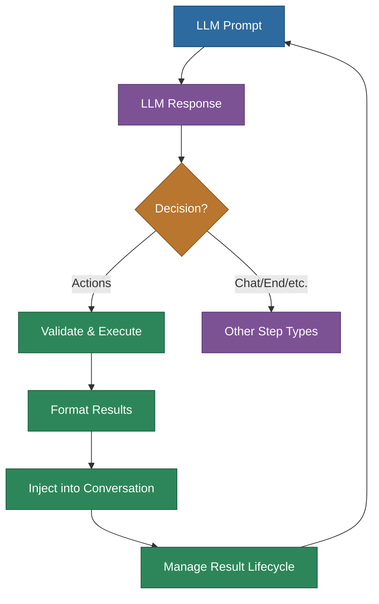
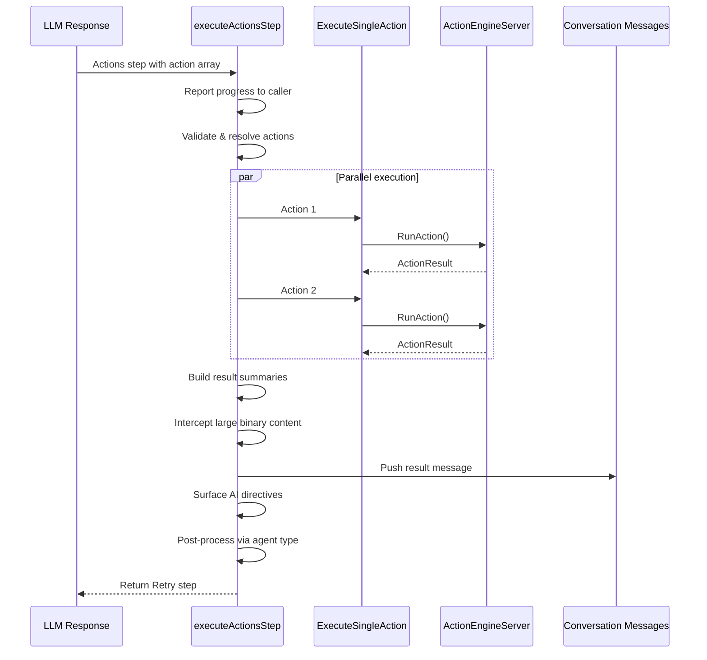

# Actions Guide

Comprehensive guide to how agents discover, execute, and manage actions in the MemberJunction agent framework.

## Overview

Actions are the primary mechanism through which agents interact with the outside world. When an LLM decides it needs to do something beyond generating text (send an email, query a database, call an API), it requests one or more actions. The `BaseAgent` execution engine handles the full lifecycle: discovery, validation, execution, result formatting, and context management.



## Action Discovery

### Database Configuration

Actions available to an agent are configured through `AIAgentAction` records in the database. Each record links an agent to an action and controls execution behavior:

| Field | Purpose |
|---|---|
| `AgentID` | The agent this action belongs to |
| `ActionID` | The action to make available |
| `Status` | Must be `Active` for the action to be available |
| `MinExecutionsPerRun` | Minimum times this action must execute per agent run |
| `MaxExecutionsPerRun` | Maximum times this action can execute per agent run |
| `ResultExpirationTurns` | Turns before results expire from conversation (NULL = never) |
| `ResultExpirationMode` | How to handle expired results: `None`, `Remove`, or `Compact` |
| `CompactMode` | How to compact: `First N Chars` or `AI Summary` |
| `CompactLength` | Character limit for `First N Chars` mode |
| `CompactPromptID` | Prompt override for `AI Summary` mode |

### Loading Active Actions

During prompt preparation (`gatherPromptTemplateData()`), the agent loads its actions:

1. Queries `AIEngine.Instance.AgentActions` filtered by agent ID and `Status = 'Active'`
2. Resolves each to its full `ActionEntity` from `ActionEngineServer.Instance.Actions`
3. Applies any runtime action changes (see below)
4. Stores the result in `_effectiveActions` for validation throughout the run

### How the LLM Knows About Actions

Available actions are formatted as compact markdown and injected into the prompt context via the `{{actionDetails}}` template variable. The format includes everything the LLM needs to invoke the action correctly:

```markdown
### SendEmail
Send an email message to one or more recipients.

**Input:** `To`* (string) — Recipient email address, `Subject` (string), `Body` (long text)
**Output:** `MessageID`* (string), `TimeSent` (datetime)
**Results:** SUCCESS ✓ · INVALID_EMAIL ✗ Email address is invalid
```

Key formatting details:
- Required parameters are marked with `*`
- Parameter types and value types are shown
- Default values are included where applicable
- Result codes are listed with success (✓) or failure (✗) indicators

### Runtime Action Changes

Actions can be modified at runtime via the `actionChanges` parameter on `ExecuteAgentParams`:

```typescript
const result = await runner.ExecuteAgent({
    agentId: 'my-agent-id',
    conversationMessages: messages,
    contextUser: currentUser,
    actionChanges: [
        { scope: 'global', mode: 'add', actionIds: ['crm-search-id'] },
        { scope: 'all-subagents', mode: 'remove', actionIds: ['delete-record-id'] }
    ]
});
```

| Scope | Behavior |
|---|---|
| `root` | Applied to root agent only, not propagated to sub-agents |
| `global` | Applied to root agent and all sub-agents |
| `all-subagents` | Applied to root agent and propagated as `global` to sub-agents |
| `specific` | Applied only to named agents |

Runtime-added actions can also specify `MaxExecutionsPerRun` via dynamic limits. Note that `MinExecutionsPerRun` is not supported for dynamically added actions.

### Effective Actions

The `_effectiveActions` array represents the final set of actions available after database configuration and runtime changes are applied. This is used throughout the agent run for:

- Formatting action details in prompts
- Validating action names in LLM responses
- Enforcing execution limits
- Loop action resolution (fuzzy matching)

## Action Execution

### Execution Flow

When the LLM returns an `Actions` step, `executeActionsStep()` handles the full lifecycle:



### Parallel Execution

All actions in a single step execute in parallel via `Promise.all()`. Each action:

1. Creates a tracking step entity (`AIAgentRunStep`)
2. Validates execution limits (max executions per run)
3. Resolves the action entity
4. Calls `ExecuteSingleAction()`
5. Records success/failure on the step entity

### ExecuteSingleAction

The core execution method that bridges the agent framework to the MJ Actions framework:

1. Converts the LLM's `{ name, params }` object into an `ActionParam[]` array
2. Calls `ActionEngineServer.Instance.RunAction()` with the action name, parameters, and context user
3. Returns the full `ActionResult` object (success, result code, output parameters, AI directives)

### Execution Limits

Two limit types protect against runaway action execution:

**MinExecutionsPerRun**: Checked at agent completion. If an action hasn't been executed the minimum number of times, the agent run is flagged. Only applies to database-configured actions.

**MaxExecutionsPerRun**: Checked before each execution attempt. If the limit is reached, the action is blocked and an error step is returned. Applies to both database-configured and dynamically added actions.

Execution counts are tracked per action per agent run and persisted across all steps.

## Action Results

### Result Formatting

Action results are formatted as compact markdown rather than JSON to minimize token usage (60-70% reduction):

```markdown
## SendEmail ✓
**Result:** SUCCESS — Email sent successfully
**Output:**
- `MessageID`: msg-abc-123
- `TimeSent`: 2024-01-15T10:30:00Z
```

For failed actions:
```markdown
## SendEmail ✗
**Result:** INVALID_EMAIL — The recipient email address is invalid
```

### Large Binary Content Interception

Action results may contain large binary data (base64-encoded images, audio, video). A single 1024x1024 image can consume ~700K tokens in base64. The `interceptLargeBinaryContent()` method:

1. Scans output parameters for large content (above a configurable threshold)
2. Detects media outputs via both content inspection and action metadata (`ValueType=MediaOutput`)
3. Replaces large content with placeholder references: `${media:ref-id}`
4. Stores the actual content in a separate media outputs accumulator
5. The root agent resolves placeholders in the final result

This prevents context overflow while preserving the ability to reference and deliver media outputs.

### AI Directives

Actions can include explicit instructions for the LLM via `AIDirectives` on their `ActionResult`. These are surfaced as a separate, high-priority user message immediately after the action results:

```
IMPORTANT — Follow these directives from the action results:

[HIGH/INSTRUCTION] Present the chart data in a table format, not as raw JSON
[MEDIUM/CONTEXT] The data source was last updated 2 hours ago
```

This separation ensures the LLM treats directives as instructions rather than data.

## Result Lifecycle Management

### How Results Enter the Conversation

After action execution, the formatted results are pushed into `params.conversationMessages` as a `role: 'user'` message. This message includes optional metadata for lifecycle management:

```typescript
{
    role: 'user',
    content: 'Action results:\n## SendEmail ✓\n...',
    metadata: {
        turnAdded: 5,                    // Step count when added
        messageType: 'action-result',    // Message type (see below)
        expirationTurns: 3,              // Expires after 3 more turns
        expirationMode: 'Compact',       // Compact when expired
        compactMode: 'First N Chars',    // Truncation strategy
        compactLength: 500,              // Keep first 500 chars
        compactPromptId: '...'           // Optional AI summary prompt
    }
}
```

The agent then returns a `Retry` step, which loops back to the prompt step so the LLM can analyze the results and decide what to do next.

### Message Types

The `messageType` field distinguishes the three categories of result messages that participate in the expiration/compaction lifecycle:

| `messageType` | Source | Default Expiration |
|---|---|---|
| `'action-result'` | Non-loop action execution | Never (configured per `AIAgentAction`) |
| `'loop-result'` | ForEach/While loop completion summary | 3 turns then remove (or from action config) |
| `'sub-agent-result'` | Sub-agent completion summary | 3 turns then remove (or from global override) |

All three types carry the same metadata shape and participate in the same lifecycle (proactive expiration, compaction, expansion, context recovery).

### Default Behavior: No Expiration

By default, action results **never expire**. The `AIAgentAction.ResultExpirationMode` column defaults to `'None'` in the database, and `ResultExpirationTurns` defaults to `NULL`. This means action results remain in the conversation indefinitely unless:

1. You explicitly configure expiration on the `AIAgentAction` record
2. Context recovery fires as an emergency measure when the context window overflows

### Configuring Expiration

To enable expiration for a specific agent-action pair, set both fields on the `AIAgentAction` record:

| Configuration | ResultExpirationTurns | ResultExpirationMode | Effect |
|---|---|---|---|
| Never expire (default) | `NULL` | `None` | Results stay forever |
| Remove after 5 turns | `5` | `Remove` | Message deleted entirely |
| Compact after 3 turns | `3` | `Compact` | Message truncated/summarized |
| Expire immediately | `0` | `Remove` | Removed after next turn |

When `ResultExpirationMode = 'Compact'`, you must also configure the compaction strategy:

| CompactMode | CompactLength | CompactPromptID | Behavior |
|---|---|---|---|
| `First N Chars` | Required (e.g., 500) | N/A | Truncate to N characters |
| `AI Summary` | Optional | Optional | LLM summarizes the content |

### Proactive Expiration

The `pruneAndCompactExpiredMessages()` method runs **before every step** in the execution loop. It processes all action-result messages in three phases:

**Phase 1 — Identify Expired Messages**
- Calculates age: `currentTurn - message.metadata.turnAdded`
- Checks if age exceeds `expirationTurns`
- Marks for removal or compaction based on `expirationMode`

**Phase 2 — Compact Messages**
- Applies the configured `CompactMode`
- Preserves original content in `metadata.originalContent` (for potential re-expansion)
- Sets `metadata.canExpand = true` on compacted messages
- Emits `message-compacted` lifecycle events

**Phase 3 — Remove Messages**
- Splices expired `Remove`-mode messages from the conversation array
- Removes in reverse index order to maintain correct indices
- Emits `message-expired` lifecycle events

### Compaction Modes

#### First N Chars
Fast, free truncation that keeps the beginning of the content:

```
Action results:
## RunQuery ✓
**Result:** SUCCESS — Query returned 150 rows
**Output:**
- `Data`: [{"id": 1, "name": "Acme Corp", "revenue": 1500000}, {"id": 2, ...

[Compacted: showing first 500 of 12847 characters. Agent can request expansion if needed.]
```

#### AI Summary
Uses an LLM call to intelligently summarize the content. The prompt is resolved through a lookup hierarchy:

1. Runtime override via `messageExpirationOverride.compactPromptId`
2. `AIAgentAction.CompactPromptID` (per agent-action pair)
3. `Action.DefaultCompactPromptID` (defined by the action author)
4. System default compact prompt

The summarization prompt receives: original content, original length, target length, message type, and turn added.

```
[AI Summary of 12847 chars. Agent can request full expansion if needed.]

Query returned 150 customer records with revenue data. Top customers: Acme Corp ($1.5M),
Globex ($1.2M), Initech ($980K). Average revenue: $450K. 23 customers above $500K threshold.
```

### Message Expansion

When a compacted message's original content is preserved (`canExpand = true`), the LLM can request re-expansion. This is done by including a `messageIndex` in a `Retry` step response:

```json
{
    "nextStep": {
        "type": "Retry",
        "messageIndex": 5,
        "reason": "Need the full query output to build the report"
    }
}
```

The `executeExpandMessageStep()` method:
1. Validates the index is in bounds
2. Checks `metadata.canExpand` and `metadata.originalContent` exist
3. Restores the original content
4. Clears the compaction flags
5. Emits a `message-expanded` lifecycle event

> **Note:** The expansion mechanism is currently wired through the LoopAgentType response schema. Other agent types that need this capability must include `messageIndex` in their response schema.

### Runtime Expiration Override

You can override expiration settings at the API level, applying to all action results in a run:

```typescript
const result = await runner.ExecuteAgent({
    agentId: 'my-agent-id',
    conversationMessages: messages,
    contextUser: currentUser,
    messageExpirationOverride: {
        expirationTurns: 3,
        expirationMode: 'Compact',
        compactMode: 'First N Chars',
        compactLength: 500
    },
    onMessageLifecycle: (event) => {
        // Track message lifecycle events
        console.log(`${event.type}: ${event.reason} (saved ${event.tokensSaved} tokens)`);
    }
});
```

## Context Recovery Strategies

When the context window overflows during prompt execution, the agent applies escalating recovery strategies to free space. These are emergency measures independent of the proactive expiration system.

### Strategy Escalation Order

| # | Strategy | Target | Age Filter | Compaction |
|---|---|---|---|---|
| 1 | Remove oldest action results | action-result messages | 5+ turns | Removed entirely |
| 2 | Compact old action results | action-result messages | 3+ turns | First 500 chars |
| 3 | Remove older action results | action-result messages | 2+ turns | Removed entirely |
| 4 | Compact ALL action results | action-result messages | Any age, >200 tokens | First 200 chars |
| 5 | Trim last user message | Last user message | N/A | Keep first ~1000 chars |

Each strategy attempts to free enough tokens to resolve the overflow. If one strategy doesn't free enough, the next one is tried. Strategies 1-4 target only `action-result` messages (identified by `metadata.messageType`).

### Key Difference from Proactive Expiration

| Aspect | Proactive Expiration | Context Recovery |
|---|---|---|
| **Trigger** | Before every step | Only on context overflow |
| **Configuration** | Per-action via `AIAgentAction` | Automatic, no configuration |
| **Original content** | Preserved for re-expansion | **Not preserved** (permanent) |
| **Applies to** | Messages with expiration metadata | All action-result messages |

Recovery-compacted messages **cannot be re-expanded** because the original content is not preserved — this is intentional since recovery is an emergency measure where memory conservation takes priority.

## Actions in Loops

### Suppressed Conversation Messages

When actions execute inside ForEach or While loops, `addConversationMessage` is set to `false`. This prevents N separate action-result messages from cluttering the conversation for an N-iteration loop.

### Aggregated Loop Results

After the loop completes, a single aggregated message is injected (if the agent type opts in via `InjectLoopResultsAsMessage`). The results use the same **markdown format** as non-loop action results, and carry the same **expiration/compaction metadata** so they persist across multiple prompt turns rather than being deleted after one turn.

```markdown
## Loop Completed
**Type:** ForEach
**Collection:** data.customers
**Processed:** 25, **Errors:** 0

### Iteration 1
## SendEmail ✓
**Result:** SUCCESS — Email sent to alice@example.com
**Output:**
• `MessageID`: msg-abc-123

### Iteration 2
## SendEmail ✓
**Result:** SUCCESS — Email sent to bob@example.com
**Output:**
• `MessageID`: msg-def-456
```

This message carries `messageType: 'loop-result'` metadata with the standard expiration/compaction fields:

```typescript
{
    turnAdded: 5,
    messageType: 'loop-result',
    expirationTurns: 3,          // From action config (most-restrictive-wins) or default 3
    expirationMode: 'Remove',    // Or 'Compact' if configured on the action
    compactMode: '...',          // Optional: 'First N Chars' or 'AI Summary'
    compactLength: 500,          // Optional
    compactPromptId: '...'       // Optional
}
```

The expiration settings are resolved from the loop's action configuration using the same most-restrictive-wins logic as non-loop actions. If no action config is found, the default is 3 turns then remove. The `messageExpirationOverride` parameter on `ExecuteAgentParams` takes precedence if set.

### Parameter Resolution in Loops

Loop iterations resolve action parameters using template syntax:

| Pattern | Resolution |
|---|---|
| `item.*` | Extract from current loop item (e.g., `item.email`) |
| `payload.*` | Extract from current payload (e.g., `payload.settings.template`) |
| `'item'` keyword | The entire current item |
| `'index'` keyword | The current iteration index |
| Literal values | Passed through unchanged |

Nested paths are supported via dot notation (`a.b.c`) and array indexing (`array[0]`).

### Action Validation in Loops

Loop action names are validated against `_effectiveActions` using fuzzy matching:

1. **Exact match** (case-insensitive): `"Send Email"` matches `"Send Email"`
2. **Contains match**: `"email"` matches `"Send Email"` (if unambiguous)
3. **Ambiguous match**: Error if multiple actions contain the search term
4. **No match**: Error listing available actions

## Post-Processing

### Agent Type Post-Processing

After all actions complete, the agent type's `PostProcessActionStep()` method is called. This virtual method receives:

- The full `ActionResult[]` array
- The original `AgentAction[]` that were executed
- The current payload
- The agent type state
- The current step decision

The method can return an optional `AgentPayloadChangeRequest` to modify the payload based on action results. Changes are validated against the agent's `PayloadSelfWritePaths` configuration.

### Payload Self-Write Paths

Agents can restrict which parts of the payload they're allowed to modify via `PayloadSelfWritePaths` (JSON array on the agent entity). This prevents actions or post-processing from accidentally overwriting protected payload sections.

If not configured, a default set of allowed paths is used via `getDefaultPayloadSelfWritePaths()`.

## Observability

### Step Entity Tracking

Every action execution creates an `AIAgentRunStep` record with:

- Step type: `Action`
- Step name: Action name
- Input data: Action parameters
- Output data: Action result (success, result code, message, output params)
- Payload snapshots: Before and after execution
- Target log ID: Link to the action's own execution log
- Parent step ID: For hierarchical tracking in loops

### Lifecycle Events

The message lifecycle system emits events that callers can observe via `onMessageLifecycle`:

| Event Type | When |
|---|---|
| `message-compacted` | Action/loop/sub-agent result compacted (proactive or recovery) |
| `message-expired` | Action/loop/sub-agent result removed due to expiration |
| `message-expanded` | Compacted message restored to full content |
| `message-removed` | Message removed during context recovery |

All three message types (`action-result`, `loop-result`, `sub-agent-result`) participate in the same lifecycle. The `messageType` field distinguishes them for logging and debugging.

Each event includes the turn number, message index, the message itself, reason, and token savings.
