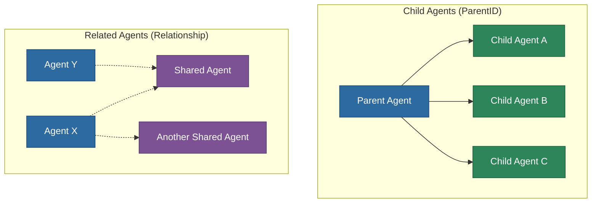
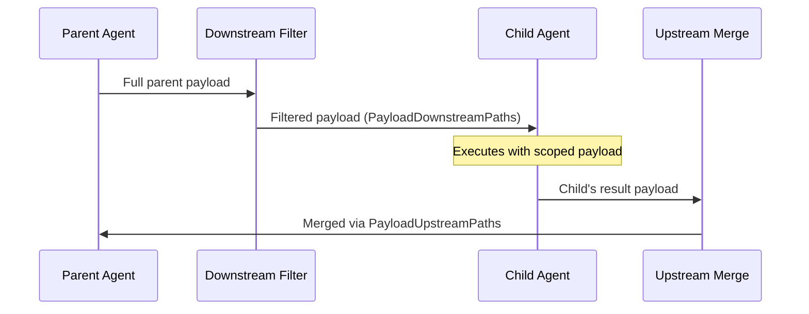
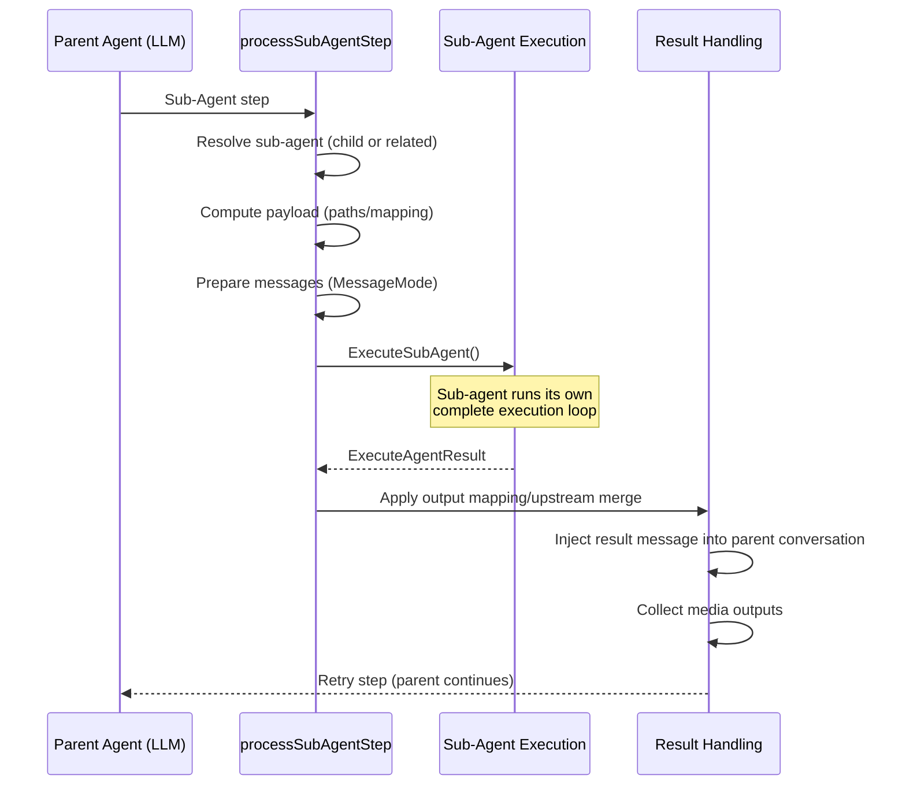
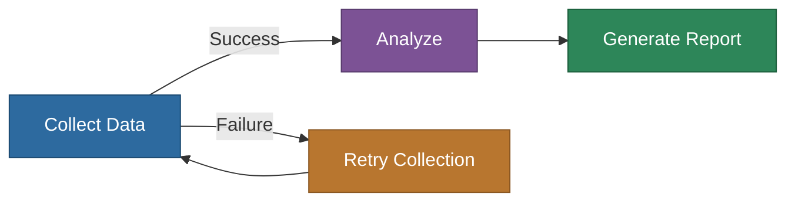

# Sub-Agents Guide

Comprehensive guide to sub-agent orchestration in the MemberJunction agent framework, covering both child agents and related agents.

## Overview

Sub-agents allow a parent agent to delegate work to specialized agents. The MemberJunction framework supports two distinct sub-agent relationship types, each with different coupling characteristics:

| Aspect | Child Agents | Related Agents |
|---|---|---|
| **Relationship** | Exclusive (1:N via `ParentID`) | Reusable (M:N via `AIAgentRelationship`) |
| **Data coupling** | Tight — shared payload paths | Loose — structural mapping |
| **Message handling** | Fresh start (no parent history) | Configurable via `MessageMode` |
| **Primary use case** | Tightly coupled sub-tasks | Reusable, composable services |



## Child Agents

### What Are Child Agents?

Child agents are agents whose `ParentID` field on the `AIAgent` entity points to a parent agent. This creates an exclusive ownership relationship — a child agent belongs to exactly one parent.

### Configuration

Child agents are configured entirely on the `AIAgent` entity:

| Field | Purpose |
|---|---|
| `ParentID` | Points to the parent agent (FK to `AIAgent.ID`) |
| `PayloadDownstreamPaths` | JSON array of payload paths the child receives from the parent |
| `PayloadUpstreamPaths` | JSON array of payload paths the child can write back to the parent |
| `PayloadScope` | Optional nested path that wraps the child's view of the payload |
| `MessageMode` | Controls conversation history passing (default: `None`) |

### Payload Flow



#### Downstream (Parent → Child)

The parent's payload is filtered using `PayloadDownstreamPaths`:

- **Wildcard `*`** (default): The entire parent payload is passed through
- **Specific paths**: Only named paths are extracted. Example: `["customerData", "settings.emailConfig"]`

If a `PayloadScope` is defined, the filtered payload is wrapped in a nested structure. For example, with `PayloadScope = "data.items"`, the child receives `{ data: { items: { ...filteredPayload } } }`.

#### Upstream (Child → Parent)

When the child completes, its result payload is merged back using `PayloadUpstreamPaths`:

- **Wildcard `*`**: The entire child payload merges back
- **Specific paths**: Only named paths are merged. Example: `["results", "metadata.summary"]`

If `PayloadScope` was used, the reverse transformation unwraps the child's payload before merging.

Unauthorized modifications (paths not in `PayloadUpstreamPaths`) are blocked and tracked as violations.

### Example: Child Agent Setup

```
Parent Agent: "Sales Report Generator"
  ├── Child Agent: "Data Collector"
  │   PayloadDownstreamPaths: ["queryConfig", "dateRange"]
  │   PayloadUpstreamPaths: ["rawData", "dataMetrics"]
  │
  ├── Child Agent: "Chart Builder"
  │   PayloadDownstreamPaths: ["rawData", "chartConfig"]
  │   PayloadUpstreamPaths: ["charts"]
  │
  └── Child Agent: "Report Formatter"
      PayloadDownstreamPaths: ["rawData", "charts", "reportTemplate"]
      PayloadUpstreamPaths: ["finalReport"]
```

## Related Agents

### What Are Related Agents?

Related agents are linked through `AIAgentRelationship` records, creating a many-to-many relationship. A related agent can serve multiple parent agents, making it ideal for reusable, service-like agents.

### Configuration

Related agents are configured through the `AIAgentRelationship` entity:

| Field | Type | Purpose |
|---|---|---|
| `AgentID` | FK | The parent agent |
| `SubAgentID` | FK | The sub-agent |
| `Status` | enum | `Active`, `Pending`, or `Revoked` |
| `SubAgentInputMapping` | JSON | Maps parent payload paths → sub-agent payload paths |
| `SubAgentOutputMapping` | JSON | Maps sub-agent result paths → parent payload paths |
| `SubAgentContextPaths` | JSON array | Paths to extract from parent as LLM context |
| `MessageMode` | enum | `None`, `All`, `Latest`, or `Bookend` |
| `MaxMessages` | int | Max messages for `Latest`/`Bookend` modes |

### Data Mapping

Related agents use structural mapping instead of direct payload sharing:

#### Input Mapping (Parent → Sub-Agent)

`SubAgentInputMapping` transforms parent payload paths into the sub-agent's expected structure:

```json
{
    "searchQuery": "query",
    "maxResults": "limit",
    "filters.dateRange": "dateFilter"
}
```

This creates a new sub-agent payload:
```json
// Parent payload: { searchQuery: "revenue > 1M", maxResults: 50, filters: { dateRange: "Q3" } }
// Sub-agent receives: { query: "revenue > 1M", limit: 50, dateFilter: "Q3" }
```

Wildcard `*` passes the entire parent payload.

#### Output Mapping (Sub-Agent → Parent)

`SubAgentOutputMapping` maps sub-agent results back to the parent's payload:

```json
{
    "results": "search.findings",
    "metadata": "search.meta"
}
```

This merges back:
```json
// Sub-agent result: { results: [...], metadata: { count: 50 } }
// Parent payload updated: { search: { findings: [...], meta: { count: 50 } } }
```

#### Context Paths

`SubAgentContextPaths` extracts information from the parent to pass as conversational context (not payload) to the sub-agent's LLM:

```json
["userPreferences", "priorFindings.summary"]
```

These paths are extracted from the parent payload, formatted as a user message, and prepended to the sub-agent's conversation. This gives the sub-agent's LLM awareness of parent context without coupling the payloads.

### Message Modes

The `MessageMode` field controls how much of the parent's conversation history the sub-agent receives:

| Mode | Behavior | Use Case |
|---|---|---|
| `None` | Fresh start — only context paths and task message | Isolated, stateless sub-agents |
| `All` | Complete parent conversation history | Full context awareness needed |
| `Latest` | Last N messages (configured via `MaxMessages`) | Recent context only |
| `Bookend` | First 2 messages + indicator + last (N-2) messages | Long conversations where beginning and end matter |

For `Bookend` mode, the conversation is structured as:
```
[Original system context]
[First user message]
[... N messages omitted ...]
[Last few messages for recent context]
[Sub-agent task message]
```

### Example: Related Agent Setup

```
Agent "Customer Support Bot"
  ├── Related: "Knowledge Base Search" (reusable)
  │   InputMapping: { "question": "query", "category": "filter" }
  │   OutputMapping: { "articles": "searchResults" }
  │   MessageMode: None
  │
  └── Related: "Sentiment Analyzer" (reusable)
      InputMapping: { "conversationHistory": "text" }
      OutputMapping: { "sentiment": "analysis.sentiment", "confidence": "analysis.confidence" }
      ContextPaths: ["customerProfile"]
      MessageMode: Latest, MaxMessages: 5

Agent "Sales Assistant"
  └── Related: "Knowledge Base Search" (same agent, reused)
      InputMapping: { "productQuestion": "query" }
      OutputMapping: { "articles": "productInfo" }
      MessageMode: None
```

## Sub-Agent Invocation

### How the LLM Requests a Sub-Agent

When the LLM determines it needs to delegate work, it returns a `Sub-Agent` step with the sub-agent name and an optional message/payload:

```json
{
    "nextStep": {
        "type": "SubAgent",
        "subAgent": {
            "name": "Knowledge Base Search",
            "message": "Find articles about return policies for electronics"
        }
    }
}
```

### Resolution Order

The agent framework resolves the sub-agent name in this order:

1. **Child agents**: Search agents where `ParentID` matches the current agent
2. **Related agents**: Search `AIAgentRelationship` records for the current agent

If the name doesn't match exactly, fuzzy matching (contains search) is attempted. Ambiguous matches produce an error.

### Dispatch

Once resolved, the framework dispatches to the appropriate handler:

- **Child agents** → `executeChildSubAgentStep()`: Computes payload via downstream paths, applies scope wrapping, executes, then merges upstream
- **Related agents** → `executeRelatedSubAgentStep()`: Applies input mapping, prepares context paths, configures message mode, executes, then applies output mapping

### Execution Flow



## Concurrent Sub-Agent Execution

Loop agents can invoke multiple sub-agents concurrently (e.g., executing multiple child or related agents at the same time to resolve a task) by returning a list of `subAgents` in the `nextStep` response.

### Execution Flow
1. **Parallel Dispatch**: The framework resolves and dispatches all requested sub-agents simultaneously using `Promise.all`.
2. **Deterministic Payload Merging**: Once all parallel sub-agents complete execution, their respective output payloads are sequentially merged back into the parent payload using the `PayloadManager` (applying child upstream paths or related output mappings) to guarantee no state-corruption race conditions occur.
3. **Media & File Aggregation**: Any file/media attachments generated by the parallel sub-agents are collected and aggregated into the parent agent's media array.
4. **Unified Conversation Logging**: The parent conversation receives a single aggregated markdown log showing the delegation and results of all sub-agents that ran in parallel.

### Response JSON Structure
```json
{
  "nextStep": {
    "type": "Sub-Agent",
    "subAgents": [
      {
        "name": "Database Researcher",
        "message": "Find marketing campaigns from last quarter",
        "terminateAfter": false
      },
      {
        "name": "Web Scraping Agent",
        "message": "Look up competitor pricing trends online",
        "terminateAfter": false
      }
    ]
  }
}
```

## Context Propagation

### What Propagates to Sub-Agents

| Data | Source | Mechanism |
|---|---|---|
| **Payload** | `params.payload` | Downstream paths (child) or input mapping (related) |
| **Messages** | `params.conversationMessages` | Filtered by `MessageMode` |
| **Context** | `params.context` | Direct pass or override from sub-agent request |
| **Data/Templates** | `params.data` | Merged with sub-agent's template parameters |
| **Effort level** | `params.effortLevel` | Direct propagation |
| **API keys** | `params.apiKeys` | Direct propagation |
| **User scopes** | Primary + Secondary scopes | Direct propagation (multi-tenant isolation) |
| **Action changes** | `params.actionChanges` | Filtered by scope (see below) |
| **Context user** | `params.contextUser` | Direct propagation |

### Action Change Propagation

Runtime action changes are filtered before reaching sub-agents:

| Scope | Root Agent | Sub-Agents |
|---|---|---|
| `root` | Applied | **Not propagated** |
| `global` | Applied | Propagated as-is |
| `all-subagents` | Applied | Propagated as `global` |
| `specific` | Applied if named | Propagated as-is (each agent checks) |

### Multi-Tenant Scope Propagation

User scopes (primary entity/record and secondary scopes) are propagated unchanged to all sub-agents. This ensures tenant isolation is maintained throughout the entire agent hierarchy.

## Result Handling

### Child Agent Results

1. **Payload merge**: Result payload merged via `PayloadUpstreamPaths`
2. **Step tracking**: Step entity linked to child's `AIAgentRun` via `TargetLogID`
3. **Media outputs**: Collected and merged into parent's media accumulator
4. **Conversation**: Result formatted as markdown and injected as user message

Result message format:
```markdown
## Sub-agent: Data Collector ✓
**Status:** Completed
[Payload summary if available]
```

### Related Agent Results

1. **Output mapping**: Result mapped via `SubAgentOutputMapping` back to parent payload
2. **Result injection**: Markdown summary pushed to parent conversation with expiration metadata:
   ```markdown
   ## Sub-agent: Knowledge Base Search ✓
   **Status:** Completed
   **Payload:**
   { "articles": [...] }
   ```
   The message carries `messageType: 'sub-agent-result'` metadata with standard expiration/compaction fields. By default, sub-agent results persist for 3 turns then are removed. The `messageExpirationOverride` on `ExecuteAgentParams` can override this.
3. **Media outputs**: Collected and merged into parent's media accumulator
4. **Chat handling**: If the sub-agent returns a `Chat` step (wants to talk to the user), the relationship's `ChatHandlingOption` determines behavior — it can remap the Chat to Success, Failed, or Retry

### Parent Continuation

After a sub-agent completes, the parent receives a `Retry` step, causing it to re-enter its prompt loop. The parent's LLM sees:
- The sub-agent result message in the conversation (persists for multiple turns via expiration metadata)
- The updated payload (merged via upstream paths or output mapping)
- Any media outputs collected from the sub-agent

## Depth Tracking and Recursion

### Hierarchical Depth

Each agent tracks its depth in the hierarchy:

- **Root agent**: `depth = 0`
- **First-level sub-agent**: `depth = 1`
- **Second-level sub-agent**: `depth = 2`
- And so on...

Depth is set at initialization: `this._depth = params.parentDepth + 1`

### Step Number Hierarchy

Step numbers are tracked hierarchically across the agent tree. A `_parentStepCounts` array maintains the step count at each depth level, enabling paths like `1.3.2` (root step 1, sub-agent step 3, sub-sub-agent step 2).

### Depth Limits

There is no explicit hard depth limit. Recursion is naturally bounded by:
- **Context window size**: Deeper nesting consumes more tokens
- **Cascading payload restrictions**: Downstream paths narrow the data at each level
- **Execution timeouts**: Overall run time limits
- **LLM judgment**: The LLM decides when to delegate vs. handle directly

## Sub-Agents in Loops

### ForEach Loops

Sub-agents can be invoked as the body of a ForEach loop. Each iteration:

1. Receives the current loop item as a payload override
2. Executes the full sub-agent lifecycle
3. Returns results that accumulate across iterations

```json
{
    "nextStep": {
        "type": "ForEach",
        "forEach": {
            "collectionPath": "data.customers",
            "itemVariable": "customer",
            "subAgent": {
                "name": "Customer Analyzer",
                "message": "Analyze this customer's purchase history"
            }
        }
    }
}
```

### While Loops

Sub-agents can also be the body of a While loop. Each iteration receives an `attemptContext` with the iteration count and current data, allowing the sub-agent to evaluate the termination condition.

### Payload Accumulation

In both loop types, payload changes from each sub-agent iteration persist to the next. This enables patterns like progressive data collection where each iteration builds on the previous results.

## Flow Agent Sub-Agents

Flow agents handle sub-agents within deterministic workflows. Key differences from loop agents:

1. **Step-based invocation**: Sub-agents are defined as explicit flow steps with unique IDs
2. **Conditional paths**: The flow evaluates conditions on the sub-agent result to determine the next step
3. **Output mapping**: Flow steps can apply output mapping after sub-agent execution
4. **No LLM decision**: The flow graph determines when sub-agents run, not the LLM



## Choosing Between Child and Related Agents

### Use Child Agents When:

- The sub-agent is **purpose-built** for this parent and won't be reused
- You need **tight payload coupling** with direct path-based sharing
- The sub-agent should **inherit the parent's payload structure**
- You want **simple configuration** without mapping definitions
- The relationship is **hierarchical** (parent owns the child's lifecycle)

### Use Related Agents When:

- The sub-agent is a **reusable service** used by multiple parents
- Parents have **different payload structures** that need mapping
- You need **conversation history** passed to the sub-agent
- You want **loose coupling** between parent and sub-agent
- The sub-agent operates **independently** with its own payload schema
- You need **context path injection** for LLM awareness without payload coupling

### Decision Matrix

| Question | Child Agent | Related Agent |
|---|---|---|
| Will multiple parents use this sub-agent? | No | Yes |
| Does it need parent's conversation history? | Rarely | Configurable |
| Do parent and sub-agent share payload structure? | Yes | No (mapped) |
| Is the relationship permanent and exclusive? | Yes | No |
| Does it need context path injection? | No | Yes |

## Observability

### Step Entity Tracking

Every sub-agent invocation creates an `AIAgentRunStep` record on the parent agent's run:

- **Step type**: `Sub-Agent`
- **Step name**: Sub-agent name
- **Input data**: Parameters passed to the sub-agent
- **Payload snapshots**: Before and after execution
- **Target log ID**: Links to the sub-agent's own `AIAgentRun` record
- **Parent step ID**: For hierarchical tracking in loops

The sub-agent creates its own `AIAgentRun` record with `ParentRunID` linking back to the parent, enabling complete execution tree reconstruction.

### Monitoring Sub-Agent Execution

Use the `onProgress` callback to track execution across the agent hierarchy:

```typescript
const result = await runner.ExecuteAgent({
    agentId: 'orchestrator-id',
    conversationMessages: messages,
    contextUser: currentUser,
    onProgress: (step) => {
        // step includes agentName, depth, step number
        const indent = '  '.repeat(step.depth || 0);
        console.log(`${indent}[${step.agentName}] ${step.message}`);
    }
});
```

Output:
```
[Sales Report Generator] Executing step 1
[Sales Report Generator] Delegating to "Data Collector"
  [Data Collector] Executing step 1
  [Data Collector] Executing action "RunQuery"
  [Data Collector] Completed successfully
[Sales Report Generator] Delegating to "Chart Builder"
  [Chart Builder] Executing step 1
  [Chart Builder] Completed successfully
[Sales Report Generator] Completed after 5 steps
```
