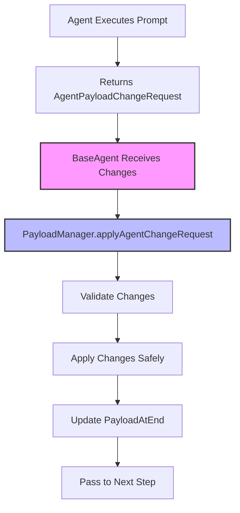

# State Management Guide

## Overview

The MemberJunction AI Agent framework provides a sophisticated state management system that ensures safe, efficient, and traceable state mutations throughout agent execution. The system uses a change-based approach where agents specify only the changes they need to make to the state, rather than returning complete state objects. This prevents data loss from LLM truncation and dramatically reduces token usage.

## Core Concepts

### State vs Payload
In the MJ Agent framework:
- **State**: The internal data that changes as an agent executes
- **Payload**: The specific term we use for state in the framework
- These terms are used interchangeably in this document

### Change-Based State Management
Instead of agents returning complete state objects, they return `AgentPayloadChangeRequest` objects that specify:
1. **New elements** to add
2. **Updates** to existing elements  
3. **Deletions** of elements

This approach is enforced at the framework level, not delegated to individual agent type implementations.

## The AgentPayloadChangeRequest Type

```typescript
export type AgentPayloadChangeRequest<P = any> = {
    /**
     * New elements that were not previously present
     */
    newElements?: Partial<P>;

    /**
     * Elements that should be updated
     */
    updateElements?: Partial<P>;

    /**
     * Elements that should be removed
     * Use "_DELETE_" as the value to mark for deletion
     */
    removeElements?: Partial<P>;
    
    /**
     * Optional reasoning for the changes
     */
    reasoning?: string;
}
```

### Working with Arrays

For array mutations, the framework uses a position-preserving approach:

#### Deleting Array Elements
```typescript
// Original array
{
  items: [
    { id: '1', value: 'keep' },
    { id: '2', value: 'delete this' },
    { id: '3', value: 'keep' }
  ]
}

// Change request to delete second item
{
  removeElements: {
    items: [
      {},          // Keep first item (empty object)
      "_DELETE_",  // Delete second item
      {}           // Keep third item
    ]
  }
}

// Result
{
  items: [
    { id: '1', value: 'keep' },
    { id: '3', value: 'keep' }
  ]
}
```

#### Updating Array Elements
```typescript
// Update specific array elements
{
  updateElements: {
    items: [
      {},  // No change to first item
      { value: 'updated' },  // Update second item
      {}   // No change to third item
    ]
  }
}
```

## Architecture

### Framework-Level Responsibility

State management is a core framework responsibility, not delegated to agent types:

1. **BaseAgent** handles all state mutations
2. **PayloadManager** applies change requests with validation
3. **Agent Types** only need to return change requests
4. All agents automatically benefit from safe state management

### Flow of State Changes



### Integration Points

1. **Agent Types**: Return `payloadChangeRequest` in their response
2. **BaseAgentNextStep**: Contains `payloadChangeRequest` instead of full payload
3. **BaseAgent.executePromptStep**: Applies changes using PayloadManager
4. **Sub-Agent Execution**: Applies changes with upstream guardrails

## PayloadManager Implementation

The `PayloadManager` class provides the core state management functionality:

### Key Methods

#### applyAgentChangeRequest
```typescript
public applyAgentChangeRequest<P = any>(
    originalPayload: P,
    changeRequest: AgentPayloadChangeRequest<P>,
    options?: {
        validateChanges?: boolean;
        logChanges?: boolean;
        agentName?: string;
    }
): { 
    result: P; 
    applied: { 
        additions: number; 
        updates: number; 
        deletions: number; 
    };
    warnings: string[];
}
```

#### applySubAgentChangeRequest
```typescript
public applySubAgentChangeRequest<P = any>(
    parentPayload: P,
    changeRequest: AgentPayloadChangeRequest<P>,
    upstreamPaths: string[],
    subAgentName: string
): {
    result: P;
    applied: { additions: number; updates: number; deletions: number; };
    warnings: string[];
    blocked: number;
}
```

### Processing Order

1. **Arrays**: Process all operations in a single pass to maintain index alignment
2. **Objects**: Process deletions, updates, and additions
3. **Nested Changes**: Recursively process even when parent has `{}`

### Deep Recursive Processing

The system handles nested changes correctly:

```typescript
// Even if an array element is marked with {} (keep)
// the system still checks for nested changes
{
  removeElements: {
    users: [
      {
        preferences: {
          theme: "_DELETE_"  // Delete nested property
        }
      },
      {},  // Keep second user as-is
    ]
  }
}
```

## Benefits

### 1. Prevents Data Loss
- LLMs sometimes truncate long responses with "..." or "and more"
- Change-based approach ensures data is never accidentally lost
- Framework validates all mutations

### 2. Token Efficiency
- Only changes are transmitted, not full state
- Dramatic reduction in prompt tokens
- Cost savings on LLM API calls

### 3. Explicit Intent
- Clear what the agent intends to change
- Easier to debug and trace state mutations
- Better audit trail

### 4. Consistency
- All agents use the same state management pattern
- No variation between agent type implementations
- Predictable behavior across the system

## Examples

### Basic State Update
```typescript
// Agent wants to update analysis results
{
  updateElements: {
    analysis: {
      sentiment: 'positive',
      score: 0.85
    }
  },
  reasoning: 'Sentiment analysis completed'
}
```

### Complex Nested Changes
```typescript
// Agent making multiple types of changes
{
  newElements: {
    metrics: {
      performance: { cpu: 45, memory: 72 }
    }
  },
  updateElements: {
    status: 'processing',
    items: [
      { status: 'complete' },  // Update first item
      {},                      // No change to second
      { status: 'pending' }    // Update third item
    ]
  },
  removeElements: {
    debug: {
      logs: "_DELETE_"
    }
  },
  reasoning: 'Updated processing status and metrics'
}
```

### Sub-Agent State Management

Sub-agents use the same pattern, but changes are filtered through upstream paths:

```typescript
// Sub-agent returns changes
const changeRequest = {
  updateElements: {
    research: { status: 'complete' },
    unauthorized: { hack: 'attempt' }  // Will be blocked
  }
};

// Applied with guardrails
const result = payloadManager.applySubAgentChangeRequest(
  parentPayload,
  changeRequest,
  ['research.*'],  // Only research path allowed
  'ResearchAgent'
);
// result.blocked = 1 (unauthorized change blocked)
```

## Best Practices

### 1. Atomic Changes
Make related changes together in a single request:
```typescript
// Good: Atomic operation
{
  updateElements: {
    order: { status: 'shipped' },
    inventory: { quantity: 45 }
  }
}

// Avoid: Separate requests for related changes
```

### 2. Clear Reasoning
Always include reasoning for changes:
```typescript
{
  updateElements: { status: 'failed' },
  reasoning: 'API endpoint returned 503 error after 3 retries'
}
```

### 3. Preserve Array Order
When modifying arrays, include all elements to maintain order:
```typescript
// Correct: All elements included
{
  removeElements: {
    tasks: [{}, "_DELETE_", {}, {}]  // Delete only second element
  }
}

// Wrong: Missing elements
{
  removeElements: {
    tasks: ["_DELETE_"]  // Ambiguous which element
  }
}
```

### 4. Use Type Safety
Leverage TypeScript generics for type-safe changes:
```typescript
interface MyPayload {
  user: { name: string; age: number };
  settings: { theme: string };
}

const changes: AgentPayloadChangeRequest<MyPayload> = {
  updateElements: {
    user: { age: 31 },  // TypeScript ensures valid fields
    settings: { theme: 'dark' }
  }
};
```

## Debugging State Changes

### Enable Verbose Logging
```typescript
const result = payloadManager.applyAgentChangeRequest(
  payload,
  changeRequest,
  {
    logChanges: true,
    agentName: 'AnalysisAgent'
  }
);
// Logs: "Payload changes applied by AnalysisAgent: +2 additions, ~3 updates, -1 deletions | Reason: Analysis complete"
```

### Review Warnings
```typescript
if (result.warnings.length > 0) {
  console.log('State warnings:', result.warnings);
  // "Update attempted on non-existent key: user.preferences.invalid"
  // "Possible truncation at description: 1000 → 50 chars"
}
```

### Trace State Evolution
Each agent step tracks:
- `PayloadAtStart`: State before the step
- `PayloadAtEnd`: State after applying changes
- Change request details in step output

## Performance Considerations

### Efficient Processing
- Single-pass array processing maintains O(n) complexity
- Deep cloning only when necessary
- Minimal overhead even with large payloads

### Token Optimization
Example savings:
- Full payload: 5,000 tokens
- Change request: 200 tokens
- **96% reduction** in token usage

### Memory Usage
- Original payload is cloned once
- Changes are applied in-place on the clone
- Efficient for large state objects

## Security and Validation

### Truncation Detection
The system detects potential LLM truncation:
- String length reduced by >80%
- Presence of "...", "etc", "and more" patterns
- Type changes (object → string)

### Access Control
For sub-agents, changes are filtered through allowed paths:
```typescript
// Sub-agent can only modify analysis section
const upstreamPaths = ['analysis.*'];
// Other changes will be blocked and logged
```

### Audit Trail
All changes are logged with:
- Who made the change (agent name)
- What changed (additions, updates, deletions)
- Why it changed (reasoning)
- When it changed (timestamps in step entities)

## Migration Guide

### For Existing Agent Types

1. Update prompt templates to return `AgentPayloadChangeRequest`
2. Remove full payload from response
3. Update `DetermineNextStep` to return `payloadChangeRequest`
4. Test that changes are applied correctly

### For New Agents

1. Design your payload structure
2. Implement prompts that return change requests
3. Let the framework handle state management
4. Focus on business logic, not state handling

## Future Enhancements

1. **Schema Validation**: Validate changes against payload schema
2. **Conflict Resolution**: Handle concurrent modifications
3. **State Snapshots**: Point-in-time state recovery
4. **Change Compression**: Optimize large change sets
5. **Revert Capability**: Undo specific changes

## Conclusion

The MemberJunction Agent framework's state management system provides a robust, efficient, and safe way to handle state mutations in AI agent execution. By using change requests instead of full state replacement, the system prevents data loss, reduces token usage, and provides clear traceability of all state changes. This approach is fundamental to building reliable, production-ready AI agent systems.