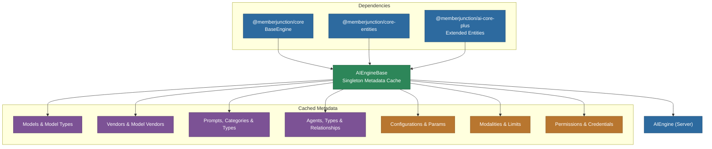

# @memberjunction/ai-engine-base

Base AI Engine package for MemberJunction. Provides a comprehensive metadata cache for all AI-related entities -- models, vendors, prompts, agents, configurations, modalities, permissions, and more. This package extends `BaseEngine` to load and cache AI metadata in a single batch, making it available on both server and client without duplicating data loading logic.

## Architecture



## Installation

```bash
npm install @memberjunction/ai-engine-base
```

## Key Exports

### AIEngineBase (Singleton)

The core class that loads and caches all AI metadata. Access via `AIEngineBase.Instance`.

```typescript
import { AIEngineBase } from '@memberjunction/ai-engine-base';

// Initialize (typically at app startup)
await AIEngineBase.Instance.Config(false, contextUser);

// Access cached metadata
const models = AIEngineBase.Instance.Models;
const agents = AIEngineBase.Instance.Agents;
const prompts = AIEngineBase.Instance.Prompts;
```

#### Cached Entity Collections

| Property | Entity | Description |
|---|---|---|
| `Models` | AI Models | All registered AI models with extended properties |
| `ModelTypes` | AI Model Types | Model type categories (LLM, Embeddings, etc.) |
| `Vendors` | MJ: AI Vendors | AI service providers |
| `ModelVendors` | MJ: AI Model Vendors | Model-vendor associations |
| `Prompts` | AI Prompts | All prompt definitions with category associations |
| `PromptModels` | MJ: AI Prompt Models | Prompt-model associations |
| `PromptTypes` | AI Prompt Types | Prompt type categories |
| `PromptCategories` | AI Prompt Categories | Hierarchical prompt organization |
| `Agents` | AI Agents | All agent definitions with actions and notes |
| `AgentTypes` | MJ: AI Agent Types | Agent type definitions |
| `AgentActions` | AI Agent Actions | Actions associated with agents |
| `AgentPrompts` | MJ: AI Agent Prompts | Prompts associated with agents |
| `AgentSteps` | MJ: AI Agent Steps | Flow agent step definitions |
| `AgentStepPaths` | MJ: AI Agent Step Paths | Transitions between flow steps |
| `AgentRelationships` | MJ: AI Agent Relationships | Sub-agent relationships |
| `AgentPermissions` | MJ: AI Agent Permissions | User/role permission grants |
| `AgentConfigurations` | MJ: AI Agent Configurations | Semantic presets (Fast, High Quality) |
| `Configurations` | MJ: AI Configurations | Global AI configurations with inheritance |
| `ConfigurationParams` | MJ: AI Configuration Params | Key-value parameters for configurations |
| `ModelCosts` | MJ: AI Model Costs | Cost tracking per model/vendor |
| `ModelPriceTypes` | MJ: AI Model Price Types | Price type definitions |
| `ModelPriceUnitTypes` | MJ: AI Model Price Unit Types | Unit type definitions |
| `CredentialBindings` | MJ: AI Credential Bindings | Credential bindings for vendors/models |
| `Modalities` | MJ: AI Modalities | Input/output modality definitions |
| `AgentModalities` | MJ: AI Agent Modalities | Agent modality support |
| `ModelModalities` | MJ: AI Model Modalities | Model modality support |
| `VectorDatabases` | Vector Databases | Vector database configurations |
| `ArtifactTypes` | MJ: Artifact Types | Artifact type definitions |

#### Convenience Methods

```typescript
// Get the highest-power model of a given type
const bestLLM = await AIEngineBase.Instance.GetHighestPowerLLM('OpenAI', contextUser);
const bestEmbedding = await AIEngineBase.Instance.GetHighestPowerModel('OpenAI', 'Embeddings', contextUser);

// Get agent by name
const agent = AIEngineBase.Instance.GetAgentByName('Customer Support Agent');

// Get sub-agents (children + relationships)
const subAgents = AIEngineBase.Instance.GetSubAgents(agentId, 'Active');

// Configuration presets
const presets = AIEngineBase.Instance.GetAgentConfigurationPresets(agentId);
const defaultPreset = AIEngineBase.Instance.GetDefaultAgentConfigurationPreset(agentId);
```

#### Configuration Inheritance

Configurations support parent-child inheritance chains:

```typescript
// Get the full inheritance chain (child -> parent -> grandparent)
const chain = AIEngineBase.Instance.GetConfigurationChain(configId);

// Get parameters with inheritance (child overrides parent)
const params = AIEngineBase.Instance.GetConfigurationParamsWithInheritance(configId);
```

#### Model Cost Tracking

```typescript
// Get active cost for a model/vendor combination
const cost = AIEngineBase.Instance.GetActiveModelCost(modelId, vendorId, 'Realtime');
```

#### Credential Bindings

```typescript
// Get credential bindings for a vendor
const bindings = AIEngineBase.Instance.GetCredentialBindingsForTarget('Vendor', vendorId);

// Check if bindings exist
const hasBindings = AIEngineBase.Instance.HasCredentialBindings('ModelVendor', modelVendorId);
```

### Modality System

The modality system tracks which input/output types (Text, Image, Audio, Video, File) agents and models support.

```typescript
// Check if an agent supports image input
const supportsImages = AIEngineBase.Instance.AgentSupportsModality(agentId, 'Image', 'Input');

// Check if agent accepts any attachments
const supportsAttachments = AIEngineBase.Instance.AgentSupportsAttachments(agentId);

// Get aggregated attachment limits for UI configuration
const limits = AIEngineBase.Instance.GetAgentAttachmentLimits(agentId, modelId);
// limits.enabled, limits.maxAttachments, limits.maxAttachmentSizeBytes, limits.acceptedFileTypes
```

### Agent Permission Helper

```typescript
// Check individual permissions
const canView = await AIEngineBase.Instance.CanUserViewAgent(agentId, user);
const canRun = await AIEngineBase.Instance.CanUserRunAgent(agentId, user);

// Get all permissions at once
const perms = await AIEngineBase.Instance.GetUserAgentPermissions(agentId, user);
// perms.canView, perms.canRun, perms.canEdit, perms.canDelete, perms.isOwner

// Get all accessible agents for a user
const agents = await AIEngineBase.Instance.GetAccessibleAgents(user, 'run');
```

### Additional Exports

| Export | Purpose |
|---|---|
| `ModalityLimits` | Resolved limits for a specific modality (size, count, dimension, formats) |
| `AgentAttachmentLimits` | Aggregated attachment limits for UI components |
| `PriceUnitTypes` | Price unit type utilities |
| `AIAgentPermissionHelper` | Static helper for agent permission checks |
| `EffectiveAgentPermissions` | Complete permission set for a user/agent combination |
| `AICredentialBindingEntityExtended` | Extended credential binding entity |

## Dependencies

- `@memberjunction/core` -- BaseEngine, Metadata, RunView
- `@memberjunction/core-entities` -- Generated entity classes
- `@memberjunction/ai` -- Core AI abstractions
- `@memberjunction/ai-core-plus` -- Extended entity classes
- `@memberjunction/global` -- Class factory
- `@memberjunction/templates-base-types` -- Template engine integration
