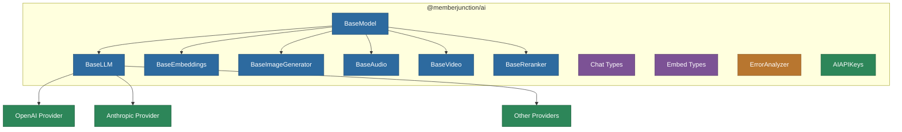

# @memberjunction/ai

Core abstractions and base classes for the MemberJunction AI Framework. This package defines provider-agnostic interfaces for Large Language Models (LLMs), embeddings, image generation, audio, video, reranking, and more. It has **zero MemberJunction dependencies** beyond `@memberjunction/global`, making it suitable for standalone use in any TypeScript/JavaScript project.

## Architecture



## Installation

```bash
npm install @memberjunction/ai
```

## Key Exports

### Base Classes

| Class | Purpose |
|---|---|
| `BaseModel` | Root base class for all AI model types; manages API key storage |
| `BaseLLM` | Abstract base for chat completion providers with streaming, parallel execution, and thinking model support |
| `BaseEmbeddings` | Abstract base for text embedding providers |
| `BaseImageGenerator` | Abstract base for image generation, editing, and variation providers |
| `BaseAudio` | Abstract base for text-to-speech and speech-to-text providers |
| `BaseVideo` | Abstract base for video generation providers |
| `BaseReranker` | Abstract base for document reranking providers |

### Type Definitions

| Type / Class | Purpose |
|---|---|
| `ChatParams` | Parameters for chat completion requests (messages, streaming, sampling controls) |
| `ChatResult` | Result of a chat completion including choices, usage, and cache info |
| `ChatMessage` | Individual message with role, content (text or multimodal blocks), and optional metadata |
| `ChatMessageContentBlock` | Multimodal content block (text, image, video, audio, file) |
| `StreamingChatCallbacks` | Callbacks for real-time streaming responses |
| `ParallelChatCompletionsCallbacks` | Callbacks for batch parallel completions |
| `EmbedTextParams` / `EmbedTextResult` | Parameters and results for single text embedding |
| `EmbedTextsParams` / `EmbedTextsResult` | Parameters and results for batch text embeddings |
| `ImageGenerationParams` / `ImageGenerationResult` | Image generation parameters and results |
| `SummarizeParams` / `SummarizeResult` | Text summarization parameters and results |
| `ClassifyParams` / `ClassifyResult` | Text classification parameters and results |
| `RerankParams` / `RerankResult` | Document reranking parameters and results |

### Utilities

| Export | Purpose |
|---|---|
| `BaseResult` | Common result base with success flag, timing, and error info |
| `ModelUsage` | Token usage and cost tracking (prompt tokens, completion tokens, cost, currency) |
| `AIAPIKeys` | API key management via environment variables (`AI_VENDOR_API_KEY__<DRIVER>`) |
| `GetAIAPIKey()` | Helper to resolve API keys with optional runtime overrides |
| `ErrorAnalyzer` | Standardized error analysis across all providers with severity and failover hints |
| `AIErrorInfo` / `AIErrorType` | Structured error types (rate limit, authentication, context length, etc.) |
| `serializeMessageContent()` / `deserializeMessageContent()` | Content block serialization for database storage |
| `parseBase64DataUrl()` / `createBase64DataUrl()` | Base64 data URL utilities |

## Usage

### Basic Chat Completion

```typescript
import { ChatParams, ChatMessageRole } from '@memberjunction/ai';
import { OpenAILLM } from '@memberjunction/ai-openai';

const llm = new OpenAILLM('your-api-key');

const params = new ChatParams();
params.model = 'gpt-4';
params.messages = [
    { role: ChatMessageRole.user, content: 'What is the capital of France?' }
];

const result = await llm.ChatCompletion(params);
console.log(result.data.choices[0].message.content);
```

### Streaming Chat Completion

```typescript
const params = new ChatParams();
params.model = 'gpt-4';
params.streaming = true;
params.messages = [
    { role: ChatMessageRole.user, content: 'Explain quantum computing' }
];
params.streamingCallbacks = {
    OnContent: (chunk, isComplete) => process.stdout.write(chunk),
    OnComplete: (result) => console.log('\nDone!'),
    OnError: (error) => console.error('Stream error:', error)
};

await llm.ChatCompletion(params);
```

### Parallel Chat Completions

```typescript
const paramsArray = [
    { ...baseParams, temperature: 0.3 },
    { ...baseParams, temperature: 0.7 },
    { ...baseParams, temperature: 1.0 }
];

const results = await llm.ChatCompletions(paramsArray, {
    OnCompletion: (result, index) => console.log(`Completion ${index} done`),
    OnAllCompleted: (results) => console.log(`All ${results.length} done`)
});
```

### Multimodal Content

```typescript
const params = new ChatParams();
params.model = 'gpt-4o';
params.messages = [
    {
        role: ChatMessageRole.user,
        content: [
            { type: 'text', content: 'What is in this image?' },
            { type: 'image_url', content: 'data:image/png;base64,...' }
        ]
    }
];
```

### Text Embeddings

```typescript
import { EmbedTextParams } from '@memberjunction/ai';
import { OpenAIEmbeddings } from '@memberjunction/ai-openai';

const embedder = new OpenAIEmbeddings('your-api-key');
const result = await embedder.EmbedText({
    model: 'text-embedding-ada-002',
    text: 'Sample text to embed'
});
console.log(result.embedding); // number[]
```

### API Key Management

```typescript
import { GetAIAPIKey } from '@memberjunction/ai';

// Reads from environment: AI_VENDOR_API_KEY__OPENAILLM
const key = GetAIAPIKey('OpenAILLM');

// With runtime override
const key2 = GetAIAPIKey('AnthropicLLM', [
    { driverClass: 'AnthropicLLM', apiKey: 'sk-ant-...' }
]);
```

## Provider Implementation

To create a new AI provider, extend the appropriate base class:

```typescript
import { BaseLLM, ChatParams, ChatResult } from '@memberjunction/ai';

export class MyProviderLLM extends BaseLLM {
    protected async nonStreamingChatCompletion(params: ChatParams): Promise<ChatResult> {
        // Implement provider-specific chat completion
    }

    public async ClassifyText(params: ClassifyParams): Promise<ClassifyResult> {
        // Implement or throw if not supported
    }

    public async SummarizeText(params: SummarizeParams): Promise<SummarizeResult> {
        // Implement or throw if not supported
    }

    // For streaming support, override these:
    public get SupportsStreaming(): boolean { return true; }
    protected async createStreamingRequest(params: ChatParams): Promise<AsyncIterable<unknown>> { /* ... */ }
    protected processStreamingChunk(chunk: unknown): { content: string } { /* ... */ }
    protected finalizeStreamingResponse(content: string, lastChunk: unknown, usage: unknown): ChatResult { /* ... */ }
}
```

## Dependencies

- `@memberjunction/global` -- Class factory and global utilities (zero transitive dependencies)
- `dotenv` -- Environment variable loading
- `rxjs` -- Reactive extensions (used internally)
