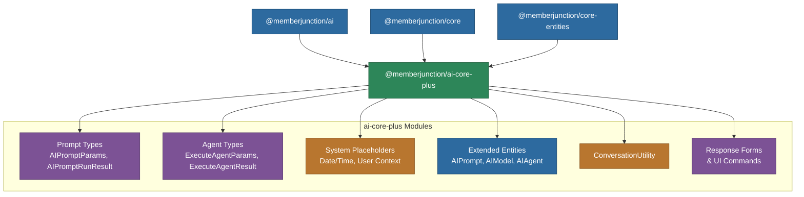

# @memberjunction/ai-core-plus

Shared type definitions and extended entity classes for the MemberJunction AI Framework. This package bridges the gap between the standalone `@memberjunction/ai` core and the full MJ entity system, providing types that are usable on both server and client. It defines prompt execution result types, agent execution types, system placeholder management, conversation utilities, and extended entity classes with additional computed properties.

## Architecture



## Installation

```bash
npm install @memberjunction/ai-core-plus
```

## Key Exports

### Prompt Types (`prompt.types.ts`)

| Type / Class | Purpose |
|---|---|
| `AIPromptParams` | Full parameter set for prompt execution: prompt reference, data context, configuration, child prompts, streaming callbacks, cancellation, credential overrides, effort level, and more |
| `AIPromptRunResult<T>` | Generic result from prompt execution including raw/parsed output, token usage, cost, validation attempts, model selection info, and media references |
| `ChildPromptParam` | Links a child prompt to a placeholder in a parent template for hierarchical composition |
| `AIModelSelectionInfo` | Debugging info about which models were considered and why one was selected |
| `ExecutionProgressCallback` | Callback for real-time execution progress (template rendering, model selection, execution, validation) |
| `ExecutionStreamingCallback` | Callback for streaming content chunks during execution |
| `ValidationAttempt` | Detailed record of each validation attempt with attempt number, errors, and raw/parsed output |
| `PromptRunMediaReference` | Reference to generated media (image, audio, video) with metadata |
| `ExecutionStatus` | Status enum: `'Pending'`, `'Running'`, `'Completed'`, `'Failed'`, `'Cancelled'` |

### Agent Types (`agent-types.ts`)

| Type / Class | Purpose |
|---|---|
| `ExecuteAgentParams` | Parameters for agent execution: agent reference, messages, conversation context, user scope, configuration presets, effort level, action changes, and callbacks |
| `ExecuteAgentResult` | Agent execution result with success status, output messages, actions performed, sub-agent requests, and model selection info |
| `AgentContextData` | Contextual data injected into agent prompts (notes, examples, data sources) |
| `AgentConfiguration` | Runtime configuration for an agent run (model overrides, effort level, max iterations) |
| `UserScope` | Multi-tenant scoping for agent memory with primary/secondary dimensions |
| `AgentAction` | Description of an action an agent wants to execute |
| `AgentSubAgentRequest` | Request from one agent to delegate work to a sub-agent |
| `AgentChatMessage` / `AgentChatMessageMetadata` | Chat messages with lifecycle metadata (expiration, compaction) |
| `MediaOutput` | Media generated by an agent (modality, MIME type, data) |
| `ActionChange` / `ActionChangeScope` | Runtime action customization for multi-tenant scenarios |

### System Placeholders (`prompt.system-placeholders.ts`)

The `SystemPlaceholderManager` automatically injects common values into all prompt templates:

- `{{CurrentDate}}`, `{{CurrentTime}}`, `{{CurrentDateTime}}` -- Current date/time in user's timezone
- `{{CurrentTimezone}}` -- User's timezone identifier
- `{{UserName}}`, `{{UserEmail}}`, `{{UserFirstName}}`, `{{UserLastName}}` -- User context
- Custom placeholders can be registered at runtime

### Extended Entity Classes

| Class | Extends | Additional Properties |
|---|---|---|
| `AIPromptEntityExtended` | `AIPromptEntity` | Prompt category associations, template relationships |
| `AIPromptCategoryEntityExtended` | `AIPromptCategoryEntity` | `Prompts` array of child prompts |
| `AIModelEntityExtended` | `AIModelEntity` | `ModelVendors` array, vendor association helpers |
| `AIAgentEntityExtended` | `AIAgentEntity` | `Actions`, `Notes` arrays, agent relationships |
| `AIAgentRunEntityExtended` | `AIAgentRunEntity` | Extended run tracking |
| `AIAgentRunStepEntityExtended` | `AIAgentRunStepEntity` | Extended step tracking |
| `AIPromptRunEntityExtended` | `AIPromptRunEntity` | Extended prompt run tracking |

### Other Exports

| Export | Purpose |
|---|---|
| `ConversationUtility` | Helper for creating, loading, and managing conversation records |
| `AgentResponseForm` | Structured response format definitions for agent outputs |
| `ActionableCommand` / `AutomaticCommand` | UI command types for agent-driven interfaces |
| `AgentPayloadChangeRequest` | Request to modify agent payload data during execution |
| `ForEachOperation` / `WhileOperation` | Loop operation definitions for flow-based agents |

## Usage

### Prompt Execution Parameters

```typescript
import { AIPromptParams, ChildPromptParam } from '@memberjunction/ai-core-plus';

const params = new AIPromptParams();
params.prompt = myPromptEntity;
params.data = { customerName: 'Acme Corp', orderCount: 42 };
params.contextUser = currentUser;
params.effortLevel = 75;

// Hierarchical prompt composition
params.childPrompts = [
    new ChildPromptParam(analysisParams, 'analysis'),
    new ChildPromptParam(summaryParams, 'summary')
];

// Model override at runtime
params.override = {
    modelId: 'specific-model-id',
    vendorId: 'specific-vendor-id'
};
```

### Agent Execution Parameters

```typescript
import { ExecuteAgentParams, UserScope } from '@memberjunction/ai-core-plus';

const params: ExecuteAgentParams = {
    agent: myAgent,
    conversationMessages: [{ role: 'user', content: 'Analyze this data' }],
    contextUser: currentUser,
    userScope: {
        primaryEntityName: 'Organizations',
        primaryRecordId: orgId,
        secondary: { TeamID: teamId }
    },
    onProgress: (step) => console.log(`${step.step}: ${step.message}`)
};
```

### Runtime Action Changes

```typescript
import { ExecuteAgentParams, ActionChange } from '@memberjunction/ai-core-plus';

const params: ExecuteAgentParams = {
    agent: myAgent,
    conversationMessages: messages,
    actionChanges: [
        { scope: 'global', mode: 'add', actionIds: ['crm-action-id'] },
        { scope: 'all-subagents', mode: 'remove', actionIds: ['dangerous-action-id'] }
    ]
};
```

### Message Lifecycle Management

```typescript
import { ExecuteAgentParams, MessageLifecycleEvent } from '@memberjunction/ai-core-plus';

const params: ExecuteAgentParams = {
    agent: myAgent,
    conversationMessages: messages,
    messageExpirationOverride: {
        expirationTurns: 2,
        expirationMode: 'Compact',
        compactMode: 'First N Chars',
        compactLength: 500
    },
    onMessageLifecycle: (event: MessageLifecycleEvent) => {
        console.log(`[Turn ${event.turn}] ${event.type}: ${event.reason}`);
    }
};
```

### Effort Level Control

MemberJunction supports a 1-100 scale for AI model reasoning effort. The resolution precedence is:

1. `ExecuteAgentParams.effortLevel` (runtime override, highest priority)
2. `AIAgent.DefaultPromptEffortLevel` (agent default)
3. `AIPrompt.EffortLevel` (prompt default)
4. Provider default behavior (lowest priority)

Provider mappings:
- **OpenAI**: 1-33 = low, 34-66 = medium, 67-100 = high
- **Anthropic**: Thinking mode with 25K-2M token budgets
- **Groq**: Experimental reasoning_effort parameter
- **Gemini**: Reasoning mode intensity

## Dependencies

- `@memberjunction/ai` -- Core AI abstractions
- `@memberjunction/core` -- MJ framework core (Metadata, RunView, UserInfo)
- `@memberjunction/core-entities` -- Generated entity classes
- `@memberjunction/global` -- Class factory and global utilities
- `@memberjunction/actions-base` -- Action framework base types
- `@memberjunction/templates-base-types` -- Template engine base types
- `date-fns` / `date-fns-tz` -- Date/time formatting and timezone support
