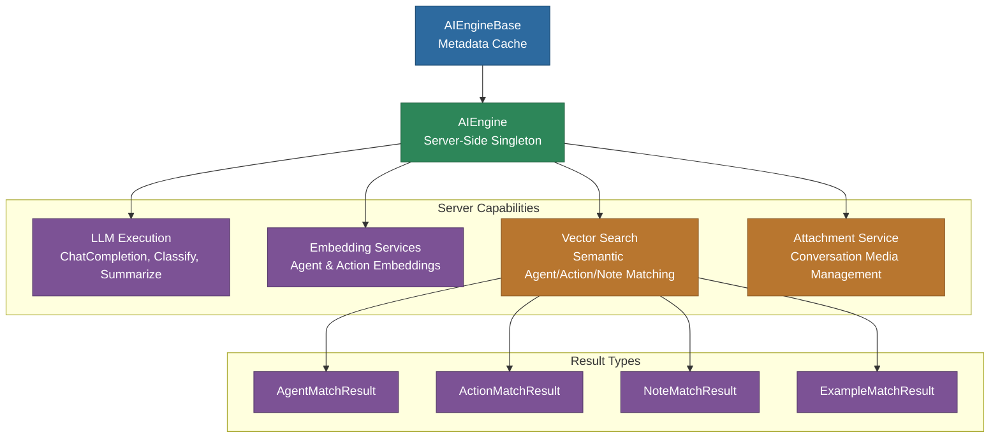

# @memberjunction/aiengine

Server-side AI Engine for MemberJunction. Wraps `AIEngineBase` and adds server-only capabilities including LLM execution, embedding generation, vector-based semantic search for agents and actions, and conversation attachment management. This package is the main orchestration layer for AI operations on the server.

## Architecture



## Installation

```bash
npm install @memberjunction/aiengine
```

**Note:** This package is server-side only. For metadata access on the client, use `@memberjunction/ai-engine-base` directly.

## Key Exports

### AIEngine (Singleton)

The main server-side engine. Uses composition (not inheritance) to delegate metadata operations to `AIEngineBase.Instance` while adding server-specific features.

```typescript
import { AIEngine } from '@memberjunction/aiengine';

// Initialize
await AIEngine.Instance.Config(false, contextUser);

// All AIEngineBase properties are delegated:
const models = AIEngine.Instance.Models;
const agents = AIEngine.Instance.Agents;
```

#### LLM Execution

```typescript
// Direct chat completion
const result = await AIEngine.Instance.ChatCompletion({
    model: 'gpt-4',
    messages: [{ role: 'user', content: 'Explain quantum computing' }]
});

// Summarize text
const summary = await AIEngine.Instance.SummarizeText({
    model: 'gpt-4',
    text: longDocument
});

// Classify text
const classification = await AIEngine.Instance.ClassifyText({
    model: 'gpt-4',
    text: inputText,
    categories: ['positive', 'negative', 'neutral']
});
```

#### Semantic Search

Find agents, actions, notes, and examples using vector similarity:

```typescript
// Find agents matching a user query
const agentMatches: AgentMatchResult[] = await AIEngine.Instance.FindSimilarAgents(
    'Help me analyze sales data',
    5,           // topK
    contextUser
);

// Find relevant actions
const actionMatches: ActionMatchResult[] = await AIEngine.Instance.FindSimilarActions(
    'Send an email notification',
    5,
    contextUser
);

// Find relevant notes for an agent
const noteMatches: NoteMatchResult[] = await AIEngine.Instance.FindSimilarNotes(
    agentId,
    'Customer wants a refund',
    10,
    contextUser
);

// Find relevant examples for an agent
const exampleMatches: ExampleMatchResult[] = await AIEngine.Instance.FindSimilarExamples(
    agentId,
    'How do I reset my password?',
    5,
    contextUser
);
```

### Embedding Services

| Class | Purpose |
|---|---|
| `AgentEmbeddingService` | Generates and manages embeddings for AI agents, enabling semantic agent discovery |
| `ActionEmbeddingService` | Generates and manages embeddings for actions, enabling semantic action matching |

### Match Result Types

| Type | Fields | Description |
|---|---|---|
| `AgentMatchResult` | `agent`, `score`, `metadata` | Agent found via semantic similarity |
| `ActionMatchResult` | `action`, `score`, `metadata` | Action found via semantic similarity |
| `NoteMatchResult` | `note`, `score`, `metadata` | Agent note found via semantic similarity |
| `ExampleMatchResult` | `example`, `score`, `metadata` | Agent example found via semantic similarity |

### ConversationAttachmentService

Manages media attachments (images, audio, video, files) in agent conversations:

```typescript
import { ConversationAttachmentService } from '@memberjunction/aiengine';

const service = new ConversationAttachmentService();

// Process uploaded attachments for a conversation
await service.ProcessAttachments(conversationId, attachments, contextUser);
```

## Usage Pattern

```typescript
import { AIEngine } from '@memberjunction/aiengine';

// 1. Initialize at server startup
await AIEngine.Instance.Config(false, contextUser);

// 2. Access metadata (delegated to AIEngineBase)
const model = AIEngine.Instance.Models.find(m => m.Name === 'GPT-4');
const agent = AIEngine.Instance.GetAgentByName('Sales Assistant');

// 3. Use server-side capabilities
const similar = await AIEngine.Instance.FindSimilarAgents(userQuery, 5, contextUser);
```

## Dependencies

- `@memberjunction/ai-engine-base` -- Base metadata cache (AIEngineBase)
- `@memberjunction/ai` -- Core AI abstractions (BaseLLM, BaseEmbeddings)
- `@memberjunction/ai-core-plus` -- Extended entity classes
- `@memberjunction/ai-vectors-memory` -- In-memory vector service for semantic search
- `@memberjunction/core` -- MJ framework core
- `@memberjunction/core-entities` -- Generated entity classes
- `@memberjunction/actions-base` -- Action framework integration
- `@memberjunction/storage` -- File storage integration for attachments
