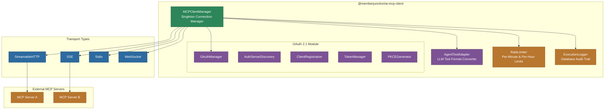

# @memberjunction/ai-mcp-client

MemberJunction MCP (Model Context Protocol) Client implementation for consuming tools from external MCP servers. Provides a singleton connection manager with support for multiple transport types, OAuth 2.1 authentication, rate limiting, execution logging, agent integration, and database-backed tool synchronization.

## Architecture



## Installation

```bash
npm install @memberjunction/ai-mcp-client
```

## Key Exports

### MCPClientManager (Singleton)

Central manager for all MCP server connections. Handles connection lifecycle, tool discovery, tool execution, and database synchronization.

```typescript
import { MCPClientManager } from '@memberjunction/ai-mcp-client';

const manager = MCPClientManager.Instance;

// Initialize (once at startup)
await manager.initialize(contextUser);

// Connect to an MCP server
await manager.connect('connection-id', { contextUser });

// List available tools
const tools = await manager.listTools('connection-id', { contextUser });

// Call a tool
const result = await manager.callTool('connection-id', 'tool-name', {
    arguments: { param1: 'value1' }
}, { contextUser });

// Sync tools to database (creates Action entities)
await manager.syncTools('connection-id', { contextUser });

// Disconnect
await manager.disconnect('connection-id', { contextUser });
```

### AgentToolAdapter

Converts MCP tools into LLM-compatible tool definitions (OpenAI function calling format, Anthropic tool use format):

```typescript
import { AgentToolAdapter, createAgentToolAdapter } from '@memberjunction/ai-mcp-client';

const adapter = createAgentToolAdapter(manager);

// Get tools in OpenAI format
const openaiTools = await adapter.getToolsForAgent('connection-id', {
    format: 'openai',
    contextUser
});

// Get tools in Anthropic format
const anthropicTools = await adapter.getToolsForAgent('connection-id', {
    format: 'anthropic',
    contextUser
});

// Execute a tool call from an LLM response
const result = await adapter.executeToolCall('connection-id', {
    name: 'tool-name',
    arguments: { param1: 'value1' }
}, { contextUser });
```

### RateLimiter

Per-connection rate limiting with request queuing:

```typescript
import { RateLimiter, RateLimiterRegistry } from '@memberjunction/ai-mcp-client';

// Rate limiters are automatically managed per connection
// Configure via MCPServerConnection entity fields:
// - RateLimitPerMinute
// - RateLimitPerHour
```

### ExecutionLogger

Database-backed execution logging for debugging and audit:

```typescript
import { ExecutionLogger } from '@memberjunction/ai-mcp-client';

const logger = new ExecutionLogger(loggingConfig);

// Get execution statistics
const stats: MCPExecutionStats = logger.GetStats();
const summary: MCPExecutionLogSummary = logger.GetSummary();
```

### OAuth 2.1 Module

Complete OAuth 2.1 implementation for authenticating with MCP servers:

| Class | Purpose |
|---|---|
| `OAuthManager` | Top-level OAuth flow orchestration |
| `AuthServerDiscovery` | RFC 8414 authorization server metadata discovery |
| `ClientRegistration` | RFC 7591 dynamic client registration |
| `TokenManager` | Token lifecycle (acquire, refresh, revoke) |
| `PKCEGenerator` | PKCE challenge/verifier generation |
| `OAuthAuditLogger` | Security audit logging |

```typescript
import { OAuthManager, OAuthAuthorizationRequiredError } from '@memberjunction/ai-mcp-client';

try {
    await manager.connect('oauth-connection-id', { contextUser });
} catch (error) {
    if (error instanceof OAuthAuthorizationRequiredError) {
        // Redirect user to authorization URL
        const authUrl = error.authorizationUrl;
        // After user authorizes, complete the flow
        await OAuthManager.Instance.completeAuthorization(code, state);
    }
}
```

### Type Definitions

The package exports comprehensive type definitions for all aspects of MCP client operations:

| Category | Key Types |
|---|---|
| Transport/Auth | `MCPTransportType`, `MCPAuthType`, `MCPServerStatus`, `MCPConnectionStatus` |
| Configuration | `MCPServerConfig`, `MCPConnectionConfig`, `MCPToolDefinition`, `MCPToolAnnotations` |
| Operations | `MCPCallToolOptions`, `MCPClientOptions`, `MCPConnectOptions` |
| Results | `MCPToolCallResult`, `MCPListToolsResult`, `MCPSyncToolsResult`, `MCPTestConnectionResult` |
| Rate Limiting | `RateLimitConfig`, `RateLimitState`, `QueuedRequest` |
| Events | `MCPClientEventType`, `MCPClientEvent`, `MCPClientEventListener` |

### Event System

Subscribe to connection and tool execution events:

```typescript
manager.addEventListener('tool-executed', (event) => {
    console.log(`Tool ${event.toolName} executed in ${event.durationMs}ms`);
});

manager.addEventListener('connection-status-changed', (event) => {
    console.log(`Connection ${event.connectionId}: ${event.status}`);
});
```

## Database Integration

The MCP Client integrates with MemberJunction entities:

- **MCP Servers** -- Registered MCP server definitions
- **MCP Server Connections** -- Per-user/per-company connection configurations
- **MCP Server Tools** -- Discovered tools synced from MCP servers
- **Actions** -- Auto-generated MJ Action entities from MCP tools (via `syncTools`)
- **Action Params** -- Tool parameters mapped to Action parameters

## Dependencies

- `@modelcontextprotocol/sdk` -- Official MCP SDK (client transports, types)
- `@memberjunction/core` -- MJ framework core
- `@memberjunction/core-entities` -- Generated entity classes
- `@memberjunction/credentials` -- Credential resolution for authentication
- `@memberjunction/global` -- Class factory
- `zod` -- Schema validation
