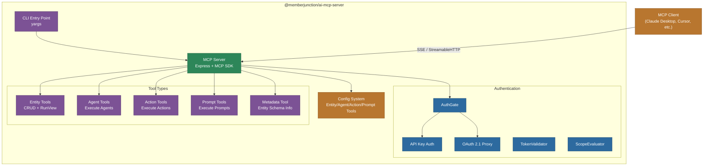

# @memberjunction/ai-mcp-server

MemberJunction's Model Context Protocol (MCP) server implementation. Exposes MemberJunction entities, AI agents, actions, and prompts as MCP tools that can be consumed by any MCP-compatible AI client (Claude Desktop, Cursor, custom integrations). Supports both SSE and StreamableHTTP transports, API key and OAuth 2.1 authentication, configurable tool filtering, and dynamic tool generation from entity metadata.

## Architecture



## Installation

```bash
npm install @memberjunction/ai-mcp-server
```

## Quick Start

```bash
# Start with all configured tools
npx @memberjunction/ai-mcp-server

# Start with tool filtering
npx @memberjunction/ai-mcp-server --include "Get_*,Run_Agent"

# Start excluding certain tools
npx @memberjunction/ai-mcp-server --include "Get_*" --exclude "Get_AuditLogs_*"

# List available tools without starting
npx @memberjunction/ai-mcp-server --list-tools

# Load filter config from file
npx @memberjunction/ai-mcp-server --tools-file ./my-tools.json
```

## Tool Types

### Entity Tools

Dynamically generated from MemberJunction entity metadata. For each configured entity, the server creates:

| Tool Pattern | Description |
|---|---|
| `Get_<Entity>_Record` | Retrieve a single record by primary key |
| `Get_<Entity>_Records` | Query records with filtering, sorting, field selection |
| `Create_<Entity>_Record` | Create a new entity record |
| `Update_<Entity>_Record` | Update an existing record |
| `Delete_<Entity>_Record` | Delete a record by primary key |
| `RunView_<Entity>` | Execute a view with ExtraFilter, OrderBy, Fields, MaxRows |

### Agent Tools

| Tool | Description |
|---|---|
| `Run_Agent` | Execute any configured MemberJunction AI agent with conversation history and template data |

### Action Tools

| Tool Pattern | Description |
|---|---|
| `Run_<Action>_Action` | Execute a configured MemberJunction action with parameters |

### Prompt Tools

| Tool Pattern | Description |
|---|---|
| `Run_<Prompt>_Prompt` | Execute a configured AI prompt with template data |

### Metadata Tool

| Tool | Description |
|---|---|
| `Get_All_Entity_Metadata` | Retrieve all entity metadata including fields, relationships, and field types |

## Configuration

Configuration is loaded from `mj.config.cjs` or environment variables. Key settings:

```javascript
module.exports = {
    mcpServerSettings: {
        port: 3100,
        entities: [
            { entityName: 'Users', operations: ['get', 'list', 'create', 'update', 'delete', 'runview'] },
            { entityName: 'Companies', operations: ['get', 'list', 'runview'] }
        ],
        agents: [
            { agentId: 'agent-uuid', name: 'Sales Assistant' }
        ],
        actions: [
            { actionId: 'action-uuid', name: 'Send Email' }
        ],
        prompts: [
            { promptId: 'prompt-uuid', name: 'Summarize Content' }
        ]
    }
};
```

## Authentication

### API Key Authentication

The server authenticates requests using MemberJunction API keys. The API key is passed via the `x-api-key` header and maps to a MemberJunction user context.

### OAuth 2.1 (Optional)

When configured, the server acts as both an OAuth resource server and an OAuth proxy:

- **RFC 9728**: Protected Resource Metadata at `/.well-known/oauth-protected-resource`
- **RFC 8414**: Authorization Server Metadata discovery
- **RFC 7591**: Dynamic Client Registration
- **PKCE**: Required for all authorization code flows
- **Scope Evaluation**: Tool-level access control via OAuth scopes

The OAuth proxy handles the authorization flow for MCP clients that don't natively support OAuth, proxying between the client and your identity provider.

## Tool Filtering

Filter which tools are exposed using glob-style patterns:

```json
{
    "include": ["Get_*", "Run_Agent", "RunView_Users"],
    "exclude": ["*_AuditLogs_*", "Delete_*"]
}
```

Patterns support:
- `*` -- Match any characters
- `prefix*` -- Match tools starting with prefix
- `*suffix` -- Match tools ending with suffix
- `*contains*` -- Match tools containing text

## CLI Options

| Option | Alias | Description |
|---|---|---|
| `--include` | `-i` | Comma-separated include patterns |
| `--exclude` | `-e` | Comma-separated exclude patterns |
| `--tools-file` | `-f` | Path to JSON filter config file |
| `--list-tools` | `-l` | List tools and exit |
| `--help` | `-h` | Show help |
| `--version` | `-v` | Show version |

## Dependencies

- `@modelcontextprotocol/sdk` -- Official MCP SDK (server, transports)
- `@memberjunction/ai-agents` -- AgentRunner for agent execution
- `@memberjunction/ai-prompts` -- AIPromptRunner for prompt execution
- `@memberjunction/ai-core-plus` -- Extended entity classes
- `@memberjunction/aiengine` -- AIEngine for metadata
- `@memberjunction/actions` / `@memberjunction/actions-base` -- Action execution
- `@memberjunction/server` -- MJ server authentication
- `@memberjunction/server-bootstrap-lite` -- Class registration manifest
- `@memberjunction/sqlserver-dataprovider` -- SQL Server data access
- `@memberjunction/api-keys` -- API key validation
- `@memberjunction/credentials` -- Credential management
- `@memberjunction/config` -- Configuration loading
- `express` -- HTTP server framework
- `jsonwebtoken` / `jwks-rsa` -- JWT validation for OAuth
- `yargs` -- CLI argument parsing
- `zod` -- Schema validation
